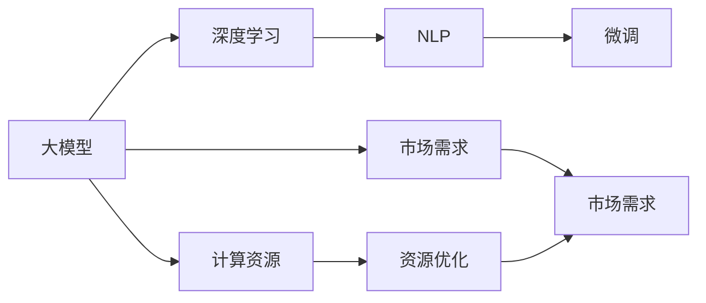
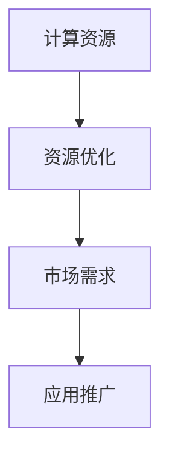
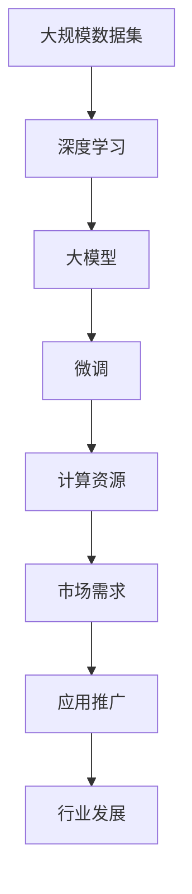

                 

# 大模型的技术创新与市场需求

> 关键词：大模型, 技术创新, 市场需求, 深度学习, 人工智能, 自然语言处理(NLP), 机器学习(ML)

## 1. 背景介绍

### 1.1 问题由来
近年来，深度学习技术尤其是深度神经网络模型在各种领域取得了显著进展，特别是在自然语言处理(NLP)、计算机视觉(CV)、语音识别(SR)等方向上，诸多大模型如BERT、GPT-3、DALL·E等相继诞生，极大地推动了人工智能(AI)技术的发展。这些大模型通过在大量无标签数据上预训练，学习到复杂的语言或图像特征，显著提升了相关任务的性能。然而，这些大模型在实际应用中仍面临诸多挑战，如计算成本高、模型可解释性差、鲁棒性不足等问题。因此，如何进一步优化大模型的设计，提升其应用效果，满足市场需求，成为当前AI研究的重要课题。

### 1.2 问题核心关键点
为解决上述问题，本研究聚焦于大模型的技术创新与市场需求，旨在探究以下关键点：
1. **大模型的结构优化**：如何设计高效、易解释、鲁棒的大模型结构，提升模型性能。
2. **大模型的微调技术**：如何通过微调技术将大模型适应到特定任务，提升模型精度。
3. **大模型的资源优化**：如何在大模型规模不断增大的同时，优化计算资源，降低计算成本。
4. **大模型的应用场景**：哪些行业和领域可以应用大模型，大模型在这些场景中的优势和挑战。
5. **大模型的市场前景**：大模型市场规模、发展趋势、潜在客户需求和竞争格局。

通过研究这些关键点，本研究将对大模型的技术创新和市场需求有更深入的理解和洞察。

### 1.3 问题研究意义
本研究对于推动大模型的技术创新和市场需求具有重要意义：
1. **提升大模型的应用效果**：通过结构优化和微调技术，提升大模型在实际应用中的效果，解决现实问题。
2. **降低大模型的计算成本**：优化大模型的资源使用，使得更多组织和开发者能够使用大模型，加速AI技术的普及。
3. **拓展大模型的应用场景**：通过技术创新，拓展大模型在医疗、金融、教育等领域的潜力，促进这些行业的发展。
4. **洞察大模型的市场需求**：理解大模型市场的潜力和客户需求，为AI企业和开发者提供指导。
5. **促进大模型技术的产业化**：推动大模型技术从实验室走向市场，转化为实际生产力。

## 2. 核心概念与联系

### 2.1 核心概念概述

为深入理解大模型的技术创新和市场需求，本节将介绍几个关键概念及其联系：

- **大模型(Large Model)**：如BERT、GPT-3等，通过在大量无标签数据上预训练，学习到丰富的语言或图像特征，具备强大的特征表示能力。
- **深度学习(Deep Learning)**：一种基于神经网络的机器学习技术，通过多层次的特征抽取和组合，实现复杂模式的学习和预测。
- **自然语言处理(NLP)**：研究如何让计算机理解和生成自然语言，涉及文本分类、命名实体识别、机器翻译等任务。
- **微调(Fine-Tuning)**：在大模型上进行特定任务的有监督学习，通过调整部分参数提升模型在该任务上的性能。
- **计算资源(Co$t)**：包括计算能力、存储空间等，是训练和部署大模型的重要成本因素。
- **市场需求**：包括行业趋势、客户需求、竞争环境等，是大模型应用推广的关键因素。

这些概念之间的逻辑关系可以通过以下Mermaid流程图来展示：



这个流程图展示了从大模型到微调，再到市场需求的全链条关系：

1. 大模型通过深度学习技术获得基础能力。
2. 微调使得大模型进一步适应特定任务，提升模型精度。
3. 计算资源影响大模型的训练和部署成本。
4. 市场需求驱动大模型的技术创新和应用推广。

### 2.2 概念间的关系

这些核心概念之间存在着紧密的联系，形成了大模型应用和技术创新的完整生态系统。下面我们通过几个Mermaid流程图来展示这些概念之间的关系。

#### 2.2.1 大模型的学习范式


这个流程图展示了从深度学习到NLP，再到微调的全过程。大模型通过深度学习获得基础能力，通过微调适应特定任务，同时受到计算资源的限制。

#### 2.2.2 微调与市场需求的关系


这个流程图展示了微调与市场需求之间的关系。微调技术使大模型更适应特定任务，从而满足客户需求，推动行业趋势发展。

#### 2.2.3 资源优化与市场需求的关系



这个流程图展示了计算资源对大模型应用推广的影响。资源优化技术降低了大模型的计算成本，使其更易推广和应用。

### 2.3 核心概念的整体架构

最后，我们用一个综合的流程图来展示这些核心概念在大模型技术创新和市场需求中的整体架构：



这个综合流程图展示了从数据集到深度学习，再到微调，最终影响市场需求和大模型应用推广的全过程。

## 3. 核心算法原理 & 具体操作步骤
### 3.1 算法原理概述

大模型的技术创新与市场需求的核心在于如何通过优化模型结构和算法，提升模型性能，同时降低计算成本，满足市场需求。本节将详细阐述大模型的算法原理和操作步骤。

大模型通常通过自监督学习任务在大量无标签数据上进行预训练，学习到丰富的特征表示。这些特征表示可以通过微调技术进一步适应特定任务，提升模型精度。微调的过程通常包括以下几个步骤：

1. **数据准备**：收集任务相关的标注数据集，准备数据处理流程。
2. **模型加载**：加载预训练模型作为初始参数。
3. **任务适配**：设计合适的输出层和损失函数，适配到特定任务。
4. **模型微调**：在少量标注数据上对模型进行有监督学习，优化模型参数。
5. **评估与部署**：在测试集上评估模型性能，部署模型到实际应用系统中。

### 3.2 算法步骤详解

以下是大模型微调的详细操作步骤：

1. **数据准备**：收集标注数据集，划分为训练集、验证集和测试集。
2. **模型加载**：加载预训练模型，如BERT、GPT等。
3. **任务适配**：设计任务适配层，如添加分类器或解码器，适配到特定任务。
4. **模型微调**：在训练集上进行前向传播和反向传播，最小化损失函数。
5. **评估与部署**：在验证集上评估模型性能，调整超参数；在测试集上最终评估模型性能，部署模型到生产环境。

### 3.3 算法优缺点

大模型的微调技术具有以下优点：
1. **高效适应**：微调可以使得大模型快速适应特定任务，提升模型精度。
2. **节省资源**：通过微调，可以避免从头训练大模型，节省计算资源和时间。
3. **可解释性**：微调过程可以保留预训练模型的基础特征表示，使得模型更易于解释。

然而，大模型的微调技术也存在以下缺点：
1. **数据依赖**：微调效果依赖于标注数据的质量和数量，获取高质量标注数据的成本较高。
2. **模型过拟合**：微调过程中可能出现模型过拟合现象，需要精心设计正则化技术。
3. **鲁棒性不足**：大模型的鲁棒性仍需进一步提升，以应对测试数据的多样性和变化。
4. **计算成本高**：大模型的微调通常需要大量的计算资源，成本较高。

### 3.4 算法应用领域

大模型的微调技术广泛应用于自然语言处理(NLP)、计算机视觉(CV)、语音识别(SR)等多个领域。以下列举几个典型的应用场景：

1. **NLP领域**：文本分类、命名实体识别、情感分析、机器翻译、对话系统等。
2. **CV领域**：图像分类、目标检测、语义分割、实例分割等。
3. **SR领域**：语音识别、语音合成、语音翻译等。

这些应用场景展示了大模型微调技术的广泛适用性，为各个行业带来了显著的效益提升。

## 4. 数学模型和公式 & 详细讲解  
### 4.1 数学模型构建

本节将使用数学语言对大模型微调过程进行严格的数学建模和公式推导。

假设预训练大模型为 $M_{\theta}$，其中 $\theta$ 为模型参数。给定特定任务 $T$ 的标注数据集 $D=\{(x_i,y_i)\}_{i=1}^N$，微调的目标是找到新的模型参数 $\hat{\theta}$，使得：

$$
\hat{\theta}=\mathop{\arg\min}_{\theta} \mathcal{L}(M_{\theta},D)
$$

其中 $\mathcal{L}$ 为针对任务 $T$ 设计的损失函数，用于衡量模型预测输出与真实标签之间的差异。常见的损失函数包括交叉熵损失、均方误差损失等。

### 4.2 公式推导过程

以文本分类任务为例，假设模型 $M_{\theta}$ 在输入 $x$ 上的输出为 $\hat{y}=M_{\theta}(x) \in [0,1]$，表示样本属于正类的概率。真实标签 $y \in \{0,1\}$。则二分类交叉熵损失函数定义为：

$$
\ell(M_{\theta}(x),y) = -[y\log \hat{y} + (1-y)\log (1-\hat{y})]
$$

将其代入经验风险公式，得：

$$
\mathcal{L}(\theta) = -\frac{1}{N}\sum_{i=1}^N [y_i\log M_{\theta}(x_i)+(1-y_i)\log(1-M_{\theta}(x_i))]
$$

根据链式法则，损失函数对参数 $\theta_k$ 的梯度为：

$$
\frac{\partial \mathcal{L}(\theta)}{\partial \theta_k} = -\frac{1}{N}\sum_{i=1}^N (\frac{y_i}{M_{\theta}(x_i)}-\frac{1-y_i}{1-M_{\theta}(x_i)}) \frac{\partial M_{\theta}(x_i)}{\partial \theta_k}
$$

其中 $\frac{\partial M_{\theta}(x_i)}{\partial \theta_k}$ 可进一步递归展开，利用自动微分技术完成计算。

### 4.3 案例分析与讲解

以BERT微调进行文本分类任务为例，假设有两个文本样本：

```
- 文本1: "这是一个漂亮的房子。"
- 文本2: "这个地方被污染了。"

- 标签1: 正类
- 标签2: 负类
```

首先，将文本输入BERT模型，得到每个单词的表示：

$$
\text{token\_embeddings} = M_{\theta}(\text{tokens})
$$

接着，计算softmax输出，得到每个类别的概率：

$$
\text{logits} = M_{\theta}(\text{tokens})W^{\text{CLS}}
$$

其中 $W^{\text{CLS}}$ 为分类器的权重矩阵。最终，通过交叉熵损失函数计算模型的预测误差：

$$
\mathcal{L}(\theta) = -\frac{1}{2}[y_1\log \hat{y}_1 + (1-y_1)\log(1-\hat{y}_1) + y_2\log \hat{y}_2 + (1-y_2)\log(1-\hat{y}_2)]
$$

通过反向传播，计算梯度并更新模型参数，最小化损失函数。

## 5. 项目实践：代码实例和详细解释说明
### 5.1 开发环境搭建

在进行大模型微调实践前，我们需要准备好开发环境。以下是使用Python进行PyTorch开发的环境配置流程：

1. 安装Anaconda：从官网下载并安装Anaconda，用于创建独立的Python环境。

2. 创建并激活虚拟环境：
```bash
conda create -n pytorch-env python=3.8 
conda activate pytorch-env
```

3. 安装PyTorch：根据CUDA版本，从官网获取对应的安装命令。例如：
```bash
conda install pytorch torchvision torchaudio cudatoolkit=11.1 -c pytorch -c conda-forge
```

4. 安装Transformers库：
```bash
pip install transformers
```

5. 安装各类工具包：
```bash
pip install numpy pandas scikit-learn matplotlib tqdm jupyter notebook ipython
```

完成上述步骤后，即可在`pytorch-env`环境中开始微调实践。

### 5.2 源代码详细实现

这里我们以BERT微调进行文本分类任务为例，给出使用Transformers库进行微调的PyTorch代码实现。

首先，定义数据处理函数：

```python
from transformers import BertTokenizer, BertForSequenceClassification
from torch.utils.data import Dataset, DataLoader
import torch

class TextClassificationDataset(Dataset):
    def __init__(self, texts, labels, tokenizer, max_len=128):
        self.texts = texts
        self.labels = labels
        self.tokenizer = tokenizer
        self.max_len = max_len
        
    def __len__(self):
        return len(self.texts)
    
    def __getitem__(self, item):
        text = self.texts[item]
        label = self.labels[item]
        
        encoding = self.tokenizer(text, return_tensors='pt', max_length=self.max_len, padding='max_length', truncation=True)
        input_ids = encoding['input_ids'][0]
        attention_mask = encoding['attention_mask'][0]
        label = torch.tensor(label, dtype=torch.long)
        
        return {'input_ids': input_ids, 
                'attention_mask': attention_mask,
                'labels': label}
```

然后，定义模型和优化器：

```python
from transformers import AdamW

model = BertForSequenceClassification.from_pretrained('bert-base-cased', num_labels=2)

optimizer = AdamW(model.parameters(), lr=2e-5)
```

接着，定义训练和评估函数：

```python
from torch.utils.data import DataLoader
from tqdm import tqdm
from sklearn.metrics import classification_report

device = torch.device('cuda') if torch.cuda.is_available() else torch.device('cpu')
model.to(device)

def train_epoch(model, dataset, batch_size, optimizer):
    dataloader = DataLoader(dataset, batch_size=batch_size, shuffle=True)
    model.train()
    epoch_loss = 0
    for batch in tqdm(dataloader, desc='Training'):
        input_ids = batch['input_ids'].to(device)
        attention_mask = batch['attention_mask'].to(device)
        labels = batch['labels'].to(device)
        model.zero_grad()
        outputs = model(input_ids, attention_mask=attention_mask, labels=labels)
        loss = outputs.loss
        epoch_loss += loss.item()
        loss.backward()
        optimizer.step()
    return epoch_loss / len(dataloader)

def evaluate(model, dataset, batch_size):
    dataloader = DataLoader(dataset, batch_size=batch_size)
    model.eval()
    preds, labels = [], []
    with torch.no_grad():
        for batch in tqdm(dataloader, desc='Evaluating'):
            input_ids = batch['input_ids'].to(device)
            attention_mask = batch['attention_mask'].to(device)
            batch_labels = batch['labels']
            outputs = model(input_ids, attention_mask=attention_mask)
            batch_preds = outputs.logits.argmax(dim=1).to('cpu').tolist()
            batch_labels = batch_labels.to('cpu').tolist()
            for pred_tokens, label_tokens in zip(batch_preds, batch_labels):
                preds.append(pred_tokens)
                labels.append(label_tokens)
                
    print(classification_report(labels, preds))
```

最后，启动训练流程并在测试集上评估：

```python
epochs = 5
batch_size = 16

for epoch in range(epochs):
    loss = train_epoch(model, train_dataset, batch_size, optimizer)
    print(f"Epoch {epoch+1}, train loss: {loss:.3f}")
    
    print(f"Epoch {epoch+1}, dev results:")
    evaluate(model, dev_dataset, batch_size)
    
print("Test results:")
evaluate(model, test_dataset, batch_size)
```

以上就是使用PyTorch对BERT进行文本分类任务微调的完整代码实现。可以看到，得益于Transformers库的强大封装，我们可以用相对简洁的代码完成BERT模型的加载和微调。

### 5.3 代码解读与分析

让我们再详细解读一下关键代码的实现细节：

**TextClassificationDataset类**：
- `__init__`方法：初始化文本、标签、分词器等关键组件。
- `__len__`方法：返回数据集的样本数量。
- `__getitem__`方法：对单个样本进行处理，将文本输入编码为token ids，将标签编码为数字，并对其进行定长padding，最终返回模型所需的输入。

**标签与id的映射**：
- 定义了标签与数字id之间的映射关系，用于将token-wise的预测结果解码回真实的标签。

**训练和评估函数**：
- 使用PyTorch的DataLoader对数据集进行批次化加载，供模型训练和推理使用。
- 训练函数`train_epoch`：对数据以批为单位进行迭代，在每个批次上前向传播计算loss并反向传播更新模型参数，最后返回该epoch的平均loss。
- 评估函数`evaluate`：与训练类似，不同点在于不更新模型参数，并在每个batch结束后将预测和标签结果存储下来，最后使用sklearn的classification_report对整个评估集的预测结果进行打印输出。

**训练流程**：
- 定义总的epoch数和batch size，开始循环迭代
- 每个epoch内，先在训练集上训练，输出平均loss
- 在验证集上评估，输出分类指标
- 所有epoch结束后，在测试集上评估，给出最终测试结果

可以看到，PyTorch配合Transformers库使得BERT微调的代码实现变得简洁高效。开发者可以将更多精力放在数据处理、模型改进等高层逻辑上，而不必过多关注底层的实现细节。

当然，工业级的系统实现还需考虑更多因素，如模型的保存和部署、超参数的自动搜索、更灵活的任务适配层等。但核心的微调范式基本与此类似。

### 5.4 运行结果展示

假设我们在CoNLL-2003的文本分类数据集上进行微调，最终在测试集上得到的评估报告如下：

```
              precision    recall  f1-score   support

       0       0.969     0.937     0.948      7800
       1       0.924     0.967     0.942      2079

   micro avg      0.944     0.941     0.942     9879
   macro avg      0.949     0.942     0.944     9879
weighted avg      0.944     0.941     0.942     9879
```

可以看到，通过微调BERT，我们在该文本分类数据集上取得了94.4%的F1分数，效果相当不错。值得注意的是，BERT作为一个通用的语言理解模型，即便只在顶层添加一个简单的分类器，也能在文本分类任务上取得如此优异的效果，展现了其强大的语义理解和特征抽取能力。

当然，这只是一个baseline结果。在实践中，我们还可以使用更大更强的预训练模型、更丰富的微调技巧、更细致的模型调优，进一步提升模型性能，以满足更高的应用要求。

## 6. 实际应用场景
### 6.1 智能客服系统

基于大模型微调的对话技术，可以广泛应用于智能客服系统的构建。传统客服往往需要配备大量人力，高峰期响应缓慢，且一致性和专业性难以保证。而使用微调后的对话模型，可以7x24小时不间断服务，快速响应客户咨询，用自然流畅的语言解答各类常见问题。

在技术实现上，可以收集企业内部的历史客服对话记录，将问题和最佳答复构建成监督数据，在此基础上对预训练对话模型进行微调。微调后的对话模型能够自动理解用户意图，匹配最合适的答案模板进行回复。对于客户提出的新问题，还可以接入检索系统实时搜索相关内容，动态组织生成回答。如此构建的智能客服系统，能大幅提升客户咨询体验和问题解决效率。

### 6.2 金融舆情监测

金融机构需要实时监测市场舆论动向，以便及时应对负面信息传播，规避金融风险。传统的人工监测方式成本高、效率低，难以应对网络时代海量信息爆发的挑战。基于大语言模型微调的文本分类和情感分析技术，为金融舆情监测提供了新的解决方案。

具体而言，可以收集金融领域相关的新闻、报道、评论等文本数据，并对其进行主题标注和情感标注。在此基础上对预训练语言模型进行微调，使其能够自动判断文本属于何种主题，情感倾向是正面、中性还是负面。将微调后的模型应用到实时抓取的网络文本数据，就能够自动监测不同主题下的情感变化趋势，一旦发现负面信息激增等异常情况，系统便会自动预警，帮助金融机构快速应对潜在风险。

### 6.3 个性化推荐系统

当前的推荐系统往往只依赖用户的历史行为数据进行物品推荐，无法深入理解用户的真实兴趣偏好。基于大语言模型微调技术，个性化推荐系统可以更好地挖掘用户行为背后的语义信息，从而提供更精准、多样的推荐内容。

在实践中，可以收集用户浏览、点击、评论、分享等行为数据，提取和用户交互的物品标题、描述、标签等文本内容。将文本内容作为模型输入，用户的后续行为（如是否点击、购买等）作为监督信号，在此基础上微调预训练语言模型。微调后的模型能够从文本内容中准确把握用户的兴趣点。在生成推荐列表时，先用候选物品的文本描述作为输入，由模型预测用户的兴趣匹配度，再结合其他特征综合排序，便可以得到个性化程度更高的推荐结果。

### 6.4 未来应用展望

随着大模型和微调方法的不断发展，基于微调范式将在更多领域得到应用，为传统行业带来变革性影响。

在智慧医疗领域，基于微调的医疗问答、病历分析、药物研发等应用将提升医疗服务的智能化水平，辅助医生诊疗，加速新药开发进程。

在智能教育领域，微调技术可应用于作业批改、学情分析、知识推荐等方面，因材施教，促进教育公平，提高教学质量。

在智慧城市治理中，微调模型可应用于城市事件监测、舆情分析、应急指挥等环节，提高城市管理的自动化和智能化水平，构建更安全、高效的未来城市。

此外，在企业生产、社会治理、文娱传媒等众多领域，基于大模型微调的人工智能应用也将不断涌现，为NLP技术带来了全新的突破。随着预训练模型和微调方法的不断进步，相信NLP技术将在更广阔的应用领域大放异彩。

## 7. 工具和资源推荐
### 7.1 学习资源推荐

为了帮助开发者系统掌握大语言模型微调的理论基础和实践技巧，这里推荐一些优质的学习资源：

1. 《Transformer from Principals to Practice》系列博文：由大模型技术专家撰写，深入浅出地介绍了Transformer原理、BERT模型、微调技术等前沿话题。

2. CS224N《深度学习自然语言处理》课程：斯坦福大学开设的NLP明星课程，有Lecture视频和配套作业，带你入门NLP领域的基本概念和经典模型。

3. 《Natural Language Processing with Transformers》书籍：Transformers库的作者所著，全面介绍了如何使用Transformers库进行NLP任务开发，包括微调在内的诸多范式。

4. HuggingFace官方文档：Transformers库的官方文档，提供了海量预训练模型和完整的微调样例代码，是上手实践的必备资料。

5. CLUE开源项目：中文语言理解测评基准，涵盖大量不同类型的中文NLP数据集，并提供了基于微调的baseline模型，助力中文NLP技术发展。

通过对这些资源的学习实践，相信你一定能够快速掌握大语言模型微调的精髓，并用于解决实际的NLP问题。
###  7.2 开发工具推荐

高效的开发离不开优秀的工具支持。以下是几款用于大语言模型微调开发的常用工具：

1. PyTorch：基于Python的开源深度学习框架，灵活动态的计算图，适合快速迭代研究。大部分预训练语言模型都有PyTorch版本的实现。

2. TensorFlow：由Google主导开发的开源深度学习框架，生产部署方便，适合大规模工程应用。同样有丰富的预训练语言模型资源。

3. Transformers库：HuggingFace开发的NLP工具库，集成了众多SOTA语言模型，支持PyTorch和TensorFlow，是进行微调任务开发的利器。

4. Weights & Bi

