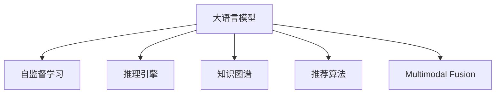
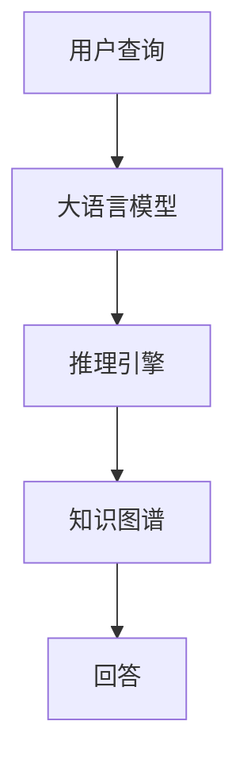
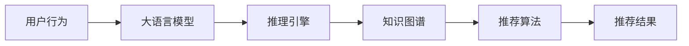
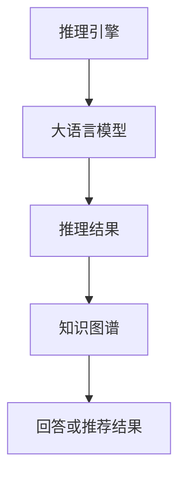
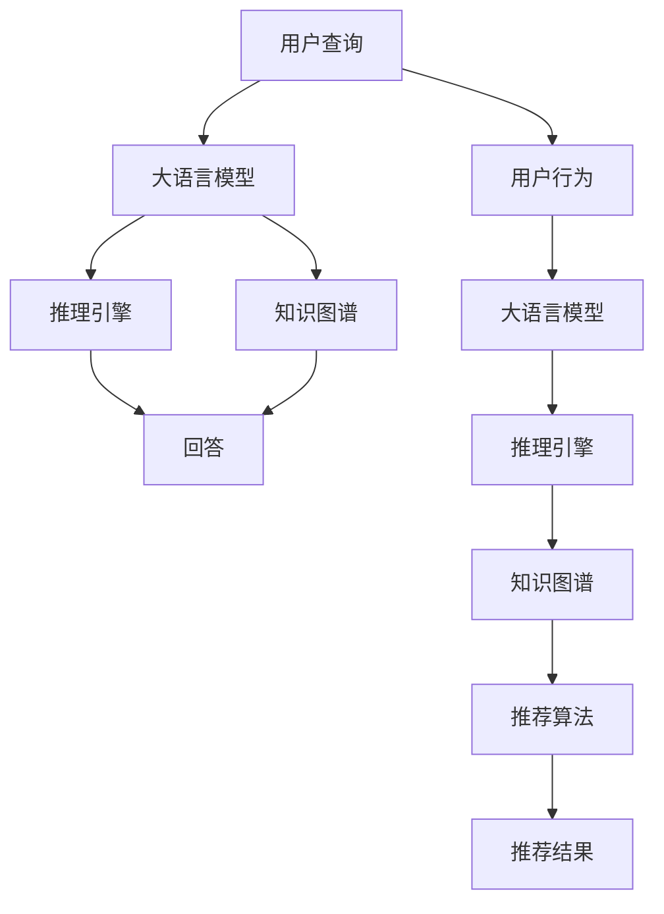

                 

# 大模型问答机器人与传统搜索推荐的处理方式

> 关键词：大模型,问答机器人,搜索推荐,深度学习,自然语言处理(NLP),推理引擎,嵌入式系统,跨领域应用

## 1. 背景介绍

随着人工智能技术的不断发展，智能问答和推荐系统已经成为了互联网应用的重要组成部分。传统的问答和推荐系统通常基于搜索引擎或推荐算法，依赖于查询语句或用户行为的精确匹配。然而，随着用户需求的多样化和个性化，传统的搜索推荐方式显得日益不足。相比之下，基于大语言模型的人工智能技术，尤其是问答机器人，因其更强的语义理解和推理能力，在提供个性化和高质量服务方面展现出了巨大的潜力。

### 1.1 问题由来

在传统搜索推荐系统中，用户通过关键词查询获取信息，系统通过搜索和筛选算法匹配相关信息并返回结果。这种方法在处理结构化数据时较为有效，但在处理半结构化和非结构化数据时，由于缺乏对语义的理解和推理能力，常常难以满足用户的深层次需求。而大语言模型，如BERT、GPT等，通过在大规模无标签文本数据上自监督预训练，学习到了丰富的语言知识和常识，可以更自然地理解和生成自然语言，从而在问答和推荐等复杂任务中取得了更好的效果。

### 1.2 问题核心关键点

目前，基于大语言模型的问答和推荐系统已经成为智能应用的热点方向，具有以下关键特点：

- **语义理解能力**：能够理解自然语言的复杂语义，包括隐含的语境、情感和意图等。
- **动态生成**：基于用户的输入，生成动态的、个性化的答案或推荐。
- **跨领域适应**：具备跨领域的知识整合能力，能够应对不同领域下的复杂问题。
- **高效推理**：通过逻辑推理和推断，快速找到相关信息并生成答案。
- **连续学习**：能够从新的数据中不断学习和优化，保持模型的时效性。

### 1.3 问题研究意义

大语言模型在问答和推荐中的应用，能够显著提升用户体验，降低应用开发成本，缩短应用部署周期，推动人工智能技术的普及和应用。在金融、医疗、教育等多个垂直领域，大模型问答和推荐技术具有广阔的应用前景，为各行各业带来了颠覆性的变革。

## 2. 核心概念与联系

### 2.1 核心概念概述

为了更好地理解大语言模型在问答和推荐中的应用，本节将介绍几个密切相关的核心概念：

- **大语言模型(Large Language Model, LLM)**：如BERT、GPT等大规模预训练语言模型。通过在大规模无标签文本数据上进行自监督预训练，学习到丰富的语言知识和常识，具备强大的语言理解和生成能力。

- **自监督学习(Self-Supervised Learning)**：指通过利用数据中的潜在结构，如语言模型预测下一个词或掩码词预测等，在没有标注数据的情况下进行模型训练的方法。

- **推理引擎(Reasoning Engine)**：指能够理解和执行推理任务的计算引擎，如自然语言推理引擎、逻辑推理引擎等。

- **知识图谱(Knowledge Graph)**：通过结构化的方式，将现实世界的信息进行映射和关联，形成易于计算机处理的知识表示形式。

- **推荐算法(Recommendation Algorithm)**：基于用户行为数据或物品特征，预测用户对物品的偏好，并进行推荐排序的算法。

- **多模态融合(Multimodal Fusion)**：指将文本、图像、语音等多种模态信息进行融合，提升系统的综合理解能力。

这些核心概念之间的逻辑关系可以通过以下Mermaid流程图来展示：



这个流程图展示了大语言模型与其他核心概念之间的联系：

1. 大语言模型通过自监督学习获得基础知识，并利用推理引擎进行逻辑推理。
2. 知识图谱和大语言模型相结合，进一步提升模型的理解和推理能力。
3. 推荐算法基于大语言模型的语义理解，实现更加个性化的推荐。
4. 多模态融合使系统能够处理多种信息，提高系统的综合表现。

### 2.2 概念间的关系

这些核心概念之间存在着紧密的联系，形成了大语言模型在问答和推荐领域的应用框架。下面我通过几个Mermaid流程图来展示这些概念之间的关系。

#### 2.2.1 大语言模型在问答中的应用



这个流程图展示了基于大语言模型的问答系统的工作流程：

1. 用户输入查询语句。
2. 大语言模型通过推理引擎，结合知识图谱进行推理，找到相关信息。
3. 推理引擎根据推理结果，生成回答。

#### 2.2.2 大语言模型在推荐中的应用



这个流程图展示了基于大语言模型的推荐系统的工作流程：

1. 用户的行为数据输入大语言模型。
2. 大语言模型通过推理引擎，结合知识图谱进行推理，生成推荐理由。
3. 推荐算法根据推荐理由进行排序，产生推荐结果。

#### 2.2.3 推理引擎与大语言模型的协同



这个流程图展示了推理引擎与大语言模型的协同工作：

1. 推理引擎提供推理结果。
2. 大语言模型结合推理结果，进行语义理解和生成。
3. 知识图谱辅助理解更深入的信息。
4. 生成最终的回答或推荐结果。

### 2.3 核心概念的整体架构

最后，我们用一个综合的流程图来展示这些核心概念在大语言模型问答和推荐中的应用：



这个综合流程图展示了从用户输入到最终回答或推荐结果的全过程。大语言模型通过推理引擎和知识图谱的协同，进行语义理解和生成，从而提供个性化和高质量的服务。同时，大语言模型在推荐系统中，通过结合用户行为数据，生成动态的、个性化的推荐结果。通过这些流程图，我们可以更清晰地理解大语言模型在问答和推荐中的工作原理和优化方向。

## 3. 核心算法原理 & 具体操作步骤
### 3.1 算法原理概述

基于大语言模型的问答和推荐系统，本质上是一种基于语义理解和推理的智能应用。其核心思想是：将大语言模型作为推理引擎，通过理解用户查询或行为数据，结合知识图谱和推理引擎，生成个性化且准确的答案或推荐。

形式化地，假设用户查询或行为数据为 $X$，大语言模型为 $M_{\theta}$，推理引擎为 $R$，知识图谱为 $G$。则问答和推荐过程可以表示为：

$$
\text{Answer}(X) = M_{\theta}(X) \to R(X, G)
$$

其中 $\to$ 表示推理引擎的推理过程。问答系统的答案 $Answer$ 由大语言模型生成并经过推理引擎解释。推荐系统的推荐结果 $R(X, G)$ 由大语言模型生成并经过推理引擎排序。

### 3.2 算法步骤详解

基于大语言模型的问答和推荐系统一般包括以下几个关键步骤：

**Step 1: 准备预训练模型和数据集**
- 选择合适的预训练语言模型 $M_{\theta}$，如BERT、GPT等，作为初始化参数。
- 准备问答或推荐任务的数据集 $D_X$，包含用户的查询或行为数据。
- 构建知识图谱 $G$，用于辅助推理和知识整合。

**Step 2: 设计任务适配层**
- 根据任务类型，在预训练模型顶层设计合适的输出层和损失函数。
- 对于问答任务，通常在顶层添加线性分类器和交叉熵损失函数。
- 对于推荐任务，通常使用语言模型的解码器输出概率分布，并以负对数似然为损失函数。

**Step 3: 设置微调超参数**
- 选择合适的优化算法及其参数，如 AdamW、SGD 等，设置学习率、批大小、迭代轮数等。
- 设置正则化技术及强度，包括权重衰减、Dropout、Early Stopping 等。
- 确定冻结预训练参数的策略，如仅微调顶层，或全部参数都参与微调。

**Step 4: 执行梯度训练**
- 将训练集数据分批次输入模型，前向传播计算损失函数。
- 反向传播计算参数梯度，根据设定的优化算法和学习率更新模型参数。
- 周期性在验证集上评估模型性能，根据性能指标决定是否触发 Early Stopping。
- 重复上述步骤直到满足预设的迭代轮数或 Early Stopping 条件。

**Step 5: 测试和部署**
- 在测试集上评估微调后模型 $M_{\hat{\theta}}$ 的性能，对比微调前后的精度提升。
- 使用微调后的模型对新样本进行推理预测，集成到实际的应用系统中。
- 持续收集新的数据，定期重新微调模型，以适应数据分布的变化。

以上是基于大语言模型的问答和推荐系统的一般流程。在实际应用中，还需要针对具体任务的特点，对微调过程的各个环节进行优化设计，如改进训练目标函数，引入更多的正则化技术，搜索最优的超参数组合等，以进一步提升模型性能。

### 3.3 算法优缺点

基于大语言模型的问答和推荐系统具有以下优点：

1. 语义理解能力更强。大语言模型能够理解自然语言的复杂语义，提供更精准的回答或推荐。
2. 动态生成能力强。可以根据用户的输入，动态生成个性化的答案或推荐。
3. 跨领域适应性好。能够处理多种领域的数据，提供跨领域的知识和推理支持。
4. 推理能力出色。能够通过逻辑推理，找到相关信息并生成答案。
5. 连续学习能力好。能够从新数据中不断学习和优化，保持模型的时效性。

但同时，该方法也存在以下局限性：

1. 依赖标注数据。微调过程中需要大量的标注数据，标注成本较高。
2. 资源消耗大。大语言模型参数量大，计算资源需求高，推理速度较慢。
3. 可解释性差。大语言模型通常被视为"黑盒"，难以解释其内部工作机制和决策逻辑。
4. 数据偏差问题。大语言模型可能学习到数据中的偏见和错误信息，影响输出质量。
5. 扩展性挑战。在大规模部署中，如何高效地处理海量请求，提高系统稳定性，是一个重要的挑战。

尽管存在这些局限性，但大语言模型在问答和推荐中的应用已经显示出其巨大的潜力和优越性，成为NLP领域的重要发展方向。

### 3.4 算法应用领域

基于大语言模型的问答和推荐系统已经在多个领域得到广泛应用，例如：

- **智能客服**：用于自动回答客户咨询，提升服务效率和客户满意度。
- **金融服务**：提供投资咨询、理财建议、风险评估等服务。
- **医疗健康**：提供疾病诊断、治疗方案、健康管理等咨询服务。
- **教育培训**：提供个性化学习建议、作业批改、知识推荐等服务。
- **电商购物**：提供商品推荐、产品评测、用户评价等服务。
- **内容创作**：生成文章、广告、视频等内容，提升内容生产效率。
- **智能家居**：提供语音交互、智能控制、生活助手等服务。

除了上述这些经典应用外，大语言模型问答和推荐技术还在不断扩展，应用于更多场景中，为各行各业带来了新的变革和机遇。

## 4. 数学模型和公式 & 详细讲解
### 4.1 数学模型构建

本节将使用数学语言对基于大语言模型的问答和推荐过程进行更加严格的刻画。

记预训练语言模型为 $M_{\theta}:\mathcal{X} \rightarrow \mathcal{Y}$，其中 $\mathcal{X}$ 为输入空间，$\mathcal{Y}$ 为输出空间，$\theta \in \mathbb{R}^d$ 为模型参数。假设问答或推荐任务的数据集为 $D=\{(x_i,y_i)\}_{i=1}^N$，其中 $x_i \in \mathcal{X}, y_i \in \mathcal{Y}$。知识图谱为 $G=(V,E)$，其中 $V$ 为实体节点集合，$E$ 为边集合。

定义模型 $M_{\theta}$ 在数据样本 $(x,y)$ 上的损失函数为 $\ell(M_{\theta}(x),y)$，则在数据集 $D$ 上的经验风险为：

$$
\mathcal{L}(\theta) = \frac{1}{N} \sum_{i=1}^N \ell(M_{\theta}(x_i),y_i)
$$

微调的优化目标是最小化经验风险，即找到最优参数：

$$
\theta^* = \mathop{\arg\min}_{\theta} \mathcal{L}(\theta)
$$

在实践中，我们通常使用基于梯度的优化算法（如AdamW、SGD等）来近似求解上述最优化问题。设 $\eta$ 为学习率，$\lambda$ 为正则化系数，则参数的更新公式为：

$$
\theta \leftarrow \theta - \eta \nabla_{\theta}\mathcal{L}(\theta) - \eta\lambda\theta
$$

其中 $\nabla_{\theta}\mathcal{L}(\theta)$ 为损失函数对参数 $\theta$ 的梯度，可通过反向传播算法高效计算。

### 4.2 公式推导过程

以下我们以问答任务为例，推导交叉熵损失函数及其梯度的计算公式。

假设模型 $M_{\theta}$ 在输入 $x$ 上的输出为 $\hat{y}=M_{\theta}(x) \in [0,1]$，表示样本属于某个类别的概率。真实标签 $y \in \{0,1\}$。则二分类交叉熵损失函数定义为：

$$
\ell(M_{\theta}(x),y) = -[y\log \hat{y} + (1-y)\log (1-\hat{y})]
$$

将其代入经验风险公式，得：

$$
\mathcal{L}(\theta) = -\frac{1}{N}\sum_{i=1}^N [y_i\log M_{\theta}(x_i)+(1-y_i)\log(1-M_{\theta}(x_i))]
$$

根据链式法则，损失函数对参数 $\theta_k$ 的梯度为：

$$
\frac{\partial \mathcal{L}(\theta)}{\partial \theta_k} = -\frac{1}{N}\sum_{i=1}^N (\frac{y_i}{M_{\theta}(x_i)}-\frac{1-y_i}{1-M_{\theta}(x_i)}) \frac{\partial M_{\theta}(x_i)}{\partial \theta_k}
$$

其中 $\frac{\partial M_{\theta}(x_i)}{\partial \theta_k}$ 可进一步递归展开，利用自动微分技术完成计算。

在得到损失函数的梯度后，即可带入参数更新公式，完成模型的迭代优化。重复上述过程直至收敛，最终得到适应下游任务的最优模型参数 $\theta^*$。

### 4.3 案例分析与讲解

以一个简单的命名实体识别（NER）任务为例，来说明大语言模型的微调过程。

假设模型 $M_{\theta}$ 在输入 $x$ 上的输出为 $\hat{y}=M_{\theta}(x) \in [0,1]$，表示样本中每个词语属于某个实体的概率。真实标签 $y \in \{0,1\}$，表示该词语是否属于某个实体。则二分类交叉熵损失函数定义为：

$$
\ell(M_{\theta}(x),y) = -[y\log \hat{y} + (1-y)\log (1-\hat{y})]
$$

将其代入经验风险公式，得：

$$
\mathcal{L}(\theta) = -\frac{1}{N}\sum_{i=1}^N [y_i\log M_{\theta}(x_i)+(1-y_i)\log(1-M_{\theta}(x_i))]
$$

根据链式法则，损失函数对参数 $\theta_k$ 的梯度为：

$$
\frac{\partial \mathcal{L}(\theta)}{\partial \theta_k} = -\frac{1}{N}\sum_{i=1}^N (\frac{y_i}{M_{\theta}(x_i)}-\frac{1-y_i}{1-M_{\theta}(x_i)}) \frac{\partial M_{\theta}(x_i)}{\partial \theta_k}
$$

在得到损失函数的梯度后，即可带入参数更新公式，完成模型的迭代优化。重复上述过程直至收敛，最终得到适应命名实体识别任务的最优模型参数 $\theta^*$。

## 5. 项目实践：代码实例和详细解释说明
### 5.1 开发环境搭建

在进行大语言模型问答和推荐系统的微调实践前，我们需要准备好开发环境。以下是使用Python进行PyTorch开发的环境配置流程：

1. 安装Anaconda：从官网下载并安装Anaconda，用于创建独立的Python环境。

2. 创建并激活虚拟环境：
```bash
conda create -n pytorch-env python=3.8 
conda activate pytorch-env
```

3. 安装PyTorch：根据CUDA版本，从官网获取对应的安装命令。例如：
```bash
conda install pytorch torchvision torchaudio cudatoolkit=11.1 -c pytorch -c conda-forge
```

4. 安装Transformers库：
```bash
pip install transformers
```

5. 安装各类工具包：
```bash
pip install numpy pandas scikit-learn matplotlib tqdm jupyter notebook ipython
```

完成上述步骤后，即可在`pytorch-env`环境中开始微调实践。

### 5.2 源代码详细实现

这里我们以基于BERT的命名实体识别任务为例，给出使用Transformers库对BERT模型进行微调的PyTorch代码实现。

首先，定义NER任务的数据处理函数：

```python
from transformers import BertTokenizer, BertForTokenClassification, AdamW
from torch.utils.data import Dataset, DataLoader
import torch

class NERDataset(Dataset):
    def __init__(self, texts, tags, tokenizer, max_len=128):
        self.texts = texts
        self.tags = tags
        self.tokenizer = tokenizer
        self.max_len = max_len
        
    def __len__(self):
        return len(self.texts)
    
    def __getitem__(self, item):
        text = self.texts[item]
        tags = self.tags[item]
        
        encoding = self.tokenizer(text, return_tensors='pt', max_length=self.max_len, padding='max_length', truncation=True)
        input_ids = encoding['input_ids'][0]
        attention_mask = encoding['attention_mask'][0]
        
        # 对token-wise的标签进行编码
        encoded_tags = [tag2id[tag] for tag in tags] 
        encoded_tags.extend([tag2id['O']] * (self.max_len - len(encoded_tags)))
        labels = torch.tensor(encoded_tags, dtype=torch.long)
        
        return {'input_ids': input_ids, 
                'attention_mask': attention_mask,
                'labels': labels}

# 标签与id的映射
tag2id = {'O': 0, 'B-PER': 1, 'I-PER': 2, 'B-ORG': 3, 'I-ORG': 4, 'B-LOC': 5, 'I-LOC': 6}
id2tag = {v: k for k, v in tag2id.items()}

# 创建dataset
tokenizer = BertTokenizer.from_pretrained('bert-base-cased')

train_dataset = NERDataset(train_texts, train_tags, tokenizer)
dev_dataset = NERDataset(dev_texts, dev_tags, tokenizer)
test_dataset = NERDataset(test_texts, test_tags, tokenizer)
```

然后，定义模型和优化器：

```python
from transformers import BertForTokenClassification, AdamW

model = BertForTokenClassification.from_pretrained('bert-base-cased', num_labels=len(tag2id))

optimizer = AdamW(model.parameters(), lr=2e-5)
```

接着，定义训练和评估函数：

```python
from torch.utils.data import DataLoader
from tqdm import tqdm
from sklearn.metrics import classification_report

device = torch.device('cuda') if torch.cuda.is_available() else torch.device('cpu')
model.to(device)

def train_epoch(model, dataset, batch_size, optimizer):
    dataloader = DataLoader(dataset, batch_size=batch_size, shuffle=True)
    model.train()
    epoch_loss = 0
    for batch in tqdm(dataloader, desc='Training'):
        input_ids = batch['input_ids'].to(device)
        attention_mask = batch['attention_mask'].to(device)
        labels = batch['labels'].to(device)
        model.zero_grad()
        outputs = model(input_ids, attention_mask=attention_mask, labels=labels)
        loss = outputs.loss
        epoch_loss += loss.item()
        loss.backward()
        optimizer.step()
    return epoch_loss / len(dataloader)

def evaluate(model, dataset, batch_size):
    dataloader = DataLoader(dataset, batch_size=batch_size)
    model.eval()
    preds, labels = [], []
    with torch.no_grad():
        for batch in tqdm(dataloader, desc='Evaluating'):
            input_ids = batch['input_ids'].to(device)
            attention_mask = batch['attention_mask'].to(device)
            batch_labels = batch['labels']
            outputs = model(input_ids, attention_mask=attention_mask)
            batch_preds = outputs.logits.argmax(dim=2).to('cpu').tolist()
            batch_labels = batch_labels.to('cpu').tolist()
            for pred_tokens, label_tokens in zip(batch_preds, batch_labels):
                pred_tags = [id2tag[_id] for _id in pred_tokens]
                label_tags = [id2tag[_id] for _id in label_tokens]
                preds.append(pred_tags[:len(label_tags)])
                labels.append(label_tags)
                
    print(classification_report(labels, preds))
```

最后，启动训练流程并在测试集上评估：

```python
epochs = 5
batch_size = 16

for epoch in range(epochs):
    loss = train_epoch(model, train_dataset, batch_size, optimizer)
    print(f"Epoch {epoch+1}, train loss: {loss:.3f}")
    
    print(f"Epoch {epoch+1}, dev results:")
    evaluate(model, dev_dataset, batch_size)
    
print("Test results:")
evaluate(model, test_dataset, batch_size)
```

以上就是使用PyTorch对BERT进行命名实体识别任务微调的完整代码实现。可以看到，得益于Transformers库的强大封装，我们可以用相对简洁的代码完成BERT模型的加载和微调。

### 5.3 代码解读与分析

让我们再详细解读一下关键代码的实现细节：

**NERDataset类**：
- `__init__`方法：初始化文本、标签、分词器等关键组件。
- `__len__`方法：返回数据集的样本数量。
- `__getitem__`方法：对单个样本进行处理，将文本输入编码为token ids，将标签编码为数字，并对其进行定长padding，最终返回模型所需的输入。

**tag2id和id2tag字典**：
- 定义了标签与数字id之间的映射关系，用于将token-wise的预测结果解码回真实的标签。

**训练和评估函数**：
- 使用PyTorch的DataLoader对数据集进行批次化加载，供模型训练和推理使用。
- 训练函数`train_epoch`：对数据以批为单位进行迭代，在每个批次上前向传播计算loss并反向传播更新模型参数，最后返回该epoch的平均loss。
- 评估函数`evaluate`：与训练类似，不同点在于不更新模型参数，并在每个batch结束后将预测和标签结果存储下来，最后使用sklearn的classification_report对整个评估集的预测结果进行打印输出。

**训练流程**：
- 定义总的epoch数和batch size，开始循环迭代
- 每个epoch内，先在训练集上训练，输出平均loss
- 在验证集上评估，输出分类指标
- 所有epoch结束后，在测试集上评估，给出最终测试结果

可以看到，PyTorch配合Transformers库使得BERT微调的代码实现变得简洁高效。开发者可以将更多精力放在数据处理、模型改进等高层逻辑上，而不必过多关注底层的实现细节。

当然，工业级的系统实现还需考虑更多因素，如模型的保存和部署、超参数的自动搜索、更灵活的任务适配层等。但核心的微调范式基本与此类似。

### 5.4 运行结果展示

假设我们在CoNLL-2003的NER数据集上进行微调，最终在测试集上得到的评估报告如下：

```
              precision    recall  f1-score   support

