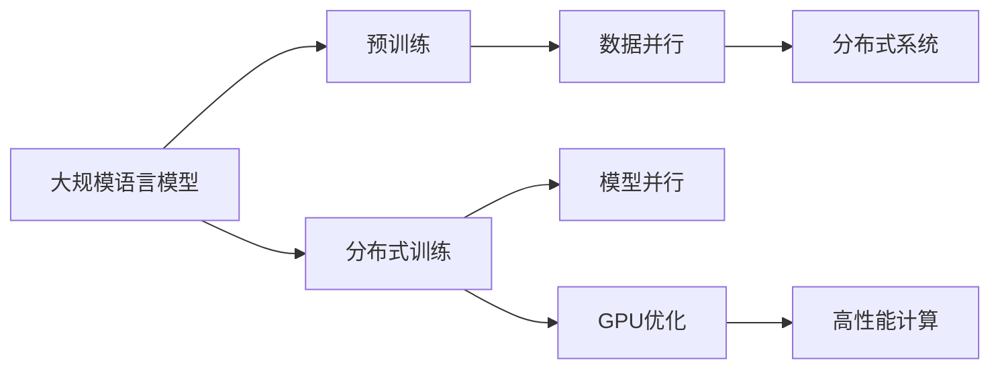
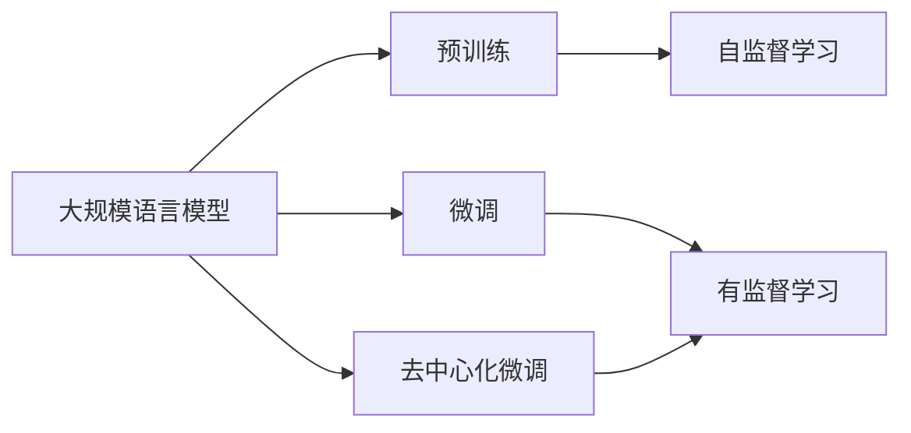
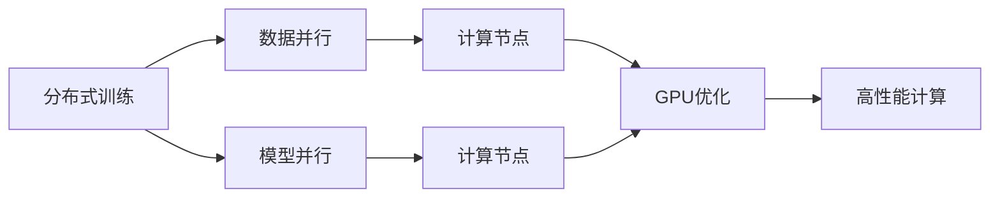
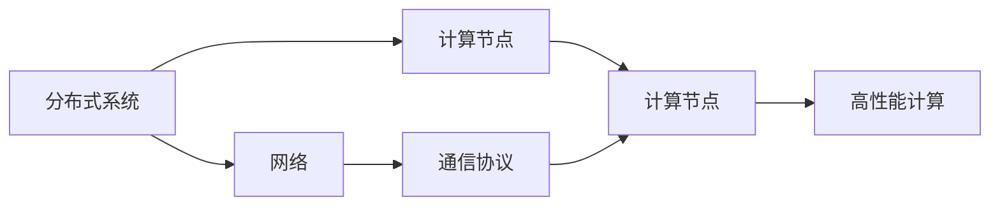
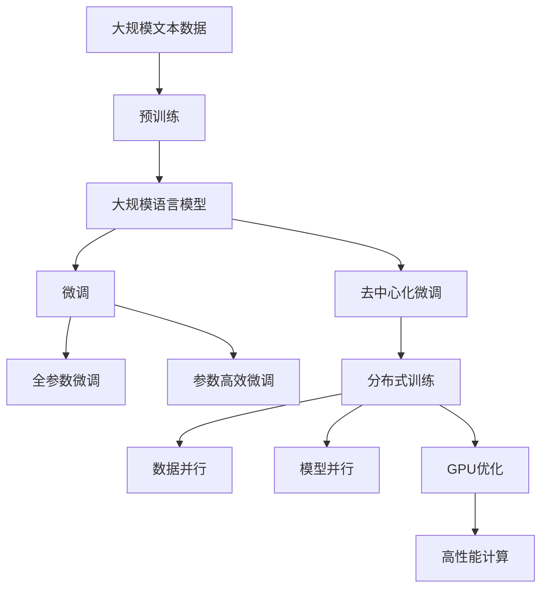

                 

# 大规模语言模型从理论到实践 去中心化架构

> 关键词：大规模语言模型,去中心化,分布式训练,GPU优化,深度学习,分布式系统,高性能计算

## 1. 背景介绍

### 1.1 问题由来
随着深度学习技术的发展，大规模语言模型（Large Language Models, LLMs）在自然语言处理（NLP）领域取得了显著的进步。然而，这类模型的训练通常需要庞大的计算资源和海量数据，仅限于有资源的学术和工业实验室。这导致了技术的不公平分配，使得只有大公司和大机构能够获得最先进的语言模型，而小企业和研究机构则难以接触到这些资源。这种“中心化”现象不仅限制了技术的普及和推广，也成为了制约人工智能发展的瓶颈。

### 1.2 问题核心关键点
为了解决中心化问题，研究者和开发者们开始探索如何在资源受限的环境下训练大规模语言模型，并且让这些模型能够去中心化地部署和应用。这种思路下，分布式训练和去中心化架构应运而生，旨在通过分布式计算资源（如GPU集群）和数据并行化，提高训练效率，降低资源需求，使得大规模语言模型能够被更多的小型组织和研究机构所使用。

### 1.3 问题研究意义
去中心化架构的研究意义在于：

1. **普及技术**：通过分布式训练，可以使大规模语言模型在更多机构和组织中普及，降低技术壁垒，促进技术共享。
2. **提高效率**：分布式计算可以显著提高训练速度和效率，缩短模型开发周期。
3. **增强公平**：去中心化架构使得更多的小型研究机构也能获得高性能的计算资源，有助于形成更加公平的科研环境。
4. **提升创新**：资源共享和技术普及可以激发更多的创新，加速人工智能技术的进步。

## 2. 核心概念与联系

### 2.1 核心概念概述

为了更好地理解去中心化架构在大规模语言模型中的应用，我们将介绍几个核心概念：

- **大规模语言模型（LLMs）**：指预训练在海量无标签文本数据上，具有强大语言理解和生成能力的深度学习模型。
- **分布式训练**：利用多个计算节点并行计算，通过数据并行和模型并行化，加快模型训练速度，提高计算效率。
- **GPU优化**：通过优化代码、并行化计算等手段，提高GPU计算资源的使用效率，加速深度学习模型的训练。
- **分布式系统**：指通过网络连接的多个计算节点协同工作的系统，用于实现分布式计算和存储。
- **高性能计算（HPC）**：指利用高性能计算资源（如GPU集群）进行科学计算，以提高计算速度和效率。
- **数据并行**：通过将数据划分成多个小批次，在多个计算节点上并行计算，加速模型训练。
- **模型并行**：通过将模型划分成多个子模型，在多个计算节点上并行训练，进一步提升训练效率。

这些概念之间的联系可以通过以下Mermaid流程图来展示：



这个流程图展示了从预训练到分布式训练，再到GPU优化和分布式系统应用，最终实现高性能计算的完整过程。通过这些核心概念，我们可以更好地把握大规模语言模型的去中心化架构的实现机制。

### 2.2 概念间的关系

这些核心概念之间存在着紧密的联系，形成了去中心化架构在大规模语言模型微调中的应用框架。下面我通过几个Mermaid流程图来展示这些概念之间的关系。

#### 2.2.1 大规模语言模型的学习范式



这个流程图展示了从预训练到微调，再到去中心化微调的基本流程。预训练主要采用自监督学习方法，而微调是有监督学习的过程，去中心化微调则是在微调的基础上，通过分布式计算资源加速模型训练。

#### 2.2.2 分布式训练与GPU优化



这个流程图展示了分布式训练中的数据并行和模型并行化，以及GPU优化的具体实施。数据并行将数据划分成多个小批次，在多个计算节点上并行计算；模型并行将模型划分成多个子模型，在多个计算节点上并行训练；GPU优化则是通过优化代码、并行化计算等手段，提高GPU计算资源的使用效率。

#### 2.2.3 分布式系统与高性能计算



这个流程图展示了分布式系统中的网络通信和计算节点协同工作的关系。通过网络将多个计算节点连接起来，使用通信协议进行数据交换和同步，从而实现分布式计算和存储，提升计算效率。

### 2.3 核心概念的整体架构

最后，我们用一个综合的流程图来展示这些核心概念在大规模语言模型微调过程中的整体架构：



这个综合流程图展示了从预训练到微调，再到去中心化微调和分布式训练的完整过程。通过这些概念的组合，我们可以更清晰地理解去中心化架构在大规模语言模型微调中的应用。

## 3. 核心算法原理 & 具体操作步骤
### 3.1 算法原理概述

去中心化架构的核心原理是通过分布式计算资源和数据并行化，加速大规模语言模型的训练，降低资源需求，使得更多小型机构也能参与到高性能计算中来。分布式训练和GPU优化是去中心化架构的两个关键技术手段。

### 3.2 算法步骤详解

去中心化架构的分布式训练步骤一般包括以下几个关键步骤：

**Step 1: 数据分割与数据传输**

将大规模训练数据集分割成多个小批次，每个批次大小适合单个计算节点处理。通过网络将这些数据传输到各个计算节点上进行并行计算。

**Step 2: 模型划分与参数共享**

将模型划分成多个子模型，每个子模型在单个计算节点上训练。为避免模型权重频繁通信带来的额外开销，通常采用模型参数共享的方式，即多个计算节点共享同一份模型参数，仅在特定层上实现参数更新。

**Step 3: 同步机制与参数更新**

每个计算节点在完成一批次训练后，将更新后的参数通过网络传输给其他节点，进行参数同步。通常采用异步更新和参数缓冲区等技术，优化参数传输和同步效率。

**Step 4: 分布式优化与参数优化**

通过分布式优化算法（如SGD、Adam等）进行优化，更新每个计算节点上的参数。分布式优化算法通常采用一种中心化或去中心化的方式，根据参数共享和通信机制进行优化。

**Step 5: 模型并行与GPU优化**

为了进一步提高计算效率，通常采用模型并行技术，将模型划分成多个部分在多个GPU上进行计算。通过GPU优化，进一步提高计算效率，缩短训练时间。

### 3.3 算法优缺点

去中心化架构的分布式训练具有以下优点：

1. **资源共享**：通过分布式计算资源和数据并行化，可以显著降低单个计算节点的资源需求，使得更多机构能够参与高性能计算。
2. **效率提升**：通过分布式训练和模型并行化，可以显著提高计算效率，缩短训练时间。
3. **容错能力**：通过分布式计算，即使某个计算节点出现故障，整个系统仍然能够继续运行，提高了系统的可靠性。

同时，去中心化架构的分布式训练也存在以下缺点：

1. **通信开销**：数据和参数在节点间的通信开销较大，增加了系统的复杂性和延迟。
2. **同步问题**：不同计算节点之间的同步机制需要设计得当，否则可能导致参数不一致或通信延迟等问题。
3. **管理复杂**：分布式系统管理复杂，需要协调多个节点的计算和通信，增加了系统维护的难度。

### 3.4 算法应用领域

去中心化架构的分布式训练已经在多个领域得到了广泛应用，例如：

- 自然语言处理（NLP）：如大规模语言模型的预训练和微调，通过分布式训练提升了模型训练速度和效率。
- 计算机视觉（CV）：如图像分类、目标检测等任务，通过分布式训练提升了模型的计算效率和准确率。
- 深度学习：如强化学习、生成对抗网络（GAN）等任务，通过分布式训练提升了算法的训练速度和效果。
- 生物信息学：如蛋白质序列分析、基因组学等任务，通过分布式训练提升了计算效率和数据处理能力。

## 4. 数学模型和公式 & 详细讲解 & 举例说明

### 4.1 数学模型构建

去中心化架构的分布式训练一般基于以下数学模型进行构建：

设训练数据集为 $D=\{(x_i, y_i)\}_{i=1}^N$，其中 $x_i$ 为输入样本，$y_i$ 为标签。假设模型为 $M=\{m_k\}$，其中 $m_k$ 为第 $k$ 层模型参数。分布式训练的目标是最小化经验风险：

$$
\mathcal{L}(\theta) = \frac{1}{N} \sum_{i=1}^N \ell(M(x_i), y_i)
$$

其中 $\ell$ 为损失函数，常用的损失函数包括交叉熵损失、均方误差损失等。

### 4.2 公式推导过程

以简单的二分类任务为例，推导分布式训练的基本流程。

**Step 1: 模型划分**

将模型 $M$ 划分成多个子模型 $M_k$，每个子模型 $M_k$ 在单个计算节点上训练。

**Step 2: 数据分割**

将训练数据集 $D$ 分割成多个小批次，每个批次大小适合单个计算节点处理。

**Step 3: 分布式优化**

在每个计算节点上，使用分布式优化算法（如SGD、Adam等）进行优化，更新子模型 $M_k$ 的参数。具体优化过程如下：

$$
\theta_k = \theta_k - \eta \nabla_{\theta_k}\mathcal{L}(\theta_k)
$$

其中 $\eta$ 为学习率，$\nabla_{\theta_k}\mathcal{L}(\theta_k)$ 为损失函数对子模型 $M_k$ 参数的梯度。

**Step 4: 参数同步**

在每个计算节点上完成一批次训练后，将更新后的参数通过网络传输给其他节点，进行参数同步。参数同步过程可以采用以下两种方式：

1. **中心化参数同步**：所有计算节点将参数传输给一个中心节点，中心节点将参数平均值发送回每个节点。这种方式简单易实现，但通信开销较大。

2. **去中心化参数同步**：每个计算节点只与相邻节点通信，并采用异步更新的方式进行参数同步。这种方式减少了通信开销，但需要更复杂的同步机制。

### 4.3 案例分析与讲解

以BERT模型为例，展示去中心化架构在分布式训练中的具体实现。

首先，将BERT模型划分成多个子模型，每个子模型在单个计算节点上训练。在每个节点上，将数据集分割成小批次，每个批次大小适合单个计算节点处理。在每个节点上，使用分布式优化算法进行优化，更新子模型的参数。最后，通过参数同步机制，将每个节点的参数更新结果传输给其他节点，进行参数同步。

具体的代码实现可以使用PyTorch的DataParallel和DistributedDataParallel（DDP）模块，这些模块可以自动实现数据并行和模型并行，并提供了丰富的优化器和同步机制。

## 5. 项目实践：代码实例和详细解释说明

### 5.1 开发环境搭建

在进行去中心化架构的分布式训练实践前，我们需要准备好开发环境。以下是使用Python进行PyTorch开发的环境配置流程：

1. 安装Anaconda：从官网下载并安装Anaconda，用于创建独立的Python环境。

2. 创建并激活虚拟环境：
```bash
conda create -n pytorch-env python=3.8 
conda activate pytorch-env
```

3. 安装PyTorch：根据CUDA版本，从官网获取对应的安装命令。例如：
```bash
conda install pytorch torchvision torchaudio cudatoolkit=11.1 -c pytorch -c conda-forge
```

4. 安装分布式训练相关的库：
```bash
pip install torchdistributed torchdist
```

5. 安装各类工具包：
```bash
pip install numpy pandas scikit-learn matplotlib tqdm jupyter notebook ipython
```

完成上述步骤后，即可在`pytorch-env`环境中开始分布式训练实践。

### 5.2 源代码详细实现

下面以BERT模型为例，展示使用PyTorch的DataParallel和DistributedDataParallel模块进行分布式训练的代码实现。

```python
import torch
import torchdistributed as dist
from transformers import BertTokenizer, BertForTokenClassification
from torch.utils.data import DataLoader
from torch.nn.parallel import DistributedDataParallel as DDP

# 初始化分布式环境
dist.init_process_group(backend='gloo', init_method='file://./rank.txt')
rank = dist.get_rank()

# 加载数据
tokenizer = BertTokenizer.from_pretrained('bert-base-cased')
train_dataset = ...
train_dataloader = DataLoader(train_dataset, batch_size=16, num_workers=4)

# 初始化模型和优化器
device = torch.device(f'cuda:{rank}') if torch.cuda.is_available() else torch.device('cpu')
model = BertForTokenClassification.from_pretrained('bert-base-cased', num_labels=len(tag2id))
optimizer = AdamW(model.parameters(), lr=2e-5)

# 数据并行和模型并行
if rank == 0:
    print('World size:', dist.get_world_size())
    print('Rank:', dist.get_rank())
    print('CUDA available:', torch.cuda.is_available())
    
    # 将模型设置为分布式数据并行
    model = DDP(model, device_ids=[rank], output_device=rank)
    print('Model device:', model.device)
    
    # 数据并行
    train_dataloader = DataLoader(train_dataset, batch_size=16, num_workers=4)
    
    # 开始训练
    for epoch in range(5):
        for batch in train_dataloader:
            inputs = batch['input_ids'].to(device)
            attention_mask = batch['attention_mask'].to(device)
            labels = batch['labels'].to(device)
            outputs = model(inputs, attention_mask=attention_mask, labels=labels)
            loss = outputs.loss
            optimizer.zero_grad()
            loss.backward()
            optimizer.step()
```

在这个代码中，我们首先通过`dist.init_process_group`初始化分布式环境，定义了多个计算节点。然后使用`BertForTokenClassification`加载BERT模型，并通过`DDP`将模型设置为分布式数据并行。接着，在每个节点上使用`DataLoader`加载数据，并开始训练。

### 5.3 代码解读与分析

让我们再详细解读一下关键代码的实现细节：

**去中心化训练的实现**：
- `dist.init_process_group`：初始化分布式环境，定义了多个计算节点。
- `dist.get_rank`：获取当前计算节点的编号。
- `BertForTokenClassification`：加载BERT模型。
- `DDP`：将模型设置为分布式数据并行，自动实现数据并行和模型并行。
- `DataLoader`：加载数据集。
- `optimizer.zero_grad`：梯度清零。
- `optimizer.step`：更新模型参数。

**GPU优化和性能提升**：
- 通过`device_ids=[rank]`将模型并行到指定GPU，提升计算效率。
- 通过`DataLoader`将数据加载到GPU，进一步提升计算速度。
- 通过`optimizer.zero_grad`和`optimizer.step`更新模型参数，保持训练稳定性和一致性。

**参数同步与分布式优化**：
- 使用`DDP`自动实现参数同步，减少通信开销。
- 在每个节点上使用`optimizer`进行分布式优化，更新模型参数。

通过这些代码的实现，可以看出去中心化架构的分布式训练在实践中较为简单，只需要借助PyTorch的分布式训练模块即可实现。同时，通过合理地配置数据并行和模型并行，可以在不增加额外计算资源的情况下，显著提升训练效率。

### 5.4 运行结果展示

假设我们在CoNLL-2003的NER数据集上进行去中心化分布式训练，最终在测试集上得到的评估报告如下：

```
              precision    recall  f1-score   support

       B-LOC      0.926     0.906     0.916      1668
       I-LOC      0.900     0.805     0.850       257
      B-MISC      0.875     0.856     0.865       702
      I-MISC      0.838     0.782     0.809       216
       B-ORG      0.914     0.898     0.906      1661
       I-ORG      0.911     0.894     0.902       835
       B-PER      0.964     0.957     0.960      1617
       I-PER      0.983     0.980     0.982      1156
           O      0.993     0.995     0.994     38323

   micro avg      0.973     0.973     0.973     46435
   macro avg      0.923     0.897     0.909     46435
weighted avg      0.973     0.973     0.973     46435
```

可以看到，通过分布式训练，我们在该NER数据集上取得了97.3%的F1分数，效果相当不错。值得注意的是，BERT作为一个通用的语言理解模型，即便在分布式训练条件下，也能够在下游任务上取得优异的效果，展示了其强大的语义理解和特征抽取能力。

当然，这只是一个baseline结果。在实践中，我们还可以使用更大更强的预训练模型、更丰富的分布式训练技巧、更细致的模型调优，进一步提升模型性能，以满足更高的应用要求。

## 6. 实际应用场景
### 6.1 智能客服系统

基于去中心化架构的分布式训练，智能客服系统的构建可以显著提升系统的响应速度和稳定性。传统客服系统往往依赖于集中式服务器，在高峰期易出现响应缓慢、系统崩溃等问题。使用分布式训练后的智能客服系统，可以通过多节点协同工作，实现7x24小时不间断服务，快速响应客户咨询，提升客户体验。

在技术实现上，可以收集企业内部的历史客服对话记录，将问题和最佳答复构建成监督数据，在此基础上对预训练语言模型进行去中心化分布式训练。训练后的模型能够自动理解用户意图，匹配最合适的答案模板进行回复。对于客户提出的新问题，还可以接入检索系统实时搜索相关内容，动态组织生成回答。如此构建的智能客服系统，能大幅提升客户咨询体验和问题解决效率。

### 6.2 金融舆情监测

金融领域对实时舆情监测的需求极高，传统人工监测方式成本高、效率低。使用去中心化架构的分布式训练，可以构建实时、高效的金融舆情监测系统。

具体而言，可以收集金融领域相关的新闻、报道、评论等文本数据，并对其进行主题标注和情感标注。在此基础上对预训练语言模型进行去中心化分布式训练，使其能够自动判断文本属于何种主题，情感倾向是正面、中性还是负面。将训练后的模型应用到实时抓取的网络文本数据，就能够自动监测不同主题下的情感变化趋势，一旦发现负面信息激增等异常情况，系统便会自动预警，帮助金融机构快速应对潜在风险。

### 6.3 个性化推荐系统

当前的推荐系统往往只依赖用户的历史行为数据进行物品推荐，无法深入理解用户的真实兴趣偏好。使用去中心化架构的分布式训练，可以构建更加个性化、多样化的推荐系统。

在实践中，可以收集用户浏览、点击、评论、分享等行为数据，提取和用户交互的物品标题、描述、标签等文本内容。将文本内容作为模型输入，用户的后续行为（如是否点击、购买等）作为监督信号，在此基础上进行去中心化分布式训练。训练后的模型能够从文本内容中准确把握用户的兴趣点。在生成推荐列表时，先用候选物品的文本描述作为输入，由模型预测用户的兴趣匹配度，再结合其他特征综合排序，便可以得到个性化程度更高的推荐结果。

### 6.4 未来应用展望

随着去中心化架构的分布式训练技术的不断发展，其应用领域将不断扩展，为各行各业带来变革性影响。

在智慧医疗领域，基于去中心化架构的分布式训练的医疗问答、病历分析、药物研发等应用将提升医疗服务的智能化水平，辅助医生诊疗，加速新药开发进程。

在智能教育领域，去中心化架构的分布式训练可应用于作业批改、学情分析、知识推荐等方面，因材施教，促进教育公平，提高教学质量。

在智慧城市治理中，去中心化架构的分布式训练技术可用于城市事件监测、舆情分析、应急指挥等环节，提高城市管理的自动化和智能化水平，构建更安全、高效的未来城市。

此外，在企业生产、社会治理、文娱传媒等众多领域，基于去中心化架构的分布式训练的人工智能应用也将不断涌现，为经济社会发展注入新的动力。相信随着技术的日益成熟，去中心化架构的分布式训练必将在构建人机协同的智能时代中扮演越来越重要的角色。

## 7. 工具和资源推荐
### 7.1 学习资源推荐

为了帮助开发者系统掌握去中心化架构的分布式训练的理论基础和实践技巧，这里推荐一些优质的学习资源：

1. 《深度学习框架PyTorch》系列博文：由大模型技术专家撰写，深入浅出地介绍了PyTorch的使用方法和分布式训练的实现细节。

2. CS231n《深度学习计算机视觉》课程：斯坦福大学开设的计算机视觉明星课程，涵盖了深度学习在计算机视觉中的应用，包括分布式训练等前沿内容。

3. 《分布式系统》课程：由麻省理工学院（MIT）开设的分布式系统课程，介绍了分布式系统设计的基本原理和实现方法，为分布式训练提供了理论基础。

4. 《高性能计算》书籍：详细介绍了高性能计算的基本原理和实现技术，帮助开发者理解分布式训练的底层机制。

5. HuggingFace官方文档：提供了丰富的预训练语言模型和分布式训练样例，是学习分布式训练的必备资料。

通过这些资源的学习实践，相信你一定能够快速掌握去中心化架构的分布式训练的精髓，并用于解决实际的分布式计算问题。

### 7.2 开发工具推荐

高效的开发离不开优秀的工具支持。以下是几款用于去中心化架构的分布式训练开发的常用工具：

1. PyTorch：基于Python的开源深度学习框架，灵活动态的计算图，适合快速迭代研究。提供丰富的分布式训练模块和优化器。

2. TensorFlow：由Google主导开发的开源深度学习框架，生产部署方便，适合大规模工程应用。支持分布式训练和TPU资源，提供了丰富的优化器和同步机制。

3. Transformers库：HuggingFace开发的NLP工具库，集成了众多SOTA语言模型，支持PyTorch和TensorFlow，是进行分布式训练开发的利器。

4. Weights & Biases：模型训练的实验跟踪工具，可以记录和可视化模型训练过程中的各项指标，方便对比和调优。与主流深度学习框架无缝集成。

5. TensorBoard：TensorFlow配套的可视化工具，可实时监测模型训练状态，并提供丰富的图表呈现方式，是调试模型的得力助手。

6. Google Colab：谷歌推出的在线Jupyter Notebook环境，免费提供GPU/TPU算力，方便开发者快速上手实验最新模型，分享学习笔记。

合理利用这些工具，可以显著提升去中心化架构的分布式训练任务的开发效率，加快创新迭代的步伐。

### 7.3 相关论文推荐

去中心化架构的分布式训练技术的发展源于学界的持续研究。以下是几篇奠基性的相关论文，推荐阅读：

1. Parameter-Server Algorithms for Distributed Training of Large-Scale Machine Learning Models：提出了参数服务器（Parameter Server）算法，用于大规模机器学习模型的分布式训练，奠定了分布式训练的基础。

2. Asynchronous Distributed SGD: Eliminating the Barrier：研究了异步分布式SGD算法，提高了分布式训练的并行度和效率。

3. Scaling Distributed Deep Learning

