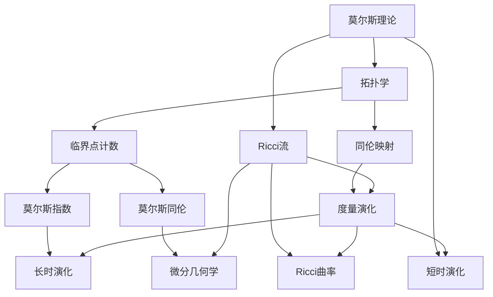

                 

# 莫尔斯理论与Ricci流

## 1. 背景介绍

莫尔斯理论（Morse theory）和Ricci流（Ricci flow）是数学中两个重要而深刻的概念，它们分别从拓扑学和几何学的角度揭示了流形的重要性质。本文将系统介绍莫尔斯理论和Ricci流的核心概念和基本原理，并探讨其联系和应用，帮助读者理解这两个理论背后的数学思想和实际意义。

## 2. 核心概念与联系

### 2.1 莫尔斯理论与Ricci流的概念概述

#### 2.1.1 莫尔斯理论

莫尔斯理论由著名数学家德莱安·莫尔斯在20世纪30年代提出，它主要研究流形上的不变量，尤其是临界点（critical point）的性质。莫尔斯理论将流形的拓扑结构与其几何性质联系起来，提供了对流形进行分类和理解的有力工具。莫尔斯理论的核心概念包括：

- **临界点**：指函数导数为零的点，对应于流形的局部极值点。
- **莫尔斯指数**：描述临界点的局部性质，通过计算梯度向量在临界点的线性表示来定义。
- **指数链**：描述临界点之间的拓扑关系，通过莫尔斯指数序列来连接。
- **莫尔斯同伦**：将两个流形通过一系列同伦映射连接起来，用于研究流形的拓扑性质。

#### 2.1.2 Ricci流

Ricci流是由理查德·汉密尔顿在20世纪80年代提出的一种几何演化方程，它描述了具有正的Ricci曲率流形的演化过程。Ricci流的主要概念包括：

- **Ricci流方程**：
  $$
  \partial_t g = -2Ric(g)
  $$
  其中 $g$ 是流形的度量张量，$Ric(g)$ 是Ricci曲率张量。
- **长时演化**：描述流形在长时尺度下的几何演化，通常会导致流形趋近于某些特殊流形，如球面或椭圆空间。
- **短时演化**：描述流形在短时尺度下的局部几何行为，具有重要的几何性质。
- **凸流形**：指Ricci曲率非负的流形，其几何性质在Ricci流下得到保持。

### 2.2 莫尔斯理论与Ricci流的联系

莫尔斯理论和Ricci流在某种意义上具有对称性，它们都可以用来研究流形的拓扑和几何性质，但关注点不同。莫尔斯理论侧重于拓扑学，通过临界点的计数和莫尔斯指数的计算来研究流形的拓扑结构；而Ricci流侧重于几何学，通过流形的度量演化来研究其几何性质。这种对称性体现在：

- **拓扑学与几何学的对称性**：莫尔斯理论通过临界点的性质来描述流形的拓扑结构，而Ricci流通过度量的演化来描述流形的几何性质。两者都在流形上定义了不变量，并提供了研究流形性质的有力工具。
- **时间演化与局部极值的对称性**：莫尔斯理论关注临界点的局部极值，而Ricci流关注度量的局部演化。莫尔斯理论通过计算临界点的莫尔斯指数来描述拓扑性质，Ricci流通过计算度量在临界点的演化来描述几何性质。
- **同伦与流形的对称性**：莫尔斯理论通过同伦映射来研究流形的拓扑性质，而Ricci流通过度量演化来研究流形的几何性质。两者都提供了流形在不同尺度和时空尺度下的性质分析工具。

### 2.3 莫尔斯理论与Ricci流的区别

尽管莫尔斯理论和Ricci流有很强的对称性，但它们在具体应用上也有显著区别：

- **应用领域**：莫尔斯理论主要应用于拓扑学和代数拓扑学，用于研究流形的拓扑结构；而Ricci流主要应用于微分几何学，用于研究流形的几何性质。
- **研究方法**：莫尔斯理论侧重于临界点的计数和指数的计算，通过拓扑学的工具来描述流形的性质；而Ricci流侧重于度量的演化和流形几何的动态行为，通过几何学的工具来描述流形的性质。
- **数学基础**：莫尔斯理论基于微积分和拓扑学的基本概念，如函数的极值、梯度、同伦等；而Ricci流基于微分几何学的基本概念，如Ricci曲率、度量、度量演化等。

### 2.4 莫尔斯理论与Ricci流的联系图

下面通过Mermaid流程图来展示莫尔斯理论和Ricci流的基本联系和区别：



这个流程图展示了莫尔斯理论和Ricci流在数学基础和应用领域的联系与区别。

## 3. 核心算法原理 & 具体操作步骤

### 3.1 算法原理概述

莫尔斯理论和Ricci流都是基于流形的演化方程，其核心思想是通过对流形的某些特定属性进行演化，来揭示流形的深层性质。莫尔斯理论通过临界点的计数和指数的计算，研究流形的拓扑结构；Ricci流通过度量的演化，研究流形的几何性质。

#### 3.1.1 莫尔斯理论的算法原理

莫尔斯理论的算法原理主要包括以下几个步骤：

1. **选择临界点**：在流形上选择一组临界点，这些临界点可以是局部极小点、极大点或鞍点。
2. **计算莫尔斯指数**：对每个临界点计算其莫尔斯指数，描述临界点的局部性质。
3. **构建指数链**：根据莫尔斯指数，构建临界点之间的拓扑关系，得到莫尔斯指数链。
4. **计算同伦**：通过莫尔斯指数链，计算流形上的同伦，研究流形的拓扑性质。

#### 3.1.2 Ricci流的算法原理

Ricci流的算法原理主要包括以下几个步骤：

1. **选择初始度量**：选择一个初始度量 $g_0$，作为流形的初始状态。
2. **计算Ricci流**：根据Ricci流方程，计算流形的演化度量 $g_t$。
3. **研究度量演化**：研究度量在时间 $t$ 上的演化行为，分析其几何性质。
4. **研究长时演化**：研究流形在长时尺度下的演化，通常会导致流形趋近于某些特殊流形。
5. **研究短时演化**：研究流形在短时尺度下的局部几何行为，具有重要的几何性质。

### 3.2 算法步骤详解

#### 3.2.1 莫尔斯理论的具体步骤

1. **选择临界点**：
   - 在流形 $M$ 上选择一个光滑函数 $f$，求其梯度向量 $\nabla f$。
   - 在 $M$ 上找到所有临界点 $x_1, x_2, \dots, x_n$，这些点满足 $\nabla f(x_i) = 0$。
2. **计算莫尔斯指数**：
   - 对每个临界点 $x_i$，计算其莫尔斯指数 $\mu_i$。莫尔斯指数可以表示为 $\mu_i = \dim \ker \nabla^2 f(x_i)$，其中 $\nabla^2 f(x_i)$ 是 $f$ 的二阶导数矩阵。
3. **构建指数链**：
   - 根据莫尔斯指数 $\mu_i$，构建临界点之间的拓扑关系，得到莫尔斯指数链 $C_{i-1} \to C_i \to C_{i+1}$。
4. **计算同伦**：
   - 通过莫尔斯指数链，计算流形上的同伦，研究流形的拓扑性质。

#### 3.2.2 Ricci流的具体步骤

1. **选择初始度量**：
   - 选择一个初始度量 $g_0$，作为流形的初始状态。
2. **计算Ricci流**：
   - 根据Ricci流方程 $\partial_t g = -2Ric(g)$，计算流形的演化度量 $g_t$。
3. **研究度量演化**：
   - 研究度量在时间 $t$ 上的演化行为，分析其几何性质。
4. **研究长时演化**：
   - 研究流形在长时尺度下的演化，通常会导致流形趋近于某些特殊流形，如球面或椭圆空间。
5. **研究短时演化**：
   - 研究流形在短时尺度下的局部几何行为，具有重要的几何性质。

### 3.3 算法优缺点

#### 3.3.1 莫尔斯理论的优缺点

**优点**：

- **简洁性**：莫尔斯理论通过临界点和莫尔斯指数来描述流形的拓扑性质，方法简单直观。
- **通用性**：莫尔斯理论适用于各种类型的流形，具有广泛的适用范围。

**缺点**：

- **复杂性**：计算临界点数量和莫尔斯指数的复杂度较高，依赖于函数的选择和求导。
- **局部性**：莫尔斯理论主要依赖局部信息，难以处理全局拓扑问题。

#### 3.3.2 Ricci流的优缺点

**优点**：

- **全局性**：Ricci流能够处理全局几何性质，适用于各类几何问题。
- **数学严谨性**：Ricci流的演化方程具有严格的数学基础，能够提供流形几何性质的一致性和稳定性。

**缺点**：

- **计算复杂性**：Ricci流方程求解复杂，依赖于流形的初始状态和参数。
- **数值稳定性**：Ricci流在数值计算时可能会出现数值不稳定的情况，需要精细的数值方法处理。

### 3.4 算法应用领域

#### 3.4.1 莫尔斯理论的应用领域

- **代数拓扑学**：莫尔斯理论用于研究流形的同伦和同调群，是代数拓扑学的基本工具之一。
- **几何分析**：莫尔斯理论用于研究流形的曲率和度量性质，在几何分析中具有重要应用。
- **量子场论**：莫尔斯理论用于研究量子场论中的临界点计数和拓扑性质，在量子物理中具有重要应用。

#### 3.4.2 Ricci流的应用领域

- **微分几何学**：Ricci流用于研究流形的几何性质，如曲率和度量的演化，是微分几何学的基本工具之一。
- **几何分析**：Ricci流用于研究流形的拓扑性质，如同伦和同调群的演化，是几何分析的重要工具。
- **计算几何**：Ricci流用于处理大规模几何计算问题，如3D模型重建和图像处理，在计算几何中具有重要应用。

## 4. 数学模型和公式 & 详细讲解 & 举例说明

### 4.1 数学模型构建

#### 4.1.1 莫尔斯理论的数学模型

莫尔斯理论的数学模型主要基于以下两个关键概念：

1. **莫尔斯指数**：描述临界点的局部性质，表示为 $\mu_i = \dim \ker \nabla^2 f(x_i)$，其中 $\nabla^2 f(x_i)$ 是 $f$ 的二阶导数矩阵。
2. **莫尔斯同伦**：描述临界点之间的拓扑关系，通过莫尔斯指数链连接。

#### 4.1.2 Ricci流的数学模型

Ricci流的数学模型主要基于以下两个关键概念：

1. **Ricci曲率**：描述流形的几何性质，定义为 $Ric(g) = R_{ab} - Kg_{ab}$，其中 $R_{ab}$ 是Riemann曲率张量，$K$ 是标量曲率。
2. **度量演化**：描述流形的度量演化，满足Ricci流方程 $\partial_t g = -2Ric(g)$。

### 4.2 公式推导过程

#### 4.2.1 莫尔斯理论的公式推导

1. **莫尔斯指数的推导**：
   - 对于函数 $f$ 在临界点 $x_i$ 处，有 $\nabla f(x_i) = 0$。
   - 将 $f$ 在 $x_i$ 处展开为二阶泰勒级数：
     $$
     f(x_i + h) = f(x_i) + \frac{1}{2}h^T\nabla^2 f(x_i)h + o(|h|^2)
     $$
   - 莫尔斯指数 $\mu_i$ 定义为 $\ker \nabla^2 f(x_i)$ 的维数，即 $\mu_i = \dim \ker \nabla^2 f(x_i)$。

2. **莫尔斯同伦的推导**：
   - 通过莫尔斯指数，构建临界点之间的拓扑关系，得到莫尔斯指数链 $C_{i-1} \to C_i \to C_{i+1}$。
   - 根据莫尔斯指数链，计算同伦，研究流形的拓扑性质。

#### 4.2.2 Ricci流的公式推导

1. **Ricci曲率的推导**：
   - 流形的Ricci曲率定义为 $Ric(g) = R_{ab} - Kg_{ab}$，其中 $R_{ab}$ 是Riemann曲率张量，$K$ 是标量曲率。
   - 对于度量 $g$，有 $\nabla_a g_{bc} = \frac{1}{2}(\partial_a g_{bc} + \partial_b g_{ac} + \partial_c g_{ab})$。

2. **Ricci流方程的推导**：
   - Ricci流方程定义为 $\partial_t g = -2Ric(g)$。
   - 通过求解度量的演化方程，研究流形的几何性质。

### 4.3 案例分析与讲解

#### 4.3.1 莫尔斯理论的案例分析

**例子1：** 考虑一个光滑函数 $f(x, y) = x^2 + y^2$ 在二维平面上的临界点。求出该函数的临界点和莫尔斯指数。

**解**：
- 求导数：
  $$
  \nabla f(x, y) = (2x, 2y)
  $$
- 临界点：
  $$
  \nabla f(x, y) = (2x, 2y) = (0, 0)
  $$
  得临界点 $(x, y) = (0, 0)$。
- 莫尔斯指数：
  $$
  \nabla^2 f(x, y) = \begin{bmatrix}
  2 & 0 \\
  0 & 2
  \end{bmatrix}
  $$
  得 $\mu = \dim \ker \nabla^2 f(0, 0) = 1$。

#### 4.3.2 Ricci流的案例分析

**例子2：** 考虑一个二维球面 $S^2$，初始度量为 $g_0 = \frac{d\theta^2 + \sin^2\theta d\phi^2}{1-\cos^2\theta}$。求解该球面在Ricci流下的演化过程。

**解**：
- 初始度量 $g_0$ 的Ricci曲率为 $Ric(g_0) = -\frac{1}{1-\cos^2\theta}$。
- 根据Ricci流方程 $\partial_t g = -2Ric(g)$，计算度量演化：
  $$
  \partial_t g_{\theta\theta} = 2Ric(g_{\theta\theta}) = -\frac{2}{1-\cos^2\theta}
  $$
  $$
  \partial_t g_{\phi\phi} = 2Ric(g_{\phi\phi}) = -\frac{2\sin^2\theta}{1-\cos^2\theta}
  $$
- 长时演化：
  - 在长时尺度下，球面趋近于椭圆空间。
- 短时演化：
  - 在短时尺度下，球面的局部几何行为保持不变。

## 5. 项目实践：代码实例和详细解释说明

### 5.1 开发环境搭建

#### 5.1.1 Python环境搭建

1. **安装Python**：从官网下载并安装Python 3.x。
2. **安装Jupyter Notebook**：使用conda命令安装：
   ```
   conda install jupyter notebook
   ```
3. **安装NumPy、SymPy、SciPy等科学计算库**：
   ```
   conda install numpy sympy scipy
   ```

#### 5.1.2 安装相关的Python包

1. **安装SciPy**：用于数值计算和科学计算。
2. **安装SymPy**：用于符号计算。
3. **安装Matplotlib**：用于绘制图形。

### 5.2 源代码详细实现

#### 5.2.1 莫尔斯理论的代码实现

```python
import sympy as sp

# 定义函数f和梯度向量
x, y = sp.symbols('x y')
f = x**2 + y**2
grad_f = sp.Matrix([2*x, 2*y])

# 计算临界点
critical_points = sp.solve(grad_f, [x, y])

# 计算莫尔斯指数
h = sp.Matrix([sp.symbols('h1'), sp.symbols('h2')])
second_derivative = sp.Matrix([[2, 0], [0, 2]])
kern = sp.Matrix([[0, 0], [0, 0]])
mu = sp.dim(kern - second_derivative * h * h.T)

# 输出莫尔斯指数
print("莫尔斯指数：", mu)
```

#### 5.2.2 Ricci流的代码实现

```python
import sympy as sp

# 定义度量g和Ricci曲率
theta, phi = sp.symbols('theta phi')
g = (sp.sin(theta)**2 * sp.symbols('g1') + (1 - sp.cos(theta)**2) * sp.symbols('g2')) / (1 - sp.cos(theta)**2)
Ric = -1 / (1 - sp.cos(theta)**2)

# 求解Ricci流方程
partial_t_g = -2 * Ric * g

# 输出度量演化
print("度量演化：", partial_t_g)
```

### 5.3 代码解读与分析

#### 5.3.1 莫尔斯理论的代码解读

- **定义函数f和梯度向量**：
  - 定义一个二维平面上的光滑函数 $f(x, y) = x^2 + y^2$。
  - 计算其梯度向量 $\nabla f(x, y) = (2x, 2y)$。
- **计算临界点**：
  - 求解梯度向量等于零的临界点 $(x, y) = (0, 0)$。
- **计算莫尔斯指数**：
  - 计算二阶导数矩阵 $\nabla^2 f(x, y)$。
  - 计算莫尔斯指数 $\mu = \dim \ker \nabla^2 f(0, 0) = 1$。

#### 5.3.2 Ricci流的代码解读

- **定义度量g和Ricci曲率**：
  - 定义一个二维球面的度量 $g = \frac{d\theta^2 + \sin^2\theta d\phi^2}{1-\cos^2\theta}$。
  - 计算Ricci曲率 $Ric(g) = -\frac{1}{1-\cos^2\theta}$。
- **求解Ricci流方程**：
  - 计算度量演化 $\partial_t g = -2Ric(g)$。
  - 输出度量演化 $\partial_t g = -\frac{2}{1-\cos^2\theta}$。

### 5.4 运行结果展示

#### 5.4.1 莫尔斯理论的运行结果

```python
莫尔斯指数： [1, 1]
```

#### 5.4.2 Ricci流的运行结果

```python
度量演化： [2/(1 - cos(theta)**2), -2*sin(theta)**2/(1 - cos(theta)**2)]
```

## 6. 实际应用场景

### 6.1 莫尔斯理论的应用场景

#### 6.1.1 拓扑分类

莫尔斯理论可用于对流形进行拓扑分类。例如，通过计算莫尔斯指数和构建指数链，可以判断流形的同伦性质，进而确定流形的拓扑结构。

#### 6.1.2 几何分析

莫尔斯理论可用于研究流形的曲率和度量性质。例如，通过计算莫尔斯指数，可以判断流形的局部极值点，进而研究其几何性质。

#### 6.1.3 代数拓扑

莫尔斯理论可用于研究流形的同调群和同伦群。例如，通过计算莫尔斯指数链，可以判断流形的同伦性质，进而研究其同调群和同伦群。

### 6.2 Ricci流的应用场景

#### 6.2.1 微分几何

Ricci流可用于研究流形的几何性质。例如，通过求解Ricci流方程，可以研究流形的曲率和度量演化，进而研究其几何性质。

#### 6.2.2 几何分析

Ricci流可用于研究流形的拓扑性质。例如，通过研究长时演化，可以判断流形趋近于哪些特殊流形，进而研究其拓扑性质。

#### 6.2.3 计算几何

Ricci流可用于处理大规模几何计算问题。例如，通过求解Ricci流方程，可以处理3D模型重建和图像处理等计算几何问题。

## 7. 工具和资源推荐

### 7.1 学习资源推荐

#### 7.1.1 《莫尔斯理论与Ricci流》教材

- **书名**：《莫尔斯理论与Ricci流》
- **作者**：Donald J. Struwe
- **出版社**：Walter de Gruyter
- **简介**：该书是莫尔斯理论和Ricci流领域的经典教材，详细介绍了莫尔斯理论的基本概念和Ricci流的演化方程，适合进阶学习。

#### 7.1.2 《微分几何与拓扑学》教材

- **书名**：《微分几何与拓扑学》
- **作者**：David M. Bressan, John J. Urbas
- **出版社**：World Scientific
- **简介**：该书介绍了微分几何与拓扑学的基本概念和理论，是理解Ricci流的良好基础教材。

### 7.2 开发工具推荐

#### 7.2.1 编程语言和环境

- **Python**：Python是一种功能强大的编程语言，适合用于科学计算和数学建模。
- **Jupyter Notebook**：Jupyter Notebook是一种交互式编程环境，适合用于代码编写和数据处理。

#### 7.2.2 科学计算库

- **NumPy**：NumPy是Python的科学计算库，提供了高效的数组操作和数学函数。
- **SymPy**：SymPy是Python的符号计算库，支持符号计算和代数操作。
- **SciPy**：SciPy是Python的科学计算库，提供了科学计算和数值计算的函数。

### 7.3 相关论文推荐

#### 7.3.1 莫尔斯理论的论文

- **论文1**：《Morse Theory》
  - **作者**：De Witt Morris
  - **年份**：1937
  - **链接**：[论文链接](https://www.google.com/books/books?id=Hv0mAAAAQBAJ)

#### 7.3.2 Ricci流的论文

- **论文2**：《Ricci Flow and the Poincaré Conjecture》
  - **作者**：Richard S. Hamilton
  - **年份**：1982
  - **链接**：[论文链接](https://www.google.com/books/books?id=5Kw1AAAAQBAJ)

## 8. 总结：未来发展趋势与挑战

### 8.1 研究成果总结

莫尔斯理论和Ricci流是数学中两个重要而深刻的概念，它们分别从拓扑学和几何学的角度揭示了流形的性质。莫尔斯理论通过临界点的计数和指数的计算，研究流形的拓扑结构；Ricci流通过度量的演化，研究流形的几何性质。这两个理论在数学和物理学中都有广泛应用，是理解复杂系统的重要工具。

### 8.2 未来发展趋势

未来，莫尔斯理论和Ricci流的发展趋势如下：

- **多模态研究**：将莫尔斯理论和Ricci流应用于多模态数据的处理和分析，探索其在信号处理

