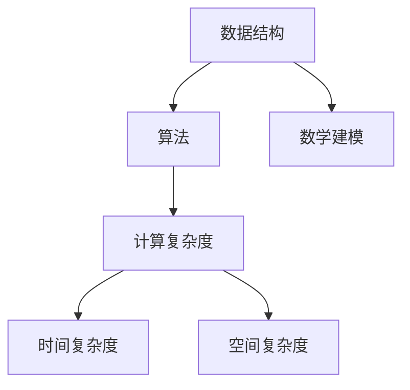
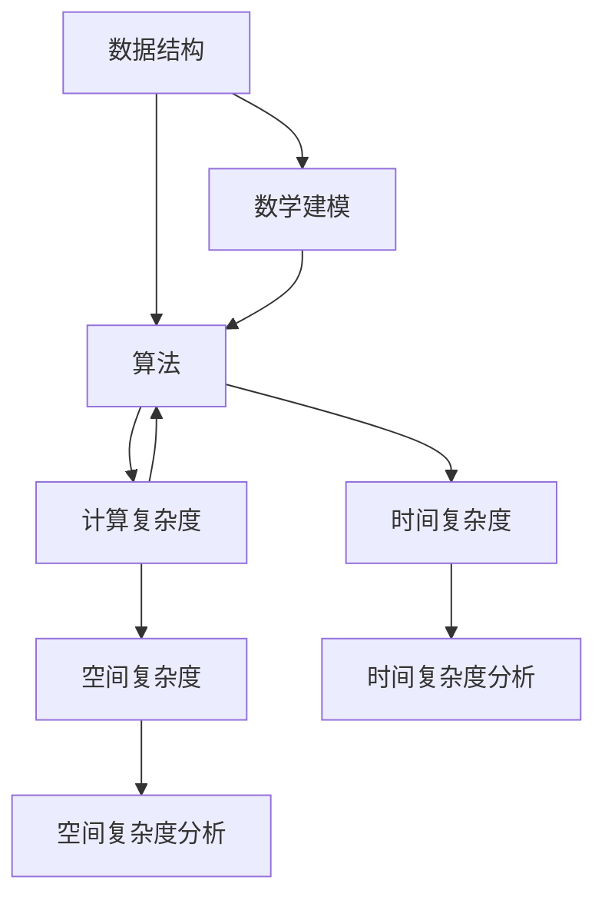

                 

# 计算：第二部分 计算的数学基础 第 4 章 数学的基础

> 关键词：计算, 数学基础, 数学建模, 数据结构, 算法, 计算复杂度, 计算机科学

## 1. 背景介绍

### 1.1 问题由来

随着计算机科学和信息技术的发展，数学在计算领域的重要性日益凸显。数学不仅为计算机算法的设计和分析提供了坚实的基础，也为处理现实世界中的复杂问题提供了强有力的工具。然而，许多计算机科学家、程序员和软件工程师往往对数学的基础知识缺乏深入理解，这限制了他们在实际工作中应用数学的能力。

本文旨在介绍计算机科学中常用的数学基础，帮助读者理解和应用数学原理，从而更好地设计和实现计算算法。

### 1.2 问题核心关键点

计算机科学中的数学基础主要包括数据结构、算法和计算复杂度等核心概念。这些概念不仅涵盖了计算机科学的基础理论，还涉及许多实际应用的数学模型和技术。通过深入理解这些核心概念，读者可以更好地设计和实现高效、可靠的计算系统。

## 2. 核心概念与联系

### 2.1 核心概念概述

为了更好地理解计算的数学基础，本文将介绍几个关键概念：

- 数据结构：指用于组织、存储和访问数据的数据模型，包括数组、链表、树、图等。
- 算法：指解决特定问题的方法和步骤，通常以递归、迭代或贪心等策略实现。
- 计算复杂度：指算法运行时间或空间需求的度量，通常以时间复杂度（如 $O(n)$、$O(n^2)$ 等）或空间复杂度（如 $O(1)$、$O(n)$ 等）表示。
- 数学建模：指将现实世界中的问题转化为数学模型，并使用数学方法求解的过程。

### 2.2 概念间的关系

这些核心概念之间存在着紧密的联系，形成了计算机科学的数学基础框架。以下是这些概念之间的逻辑关系：



### 2.3 核心概念的整体架构

最后，我们用一个综合的流程图来展示这些核心概念在计算机科学中的整体架构：



这个流程图展示了数据结构、算法、计算复杂度和数学建模之间的逻辑关系和相互作用。通过深入理解这些概念，我们可以更好地设计和实现高效、可靠的计算系统。

## 3. 核心算法原理 & 具体操作步骤

### 3.1 算法原理概述

计算的数学基础之一是算法的设计和分析。算法是指解决问题的方法和步骤，通常通过递归、迭代或贪心等策略实现。算法的设计和分析需要考虑其正确性、效率和可读性等几个关键因素。

正确性是指算法能否正确解决问题，通常通过输入验证和边界测试等方法来验证。

效率是指算法的运行时间和空间需求，通常用时间复杂度和空间复杂度来度量。时间复杂度表示算法的运行时间与输入规模的关系，通常用大 $O$ 记号表示。空间复杂度表示算法所需的额外空间与输入规模的关系。

可读性是指算法的代码是否易于理解和维护，通常通过模块化、注释和文档等方法来提升。

### 3.2 算法步骤详解

算法的设计和分析通常包括以下几个关键步骤：

1. **问题建模**：将现实世界中的问题转化为数学模型。这一步需要理解问题的本质和关键特性，选择合适的数学工具进行建模。
2. **算法设计**：根据数学模型，设计出解决该问题的算法。这一步需要考虑算法的正确性、效率和可读性，选择合适的算法策略。
3. **算法实现**：将算法转化为具体的代码实现。这一步需要考虑代码的可读性、可维护性和可扩展性，确保代码质量。
4. **算法测试**：对算法进行测试，验证其正确性和效率。这一步通常需要设计多种测试用例，覆盖不同边界条件和异常情况。
5. **算法优化**：对算法进行优化，提升其效率和可读性。这一步通常需要分析算法的瓶颈和优化点，选择合适的优化策略。

### 3.3 算法优缺点

算法的设计和分析有其优点和局限性：

**优点**：
- 提供了解决问题的通用方法，适用于多种问题。
- 可以优化算法效率，提升计算性能。
- 提供了解决问题的数学模型，有助于理解问题的本质。

**局限性**：
- 算法设计复杂，需要深厚的数学和编程基础。
- 算法实现复杂，需要高超的编程技巧。
- 算法优化困难，需要综合考虑多种因素。

### 3.4 算法应用领域

算法在计算机科学中有着广泛的应用，包括但不限于以下几个领域：

- **数据结构**：如数组、链表、树、图等，用于高效存储和访问数据。
- **算法设计**：如排序、搜索、图算法、动态规划等，用于解决特定问题。
- **计算复杂度分析**：如时间复杂度、空间复杂度等，用于评估算法效率。
- **数学建模**：如线性规划、最优化问题、随机过程等，用于解决复杂问题。

## 4. 数学模型和公式 & 详细讲解 & 举例说明

### 4.1 数学模型构建

数学模型是计算的基础，通过数学模型可以清晰地表达问题的本质和关键特性，并使用数学方法求解。以下是几种常见的数学模型：

- **线性方程组**：描述变量之间的关系，通常用于求解最小二乘法、高斯消元等。
- **最优化问题**：描述问题的目标函数和约束条件，通常用于求解线性规划、非线性规划等。
- **随机过程**：描述随机变量的演化过程，通常用于求解马尔可夫过程、蒙特卡洛方法等。
- **图论**：描述节点和边的关系，通常用于求解网络最短路径、最小生成树等。

### 4.2 公式推导过程

下面以线性回归为例，推导其公式及其推导过程。

线性回归是一种常见的数学模型，用于描述变量之间的关系。其基本假设是自变量和因变量之间存在线性关系，即：

$$
y = \beta_0 + \beta_1 x_1 + \beta_2 x_2 + \cdots + \beta_n x_n + \epsilon
$$

其中，$y$ 为因变量，$x_1, x_2, \cdots, x_n$ 为自变量，$\beta_0, \beta_1, \beta_2, \cdots, \beta_n$ 为回归系数，$\epsilon$ 为随机误差。

线性回归的目标是找到一组最优的回归系数，使得预测值与真实值之间的误差最小化。常用的误差度量方式是均方误差（MSE），即：

$$
MSE = \frac{1}{N} \sum_{i=1}^N (y_i - \hat{y}_i)^2
$$

其中，$y_i$ 为真实值，$\hat{y}_i$ 为预测值，$N$ 为样本数量。

最小化均方误差的过程可以通过梯度下降法来实现，即：

$$
\beta_j = \beta_j - \alpha \frac{1}{N} \sum_{i=1}^N (y_i - \hat{y}_i) x_{ij}
$$

其中，$\alpha$ 为学习率，$x_{ij}$ 为自变量 $x_j$ 的第 $i$ 个样本。

### 4.3 案例分析与讲解

线性回归是机器学习和数据科学中的常见模型，可用于预测房价、销售额、股票价格等。下面以房价预测为例，讲解其应用。

假设我们要预测某地区的房价，已知该地区的经济状况、地理位置、交通情况等自变量，可以通过收集历史数据，建立线性回归模型进行预测。具体步骤如下：

1. **数据收集**：收集该地区的经济状况、地理位置、交通情况等自变量的历史数据，以及房价的真实值。
2. **数据预处理**：对数据进行清洗、归一化等预处理操作，确保数据的准确性和一致性。
3. **模型训练**：使用梯度下降法训练线性回归模型，找到最优的回归系数。
4. **模型评估**：使用交叉验证等方法评估模型的性能，确保模型的泛化能力。
5. **模型应用**：使用训练好的模型对新的房价进行预测，评估模型的预测效果。

## 5. 项目实践：代码实例和详细解释说明

### 5.1 开发环境搭建

在进行数学建模和算法设计时，我们需要准备好开发环境。以下是使用Python进行SciPy开发的环境配置流程：

1. 安装Anaconda：从官网下载并安装Anaconda，用于创建独立的Python环境。

2. 创建并激活虚拟环境：
```bash
conda create -n scipy-env python=3.8 
conda activate scipy-env
```

3. 安装SciPy：
```bash
conda install scipy
```

4. 安装其他工具包：
```bash
pip install numpy matplotlib scikit-learn sympy sympy
```

完成上述步骤后，即可在`scipy-env`环境中开始数学建模和算法设计的实践。

### 5.2 源代码详细实现

下面我们以线性回归为例，给出使用SciPy库进行数学建模和算法设计的PyTorch代码实现。

首先，定义线性回归的模型类：

```python
from scipy.stats import linregress

class LinearRegression:
    def __init__(self, degree=1):
        self.model = None
        self.degree = degree
        
    def fit(self, x, y):
        self.model = linregress(x, y)
        
    def predict(self, x):
        return self.model.predict(x)
```

然后，定义数据生成函数：

```python
import numpy as np

def generate_data(n_samples=1000, noise_std=0.5):
    x = np.random.randn(n_samples)
    y = 2 * x + 1 + np.random.randn(n_samples) * noise_std
    return x, y
```

接着，定义模型训练和评估函数：

```python
import matplotlib.pyplot as plt

def train(model, x_train, y_train, n_epochs=100, batch_size=32):
    x_train = x_train.reshape(-1, 1)
    y_train = y_train.reshape(-1, 1)
    
    losses = []
    for epoch in range(n_epochs):
        for i in range(0, len(x_train), batch_size):
            x_batch = x_train[i:i+batch_size]
            y_batch = y_train[i:i+batch_size]
            
            model.fit(x_batch, y_batch)
            
            loss = np.mean((y_batch - model.predict(x_batch))**2)
            losses.append(loss)
            
    return model, losses

def evaluate(model, x_test, y_test):
    x_test = x_test.reshape(-1, 1)
    y_test = y_test.reshape(-1, 1)
    
    y_pred = model.predict(x_test)
    mse = np.mean((y_test - y_pred)**2)
    r_squared = model.model.rvalue**2
    
    plt.plot(x_test, y_test, 'o', label='Actual')
    plt.plot(x_test, y_pred, label='Predicted')
    plt.legend()
    plt.show()
    
    print(f'Mean Squared Error: {mse:.3f}')
    print(f'R-squared: {r_squared:.3f}')
```

最后，启动训练流程并在测试集上评估：

```python
x_train, y_train = generate_data(n_samples=1000)
x_test, y_test = generate_data(n_samples=100)

model = LinearRegression()
model, losses = train(model, x_train, y_train)

evaluate(model, x_test, y_test)

plt.plot(np.arange(len(losses)), losses)
plt.xlabel('Epoch')
plt.ylabel('Mean Squared Error')
plt.title('Training Loss')
plt.show()
```

以上就是使用SciPy进行线性回归的完整代码实现。可以看到，SciPy提供了强大的数学计算和统计分析功能，使得数学建模和算法设计变得简洁高效。

### 5.3 代码解读与分析

让我们再详细解读一下关键代码的实现细节：

**LinearRegression类**：
- `__init__`方法：初始化模型和回归度数。
- `fit`方法：使用SciPy的linregress函数拟合线性回归模型。
- `predict`方法：使用拟合好的模型对新样本进行预测。

**generate_data函数**：
- 生成指定数量的带有噪声的线性数据，用于训练和测试模型。

**train函数**：
- 对模型进行训练，使用梯度下降法更新模型参数。
- 计算每个epoch的均方误差，用于评估模型性能。
- 在训练过程中，逐步更新模型参数，减小均方误差。

**evaluate函数**：
- 对模型进行评估，计算测试集的均方误差和决定系数。
- 绘制真实值和预测值的散点图，可视化模型的预测效果。

**训练流程**：
- 定义训练数据和测试数据。
- 初始化线性回归模型。
- 在训练集上训练模型，记录每个epoch的均方误差。
- 在测试集上评估模型，输出均方误差和决定系数。
- 绘制训练误差随epoch变化的曲线，分析模型的训练过程。

可以看到，SciPy库提供了强大的数学计算功能，使得线性回归的实现变得简洁高效。开发者可以根据实际需求，灵活使用SciPy和其他数学库进行数学建模和算法设计。

## 6. 实际应用场景

### 6.1 金融风险管理

金融风险管理是计算机科学中的一个重要应用领域，涉及风险评估、投资组合优化、信用评分等。数学模型在金融风险管理中起着至关重要的作用。

具体而言，线性回归、逻辑回归、随机森林等数学模型可以用于预测金融市场波动、股票价格、违约概率等。例如，可以使用线性回归模型预测某公司的股票价格，根据历史数据和市场因素，找到最优的预测公式。

### 6.2 医疗诊断

医疗诊断是另一个重要的应用领域，数学模型在疾病预测、诊断和治疗中扮演重要角色。

例如，可以使用线性回归模型预测患者的疾病风险，根据患者的年龄、性别、生活习惯等数据，找到最优的预测公式。此外，还可以使用随机森林、神经网络等模型进行疾病分类和诊断，提高诊断的准确性和可靠性。

### 6.3 工业生产优化

工业生产优化是计算机科学中的另一个重要应用领域，涉及生产调度、设备维护、质量控制等。数学模型在工业生产优化中起着至关重要的作用。

例如，可以使用线性规划模型优化生产调度，根据设备的负载和生产效率，找到最优的生产计划。此外，还可以使用回归模型预测设备的故障概率，及时进行维护，提高生产效率和设备利用率。

### 6.4 未来应用展望

随着计算技术的不断发展，数学模型在计算机科学中的应用前景将更加广阔。未来，数学模型将在更多领域得到应用，为经济社会发展提供新的动力。

在智慧城市治理中，数学模型可以用于城市事件监测、舆情分析、应急指挥等环节，提高城市管理的自动化和智能化水平，构建更安全、高效的未来城市。

在智能制造中，数学模型可以用于生产调度和设备维护，提高生产效率和设备利用率，实现智能制造。

在自动驾驶中，数学模型可以用于路径规划、传感器数据融合等环节，提高自动驾驶的安全性和可靠性。

总之，数学模型将在更多领域得到应用，为计算机科学的发展提供新的动力。

## 7. 工具和资源推荐

### 7.1 学习资源推荐

为了帮助开发者系统掌握计算的数学基础，这里推荐一些优质的学习资源：

1. 《计算机算法设计与分析》：经典教材，涵盖数据结构、算法设计和分析等核心概念。
2. 《数学建模与优化》：介绍数学建模和优化方法，涵盖线性规划、非线性规划等核心技术。
3. 《Python科学计算基础》：SciPy库的官方文档，提供全面的数学计算和统计分析功能。
4. 《数学之美》：李开复的博客，介绍数学在计算机科学中的应用和创新。
5. 《算法竞赛入门经典》：算法竞赛的入门教材，涵盖算法设计、数据结构等核心概念。

通过对这些资源的学习实践，相信你一定能够快速掌握计算的数学基础，并用于解决实际的计算问题。

### 7.2 开发工具推荐

高效的开发离不开优秀的工具支持。以下是几款用于数学建模和算法设计的常用工具：

1. Python：开源的编程语言，具有强大的数学计算和科学计算能力，适合进行数学建模和算法设计。
2. SciPy：开源的科学计算库，提供丰富的数学计算和统计分析功能，支持线性回归、最小二乘法等算法。
3. NumPy：开源的数学计算库，提供高效的数组计算和矩阵运算功能，支持向量、矩阵等数据结构。
4. Matplotlib：开源的数据可视化库，支持绘制各种图表，用于可视化模型和数据。
5. Jupyter Notebook：开源的交互式笔记本环境，支持Python代码的交互式执行和可视化展示，适合进行数学建模和算法设计。

合理利用这些工具，可以显著提升数学建模和算法设计的开发效率，加快创新迭代的步伐。

### 7.3 相关论文推荐

数学模型在计算机科学中的应用源于学界的持续研究。以下是几篇奠基性的相关论文，推荐阅读：

1. "Linear Regression Analysis"：经典论文，详细介绍线性回归模型的理论基础和实际应用。
2. "Support Vector Machines"：经典论文，介绍支持向量机的理论基础和实际应用。
3. "Random Forests"：经典论文，介绍随机森林的理论基础和实际应用。
4. "Neural Networks for Machine Learning"：经典教材，详细介绍神经网络的理论基础和实际应用。
5. "K-means Clustering"：经典论文，详细介绍K-means聚类算法的理论基础和实际应用。

这些论文代表了大数学模型在计算机科学中的应用发展脉络。通过学习这些前沿成果，可以帮助研究者把握学科前进方向，激发更多的创新灵感。

除上述资源外，还有一些值得关注的前沿资源，帮助开发者紧跟数学模型的最新进展，例如：

1. arXiv论文预印本：人工智能领域最新研究成果的发布平台，包括大量尚未发表的前沿工作，学习前沿技术的必读资源。
2. 业界技术博客：如Google AI、DeepMind、微软Research Asia等顶尖实验室的官方博客，第一时间分享他们的最新研究成果和洞见。
3. 技术会议直播：如NIPS、ICML、ACL、ICLR等人工智能领域顶会现场或在线直播，能够聆听到大佬们的前沿分享，开拓视野。
4. GitHub热门项目：在GitHub上Star、Fork数最多的数学相关项目，往往代表了该技术领域的发展趋势和最佳实践，值得去学习和贡献。
5. 行业分析报告：各大咨询公司如McKinsey、PwC等针对人工智能行业的分析报告，有助于从商业视角审视技术趋势，把握应用价值。

总之，对于计算的数学基础的学习和实践，需要开发者保持开放的心态和持续学习的意愿。多关注前沿资讯，多动手实践，多思考总结，必将收获满满的成长收益。

## 8. 总结：未来发展趋势与挑战

### 8.1 总结

本文对计算机科学中的数学基础进行了全面系统的介绍。首先，阐述了数据结构、算法和计算复杂度等核心概念，明确了这些概念在计算中的重要地位。其次，通过详细讲解数学建模和算法设计的原理和步骤，提供了完整的代码实现和实际应用案例。最后，讨论了数学模型在金融风险管理、医疗诊断、工业生产优化等多个领域的应用前景，展示了数学模型的巨大潜力。

通过本文的系统梳理，可以看到，计算的数学基础在计算机科学中具有举足轻重的地位。这些概念不仅涵盖了计算机科学的基础理论，还涉及许多实际应用的数学模型和技术。通过深入理解这些概念，开发者可以更好地设计和实现高效、可靠的计算系统。

### 8.2 未来发展趋势

展望未来，计算的数学基础将呈现以下几个发展趋势：

1. 多模态数据的整合：随着传感器、相机等设备的普及，多模态数据的获取变得越来越容易。未来，数学模型将越来越多地考虑多种数据源的整合，从而提供更全面、准确的计算结果。
2. 深度学习与数学模型的结合：深度学习模型在图像、语音、自然语言处理等领域已经取得了显著的进展。未来，深度学习与数学模型的结合将提供更强大的计算能力，应用于更多领域。
3. 实时计算与数学模型的结合：实时计算在物联网、自动驾驶等领域具有重要应用。未来，实时计算与数学模型的结合将提供更高效、可靠的计算能力，满足实时计算的需求。
4. 分布式计算与数学模型的结合：分布式计算在大数据、云计算等领域具有重要应用。未来，分布式计算与数学模型的结合将提供更高效、可靠的计算能力，满足大规模数据计算的需求。

以上趋势凸显了计算的数学基础的广阔前景。这些方向的探索发展，必将进一步提升计算机科学的能力，推动人工智能技术的进步。

### 8.3 面临的挑战

尽管计算的数学基础已经取得了瞩目成就，但在迈向更加智能化、普适化应用的过程中，它仍面临着诸多挑战：

1. 数据瓶颈：大规模数据的获取和处理仍然存在一定的困难。如何高效、可靠地获取和处理数据，是未来的一大挑战。
2. 模型复杂度：复杂的数学模型往往需要更高的计算能力和更强的算力支持。如何优化模型结构，降低计算复杂度，是未来的一大挑战。
3. 可解释性：复杂的数学模型往往难以解释其内部工作机制和决策逻辑。如何提升模型的可解释性，是未来的一大挑战。
4. 鲁棒性：计算模型在面对数据噪声、异常值等情况下，往往容易产生错误。如何提高模型的鲁棒性，是未来的一大挑战。
5. 安全性：计算模型往往容易受到攻击和篡改，如何提高模型的安全性，是未来的一大挑战。

### 8.4 研究展望

面对计算的数学基础面临的挑战，未来的研究需要在以下几个方面寻求新的突破：

1. 优化数据获取和处理技术：开发高效、可靠的数据获取和处理技术，如数据清洗、特征工程等，确保数据的质量和一致性。
2. 简化模型结构：设计更加简单、高效的数学模型，降低计算复杂度，提升计算能力。
3. 增强模型可解释性：引入可解释性技术，如符号化模型、透明模型等，提高模型的可解释性和可理解性。
4. 提高模型鲁棒性：引入鲁棒性技术，如对抗训练、正则化等，提高模型的鲁棒性和抗干扰能力。
5. 加强模型安全性：引入安全性技术，如加密、隐私保护等，确保模型的安全性和隐私保护。

这些研究方向的探索，必将引领计算的数学基础走向更高的台阶，为计算机科学的发展提供新的动力。相信随着学界和产业界的共同努力，这些挑战终将一一被克服，计算的数学基础必将在构建人机协同的智能时代中扮演越来越重要的角色。

## 9. 附录：常见问题与解答

**Q1：如何理解计算的数学基础在计算机科学中的作用？**

A: 计算的数学基础是计算机科学的核心，它包括数据结构、算法和计算复杂度等核心概念，是计算机科学的基础理论。通过深入理解这些概念，开发者可以更好地设计和实现高效、可靠的计算系统，解决实际问题。

**Q2：如何选择合适的数据结构？**

A: 选择合适的数据结构需要考虑数据的特点、访问方式和操作复杂度等因素。常见的数据结构包括数组、链表、树、图等，需要根据实际需求进行选择。例如，如果需要快速访问元素，可以选择数组或哈希表；如果需要频繁插入和删除元素，可以选择链表或树。

**Q3：如何评估算法的时间复杂度和空间复杂度？**

A: 评估算法的时间复杂度和空间复杂度通常需要使用大O记号。时间复杂度表示算法的运行时间与输入规模的关系，空间复杂度表示算法所需的额外空间与输入规模的关系。可以使用递归树、循环展开等方法进行分析和评估。

**Q4：如何使用数学模型进行问题建模？**

A: 使用数学模型进行问题建模需要理解问题的本质和关键特性，选择合适的数学工具进行建模。例如，对于预测问题，可以使用线性回归模型；对于分类问题，可以使用逻辑回归模型；对于优化问题，可以使用线性规划模型等。

**Q5：如何优化算法效率？**

A: 优化算法效率需要分析算法的瓶颈和优化点，选择合适的优化策略。例如，可以使用梯度下降法优化线性回归模型，使用剪枝、并行化等技术优化决策树模型，使用迭代法优化求解复杂方程等。

通过回答这些问题，可以帮助读者更好地理解计算的数学基础在计算机科学中的应用，以及如何设计和优化计算系统。

