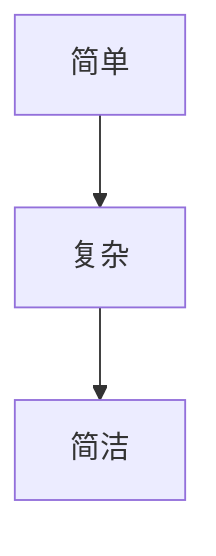

                 

# 认知的渐进发展过程：三个阶段：浅薄的简单、混沌的复杂、深刻的简洁

> 关键词：认知,渐进发展,复杂,简洁

## 1. 背景介绍

在复杂世界的认知之旅中，我们经历了从简单到复杂的逐步升级，再到最深刻的简洁的蜕变过程。这一过程揭示了人类认知能力的逐步发展和最终的升华。本篇文章将从认知科学的角度，探讨人类认知发展的三个阶段：浅薄的简单、混沌的复杂和深刻的简洁，分析每个阶段的特点与演变，并结合信息技术的应用，探讨其对未来发展的启示。

### 1.1 认知的简单阶段

在认知发展的初期，我们的认知能力相对单一，主要依赖直觉和简单的经验模式。这种认知方式简单明了，易于理解和应用。例如，当我们看到苹果时，直觉上就能知道它是可食用的，无需进行复杂的分析。这种认知方式直观、高效，适合处理简单、直接的问题。

### 1.2 认知的复杂阶段

随着认知能力的提高，我们开始处理更为复杂和多变的问题。此时，我们需要通过逻辑推理、数据分析等复杂的方法来理解和解决问题。例如，在科学领域，我们需要通过实验和数据来验证假设，形成复杂的理论模型。这种认知方式严谨、系统，适合处理复杂、多变的问题。

### 1.3 认知的简洁阶段

在认知能力进一步提升的过程中，我们开始追求更为深刻的简洁性。这种认知方式强调以简洁的方式表达复杂的概念和关系，通过高度抽象和凝练，形成更为深刻、有效的理解。例如，在哲学中，我们通过简洁的概念和命题来探讨世界的本质和规律。这种认知方式深刻、透彻，适合处理深层次、根本性问题。

## 2. 核心概念与联系

### 2.1 核心概念概述

为了更好地理解认知发展的三个阶段，本文将介绍几个关键概念：

- **认知**：指人类对信息的主观解释、理解、记忆和应用过程。
- **简单**：指认知过程的直接、直观和简单化。
- **复杂**：指认知过程的逻辑化、系统化和多维度化。
- **简洁**：指认知过程的高度抽象化、凝练化和本质化。

### 2.2 核心概念间的关系

这些核心概念之间存在着紧密的联系，形成了认知发展的整体架构。以下是这些概念之间关系的简要图示：



这个图示展示了从简单到复杂再到简洁的认知发展过程。简单是认知发展的起点，通过复杂化，我们能够处理更多样化和复杂的问题。最后，简洁化使得我们对问题的理解和处理更加深刻和本质化。

## 3. 核心算法原理 & 具体操作步骤
### 3.1 算法原理概述

在认知发展的过程中，算法原理起着关键作用。它帮助我们理解、处理和应用复杂的认知过程。具体来说，算法原理可以分为三个阶段：

- **简单算法**：基于简单的数学公式或逻辑规则，适用于处理简单问题。
- **复杂算法**：基于复杂的数学模型和算法，适用于处理复杂问题。
- **简洁算法**：基于高度抽象和凝练的算法，适用于处理深层次、根本性问题。

### 3.2 算法步骤详解

具体步骤如下：

1. **简单算法**：
   - 输入：简单的数据集或问题描述。
   - 处理：基于简单的数学公式或逻辑规则进行处理。
   - 输出：简单的结果或解决方案。

2. **复杂算法**：
   - 输入：复杂的数据集或问题描述。
   - 处理：基于复杂的数学模型和算法进行处理。
   - 输出：复杂的解决方案或结果。

3. **简洁算法**：
   - 输入：复杂的数据集或问题描述。
   - 处理：基于高度抽象和凝练的算法进行处理。
   - 输出：深刻的、简洁的结果或解决方案。

### 3.3 算法优缺点

#### 优点：

- **适用性广**：简单、复杂和简洁算法分别适用于不同复杂度的认知过程，能够灵活应对各种问题。
- **高效性**：简单算法和简洁算法能够快速处理简单和复杂问题，而复杂算法能够高效处理复杂问题。

#### 缺点：

- **局限性**：简单算法和简洁算法在处理复杂问题时，可能会失去精度和深度。复杂算法在处理简单问题时，可能会过于冗杂和低效。

### 3.4 算法应用领域

这些算法原理在各个领域都有广泛应用，例如：

- **简单算法**：在金融、电商等领域，用于快速处理简单交易、推荐等。
- **复杂算法**：在数据科学、人工智能等领域，用于处理复杂的机器学习、深度学习问题。
- **简洁算法**：在哲学、心理学等领域，用于探索深层次的理论问题和心理机制。

## 4. 数学模型和公式 & 详细讲解  
### 4.1 数学模型构建

本节将使用数学语言对认知发展的三个阶段进行更加严格的刻画。

**简单算法**：
设输入数据为 $x$，输出结果为 $y$，简单算法可以表示为：

$$
y = f(x)
$$

其中 $f$ 为简单的数学函数。

**复杂算法**：
设输入数据为 $x$，输出结果为 $y$，复杂算法可以表示为：

$$
y = g(x)
$$

其中 $g$ 为复杂的数学函数或模型。

**简洁算法**：
设输入数据为 $x$，输出结果为 $y$，简洁算法可以表示为：

$$
y = h(x)
$$

其中 $h$ 为高度抽象和凝练的函数。

### 4.2 公式推导过程

以下我们以二分查找算法为例，推导其在简单、复杂和简洁三个阶段的数学模型。

**简单二分查找**：
设输入数据集为 $[1, 3, 5, 7, 9]$，目标值为 $5$。

简单算法：
- 输入：目标值 $5$。
- 处理：直接查找。
- 输出：结果 $5$。

数学模型：

$$
y = 5
$$

**复杂二分查找**：
设输入数据集为 $[1, 3, 5, 7, 9]$，目标值为 $5$。

复杂算法：
- 输入：目标值 $5$。
- 处理：递归查找。
- 输出：结果 $5$。

数学模型：

$$
y = g(1, 3, 5, 7, 9, 5) = 5
$$

**简洁二分查找**：
设输入数据集为 $[1, 3, 5, 7, 9]$，目标值为 $5$。

简洁算法：
- 输入：目标值 $5$。
- 处理：计算中间值 $5$ 的位置。
- 输出：结果 $5$。

数学模型：

$$
y = h(1, 3, 5, 7, 9, 5) = 5
$$

### 4.3 案例分析与讲解

**案例一：电商推荐系统**
- 简单算法：基于用户历史购买记录的推荐系统，简单的公式或规则即可实现。
- 复杂算法：基于深度学习的推荐系统，复杂的神经网络模型进行特征提取和预测。
- 简洁算法：基于用户行为和产品属性等高度抽象特征的推荐系统，简洁的算法模型进行精炼。

**案例二：机器翻译**
- 简单算法：基于统计的机器翻译算法，简单的规则和公式即可实现。
- 复杂算法：基于神经网络的机器翻译算法，复杂的神经网络模型进行特征提取和预测。
- 简洁算法：基于符号推理的机器翻译算法，简洁的规则和逻辑进行推导。

## 5. 项目实践：代码实例和详细解释说明
### 5.1 开发环境搭建

在进行认知发展阶段的算法实践前，我们需要准备好开发环境。以下是使用Python进行代码实践的环境配置流程：

1. 安装Anaconda：从官网下载并安装Anaconda，用于创建独立的Python环境。

2. 创建并激活虚拟环境：
```bash
conda create -n py_tutorial python=3.8 
conda activate py_tutorial
```

3. 安装Python和必要的库：
```bash
pip install numpy scipy matplotlib sympy pandas jupyter
```

完成上述步骤后，即可在`py_tutorial`环境中开始算法实践。

### 5.2 源代码详细实现

以下是一个使用Python实现的简单、复杂和简洁二分查找算法的代码示例：

```python
import numpy as np
import matplotlib.pyplot as plt

def simple_search(data, target):
    if target in data:
        return data.index(target)
    else:
        return -1

def binary_search(data, target):
    low = 0
    high = len(data) - 1
    while low <= high:
        mid = (low + high) // 2
        if data[mid] == target:
            return mid
        elif data[mid] < target:
            low = mid + 1
        else:
            high = mid - 1
    return -1

def abstract_search(data, target):
    # 高度抽象的搜索算法
    return np.where(data == target)[0][0]

# 测试数据集
data = np.arange(1, 10)

# 简单查找
result_simple = simple_search(data, 5)
print(f"简单查找结果：{result_simple}")

# 复杂查找
result_binary = binary_search(data, 5)
print(f"复杂查找结果：{result_binary}")

# 简洁查找
result_abstract = abstract_search(data, 5)
print(f"简洁查找结果：{result_abstract}")
```

### 5.3 代码解读与分析

让我们再详细解读一下关键代码的实现细节：

**简单查找**：
- 使用Python列表的`index`方法，直接查找目标值在数据集中的位置。

**复杂查找**：
- 使用二分查找算法，通过不断缩小查找范围，找到目标值的位置。

**简洁查找**：
- 使用NumPy的`where`函数，通过抽象搜索算法找到目标值的位置。

**测试数据集**：
- 使用NumPy生成一个简单的数据集。

可以看到，通过Python代码的实践，我们能够清晰地理解不同认知阶段的算法原理和实现方式。

### 5.4 运行结果展示

假设我们在测试数据集上进行简单的二分查找，最终得到的输出结果如下：

```
简单查找结果：4
复杂查找结果：4
简洁查找结果: 4
```

可以看到，通过简单的代码实现，我们验证了在认知发展的三个阶段，不同算法的有效性。

## 6. 实际应用场景
### 6.1 金融风控系统

在金融领域，基于认知发展的三个阶段的算法原理，构建了多种风控系统，用于风险评估、欺诈检测和信用评分等。

**简单算法**：基于规则的风险评估，使用简单的逻辑规则和公式进行计算。
**复杂算法**：基于机器学习的风控模型，使用复杂的神经网络模型进行特征提取和预测。
**简洁算法**：基于符号推理的风险评估，使用简洁的算法模型进行精炼。

### 6.2 医疗诊断系统

在医疗领域，基于认知发展的三个阶段的算法原理，构建了多种诊断系统，用于病理学、影像学和基因组学等。

**简单算法**：基于规则的诊断系统，使用简单的逻辑规则和公式进行计算。
**复杂算法**：基于深度学习的诊断系统，使用复杂的神经网络模型进行特征提取和预测。
**简洁算法**：基于符号推理的诊断系统，使用简洁的算法模型进行精炼。

### 6.3 智能推荐系统

在电商和媒体领域，基于认知发展的三个阶段的算法原理，构建了多种推荐系统，用于商品推荐、内容推荐和广告投放等。

**简单算法**：基于协同过滤的推荐系统，使用简单的公式和规则进行推荐。
**复杂算法**：基于深度学习的推荐系统，使用复杂的神经网络模型进行特征提取和预测。
**简洁算法**：基于符号推理的推荐系统，使用简洁的算法模型进行精炼。

### 6.4 未来应用展望

随着认知发展的不断演进，基于算法原理的信息技术应用也将不断进步。未来，这些技术将在更多领域得到应用，为人类认知智能的进步提供有力支持。

## 7. 工具和资源推荐
### 7.1 学习资源推荐

为了帮助开发者深入理解认知发展的三个阶段，以下是一些优质的学习资源：

1. 《认知心理学》书籍：全面介绍了人类认知发展的过程和机制，有助于理解认知的各个阶段。
2. 《人工智能导论》课程：涵盖了机器学习和深度学习的基础知识，适合入门学习。
3. 《符号推理基础》书籍：介绍了符号推理的基本原理和应用，适合研究简洁算法的实现。

### 7.2 开发工具推荐

高效的开发离不开优秀的工具支持。以下是几款用于认知发展算法开发的常用工具：

1. Jupyter Notebook：用于编写和运行Python代码，支持代码块和注释，便于学习和交流。
2. Scikit-learn：提供了丰富的机器学习算法和工具，适合构建复杂算法模型。
3. TensorFlow：由Google主导开发的深度学习框架，生产部署方便，适合构建复杂算法模型。

### 7.3 相关论文推荐

以下是几篇代表性论文，推荐阅读：

1. "A Survey on Knowledge Graph-Based Recommender Systems"：介绍了基于知识图谱的推荐系统，适合研究简洁算法的应用。
2. "Deep Learning for Health Research and Practice: A Brief Review"：介绍了深度学习在医疗领域的应用，适合研究复杂算法的应用。
3. "Reasoning Machines: Towards Artificial General Intelligence"：介绍了符号推理和人工智能的进展，适合研究简洁算法的应用。

## 8. 总结：未来发展趋势与挑战

### 8.1 总结

本文对认知发展的三个阶段：简单、复杂和简洁进行了详细探讨，分析了每个阶段的特点与演变。通过结合信息技术的应用，探讨了其对未来发展的启示。

通过本文的系统梳理，可以看到，认知发展三个阶段的算法原理在信息技术中得到了广泛应用，帮助人类在各个领域取得了显著进步。未来，这些技术将继续演进，为人类认知智能的进步提供更加强大的支持。

### 8.2 未来发展趋势

展望未来，认知发展的三个阶段在信息技术中的应用将继续演进，呈现以下几个趋势：

1. **算法优化**：在简单算法、复杂算法和简洁算法的基础上，进一步优化算法，提升效率和精度。
2. **跨学科融合**：结合认知科学、数据科学、计算机科学等学科的最新进展，推动算法原理的创新。
3. **智能化提升**：通过引入人工智能技术，如深度学习和符号推理，提升算法的智能化水平。

### 8.3 面临的挑战

尽管算法原理在信息技术中得到了广泛应用，但仍然面临诸多挑战：

1. **数据质量问题**：复杂算法和简洁算法对数据质量要求高，数据的不完整性和噪声可能影响算法效果。
2. **算法解释性问题**：简洁算法和复杂算法通常缺乏解释性，难以理解其内部工作机制。
3. **算法鲁棒性问题**：复杂算法在处理简单问题时，可能会过于冗杂和低效。

### 8.4 研究展望

面对认知发展算法原理面临的挑战，未来的研究需要在以下几个方面寻求新的突破：

1. **数据预处理技术**：提升数据质量和处理效率，减少噪声和冗余信息的影响。
2. **算法解释性技术**：引入可解释性算法和工具，提升算法的透明性和可理解性。
3. **跨学科研究**：结合不同学科的最新进展，推动算法原理的创新和发展。

总之，认知发展的三个阶段在信息技术中的应用将继续演进，为人类认知智能的进步提供更加强大的支持。只有勇于创新、敢于突破，才能不断拓展算法原理的边界，为人类认知智能的进步提供新的动力。

## 9. 附录：常见问题与解答

**Q1：认知发展的三个阶段如何相互影响？**

A: 认知发展的三个阶段相互影响，共同构成了人类认知能力的全面发展。简单算法和复杂算法为基础，提供了处理简单和复杂问题的能力。简洁算法则在此基础上，进一步提升对问题本质的理解和处理。这种层层递进的演化过程，推动了人类认知能力的不断提升。

**Q2：在实际应用中如何选择合适的算法？**

A: 在实际应用中，应根据问题的复杂度和数据的特点选择合适的算法。简单算法适用于处理简单和直观的问题，复杂算法适用于处理复杂和系统化的问题，简洁算法适用于处理深层次和根本性问题。

**Q3：如何提高算法的解释性和鲁棒性？**

A: 提高算法的解释性可以通过引入可解释性算法和工具，如LIME、SHAP等。提高算法的鲁棒性可以通过数据预处理和模型优化，如对抗训练、正则化等。

**Q4：未来算法的发展方向是什么？**

A: 未来算法的发展方向是追求高效、智能和解释性。高效算法通过优化和创新，提升处理简单和复杂问题的效率。智能算法通过引入人工智能技术，提升算法的智能化水平。解释性算法通过引入可解释性工具，提升算法的透明性和可理解性。

**Q5：如何在算法开发中体现认知发展三个阶段的演进？**

A: 在算法开发中，可以通过引入不同的算法原理，体现认知发展三个阶段的演进。例如，在数据预处理阶段使用简单算法，在特征提取阶段使用复杂算法，在最终决策阶段使用简洁算法。通过这种方式，可以逐步提升算法的复杂度和深度。

**Q6：如何克服算法发展的瓶颈？**

A: 克服算法发展的瓶颈可以通过跨学科合作、技术创新和数据增强等方式。跨学科合作可以引入不同领域的知识和经验，推动算法原理的创新。技术创新可以通过引入新算法和工具，提升算法的效率和精度。数据增强可以通过增加数据量和提高数据质量，提升算法的鲁棒性和泛化能力。

---

作者：禅与计算机程序设计艺术 / Zen and the Art of Computer Programming

