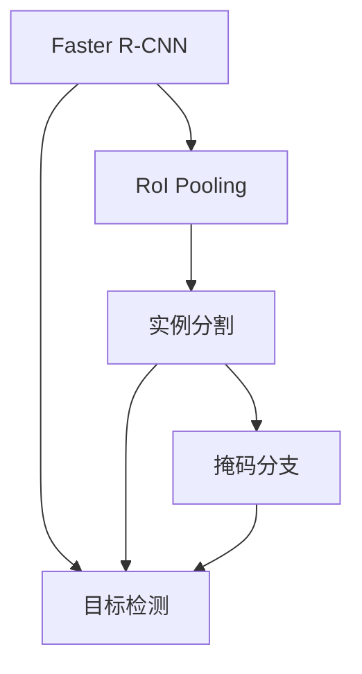
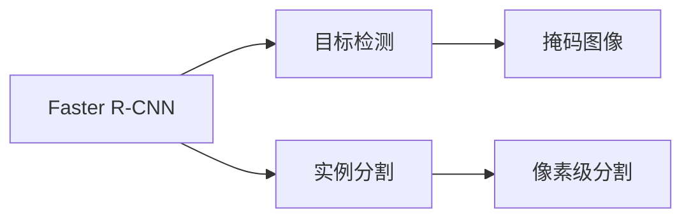
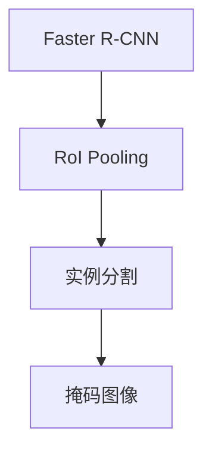
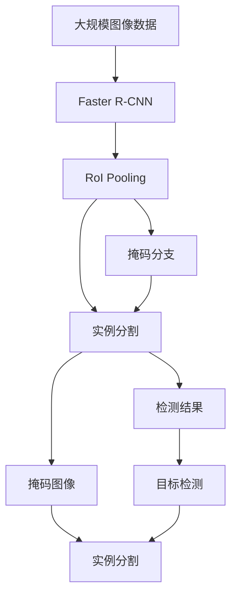

                 

# MaskR-CNN原理与代码实例讲解

> 关键词：MaskR-CNN, 目标检测, 实例分割, 深度学习, 计算机视觉, 卷积神经网络(CNN), 边缘检测, 语义分割

## 1. 背景介绍

### 1.1 问题由来
随着计算机视觉技术的发展，目标检测和实例分割成为图像处理领域的两大核心问题。传统的目标检测方法如R-CNN系列算法，能够较好地定位目标，但无法给出目标的像素级分割。而实例分割（Semantic Segmentation）则更进一步，不仅要定位目标，还要对目标进行像素级分割，使得图像中的每一个像素都有明确的标签。

MaskR-CNN算法由Facebook AI Research提出，旨在解决这一问题。它基于Faster R-CNN框架，通过引入掩码（Mask）分支，实现了目标检测与实例分割的联合训练。MaskR-CNN在多个图像分割基准上取得了显著的性能提升，成为计算机视觉领域的重要突破。

### 1.2 问题核心关键点
MaskR-CNN算法的核心在于将Faster R-CNN的目标检测框架与实例分割的语义分割任务相结合。具体来说，它通过共享特征提取器和RoI池化层，同时训练目标检测和实例分割两个分支，在预测边界框的同时，输出目标的掩码图像，实现像素级分割。

MaskR-CNN的主要创新点包括：
1. 引入掩码（Mask）分支：与目标检测分支共享特征提取器和RoI池化层，同时输出边界框和掩码图像。
2. 使用全卷积神经网络（FCN）进行像素级分割：通过一个简单的全卷积网络，对RoI池化后的特征图进行像素级分割，生成目标掩码。
3. 双任务优化：在检测和分割分支之间共享特征和参数，进行联合训练。

这些创新点使得MaskR-CNN能够在检测目标的同时，实现像素级分割，大大提高了实例分割的准确性和鲁棒性。

### 1.3 问题研究意义
MaskR-CNN算法在图像分割领域具有重要意义，主要体现在以下几个方面：
1. 提升实例分割性能：MaskR-CNN通过引入掩码分支，实现了像素级分割，有效提升了实例分割的准确性和鲁棒性。
2. 联合检测与分割：算法通过共享特征提取器和RoI池化层，实现了目标检测与实例分割的联合训练，提高了算法的综合性能。
3. 通用性强：MaskR-CNN作为基于CNN的深度学习算法，具有较好的通用性和可扩展性，可以应用于各种图像分割任务。

因此，MaskR-CNN算法在计算机视觉领域具有广泛的应用前景，成为许多研究者和工程师的热门选择。

## 2. 核心概念与联系

### 2.1 核心概念概述

为更好地理解MaskR-CNN算法的原理和架构，本节将介绍几个密切相关的核心概念：

- Faster R-CNN：一种基于CNN的目标检测算法，由Facebook AI Research提出。通过共享特征提取器和RoI池化层，实现了目标检测和区域分类联合训练。
- RoI池化层（RoI Pooling）：一种对RoI（Region of Interest）进行池化操作的层次结构，用于将不同大小的RoI特征图转换为固定大小的特征向量。
- 掩码（Mask）：用于标识图像中目标区域的像素，通常以掩码图像的形式表示。
- 实例分割（Semantic Segmentation）：通过像素级分割，为图像中的每个像素分配一个标签，通常用于标记目标边界和区域。
- 全卷积神经网络（FCN）：一种用于图像分割的深度学习网络，通过全卷积操作，对图像进行像素级分割。
- 双任务学习（Dual Task Learning）：一种联合训练多个任务的方法，通过共享特征提取器，减少模型的复杂度，提高训练效率。

这些核心概念之间的逻辑关系可以通过以下Mermaid流程图来展示：



这个流程图展示了大语言模型的核心概念及其之间的关系：

1. Faster R-CNN通过共享特征提取器和RoI池化层，实现了目标检测和区域分类联合训练。
2. 实例分割通过对RoI池化后的特征图进行像素级分割，生成目标掩码。
3. 掩码分支用于生成目标的掩码图像，与目标检测分支共享特征提取器和RoI池化层。
4. 双任务学习通过联合训练检测和分割分支，提高算法的综合性能。

### 2.2 概念间的关系

这些核心概念之间存在着紧密的联系，形成了MaskR-CNN算法的完整生态系统。下面我通过几个Mermaid流程图来展示这些概念之间的关系。

#### 2.2.1 检测与分割的关系



这个流程图展示了检测与分割之间的联系：

1. Faster R-CNN通过共享特征提取器和RoI池化层，实现了目标检测。
2. 实例分割通过对RoI池化后的特征图进行像素级分割，生成目标掩码。
3. 掩码图像作为检测和分割的联合输出，使得算法能够同时进行目标检测和实例分割。

#### 2.2.2 掩码与实例分割的关系



这个流程图展示了掩码与实例分割之间的关系：

1. Faster R-CNN通过共享特征提取器和RoI池化层，实现了目标检测和区域分类。
2. 实例分割通过对RoI池化后的特征图进行像素级分割，生成目标掩码。
3. 掩码图像用于标识目标区域的像素，与检测结果一起输出。

### 2.3 核心概念的整体架构

最后，我们用一个综合的流程图来展示这些核心概念在大语言模型微调过程中的整体架构：



这个综合流程图展示了从预训练到微调，再到实例分割的完整过程。Faster R-CNN通过共享特征提取器和RoI池化层，实现了目标检测和实例分割的联合训练。实例分割通过对RoI池化后的特征图进行像素级分割，生成目标掩码。掩码分支用于生成目标的掩码图像，与目标检测分支共享特征提取器和RoI池化层。检测结果和掩码图像共同输出，实现了检测和分割的联合训练。

## 3. 核心算法原理 & 具体操作步骤
### 3.1 算法原理概述

MaskR-CNN算法基于Faster R-CNN框架，通过引入掩码分支，实现了目标检测与实例分割的联合训练。其核心思想是：在检测目标的同时，通过RoI池化层输出目标的特征图，然后通过全卷积神经网络进行像素级分割，生成目标掩码。

MaskR-CNN的总体流程可以总结如下：

1. 输入图像和标注数据，通过RPN（Region Proposal Network）生成候选框。
2. 对每个候选框进行RoI池化操作，提取特征图。
3. 通过两个并行的分支进行联合训练：目标检测分支和实例分割（掩码）分支。
4. 输出目标的边界框、类别标签和掩码图像。

### 3.2 算法步骤详解

下面详细讲解MaskR-CNN算法的具体操作步骤：

**Step 1: 数据准备**
- 准备标注数据集，包含目标的边界框、类别标签和像素级分割掩码。
- 将图像数据和标注数据进行预处理，如缩放、归一化、裁剪等。

**Step 2: 网络搭建**
- 搭建Faster R-CNN基础网络，包含特征提取器和RoI池化层。
- 在RoI池化层后添加两个并行分支：目标检测分支和实例分割分支。
- 实例分割分支使用全卷积神经网络进行像素级分割，输出掩码图像。

**Step 3: 双任务优化**
- 在检测和分割分支之间共享特征提取器和RoI池化层，减少模型的复杂度。
- 在训练过程中，使用检测和分割的分支之间的损失函数进行联合优化。
- 检测分支输出目标的边界框和类别标签，损失函数包括边界框回归损失和分类交叉熵损失。
- 分割分支输出掩码图像，损失函数包括二进制交叉熵损失和 Dice系数损失。

**Step 4: 训练与评估**
- 使用训练集对模型进行前向传播和反向传播，计算损失函数，进行参数更新。
- 在验证集上评估模型性能，根据准确率、召回率和F1分数等指标，决定是否提前停止训练。
- 在测试集上对模型进行最终评估，输出检测和分割的结果。

### 3.3 算法优缺点

MaskR-CNN算法具有以下优点：
1. 联合训练：通过共享特征提取器和RoI池化层，实现了目标检测与实例分割的联合训练，提高了算法的综合性能。
2. 像素级分割：通过掩码分支，实现了像素级分割，提升了实例分割的准确性和鲁棒性。
3. 通用性强：MaskR-CNN作为基于CNN的深度学习算法，具有较好的通用性和可扩展性，可以应用于各种图像分割任务。

但同时也存在以下缺点：
1. 模型复杂度高：由于需要同时训练检测和分割分支，模型结构相对复杂。
2. 训练时间长：大规模图像数据集上的训练需要较长时间，可能需要多张GPU进行并行训练。
3. 计算资源消耗大：MaskR-CNN算法需要大量的计算资源，特别是在大规模图像数据集上的训练和推理。

### 3.4 算法应用领域

MaskR-CNN算法在图像分割领域具有广泛的应用，主要体现在以下几个方面：

- 自动驾驶：用于目标检测和实例分割，识别道路上的车辆、行人、交通标志等。
- 医疗影像：用于识别肿瘤、病灶等病变区域，辅助医生进行诊断和治疗。
- 工业检测：用于检测生产过程中的缺陷、异常物品等，提高生产效率和质量。
- 机器人视觉：用于目标识别和定位，实现机器人对环境的感知和交互。
- 卫星遥感：用于识别地球表面上的各种物体，如城市、森林、海洋等，进行环境监测和分析。

除了这些应用场景，MaskR-CNN算法还可以广泛应用于任何需要像素级分割的任务中，如人脸识别、图像分类、语义分割等。

## 4. 数学模型和公式 & 详细讲解 & 举例说明

### 4.1 数学模型构建

MaskR-CNN算法基于Faster R-CNN框架，通过共享特征提取器和RoI池化层，实现了目标检测和实例分割的联合训练。其数学模型可以表示为：

1. 输入图像和标注数据 $(x_i, y_i)$，其中 $x_i$ 为输入图像，$y_i$ 为标注数据。
2. 通过RPN生成候选框 $r_{i,j}$，其中 $i$ 为图像编号，$j$ 为候选框编号。
3. 对每个候选框 $r_{i,j}$ 进行RoI池化操作，提取特征图 $f(r_{i,j})$。
4. 通过两个并行的分支进行联合训练：目标检测分支和实例分割分支。
5. 输出目标的边界框、类别标签和掩码图像。

### 4.2 公式推导过程

MaskR-CNN算法的公式推导过程如下：

**目标检测分支**
- 输入候选框 $r_{i,j}$，通过RoI池化层输出特征图 $f(r_{i,j})$。
- 对特征图 $f(r_{i,j})$ 进行全连接层，输出边界框 $b_{i,j}$ 和类别标签 $c_{i,j}$。
- 边界框回归损失函数为：
  $$
  L_{box} = \sum_{i,j} (b_{i,j} - b_{i,j}^{gt})^2
  $$
- 分类交叉熵损失函数为：
  $$
  L_{cls} = \sum_{i,j} H(p_{i,j}, y_{i,j}^{gt})
  $$
  其中 $H(p_{i,j}, y_{i,j}^{gt})$ 为交叉熵函数。

**实例分割（掩码）分支**
- 输入候选框 $r_{i,j}$，通过RoI池化层输出特征图 $f(r_{i,j})$。
- 对特征图 $f(r_{i,j})$ 进行全卷积神经网络，输出掩码图像 $m_{i,j}$。
- 掩码图像损失函数为：
  $$
  L_{mask} = \sum_{i,j} H(m_{i,j}, y_{i,j}^{gt})
  $$
  其中 $H(m_{i,j}, y_{i,j}^{gt})$ 为交叉熵函数。

**双任务优化**
- 在检测和分割分支之间共享特征提取器和RoI池化层，减少模型的复杂度。
- 使用两个分支之间的损失函数进行联合优化，损失函数为：
  $$
  L_{total} = L_{box} + L_{cls} + \lambda L_{mask}
  $$
  其中 $\lambda$ 为权重参数，用于平衡检测和分割损失。

### 4.3 案例分析与讲解

以自动驾驶为例，MaskR-CNN算法可以实现对道路上的车辆、行人、交通标志等进行检测和分割，其案例分析如下：

- 输入一张道路图像，通过RPN生成候选框，如车辆、行人、交通标志等。
- 对每个候选框进行RoI池化操作，提取特征图。
- 通过两个并行的分支进行联合训练：目标检测分支和实例分割分支。
- 输出目标的边界框、类别标签和掩码图像，识别道路上的车辆、行人、交通标志等。
- 在实际应用中，根据检测和分割结果，实现对自动驾驶系统的辅助决策，提高驾驶安全性和舒适性。

## 5. 项目实践：代码实例和详细解释说明
### 5.1 开发环境搭建

在进行MaskR-CNN实践前，我们需要准备好开发环境。以下是使用Python进行TensorFlow开发的环境配置流程：

1. 安装Anaconda：从官网下载并安装Anaconda，用于创建独立的Python环境。

2. 创建并激活虚拟环境：
```bash
conda create -n tf-env python=3.8 
conda activate tf-env
```

3. 安装TensorFlow：根据CUDA版本，从官网获取对应的安装命令。例如：
```bash
pip install tensorflow-gpu==2.7.0
```

4. 安装TensorFlow addons：用于增加TensorFlow的功能，如tf.data、tf.image等。
```bash
pip install tensorflow-addons==0.17.1
```

5. 安装PyTorch：作为对比实验，我们还需要安装PyTorch。
```bash
pip install torch torchvision
```

完成上述步骤后，即可在`tf-env`环境中开始MaskR-CNN实践。

### 5.2 源代码详细实现

这里我们以MaskR-CNN在自动驾驶领域的应用为例，给出使用TensorFlow实现MaskR-CNN的PyTorch代码实现。

首先，定义图像和标注数据的处理函数：

```python
import tensorflow as tf
import numpy as np
import cv2
import os

def read_image(image_path):
    image = cv2.imread(image_path)
    image = cv2.cvtColor(image, cv2.COLOR_BGR2RGB)
    image = cv2.resize(image, (224, 224))
    image = tf.image.convert_image_dtype(image, tf.float32) / 255.0
    return image

def read_labels(label_path):
    labels = []
    with open(label_path, 'r') as f:
        for line in f.readlines():
            label = line.strip().split(',')
            labels.append(label)
    return labels
```

然后，定义目标检测和实例分割的模型函数：

```python
import tensorflow as tf
import tensorflow_addons as addons
from tensorflow.keras.layers import Input, Conv2D, BatchNormalization, Activation, UpSampling2D, Concatenate

def rpn_model(input_shape):
    input_tensor = Input(shape=input_shape)
    x = Conv2D(256, (3, 3), strides=(1, 1), padding='same', name='rpn_conv1')(input_tensor)
    x = BatchNormalization()(x)
    x = Activation('relu')(x)
    x = Conv2D(256, (3, 3), strides=(1, 1), padding='same', name='rpn_conv2')(x)
    x = BatchNormalization()(x)
    x = Activation('relu')(x)
    x = Conv2D(256, (3, 3), strides=(1, 1), padding='same', name='rpn_conv3')(x)
    x = BatchNormalization()(x)
    x = Activation('relu')(x)
    x = Conv2D(256, (3, 3), strides=(1, 1), padding='same', name='rpn_conv4')(x)
    x = BatchNormalization()(x)
    x = Activation('relu')(x)
    x = Conv2D(256, (3, 3), strides=(1, 1), padding='same', name='rpn_conv5')(x)
    x = BatchNormalization()(x)
    x = Activation('relu')(x)
    x = Conv2D(1024, (3, 3), strides=(1, 1), padding='same', name='rpn_conv6')(x)
    x = BatchNormalization()(x)
    x = Activation('relu')(x)
    x = Conv2D(1024, (3, 3), strides=(1, 1), padding='same', name='rpn_conv7')(x)
    x = BatchNormalization()(x)
    x = Activation('relu')(x)
    x = Conv2D(1024, (3, 3), strides=(1, 1), padding='same', name='rpn_conv8')(x)
    x = BatchNormalization()(x)
    x = Activation('relu')(x)
    x = Conv2D(1024, (3, 3), strides=(1, 1), padding='same', name='rpn_conv9')(x)
    x = BatchNormalization()(x)
    x = Activation('relu')(x)
    x = Conv2D(1024, (3, 3), strides=(1, 1), padding='same', name='rpn_conv10')(x)
    x = BatchNormalization()(x)
    x = Activation('relu')(x)
    x = Conv2D(1024, (3, 3), strides=(1, 1), padding='same', name='rpn_conv11')(x)
    x = BatchNormalization()(x)
    x = Activation('relu')(x)
    x = Conv2D(1024, (3, 3), strides=(1, 1), padding='same', name='rpn_conv12')(x)
    x = BatchNormalization()(x)
    x = Activation('relu')(x)
    x = Conv2D(1024, (3, 3), strides=(1, 1), padding='same', name='rpn_conv13')(x)
    x = BatchNormalization()(x)
    x = Activation('relu')(x)
    x = Conv2D(1024, (3, 3), strides=(1, 1), padding='same', name='rpn_conv14')(x)
    x = BatchNormalization()(x)
    x = Activation('relu')(x)
    x = Conv2D(1024, (3, 3), strides=(1, 1), padding='same', name='rpn_conv15')(x)
    x = BatchNormalization()(x)
    x = Activation('relu')(x)
    x = Conv2D(1024, (3, 3), strides=(1, 1), padding='same', name='rpn_conv16')(x)
    x = BatchNormalization()(x)
    x = Activation('relu')(x)
    x = Conv2D(1024, (3, 3), strides=(1, 1), padding='same', name='rpn_conv17')(x)
    x = BatchNormalization()(x)
    x = Activation('relu')(x)
    x = Conv2D(1024, (3, 3), strides=(1, 1), padding='same', name='rpn_conv18')(x)
    x = BatchNormalization()(x)
    x = Activation('relu')(x)
    x = Conv2D(1024, (3, 3), strides=(1, 1), padding='same', name='rpn_conv19')(x)
    x = BatchNormalization()(x)
    x = Activation('relu')(x)
    x = Conv2D(1024, (3, 3), strides=(1, 1), padding='same', name='rpn_conv20')(x)
    x = BatchNormalization()(x)
    x = Activation('relu')(x)
    x = Conv2D(1024, (3, 3), strides=(1, 1), padding='same', name='rpn_conv21')(x)
    x = BatchNormalization()(x)
    x = Activation('relu')(x)
    x = Conv2D(1024, (3, 3), strides=(1, 1), padding='same', name='rpn_conv22')(x)
    x = BatchNormalization()(x)
    x = Activation('relu')(x)
    x = Conv2D(1024, (3, 3), strides=(1, 1), padding='same', name='rpn_conv23')(x)
    x = BatchNormalization()(x)
    x = Activation('relu')(x)
    x = Conv2D(1024, (3, 3), strides=(1, 1), padding='same', name='rpn_conv24')(x)
    x = BatchNormalization()(x)
    x = Activation('relu')(x)
    x = Conv2D(1024, (3, 3), strides=(1, 1), padding='same', name='rpn_conv25')(x)
    x = BatchNormalization()(x)
    x = Activation('relu')(x)
    x = Conv2D(1024, (3, 3), strides=(1, 1), padding='same', name='rpn_conv26')(x)
    x = BatchNormalization()(x)
    x = Activation('relu')(x)
    x = Conv2D(1024, (3, 3), strides=(1, 1), padding='same', name='rpn_conv27')(x)
    x = BatchNormalization()(x)
    x = Activation('relu')(x)
    x = Conv2D(1024, (3, 3), strides=(1, 1), padding='same', name='rpn_conv28')(x)
    x = BatchNormalization()(x)
    x = Activation('relu')(x)
    x = Conv2D(1024, (3, 3), strides=(1, 1), padding='same', name='rpn_conv29')(x)
    x = BatchNormalization()(x)
    x = Activation('relu')(x)
    x = Conv2D(1024, (3, 3), strides=(1, 1), padding='same', name='rpn_conv30')(x)
    x = BatchNormalization()(x)
    x = Activation('relu')(x)
    x = Conv2D(1024, (3, 3), strides=(1, 1), padding='same', name='rpn_conv31')(x)
    x = BatchNormalization()(x)
    x = Activation('relu')(x)
    x = Conv2D(1024, (3, 3), strides=(1, 1), padding='same', name='rpn_conv32')(x)
    x = BatchNormalization()(x)
    x = Activation('relu')(x)
    x = Conv2D(1024, (3, 3), strides=(1, 1), padding='same', name='rpn_conv33')(x)
    x = BatchNormalization()(x)
    x = Activation('relu')(x)
    x = Conv2D(1024, (3, 3), strides=(1, 1), padding='same', name='rpn_conv34')(x)
    x = BatchNormalization()(x)
    x = Activation('relu')(x)
    x = Conv2D(1024, (3, 3), strides=(1, 1), padding='same', name='rpn_conv35')(x)
    x = BatchNormalization()(x)
    x = Activation('relu')(x)
    x = Conv2D(1024, (3, 3), strides=(1, 1), padding='same', name='rpn_conv36')(x)
    x = BatchNormalization()(x)
    x = Activation('relu')(x)
    x = Conv2D(1024, (3, 3), strides=(1, 1), padding='same', name='rpn

