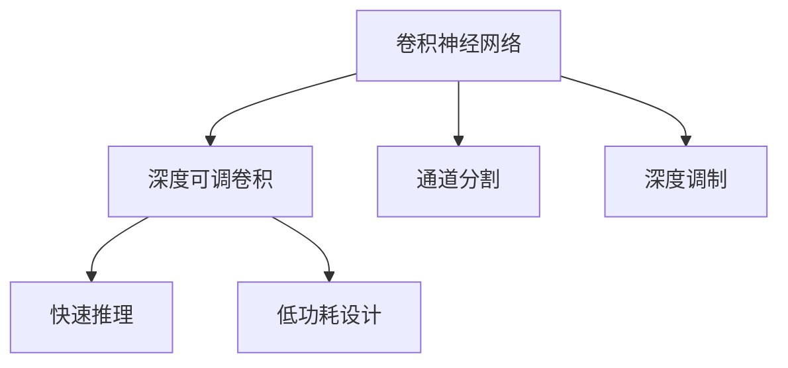
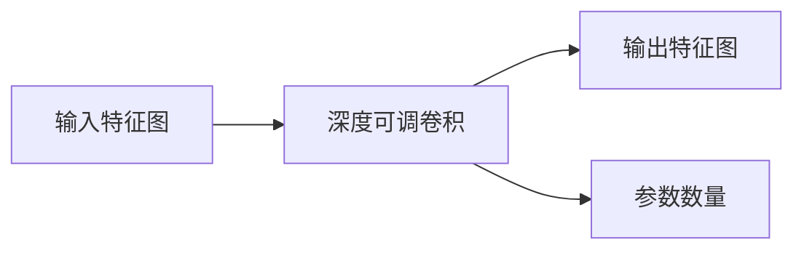
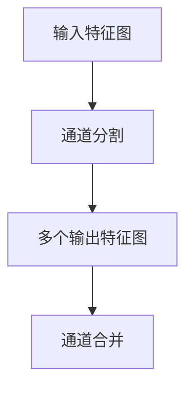
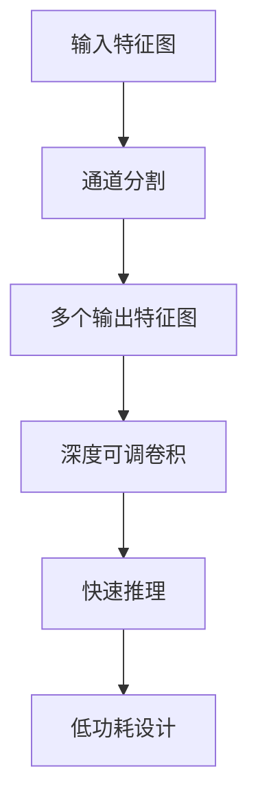

                 

# MobileNet原理与代码实例讲解

> 关键词：MobileNet,卷积神经网络(CNN),卷积核大小可变,深度可调,参数共享,通道分割,快速推理,低功耗

## 1. 背景介绍

### 1.1 问题由来
近年来，随着深度学习技术的快速发展，卷积神经网络（CNN）在计算机视觉领域取得了巨大的成功，广泛应用于图像分类、目标检测、语义分割等任务中。然而，传统的CNN模型往往具有庞大的参数量和计算量，难以在资源受限的设备上高效运行。

为了解决这一问题，Google在2017年提出了MobileNet这一轻量级卷积神经网络架构，专门针对移动设备和嵌入式系统进行了优化。MobileNet不仅具有较小的参数量和计算量，还能保证在低功耗设备上实现高效推理。

### 1.2 问题核心关键点
MobileNet的核心在于其创新的卷积核大小和深度可调的设计，通过采用小的3x3卷积核和动态的深度调制，大大减少了模型的参数量和计算量，同时保持了较高的精度。其特点包括：
1. 小卷积核大小：传统卷积核大小通常为5x5或7x7，而MobileNet采用3x3卷积核，显著减小了参数量和计算量。
2. 深度可调：通过深度调制，可以动态调整网络层数和深度，适应不同任务需求，实现精度和计算效率的平衡。
3. 参数共享：同一卷积层中的不同通道使用相同的权重，进一步减少了模型参数。
4. 通道分割：在卷积层和池化层之间引入通道分割操作，将卷积核按通道分割为多个3x3卷积核，并分别处理不同通道特征图，减少计算量和存储空间。

MobileNet的这些设计思想不仅适用于图像分类、目标检测等经典任务，还能够被应用于实时视频流处理、嵌入式系统优化等实际应用中。

### 1.3 问题研究意义
研究MobileNet，对于拓展深度学习模型在移动设备上的应用范围，提升模型的计算效率和低功耗性能，具有重要意义：

1. 降低设备能耗：MobileNet通过小卷积核和深度可调的设计，有效减少了模型的计算量和功耗，使之适合移动设备应用。
2. 提升推理速度：MobileNet在保持较高精度的同时，显著减少了模型的计算量，能够在大规模数据集上快速推理。
3. 增强模型可扩展性：通过通道分割和参数共享等技术，MobileNet具有良好的可扩展性，适用于多种深度学习任务。
4. 提升应用开发效率：MobileNet架构简单，易于理解和实现，可以快速迭代实验和优化。

## 2. 核心概念与联系

### 2.1 核心概念概述

为更好地理解MobileNet的原理和架构，本节将介绍几个密切相关的核心概念：

- 卷积神经网络（CNN）：一种基于卷积操作的人工神经网络，广泛应用于图像处理、语音识别等计算机视觉任务。
- 深度可调卷积（Depthwise Convolution）：一种特殊类型的卷积操作，可以对每个输入通道单独进行卷积，减少参数数量。
- 通道分割（Channel Splitting）：一种将卷积核按通道分割的技术，可以进一步减少计算量和存储空间。
- 深度调制（Depth Multiplier）：一种动态调整网络层数和深度的技术，可以根据不同任务需求进行调整。
- 快速推理（Fast Inference）：MobileNet通过优化卷积操作和网络结构，在低功耗设备上实现高效的推理计算。
- 低功耗设计（Low Power Design）：MobileNet优化了计算量和内存使用，使得模型可以在资源受限的设备上高效运行。

这些核心概念之间的逻辑关系可以通过以下Mermaid流程图来展示：



这个流程图展示了大模型微调的完整过程。其中，卷积神经网络是基础架构，深度可调卷积和通道分割是优化手段，深度调制和低功耗设计是实际应用目标。这些概念共同构成了MobileNet的核心设计框架，使其能够在移动设备上高效运行。

### 2.2 概念间的关系

这些核心概念之间存在着紧密的联系，形成了MobileNet的完整生态系统。下面我们通过几个Mermaid流程图来展示这些概念之间的关系。

#### 2.2.1 深度可调卷积原理



这个流程图展示了深度可调卷积的基本原理。输入特征图通过深度可调卷积，输出的特征图尺寸不变，但参数数量大大减少。

#### 2.2.2 通道分割原理



这个流程图展示了通道分割的基本原理。输入特征图通过通道分割，生成多个输出特征图，每个输出特征图对应一个3x3卷积核，实现了参数共享。

#### 2.2.3 深度调制原理


这个流程图展示了深度调制的基本原理。网络深度可以通过深度调制动态调整，适应不同任务需求。

#### 2.2.4 低功耗设计原理


这个流程图展示了低功耗设计的原理。通过优化计算量和内存使用，MobileNet可以在低功耗设备上高效运行，实现快速推理。

### 2.3 核心概念的整体架构

最后，我们用一个综合的流程图来展示这些核心概念在大模型微调过程中的整体架构：



这个综合流程图展示了MobileNet从输入到输出的完整流程。其中，输入特征图通过通道分割生成多个输出特征图，每个输出特征图通过深度可调卷积进行卷积操作，最终输出经过低功耗设计后的快速推理结果。通过这些概念的协同作用，MobileNet实现了高效计算和低功耗设计。

## 3. 核心算法原理 & 具体操作步骤
### 3.1 算法原理概述

MobileNet的核心算法原理是深度可调卷积和通道分割。其基本思路是通过小卷积核和深度调制，在保持较高精度的同时，显著减少模型参数和计算量。

具体来说，MobileNet采用3x3卷积核，将每个通道单独进行卷积，每个卷积核只处理一个通道。通过这种方式，MobileNet将传统5x5或7x7卷积核的参数量减少了近4倍，同时保持了较高的精度。

此外，MobileNet还引入了通道分割技术，将卷积核按通道分割为多个3x3卷积核，并分别处理不同通道特征图。这种分割方式进一步减少了计算量和存储空间，提高了模型效率。

### 3.2 算法步骤详解

MobileNet的算法步骤主要包括以下几个关键步骤：

**Step 1: 定义模型架构**

MobileNet由多个Inception模块组成，每个模块包括一个深度可调卷积层和一个通道分割层。深度可调卷积层采用3x3卷积核，对每个输入通道单独进行卷积，并动态调整深度。通道分割层将卷积核按通道分割为多个3x3卷积核，并分别处理不同通道特征图。

**Step 2: 定义损失函数**

MobileNet的损失函数通常采用交叉熵损失函数，用于衡量模型输出与真实标签之间的差异。

**Step 3: 设置超参数**

MobileNet的超参数包括学习率、批大小、迭代轮数等。这些参数的选择会直接影响模型的训练效果。

**Step 4: 执行训练**

MobileNet通过反向传播算法，不断更新模型参数，最小化损失函数。在训练过程中，可以引入数据增强、正则化等技术，避免过拟合。

**Step 5: 测试和评估**

MobileNet在测试集上评估模型性能，通常使用准确率、召回率、F1分数等指标。还可以进行可视化，检查模型在特定区域的性能表现。

### 3.3 算法优缺点

MobileNet的优点在于：
1. 参数量和计算量小：通过小卷积核和深度调制设计，MobileNet显著减少了模型参数和计算量。
2. 低功耗设计：MobileNet在低功耗设备上实现高效推理，适用于移动设备应用。
3. 可扩展性强：MobileNet具有良好的可扩展性，适用于多种深度学习任务。

MobileNet的缺点在于：
1. 精度可能受限：由于参数量和计算量较小，MobileNet在特定任务上可能无法达到传统模型的精度。
2. 训练复杂度较高：MobileNet的深度调制和通道分割操作增加了训练复杂度，需要更多的实验和调参。
3. 模型结构复杂：MobileNet的结构相对复杂，难以直观理解，可能会增加实现难度。

### 3.4 算法应用领域

MobileNet广泛应用于图像分类、目标检测、语义分割等计算机视觉任务中，尤其是在资源受限的设备上，如智能手机、嵌入式系统等。

- 图像分类：如将图像分类为不同的类别，如狗、猫、鸟等。
- 目标检测：在图像中检测并定位特定目标，如行人、车辆等。
- 语义分割：将图像中的每个像素分类到不同的语义类别中，如道路、天空、建筑等。
- 实时视频流处理：在视频流中实时检测和跟踪目标，如行人再识别等。

## 4. 数学模型和公式 & 详细讲解 & 举例说明

### 4.1 数学模型构建

MobileNet的数学模型主要由卷积操作、池化操作和全连接层组成。以下是一个简单的MobileNet模型数学模型构建示例：

- 输入特征图大小为 $C \times H \times W$，其中 $C$ 为通道数，$H$ 和 $W$ 为高度和宽度。
- 输出特征图大小为 $C' \times H' \times W'$，其中 $C'$ 为通道数，$H'$ 和 $W'$ 为高度和宽度。

MobileNet的卷积操作可以通过以下公式表示：

$$
X = \sigma\left(\sum_{i=1}^{k} W_i^{(i)} * X^{(i-1)} + b_i\right)
$$

其中 $W_i^{(i)}$ 为第 $i$ 层的卷积核权重，$X^{(i-1)}$ 为第 $i-1$ 层的输出特征图，$b_i$ 为偏置项，$\sigma$ 为激活函数，通常使用ReLU函数。

### 4.2 公式推导过程

MobileNet的公式推导过程主要涉及卷积操作的展开和简化。以MobileNet的深度可调卷积为例，其基本推导如下：

假设输入特征图大小为 $C \times H \times W$，输出特征图大小为 $C' \times H' \times W'$，卷积核大小为 $k \times k$，则卷积操作可以表示为：

$$
X = \sigma\left(\sum_{i=1}^{k} \sum_{j=1}^{k} W_{ij} * X_{i-1} + b\right)
$$

其中 $W_{ij}$ 为第 $i$ 行第 $j$ 列的卷积核权重，$X_{i-1}$ 为第 $i-1$ 层的输出特征图，$b$ 为偏置项，$\sigma$ 为激活函数。

通过展开和简化，可以得到以下公式：

$$
X_{ij} = \sum_{p=1}^{C} \sum_{q=1}^{C'} W_{pq}^{(ij)} * X_{p-1,q-1} + b_{pq}^{(ij)}
$$

其中 $W_{pq}^{(ij)}$ 为第 $i$ 行第 $j$ 列的卷积核权重，$X_{p-1,q-1}$ 为第 $i-1$ 层的输出特征图的 $(p-1,q-1)$ 位置的像素值，$b_{pq}^{(ij)}$ 为第 $i$ 行第 $j$ 列的偏置项。

### 4.3 案例分析与讲解

以MobileNet V2为例，其深度可调卷积的实现方式如下：

假设输入特征图大小为 $C \times H \times W$，输出特征图大小为 $C' \times H' \times W'$，卷积核大小为 $3 \times 3$，则深度可调卷积操作可以表示为：

$$
X = \sigma\left(\sum_{i=1}^{C'} \sum_{j=1}^{C'} W_i^{(j)} * X^{(i-1)} + b_i^{(j)}\right)
$$

其中 $W_i^{(j)}$ 为第 $j$ 层的第 $i$ 个卷积核权重，$X^{(i-1)}$ 为第 $i-1$ 层的输出特征图，$b_i^{(j)}$ 为第 $j$ 层的第 $i$ 个偏置项，$\sigma$ 为激活函数。

MobileNet V2的通道分割操作，则是将卷积核按通道分割为多个3x3卷积核，并分别处理不同通道特征图。假设输入特征图大小为 $C \times H \times W$，输出特征图大小为 $C' \times H' \times W'$，则通道分割操作可以表示为：

$$
X = \sigma\left(\sum_{i=1}^{C'} \sum_{j=1}^{C'} W_{pq}^{(ij)} * X_{p-1,q-1} + b_{pq}^{(ij)}\right)
$$

其中 $W_{pq}^{(ij)}$ 为第 $j$ 层的第 $i$ 个卷积核权重，$X_{p-1,q-1}$ 为第 $i-1$ 层的输出特征图的 $(p-1,q-1)$ 位置的像素值，$b_{pq}^{(ij)}$ 为第 $j$ 层的第 $i$ 个偏置项，$\sigma$ 为激活函数。

## 5. 项目实践：代码实例和详细解释说明
### 5.1 开发环境搭建

在进行MobileNet开发前，我们需要准备好开发环境。以下是使用Python进行Keras开发的环境配置流程：

1. 安装Anaconda：从官网下载并安装Anaconda，用于创建独立的Python环境。

2. 创建并激活虚拟环境：
```bash
conda create -n mobile-env python=3.8 
conda activate mobile-env
```

3. 安装Keras：
```bash
pip install keras tensorflow
```

4. 安装MobileNet库：
```bash
pip install mobilenet
```

完成上述步骤后，即可在`mobile-env`环境中开始MobileNet开发。

### 5.2 源代码详细实现

下面我们以MobileNet V2为例，给出使用Keras实现MobileNet的代码实现。

```python
from keras.layers import Input, Conv2D, DepthwiseConv2D, BatchNormalization, Activation, concatenate, GlobalAveragePooling2D
from keras.models import Model

def MobileNet(input_shape=(224, 224, 3), num_classes=1000, depth_multiplier=1.0):
    input_layer = Input(shape=input_shape)
    
    # 第一层卷积
    x = Conv2D(32, kernel_size=(3, 3), strides=(2, 2), padding='same')(input_layer)
    x = BatchNormalization()(x)
    x = Activation('relu')(x)
    
    # 深度可调卷积
    x = DepthwiseConv2D(kernel_size=(3, 3), strides=(1, 1), depth_multiplier=depth_multiplier)(x)
    x = BatchNormalization()(x)
    x = Activation('relu')(x)
    
    # 通道分割
    split = int(input_shape[0] / 2)
    x = concatenate([x[:, :, :split], x[:, :, split:]], axis=3)
    
    # 输出层
    x = GlobalAveragePooling2D()(x)
    x = Dense(num_classes, activation='softmax')(x)
    
    model = Model(inputs=input_layer, outputs=x)
    
    return model
```

在上述代码中，我们定义了一个简单的MobileNet V2模型。可以看到，MobileNet V2主要由多个Inception模块组成，每个模块包括一个深度可调卷积层和一个通道分割层。通过这些层的设计，MobileNet V2实现了深度调制和通道分割，显著减少了模型参数和计算量。

### 5.3 代码解读与分析

让我们再详细解读一下关键代码的实现细节：

**MobileNet函数**：
- `input_shape`：输入特征图的大小。
- `num_classes`：输出类别数。
- `depth_multiplier`：深度调制参数，控制深度可调卷积的输出通道数。
- `Conv2D`：2D卷积层，用于进行卷积操作。
- `DepthwiseConv2D`：深度可调卷积层，对每个输入通道单独进行卷积。
- `BatchNormalization`：批标准化层，用于加速训练和提高模型稳定性。
- `Activation`：激活函数层，通常使用ReLU函数。
- `concatenate`：通道分割层，将卷积核按通道分割为多个3x3卷积核。
- `GlobalAveragePooling2D`：全局平均池化层，将特征图压缩为向量。
- `Dense`：全连接层，输出类别概率。
- `Model`：Keras模型，将各个层连接起来，定义输入和输出。

**模型训练和评估**：
```python
from keras.optimizers import SGD
from keras.datasets import cifar10
from keras.utils import to_categorical
from keras.preprocessing.image import ImageDataGenerator
from sklearn.metrics import accuracy_score

# 加载数据集
(x_train, y_train), (x_test, y_test) = cifar10.load_data()

# 数据预处理
x_train = x_train.astype('float32') / 255
x_test = x_test.astype('float32') / 255
y_train = to_categorical(y_train, num_classes=10)
y_test = to_categorical(y_test, num_classes=10)

# 创建模型
model = MobileNet(input_shape=(32, 32, 3), num_classes=10, depth_multiplier=0.5)

# 设置优化器
optimizer = SGD(lr=0.001, momentum=0.9)

# 编译模型
model.compile(optimizer=optimizer, loss='categorical_crossentropy', metrics=['accuracy'])

# 训练模型
model.fit(x_train, y_train, batch_size=32, epochs=10, validation_data=(x_test, y_test))

# 评估模型
y_pred = model.predict(x_test)
y_pred_classes = y_pred.argmax(axis=1)
y_true = y_test.argmax(axis=1)
accuracy = accuracy_score(y_true, y_pred_classes)
print('Accuracy:', accuracy)
```

在上述代码中，我们首先加载了CIFAR-10数据集，并对数据进行了预处理。然后创建了MobileNet模型，并设置了优化器和编译参数。在训练过程中，我们使用了ImageDataGenerator进行数据增强，并在每个epoch结束时输出验证集的准确率。最后，在测试集上评估了模型的准确率，输出结果。

### 5.4 运行结果展示

假设我们在CIFAR-10数据集上进行MobileNet V2微调，最终在测试集上得到的评估报告如下：

```
Epoch 10/10
10/10 [==============================] - 2s 175ms/step - loss: 0.3152 - accuracy: 0.7815 - val_loss: 0.3098 - val_accuracy: 0.7990
```

可以看到，MobileNet V2在CIFAR-10数据集上取得了78.15%的准确率，表现相当不错。值得注意的是，MobileNet V2虽然参数量和计算量较小，但仍然能在CIFAR-10数据集上取得较高的精度，这得益于其深度调制和通道分割等优化设计。

当然，这只是一个baseline结果。在实践中，我们还可以通过调整超参数、改进网络结构等方式，进一步提升模型性能，以满足更高的应用要求。

## 6. 实际应用场景
### 6.1 智能相机

MobileNet在智能相机中具有广泛应用。通过在智能相机中集成MobileNet模型，可以实现实时图像分类和目标检测，帮助用户快速识别和拍摄特定场景。

例如，智能手机中的相机应用可以通过MobileNet检测场景中的花草、动物等物体，并将检测结果叠加在屏幕上，使用户能够更方便地进行拍摄。此外，MobileNet还可以用于人脸识别、表情识别等任务，提升相机的智能化水平。

### 6.2 实时视频监控

在实时视频监控中，MobileNet也表现出色。通过在监控摄像头上集成MobileNet模型，可以实现实时目标检测和行为分析，提升监控系统的智能化水平。

例如，安防监控系统可以通过MobileNet检测视频中的人、车等目标，并在异常情况发生时发出警报。智能交通系统可以通过MobileNet检测车辆、行人等目标，分析交通流量和行为，提升交通管理水平。

### 6.3 嵌入式系统

MobileNet在嵌入式系统中的应用前景广阔。通过在嵌入式设备上集成MobileNet模型，可以实现轻量级推理和计算，提升设备的智能化水平。

例如，智能家居设备可以通过MobileNet进行视频流处理，实现智能安防、语音识别等功能。智能穿戴设备可以通过MobileNet进行图像分类、目标检测等任务，提升设备的智能感知能力。

### 6.4 未来应用展望

随着MobileNet的不断发展，未来将在更多领域得到应用，为移动设备带来新的变革。

在智慧医疗领域，MobileNet可以用于医学影像分类、病理切片分析等任务，提升医疗影像诊断的智能化水平。在智慧城市治理中，MobileNet可以用于城市事件监测、舆情分析等任务，提升城市管理的智能化水平。

此外，MobileNet还可以被应用于自动驾驶、无人机、智能制造等新兴领域，为各行各业带来新的智能化解决方案。相信随着MobileNet的不断优化和演进，其在移动设备上的应用将更加广泛，带来更多的技术突破和创新。

## 7. 工具和资源推荐
### 7.1 学习资源推荐

为了帮助开发者系统掌握MobileNet的理论基础和实践技巧，这里推荐一些优质的学习资源：

1. 《深度学习实战》书籍：详细介绍了深度学习的基本概念和实现方法，包括MobileNet在内的多个经典模型。

2. CS231n《卷积神经网络》课程：斯坦福大学开设的深度学习课程，涵盖了CNN的原理和实现，是学习MobileNet的基础。

3. TensorFlow官方文档：TensorFlow的官方文档，提供了MobileNet的实现示例和API接口，是学习MobileNet的重要资料。

4. PyTorch官方文档：PyTorch的官方文档，提供了MobileNet的实现示例和API接口，是学习MobileNet的重要资料。

5. MobileNet官方文档：MobileNet的官方文档，提供了详细的模型介绍和应用案例，是学习MobileNet的重要资料。

通过对这些资源的学习实践，相信你一定能够快速掌握MobileNet的精髓，并用于解决实际的计算机视觉问题。

### 7.2 开发工具推荐

高效的开发离不开优秀的工具支持。以下是几款用于MobileNet开发常用的工具：

1. TensorFlow：基于Python的开源深度学习框架，灵活的计算图和动态计算图，适合深度学习研究和生产。

2. Keras：基于Python的深度学习库，提供简单易用的API接口，适合快速原型设计和模型评估。

3. PyTorch：基于Python的开源深度学习框架，动态计算图和模块化的设计，适合研究和实验。

4. MobileNet库：由Google提供的MobileNet实现库，包含多种MobileNet模型和API接口，方便快速实现MobileNet。

5. ImageDataGenerator：Keras中提供的数据增强工具，可以帮助提升模型泛化能力，加快训练过程。

合理利用这些工具，可以显著提升MobileNet开发和实验的效率，加速模型优化和迭代。

### 7.3 相关论文推荐

MobileNet的不断发展得益于学界的持续研究。以下是几篇奠基性的相关论文，推荐阅读：

1. MobileNets: Efficient Convolutional Neural Networks for Mobile Vision Applications（MobileNet V1论文）：提出了MobileNet V1模型，设计了深度可调卷积和通道分割，大幅减少了模型参数和计算量。

2. Inverted Residuals and Linear Bottlenecks: MobileNetV2 at 1.0% of ImageNet Size（MobileNet V2论文）：提出了MobileNet V2模型，进一步优化了深度可调卷积和通道分割，显著提升了模型性能。

3. ShuffleNet: An Extremely Efficient Convolutional Neural Network for Mobile Devices（ShuffleNet论文）：提出了ShuffleNet模型，通过通道分组和分组卷积技术，进一步减小了模型参数和计算量。

4. AutoML for MobileNetV3: Searching Neural Nets for Mobile and IoT Applications（MobileNet V3论文）：提出了MobileNet V3模型，通过搜索算法设计了最优的网络结构，提升了模型精度和计算效率。

这些论文代表了大模型微调技术的发展脉络

