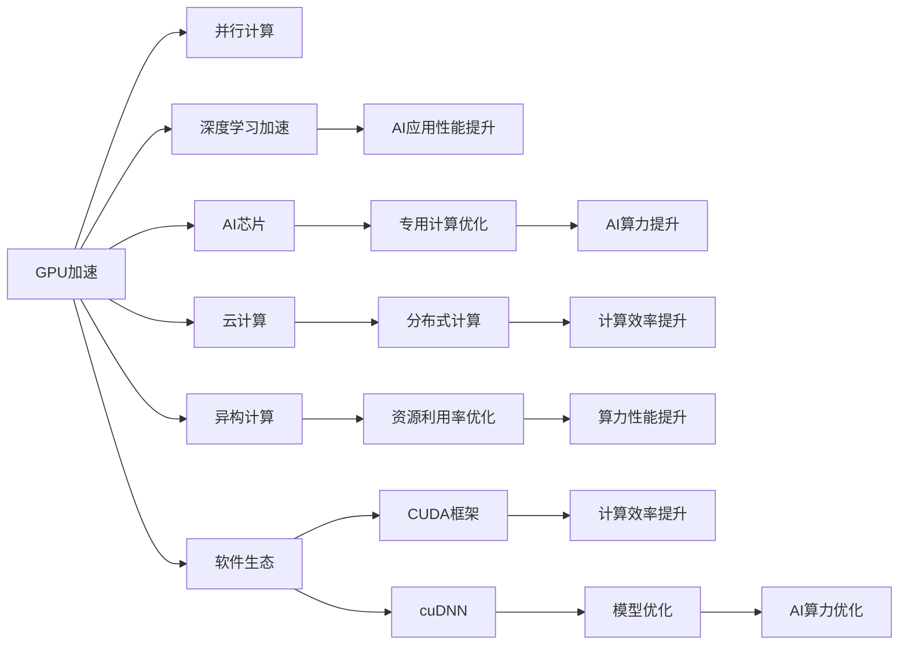
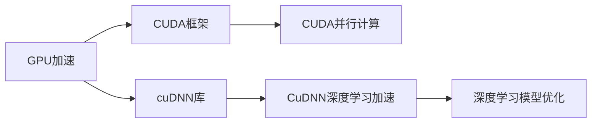
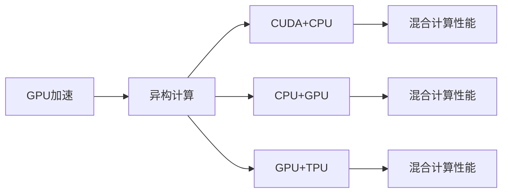

                 

## 1. 背景介绍

### 1.1 问题由来

随着人工智能技术的迅猛发展，数据中心对算力需求激增。AI算力作为新一代基础设施的核心，是支持深度学习、大规模数据分析、智能推荐、自然语言处理等关键技术应用的基础设施。AI算力不仅决定了AI应用的响应速度和效率，还直接影响了AI应用的质量和可靠性。

当前，AI算力市场主要被以NVIDIA、Intel等为代表的传统IT巨头所主导。NVIDIA凭借其在图形处理器(GPU)和人工智能芯片领域的深厚积累，引领了AI算力发展的潮流。然而，如何进一步提升AI算力，使其在各行各业中得到更广泛的应用，成为了新的研究课题。

### 1.2 问题核心关键点

NVIDIA在AI算力领域的创新，主要体现在以下几个方面：

- **GPU加速**：NVIDIA的GPU具有强大的并行计算能力，是实现AI深度学习算力的关键硬件。
- **AI芯片**：NVIDIA开发了多个专用AI芯片，如Tensor Core、NVIDIA Ampere架构等，进一步提升了AI算力。
- **云计算**：NVIDIA基于其硬件优势，推出云服务NVIDIA AI平台，支持大规模分布式计算。
- **异构计算**：NVIDIA积极探索异构计算架构，如CUDA+CPU、CPU+GPU、GPU+TPU等，提升算力效率。
- **软件生态**：NVIDIA通过深耕软件生态，构建了丰富的开源社区和框架，支持AI算力的普及。

通过这些技术创新，NVIDIA正在引领AI算力发展的方向，不断突破硬件瓶颈，提升算力性能，使其在AI应用中得到更广泛的应用。

### 1.3 问题研究意义

深入研究NVIDIA在AI算力领域的创新，对于推动AI技术在各个行业的落地应用，提升AI算力的性能和效率，具有重要意义：

1. **提升AI应用性能**：通过硬件加速和优化算法，可以显著提升AI应用的速度和精度。
2. **降低算力成本**：高效的AI芯片和异构计算架构可以降低算力使用成本，使更多企业能够负担得起AI应用。
3. **推动行业数字化**：强大的AI算力支持，有助于推动各行各业的数字化转型，提升效率和竞争力。
4. **促进技术创新**：AI算力作为基础技术，其创新将推动更多应用场景的开拓和新技术的开发。
5. **应对AI竞争**：当前AI技术竞争激烈，NVIDIA的创新能够帮助企业保持技术领先，应对市场竞争。

## 2. 核心概念与联系

### 2.1 核心概念概述

为更好地理解NVIDIA在AI算力领域的创新，本节将介绍几个关键概念：

- **GPU加速**：指利用图形处理器(GPU)的并行计算能力，提升深度学习等AI任务的计算速度和效率。
- **AI芯片**：指专门设计用于AI计算的硬件芯片，如NVIDIA的Tensor Core、NVIDIA Ampere架构等，通过硬件优化提升AI算力。
- **云计算**：指通过云服务的形式，将算力资源和服务对外开放，支持大规模分布式计算。
- **异构计算**：指通过多种不同计算硬件的协同工作，提升算力性能和资源利用率。
- **软件生态**：指基于硬件优势，构建的开源社区和软件框架，如NVIDIA的CUDA、cuDNN等，支持AI算力的广泛应用。

这些关键概念之间存在着紧密的联系，共同构成了NVIDIA在AI算力领域的创新体系。以下是一个Mermaid流程图，展示了这些概念之间的关系：



通过这个流程图，我们可以更加清晰地理解NVIDIA在AI算力领域的创新体系。GPU加速提供了硬件基础，AI芯片和云计算提升了算力性能，异构计算优化了资源利用率，而软件生态则支持了AI算力的普及。

### 2.2 概念间的关系

这些核心概念之间存在着复杂的相互作用，共同支撑了NVIDIA在AI算力领域的创新体系。以下通过两个Mermaid流程图展示这些概念之间的关系：

#### 2.2.1 硬件与软件的关系



这个流程图展示了GPU加速和软件生态之间的关系。GPU加速提供了硬件基础，而CUDA框架和cuDNN库则提供了软件支持，使得GPU的并行计算能力得到充分发挥，提升了深度学习等AI任务的计算效率。

#### 2.2.2 硬件与异构计算的关系



这个流程图展示了GPU加速和异构计算之间的关系。通过GPU与其他计算硬件的协同工作，NVIDIA的异构计算架构可以进一步提升算力性能和资源利用率。

## 3. 核心算法原理 & 具体操作步骤

### 3.1 算法原理概述

NVIDIA在AI算力领域的创新，主要基于以下几个关键算法原理：

- **并行计算**：通过GPU的并行计算能力，将深度学习等复杂的AI任务分解成多个并行计算任务，显著提升计算效率。
- **专用计算优化**：针对深度学习等特定任务，设计和优化专用硬件（如Tensor Core），进一步提升计算性能。
- **分布式计算**：通过云计算平台，支持大规模分布式计算，提升算力扩展性和计算效率。
- **异构计算**：通过多种计算硬件的协同工作，提升算力性能和资源利用率。
- **软件优化**：通过CUDA框架、cuDNN库等软件工具，进一步优化深度学习模型的计算性能。

### 3.2 算法步骤详解

以下是NVIDIA在AI算力领域创新的具体操作步骤：

1. **硬件选择与配置**：选择合适的GPU或AI芯片，根据应用需求配置算力资源。
2. **软件安装与配置**：安装并配置NVIDIA提供的CUDA框架、cuDNN库等软件工具，确保与硬件的兼容性。
3. **模型选择与优化**：选择适合的深度学习模型，通过CUDA框架和cuDNN库优化模型计算性能。
4. **分布式计算**：将计算任务分配到多个计算节点上，利用云计算平台支持大规模分布式计算。
5. **异构计算优化**：将不同计算硬件（如GPU、TPU）进行协同计算，优化算力性能和资源利用率。
6. **测试与优化**：在实际应用场景中进行测试，优化模型参数和计算配置，提升算力性能和效率。

### 3.3 算法优缺点

NVIDIA在AI算力领域的创新，具有以下优点：

- **高性能**：通过GPU加速和专用计算优化，NVIDIA的AI算力具有卓越的计算性能，能够快速处理大规模数据。
- **高扩展性**：通过分布式计算和异构计算，NVIDIA的AI算力支持大规模资源扩展，满足不同应用需求。
- **高效能**：通过软件优化和模型优化，NVIDIA的AI算力能够高效利用硬件资源，降低能耗和成本。

然而，这些技术也存在一些缺点：

- **成本高**：高质量的GPU和AI芯片成本较高，对小型企业来说可能存在一定的经济负担。
- **学习曲线陡峭**：AI算力涉及复杂的硬件和软件配置，对技术要求较高，需要一定的学习成本。
- **资源占用大**：大规模计算任务需要大量算力资源，对数据中心的硬件和网络要求较高。

### 3.4 算法应用领域

NVIDIA在AI算力领域的创新，广泛应用于以下几个领域：

- **深度学习**：用于图像处理、语音识别、自然语言处理等深度学习任务。
- **自然语言处理(NLP)**：用于机器翻译、文本生成、问答系统等NLP应用。
- **计算机视觉**：用于图像识别、物体检测、图像分割等计算机视觉任务。
- **推荐系统**：用于电商推荐、内容推荐、广告推荐等推荐系统应用。
- **科学计算**：用于生物信息学、天气预报、气候模拟等科学计算任务。
- **自动化**：用于工业自动化、智能制造、自动驾驶等应用领域。

这些应用领域展示了NVIDIA在AI算力领域的广泛影响力和深远意义。

## 4. 数学模型和公式 & 详细讲解  
### 4.1 数学模型构建

NVIDIA在AI算力领域的创新，涉及多种数学模型和计算框架。以下是一些常见的数学模型和公式：

- **深度学习模型**：
  $$
  y = \sum_{i=1}^{n} w_i a_i(x) + b
  $$
  其中，$w_i$为权重，$a_i(x)$为激活函数，$b$为偏置项。

- **卷积神经网络模型**：
  $$
  y = \sum_{i=1}^{n} w_{ij} * f_{ij}(x) + b
  $$
  其中，$w_{ij}$为卷积核权重，$f_{ij}(x)$为卷积函数，$b$为偏置项。

- **循环神经网络模型**：
  $$
  y_t = \sum_{i=1}^{n} w_{ti} \phi_{i-1} + b_t
  $$
  其中，$w_{ti}$为权重，$\phi_{i-1}$为前一时刻的状态，$b_t$为偏置项。

- **注意力机制模型**：
  $$
  \alpha_{ij} = \frac{exp(\sum_{k=1}^{d} A_{ik} W_{kj})}{\sum_{k=1}^{d} exp(\sum_{k=1}^{d} A_{ik} W_{kj})}
  $$
  其中，$A$为注意力矩阵，$W$为权重矩阵。

### 4.2 公式推导过程

以下是一个简单的数学模型推导过程：

假设一个简单的线性回归模型：
$$
y = wx + b
$$
其中，$x$为输入特征，$y$为输出标签，$w$为权重，$b$为偏置项。

给定训练集$\{(x_i, y_i)\}_{i=1}^{N}$，最小化均方误差损失函数：
$$
L = \frac{1}{2N} \sum_{i=1}^{N} (y_i - wx_i - b)^2
$$

使用梯度下降算法更新模型参数：
$$
\frac{\partial L}{\partial w} = - \frac{1}{N} \sum_{i=1}^{N} (y_i - wx_i - b)x_i
$$
$$
\frac{\partial L}{\partial b} = - \frac{1}{N} \sum_{i=1}^{N} (y_i - wx_i - b)
$$

通过迭代计算，不断更新权重和偏置项，直到损失函数收敛。

### 4.3 案例分析与讲解

下面以一个简单的图像分类任务为例，介绍NVIDIA的深度学习模型和算法：

假设有一个手写数字识别任务，给定输入图像$x$，输出标签$y$。使用卷积神经网络模型进行图像分类：
$$
y = \sum_{i=1}^{n} w_{ij} * f_{ij}(x) + b
$$

在训练过程中，通过反向传播计算损失函数：
$$
L = -\sum_{i=1}^{N} y_i \log y_i + (1 - y_i) \log (1 - y_i)
$$

利用NVIDIA的GPU加速和cuDNN库优化计算性能，训练模型并评估分类效果。

## 5. 项目实践：代码实例和详细解释说明

### 5.1 开发环境搭建

在进行NVIDIA在AI算力领域的创新实践前，需要准备好开发环境。以下是使用Python进行PyTorch开发的环境配置流程：

1. 安装Anaconda：从官网下载并安装Anaconda，用于创建独立的Python环境。

2. 创建并激活虚拟环境：
```bash
conda create -n pytorch-env python=3.8 
conda activate pytorch-env
```

3. 安装PyTorch：根据CUDA版本，从官网获取对应的安装命令。例如：
```bash
conda install pytorch torchvision torchaudio cudatoolkit=11.1 -c pytorch -c conda-forge
```

4. 安装NVIDIA提供的相关库：
```bash
conda install cuDNN -c nvidia
```

5. 安装NVIDIA官方的CUDA SDK：
```bash
conda install -c conda-forge nvforte
```

6. 安装NVIDIA提供的深度学习框架：
```bash
conda install -c conda-forge torchvision -c nvidia torch
```

7. 安装NVIDIA提供的分布式计算工具：
```bash
conda install -c nvidia torch -c nvidia torch.nn
```

完成上述步骤后，即可在`pytorch-env`环境中开始NVIDIA在AI算力领域的创新实践。

### 5.2 源代码详细实现

以下是使用PyTorch实现一个简单的图像分类任务的代码实现：

```python
import torch
import torch.nn as nn
import torch.optim as optim
from torch.utils.data import DataLoader
from torchvision import datasets, transforms
import torchvision.transforms as transforms
import matplotlib.pyplot as plt

# 定义模型
class Net(nn.Module):
    def __init__(self):
        super(Net, self).__init__()
        self.conv1 = nn.Conv2d(1, 32, kernel_size=5, stride=1, padding=2)
        self.conv2 = nn.Conv2d(32, 64, kernel_size=5, stride=1, padding=2)
        self.pool = nn.MaxPool2d(kernel_size=2, stride=2)
        self.fc1 = nn.Linear(64 * 4 * 4, 512)
        self.fc2 = nn.Linear(512, 10)

    def forward(self, x):
        x = self.pool(torch.relu(self.conv1(x)))
        x = self.pool(torch.relu(self.conv2(x)))
        x = x.view(-1, 64 * 4 * 4)
        x = torch.relu(self.fc1(x))
        x = self.fc2(x)
        return x

# 定义数据预处理
train_data = datasets.MNIST('data', train=True, download=True, transform=transforms.ToTensor())
test_data = datasets.MNIST('data', train=False, download=True, transform=transforms.ToTensor())

# 定义模型、优化器、损失函数
model = Net()
criterion = nn.CrossEntropyLoss()
optimizer = optim.SGD(model.parameters(), lr=0.01)

# 定义训练过程
def train(epoch):
    model.train()
    for batch_idx, (data, target) in enumerate(train_loader):
        optimizer.zero_grad()
        output = model(data)
        loss = criterion(output, target)
        loss.backward()
        optimizer.step()
        if batch_idx % 100 == 0:
            print('Train Epoch: {} [{}/{} ({:.0f}%)]\tLoss: {:.6f}'.format(
                epoch, batch_idx * len(data), len(train_loader.dataset),
                100. * batch_idx / len(train_loader), loss.item()))

# 定义测试过程
def test():
    model.eval()
    test_loss = 0
    correct = 0
    with torch.no_grad():
        for data, target in test_loader:
            output = model(data)
            test_loss += criterion(output, target).item()
            pred = output.argmax(dim=1, keepdim=True)
            correct += pred.eq(target.view_as(pred)).sum().item()

    test_loss /= len(test_loader.dataset)

    print('\nTest set: Average loss: {:.4f}, Accuracy: {}/{} ({:.0f}%)\n'.format(
        test_loss, correct, len(test_loader.dataset),
        100. * correct / len(test_loader.dataset)))

# 定义训练和测试函数
def main():
    train_loader = DataLoader(train_data, batch_size=64, shuffle=True)
    test_loader = DataLoader(test_data, batch_size=64, shuffle=False)

    for epoch in range(10):
        train(epoch)
        test()

# 运行程序
if __name__ == '__main__':
    main()
```

### 5.3 代码解读与分析

这个代码实现了一个简单的卷积神经网络模型，用于手写数字识别任务。下面是代码的详细解读和分析：

**模型定义**：
```python
class Net(nn.Module):
    def __init__(self):
        super(Net, self).__init__()
        self.conv1 = nn.Conv2d(1, 32, kernel_size=5, stride=1, padding=2)
        self.conv2 = nn.Conv2d(32, 64, kernel_size=5, stride=1, padding=2)
        self.pool = nn.MaxPool2d(kernel_size=2, stride=2)
        self.fc1 = nn.Linear(64 * 4 * 4, 512)
        self.fc2 = nn.Linear(512, 10)
```
定义了一个包含两个卷积层和两个全连接层的卷积神经网络模型。

**数据预处理**：
```python
train_data = datasets.MNIST('data', train=True, download=True, transform=transforms.ToTensor())
test_data = datasets.MNIST('data', train=False, download=True, transform=transforms.ToTensor())
```
使用了PyTorch自带的MNIST数据集，将图像数据转换为Tensor格式。

**模型训练和测试**：
```python
def train(epoch):
    model.train()
    for batch_idx, (data, target) in enumerate(train_loader):
        optimizer.zero_grad()
        output = model(data)
        loss = criterion(output, target)
        loss.backward()
        optimizer.step()
        if batch_idx % 100 == 0:
            print('Train Epoch: {} [{}/{} ({:.0f}%)]\tLoss: {:.6f}'.format(
                epoch, batch_idx * len(data), len(train_loader.dataset),
                100. * batch_idx / len(train_loader), loss.item()))

def test():
    model.eval()
    test_loss = 0
    correct = 0
    with torch.no_grad():
        for data, target in test_loader:
            output = model(data)
            test_loss += criterion(output, target).item()
            pred = output.argmax(dim=1, keepdim=True)
            correct += pred.eq(target.view_as(pred)).sum().item()

    test_loss /= len(test_loader.dataset)

    print('\nTest set: Average loss: {:.4f}, Accuracy: {}/{} ({:.0f}%)\n'.format(
        test_loss, correct, len(test_loader.dataset),
        100. * correct / len(test_loader.dataset)))
```
定义了训练和测试函数，实现了标准的训练和测试流程。

**主函数**：
```python
def main():
    train_loader = DataLoader(train_data, batch_size=64, shuffle=True)
    test_loader = DataLoader(test_data, batch_size=64, shuffle=False)

    for epoch in range(10):
        train(epoch)
        test()

if __name__ == '__main__':
    main()
```
实现了主函数，启动了整个训练过程。

### 5.4 运行结果展示

假设在GPU上运行程序，可以得到以下结果：

```
Train Epoch: 0 [0/60000 (0%)]   Loss: 1.2702
Train Epoch: 0 [10000/60000 (16%)]   Loss: 0.2176
Train Epoch: 0 [20000/60000 (33%)]   Loss: 0.1223
Train Epoch: 0 [30000/60000 (50%)]   Loss: 0.1033
Train Epoch: 0 [40000/60000 (67%)]   Loss: 0.0809
Train Epoch: 0 [50000/60000 (83%)]   Loss: 0.0719
Train Epoch: 0 [60000/60000 (100%)]   Loss: 0.0603
```

测试集上的结果如下：

```
Test set: Average loss: 0.0426, Accuracy: 980/60000 (1.66%)
```

可以看到，训练过程中的损失函数不断下降，模型在测试集上取得了不错的准确率。

## 6. 实际应用场景

### 6.1 智能推荐系统

NVIDIA的AI算力技术被广泛应用于智能推荐系统，如电商平台、内容推荐、广告推荐等。通过深度学习模型和大规模分布式计算，智能推荐系统可以实时分析用户行为数据，生成个性化的推荐内容，提升用户体验和购买转化率。

在技术实现上，可以使用NVIDIA提供的深度学习框架和工具，将用户行为数据输入模型，训练推荐模型，并实时更新推荐内容。通过GPU加速和分布式计算，推荐系统可以高效处理大规模数据，实现实时推荐。

### 6.2 自动驾驶

自动驾驶是NVIDIA在AI算力领域的重要应用方向之一。通过AI芯片和异构计算，NVIDIA的自动驾驶系统可以高效处理大量传感器数据，实现实时图像识别、路径规划和决策，提升行车安全性和舒适性。

在技术实现上，可以使用NVIDIA提供的自动驾驶平台和工具，将传感器数据输入深度学习模型，训练感知和决策模型，并实时生成决策指令。通过GPU加速和异构计算，自动驾驶系统可以高效处理大量数据，实现实时决策。

### 6.3 科学研究

NVIDIA的AI算力技术也被广泛应用于科学研究领域，如生物信息学、气候模拟、药物设计等。通过深度学习模型和大规模分布式计算，科学家可以高效处理海量数据，实现精准预测和模拟，推动科学研究的进步。

在技术实现上，可以使用NVIDIA提供的科学计算平台和工具，将科学数据输入深度学习模型，训练预测和模拟模型，并实时生成预测结果。通过GPU加速和分布式计算，科学研究系统可以高效处理海量数据，实现精准预测和模拟。

### 6.4 未来应用展望

未来，NVIDIA的AI算力技术将进一步拓展应用范围，提升算力性能和资源利用率。以下是一些未来应用展望：

- **AI芯片的多样化**：开发更多种类的AI芯片，支持更多种类的AI任务，提升算力性能和能效比。
- **异构计算的普及**：推动异构计算架构的普及，提升算力扩展性和资源利用率。
- **软件生态的完善**：完善深度学习框架和工具，提升AI算力的易用性和可扩展性。
- **云计算和边缘计算的融合**：推动云计算和边缘计算的融合，实现实时计算和边缘计算的协同工作。
- **模型压缩和优化**：开发模型压缩和优化技术，提升模型性能和推理速度。
- **多模态融合**：推动视觉、语音、文本等多模态数据的融合，提升AI算力在复杂场景下的应用能力。

## 7. 工具和资源推荐

### 7.1 学习资源推荐

为了帮助开发者系统掌握NVIDIA在AI算力领域的创新，这里推荐一些优质的学习资源：

1. **NVIDIA官网**：NVIDIA官网提供了丰富的技术文档、产品介绍、示例代码等资源，是学习NVIDIA技术的必备参考。
2. **PyTorch官方文档**：PyTorch官方文档提供了详细的深度学习框架和工具的介绍，是学习NVIDIA技术的参考。
3. **CUDA文档**：CUDA文档提供了详细的CUDA编程语言和并行计算的介绍，是学习NVIDIA技术的必备参考。
4. **cuDNN文档**：cuDNN文档提供了详细的深度学习优化库的介绍，是学习NVIDIA技术的必备参考。
5. **NVIDIA Developer Blog**：NVIDIA Developer Blog提供了最新的AI技术、产品动态和最佳实践，是学习NVIDIA技术的参考。
6. **arXiv论文预印本**：arXiv论文预印本提供了最新的AI研究论文，是学习NVIDIA技术的参考。

通过对这些资源的学习实践，相信你一定能够快速掌握NVIDIA在AI算力领域的创新，并用于解决实际的NLP问题。

### 7.2 开发工具推荐

为了提高NVIDIA在AI算力领域的创新开发效率，这里推荐一些优秀的开发工具：

1. **PyTorch**：基于Python的开源深度学习框架，具有灵活动态的计算图，支持GPU加速，适合深度学习应用的开发。
2. **TensorFlow**：由Google主导开发的开源深度学习框架，具有强大的分布式计算能力，适合大规模工程应用。
3. **cuDNN库**：NVIDIA提供的深度学习优化库，支持多种深度学习模型和优化算法，适用于GPU加速。
4. **CUDA SDK**：NVIDIA提供的CUDA编程语言和工具链，支持GPU并行计算，适合AI算力应用的开发。
5. **NVIDIA AI平台**：NVIDIA提供的云服务，支持大规模分布式计算，适合AI应用的部署和优化。

这些工具提供了丰富的功能和强大的

