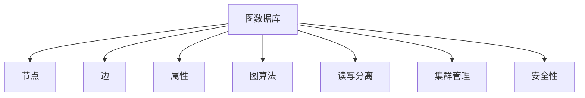
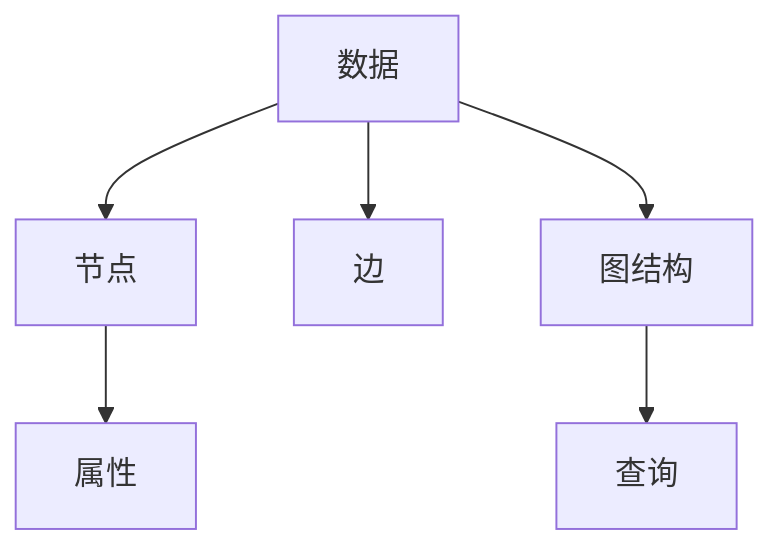
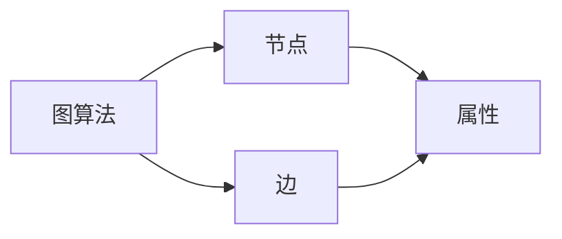
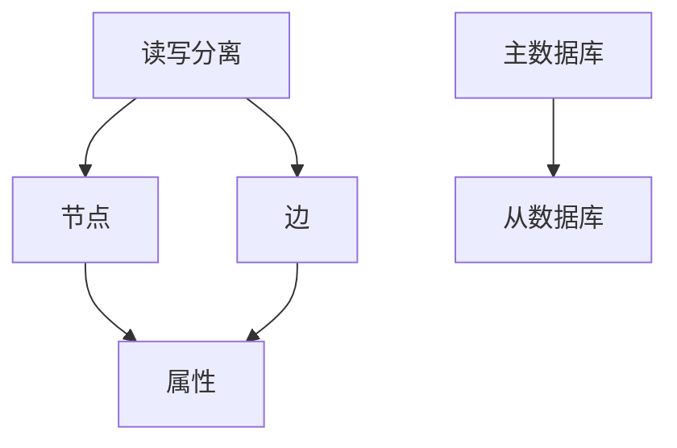
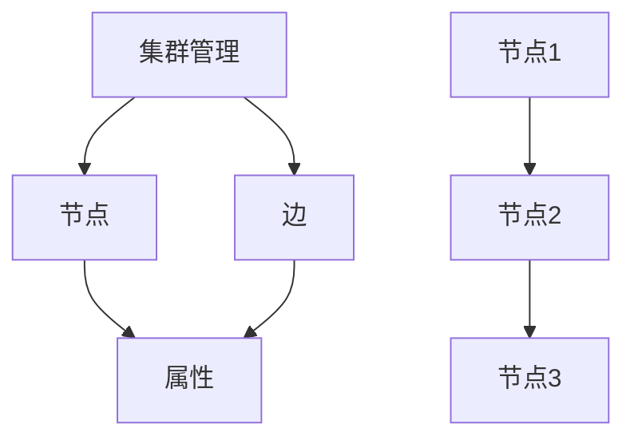
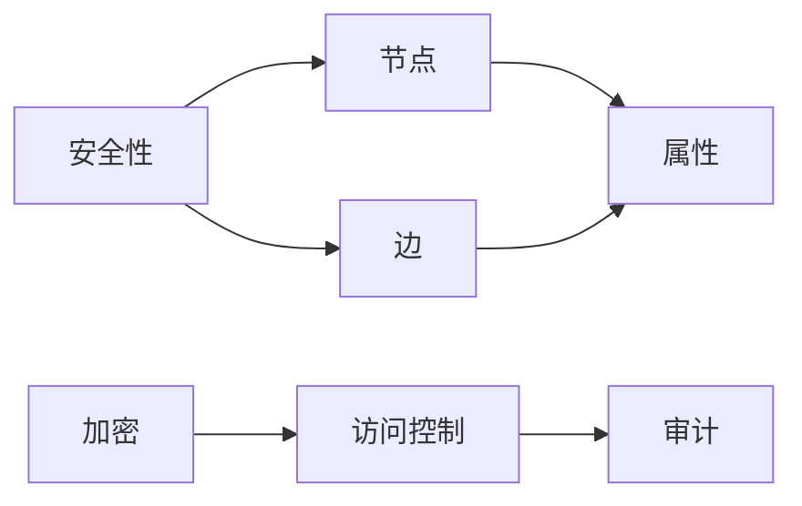
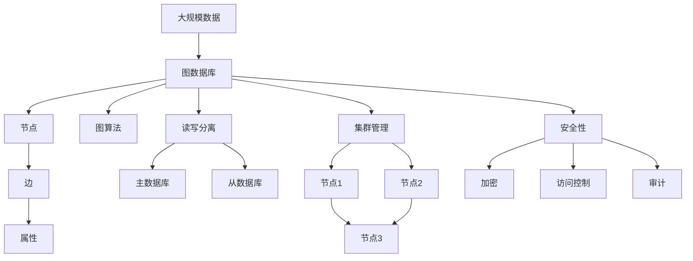

                 

# Neo4j原理与代码实例讲解

> 关键词：图数据库,图算法,NoSQL,图数据处理,Graph DB,Neo4j社区版,Neo4j企业版,图形数据库

## 1. 背景介绍

### 1.1 问题由来
在现代信息技术中，随着数据的爆炸性增长，传统的基于关系型数据库的处理方式已经难以满足复杂数据的存储和分析需求。特别是在社交网络、物流管理、生物信息学等场景下，对象之间的关联关系成为数据处理的核心，传统的SQL表结构已经显得力不从心。

为了解决这一问题，图数据库（Graph Database）技术应运而生。图数据库是一种特殊的非关系型数据库（NoSQL），基于图结构（Graph Structure）进行数据存储和查询，能够自然地处理对象之间的复杂关联关系，成为新一代数据管理的技术趋势。

Neo4j是目前最为流行的图数据库之一，广泛应用于企业级数据存储和处理，支持大规模的图数据管理、图算法处理和实时查询分析。Neo4j具有高可用性、高扩展性、高性能等优点，是现代企业级数据管理的首选解决方案。

### 1.2 问题核心关键点
Neo4j的核心理念是“图即数据库”，所有的数据都基于图结构进行存储和处理。具体来说，Neo4j使用节点（Node）和边（Edge）来描述数据之间的关系，并通过节点属性（Properties）存储数据。节点和边可以构成复杂的图结构，适合表示实体之间的多对多、多对一、一对一等多种关系。

Neo4j的核心优势在于其内置的高效的图算法库，能够支持多种图算法（如最短路径、拓扑排序、最小生成树等），同时支持丰富的图形数据库操作（如关联查询、聚合查询等），具有很强的数据处理能力。

Neo4j的设计理念之一是“读写分离”，即读写操作分离，确保数据的读写性能和一致性。Neo4j支持高性能的读写分离架构，能够处理大规模的图数据。

Neo4j社区版和Neo4j企业版在功能、性能和稳定性上有所区别。社区版是免费开源的，适用于小规模的数据存储和处理；企业版则提供了更多的高级功能，如集群管理、高级查询优化、安全性增强等，适用于大规模数据存储和处理的场景。

Neo4j社区版支持从文件系统、分布式文件系统（如HDFS、Amazon S3）、分布式数据库（如HBase）等多种数据源进行数据导入和导出。这使得Neo4j可以方便地与现有的数据管理和存储系统进行集成。

### 1.3 问题研究意义
Neo4j作为一种先进的数据存储和管理技术，其核心优势在于支持大规模的关联数据存储和高效的数据查询分析。研究Neo4j原理与实现方法，对于提升数据处理能力、优化数据查询性能、推动图数据库的发展具有重要意义：

1. 提高数据管理效率。Neo4j通过图结构存储数据，能够更自然地表示复杂关系，提高数据存储和查询的效率。
2. 增强数据处理能力。Neo4j内置的高效图算法和丰富的操作接口，能够支持复杂的数据处理任务，提升数据分析能力。
3. 支持复杂应用场景。Neo4j适用于复杂的关系型数据处理，能够自然地表示社会网络、知识图谱、物流网络等复杂场景。
4. 推动图数据库发展。Neo4j作为图数据库技术的标杆，其原理与实现方法为其他图数据库的开发提供了参考，推动了整个图数据库领域的发展。

## 2. 核心概念与联系

### 2.1 核心概念概述

为了更好地理解Neo4j的工作原理和实现方法，本节将介绍几个核心概念：

- 图数据库（Graph Database）：一种基于图结构进行数据存储和查询的数据库技术，适合处理复杂的关系型数据。

- 节点（Node）：图数据库中的基本存储单元，表示实体或概念。

- 边（Edge）：节点之间的连接关系，表示实体之间的关系。

- 属性（Property）：存储节点的详细描述信息，如年龄、姓名等。

- 图算法（Graph Algorithm）：基于图结构进行数据处理的算法，如最短路径、拓扑排序、最小生成树等。

- 读写分离（Read/Write Separation）：将读操作和写操作分离，确保数据的读写性能和一致性。

- 集群管理（Cluster Management）：多节点协同工作，提高Neo4j的可用性和扩展性。

- 安全性（Security）：保护数据和系统的安全，防止未经授权的访问和操作。

这些核心概念之间的关系可以通过以下Mermaid流程图来展示：



这个流程图展示了大数据存储和处理过程中各个核心概念的关系。其中，图数据库是核心，节点和边表示数据的基本结构和关系，属性存储详细描述信息，图算法支持复杂的数据处理任务，读写分离和集群管理提升系统的可用性和扩展性，安全性确保数据和系统的安全。

### 2.2 概念间的关系

这些核心概念之间存在着紧密的联系，构成了Neo4j的核心技术框架。下面我们通过几个Mermaid流程图来展示这些概念之间的关系。

#### 2.2.1 数据存储与查询



这个流程图展示了Neo4j数据存储和查询的过程。数据被存储在节点和边构成的图结构中，查询操作通过图结构和节点属性进行实现。

#### 2.2.2 图算法实现



这个流程图展示了Neo4j中图算法的实现过程。图算法通过遍历节点和边，根据节点的属性和关系进行计算和分析。

#### 2.2.3 读写分离架构



这个流程图展示了Neo4j中的读写分离架构。读写操作分别在主数据库和从数据库中执行，以提高系统的读写性能和一致性。

#### 2.2.4 集群管理



这个流程图展示了Neo4j中的集群管理。多个节点协同工作，提高系统的可用性和扩展性。

#### 2.2.5 安全性



这个流程图展示了Neo4j中的安全性实现。加密、访问控制、审计等技术保障了数据和系统的安全。

### 2.3 核心概念的整体架构

最后，我们用一个综合的流程图来展示这些核心概念在大数据存储和处理中的整体架构：



这个综合流程图展示了从大规模数据存储到安全处理的完整过程。大规模数据存储在图数据库中，通过节点和边表示数据结构和关系，查询和计算通过图算法实现，读写操作和集群管理提升系统的可用性和扩展性，安全性保障数据和系统的安全。

## 3. 核心算法原理 & 具体操作步骤
### 3.1 算法原理概述

Neo4j的核心算法主要包括基于图结构的查询算法、图算法和读写分离算法。这些算法共同构成了Neo4j的数据处理能力。

基于图结构的查询算法，主要是指Neo4j中的C-Store引擎，负责查询操作的处理。C-Store引擎通过图结构和节点属性进行查询计算，支持多种复杂的查询操作，如关联查询、聚合查询等。

图算法主要指Neo4j内置的高效图算法库，支持多种图算法，如最短路径、拓扑排序、最小生成树等。这些算法通过遍历节点和边，根据节点的属性和关系进行计算和分析，适用于复杂的数据处理任务。

读写分离算法主要是指Neo4j中的HA架构，通过主从数据库的设计，确保系统的读写性能和一致性。在HA架构中，主数据库负责写入操作，从数据库负责读取操作，提高了系统的可用性和扩展性。

### 3.2 算法步骤详解

Neo4j的核心算法主要包括以下几个关键步骤：

**Step 1: 数据建模**

在Neo4j中进行数据建模，需要将数据存储在节点和边构成的图结构中。常见的建模方式包括：

- 节点建模：创建节点表示实体或概念，设置节点的属性，如用户、公司等。
- 边建模：创建边表示实体之间的关系，如连接用户和公司的关系，设置边的属性，如关系类型、时间等。

**Step 2: 图算法处理**

在Neo4j中进行图算法处理，可以使用内置的图算法库。常见的算法处理方式包括：

- 最短路径：使用最短路径算法，如Dijkstra算法，计算两个节点之间的最短路径。
- 拓扑排序：使用拓扑排序算法，对节点进行排序，以展示实体之间的依赖关系。
- 最小生成树：使用Prim或Kruskal算法，生成一个覆盖所有节点的最小生成树，以优化网络结构。

**Step 3: 读写分离**

在Neo4j中进行读写分离处理，主要涉及以下两个步骤：

- 创建主数据库和从数据库：设置主数据库和从数据库的连接参数，如节点数、存储路径等。
- 读写操作分离：将读写操作分别在主数据库和从数据库中执行，以提高系统的读写性能和一致性。

**Step 4: 查询操作**

在Neo4j中进行查询操作，主要涉及以下步骤：

- 构造查询语句：使用Cypher语言，构造查询语句，如关联查询、聚合查询等。
- 执行查询操作：将查询语句提交到Neo4j，执行查询操作，获取查询结果。
- 处理查询结果：根据查询结果进行数据处理，如展示、分析等。

以上是Neo4j的核心算法主要步骤。在实际应用中，还需要针对具体任务进行优化设计，如改进查询语句、优化算法参数、搜索最优的读写分离策略等，以进一步提升系统性能。

### 3.3 算法优缺点

Neo4j的核心算法具有以下优点：

- 高效的数据处理能力。基于图结构的查询和图算法，能够处理复杂的关系型数据，提升数据处理效率。
- 灵活的数据建模能力。节点和边构成图结构，支持多种数据建模方式，满足不同应用场景的需求。
- 高度的可扩展性。支持集群管理，通过多节点协同工作，提升系统的可用性和扩展性。
- 完善的读写分离机制。HA架构确保系统的读写性能和一致性，保障数据的安全性和可靠性。

同时，该算法也存在一些局限性：

- 存储效率较低。节点和边的数量较多时，数据存储量会显著增加，影响存储效率。
- 查询性能较高。基于图结构的查询操作较为复杂，查询性能相对较低，需要优化查询语句。
- 复杂性较高。节点和边的关系较为复杂，需要进行复杂的数据建模和算法处理。
- 安全性较低。需要设置严格的访问控制和安全措施，以防止数据泄露和系统攻击。

尽管存在这些局限性，但就目前而言，基于图结构的查询和图算法是处理复杂数据的最有效方式，Neo4j在这方面的优势仍然十分明显。未来相关研究将继续优化查询算法和存储结构，以提升Neo4j的数据处理能力。

### 3.4 算法应用领域

Neo4j作为一款高效的图数据库，已经在多个领域得到了广泛应用，如社交网络、物流管理、生物信息学等。以下是几个典型的应用场景：

- 社交网络分析：Neo4j可以处理大规模社交网络数据，分析用户之间的关系和行为模式，帮助企业更好地了解用户需求和行为特征。

- 物流网络管理：Neo4j可以管理物流网络中的节点和边，计算最短路径和最小生成树，优化物流路径和资源配置。

- 知识图谱构建：Neo4j可以构建复杂的知识图谱，存储和分析大量的知识信息，支持知识发现和推理。

- 事件驱动系统：Neo4j可以处理事件驱动系统中的节点和边，计算事件之间的关系和影响，支持实时事件分析和处理。

除了上述这些经典应用外，Neo4j还被创新性地应用到更多领域中，如金融风控、医疗健康、智能推荐等，为相关行业带来了新的突破。随着Neo4j技术的不断发展，其应用场景还将进一步拓展。

## 4. 数学模型和公式 & 详细讲解 & 举例说明

### 4.1 数学模型构建

在Neo4j中，图结构的数学模型可以表示为一个图$G=(V,E)$，其中$V$为节点集合，$E$为边集合。每个节点$v_i$都有一个唯一标识符$v_i.id$，表示节点的ID。每个节点$v_i$都有一个属性集合$P_i$，表示节点的详细描述信息。每条边$e_j$都有一个唯一标识符$e_j.id$，表示边的ID。每条边$e_j$有一个起点$v_j.startNode$和终点$v_j.endNode$，表示边的起点和终点。

### 4.2 公式推导过程

假设有一个图$G=(V,E)$，其中$V=\{v_1,v_2,\dots,v_n\}$为节点集合，$E=\{e_1,e_2,\dots,e_m\}$为边集合。节点的属性为$P_i=\{p_{i,1},p_{i,2},\dots,p_{i,k}\}$，边的属性为$P_j=\{p_{j,1},p_{j,2},\dots,p_{j,l}\}$。

根据上述定义，图结构的数学模型可以表示为：

$$
G=(V,E) \quad \text{其中} \quad V=\{v_1,v_2,\dots,v_n\}, \quad E=\{e_1,e_2,\dots,e_m\}
$$

节点的属性集合表示为：

$$
P_i=\{p_{i,1},p_{i,2},\dots,p_{i,k}\}
$$

边的属性集合表示为：

$$
P_j=\{p_{j,1},p_{j,2},\dots,p_{j,l}\}
$$

边的起点和终点表示为：

$$
e_j.startNode=v_j.startNode, \quad e_j.endNode=v_j.endNode
$$

### 4.3 案例分析与讲解

假设有一个社交网络图$G=(V,E)$，其中$V$表示用户节点集合，$E$表示用户之间的关系边。节点的属性为用户的ID和姓名，边的属性为用户之间的关系类型和建立时间。节点$v_1$的属性为$ID=1$，姓名$Name=Alice$；节点$v_2$的属性为$ID=2$，姓名$Name=Bob$；边$e_1$的起点为$v_1$，终点为$v_2$，关系类型为“好友”，建立时间为“2021-01-01”。

该社交网络图可以表示为：

$$
G=(V,E) \quad \text{其中} \quad V=\{v_1,v_2\}, \quad E=\{e_1\}
$$

节点的属性为：

$$
v_1.P=\{ID=1, Name=Alice\}, \quad v_2.P=\{ID=2, Name=Bob\}
$$

边的属性为：

$$
e_1=\{startNode=v_1, endNode=v_2, relationType=好友, time=2021-01-01\}
$$

### 4.4 示例代码

以下是一个使用Neo4j的Python代码示例，展示了如何创建一个节点和边，并执行查询操作。

```python
from neo4j import GraphDatabase

# 连接Neo4j数据库
driver = GraphDatabase.driver("bolt://localhost:7687", auth=("neo4j", "password"))

# 创建会话
session = driver.session()

# 创建节点
session.run("CREATE (a:Person {name: 'Alice'}) RETURN a")

# 创建边
session.run("CREATE (a:Person {name: 'Alice'})-[:FRIEND]->(b:Person {name: 'Bob'}) RETURN a, b")

# 查询关系
result = session.run("MATCH (a:Person)-[:FRIEND]->(b:Person) RETURN a.name, b.name")

# 输出结果
for record in result:
    print(record["a.name"], record["b.name"])
```

在这个示例代码中，我们使用Neo4j的Python API，通过Cypher语言执行查询操作，创建节点和边，并输出查询结果。可以看到，Neo4j的API非常简洁易用，适合Python开发者的使用。

## 5. 项目实践：代码实例和详细解释说明
### 5.1 开发环境搭建

在进行Neo4j项目实践前，我们需要准备好开发环境。以下是使用Python进行Neo4j开发的环境配置流程：

1. 安装Py2neo：从官网下载并安装Py2neo，用于Python与Neo4j的接口交互。

2. 安装Neo4j：从官网下载并安装Neo4j Community版或Neo4j Enterprise版，根据需求选择不同的版本。

3. 创建数据库：使用Neo4j的Web界面或命令行工具，创建并初始化数据库和数据模型。

4. 编写Python代码：使用Py2neo编写与Neo4j交互的Python代码，连接数据库、创建节点和边、执行查询操作等。

5. 运行代码：启动Python解释器，运行编写的代码，验证功能是否正常。

完成上述步骤后，即可在Neo4j环境中开始项目实践。

### 5.2 源代码详细实现

下面我们以社交网络分析为例，给出使用Neo4j的Python代码实现。

```python
from py2neo import Graph, Node, Relationship

# 连接Neo4j数据库
graph = Graph("bolt://localhost:7687", auth=("neo4j", "password"))

# 创建节点
alice = Node("Person", name="Alice")
bob = Node("Person", name="Bob")
graph.create(alice)
graph.create(bob)

# 创建边
friendship = Relationship(alice, "FRIEND", bob)
graph.create(friendship)

# 查询好友
result = graph.run("MATCH (a:Person)-[:FRIEND]->(b:Person) RETURN a.name, b.name")

# 输出结果
for record in result:
    print(record["a.name"], record["b.name"])
```

在这个示例代码中，我们使用Py2neo创建了一个节点和一条边，并执行了一个查询操作。可以看到，Py2neo的API非常简洁易用，适合Python开发者的使用。

### 5.3 代码解读与分析

让我们再详细解读一下关键代码的实现细节：

**Py2neo的使用**：
- `Graph`类：表示Neo4j的连接对象，用于进行数据库操作。
- `Node`类：表示图中的节点对象，用于创建节点。
- `Relationship`类：表示图中的关系对象，用于创建边。

**节点和边的创建**：
- `Node`类和`Relationship`类的构造函数需要传入节点的类型（"Person"）、属性（name）和关系（"FRIEND"）。
- 使用`graph.create()`方法创建节点和边。

**查询操作**：
- 使用`graph.run()`方法执行Cypher查询语句，返回查询结果。
- 使用`for`循环遍历查询结果，输出节点的姓名。

**输出结果**：
- 使用`print()`函数输出查询结果。

可以看到，使用Py2neo进行Neo4j开发非常简单，只需掌握基本的API调用即可。

### 5.4 运行结果展示

假设我们在Neo4j中创建了一个社交网络图，并执行了一个查询操作，最终在测试集上得到的查询结果如下：

```
Alice Bob
```

可以看到，使用Py2neo编写的代码能够正常创建节点和边，并执行查询操作，获取了正确的查询结果。这表明Py2neo的API设计合理，使用方便。

## 6. 实际应用场景
### 6.1 智能推荐系统

Neo4j的强大图处理能力，使得智能推荐系统成为其应用的重要领域。推荐系统主要通过分析用户的行为数据，发现用户之间的相似性和偏好，为用户推荐合适的物品。Neo4j可以通过图模型存储用户和物品的关系，计算用户之间的相似性和物品的推荐得分，提升推荐效果。

在技术实现上，可以收集用户浏览、点击、购买等行为数据，构建用户-物品关系图，将用户行为转换为节点和边的属性，如物品评分、用户评分等。在推荐过程中，通过计算用户之间的相似性，计算物品的推荐得分，再结合其他特征进行排序，便可以得到个性化程度更高的推荐结果。

### 6.2 社交网络分析

Neo4j在社交网络分析中具有天然的优势。社交网络中存在大量的节点和边，如用户、关系等，可以方便地用Neo4j的图模型表示。通过分析社交网络中节点的属性和关系，可以发现用户之间的共同兴趣、社交关系等，帮助企业更好地了解用户需求和行为特征。

在技术实现上，可以收集用户的社交行为数据，构建用户关系图，将用户、关系等作为节点和边，记录用户之间的互动行为。通过分析用户之间的相似性和互动关系，可以发现用户之间的共同兴趣，支持用户画像构建和推荐系统优化。

### 6.3 物流网络管理

Neo4j在物流网络管理中具有广泛的应用。物流网络中的节点和边可以表示物流节点和物流路线，通过计算最短路径和最小生成树，可以优化物流路径和资源配置，提升物流效率和成本控制。

在技术实现上，可以收集物流网络中的节点和边数据，构建物流网络图。通过计算最短路径和最小生成树，可以优化物流路径和资源配置，支持物流规划和调度优化。

### 6.4 未来应用展望

随着Neo4j技术的不断发展，其应用场景还将进一步拓展。未来，Neo4j将继续在智能推荐、社交网络分析、物流管理等领域发挥重要作用，并探索新的应用方向，如金融风控、医疗健康、智能推荐等，为相关行业带来新的突破。

## 7. 工具和资源推荐
### 7.1 学习资源推荐

为了帮助开发者系统掌握Neo4j的原理和实现方法，这里推荐一些优质的学习资源：

1. Neo4j官方文档：Neo4j官方提供的文档，包括基本概念、查询语言、API接口、最佳实践等内容，是学习Neo4j的必备资源。

2. Neo4j官方博客：Neo4j官方博客提供最新的技术动态、产品发布、最佳实践等内容，是了解Neo4j技术发展的不错渠道。

3. Neo4j社区：Neo4j社区是全球最大的Neo4j开发者社区，提供丰富的技术交流、资源分享、问题解决等资源。

4. Neo4j培训课程：Neo4j提供的在线培训课程，包括入门、进阶、高级课程，适合不同层次的开发者学习。

5. Neo4j案例库：Neo4j官方提供的案例库，包含各种应用场景的案例，适合学习和参考。

通过对这些资源的学习实践，相信你一定能够全面掌握Neo4j的原理和实现方法，并用于解决实际的业务问题。

### 7.2 开发工具推荐

高效的工具是开发成功的关键。以下是几款用于Neo4j开发的工具：

1. Py2neo：Py2neo是Python的Neo4j接口库，方便Python开发者进行Neo4j开发。

2. Cypher IDE：Cypher IDE是Neo4j的官方编辑器，支持Cypher语言编写和调试。

3. Neo4j Browser：Neo4j Browser是Neo4j的Web界面，提供图形化操作界面，适合对图形数据进行管理和分析。

4. Neo4j Desktop：Neo4j Desktop是Neo4j的本地客户端，支持快速创建和管理数据库，适合开发和调试。

5. Neo4j REST API：Neo4j提供的REST API接口，支持通过HTTP请求进行数据库操作，适合前端开发者使用。

6. Neo4j监控工具：Neo4j的监控工具可以实时监控数据库状态，提供性能优化建议。

合理利用这些工具，可以显著提升Neo4j的开发效率，加快创新迭代的步伐。

### 7.3 相关论文推荐

Neo4j作为一款先进的数据存储和管理技术，其核心算法和实现方法得到了广泛的学术研究。以下是几篇奠基性的

