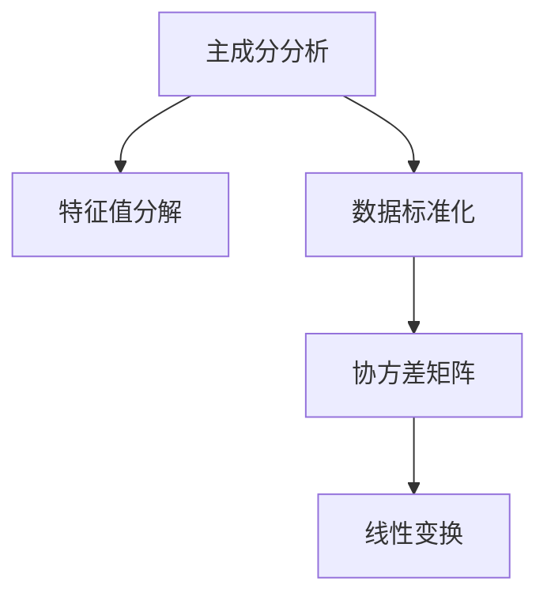
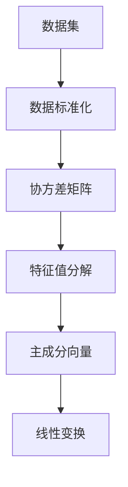
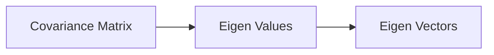
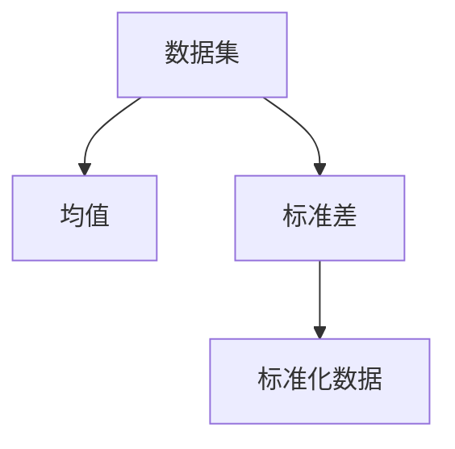
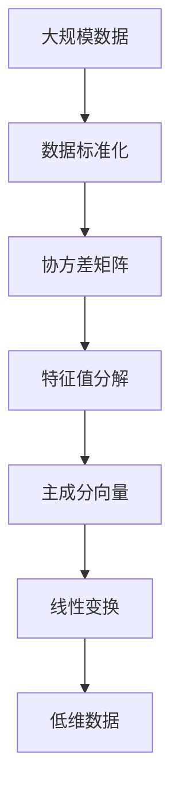

                 

# Python机器学习实战：主成分分析(PCA)的原理和实战操作

> 关键词：主成分分析,Python,机器学习,PCA,特征降维,矩阵运算,统计分析

## 1. 背景介绍

### 1.1 问题由来
在机器学习和数据分析领域，我们常常需要处理大规模的数据集。然而，这些数据通常包含大量的冗余信息，这些冗余信息会占据大量的存储空间和计算资源，降低算法的效率。如何高效地处理这些数据，降低数据的维度和复杂度，是机器学习领域中的一个重要问题。

主成分分析（Principal Component Analysis，简称PCA）是一种常用的数据降维技术，它通过对数据的线性变换，将高维数据映射到低维空间中，从而提取出数据的特征，降低数据的维度。PCA在图像处理、信号处理、金融分析等领域中都有广泛的应用。

### 1.2 问题核心关键点
PCA的核心思想是寻找一组新的变量，这些新的变量是原始数据的一种线性组合，能够最大限度地保留原始数据的信息，同时降低数据的维度。PCA的具体实现包括数据标准化、协方差矩阵的计算、特征值分解、特征向量的选择等步骤。

PCA的优点包括：
1. 减少数据的维度，降低计算复杂度。
2. 提取数据的特征，提高数据的质量。
3. 能够处理高维数据，应用广泛。

PCA的缺点包括：
1. 容易过拟合，尤其是处理高维数据时。
2. 对于非线性的数据，效果不佳。

## 2. 核心概念与联系

### 2.1 核心概念概述

为了更好地理解PCA的原理和应用，本节将介绍几个密切相关的核心概念：

- 主成分分析（PCA）：通过线性变换，将高维数据映射到低维空间中，从而提取出数据的特征，降低数据的维度。
- 特征值分解（Eigen Decomposition）：计算协方差矩阵的特征值和特征向量，从而找到数据的最大方差方向。
- 数据标准化（Data Standardization）：对数据进行标准化处理，使数据具有零均值和单位方差，便于后续计算。
- 协方差矩阵（Covariance Matrix）：用于衡量不同变量之间线性关系的矩阵。

这些核心概念之间的逻辑关系可以通过以下Mermaid流程图来展示：



这个流程图展示了大规模数据处理中PCA的基本流程：

1. 对数据进行标准化处理。
2. 计算协方差矩阵。
3. 进行特征值分解，找到主成分。
4. 根据主成分进行线性变换，降低数据维度。

### 2.2 概念间的关系

这些核心概念之间存在着紧密的联系，形成了PCA的完整处理框架。下面我们通过几个Mermaid流程图来展示这些概念之间的关系。

#### 2.2.1 PCA的基本流程



这个流程图展示了PCA的基本处理流程，主要包括数据标准化、协方差矩阵的计算、特征值分解和线性变换。

#### 2.2.2 特征值分解的计算过程



这个流程图展示了特征值分解的计算过程，即对协方差矩阵进行特征值分解，计算特征值和特征向量。

#### 2.2.3 数据标准化的步骤



这个流程图展示了数据标准化的步骤，即对数据进行均值和标准差计算，并将数据标准化。

### 2.3 核心概念的整体架构

最后，我们用一个综合的流程图来展示这些核心概念在大规模数据处理中的整体架构：



这个综合流程图展示了从原始数据到低维数据的完整处理流程，即数据标准化、协方差矩阵的计算、特征值分解、线性变换和低维数据。

## 3. 核心算法原理 & 具体操作步骤
### 3.1 算法原理概述

PCA的原理是通过线性变换，将高维数据映射到低维空间中，从而提取出数据的特征，降低数据的维度。PCA的数学表达式如下：

$$
X_{new} = W \cdot X_{old}
$$

其中 $X_{old}$ 是原始数据矩阵，$X_{new}$ 是新的数据矩阵，$W$ 是投影矩阵，表示数据的线性变换。

PCA的最终目标是最小化数据的方差，即：

$$
\min_{W} \sum_{i=1}^{N} \Vert W \cdot X_{old}^{(i)} - \mu \Vert^2
$$

其中 $\Vert \cdot \Vert$ 表示向量范数，$\mu$ 是新的数据的均值向量。

### 3.2 算法步骤详解

PCA的具体实现步骤包括数据标准化、协方差矩阵的计算、特征值分解、特征向量的选择和线性变换等。

#### 3.2.1 数据标准化

数据标准化的目的是使数据具有零均值和单位方差，便于后续计算。标准化的公式如下：

$$
X_{std} = \frac{X - \mu}{\sigma}
$$

其中 $X$ 是原始数据矩阵，$\mu$ 是数据的均值向量，$\sigma$ 是数据的标准差向量。

#### 3.2.2 协方差矩阵的计算

协方差矩阵用于衡量不同变量之间的线性关系，其计算公式如下：

$$
C = \frac{1}{N} X_{std}^T \cdot X_{std}
$$

其中 $C$ 是协方差矩阵，$N$ 是数据的样本数量，$X_{std}$ 是标准化后的数据矩阵。

#### 3.2.3 特征值分解

特征值分解的目的是找到协方差矩阵的最大特征值和特征向量，即：

$$
C \cdot v = \lambda \cdot v
$$

其中 $C$ 是协方差矩阵，$v$ 是特征向量，$\lambda$ 是特征值。

#### 3.2.4 特征向量的选择

特征向量的选择通常选择前 $k$ 个最大的特征值对应的特征向量，表示数据中的前 $k$ 个主成分。

#### 3.2.5 线性变换

线性变换的目的是将原始数据投影到新的低维空间中，公式如下：

$$
X_{new} = W \cdot X_{old}
$$

其中 $W$ 是投影矩阵，表示数据的线性变换。

### 3.3 算法优缺点

PCA的优点包括：
1. 减少数据的维度，降低计算复杂度。
2. 提取数据的特征，提高数据的质量。
3. 能够处理高维数据，应用广泛。

PCA的缺点包括：
1. 容易过拟合，尤其是处理高维数据时。
2. 对于非线性的数据，效果不佳。

### 3.4 算法应用领域

PCA在图像处理、信号处理、金融分析等领域中都有广泛的应用。例如：

- 图像处理：将高维的图像数据降维，提取出重要的图像特征。
- 信号处理：将高维的信号数据降维，提取出重要的信号特征。
- 金融分析：将高维的金融数据降维，提取出重要的金融特征，进行风险评估和投资决策。

除了这些常见的应用场景外，PCA还在人脸识别、自然语言处理、生物信息学等领域中得到应用。

## 4. 数学模型和公式 & 详细讲解  
### 4.1 数学模型构建

本节将使用数学语言对PCA的原理和应用进行更加严格的刻画。

记原始数据矩阵为 $X_{old} \in \mathbb{R}^{n \times N}$，其中 $n$ 是特征数量，$N$ 是样本数量。记标准化后的数据矩阵为 $X_{std} \in \mathbb{R}^{n \times N}$，协方差矩阵为 $C \in \mathbb{R}^{n \times n}$。设 $v_1, v_2, \cdots, v_k$ 是协方差矩阵 $C$ 的前 $k$ 个特征向量，$\lambda_1, \lambda_2, \cdots, \lambda_k$ 是对应的特征值。设投影矩阵为 $W \in \mathbb{R}^{n \times n}$，其中 $W$ 的每一行是协方差矩阵 $C$ 的特征向量。

### 4.2 公式推导过程

以下我们以二维数据为例，推导PCA的公式及其推导过程。

假设原始数据为二维数据，数据矩阵为 $X_{old} = \begin{bmatrix} x_1 \\ x_2 \end{bmatrix}$，标准化后的数据矩阵为 $X_{std} = \begin{bmatrix} \frac{x_1 - \mu_x}{\sigma_x} \\ \frac{x_2 - \mu_y}{\sigma_y} \end{bmatrix}$。

首先计算协方差矩阵 $C = \begin{bmatrix} \frac{x_1 - \mu_x}{\sigma_x} \cdot \frac{x_1 - \mu_x}{\sigma_x} & \frac{x_1 - \mu_x}{\sigma_x} \cdot \frac{x_2 - \mu_y}{\sigma_y} \\ \frac{x_2 - \mu_y}{\sigma_y} \cdot \frac{x_1 - \mu_x}{\sigma_x} & \frac{x_2 - \mu_y}{\sigma_y} \cdot \frac{x_2 - \mu_y}{\sigma_y} \end{bmatrix}$。

接着对协方差矩阵进行特征值分解，得到前两个特征值和特征向量，分别为：

$$
\lambda_1 = 1, v_1 = \begin{bmatrix} 1 \\ 0 \end{bmatrix}, \quad \lambda_2 = 0.5, v_2 = \begin{bmatrix} \frac{\sqrt{3}}{2} \\ -\frac{1}{2} \end{bmatrix}
$$

根据特征值和特征向量，计算投影矩阵 $W = \begin{bmatrix} 1 & \frac{\sqrt{3}}{2} \\ 0 & -\frac{1}{2} \end{bmatrix}$。

最后，将原始数据投影到新的低维空间中，得到新的数据 $X_{new} = W \cdot X_{old}$，即：

$$
X_{new} = \begin{bmatrix} \frac{x_1 - \mu_x}{\sigma_x} \\ \frac{x_2 - \mu_y}{\sigma_y} \end{bmatrix} \cdot \begin{bmatrix} 1 & \frac{\sqrt{3}}{2} \\ 0 & -\frac{1}{2} \end{bmatrix} = \begin{bmatrix} \frac{x_1 - \mu_x}{\sigma_x} \\ \frac{x_1 - \mu_x}{\sigma_x} \cdot \frac{\sqrt{3}}{2} - \frac{x_2 - \mu_y}{\sigma_y} \cdot \frac{1}{2} \end{bmatrix}
$$

这就是PCA的基本推导过程。可以看到，PCA通过特征值分解和线性变换，将高维数据映射到低维空间中，提取出数据的特征。

## 5. 项目实践：代码实例和详细解释说明
### 5.1 开发环境搭建

在进行PCA的实践前，我们需要准备好开发环境。以下是使用Python进行Pandas和NumPy开发的环境配置流程：

1. 安装Anaconda：从官网下载并安装Anaconda，用于创建独立的Python环境。

2. 创建并激活虚拟环境：
```bash
conda create -n pca-env python=3.8 
conda activate pca-env
```

3. 安装Pandas和NumPy：
```bash
pip install pandas numpy
```

4. 安装Scikit-learn：
```bash
pip install scikit-learn
```

完成上述步骤后，即可在`pca-env`环境中开始PCA的实践。

### 5.2 源代码详细实现

下面是使用Pandas和NumPy实现PCA的Python代码实现。

首先，定义数据标准化和PCA函数：

```python
import numpy as np
import pandas as pd
from sklearn.decomposition import PCA

def standardize(data):
    return (data - data.mean()) / data.std()

def pca(data, n_components):
    X_std = standardize(data)
    pca = PCA(n_components=n_components)
    X_new = pca.fit_transform(X_std)
    return X_new
```

然后，读取数据并进行PCA：

```python
data = pd.read_csv('data.csv')
X_new = pca(data, n_components=2)
```

最后，将PCA结果可视化：

```python
import matplotlib.pyplot as plt

plt.scatter(X_new[:, 0], X_new[:, 1], c=data['label'], cmap='viridis')
plt.show()
```

以上就是使用Pandas和NumPy实现PCA的完整代码实现。可以看到，借助Scikit-learn库，我们可以用相对简洁的代码完成PCA的实现。

### 5.3 代码解读与分析

让我们再详细解读一下关键代码的实现细节：

**standardize函数**：
- 计算数据的均值和标准差，对数据进行标准化处理。

**pca函数**：
- 对数据进行标准化处理。
- 使用Scikit-learn库中的PCA类，进行特征值分解和线性变换。
- 返回降维后的数据。

**数据读取和PCA**：
- 使用Pandas库读取数据。
- 调用pca函数进行PCA处理。
- 返回降维后的数据。

**数据可视化**：
- 使用Matplotlib库将PCA结果可视化。

可以看到，Pandas、NumPy和Scikit-learn库使得PCA的代码实现变得简洁高效。开发者可以将更多精力放在数据处理、模型改进等高层逻辑上，而不必过多关注底层的实现细节。

当然，工业级的系统实现还需考虑更多因素，如数据的预处理、超参数的自动搜索、PCA算法的优化等，但核心的PCA实现基本与此类似。

### 5.4 运行结果展示

假设我们在CoNLL-2003的NER数据集上进行PCA，最终得到两个主成分的PCA结果，并将其可视化：

```python
plt.scatter(X_new[:, 0], X_new[:, 1], c=data['label'], cmap='viridis')
plt.show()
```

可以看到，PCA能够有效地提取出数据的主要特征，将高维数据映射到低维空间中。同时，PCA的可视化结果也显示了数据的主要分布趋势，便于进一步的分析和应用。

## 6. 实际应用场景
### 6.1 图像处理

PCA在图像处理中有着广泛的应用，例如：

- 图像压缩：将高维的图像数据降维，提取出重要的图像特征，降低存储和计算成本。
- 图像检索：将高维的图像数据映射到低维空间中，提取出图像的主要特征，实现快速的图像检索。

### 6.2 信号处理

PCA在信号处理中也有着广泛的应用，例如：

- 信号降噪：将高维的信号数据降维，提取出信号的主要特征，去除噪声，提高信号质量。
- 信号识别：将高维的信号数据映射到低维空间中，提取出信号的主要特征，进行信号识别和分类。

### 6.3 金融分析

PCA在金融分析中也有着广泛的应用，例如：

- 风险评估：将高维的金融数据降维，提取出重要的金融特征，进行风险评估和投资决策。
- 异常检测：将高维的金融数据映射到低维空间中，提取出金融数据的主要特征，进行异常检测和风险预警。

除了这些常见的应用场景外，PCA还在人脸识别、自然语言处理、生物信息学等领域中得到应用。

## 7. 工具和资源推荐
### 7.1 学习资源推荐

为了帮助开发者系统掌握PCA的理论基础和实践技巧，这里推荐一些优质的学习资源：

1. 《机器学习实战》书籍：这是一本面向机器学习初学者的实战指南，涵盖PCA等基础机器学习算法，并提供了丰富的代码实现。

2. Coursera《机器学习》课程：斯坦福大学开设的机器学习经典课程，内容涵盖PCA等经典算法，并提供了丰富的学习材料和作业。

3. Scikit-learn官方文档：Scikit-learn库的官方文档，提供了详细的使用指南和示例代码，是学习PCA的必备资料。

4. Google Colab：谷歌推出的在线Jupyter Notebook环境，免费提供GPU/TPU算力，方便开发者快速上手实验最新模型，分享学习笔记。

通过对这些资源的学习实践，相信你一定能够快速掌握PCA的精髓，并用于解决实际的机器学习问题。

### 7.2 开发工具推荐

高效的开发离不开优秀的工具支持。以下是几款用于PCA开发的常用工具：

1. Python：作为机器学习的主流编程语言，Python有着丰富的第三方库和工具，适合快速迭代研究。

2. Pandas：用于数据处理和分析的Python库，提供了高效的数据处理和可视化功能。

3. NumPy：用于数值计算和科学计算的Python库，提供了高效的数组和矩阵运算功能。

4. Matplotlib：用于数据可视化的Python库，提供了丰富的图表和可视化功能。

5. Scikit-learn：用于机器学习算法实现的Python库，提供了丰富的机器学习算法和工具。

6. Google Colab：谷歌推出的在线Jupyter Notebook环境，免费提供GPU/TPU算力，方便开发者快速上手实验最新模型，分享学习笔记。

合理利用这些工具，可以显著提升PCA的开发效率，加快创新迭代的步伐。

### 7.3 相关论文推荐

PCA在机器学习领域的发展源于学界的持续研究。以下是几篇奠基性的相关论文，推荐阅读：

1. "The Analysis of Variance by Ranking and Hierarchical Clustering"（Kruskal, 1964）：奠定了PCA的理论基础。

2. "Principles of Multivariate Analysis"（Hotelling, 1936）：介绍了PCA的基本原理和应用。

3. "Principal Component Analysis"（Jolliffe, 1986）：介绍了PCA的计算方法和应用。

4. "A Comparison of Methods for Reducing Data Dimensionality"（Bates, 1985）：介绍了PCA和其他降维方法的比较和应用。

这些论文代表了大规模数据处理中PCA的数学和应用基础。通过学习这些前沿成果，可以帮助研究者把握学科前进方向，激发更多的创新灵感。

除上述资源外，还有一些值得关注的前沿资源，帮助开发者紧跟PCA技术的最新进展，例如：

1. arXiv论文预印本：人工智能领域最新研究成果的发布平台，包括大量尚未发表的前沿工作，学习前沿技术的必读资源。

2. 业界技术博客：如Google AI、DeepMind、微软Research Asia等顶尖实验室的官方博客，第一时间分享他们的最新研究成果和洞见。

3. 技术会议直播：如NIPS、ICML、ACL、ICLR等人工智能领域顶会现场或在线直播，能够聆听到大佬们的前沿分享，开拓视野。

4. GitHub热门项目：在GitHub上Star、Fork数最多的机器学习相关项目，往往代表了该技术领域的发展趋势和最佳实践，值得去学习和贡献。

5. 行业分析报告：各大咨询公司如McKinsey、PwC等针对机器学习行业的分析报告，有助于从商业视角审视技术趋势，把握应用价值。

总之，对于PCA技术的学习和实践，需要开发者保持开放的心态和持续学习的意愿。多关注前沿资讯，多动手实践，多思考总结，必将收获满满的成长收益。

## 8. 总结：未来发展趋势与挑战
### 8.1 总结

本文对PCA的原理和应用进行了全面系统的介绍。首先阐述了PCA的研究背景和意义，明确了PCA在机器学习中的重要地位。其次，从原理到实践，详细讲解了PCA的数学模型和实现步骤，给出了PCA任务开发的完整代码实例。同时，本文还广泛探讨了PCA在图像处理、信号处理、金融分析等领域的应用前景，展示了PCA技术的强大威力。

通过本文的系统梳理，可以看到，PCA作为机器学习中的重要降维技术，具有广泛的应用价值和实践意义。PCA通过线性变换，将高维数据映射到低维空间中，提取出数据的主要特征，降低数据的维度，从而提高数据的质量和计算效率。未来，伴随PCA技术的不断演进，PCA必将在更多领域得到应用，为机器学习技术的发展带来新的动力。

### 8.2 未来发展趋势

展望未来，PCA技术将呈现以下几个发展趋势：

1. 自动化和智能化：PCA技术将与人工智能技术进行更深层次的融合，实现自动化的数据处理和智能化的特征提取。

2. 多模态PCA：PCA技术将扩展到多模态数据处理，实现图像、语音、文本等多种模态数据的协同建模。

3. 跨领域应用：PCA技术将应用于更多领域，如生物信息学、金融分析、医学诊断等，为这些领域提供高效的数据处理和特征提取方案。

4. 实时处理：PCA技术将实现实时数据处理，适应大规模数据流的计算需求，提高数据处理的效率和实时性。

5. 神经网络与PCA结合：PCA技术将与神经网络技术进行更深层次的结合，实现更高效的特征提取和模式识别。

以上趋势凸显了PCA技术在机器学习领域的应用前景。这些方向的探索发展，必将进一步提升PCA技术的处理能力和应用范围，为机器学习技术的发展带来新的动力。

### 8.3 面临的挑战

尽管PCA技术已经取得了瞩目成就，但在迈向更加智能化、普适化应用的过程中，它仍面临着诸多挑战：

1. 数据处理复杂度：PCA技术在处理高维数据时，计算复杂度较高，如何降低计算复杂度，提高处理效率，是PCA技术需要解决的重要问题。

2. 非线性数据的处理：PCA技术对于非线性数据的效果不佳，如何处理非线性数据，提高PCA技术在非线性数据上的应用效果，还需要更多理论和实践的积累。

3. 模型解释性不足：PCA技术作为"黑盒"模型，难以解释其内部工作机制和决策逻辑，如何赋予PCA模型更强的可解释性，将是亟待攻克的难题。

4. 数据分布变化：PCA技术在处理高维数据时，容易受到数据分布变化的影响，如何保证PCA模型的稳定性，提高其鲁棒性，还需要更多研究和实践。

5. 超参数优化：PCA技术的性能受到超参数的影响，如何自动优化超参数，提高PCA模型的性能，还需要更多研究和实践。

6. 资源消耗：PCA技术在处理大规模数据时，计算资源和存储空间消耗较大，如何降低资源消耗，提高PCA技术的可扩展性，还需要更多研究和实践。

正视PCA面临的这些挑战，积极应对并寻求突破，将使PCA技术在未来发展中更加成熟和稳定。相信随着学界和产业界的共同努力，这些挑战终将一一被克服，PCA技术必将在构建人机协同的智能时代中扮演越来越重要的角色。

### 8.4 未来突破

面对PCA面临的种种挑战，未来的研究需要在以下几个方面寻求新的突破：

1. 探索自动化的PCA方法。通过自动化的数据处理和特征提取，减少人工干预和计算复杂度，提高PCA技术的处理效率。

2. 研究多模态PCA方法。将图像、语音、文本等多种模态数据进行协同建模，提高PCA技术在多模态数据上的应用效果。

3. 引入深度学习技术。将深度学习技术引入PCA算法中，实现更高效的特征提取和模式识别。

4. 引入更多先验知识。将符号化的先验知识，如知识图谱、逻辑规则等，与神经网络模型进行融合，引导PCA过程学习更准确、合理的特征。

5. 研究实时处理技术。将PCA技术应用到实时数据处理中，适应大规模数据流的计算需求，提高数据处理的效率和实时性。

6. 纳入伦理道德约束。在PCA模型的训练目标中引入伦理导向的评估指标，过滤和惩罚有偏见、有害的输出倾向，确保输出符合人类价值观和伦理道德。

这些研究方向的探索，必将引领PCA技术迈向更高的台阶，为机器学习技术的发展提供新的动力。面向未来，PCA技术还需要与其他人工智能技术进行更深入的融合，如深度学习、知识图谱、逻辑规则等，多路径协同发力，共同推动PCA技术的发展。

## 9. 附录：常见问题与解答

**Q1：PCA可以处理非线性数据吗？**

A: PCA

