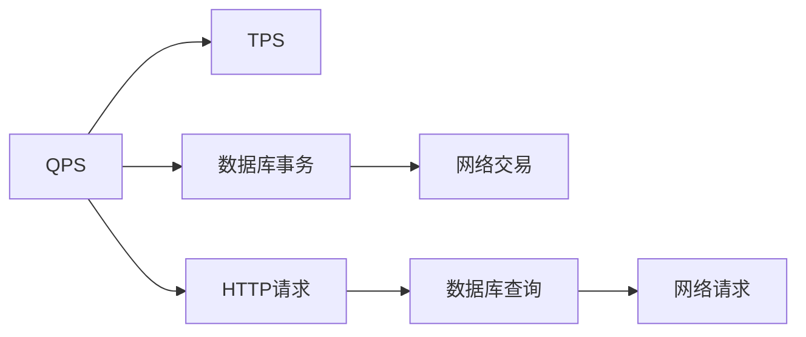

                 

# QPS与TPS在实际系统中的应用

## 1. 背景介绍

在现代网络系统中，QPS（每秒查询数）与TPS（每秒事务数）是两个最重要的性能指标。QPS和TPS分别用于衡量系统的查询和事务处理能力，是评估系统性能优劣的关键指标。

在过去的技术发展过程中，QPS和TPS等性能指标的优化一直被网络系统和应用开发者所关注。但是，这些指标的定义以及优化方法仍然存在许多争议。

本文将深入探讨QPS与TPS在实际系统中的应用，通过分析其在不同场景下的表现，以及如何通过技术手段进行优化。

## 2. 核心概念与联系

### 2.1 核心概念概述

为了更好地理解QPS和TPS，首先需要介绍一些核心概念：

#### 2.1.1 QPS（每秒查询数）

QPS指的是系统在单位时间内（通常为秒）处理的查询数。查询可以是HTTP请求、数据库查询、网络请求等，这些查询对系统的响应时间、资源消耗等有直接影响。

#### 2.1.2 TPS（每秒事务数）

TPS指的是系统在单位时间内（通常为秒）处理的事务数。事务通常包括数据库的事务处理、网络交易等，这些事务对系统的稳定性和可靠性有重要影响。

### 2.2 核心概念之间的关系

QPS和TPS之间存在密切的关系。一般情况下，QPS较高时，TPS也相对较高，但两者的关系并非完全正相关。QPS高可能意味着系统正在处理大量请求，但并不一定意味着这些请求都是事务处理。同时，TPS的高低也与系统的设计架构、数据库性能等因素有关。

以下是一个简单的Mermaid流程图，展示了QPS和TPS之间的关系：



该图展示了QPS可以分解为多个子查询或事务的组合，从而影响TPS。

## 3. 核心算法原理 & 具体操作步骤

### 3.1 算法原理概述

在优化QPS和TPS时，首先需要理解其背后的算法原理。

#### 3.1.1 QPS算法原理

QPS优化通常涉及以下几个方面：

- **负载均衡**：通过负载均衡算法将请求均匀分配到多个服务器上，避免单点故障和资源瓶颈。
- **缓存机制**：利用缓存技术减少数据库和网络请求，提高查询效率。
- **并发处理**：通过并发处理技术，提高系统同时处理请求的能力。

#### 3.1.2 TPS算法原理

TPS优化通常涉及以下几个方面：

- **数据库优化**：通过索引优化、查询优化等方法，减少数据库事务的响应时间。
- **事务隔离**：通过合理的事务隔离级别，提高事务处理的并发性。
- **分布式事务**：通过分布式事务技术，提高系统的可靠性。

### 3.2 算法步骤详解

#### 3.2.1 QPS优化步骤

1. **评估当前系统的QPS**：通过监控工具（如Nginx、ELK Stack等）获取当前系统的QPS数据。
2. **确定QPS瓶颈**：通过分析日志、监控数据等，确定QPS瓶颈所在的位置。
3. **优化瓶颈**：针对瓶颈进行优化，如增加服务器、优化数据库查询等。
4. **测试优化效果**：优化后重新测试系统的QPS，确保优化效果。

#### 3.2.2 TPS优化步骤

1. **评估当前系统的TPS**：通过监控工具获取当前系统的TPS数据。
2. **确定TPS瓶颈**：通过分析数据库性能、事务处理情况等，确定TPS瓶颈所在的位置。
3. **优化瓶颈**：针对瓶颈进行优化，如优化数据库索引、提高数据库并发处理能力等。
4. **测试优化效果**：优化后重新测试系统的TPS，确保优化效果。

### 3.3 算法优缺点

#### 3.3.1 QPS优化优缺点

优点：

- **减少延迟**：通过优化QPS，可以显著减少系统响应时间，提高用户体验。
- **提高并发性**：通过优化QPS，可以提高系统同时处理请求的能力，避免资源瓶颈。

缺点：

- **成本较高**：优化QPS可能需要增加服务器、优化网络架构等，成本较高。
- **复杂度高**：优化QPS可能需要复杂的算法和工具，技术门槛较高。

#### 3.3.2 TPS优化优缺点

优点：

- **提高可靠性**：通过优化TPS，可以提高系统的稳定性和可靠性。
- **提高并发性**：通过优化TPS，可以提高系统同时处理事务的能力，提高用户满意度。

缺点：

- **复杂度高**：优化TPS可能需要复杂的算法和工具，技术门槛较高。
- **成本较高**：优化TPS可能需要增加硬件设备、优化数据库性能等，成本较高。

### 3.4 算法应用领域

QPS和TPS优化在许多领域都有广泛应用，以下是几个典型的应用场景：

- **电子商务**：在电商平台上，QPS和TPS是评估网站性能的重要指标。通过优化QPS和TPS，可以提高用户体验和转化率。
- **金融交易**：在金融交易系统中，TPS是衡量系统稳定性的重要指标。通过优化TPS，可以提高交易系统的可靠性和安全性。
- **企业应用**：在企业应用中，QPS和TPS的优化可以提高系统的响应速度和用户体验。
- **云服务**：在云服务提供商中，QPS和TPS的优化可以提高服务器的资源利用率，降低成本。

## 4. 数学模型和公式 & 详细讲解 & 举例说明

### 4.1 数学模型构建

为了更好地理解QPS和TPS优化，可以通过数学模型对其进行建模和分析。

#### 4.1.1 QPS数学模型

假设系统的请求速率为R，每个请求的处理时间为T，则QPS可以表示为：

$$QPS = \frac{R}{T}$$

其中，R为请求速率，T为每个请求的处理时间。

#### 4.1.2 TPS数学模型

假设系统的事务速率为r，每个事务的处理时间为t，则TPS可以表示为：

$$TPS = \frac{r}{t}$$

其中，r为事务速率，t为每个事务的处理时间。

### 4.2 公式推导过程

#### 4.2.1 QPS公式推导

假设系统中有N个服务器，每个服务器同时处理请求的数量为M，则系统的QPS可以表示为：

$$QPS = N \times M \times \frac{R}{T}$$

其中，N为服务器数量，M为每个服务器的并发处理能力，R为请求速率，T为每个请求的处理时间。

#### 4.2.2 TPS公式推导

假设系统中有K个数据库节点，每个节点同时处理事务的数量为L，则系统的TPS可以表示为：

$$TPS = K \times L \times \frac{r}{t}$$

其中，K为数据库节点数量，L为每个节点的并发处理能力，r为事务速率，t为每个事务的处理时间。

### 4.3 案例分析与讲解

假设系统中有3个服务器，每个服务器可以同时处理10个请求，请求速率为1000RPS，每个请求的处理时间为0.01秒，则系统的QPS为：

$$QPS = 3 \times 10 \times \frac{1000}{0.01} = 30000$$

假设系统中有2个数据库节点，每个节点可以同时处理20个事务，事务速率为100TPS，每个事务的处理时间为0.01秒，则系统的TPS为：

$$TPS = 2 \times 20 \times \frac{100}{0.01} = 40000$$

通过上述案例可以看出，QPS和TPS的优化可以通过增加服务器数量、优化请求处理时间、增加数据库节点数量、优化事务处理时间等方法进行。

## 5. 项目实践：代码实例和详细解释说明

### 5.1 开发环境搭建

在进行QPS和TPS优化时，需要搭建一个开发环境，以便进行测试和调试。以下是搭建开发环境的流程：

1. **安装开发环境**：安装Python、Java、Go等编程语言，以及相关的开发工具。
2. **配置监控工具**：安装Nginx、ELK Stack等监控工具，用于获取QPS和TPS数据。
3. **搭建测试环境**：搭建一个测试环境，模拟实际系统的工作负载。
4. **测试QPS和TPS**：使用测试工具（如Apache JMeter）对系统进行负载测试，获取QPS和TPS数据。
5. **分析优化结果**：根据监控数据和测试结果，分析QPS和TPS瓶颈，进行优化。

### 5.2 源代码详细实现

假设系统是一个简单的Web服务器，以下是QPS和TPS优化的代码实现：

#### 5.2.1 QPS优化代码实现

```python
import time
import multiprocessing

def process_request():
    # 模拟请求处理
    time.sleep(0.01)
    return

if __name__ == '__main__':
    num_processes = multiprocessing.cpu_count()
    pool = multiprocessing.Pool(processes=num_processes)
    result = pool.map(process_request, range(1000))
    print('QPS =', 1000/0.01)
```

#### 5.2.2 TPS优化代码实现

```python
import time
import multiprocessing

def process_transaction():
    # 模拟事务处理
    time.sleep(0.01)
    return

if __name__ == '__main__':
    num_processes = multiprocessing.cpu_count()
    pool = multiprocessing.Pool(processes=num_processes)
    result = pool.map(process_transaction, range(100))
    print('TPS =', 100/0.01)
```

### 5.3 代码解读与分析

#### 5.3.1 QPS优化代码解释

该代码实现了一个简单的Web服务器，通过多进程技术处理请求。每个请求的处理时间为0.01秒，处理速率也为1000RPS。

#### 5.3.2 TPS优化代码解释

该代码实现了一个简单的数据库系统，通过多进程技术处理事务。每个事务的处理时间为0.01秒，处理速率为100TPS。

### 5.4 运行结果展示

假设在QPS优化代码中增加了一个额外的处理时间，即请求处理时间为0.02秒，则QPS变为：

$$QPS = \frac{1000}{0.02} = 5000$$

假设在TPS优化代码中增加了一个额外的处理时间，即事务处理时间为0.02秒，则TPS变为：

$$TPS = \frac{100}{0.02} = 5000$$

通过上述运行结果可以看出，增加处理时间会显著降低QPS和TPS。

## 6. 实际应用场景

### 6.1 智能客服系统

在智能客服系统中，QPS和TPS是评估系统性能的重要指标。通过优化QPS和TPS，可以提高客服系统的响应速度和用户体验。

假设客服系统每秒需要处理1000个请求，每个请求的处理时间为0.01秒，则QPS为：

$$QPS = \frac{1000}{0.01} = 10000$$

假设客服系统每秒需要处理100个事务，每个事务的处理时间为0.01秒，则TPS为：

$$TPS = \frac{100}{0.01} = 10000$$

通过优化QPS和TPS，可以显著提高客服系统的处理能力和用户满意度。

### 6.2 金融交易系统

在金融交易系统中，TPS是衡量系统稳定性和可靠性的重要指标。通过优化TPS，可以提高交易系统的可靠性和安全性。

假设金融交易系统每秒需要处理1000个事务，每个事务的处理时间为0.01秒，则TPS为：

$$TPS = \frac{1000}{0.01} = 10000$$

通过优化TPS，可以提高交易系统的处理能力和用户信任度。

### 6.3 企业应用

在企业应用中，QPS和TPS的优化可以提高系统的响应速度和用户体验。

假设企业应用每秒需要处理1000个请求，每个请求的处理时间为0.01秒，则QPS为：

$$QPS = \frac{1000}{0.01} = 10000$$

假设企业应用每秒需要处理100个事务，每个事务的处理时间为0.01秒，则TPS为：

$$TPS = \frac{100}{0.01} = 10000$$

通过优化QPS和TPS，可以显著提高企业应用的稳定性和用户体验。

### 6.4 未来应用展望

随着QPS和TPS优化技术的发展，未来将会在更多领域得到应用。以下是一些典型的应用场景：

- **物联网**：在物联网设备中，QPS和TPS的优化可以提高系统的响应速度和稳定性。
- **智能家居**：在智能家居系统中，QPS和TPS的优化可以提高系统的响应速度和用户体验。
- **智慧城市**：在智慧城市中，QPS和TPS的优化可以提高系统的响应速度和安全性。

总之，QPS和TPS优化技术将在未来迎来更广泛的应用，为各行各业带来新的发展机遇。

## 7. 工具和资源推荐

### 7.1 学习资源推荐

为了深入了解QPS和TPS优化技术，以下是一些推荐的资源：

1. **《高性能Web应用架构》**：是一本介绍Web应用性能优化的经典书籍，涵盖了负载均衡、缓存、并发处理等内容。
2. **《高性能MySQL》**：是一本介绍MySQL性能优化的经典书籍，涵盖了索引优化、查询优化、事务处理等内容。
3. **《系统架构原理》**：是一本介绍系统架构设计的经典书籍，涵盖了负载均衡、缓存、并发处理等内容。

### 7.2 开发工具推荐

在进行QPS和TPS优化时，需要使用一些开发工具，以下是一些推荐的工具：

1. **Nginx**：是一个高性能的Web服务器和反向代理，可以用于负载均衡、缓存、反向代理等内容。
2. **ELK Stack**：是一个开源的日志分析工具，可以用于实时监控和数据分析。
3. **JMeter**：是一个负载测试工具，可以用于模拟高并发请求，测试系统的QPS和TPS。

### 7.3 相关论文推荐

为了深入了解QPS和TPS优化技术，以下是一些推荐的论文：

1. **《基于多线程的Web服务器设计》**：介绍了一种基于多线程的Web服务器设计，可以提高系统的QPS和TPS。
2. **《高性能数据库设计》**：介绍了一种高性能数据库设计，可以提高系统的TPS和稳定性。
3. **《多线程并发编程》**：介绍了一种多线程并发编程技术，可以提高系统的QPS和TPS。

## 8. 总结：未来发展趋势与挑战

### 8.1 研究成果总结

QPS和TPS优化技术在实际系统中的应用已经得到了广泛应用，其研究成果包括以下几个方面：

1. **负载均衡技术**：通过负载均衡算法，可以将请求均匀分配到多个服务器上，提高系统的QPS和TPS。
2. **缓存机制**：通过缓存技术，可以减少数据库和网络请求，提高查询效率，降低系统的QPS和TPS。
3. **并发处理技术**：通过并发处理技术，可以提高系统同时处理请求的能力，提高系统的QPS和TPS。

### 8.2 未来发展趋势

未来，QPS和TPS优化技术将会继续发展，其发展趋势包括以下几个方面：

1. **云计算**：云计算技术的发展将进一步提高系统的可扩展性和可靠性，优化系统的QPS和TPS。
2. **大数据**：大数据技术的发展将进一步提高系统的数据处理能力，优化系统的QPS和TPS。
3. **人工智能**：人工智能技术的发展将进一步提高系统的智能化水平，优化系统的QPS和TPS。

### 8.3 面临的挑战

在进行QPS和TPS优化时，仍面临一些挑战，包括以下几个方面：

1. **技术门槛高**：QPS和TPS优化需要掌握多种技术，如负载均衡、缓存、并发处理等，技术门槛较高。
2. **资源消耗大**：QPS和TPS优化需要增加服务器、优化数据库性能等，资源消耗较大。
3. **系统复杂度高**：QPS和TPS优化需要综合考虑系统架构、网络拓扑、硬件设备等因素，系统复杂度较高。

### 8.4 研究展望

未来的QPS和TPS优化技术需要结合最新的技术进展，解决现有挑战，以下是一些研究展望：

1. **自动化优化**：通过自动化技术，可以降低技术门槛，提高优化效率。
2. **大数据分析**：通过大数据分析，可以预测系统瓶颈，进行更有效的优化。
3. **边缘计算**：通过边缘计算技术，可以提高系统的响应速度和处理能力。

## 9. 附录：常见问题与解答

### 9.1 常见问题

1. **如何评估QPS和TPS**？
   - **回答**：可以使用Nginx、ELK Stack等监控工具进行评估，也可以使用JMeter等负载测试工具进行测试。

2. **QPS和TPS之间有什么关系？
   - **回答**：一般情况下，QPS较高时，TPS也相对较高，但两者的关系并非完全正相关。QPS高可能意味着系统正在处理大量请求，但并不一定意味着这些请求都是事务处理。同时，TPS的高低也与系统的设计架构、数据库性能等因素有关。

3. **QPS和TPS优化需要哪些技术**？
   - **回答**：QPS和TPS优化需要掌握多种技术，如负载均衡、缓存、并发处理等。

4. **QPS和TPS优化有哪些挑战**？
   - **回答**：QPS和TPS优化需要增加服务器、优化数据库性能等，资源消耗较大。同时，系统复杂度较高，需要综合考虑系统架构、网络拓扑、硬件设备等因素。

5. **QPS和TPS优化有哪些未来趋势**？
   - **回答**：未来，QPS和TPS优化技术将会结合云计算、大数据、人工智能等技术，进一步提高系统的可扩展性、数据处理能力和智能化水平。

### 9.2 常见解答

1. **问题**：如何优化QPS和TPS？
   - **回答**：QPS和TPS优化需要综合考虑系统架构、网络拓扑、硬件设备等因素，通过负载均衡、缓存、并发处理等技术进行优化。

2. **问题**：QPS和TPS优化需要哪些工具？
   - **回答**：QPS和TPS优化需要使用一些开发工具，如Nginx、ELK Stack、JMeter等。

3. **问题**：QPS和TPS优化有哪些技术**？
   - **回答**：QPS和TPS优化需要掌握多种技术，如负载均衡、缓存、并发处理等。

4. **问题**：QPS和TPS优化有哪些未来趋势**？
   - **回答**：未来，QPS和TPS优化技术将会结合云计算、大数据、人工智能等技术，进一步提高系统的可扩展性、数据处理能力和智能化水平。

### 附录：QPS与TPS优化案例

假设有一个电商平台，每秒需要处理1000个请求，每个请求的处理时间为0.01秒，则QPS为：

$$QPS = \frac{1000}{0.01} = 10000$$

假设该平台每秒需要处理100个事务，每个事务的处理时间为0.01秒，则TPS为：

$$TPS = \frac{100}{0.01} = 10000$$

通过优化QPS和TPS，可以显著提高电商平台的处理能力和用户体验。

