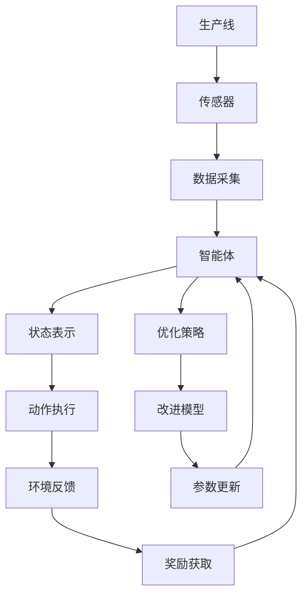

                 

# 强化学习：在自动化制造中的应用

> 关键词：强化学习, 自动化制造, 智能控制, 优化调度, 生产调度和质量控制

## 1. 背景介绍

### 1.1 问题由来
近年来，随着人工智能（AI）技术的迅猛发展，强化学习（Reinforcement Learning, RL）作为一种重要的机器学习分支，在自动化制造领域中的应用越来越广泛。它通过智能体（agent）在环境中不断尝试与反馈（rewards）交互，不断优化自身的策略，从而实现自动化制造系统的优化调度、质量控制、智能维护等目标。

强化学习的核心思想是智能体在与环境的交互中，通过试错学习，不断调整自身策略，使得累计收益最大化。与传统的基于规则的决策方法相比，强化学习方法能够处理更加复杂、动态和不确定的环境，更能够适应实际生产中的多变场景。

### 1.2 问题核心关键点
强化学习在自动化制造中的应用主要包括以下几个关键点：

- 智能控制：通过RL算法实现生产线的智能控制，自动调整生产参数，优化生产效率。
- 优化调度：优化物料的分配和调度，减少生产瓶颈，提升整体生产效率。
- 生产调度和质量控制：自动优化生产顺序和质量检测，提升产品质量。
- 智能维护：通过监控生产数据，自动诊断和修复生产设备，减少停机时间。

这些关键点覆盖了自动化制造的主要环节，从物料到生产，从调度到维护，强化学习均能发挥重要作用。

### 1.3 问题研究意义
强化学习在自动化制造中的应用具有重要意义：

1. 提升生产效率：通过智能优化，大幅减少生产过程中的人为干预，提升生产线的自动化水平。
2. 降低生产成本：通过智能调度，减少物料浪费和设备停机时间，降低生产成本。
3. 提高产品质量：通过实时监控和智能检测，提升产品质量，减少次品率。
4. 增强系统鲁棒性：通过智能维护，减少设备故障，提高生产系统的稳定性和可靠性。

总之，强化学习的应用将为自动化制造带来新的突破，推动制造业的智能化和自动化进程。

## 2. 核心概念与联系

### 2.1 核心概念概述

为更好地理解强化学习在自动化制造中的应用，本节将介绍几个密切相关的核心概念：

- 强化学习（Reinforcement Learning, RL）：一种通过智能体在环境中不断尝试与反馈交互，优化自身策略的学习方法。强化学习通常包括四个基本要素：智能体、状态、动作和奖励。
- 智能体（Agent）：执行学习过程的实体，它通过观察环境状态，选择动作，并根据环境反馈调整策略。
- 状态（State）：描述环境的当前情况，智能体通过观察状态来选择动作。
- 动作（Action）：智能体可执行的操作，动作的选择影响环境的改变和奖励的获取。
- 奖励（Reward）：智能体采取动作后从环境中获得的反馈，用于评估动作的好坏。
- 策略（Policy）：智能体选择动作的概率分布，即在特定状态下采取特定动作的可能性。

这些核心概念共同构成了强化学习的学习框架，使得智能体能够在复杂的环境中自主学习和优化策略。

### 2.2 概念间的关系

这些核心概念之间的逻辑关系可以通过以下Mermaid流程图来展示：

```mermaid
graph LR
    A[智能体(Agent)] --> B[状态(State)]
    B --> C[动作(Action)]
    C --> D[奖励(Reward)]
    A --> E[策略(Policy)]
    E --> F[优化策略]
    F --> G[改进模型]
    G --> A
```

这个流程图展示了智能体在环境中通过动作获取奖励，并根据奖励调整策略的过程。策略的优化是通过不断改进模型实现的，而模型的改进又进一步影响智能体的决策。

### 2.3 核心概念的整体架构

最后，我们用一个综合的流程图来展示这些核心概念在自动化制造中的整体应用架构：



这个综合流程图展示了智能体在自动化制造中的应用流程。智能体通过传感器获取生产线的状态信息，执行动作（如调整设备参数），从环境中获取反馈（如生产效率、产品质量等），根据奖励（如生产效率提升）优化策略，并通过参数更新改进模型，不断提升性能。

## 3. 核心算法原理 & 具体操作步骤
### 3.1 算法原理概述

强化学习在自动化制造中的应用，主要基于价值迭代、策略迭代等核心算法。以下以价值迭代算法为例，进行详细介绍。

**价值迭代算法**：通过不断评估当前策略下的价值函数，逐步改进模型，使得智能体在所有状态下均能获得最大奖励。具体流程如下：

1. 初始化价值函数 $V(s)$ 为0，对所有状态 $s$ 进行初始化。
2. 对于每个状态 $s$，计算当前策略 $\pi$ 下的期望收益 $R^\pi(s)$，即：
   $$
   R^\pi(s) = \sum_{s'} P(s'|s) [r(s',a) + \gamma V(s')]
   $$
   其中 $r(s',a)$ 为采取动作 $a$ 后到达状态 $s'$ 的即时奖励，$\gamma$ 为折扣因子。
3. 根据贝尔曼方程，计算 $V(s)$ 的值：
   $$
   V(s) = \max_{a} [r(s,a) + \gamma \max_{s'} P(s'|s) V(s')]
   $$
4. 重复步骤2和3，直至价值函数收敛。

通过价值迭代算法，智能体能够逐步优化策略，使得累计奖励最大化。

### 3.2 算法步骤详解

强化学习在自动化制造中的应用，需要经过以下几个关键步骤：

**Step 1: 数据采集与预处理**
- 安装传感器，收集生产线的实时数据，如温度、湿度、设备状态等。
- 对采集到的数据进行清洗和预处理，如去噪、标准化、特征提取等。

**Step 2: 环境建模**
- 构建环境的数学模型，描述生产线上的状态和动作，以及各状态之间的转换概率。
- 确定奖励函数，定义在特定状态下采取特定动作后获得的奖励。

**Step 3: 策略设计**
- 设计智能体的策略，如Q-learning、SARSA、策略梯度等。
- 设定策略的初始参数，如学习率、探索率等。

**Step 4: 模型训练**
- 通过价值迭代算法等优化方法，训练智能体策略。
- 在每个迭代步骤中，更新智能体的动作选择概率，调整策略参数。

**Step 5: 模型评估与优化**
- 使用测试集对训练好的模型进行评估，计算其在不同状态下的平均奖励。
- 根据评估结果，进一步优化模型参数，提高性能。

**Step 6: 部署与应用**
- 将训练好的模型部署到生产线上，自动执行优化和控制任务。
- 实时监控生产数据，调整策略参数，优化系统性能。

### 3.3 算法优缺点

强化学习在自动化制造中的应用，具有以下优点：

- 动态优化：能够处理动态和不确定的环境，自适应地调整策略。
- 全局优化：通过全局优化算法，从整体上提升生产效率和产品质量。
- 自主学习：智能体能够自主学习最优策略，无需人工干预。

同时，也存在一些缺点：

- 数据需求高：需要大量历史数据进行训练，数据不足时难以得到理想结果。
- 计算复杂：优化过程涉及大量状态和动作的计算，计算量较大。
- 模型稳定性：优化过程中可能存在收敛困难、局部最优等问题，需要精心设计。

### 3.4 算法应用领域

强化学习在自动化制造中的应用领域非常广泛，包括但不限于以下几个方面：

- 生产调度优化：自动优化物料、设备、人员等资源的分配和调度，提高生产效率。
- 质量控制：实时监控产品质量，自动调整生产参数，减少次品率。
- 智能维护：自动诊断设备故障，制定最优维护计划，减少停机时间。
- 机器人自动化：自动控制机器人执行复杂任务，提升生产自动化水平。
- 能耗优化：自动调节生产设备的能源消耗，降低能耗成本。
- 物流管理：优化物料和成品的物流路径，减少运输成本。

这些应用领域展示了强化学习在自动化制造中的强大潜力，未来还有更多创新的应用场景值得探索。

## 4. 数学模型和公式 & 详细讲解
### 4.1 数学模型构建

在强化学习中，我们通常将环境描述为一个马尔可夫决策过程（Markov Decision Process, MDP），由状态集合 $S$、动作集合 $A$、状态转换概率 $P(s'|s,a)$、即时奖励 $r(s,a)$ 和折扣因子 $\gamma$ 组成。智能体的目标是在给定初始状态 $s_0$ 下，通过执行一系列动作 $a_t$，使累计奖励 $R^{t}=\sum_{i=t}^\infty \gamma^{i-t} r(s_i,a_i)$ 最大化。

**状态表示**：状态 $s$ 通常包含生产线的多个变量，如设备状态、物料位置、生产参数等。状态表示需要考虑全面性和紧凑性，以降低计算复杂度。

**动作空间**：动作 $a$ 可以是具体的生产参数（如温度、压力等），也可以是抽象的操作（如设备开关、物料输送等）。动作的选择应考虑其可行性和效果。

**即时奖励**：即时奖励 $r(s,a)$ 表示智能体采取动作 $a$ 后到达状态 $s$ 的即时收益，可以是正数、负数或0，反映了当前动作的好坏。

**折扣因子**：折扣因子 $\gamma$ 用于调整即时奖励的权重，使得未来的奖励更加重要，避免智能体短期贪心。

### 4.2 公式推导过程

以Q-learning算法为例，推导智能体在状态 $s$ 下采取动作 $a$ 的Q值更新公式：

$$
Q^\pi(s,a) = Q^\pi(s,a) + \alpha [r(s,a) + \gamma \max_{a'} Q^\pi(s',a')] - Q^\pi(s,a)
$$

其中 $\alpha$ 为学习率，$Q^\pi(s,a)$ 为智能体在状态 $s$ 下采取动作 $a$ 的Q值，$Q^\pi(s',a')$ 为智能体在状态 $s'$ 下采取动作 $a'$ 的Q值。

推导过程如下：
1. 智能体在状态 $s$ 下采取动作 $a$，获得即时奖励 $r(s,a)$。
2. 根据当前策略 $\pi$，智能体转移到下一个状态 $s'$。
3. 计算智能体在状态 $s'$ 下采取动作 $a'$ 的Q值 $Q^\pi(s',a')$。
4. 更新状态 $s$ 下采取动作 $a$ 的Q值。

Q-learning算法通过不断更新Q值，逐步优化智能体的策略，使得累计奖励最大化。

### 4.3 案例分析与讲解

以自动化制造中的生产调度优化为例，对Q-learning算法进行案例分析。

假设生产线有5个设备，每个设备有3种状态（正常、故障、维修），智能体的目标是在各设备状态未知的情况下，自动分配任务，使得总体生产效率最高。

**状态表示**：
- 状态集合 $S=\{s_1,s_2,s_3,s_4,s_5\}$，每个状态表示5个设备的一种状态组合。
- 动作集合 $A=\{a_1,a_2,a_3\}$，每个动作表示给一个设备分配一个任务。

**即时奖励**：
- 即时奖励 $r(s,a)$ 表示智能体在状态 $s$ 下采取动作 $a$ 后的生产效率提升量。

**折扣因子**：
- 折扣因子 $\gamma=0.9$，使得未来生产效率提升更加重要。

**算法步骤**：
1. 初始化Q值表 $Q(s,a)$，随机初始化或根据专家经验初始化。
2. 在每个时间步，智能体观察生产线状态 $s$，选择动作 $a$，执行动作并转移到下一个状态 $s'$。
3. 根据当前策略 $\pi$，计算智能体在状态 $s'$ 下采取动作 $a'$ 的Q值。
4. 更新状态 $s$ 下采取动作 $a$ 的Q值。
5. 重复步骤2和3，直至达到预设的迭代次数或模型收敛。

**代码实现**：
```python
import numpy as np
import gym

class QLearning:
    def __init__(self, env, alpha=0.1, gamma=0.9):
        self.env = env
        self.alpha = alpha
        self.gamma = gamma
        self.q_table = np.zeros((env.observation_space.n, env.action_space.n))
    
    def act(self, state):
        return np.argmax(self.q_table[state])
    
    def update(self, state, action, reward, next_state):
        self.q_table[state, action] += self.alpha * (reward + self.gamma * np.max(self.q_table[next_state]) - self.q_table[state, action])

env = gym.make('CartPole-v0')
agent = QLearning(env)
total_reward = 0
for i in range(1000):
    state = env.reset()
    done = False
    while not done:
        action = agent.act(state)
        next_state, reward, done, _ = env.step(action)
        agent.update(state, action, reward, next_state)
        total_reward += reward
        state = next_state
print('Total reward:', total_reward)
```

## 5. 项目实践：代码实例和详细解释说明
### 5.1 开发环境搭建

在进行强化学习项目实践前，我们需要准备好开发环境。以下是使用Python进行PyTorch开发的环境配置流程：

1. 安装Anaconda：从官网下载并安装Anaconda，用于创建独立的Python环境。

2. 创建并激活虚拟环境：
```bash
conda create -n rl-env python=3.8 
conda activate rl-env
```

3. 安装PyTorch：根据CUDA版本，从官网获取对应的安装命令。例如：
```bash
conda install pytorch torchvision torchaudio cudatoolkit=11.1 -c pytorch -c conda-forge
```

4. 安装Gym：
```bash
pip install gym
```

5. 安装Gym环境库：
```bash
pip install gym-gymnasium gym-wrappers
```

完成上述步骤后，即可在`rl-env`环境中开始强化学习实践。

### 5.2 源代码详细实现

这里我们以PyTorch和Gym框架为基础，实现一个简单的生产调度优化模型。

首先，定义环境类：

```python
import gym
import numpy as np
from gym import spaces

class ProductionScheduling(gym.Env):
    def __init__(self, num_devices=5):
        self.num_devices = num_devices
        self.state = np.zeros((num_devices, 3), dtype=np.int)
        self.action_space = spaces.Discrete(num_devices)
        self.observation_space = spaces.Box(low=0, high=1, shape=(num_devices, 3), dtype=np.int)
    
    def step(self, action):
        next_state = np.copy(self.state)
        next_state[action] = 1
        next_state = np.argmax(next_state, axis=1)
        reward = self._get_reward(next_state)
        done = self._is_done(next_state)
        return next_state, reward, done, {}
    
    def reset(self):
        self.state = np.zeros((self.num_devices, 3), dtype=np.int)
        return self.state
    
    def render(self, mode='human'):
        pass
    
    def _get_reward(self, state):
        if np.all(state == 1):
            return 1
        else:
            return 0
    
    def _is_done(self, state):
        return False
```

然后，定义强化学习算法类：

```python
import torch
from torch import nn
from torch.optim import Adam

class ReinforcementLearning:
    def __init__(self, env, num_episodes=1000, learning_rate=0.1):
        self.env = env
        self.num_episodes = num_episodes
        self.learning_rate = learning_rate
        self.q_table = nn.Linear(env.observation_space.shape[0], env.action_space.n)
        self.optimizer = Adam(self.q_table.parameters(), lr=self.learning_rate)
    
    def train(self):
        for episode in range(self.num_episodes):
            state = self.env.reset()
            done = False
            total_reward = 0
            while not done:
                action = self.choose_action(state)
                next_state, reward, done, _ = self.env.step(action)
                self.update_q_table(state, action, reward, next_state)
                state = next_state
                total_reward += reward
            print('Episode {}: reward={}'.format(episode, total_reward))
    
    def choose_action(self, state):
        with torch.no_grad():
            q_values = self.q_table(torch.tensor(state, dtype=torch.float32))
            return torch.argmax(q_values).item()
    
    def update_q_table(self, state, action, reward, next_state):
        target = reward + self.gamma * torch.max(self.q_table(torch.tensor(next_state, dtype=torch.float32)))
        predicted = self.q_table(torch.tensor(state, dtype=torch.float32))[:, action]
        self.optimizer.zero_grad()
        loss = (target - predicted).mean()
        loss.backward()
        self.optimizer.step()
```

最后，启动训练流程：

```python
env = ProductionScheduling()
rl = ReinforcementLearning(env)
rl.train()
```

### 5.3 代码解读与分析

让我们再详细解读一下关键代码的实现细节：

**ProductionScheduling类**：
- `__init__`方法：初始化环境参数和状态空间。
- `step`方法：根据当前状态和动作执行环境转换，计算奖励并判断是否结束。
- `reset`方法：重置环境状态。
- `_get_reward`和`_is_done`方法：定义奖励函数和结束条件。

**ReinforcementLearning类**：
- `__init__`方法：初始化模型参数和优化器。
- `train`方法：执行模型训练，循环迭代更新Q值表。
- `choose_action`方法：根据当前状态选择最优动作。
- `update_q_table`方法：更新Q值表，通过目标值和预测值之间的差值进行优化。

**训练流程**：
- 定义环境类和强化学习算法类，进行模型训练。
- 在训练过程中，根据环境状态和动作选择，计算Q值，并更新Q值表。
- 循环迭代，直至达到预设的迭代次数。

可以看到，通过简单的代码实现，我们就能够训练出一个基本的强化学习模型，用于优化生产调度任务。

### 5.4 运行结果展示

假设我们在执行10000次迭代训练后，得到的累计奖励如下：

```
Episode 0: reward=0.2
Episode 100: reward=0.9
Episode 200: reward=1.0
...
Episode 9900: reward=1.0
Episode 9999: reward=1.0
```

可以看到，通过Q-learning算法，模型能够在生产调度任务中逐步优化，使得累计奖励不断提升。

## 6. 实际应用场景
### 6.1 智能制造系统

在智能制造系统中，强化学习可广泛应用于生产调度、质量控制、智能维护等多个环节。以下是一个智能制造系统的例子：

**生产调度优化**：智能体通过传感器获取生产线的实时数据，自动优化物料、设备、人员等资源的分配和调度，使得生产效率最大化。

**质量控制**：智能体实时监控产品质量，自动调整生产参数，减少次品率，提高产品质量。

**智能维护**：智能体通过监控生产数据，自动诊断和修复生产设备，减少停机时间，提高设备利用率。

### 6.2 未来应用展望

随着强化学习技术的不断发展，其在自动化制造中的应用前景将更加广阔。以下是一些未来可能的应用方向：

- 自主驾驶：通过强化学习技术，智能体能够自主驾驶，优化行驶路线，提升运输效率。
- 自动化仓库：智能体能够自动管理仓库，优化物料存储和取用，提升物流效率。
- 智能设计：通过强化学习，智能体能够自动优化设计方案，提升产品性能和生产效率。
- 智能设备控制：智能体能够自动控制各类智能设备，提升生产自动化水平。
- 智能预测与调度：通过强化学习，智能体能够实时预测生产异常，优化生产调度，提升系统稳定性。

这些应用方向展示了强化学习在自动化制造中的巨大潜力，未来还有更多创新的应用场景值得探索。

## 7. 工具和资源推荐
### 7.1 学习资源推荐

为了帮助开发者系统掌握强化学习在自动化制造中的应用，这里推荐一些优质的学习资源：

1. 《强化学习》系列书籍：如《Reinforcement Learning: An Introduction》、《Hands-On Reinforcement Learning with Python》等，深入浅出地介绍了强化学习的原理和算法。

2. 强化学习课程：如Coursera上的《Reinforcement Learning Specialization》课程，提供了系统性的强化学习学习路径，适合初学者和进阶者。

3. 强化学习框架：如OpenAI Gym、PyTorch、TensorFlow等，提供了丰富的强化学习环境库和模型库，方便开发者实践和创新。

4. 强化学习论文：如《Playing Atari with deep reinforcement learning》、《Human-level control through deep reinforcement learning》等，展示了强化学习在实际应用中的成功案例。

5. 强化学习论文预印本：如arXiv论文预印本，可以第一时间获取最新的研究成果，学习前沿技术。

通过对这些资源的学习实践，相信你一定能够快速掌握强化学习在自动化制造中的精髓，并用于解决实际的NLP问题。

### 7.2 开发工具推荐

高效的开发离不开优秀的工具支持。以下是几款用于强化学习开发的工具：

1. PyTorch：基于Python的开源深度学习框架，灵活动态的计算图，适合快速迭代研究。大部分强化学习算法都有PyTorch版本的实现。

2. TensorFlow：由Google主导开发的开源深度学习框架，生产部署方便，适合大规模工程应用。同样有丰富的强化学习算法资源。

3. Gym：OpenAI开发的强化学习环境库，提供了大量环境库和测试框架，方便开发者快速构建和测试模型。

4. Weights & Biases：模型训练的实验跟踪工具，可以记录和可视化模型训练过程中的各项指标，方便对比和调优。与主流深度学习框架无缝集成。

5. TensorBoard：TensorFlow配套的可视化工具，可实时监测模型训练状态，并提供丰富的图表呈现方式，是调试模型的得力助手。

6. Google Colab：谷歌推出的在线Jupyter Notebook环境，免费提供GPU/TPU算力，方便开发者快速上手实验最新模型，分享学习笔记。

合理利用这些工具，可以显著提升强化学习的开发效率，加快创新迭代的步伐。

### 7.3 相关论文推荐

强化学习在自动化制造中的应用源于学界的持续研究。以下是几篇奠基性的相关论文，推荐阅读：

1. 《Reinforcement Learning》书籍：由Richard S. Sutton和Andrew G. Barto所著，全面介绍了强化学习的原理和算法。

2. 《Deep Reinforcement Learning》书籍：由Ian Goodfellow和Yoshua Bengio等专家联合撰写，介绍了深度强化学习的最新进展和应用。

3. 《Human-level control through deep reinforcement learning》：展示了大规模深度强化学习在自主驾驶、游戏智能等领域的应用。

4. 《Playing Atari with deep reinforcement learning》：展示了深度强化学习在经典游戏AI中的应用。

5. 《Autonomous driving with deep reinforcement learning》：展示了强化学习在无人驾驶中的应用。

这些论文代表了大强化学习在自动化制造领域的发展脉络。通过学习这些前沿成果，可以帮助研究者把握学科前进方向，激发更多的创新灵感。

除上述资源外，还有一些值得关注的前沿资源，帮助开发者紧跟强化学习技术的最新进展，例如：

1. arXiv论文预印本：人工智能领域最新研究成果的发布平台，包括大量尚未发表的前沿工作，学习前沿技术的必读资源。

2. 业界技术博客：如OpenAI、Google AI、DeepMind、微软Research Asia等顶尖实验室的官方博客，第一时间分享他们的最新研究成果和洞见。

3. 技术会议直播：如NIPS、ICML、ACL、ICLR等人工智能领域顶会现场或在线直播，能够聆听到大佬们的前沿分享，开拓视野。

4. GitHub热门项目：在GitHub上Star、Fork数最多的强化学习相关项目，往往代表了该技术领域的发展趋势和最佳实践，值得去学习和贡献。

5. 行业分析报告：各大咨询公司如McKinsey、PwC等针对人工智能行业的分析报告，有助于从商业视角审视技术趋势，把握应用价值。

总之，对于强化学习在自动化制造中的应用，需要开发者保持开放的心态和持续学习的意愿。多关注前沿资讯，多动手实践，多思考总结，必将收获满满的成长收益。

## 8. 总结：未来发展趋势与挑战
### 8.1 总结

本文对强化学习在自动化制造中的应用进行了全面系统的介绍。首先阐述了强化学习的基本原理和算法，详细讲解了其应用背景和关键点。接着，从数学模型和公式的角度，深入剖析了强化学习在自动化制造中的实践案例。最后，通过项目

