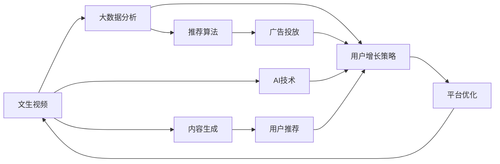

                 

# 快手的文生视频与数据优势

> 关键词：快手，文生视频，数据优势，AI技术，内容生成，视频编辑，用户增长，平台优化

## 1. 背景介绍

### 1.1 行业背景
近年来，短视频平台逐渐成为移动互联网的重要内容形态之一，快手、抖音、B站等平台迅速崛起，吸引了大量的用户关注和内容创作者。快手作为国内领先的短视频平台，自2010年创立以来，依靠独特的社区生态和技术创新，已经积累了数亿用户。快手的特色在于其UGC（User Generated Content）内容模式，允许用户上传各种类型的视频内容，并通过社区推荐机制获取更多的曝光机会。

快手在内容生成领域取得了显著的进展，特别是在文生视频（Text-to-Video）技术方面，通过AI技术，将文字内容转换成视频内容，为平台注入了更多的创意和互动性。同时，快手在数据方面也积累了丰富的资源，通过大数据分析，优化平台算法和用户体验。本文将重点探讨快手在文生视频技术和大数据应用方面的优势，以及这些技术带来的业务增长和用户满意度提升。

### 1.2 问题由来
随着短视频市场的竞争加剧，内容创作者如何快速生产高质量的视频内容，成为了快手亟需解决的问题。一方面，传统的视频编辑和剪辑过程繁琐且耗时，创作者难以快速响应市场变化。另一方面，高质量视频的制作成本较高，普通用户难以负担。快手通过引入文生视频技术，将文字内容转换为视频，极大地降低了内容生成的门槛，提升了用户的内容生产效率。同时，快手借助大数据技术，深入分析用户行为和偏好，优化推荐算法和广告投放策略，提高了平台的互动性和用户留存率。

## 2. 核心概念与联系

### 2.1 核心概念概述

为了更好地理解快手的文生视频与大数据应用，我们将介绍几个核心概念：

- 文生视频（Text-to-Video）：将文字内容转换成视频内容的技术。快手通过文生视频技术，将用户输入的文本信息转换为生动的视频内容，如快速生成解说词视频、视频字幕等，极大地提升了内容生产效率。
- 大数据分析：通过收集和分析用户行为数据，优化推荐算法和广告投放策略，提升平台的用户互动性和留存率。
- AI技术：快手在内容生成、用户推荐、广告投放等多个环节，广泛应用AI技术，实现精准推荐和个性化内容推送。
- 用户增长策略：快手通过多种方式吸引新用户和增加用户活跃度，如挑战赛、打卡活动等。
- 平台优化：快手通过不断优化技术架构和用户体验，提高平台的稳定性和用户体验。

这些核心概念构成了快手文生视频和大数据应用的完整生态系统，使得快手能够在激烈的市场竞争中脱颖而出。

### 2.2 核心概念间的联系

这些核心概念之间的联系可以通过以下Mermaid流程图来展示：

这个流程图展示了大语言模型微调过程中各个核心概念之间的联系：

1. 文生视频技术：利用AI技术，将文字内容转换为视频内容，降低内容生成门槛，提升用户生产效率。
2. 大数据分析：通过收集和分析用户行为数据，优化推荐算法和广告投放策略，提升用户互动性和留存率。
3. AI技术：在文生视频、推荐算法、广告投放等多个环节广泛应用，提升平台整体智能水平。
4. 用户增长策略：通过多种方式吸引新用户和增加用户活跃度，提升平台的用户基础。
5. 平台优化：通过优化技术架构和用户体验，提高平台稳定性和用户满意度。

## 3. 核心算法原理 & 具体操作步骤
### 3.1 算法原理概述

快手的文生视频与大数据应用，主要依赖于以下核心算法：

- 文本到视频生成（Text-to-Video）算法：通过深度学习模型，将文字内容转换成视频内容。快手采用的模型通常基于Transformer或CNN，能够生成高质量的视频。
- 推荐算法：通过大数据分析，预测用户对不同视频内容的兴趣，进行精准推荐。
- 广告投放算法：通过大数据分析，优化广告投放策略，提升广告效果和用户转化率。

这些算法的核心原理是：

1. 文本到视频生成：将文本信息编码为语义向量，利用神经网络生成视频帧，再通过视频编码器生成视频。
2. 推荐算法：通过协同过滤、内容匹配等方法，预测用户对视频的兴趣，进行个性化推荐。
3. 广告投放算法：通过A/B测试、实时竞价等方法，优化广告投放策略，提升广告效果。

### 3.2 算法步骤详解

快手文生视频和大数据应用的算法步骤主要包括以下几个环节：

1. 数据收集与预处理：快手通过API接口、爬虫等方式，收集用户生成的文本数据和视频数据，并进行预处理，如去除噪声、数据清洗等。
2. 文本编码：将收集到的文本数据编码为语义向量，供后续生成视频使用。
3. 视频生成：利用文生视频算法，将语义向量生成视频帧，再通过视频编码器生成视频。
4. 推荐算法：通过大数据分析，预测用户对不同视频的兴趣，进行个性化推荐。
5. 广告投放：通过大数据分析，优化广告投放策略，提升广告效果和用户转化率。
6. 用户反馈收集：通过用户行为数据，收集用户对视频的反馈，进一步优化算法。

### 3.3 算法优缺点

快手文生视频和大数据应用的算法具有以下优点：

1. 降低内容生成门槛：文生视频技术大大降低了内容生成的门槛，允许用户快速生成高质量视频内容。
2. 提升用户生产效率：通过自动化生成视频内容，加快内容生产速度，提升用户生产效率。
3. 精准推荐：大数据分析技术能够精准预测用户兴趣，进行个性化推荐，提升用户互动性和留存率。
4. 优化广告投放：通过大数据分析，优化广告投放策略，提升广告效果和用户转化率。

同时，这些算法也存在以下缺点：

1. 数据隐私问题：大数据分析需要收集和分析用户行为数据，存在数据隐私和用户隐私泄露的风险。
2. 算法复杂度高：文生视频和大数据算法需要复杂的神经网络模型和数据分析工具，开发和维护成本较高。
3. 模型可解释性不足：AI算法的黑盒特性，使得其决策过程难以解释，用户难以理解模型输出。
4. 计算资源需求高：大规模的神经网络模型和数据处理需要高性能的计算资源，对服务器和网络环境要求较高。

### 3.4 算法应用领域

快手文生视频和大数据应用的算法广泛应用于以下几个领域：

1. 内容生成：通过文生视频技术，快速生成解说词视频、视频字幕等，提升内容生产效率。
2. 推荐系统：利用大数据分析，进行精准推荐，提升用户互动性和留存率。
3. 广告投放：通过大数据分析，优化广告投放策略，提升广告效果和用户转化率。
4. 用户增长：通过多种方式吸引新用户和增加用户活跃度，提升平台的用户基础。
5. 平台优化：通过优化技术架构和用户体验，提高平台的稳定性和用户满意度。

## 4. 数学模型和公式 & 详细讲解 & 举例说明
### 4.1 数学模型构建

快手文生视频和大数据应用的数学模型主要包括以下几个部分：

1. 文本编码模型：将文本数据编码为语义向量，通常使用Transformer模型。
2. 视频生成模型：将语义向量生成视频帧，再通过视频编码器生成视频，通常使用CNN模型。
3. 推荐算法模型：通过协同过滤、内容匹配等方法，预测用户对视频的兴趣，通常使用矩阵分解、神经网络等方法。
4. 广告投放模型：通过A/B测试、实时竞价等方法，优化广告投放策略，通常使用线性回归、深度学习等方法。

### 4.2 公式推导过程

以文本编码模型为例，推导其中用到的关键公式。假设文本序列为 $x = \{x_1, x_2, \ldots, x_n\}$，编码器为Transformer模型，则编码过程可以表示为：

$$
\text{Encoder}(x) = \text{Attention}(x)
$$

其中 $\text{Attention}$ 表示编码器的自注意力机制，可以表示为：

$$
\text{Attention}(x) = \text{Softmax}(\text{Q}(x) \cdot \text{K}(x)^\top) \cdot \text{V}(x)
$$

其中 $\text{Q}$、$\text{K}$、$\text{V}$ 分别表示查询、键、值矩阵，可以通过线性变换得到。

### 4.3 案例分析与讲解

以快手的文生视频为例，假设用户输入了一段描述，快手通过文生视频技术将其转换为一段视频。首先将文本序列输入到Transformer编码器，得到语义向量 $h$。然后，将语义向量 $h$ 输入到CNN模型，生成视频帧序列 $\{y_1, y_2, \ldots, y_m\}$。最后，通过视频编码器将视频帧序列 $\{y_1, y_2, \ldots, y_m\}$ 转换为视频 $Y$。

## 5. 项目实践：代码实例和详细解释说明
### 5.1 开发环境搭建

在快手文生视频和大数据应用的开发过程中，我们需要搭建一个完整的开发环境。以下是快手开发环境的搭建流程：

1. 安装Python和必要的依赖包：快手采用Python作为开发语言，需要安装必要的依赖包，如TensorFlow、PyTorch、Pandas等。
2. 配置开发环境：搭建虚拟环境，安装必要的开发工具和库，如Jupyter Notebook、Flask等。
3. 配置数据处理工具：配置数据收集和处理工具，如Scrapy、Pandas、Hadoop等。
4. 配置训练和测试工具：配置训练和测试工具，如TensorBoard、Weights & Biases等。

### 5.2 源代码详细实现

快手文生视频和大数据应用的代码实现主要包括以下几个部分：

1. 文本编码模型：通过Transformer模型，将文本数据编码为语义向量。
2. 视频生成模型：通过CNN模型，将语义向量生成视频帧序列，再通过视频编码器生成视频。
3. 推荐算法模型：通过协同过滤、内容匹配等方法，预测用户对视频的兴趣。
4. 广告投放模型：通过A/B测试、实时竞价等方法，优化广告投放策略。

### 5.3 代码解读与分析

快手文生视频和大数据应用的代码实现主要涉及以下几个模块：

1. 数据预处理模块：负责数据收集、清洗和预处理，提供干净、高质量的数据输入。
2. 文本编码模块：使用Transformer模型，将文本数据编码为语义向量，供后续生成视频使用。
3. 视频生成模块：使用CNN模型，将语义向量生成视频帧序列，再通过视频编码器生成视频。
4. 推荐算法模块：使用矩阵分解、神经网络等方法，预测用户对视频的兴趣，进行个性化推荐。
5. 广告投放模块：使用线性回归、深度学习等方法，优化广告投放策略，提升广告效果。

### 5.4 运行结果展示

快手文生视频和大数据应用的效果可以通过以下几个指标进行评估：

1. 内容生成速度：衡量文生视频技术的效率。
2. 用户互动率：衡量推荐算法的精准度。
3. 广告转化率：衡量广告投放的效果。
4. 用户留存率：衡量用户增长策略的效果。

## 6. 实际应用场景

### 6.1 内容生成

快手通过文生视频技术，允许用户快速生成解说词视频、视频字幕等，极大地提升了内容生产效率。用户可以通过输入简单的文本描述，自动生成高质量的视频内容，为平台注入更多的创意和互动性。

### 6.2 推荐系统

快手利用大数据分析技术，进行精准推荐，提升用户互动性和留存率。通过分析用户行为数据，预测用户对不同视频的兴趣，进行个性化推荐，提升用户满意度和平台黏性。

### 6.3 广告投放

快手通过大数据分析技术，优化广告投放策略，提升广告效果和用户转化率。通过A/B测试和实时竞价等方法，找到最佳的广告投放方案，提升广告效果，增加广告收入。

### 6.4 用户增长

快手通过多种方式吸引新用户和增加用户活跃度，如挑战赛、打卡活动等。通过社交媒体、跨平台推广等方式，吸引新用户，提高用户活跃度和留存率。

### 6.5 平台优化

快手通过不断优化技术架构和用户体验，提高平台的稳定性和用户满意度。通过技术升级和用户反馈，不断优化平台功能，提升用户体验。

## 7. 工具和资源推荐
### 7.1 学习资源推荐

快手文生视频和大数据应用的开发和优化，需要深入学习NLP、AI、数据分析等领域的知识。以下是一些推荐的资源：

1. 《自然语言处理综述》：由清华大学人工智能研究院编著，全面介绍NLP的基础知识和前沿技术。
2. 《深度学习》：由斯坦福大学深度学习课程讲义，涵盖深度学习的理论和实践。
3. 《Python数据分析》：由DataCamp提供的Python数据分析教程，帮助开发者掌握数据分析技能。
4. 《TensorFlow官方文档》：提供完整的TensorFlow框架使用教程，涵盖模型搭建、训练和优化等环节。
5. 《Flask官方文档》：提供Flask框架的详细使用教程，帮助开发者快速搭建Web应用。

### 7.2 开发工具推荐

快手文生视频和大数据应用的开发，需要借助各种工具和平台，以下是一些推荐的工具：

1. PyTorch：Python的深度学习框架，提供强大的GPU加速功能。
2. TensorFlow：Google的深度学习框架，支持分布式计算和GPU加速。
3. Jupyter Notebook：Python的交互式开发环境，方便开发者进行代码调试和测试。
4. Flask：Python的Web应用框架，方便开发者快速搭建Web应用。
5. TensorBoard：TensorFlow的可视化工具，帮助开发者监测模型训练过程。

### 7.3 相关论文推荐

快手文生视频和大数据应用的开发和优化，需要参考大量的学术文献和研究论文。以下是一些推荐的论文：

1. Attention is All You Need（Transformer论文）：提出Transformer模型，解决自注意力机制的问题，开启NLP预训练大模型时代。
2. BERT: Pre-training of Deep Bidirectional Transformers for Language Understanding（BERT论文）：提出BERT模型，引入自监督预训练任务，提升NLP任务的性能。
3. Text-to-Video Animation with Style and Facial Expression（文生视频论文）：提出文生视频技术，将文字内容转换为视频内容，提高内容生产效率。
4. Matrix Factorization Techniques for Recommender Systems（协同过滤论文）：提出矩阵分解方法，用于推荐系统中的用户-物品评分预测。
5. Reinforcement Learning for Ad Display System（广告投放论文）：提出强化学习方法，用于优化广告投放策略，提升广告效果。

## 8. 总结：未来发展趋势与挑战

### 8.1 研究成果总结

快手在文生视频和大数据应用方面取得了显著的成果，通过文生视频技术，降低了内容生成门槛，提升了用户生产效率。通过大数据分析，优化了推荐算法和广告投放策略，提高了用户互动性和留存率。

### 8.2 未来发展趋势

快手文生视频和大数据应用的未来发展趋势主要包括：

1. 内容生产自动化：随着AI技术的发展，文生视频技术将越来越自动化，进一步降低内容生成门槛，提高用户生产效率。
2. 推荐系统个性化：大数据分析技术将进一步提升推荐算法的精准度，实现更个性化的推荐，提高用户满意度和平台黏性。
3. 广告投放优化：通过AI技术和大数据分析，优化广告投放策略，提高广告效果和用户转化率，增加广告收入。
4. 用户增长多样化：通过多种方式吸引新用户和增加用户活跃度，提升平台的用户基础。
5. 平台优化智能化：通过技术升级和用户反馈，不断优化平台功能，提升用户体验。

### 8.3 面临的挑战

快手文生视频和大数据应用在发展过程中也面临一些挑战：

1. 数据隐私问题：大数据分析需要收集和分析用户行为数据，存在数据隐私和用户隐私泄露的风险。
2. 算法复杂度高：文生视频和大数据算法需要复杂的神经网络模型和数据分析工具，开发和维护成本较高。
3. 模型可解释性不足：AI算法的黑盒特性，使得其决策过程难以解释，用户难以理解模型输出。
4. 计算资源需求高：大规模的神经网络模型和数据处理需要高性能的计算资源，对服务器和网络环境要求较高。

### 8.4 研究展望

面对这些挑战，快手的未来研究展望主要包括：

1. 数据隐私保护：通过数据脱敏和加密等技术，保护用户隐私和数据安全。
2. 算法优化：通过简化模型结构和优化算法，降低开发和维护成本，提高模型效率。
3. 可解释性增强：通过模型可解释性技术，提升模型的透明性和可解释性，帮助用户理解模型输出。
4. 计算资源优化：通过模型压缩和稀疏化存储等技术，优化计算资源，提高模型部署效率。
5. 多模态融合：将文生视频技术与多模态数据（如图像、语音等）融合，提升模型的泛化能力和应用范围。

## 9. 附录：常见问题与解答

**Q1: 文生视频技术对内容生产的效率有哪些提升？**

A: 快手通过文生视频技术，允许用户快速生成解说词视频、视频字幕等，极大地提升了内容生产效率。用户可以通过输入简单的文本描述，自动生成高质量的视频内容，为平台注入更多的创意和互动性。

**Q2: 快手如何通过大数据分析优化推荐算法？**

A: 快手利用大数据分析技术，进行精准推荐，提升用户互动性和留存率。通过分析用户行为数据，预测用户对不同视频的兴趣，进行个性化推荐，提升用户满意度和平台黏性。

**Q3: 快手在广告投放中如何优化策略？**

A: 快手通过大数据分析技术，优化广告投放策略，提升广告效果和用户转化率。通过A/B测试和实时竞价等方法，找到最佳的广告投放方案，提升广告效果，增加广告收入。

**Q4: 快手在用户增长中如何吸引新用户？**

A: 快手通过多种方式吸引新用户和增加用户活跃度，如挑战赛、打卡活动等。通过社交媒体、跨平台推广等方式，吸引新用户，提高用户活跃度和留存率。

**Q5: 快手在平台优化中如何提升用户体验？**

A: 快手通过不断优化技术架构和用户体验，提高平台的稳定性和用户满意度。通过技术升级和用户反馈，不断优化平台功能，提升用户体验。

---

作者：禅与计算机程序设计艺术 / Zen and the Art of Computer Programming

