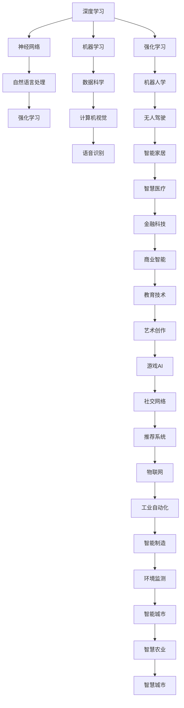

                 

# 思想的深度：从概念到洞见

在数字时代的洪流中，人工智能（AI）正以惊人的速度推进，引领着科技和社会的变革。AI不仅仅是技术，更是一种思维方式，一种探索世界的新视角。本文将从概念入手，深入探讨AI的原理和应用，揭示其深层次的洞见，旨在为读者提供一个全面、深刻的AI认知框架。

## 1. 背景介绍

### 1.1 问题由来

AI的发展历程可以追溯到上世纪的数学和统计学研究，尤其是图灵测试和通用计算机理论的提出。随着计算能力的提升和数据量的激增，AI进入了一个全新的阶段。深度学习、神经网络、自然语言处理等技术的突破，使得AI在各行各业中展现出巨大潜力。

然而，随着AI技术的广泛应用，也出现了一些问题。比如，如何保证AI系统的公平性、透明性和安全性，如何在不侵犯隐私的前提下实现数据共享，如何在伦理和法律框架下处理AI的应用等。这些问题不仅仅是技术挑战，更是社会责任和伦理道德的考量。

### 1.2 问题核心关键点

为了深入理解AI的核心理念和应用，我们需要关注以下几个关键点：

- **算法透明性**：AI模型的决策过程应具有可解释性，避免“黑箱”现象。
- **数据公平性**：AI系统应确保对不同群体的公平对待，避免偏见。
- **伦理合规性**：AI的应用应在法律和伦理框架下进行，保障数据隐私和安全。
- **人机协同**：AI系统应与人类协同工作，发挥各自优势。
- **可持续发展**：AI技术应用应注重环保和社会责任，实现可持续发展。

这些关键点构成了AI的核心价值，也是本文探讨的重点。

### 1.3 问题研究意义

深入研究AI的原理和应用，对于推动技术进步、促进社会公平、保障数据安全、实现可持续发展具有重要意义。AI不仅可以提升生产力和效率，还能解决复杂的社会问题，改善人类生活。然而，AI的发展也带来了新的挑战和问题，需要我们持续关注和应对。

## 2. 核心概念与联系

### 2.1 核心概念概述

为了更好地理解AI，我们需要掌握一些核心概念：

- **深度学习（Deep Learning）**：一种模拟人脑神经网络的学习算法，通过多层次的非线性变换提取数据特征。
- **神经网络（Neural Networks）**：由大量神经元组成的计算模型，能够处理复杂的多维数据。
- **自然语言处理（NLP）**：使计算机能够理解、处理和生成自然语言的技术。
- **强化学习（Reinforcement Learning）**：通过与环境的交互，使AI系统能够自主学习和优化。
- **机器学习（Machine Learning）**：利用数据和算法，使计算机能够从经验中学习和改进。

这些概念构成了AI技术的基础，互相之间存在着紧密的联系。深度学习、神经网络和强化学习都是机器学习的重要分支，而自然语言处理则是机器学习在语言领域的具体应用。

### 2.2 概念间的关系

AI的核心概念之间存在着复杂的相互作用和相互依存关系。深度学习通过多层非线性变换，能够提取更抽象、更高级的特征，从而提升模型的表现力。神经网络则是实现深度学习的关键工具，通过大量的参数调整和优化，能够逼近复杂的函数映射。自然语言处理将深度学习应用于语言领域，使得计算机能够理解和处理自然语言。强化学习通过与环境的交互，使AI系统能够在实际应用中不断学习和优化。机器学习则是这些技术的基础，提供数据和算法支持，实现模型的训练和优化。

这些概念共同构成了AI技术的生态系统，相互促进，共同推动AI技术的进步和发展。

### 2.3 核心概念的整体架构

AI技术的发展是一个复杂的过程，涉及多个学科和领域的交叉融合。以下是AI技术的整体架构，展示了各概念之间的联系和作用：



这个架构展示了AI技术在各个领域的广泛应用，以及各技术间的相互支持和协作。深度学习、神经网络、自然语言处理、强化学习、机器学习等核心概念，构成了AI技术的基石，推动其在各个领域的发展和创新。

## 3. 核心算法原理 & 具体操作步骤

### 3.1 算法原理概述

AI的核心算法包括深度学习、神经网络、自然语言处理、强化学习等。这些算法通过不同的模型和架构，实现对数据的处理和优化。以下是这些算法的基本原理概述：

- **深度学习**：通过多层神经网络，实现对复杂数据的多层次特征提取和表示。
- **神经网络**：由大量神经元组成的计算模型，通过反向传播算法进行参数优化，实现对数据的非线性映射。
- **自然语言处理**：将自然语言转化为计算机能够理解的形式，实现文本分类、情感分析、机器翻译等任务。
- **强化学习**：通过与环境的交互，不断调整策略参数，实现对复杂系统的优化和控制。

### 3.2 算法步骤详解

AI算法的实现通常包括以下步骤：

1. **数据准备**：收集和处理数据，确保数据质量和多样性。
2. **模型构建**：选择适当的模型和算法，搭建计算框架。
3. **模型训练**：使用训练数据对模型进行参数优化，提高模型表现。
4. **模型评估**：使用测试数据对模型进行性能评估，确保模型效果。
5. **模型部署**：将模型部署到实际应用中，实现AI技术落地。

### 3.3 算法优缺点

AI算法具有以下优点：

- **自动化**：能够自动化处理大量数据，提高工作效率。
- **泛化能力**：通过大规模数据训练，实现对未知数据的泛化。
- **灵活性**：能够适应不同的应用场景和需求。

同时，AI算法也存在一些缺点：

- **黑箱效应**：模型的决策过程难以解释，缺乏透明性。
- **数据依赖**：模型的表现高度依赖于数据质量，数据偏差可能影响模型效果。
- **计算资源需求高**：大规模数据和复杂模型的训练需要大量的计算资源。

### 3.4 算法应用领域

AI技术已经广泛应用于多个领域，以下是一些典型的应用场景：

- **医疗**：利用AI进行疾病诊断、药物研发、患者护理等。
- **金融**：利用AI进行风险评估、投资分析、客户服务等。
- **教育**：利用AI进行个性化学习、智能辅导、教育评估等。
- **交通**：利用AI进行智能交通管理、自动驾驶、智慧物流等。
- **制造**：利用AI进行质量检测、生产优化、供应链管理等。

这些应用场景展示了AI技术的广泛潜力和实际价值，为各行各业带来了新的机遇和挑战。

## 4. 数学模型和公式 & 详细讲解 & 举例说明

### 4.1 数学模型构建

AI算法的数学模型通常包括损失函数、优化目标、正则化等。以下以深度学习为例，介绍常见的数学模型构建方法：

- **损失函数**：用于衡量模型预测与真实标签之间的差异，常用的损失函数包括交叉熵损失、均方误差损失等。
- **优化目标**：通过最小化损失函数，优化模型参数，常用的优化算法包括梯度下降、Adam等。
- **正则化**：避免过拟合，常用的正则化方法包括L2正则、Dropout等。

### 4.2 公式推导过程

以深度学习中的反向传播算法为例，推导其基本公式：

$$
\frac{\partial \mathcal{L}}{\partial w^{(l)}} = \frac{\partial \mathcal{L}}{\partial a^{(l+1)}} \cdot \frac{\partial a^{(l+1)}}{\partial z^{(l)}} \cdot \frac{\partial z^{(l)}}{\partial w^{(l)}}
$$

其中，$\mathcal{L}$为损失函数，$w^{(l)}$为第$l$层的权重，$a^{(l+1)}$为第$l+1$层的激活值，$z^{(l)}$为第$l$层的输入值。

### 4.3 案例分析与讲解

以神经网络中的反向传播算法为例，分析其基本原理和实现步骤：

1. **前向传播**：将输入数据输入网络，计算各层的输出。
2. **计算损失**：将输出结果与真实标签比较，计算损失值。
3. **反向传播**：根据损失函数，计算各层权重的梯度，更新模型参数。

## 5. 项目实践：代码实例和详细解释说明

### 5.1 开发环境搭建

为了进行AI项目开发，需要搭建一个良好的开发环境。以下是常见的开发环境和工具：

1. **Python**：AI开发的主流编程语言，具有丰富的第三方库和框架支持。
2. **TensorFlow**：谷歌开源的深度学习框架，提供灵活的计算图和分布式训练支持。
3. **PyTorch**：Facebook开源的深度学习框架，具有动态计算图和高效的GPU加速。
4. **Jupyter Notebook**：交互式的开发环境，支持Python代码的编写和执行。
5. **Google Colab**：谷歌提供的免费云端环境，支持GPU和TPU计算资源。

### 5.2 源代码详细实现

以神经网络为例，介绍深度学习模型的代码实现：

```python
import tensorflow as tf
from tensorflow.keras import layers

# 构建神经网络模型
model = tf.keras.Sequential([
    layers.Dense(64, activation='relu'),
    layers.Dense(32, activation='relu'),
    layers.Dense(10, activation='softmax')
])

# 编译模型
model.compile(optimizer='adam',
              loss='categorical_crossentropy',
              metrics=['accuracy'])

# 训练模型
model.fit(train_data, train_labels, epochs=10, batch_size=32)

# 评估模型
test_loss, test_acc = model.evaluate(test_data, test_labels)
```

### 5.3 代码解读与分析

这段代码展示了如何使用TensorFlow构建和训练一个简单的神经网络模型。具体步骤如下：

1. **模型构建**：使用`Sequential`模型，添加多个`Dense`层，定义模型结构。
2. **模型编译**：选择`adam`优化器和`categorical_crossentropy`损失函数，编译模型。
3. **模型训练**：使用`fit`方法，指定训练数据和标签，进行模型训练。
4. **模型评估**：使用`evaluate`方法，评估模型在测试集上的表现。

## 6. 实际应用场景

### 6.4 未来应用展望

AI技术在未来将展现出更加广泛和深入的应用，以下是一些可能的发展方向：

- **人机协同**：AI将与人类协同工作，实现更高效的智能系统。
- **个性化服务**：AI将根据用户需求和行为，提供个性化服务和推荐。
- **智能决策**：AI将辅助人类进行决策，提高决策的准确性和效率。
- **社会治理**：AI将应用于社会治理，提高公共服务和社会管理的智能化水平。
- **环境保护**：AI将用于环境保护和资源管理，实现可持续发展和绿色转型。

这些应用方向展示了AI技术的巨大潜力和广泛应用，为未来的社会发展提供了新的机遇和挑战。

## 7. 工具和资源推荐

### 7.1 学习资源推荐

为了深入学习AI技术，以下是一些推荐的资源：

1. **《深度学习》（Ian Goodfellow）**：经典的深度学习教材，系统介绍了深度学习的理论和方法。
2. **Coursera的《机器学习》课程**：斯坦福大学的经典课程，涵盖机器学习的基本概念和算法。
3. **Kaggle**：数据科学和机器学习的竞赛平台，提供大量公开数据集和算法实现。
4. **Arxiv**：学术论文预印本平台，提供最新的AI研究进展和前沿洞见。
5. **GitHub**：开源代码平台，提供丰富的AI项目和代码实现。

### 7.2 开发工具推荐

以下是一些常用的AI开发工具：

1. **TensorFlow**：谷歌开源的深度学习框架，支持大规模分布式训练。
2. **PyTorch**：Facebook开源的深度学习框架，具有灵活的动态计算图。
3. **Jupyter Notebook**：交互式的开发环境，支持Python代码的编写和执行。
4. **Google Colab**：谷歌提供的免费云端环境，支持GPU和TPU计算资源。
5. **GitHub**：开源代码平台，支持版本控制和协作开发。

### 7.3 相关论文推荐

以下是一些重要的AI研究论文：

1. **《ImageNet Classification with Deep Convolutional Neural Networks》**（AlexNet）：介绍卷积神经网络的经典论文，推动了计算机视觉的发展。
2. **《Natural Language Processing with Deep Learning》**：Yann LeCun的论文，介绍了深度学习在自然语言处理中的应用。
3. **《AlphaGo Zero》**：DeepMind的论文，展示了强化学习在智能游戏中的应用。
4. **《Generative Adversarial Networks》**：Ian Goodfellow的论文，介绍了生成对抗网络的理论和方法。
5. **《Deep Reinforcement Learning with TorchCraft》**：Nicholas McGuire的论文，展示了AI在实时策略游戏中的应用。

这些论文代表了AI领域的重要研究成果，为未来的研究和应用提供了宝贵的经验和指导。

## 8. 总结：未来发展趋势与挑战

### 8.1 研究成果总结

本文系统介绍了AI的原理和应用，揭示了其深层次的洞见。AI技术的发展离不开跨学科的合作和技术的不断创新，未来将展现出更加广泛和深入的应用前景。

### 8.2 未来发展趋势

AI技术的发展将呈现以下趋势：

- **自动化**：AI将实现更高效的自动化和智能化，提高工作效率和生产力。
- **个性化**：AI将提供更个性化的服务和体验，满足用户的个性化需求。
- **协同工作**：AI将与人类协同工作，实现更高效的智能系统。
- **可持续发展**：AI将应用于环境保护和资源管理，实现可持续发展和绿色转型。

### 8.3 面临的挑战

AI技术在发展过程中也面临一些挑战：

- **伦理和安全**：AI的决策过程和应用需要符合伦理和安全标准，避免侵害用户隐私和数据安全。
- **公平性**：AI系统需要确保对不同群体的公平对待，避免偏见和歧视。
- **透明性**：AI的决策过程需要具有透明性，避免“黑箱”现象。
- **计算资源**：大规模数据和复杂模型的训练需要大量的计算资源，如何优化资源利用是一个重要问题。
- **隐私保护**：AI需要保护用户隐私，避免数据泄露和滥用。

### 8.4 研究展望

未来，AI技术的研究将集中在以下几个方向：

- **伦理和合规**：研究如何确保AI的公平性、透明性和安全性，制定相关的伦理标准和法律法规。
- **模型优化**：研究如何优化AI模型的性能和效率，提高计算资源利用率。
- **跨领域应用**：研究AI技术在不同领域的应用，推动技术创新和产业升级。
- **人机协同**：研究如何实现人机协同工作，提高智能系统的决策能力和应用效果。
- **可持续发展**：研究AI技术在环境保护和资源管理中的应用，实现可持续发展和绿色转型。

这些方向展示了AI技术的未来发展趋势和挑战，为未来的研究和应用提供了重要的指导。

## 9. 附录：常见问题与解答

### Q1：AI是否会取代人类？

A: AI不会完全取代人类，但会辅助人类进行决策和任务执行。AI可以处理大量数据和复杂任务，但人类的创造力、情感和道德判断能力仍无法被替代。

### Q2：AI的决策过程是否透明？

A: 当前AI的决策过程往往是“黑箱”的，难以解释和理解。未来需要通过可解释AI和透明性研究，提高AI系统的透明性和可解释性。

### Q3：AI是否会带来隐私风险？

A: AI需要处理大量数据，可能涉及隐私风险。未来需要通过数据脱敏和隐私保护技术，确保数据安全和隐私保护。

### Q4：AI是否会对就业产生影响？

A: AI技术的发展将带来就业机会的变化，部分低技能和重复性工作可能会被取代，但也会创造出新的就业机会和职业。

### Q5：AI是否会带来社会公平问题？

A: AI系统可能存在偏见和歧视，需要采取措施确保其公平性和透明性。未来需要研究和应用公平性算法，避免偏见和歧视。

---

作者：禅与计算机程序设计艺术 / Zen and the Art of Computer Programming

