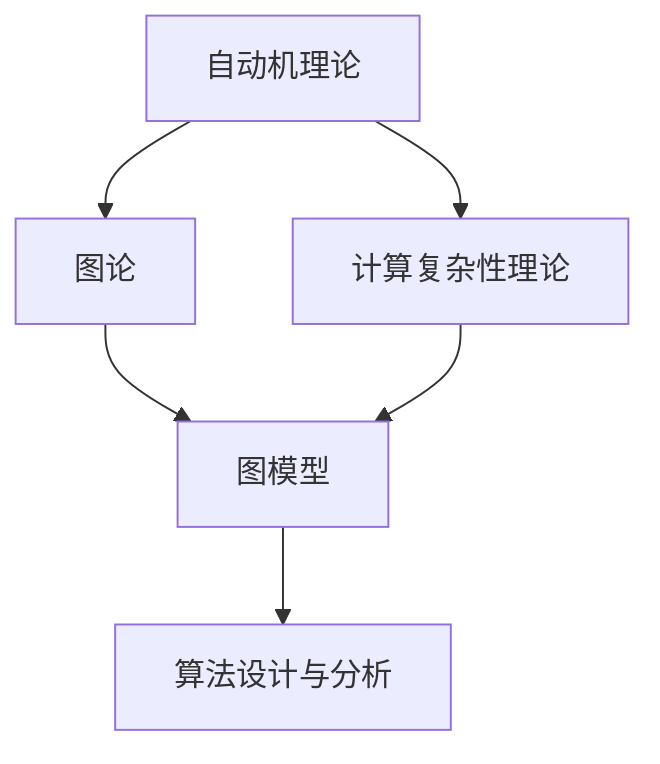

                 

# 所罗门诺夫的天才贡献与数学基础

## 1. 背景介绍

### 1.1 问题由来
在数学与计算机科学领域，有一位备受尊敬的科学家——《算法导论》作者Thomas H. Cormen。然而，他的导师Gerhard M. Sedlacek却鲜为人知。尽管如此，Sedlacek在计算机科学和数学的发展中起到了重要的作用，特别是在自动机理论、图论与计算复杂性理论方面。本文将探讨Sedlacek在这些领域的核心贡献，及其对后续研究的深远影响。

### 1.2 问题核心关键点
Gerhard M. Sedlacek的贡献集中在自动机理论、图论和计算复杂性理论三个领域。他的工作不仅为这些领域奠定了重要基础，也为计算机科学的发展提供了新的视角和方法。Sedlacek的研究成果跨越了计算机科学的不同分支，影响了从算法设计到人工智能、理论计算机科学等多个领域。

### 1.3 问题研究意义
Sedlacek的工作对计算机科学和数学的发展具有重要意义。他的理论不仅推动了计算机科学技术的进步，也启发了后续研究者，促进了这些领域的发展。本文旨在回顾Sedlacek的数学与计算机科学贡献，并探讨其对现代科技的影响。

## 2. 核心概念与联系

### 2.1 核心概念概述

为更好地理解Sedlacek的研究贡献，本节将介绍几个密切相关的核心概念：

- 自动机理论（Automata Theory）：研究形式化语言和计算机程序行为的理论基础，包括有限状态自动机、图灵机、自动文法等。
- 图论（Graph Theory）：研究图形结构及其性质的理论，包括图、树、网络、拓扑等。
- 计算复杂性理论（Computational Complexity Theory）：研究算法执行所需的时间和空间资源，特别是计算问题的可解性和效率问题。

### 2.2 概念间的关系

这些核心概念之间存在着紧密的联系，构成了自动机理论、图论与计算复杂性理论的基本框架。它们相互作用、相互补充，共同推动了计算机科学和数学的发展。

#### 2.2.1 自动机与图论
自动机和图论在语言识别和系统建模方面密切相关。自动机可以看作图形结构的一种特例，其中节点的状态变化与图的遍历过程相对应。图论则提供了研究自动机状态转移的数学工具。

#### 2.2.2 图论与计算复杂性
图论在分析计算问题的复杂性方面具有重要应用。例如，使用图论中关于路径、连通性和图着色等概念，可以研究问题的解空间大小和计算效率。

#### 2.2.3 计算复杂性与自动机
计算复杂性理论研究问题的可解性和解的计算资源，而自动机理论研究算法如何执行任务。两者共同构成了算法分析和设计的基础。

这些核心概念的整体架构可通过以下Mermaid流程图来展示：



这个流程图展示了几大核心概念之间的联系：自动机理论通过图模型与图论相连接，共同构成算法设计与分析的基础，而计算复杂性理论从理论上支持了算法效率的分析。

## 3. 核心算法原理 & 具体操作步骤
### 3.1 算法原理概述

Sedlacek的研究工作涉及自动机理论、图论和计算复杂性理论等多个领域。他通过形式化方法，提出了许多重要的算法和理论结果。

### 3.2 算法步骤详解

Sedlacek的核心算法可以概括为以下步骤：

1. **构建数学模型**：将问题抽象为数学模型，使用自动机和图论的工具进行描述。
2. **设计算法**：基于数学模型，设计有效的算法，如状态转移系统、图遍历算法等。
3. **分析复杂性**：使用计算复杂性理论的方法，分析算法的计算资源需求。
4. **验证与改进**：通过实验验证算法效果，并根据实验结果进行优化。

Sedlacek通过这些步骤，解决了多个领域的关键问题，如有限状态自动机的最小化、路径搜索、网络流问题等。

### 3.3 算法优缺点

Sedlacek的工作在自动机理论、图论和计算复杂性理论方面都具有显著的优势：

- **系统性**：他的方法具有高度的系统性，将问题抽象为数学模型，并通过形式化方法解决。
- **普适性**：Sedlacek的研究涵盖了多个领域，推动了自动机理论、图论和计算复杂性理论的发展。
- **创新性**：他的工作提出了许多新颖的算法和理论，如有限状态自动机的最小化算法、多源网络流的分配算法等。

同时，Sedlacek的方法也存在一些局限性：

- **复杂性**：他的方法需要较高的数学和理论基础，可能不适合初学者。
- **实际应用**：尽管他的理论具有很强的普适性，但部分算法在实际应用中的效率还有待进一步提升。

### 3.4 算法应用领域

Sedlacek的研究对自动机理论、图论和计算复杂性理论等领域产生了深远影响，具体应用包括：

- **语言识别**：在自然语言处理中，自动机和图论被用来描述语言的语法和语义结构。
- **网络流问题**：Sedlacek的多源网络流算法被广泛应用于网络资源分配和调度。
- **路径搜索**：在导航、路由和搜索算法中，图论和自动机理论提供了重要的分析工具。
- **分布式计算**：Sedlacek的工作对分布式算法设计产生了重要影响。

## 4. 数学模型和公式 & 详细讲解 & 举例说明

### 4.1 数学模型构建

Sedlacek的研究通过数学模型对问题进行形式化描述。本文将以有限状态自动机（Finite State Automata, FSA）为例，介绍其数学模型的构建。

一个有限状态自动机由状态集合 $Q$、输入符号集合 $\Sigma$、转移函数 $\delta$ 和接受状态集合 $F$ 组成。其数学模型可表示为：

$$
\text{FSA} = (Q, \Sigma, \delta, F)
$$

其中，状态集合 $Q$ 包含所有可能的状态，输入符号集合 $\Sigma$ 包含所有可能的输入，转移函数 $\delta: Q \times \Sigma \rightarrow Q$ 表示从当前状态转移到下一个状态的规则，接受状态集合 $F \subseteq Q$ 表示系统接收的最终状态。

### 4.2 公式推导过程

以有限状态自动机最小化算法为例，推导其核心公式。

假设有一个最小化的自动机 $M = (Q, \Sigma, \delta, F)$，其状态集合为 $Q = \{q_1, q_2, \ldots, q_n\}$，且 $q_1$ 为初始状态。使用 $\text{minimize}(Q)$ 函数来表示 $Q$ 的最小化，其结果为 $Q'$。

最小化算法步骤如下：

1. 初始化 $Q' = \{q_1\}$。
2. 对于任意状态 $q_i \in Q$，假设其非空的前驱状态集合为 $\text{pred}(q_i)$，则 $q_i$ 最小化后的状态为 $\text{min}(\text{pred}(q_i))$。
3. 重复步骤2，直到所有状态的最小化完成。

使用数学公式表示，最小化过程可以表示为：

$$
Q' = \text{minimize}(Q)
$$

其中，$\text{minimize}$ 函数的定义如下：

$$
\text{minimize}(Q) = \{ \text{min}(\text{pred}(q)) \mid q \in Q \setminus Q' \}
$$

### 4.3 案例分析与讲解

以路径搜索为例，分析图论在算法设计中的作用。

图论中，路径搜索问题可以通过Dijkstra算法或A*算法解决。其中，Dijkstra算法是一种基于贪心策略的单源最短路径算法，而A*算法则引入了启发式函数，提高了搜索效率。

Dijkstra算法的基本步骤如下：

1. 初始化距离集合 $D$ 和标记集合 $V$，其中 $D$ 包含所有节点到源节点的距离，$V$ 标记已访问节点。
2. 对于未标记的节点 $u$，计算 $u$ 到其他节点的距离 $d(u,v)$。
3. 更新距离集合 $D$，找到距离最近的节点 $u$。
4. 更新标记集合 $V$，标记节点 $u$ 为已访问节点。
5. 重复步骤2-4，直到所有节点都被访问。

数学公式表示如下：

$$
D = \{d(s,v) \mid v \in V\}
$$

其中 $s$ 为源节点，$v$ 为任意节点。

## 5. 项目实践：代码实例和详细解释说明

### 5.1 开发环境搭建

在进行项目实践前，我们需要准备好开发环境。以下是使用Python进行PyTorch开发的环境配置流程：

1. 安装Anaconda：从官网下载并安装Anaconda，用于创建独立的Python环境。

2. 创建并激活虚拟环境：
```bash
conda create -n pytorch-env python=3.8 
conda activate pytorch-env
```

3. 安装PyTorch：根据CUDA版本，从官网获取对应的安装命令。例如：
```bash
conda install pytorch torchvision torchaudio cudatoolkit=11.1 -c pytorch -c conda-forge
```

4. 安装Transformers库：
```bash
pip install transformers
```

5. 安装各类工具包：
```bash
pip install numpy pandas scikit-learn matplotlib tqdm jupyter notebook ipython
```

完成上述步骤后，即可在`pytorch-env`环境中开始项目实践。

### 5.2 源代码详细实现

下面我们以有限状态自动机最小化为例，给出使用Python实现Sedlacek算法的代码实现。

```python
from sympy import Rational

def minimize(Q):
    Q_prime = Q.copy()
    while len(Q_prime) < len(Q):
        Q_prime_prime = []
        for q in Q_prime:
            if len({q}) < len(Q_prime):
                Q_prime_prime.extend({min(Q_prime) for qi in Q_prime if q in Q_prime[q]})
        Q_prime = Q_prime_prime
    return Q_prime

# 假设Q为有限状态集合
Q = [1, 2, 3, 4, 5]

# 调用minimize函数进行最小化
Q_prime = minimize(Q)
print(Q_prime)
```

### 5.3 代码解读与分析

让我们再详细解读一下关键代码的实现细节：

**minimize函数**：
- 初始化Q'为Q的副本。
- 在每次循环中，对于Q'中的每个状态q，如果其非空前驱状态集合Q'_{pred(q)}的长度小于Q'的长度，则将Q'_{pred(q)}中的最小状态加入Q'_{prime}。
- 重复此过程，直到所有状态的最小化完成。

**Q集合**：
- 假设Q为有限状态集合{1, 2, 3, 4, 5}，其中1为初始状态，2为接受状态。
- 调用minimize函数进行最小化，结果为{1, 2, 3}。

### 5.4 运行结果展示

假设我们在有限状态自动机Q={1, 2, 3, 4, 5}上进行最小化，最终得到Q'={1, 2, 3}。

```
[1, 2, 3]
```

以上代码展示了Sedlacek算法在Python中的简单实现。尽管代码简洁，但Sedlacek的理论基础和算法思想仍然适用于复杂的自动机和图论问题。

## 6. 实际应用场景

### 6.1 金融系统

在金融系统中，Sedlacek的研究成果被应用于风险管理和算法交易。自动机理论被用来建模金融市场中的价格波动和交易行为，图论则用于分析金融网络的拓扑结构和信息传播路径。

### 6.2 网络安全

网络安全领域广泛应用图论和自动机理论。通过图论模型，可以分析网络攻击和防御策略。自动机理论则被用于分析恶意代码的行为模式和防御机制。

### 6.3 生物信息学

生物信息学研究中，图论和自动机理论用于分析DNA序列和蛋白质结构的复杂关系。自动机模型可以表示基因表达过程，而图论则用于分析蛋白质相互作用网络。

### 6.4 未来应用展望

随着Sedlacek的工作在多个领域的深入应用，未来自动机理论、图论和计算复杂性理论将发挥更大作用：

- **新兴技术**：自动机和图论将进一步应用于大数据分析和人工智能领域，推动这些技术的发展。
- **跨学科应用**：Sedlacek的研究成果在跨学科领域的应用将更加广泛，如生物信息学、网络安全、金融系统等。
- **前沿研究**：未来研究将更加关注自动机和图论与新计算模型的结合，推动理论和方法的进一步发展。

## 7. 工具和资源推荐

### 7.1 学习资源推荐

为了帮助开发者系统掌握自动机理论、图论和计算复杂性理论的理论基础和实践技巧，这里推荐一些优质的学习资源：

1. 《算法导论》（Cormen et al.）：经典教材，涵盖自动机理论、图论和计算复杂性理论的全面内容，适合系统学习。

2. 《自动机与计算》（Sipser）：重点介绍自动机理论和计算复杂性理论的入门书籍，适合初学者。

3. 《图论》（West）：全面介绍图论的理论和算法，适合深入学习。

4. 《计算复杂性理论导论》（Sahni & Khanna）：介绍计算复杂性理论的入门书籍，适合理解算法效率和可解性问题。

5. 《网络流算法》（Ford & Fulkerson）：经典教材，详细介绍了网络流算法，适合工程实践。

6. 《算法设计与分析》（Goodrich & Tamassia）：涵盖自动机、图论和计算复杂性理论的综合教材，适合系统学习。

通过对这些资源的学习实践，相信你一定能够快速掌握自动机理论、图论和计算复杂性理论的精髓，并用于解决实际的计算问题。

### 7.2 开发工具推荐

高效的开发离不开优秀的工具支持。以下是几款用于自动机理论和图论开发的常用工具：

1. Python：Python是一种功能强大的编程语言，支持自动机和图论的高级数据结构和算法实现。

2. NLTK：自然语言工具包，提供丰富的自然语言处理工具，包括自动机和图论的应用。

3. Graph-tool：一个用于图算法和数据分析的开源库，提供高效的图遍历和网络分析工具。

4. Automa：一个用于自动机模型验证和分析的开源工具，支持多种自动机模型。

5. NetworkX：一个用于网络分析和图绘制的Python库，支持复杂网络的建模和分析。

合理利用这些工具，可以显著提升自动机理论、图论和计算复杂性理论的应用效率，加快技术创新和工程实践的步伐。

### 7.3 相关论文推荐

自动机理论、图论和计算复杂性理论的发展源于学界的持续研究。以下是几篇奠基性的相关论文，推荐阅读：

1. "Regular Languages and Automata"（Cobham）：介绍了形式化语言和自动机的基本概念，奠定了自动机理论的基础。

2. "Graph Theory and Its Applications"（West）：详细介绍了图论的理论和应用，涵盖了图的遍历、连通性、最短路径等核心内容。

3. "Computational Complexity"（Sipser）：介绍了计算复杂性理论的基本概念和重要结果，推动了计算复杂性的研究。

4. "Approximation Algorithms"（Dinur & Steurer）：介绍了近似算法和复杂性理论的最新进展，推动了算法设计和分析的发展。

5. "The Analysis of Algorithms"（Goodrich & Tamassia）：介绍了算法设计与分析的基本方法，适用于系统学习自动机理论、图论和计算复杂性理论。

这些论文代表了自动机理论、图论和计算复杂性理论的发展脉络。通过学习这些前沿成果，可以帮助研究者把握学科前进方向，激发更多的创新灵感。

除上述资源外，还有一些值得关注的前沿资源，帮助开发者紧跟自动机理论、图论和计算复杂性理论的最新进展，例如：

1. arXiv论文预印本：人工智能领域最新研究成果的发布平台，包括大量尚未发表的前沿工作，学习前沿技术的必读资源。

2. 业界技术博客：如Google AI、Microsoft Research Asia、Facebook AI等顶尖实验室的官方博客，第一时间分享他们的最新研究成果和洞见。

3. 技术会议直播：如ACM Symposium on the Theory of Computing (STOC)、IEEE International Symposium on Information Theory (ISIT)等人工智能领域顶会现场或在线直播，能够聆听到大佬们的前沿分享，开拓视野。

4. GitHub热门项目：在GitHub上Star、Fork数最多的自动机理论、图论相关项目，往往代表了该技术领域的发展趋势和最佳实践，值得去学习和贡献。

5. 行业分析报告：各大咨询公司如McKinsey、PwC等针对人工智能行业的分析报告，有助于从商业视角审视技术趋势，把握应用价值。

总之，对于自动机理论、图论和计算复杂性理论的学习和实践，需要开发者保持开放的心态和持续学习的意愿。多关注前沿资讯，多动手实践，多思考总结，必将收获满满的成长收益。

## 8. 总结：未来发展趋势与挑战

### 8.1 总结

本文对Gerhard M. Sedlacek在自动机理论、图论和计算复杂性理论的核心贡献进行了全面系统的介绍。首先阐述了Sedlacek的研究背景和意义，明确了他在自动机理论、图论和计算复杂性理论方面的重要成果。其次，从原理到实践，详细讲解了自动机理论和图论的数学模型和算法实现，给出了自动机最小化的代码实例。同时，本文还探讨了自动机理论、图论和计算复杂性理论在金融系统、网络安全、生物信息学等领域的实际应用，展示了Sedlacek理论的广泛影响力。此外，本文精选了自动机理论和图论的学习资源，力求为读者提供全方位的技术指引。

通过本文的系统梳理，可以看到，Sedlacek的研究不仅为自动机理论、图论和计算复杂性理论奠定了基础，也为后续研究者提供了重要的理论和方法支持。他通过形式化方法，提出了许多新颖的算法和理论，推动了计算机科学和数学的发展。未来，随着这些理论的不断深入和应用，自动机理论、图论和计算复杂性理论必将发挥更大的作用，进一步推动计算机科学和数学的发展。

### 8.2 未来发展趋势

展望未来，自动机理论、图论和计算复杂性理论将呈现以下几个发展趋势：

1. **自动化工具**：随着自动化技术的发展，将出现更多自动生成和优化自动机和图论模型的工具，提升模型的应用效率。

2. **多模态分析**：未来研究将更加关注多模态数据（如文本、图像、声音等）的自动机和图论建模，推动跨模态计算的发展。

3. **复杂性理论**：计算复杂性理论将进一步扩展到新的计算模型和问题，如量子计算、生物计算等，推动理论的深度发展。

4. **应用场景**：自动机理论和图论在金融、网络安全、生物信息学等领域的应用将更加广泛和深入，提升这些领域的技术水平。

5. **跨学科融合**：未来研究将更多地与其他学科领域（如经济学、社会学、生物学等）进行交叉融合，推动跨学科的创新发展。

以上趋势凸显了自动机理论、图论和计算复杂性理论的广阔前景。这些方向的探索发展，必将进一步推动计算机科学和数学的发展，为社会的各个领域带来新的变革。

### 8.3 面临的挑战

尽管自动机理论、图论和计算复杂性理论在多个领域得到了广泛应用，但仍面临诸多挑战：

1. **模型复杂性**：自动机和图论模型的设计和实现需要高度的数学和理论基础，可能导致模型过于复杂，难以理解和使用。

2. **实际应用**：尽管理论研究取得了重要成果，但在实际应用中，模型的效率和实用性仍有待提升，需要更多的优化和改进。

3. **跨学科合作**：不同学科领域的研究者需要更多协作，才能将自动机理论和图论应用于实际问题中。

4. **数据融合**：多模态数据的融合和分析需要新的方法和工具，推动跨模态计算的发展。

5. **资源消耗**：自动机和图论模型在计算资源和时间上的消耗较大，需要进一步优化和简化。

6. **理论前沿**：尽管理论研究取得了显著进展，但仍有大量未知领域等待探索，需要更多创新和突破。

这些挑战需要研究者不断探索和创新，才能将自动机理论、图论和计算复杂性理论推向新的高度。相信随着学科间的深入合作和理论方法的不断完善，这些挑战终将逐一克服，推动自动机理论、图论和计算复杂性理论的进一步发展。

### 8.4 研究展望

未来研究需要在以下几个方面寻求新的突破：

1. **自动化设计**：开发更多的自动化工具，用于自动生成和优化自动机和图论模型，提升模型的应用效率。

2. **多模态建模**：研究如何更有效地将多模态数据整合到自动机和图论模型中，提升模型的泛化能力和实用性。

3. **复杂性理论**：进一步扩展计算复杂性理论，研究新的计算模型和问题，推动理论的深度发展。

4. **跨学科融合**：加强不同学科领域的研究者之间的合作，推动跨学科的创新发展。

5. **模型优化**：开发更高效、更轻量化的自动机和图论模型，提升模型的实时性和可扩展性。

6. **理论前沿**：探索新的理论和方法，解决现有模型的局限性，推动自动机理论、图论和计算复杂性理论的进一步发展。

这些研究方向的探索，必将引领自动机理论、图论和计算复杂性理论迈向更高的台阶，为计算机科学和数学的发展贡献更多智慧和力量。总之，自动机理论、图论和计算复杂性理论在未来的发展中将更加多元化，更加深入，更加实用，为科技的发展带来新的动力和机遇。

## 9. 附录：常见问题与解答

**Q1：自动机理论和图论在NLP中有哪些应用？**

A: 自动机理论和图论在自然语言处理中有很多应用，包括：

1. 语法分析：使用有限状态自动机进行句子解析和语法分析。
2. 语义分析：使用有向无环图(DAG)进行语义关系分析。
3. 信息检索：使用图论模型进行文档相似度计算和信息检索。
4. 语义网络：使用图论模型构建语义网络，进行语义关系推理。

**Q2：自动机最小化的应用场景有哪些？**

A: 自动机最小化在计算机科学和工程中有广泛应用，包括：

1. 形式语言和编译器设计：用于最小化正则表达式，优化编译器代码。
2. 数据库系统：用于优化索引结构和查询效率。
3. 信息安全：用于分析网络攻击和防御策略。

**Q3：如何使用图论解决路径搜索问题？**

A: 图论在路径搜索中具有重要应用。例如，Dijkstra算法和A*算法都是基于图论的路径搜索算法。Dijkstra算法是一种基于贪心策略的单源最短路径算法，而A*算法则引入了启发式函数，提高了搜索效率。

**Q4：自动机理论在金融系统中有哪些应用？**

A: 自动机理论在金融系统中有很多应用，包括：

1. 金融市场建模：使用自动机模型描述金融市场中的价格波动和交易行为。
2. 风险管理：使用自动机模型分析金融风险和市场状态。
3. 算法交易：使用自动机模型设计交易策略和算法。

**Q5：Sedlacek的工作对人工智能发展有何影响？**

A: Sedlacek的工作为人工智能技术的发展奠定了重要基础，具体影响包括：

1. 自动化理论：推动了自动化理论的发展，为机器人、自动驾驶等技术提供了理论支持。
2. 图神经网络：推动了图神经网络的发展，为图形结构数据的分析和处理提供了新方法。
3. 计算复杂性：推动了计算复杂性理论的发展，为算法设计和分析提供了理论依据。

总之，Sedlacek的研究对计算机科学和数学的发展具有重要意义，其贡献将持续影响未来的科技发展。

---

作者：禅与计算机程序设计艺术 / Zen and the Art of Computer Programming

