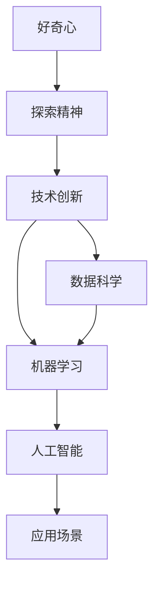

                 

# 探索与理解：好奇心的力量

> 关键词：好奇心，探索精神，技术创新，人工智能，数据科学，机器学习

## 1. 背景介绍

### 1.1 问题由来

在人工智能和数据科学的领域，好奇心一直是推动技术进步的关键驱动力。从最初的神经网络到深度学习，再到目前的生成对抗网络（GANs）和强化学习，每一次技术突破都源自于对未知的探索和对新问题的解答。这种探索精神不仅推动了基础研究的发展，也加速了技术的商业化和应用。

### 1.2 问题核心关键点

好奇心驱动的探索过程，本质上是一种认知心理活动。它源自于对未知的渴望和探索新知的动力，能够激发人类的创新和创造力。在技术领域，好奇心不仅催生了许多新的研究方向和算法，还推动了技术的广泛应用和产业化。

## 2. 核心概念与联系

### 2.1 核心概念概述

为了深入理解好奇心驱动的技术探索过程，我们首先需要明确几个关键概念：

- **好奇心**：指对新奇事物、未知领域或未解之谜的渴望和探索心理。在技术领域，好奇心表现为对新算法、新模型和新应用场景的探索和实践。

- **探索精神**：指在追求真理和解决问题的过程中，勇于尝试新方法、新技术和全新思路的精神。探索精神是推动技术创新的重要动力。

- **技术创新**：指在已有技术的基础上，通过研究、开发和实践，创造出具有新颖性和实用性的新方法和新技术。技术创新是驱动技术进步的核心动力。

- **数据科学**：利用数据、统计学和算法，从数据中提取知识、发现规律和进行预测的科学。数据科学是技术探索的重要工具和方法。

- **机器学习**：通过算法和模型，从数据中学习规律，自动改进性能的一种人工智能技术。机器学习是技术创新的重要手段。

- **人工智能**：模仿人类智能，使机器能够执行复杂任务和解决问题的技术。人工智能是技术探索的重要应用方向。

这些概念之间存在紧密的联系，形成了一个相互促进的探索与创新的生态系统。好奇心驱动的探索精神，通过数据科学和机器学习等技术手段，推动人工智能技术的不断进步和应用。

### 2.2 概念间的关系

这些核心概念之间的关系可以通过以下Mermaid流程图来展示：



这个流程图展示了好奇心、探索精神、技术创新、数据科学、机器学习和人工智能之间的相互关系和作用：

1. 好奇心驱动探索精神，探索精神促进技术创新。
2. 技术创新依赖于数据科学和机器学习等技术手段。
3. 人工智能是技术创新的应用方向，而数据科学和机器学习为其提供数据和算法支持。
4. 最终，人工智能技术在实际应用场景中得到检验和改进，形成闭环。

通过这个流程图，我们可以更好地理解好奇心和技术探索之间的关系，以及它们对技术进步的贡献。

## 3. 核心算法原理 & 具体操作步骤
### 3.1 算法原理概述

好奇心驱动的技术探索，本质上是通过不断试错和实验，逐步优化和改进算法的过程。这种探索过程通常包括以下几个步骤：

1. **提出假设**：根据已有知识和技术，提出解决特定问题的假设和方案。
2. **设计实验**：设计实验方案，验证假设的可行性和有效性。
3. **数据准备**：收集和准备用于实验的数据集，确保数据的质量和多样性。
4. **模型训练**：使用数据科学和机器学习等技术手段，训练模型并进行参数优化。
5. **结果评估**：对模型性能进行评估，确定是否需要进一步改进。
6. **迭代优化**：根据评估结果，反复调整和优化模型，直到满足应用需求。

### 3.2 算法步骤详解

以生成对抗网络（GANs）为例，详细介绍一个典型的技术探索过程：

1. **提出假设**：生成对抗网络（GANs）由生成器和判别器两个组件组成，用于生成逼真的图像数据。假设原始图像数据集不足，无法满足应用需求。因此提出假设，使用GANs生成更多高质量图像数据。

2. **设计实验**：设计一个实验方案，包含以下步骤：
   - 定义生成器和判别器的结构。
   - 选择损失函数和优化器。
   - 设定训练轮数和批大小。
   - 设计数据增强和随机化策略。

3. **数据准备**：收集和预处理原始图像数据集，确保数据的多样性和质量。对于不足的数据集，采用数据增强技术扩充样本，如旋转、平移、缩放等。

4. **模型训练**：使用GANs框架（如TensorFlow、PyTorch等），对生成器和判别器进行交替训练。在训练过程中，不断调整模型参数和超参数，提高生成图像的逼真度和多样性。

5. **结果评估**：通过评估指标（如Inception Score、Fréchet Inception Distance等），评估生成图像的质量和多样性。使用客观评估和人工评估相结合的方法，全面评估模型性能。

6. **迭代优化**：根据评估结果，调整生成器和判别器的结构、参数和训练策略，进行多轮迭代优化，直到生成图像满足应用需求。

### 3.3 算法优缺点

**优点**：
- 好奇心驱动的探索过程，能够推动技术创新，发现新的研究方向和方法。
- 能够提升模型的性能和应用效果，解决实际问题。
- 促进知识的积累和传播，推动技术进步。

**缺点**：
- 探索过程可能需要大量的时间和资源，实验成本较高。
- 探索结果的不确定性，可能导致失败的风险。
- 需要较强的技术背景和经验，对于初学者较难入手。

### 3.4 算法应用领域

好奇心驱动的技术探索，在多个领域得到了广泛应用，例如：

- **计算机视觉**：使用GANs生成逼真图像，提高图像识别和生成模型的性能。
- **自然语言处理**：使用语言模型生成自然文本，提高文本生成和理解模型的效果。
- **语音识别**：使用生成模型提高语音转换和语音合成的效果。
- **强化学习**：使用探索策略改进模型性能，解决复杂游戏和智能控制问题。
- **推荐系统**：使用协同过滤和生成模型，提升推荐算法的精度和多样性。

这些应用领域展示了好奇心和技术探索的巨大潜力和价值。通过不断尝试和实验，技术探索能够推动算法和模型的改进，提升技术应用的效率和效果。

## 4. 数学模型和公式 & 详细讲解  
### 4.1 数学模型构建

在技术探索过程中，数学模型和公式是不可或缺的工具。以下是一个简单的线性回归数学模型示例：

设 $X$ 为自变量，$Y$ 为因变量，假设 $Y=f(X)+\epsilon$，其中 $f$ 为线性函数，$\epsilon$ 为噪声。目标是找到 $f$ 的参数 $\theta$，使得 $Y$ 的预测值 $\hat{Y}=f(X;\theta)$ 尽可能接近真实值 $Y$。

### 4.2 公式推导过程

使用最小二乘法求解线性回归模型，推导过程如下：

最小化预测值与真实值之间的平方误差：
$$
\min_{\theta} \sum_{i=1}^n (Y_i - f(X_i;\theta))^2
$$

将 $f$ 表示为 $f(X;\theta)=\theta_0 + \theta_1 X$，带入上式得：
$$
\min_{\theta} \sum_{i=1}^n (Y_i - (\theta_0 + \theta_1 X_i))^2
$$

对 $\theta$ 求导并令导数为0，解得：
$$
\theta_1 = \frac{\sum_{i=1}^n (X_i - \bar{X})(Y_i - \bar{Y})}{\sum_{i=1}^n (X_i - \bar{X})^2}
$$
$$
\theta_0 = \bar{Y} - \theta_1 \bar{X}
$$

其中，$\bar{X}$ 和 $\bar{Y}$ 分别为 $X$ 和 $Y$ 的均值。

### 4.3 案例分析与讲解

以线性回归为例，进一步分析其应用和特点：

假设我们有一组房价数据，目标是预测新房屋的价格。我们可以将房价 $Y$ 表示为房屋面积 $X$ 的线性函数，即 $Y=\theta_0 + \theta_1 X$。使用最小二乘法求解 $\theta_0$ 和 $\theta_1$，得到预测公式：

$$
\hat{Y}=\theta_0 + \theta_1 X
$$

通过比较预测值与真实值，评估模型的性能。

## 5. 项目实践：代码实例和详细解释说明
### 5.1 开发环境搭建

在技术探索过程中，选择合适的开发环境至关重要。以下是一个基于Python和TensorFlow的开发环境配置示例：

1. 安装Anaconda：从官网下载并安装Anaconda，用于创建独立的Python环境。

2. 创建并激活虚拟环境：
```bash
conda create -n tf-env python=3.8 
conda activate tf-env
```

3. 安装TensorFlow：根据CUDA版本，从官网获取对应的安装命令。例如：
```bash
conda install tensorflow -c pytorch -c conda-forge
```

4. 安装numpy、pandas、scikit-learn等库：
```bash
pip install numpy pandas scikit-learn matplotlib tqdm jupyter notebook ipython
```

完成上述步骤后，即可在`tf-env`环境中开始技术探索实践。

### 5.2 源代码详细实现

以线性回归为例，展示如何使用TensorFlow进行模型构建和训练：

```python
import tensorflow as tf
import numpy as np
import matplotlib.pyplot as plt

# 准备数据
x = np.linspace(0, 10, 100)
y = 2*x + np.random.normal(0, 0.5, 100)

# 定义模型
model = tf.keras.Sequential([
    tf.keras.layers.Dense(1, input_shape=(1,))
])

# 编译模型
model.compile(optimizer=tf.keras.optimizers.Adam(0.1), loss='mse')

# 训练模型
history = model.fit(x, y, epochs=100, verbose=0)

# 预测数据
y_pred = model.predict(x)

# 评估模型
plt.plot(x, y, label='Actual')
plt.plot(x, y_pred, label='Predicted')
plt.legend()
plt.show()
```

这段代码展示了线性回归的完整实现过程，包括数据准备、模型定义、编译、训练、预测和评估。

### 5.3 代码解读与分析

**模型定义**：
```python
model = tf.keras.Sequential([
    tf.keras.layers.Dense(1, input_shape=(1,))
])
```

定义了一个简单的全连接神经网络模型，包含一个输入层和一个输出层。输入层只有一个神经元，输出层有一个神经元。

**编译模型**：
```python
model.compile(optimizer=tf.keras.optimizers.Adam(0.1), loss='mse')
```

使用Adam优化器和均方误差损失函数编译模型，设定了学习率为0.1。

**训练模型**：
```python
history = model.fit(x, y, epochs=100, verbose=0)
```

使用随机梯度下降法对模型进行训练，设定迭代次数为100次，不输出训练信息。

**预测数据**：
```python
y_pred = model.predict(x)
```

使用训练好的模型对新数据进行预测。

**评估模型**：
```python
plt.plot(x, y, label='Actual')
plt.plot(x, y_pred, label='Predicted')
plt.legend()
plt.show()
```

使用Matplotlib绘制实际值和预测值，直观展示模型性能。

## 6. 实际应用场景
### 6.1 智能推荐系统

好奇心驱动的技术探索，在智能推荐系统中得到了广泛应用。推荐系统需要不断尝试和实验，才能找到最合适的推荐算法和模型。

在实践中，我们可以通过A/B测试和多轮实验，比较不同推荐策略的效果，优化推荐模型。例如，可以尝试协同过滤、内容推荐、基于深度学习的推荐等方法，不断改进推荐效果。

### 6.2 自动驾驶

自动驾驶技术需要不断探索和实验，才能提高系统的安全性、稳定性和效率。通过技术探索，可以实现自动驾驶系统的各种功能，如车道保持、交通信号识别、行人检测等。

在实践中，我们可以通过仿真测试和实际路测，不断优化算法和模型，提升自动驾驶系统的性能。例如，可以尝试使用卷积神经网络（CNN）进行图像识别，使用循环神经网络（RNN）进行时间序列分析，不断改进系统的感知和决策能力。

### 6.3 医疗诊断

医疗诊断需要不断探索和实验，才能提高诊断的准确性和可靠性。通过技术探索，可以实现医疗影像分析、病历记录分析和病理预测等应用。

在实践中，我们可以通过大数据分析和深度学习技术，探索新的诊断方法和模型。例如，可以尝试使用卷积神经网络（CNN）进行医学影像分析，使用循环神经网络（RNN）进行病历记录分析，不断改进诊断模型的性能。

### 6.4 未来应用展望

随着技术探索的不断深入，未来的应用场景将更加多样和广泛。以下列举一些可能的应用方向：

- **个性化教育**：通过技术探索，可以实现个性化学习方案的推荐，提升教育效果。
- **智能家居**：通过技术探索，可以实现智能设备的互联互通，提升家居体验。
- **智慧城市**：通过技术探索，可以实现城市管理的智能化，提升城市管理水平。
- **金融科技**：通过技术探索，可以实现风险预测、信用评估和金融市场分析，提升金融服务的效率和精度。

## 7. 工具和资源推荐
### 7.1 学习资源推荐

为了帮助开发者系统掌握技术探索的理论基础和实践技巧，这里推荐一些优质的学习资源：

1. 《深度学习》系列书籍：斯坦福大学李飞飞教授撰写的经典教材，详细介绍了深度学习的基本原理和算法。

2. Coursera《深度学习专项课程》：由Andrew Ng教授主讲的深度学习课程，覆盖了深度学习的基础和前沿内容。

3. Google AI博客：谷歌AI团队发布的博客，涵盖深度学习、机器学习、自然语言处理等领域的最新进展和研究。

4. Kaggle竞赛：Kaggle平台提供了大量数据科学和机器学习竞赛，通过参与竞赛，可以学习实践经验，提升技术水平。

5. GitHub开源项目：在GitHub上Star、Fork数最多的技术项目，往往代表了该领域的前沿研究方向和最佳实践，值得学习和贡献。

通过对这些资源的学习实践，相信你一定能够掌握技术探索的精髓，并用于解决实际的技术问题。

### 7.2 开发工具推荐

高效的开发离不开优秀的工具支持。以下是几款用于技术探索开发的常用工具：

1. Jupyter Notebook：一个开源的交互式笔记本环境，支持Python、R等多种语言，方便编写、执行和分享代码。

2. TensorFlow：由Google主导开发的开源深度学习框架，支持分布式计算和自动微分，适合大规模模型训练。

3. PyTorch：Facebook开发的开源深度学习框架，支持动态计算图，适合快速迭代研究和实验。

4. Keras：谷歌开发的高级神经网络API，支持多种深度学习模型和框架，易于上手和调试。

5. Git和GitHub：版本控制系统，方便团队协作和代码管理。

6. Docker：容器化技术，方便部署和管理深度学习模型。

合理利用这些工具，可以显著提升技术探索的开发效率，加快创新迭代的步伐。

### 7.3 相关论文推荐

技术探索的持续发展，离不开学界的持续研究。以下是几篇奠基性的相关论文，推荐阅读：

1. Deep Learning（深度学习）：由Ian Goodfellow、Yoshua Bengio和Aaron Courville合著的经典教材，详细介绍了深度学习的理论和应用。

2. AlphaGo论文：DeepMind团队发表的AlphaGo论文，展示了深度学习和强化学习的结合，实现了在围棋领域的突破。

3. Imagenet Large Scale Visual Recognition Challenge（ILSVRC）论文：由Yann LeCun等人发表的ILSVRC论文，展示了深度学习在图像识别领域的突破。

4. Attention Is All You Need（Transformer论文）：由Google AI团队发表的Transformer论文，展示了自注意力机制在机器翻译等任务中的突破。

5. Generative Adversarial Networks（GANs论文）：由Ian Goodfellow等人发表的GANs论文，展示了生成对抗网络在图像生成等任务中的突破。

这些论文代表了大规模技术探索的研究进展，通过学习这些前沿成果，可以帮助研究者把握学科前进方向，激发更多的创新灵感。

除上述资源外，还有一些值得关注的前沿资源，帮助开发者紧跟技术探索的最新进展，例如：

1. arXiv论文预印本：人工智能领域最新研究成果的发布平台，包括大量尚未发表的前沿工作，学习前沿技术的必读资源。

2. 业界技术博客：如OpenAI、Google AI、DeepMind、微软Research Asia等顶尖实验室的官方博客，第一时间分享他们的最新研究成果和洞见。

3. 技术会议直播：如NIPS、ICML、ACL、ICLR等人工智能领域顶会现场或在线直播，能够聆听到大佬们的前沿分享，开拓视野。

4. GitHub热门项目：在GitHub上Star、Fork数最多的技术项目，往往代表了该领域的前沿研究方向和最佳实践，值得去学习和贡献。

5. 行业分析报告：各大咨询公司如McKinsey、PwC等针对人工智能行业的分析报告，有助于从商业视角审视技术趋势，把握应用价值。

总之，对于技术探索的学习和实践，需要开发者保持开放的心态和持续学习的意愿。多关注前沿资讯，多动手实践，多思考总结，必将收获满满的成长收益。

## 8. 总结：未来发展趋势与挑战
### 8.1 研究成果总结

好奇心驱动的技术探索，已经成为推动人工智能和数据科学进步的重要力量。通过不断试错和实验，探索新的研究方向和方法，推动技术的创新和应用。

### 8.2 未来发展趋势

未来，技术探索将呈现以下几个发展趋势：

1. **数据驱动**：随着数据量的不断增长，数据驱动的探索将变得更加重要。利用大规模数据，发现新的规律和模式，推动技术的进步。

2. **跨领域融合**：技术探索将更多地跨越学科边界，实现多领域知识的融合和创新。例如，将计算机视觉、自然语言处理和强化学习等技术结合，解决复杂问题。

3. **自动化探索**：利用自动化技术，优化探索过程，减少人工干预。例如，使用自动机器学习（AutoML）工具，自动选择最优的算法和模型。

4. **人机协同**：利用人机协同的探索方法，提高探索效率和效果。例如，结合人类的领域知识和经验，引导机器进行探索和优化。

5. **模型融合**：利用多种模型和技术手段，实现更全面、更准确的探索。例如，将符号计算和神经网络结合，提高模型的推理能力和泛化能力。

6. **伦理和社会影响**：技术探索过程中，应关注伦理和社会影响，确保技术应用的公平性和安全性。例如，避免算法偏见和数据泄露，保障用户隐私和数据安全。

### 8.3 面临的挑战

尽管技术探索带来了许多优势，但在探索过程中也面临诸多挑战：

1. **资源限制**：技术探索需要大量的计算资源和时间成本，尤其是在大规模数据和模型训练方面。如何高效利用资源，是探索过程中的重要挑战。

2. **结果不确定性**：探索结果的不确定性，可能导致失败的成本较高。如何在探索中避免过度试错，快速发现最优方案，是探索过程中的关键问题。

3. **数据隐私和伦理**：技术探索中涉及大量的数据处理，如何保障数据隐私和安全，避免伦理问题，是探索过程中的重要考量。

4. **技术壁垒**：技术探索需要较强的技术背景和经验，对于初学者较难入手。如何降低技术门槛，普及技术探索，是探索过程中的重要挑战。

5. **生态系统建设**：技术探索需要构建完善的生态系统，包括开源工具、数据集、文档和社区等。如何构建和维护一个开放的生态系统，是探索过程中的重要任务。

### 8.4 研究展望

面对技术探索面临的挑战，未来的研究需要在以下几个方面寻求新的突破：

1. **自动化探索**：开发更多的自动化探索工具和框架，减少人工干预，提高探索效率和效果。

2. **跨领域协作**：促进跨学科的合作和交流，结合多种领域的知识和技术手段，解决复杂问题。

3. **伦理和社会影响**：在技术探索中引入伦理和社会影响评估机制，确保技术应用的公平性和安全性。

4. **可解释性和透明性**：开发可解释的模型和技术手段，提高技术探索的可理解性和透明性，增强用户信任。

5. **开放生态系统**：构建和维护一个开放的生态系统，推动技术共享和普及，促进技术的进步和应用。

这些研究方向的探索，必将引领技术探索技术迈向更高的台阶，为构建智能系统提供坚实的基础。面向未来，技术探索需要不断突破创新，推动人工智能技术的发展和应用，为人类的认知智能带来深远影响。

## 9. 附录：常见问题与解答

**Q1：技术探索过程中如何选择合适的数据集？**

A: 选择合适的数据集是技术探索的前提。一般来说，数据集应具备以下特点：
1. 数据量足够大，覆盖面广。
2. 数据质量高，标注准确。
3. 数据类型多样，具有代表性。
4. 数据分布与实际应用场景一致。

**Q2：技术探索过程中如何评估模型的性能？**

A: 评估模型的性能是技术探索的重要环节。常用的评估指标包括：
1. 准确率、召回率和F1分数，用于分类任务。
2. 均方误差和均方根误差，用于回归任务。
3. 精确率、召回率和F1分数，用于信息检索任务。
4. 自然语言处理任务常用的BLEU、ROUGE、METEOR等指标。
5. 图像处理任务常用的PSNR、SSIM等指标。

**Q3：技术探索过程中如何优化模型参数？**

A: 优化模型参数是技术探索的重要步骤。常用的优化方法包括：
1. 梯度下降法及其变种，如Adam、Adagrad等。
2. 正则化技术，如L1、L2正则化、Dropout等。
3. 参数共享和稀疏化技术，如LoRA、Transformer-XL等。
4. 模型融合和集成方法，如Bagging、Boosting等。

**Q4：技术探索过程中如何处理数据预处理和清洗？**

A: 数据预处理和清洗是技术探索的基础步骤。常用的数据处理方法包括：
1. 数据清洗，去除噪声和异常值。
2. 数据增强，扩充样本数量和多样性。
3. 数据标准化，使数据符合模型要求。
4. 特征选择和提取，提取有意义的特征。
5. 数据平衡，处理类别不平衡问题。

**Q5：技术探索过程中如何引入先验知识和领域专家经验？**

A: 引入先验知识和领域专家经验是技术探索的重要方法。常用的方法包括：
1. 符号计算，引入领域知识和专家经验。
2. 知识图谱，构建知识网络和推理路径。
3. 专家系统，利用专家知识进行决策和推理。
4. 多模态融合，结合多种信息源进行探索。

通过这些方法，可以更好地利用先验知识和领域经验，提高技术探索的效果和可靠性。

---

作者：禅与计算机程序设计艺术 / Zen and the Art of Computer Programming

