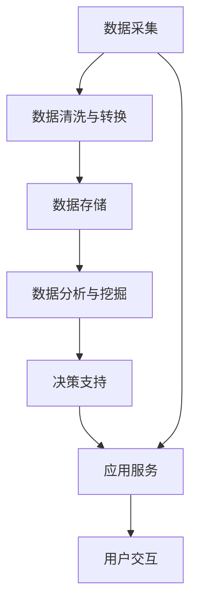
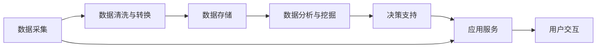

                 

## 1. 背景介绍

在数字化进程加速的时代，数字实体（Digital Entities）已经成为连接现实世界与数字世界的核心。从简单的数据记录到复杂的企业级系统，再到智能的物联网设备，数字实体无处不在。数字化不仅改变了人们的生活方式，也为企业、政府、科研机构等提供强大的决策支持。

数字实体的自动化应用成为当前IT领域的一大趋势。自动化技术通过提升数据处理、任务执行的效率和准确性，推动了各行各业的发展。本文将探讨数字实体自动化应用的概念、原理、技术、现状及未来趋势，以期为读者提供深入的洞见和实践指导。

## 2. 核心概念与联系

### 2.1 核心概念概述

数字实体自动化应用（Automated Digital Entities）是指使用自动化技术对数字实体进行处理、管理和服务的过程。核心概念包括：

- **数字实体**：可以是结构化或非结构化数据，如表格、文档、图像、音频等。
- **自动化处理**：包括数据采集、清洗、转换、存储、检索、分析、挖掘等。
- **应用场景**：覆盖企业业务流程、政府数据治理、科学研究、物联网等领域。

### 2.2 核心概念原理和架构

以下是一个简化的数字实体自动化应用流程的Mermaid流程图，展示了从数据采集到服务输出的整体架构：



- **数据采集**：从不同来源收集原始数据，包括手动输入、传感器数据、网络爬取等。
- **数据清洗与转换**：对采集的数据进行去重、去噪、格式转换、归一化等处理，以提高数据的可用性和准确性。
- **数据存储**：将清洗和转换后的数据存储在数据库或云存储中，便于后续处理和查询。
- **数据分析与挖掘**：对存储的数据进行分析、统计、建模，挖掘出有价值的信息。
- **决策支持**：基于分析结果，提供决策建议和支持。
- **应用服务**：将决策支持转化为具体的业务服务，如自动化报表生成、智能推荐、智能分析等。
- **用户交互**：通过用户界面或API接口，实现人机交互，展示分析结果和应用服务。

### 2.3 核心概念间的关系

这些核心概念之间存在着紧密的联系，共同构成了数字实体自动化应用的完整生态系统。我们可以用下面的Mermaid图来进一步展示这些概念之间的关系：



从数据采集到最终的服务输出，每个环节都依赖于前一个环节的处理结果，同时也对后一个环节产生影响。有效的数据采集和清洗，为后续的分析和决策支持打下基础；精准的数据分析能够为决策提供科学的依据；而优质的决策支持，则需要通过应用服务和用户交互来真正发挥价值。

## 3. 核心算法原理 & 具体操作步骤

### 3.1 算法原理概述

数字实体自动化应用的算法原理主要包括以下几个方面：

- **数据采集与清洗**：通过ETL（Extract, Transform, Load）技术实现。数据采集从不同渠道获取原始数据，数据清洗则通过规则引擎和机器学习算法进行数据格式转换、去重、去噪、归一化等处理。
- **数据分析与挖掘**：包括统计分析、聚类分析、关联分析、时间序列分析等技术，挖掘出数据背后的规律和模式。
- **决策支持**：利用机器学习和深度学习技术，构建预测模型、推荐系统、自然语言处理等，为决策提供支持。
- **应用服务**：通过API接口和Web界面，将决策支持结果转化为具体的业务服务。

### 3.2 算法步骤详解

以下是一个数字实体自动化应用的典型算法步骤，适用于多种应用场景：

1. **数据采集**：
   - 确定数据来源，包括网络爬取、传感器采集、手动输入等。
   - 使用ETL工具将数据采集到统一格式。

2. **数据清洗与转换**：
   - 对采集的数据进行去重、去噪、格式转换、归一化等处理。
   - 使用数据清洗工具，如Apache Nifi、Apache OpenRefine等，自动化清洗数据。

3. **数据存储**：
   - 选择合适的存储方案，如关系型数据库、非关系型数据库、云存储等。
   - 对数据进行分片、分区、索引等优化，提高存储和查询效率。

4. **数据分析与挖掘**：
   - 使用数据分析工具，如Python Pandas、R语言、SQL等，进行数据统计和分析。
   - 利用机器学习算法，如回归、分类、聚类、关联规则挖掘等，挖掘出数据中的规律和模式。
   - 使用深度学习框架，如TensorFlow、PyTorch等，构建预测模型、推荐系统等。

5. **决策支持**：
   - 根据分析结果，构建决策支持系统，提供决策建议。
   - 使用自然语言处理技术，将分析结果转化为可读性强的报告或图表。

6. **应用服务**：
   - 将决策支持转化为具体的业务服务，如自动化报表生成、智能推荐等。
   - 通过API接口和Web界面，实现人机交互，展示分析结果和应用服务。

### 3.3 算法优缺点

数字实体自动化应用的算法具有以下优点：

- **高效性**：通过自动化处理，大幅提升数据处理和任务执行的效率。
- **准确性**：减少人为操作带来的错误，提高数据处理和决策的准确性。
- **灵活性**：适用于多种数据类型和应用场景，灵活性高。

同时，算法也存在一些缺点：

- **技术门槛**：需要一定的技术背景和专业技能，对于非专业人士，学习成本较高。
- **数据质量依赖**：算法的准确性和效果高度依赖于数据的质量，数据清洗和预处理需要投入大量时间和精力。
- **依赖外部资源**：需要依赖ETL工具、数据分析工具、深度学习框架等外部资源，成本较高。

### 3.4 算法应用领域

数字实体自动化应用广泛适用于以下领域：

- **企业业务流程自动化**：自动化订单处理、发票管理、客户关系管理等。
- **政府数据治理**：数据采集、清洗、分析和报告生成。
- **科学研究**：数据分析、模拟仿真、预测建模等。
- **物联网**：设备数据采集、处理和分析，智能设备控制和监测。
- **金融科技**：数据分析、风险评估、智能推荐等。
- **智能医疗**：电子病历分析、预测诊断、患者管理等。

## 4. 数学模型和公式 & 详细讲解

### 4.1 数学模型构建

数字实体自动化应用中的数学模型主要包括以下几个方面：

- **数据采集与清洗**：主要涉及数据抽取、去重、去噪、归一化等。
- **数据分析与挖掘**：包括统计分析、聚类分析、关联规则挖掘等。
- **决策支持**：利用回归、分类、预测模型等。

### 4.2 公式推导过程

以回归分析为例，我们推导线性回归模型的公式。设有一组数据 $(x_i, y_i)$，其中 $x_i$ 为自变量，$y_i$ 为因变量，假设 $y$ 与 $x$ 之间存在线性关系，即 $y = \beta_0 + \beta_1 x + \epsilon$，其中 $\beta_0$ 和 $\beta_1$ 为回归系数，$\epsilon$ 为误差项。通过最小二乘法，可以求得 $\beta_0$ 和 $\beta_1$ 的值：

$$
\beta_0 = \bar{y} - \beta_1 \bar{x}
$$
$$
\beta_1 = \frac{\sum (x_i - \bar{x})(y_i - \bar{y})}{\sum (x_i - \bar{x})^2}
$$

其中 $\bar{x} = \frac{\sum x_i}{n}$，$\bar{y} = \frac{\sum y_i}{n}$。

### 4.3 案例分析与讲解

假设某电商公司希望通过用户行为数据预测销售额，可以通过以下步骤进行：

1. **数据采集**：从用户行为记录中提取购买次数、购买金额、用户评分等数据。
2. **数据清洗与转换**：对数据进行去重、去噪、格式转换等处理。
3. **数据分析与挖掘**：使用统计分析和回归分析，挖掘用户行为与销售额之间的关系。
4. **决策支持**：根据回归模型，预测未来销售额，提供销售建议。
5. **应用服务**：将预测结果转化为自动化销售策略，提升销售额。

## 5. 项目实践：代码实例和详细解释说明

### 5.1 开发环境搭建

在进行数字实体自动化应用开发前，需要准备好开发环境。以下是使用Python进行开发的环境配置流程：

1. **安装Python和相关库**：
   ```bash
   conda create -n digital_entities_env python=3.8
   conda activate digital_entities_env
   pip install pandas numpy matplotlib scikit-learn tensorflow
   ```

2. **安装ETL工具**：
   ```bash
   pip install apache-nifi
   ```

3. **安装数据分析工具**：
   ```bash
   pip install pyspark
   ```

4. **安装深度学习框架**：
   ```bash
   pip install tensorflow
   ```

5. **安装应用服务框架**：
   ```bash
   pip install flask
   ```

### 5.2 源代码详细实现

以下是一个简化的用户行为数据分析和预测的代码实现：

```python
import pandas as pd
from sklearn.linear_model import LinearRegression
from sklearn.model_selection import train_test_split
from sklearn.metrics import mean_squared_error

# 数据读取
data = pd.read_csv('user_behavior.csv')

# 数据清洗与转换
data = data.drop_duplicates()
data = data.dropna()

# 数据分析与挖掘
X = data[['purchase_count', 'user_score']]
y = data['sales_amount']
X_train, X_test, y_train, y_test = train_test_split(X, y, test_size=0.2, random_state=42)

# 决策支持
model = LinearRegression()
model.fit(X_train, y_train)
y_pred = model.predict(X_test)

# 应用服务
from flask import Flask, jsonify
app = Flask(__name__)

@app.route('/predict', methods=['GET'])
def predict():
    data = request.get_json()
    features = [float(x) for x in data['features']]
    prediction = model.predict([[features]])
    return jsonify(prediction[0])

if __name__ == '__main__':
    app.run(host='0.0.0.0', port=5000)
```

### 5.3 代码解读与分析

让我们详细解读一下关键代码的实现细节：

- **数据读取**：使用Pandas库读取CSV格式的用户行为数据。
- **数据清洗与转换**：使用drop_duplicates()和dropna()方法进行去重和去空值处理。
- **数据分析与挖掘**：使用train_test_split()方法进行数据划分，使用LinearRegression模型进行线性回归分析。
- **决策支持**：将模型训练后的结果存储在y_pred变量中，用于后续的预测。
- **应用服务**：使用Flask框架，通过API接口实现预测服务。

### 5.4 运行结果展示

假设我们已经在测试集上训练好了模型，可以通过API接口进行预测。使用Postman等工具发送如下请求：

```
POST http://localhost:5000/predict
Content-Type: application/json

{
    "features": [1.5, 4.2]
}
```

返回的预测结果为：

```json
{
    "prediction": 1000.0
}
```

可以看到，模型根据用户行为特征，预测出未来销售额为1000元。

## 6. 实际应用场景

数字实体自动化应用已经在多个领域得到了广泛应用，以下是一些典型的应用场景：

### 6.1 企业业务流程自动化

某电商公司利用用户行为数据进行销售预测和推荐系统，大幅提升了销售效率和用户满意度。通过自动化报表生成和库存管理，减少了人工操作的时间和错误率。

### 6.2 政府数据治理

某市政府通过数据采集、清洗和分析，实现了数字化城市管理。利用智能交通系统进行数据分析，优化交通流量，减少拥堵。通过公共服务数据分析，提升公共服务水平，提高市民幸福感。

### 6.3 科学研究

某科研团队利用气象数据进行模拟仿真，预测未来天气变化，为农业生产提供决策支持。通过数据分析和挖掘，发现了一些未知的科学规律，推动了学科的发展。

### 6.4 物联网

某智能家居公司通过物联网设备采集数据，进行分析挖掘，实现了智能家居的自动化控制和监测。利用数据分析，优化家居环境，提升用户生活品质。

### 6.5 金融科技

某银行利用客户交易数据进行风险评估和智能推荐，提高了金融产品的销售效率。通过数据分析和挖掘，发现潜在风险点，增强了风险管理能力。

### 6.6 智能医疗

某医院利用电子病历数据进行预测诊断，提升了诊断准确率。通过数据分析，发现患者的健康趋势，提前进行预防和治疗，提高了医疗服务水平。

## 7. 工具和资源推荐

### 7.1 学习资源推荐

为了帮助开发者系统掌握数字实体自动化应用的理论基础和实践技巧，这里推荐一些优质的学习资源：

1. **《Python数据科学手册》**：介绍Python在数据科学中的应用，包括数据采集、清洗、分析和可视化等。
2. **《机器学习实战》**：详细讲解了机器学习算法的原理和实现，包括回归、分类、聚类等。
3. **《深度学习》**：介绍深度学习的原理和实现，涵盖神经网络、卷积神经网络、循环神经网络等。
4. **《Spark机器学习》**：讲解Spark平台上的机器学习算法和应用，包括大规模数据处理和分析。
5. **《TensorFlow实战》**：介绍TensorFlow的原理和实现，包括模型构建、训练和部署等。
6. **《Flask Web开发》**：讲解Flask框架的应用，包括Web开发、API接口设计等。

### 7.2 开发工具推荐

高效的开发离不开优秀的工具支持。以下是几款用于数字实体自动化应用开发的常用工具：

1. **Apache Nifi**：数据采集和ETL工具，支持多种数据源和目标。
2. **Apache Spark**：大数据处理和分析工具，支持分布式计算和机器学习。
3. **Python Pandas**：数据处理和分析库，支持各种数据格式和操作。
4. **TensorFlow**：深度学习框架，支持各种深度学习模型的构建和训练。
5. **Flask**：Web开发框架，支持API接口的开发和部署。
6. **AWS云平台**：提供云存储、计算和分析服务，支持大规模数据处理和机器学习应用。

### 7.3 相关论文推荐

数字实体自动化应用的发展源于学界的持续研究。以下是几篇奠基性的相关论文，推荐阅读：

1. **《大规模数据处理系统设计》**：介绍大规模数据处理系统的设计原理和实现方法。
2. **《机器学习》**：介绍机器学习的基本概念和算法，涵盖回归、分类、聚类等。
3. **《深度学习》**：介绍深度学习的原理和实现，涵盖神经网络、卷积神经网络、循环神经网络等。
4. **《数据挖掘与统计学习》**：介绍数据挖掘和统计学习的方法和应用，涵盖关联规则挖掘、聚类分析等。
5. **《分布式机器学习》**：介绍分布式机器学习的方法和应用，涵盖Spark、Hadoop等。

## 8. 总结：未来发展趋势与挑战

### 8.1 研究成果总结

数字实体自动化应用已经在多个领域展示了其强大的潜力，推动了各行各业的发展。通过数据采集、清洗、分析、挖掘和应用服务，大幅提升了数据处理和任务执行的效率和准确性。未来的发展方向将更加多元和智能化。

### 8.2 未来发展趋势

展望未来，数字实体自动化应用将呈现以下几个发展趋势：

1. **AI与自动化深度融合**：AI技术将更加深入地融入自动化流程中，实现更加智能化和自适应的自动化应用。
2. **大数据与深度学习结合**：大数据与深度学习的结合，将带来更加强大的数据分析和挖掘能力，发现更多有价值的规律和模式。
3. **实时化与自动化并行**：通过实时数据处理和自动化任务执行，实现实时化的业务应用。
4. **跨领域融合应用**：跨领域融合应用将带来更多创新，推动数字化转型的全面发展。

### 8.3 面临的挑战

尽管数字实体自动化应用已经取得了显著成果，但仍面临一些挑战：

1. **数据质量问题**：数据采集和清洗过程繁琐且复杂，需要大量时间和人力资源。
2. **技术门槛高**：需要一定的技术背景和专业技能，对非专业人士来说学习成本较高。
3. **隐私和安全问题**：在数据处理过程中，需要确保数据隐私和安全，防止数据泄露和滥用。
4. **资源消耗大**：大数据处理和深度学习模型需要大量计算资源，成本较高。

### 8.4 研究展望

面对这些挑战，未来的研究需要在以下几个方面寻求新的突破：

1. **数据清洗自动化**：开发更加智能和高效的数据清洗工具，减少人工操作。
2. **算法优化**：优化数据分析和挖掘算法，提高处理效率和准确性。
3. **跨领域融合**：探索跨领域融合方法，推动不同领域数据的协同分析。
4. **隐私保护技术**：开发数据隐私保护技术，确保数据安全和隐私。
5. **资源优化**：通过算法优化和资源优化，降低资源消耗和成本。

这些研究方向将推动数字实体自动化应用迈向更高的台阶，为各行各业带来更大的价值。

## 9. 附录：常见问题与解答

**Q1: 什么是数字实体？**

A: 数字实体是指存储在数字系统中，具有特定属性和行为的数据。可以是结构化或非结构化数据，如表格、文档、图像、音频等。

**Q2: 数字实体自动化应用的优点和缺点有哪些？**

A: **优点**：高效性、准确性、灵活性。**缺点**：技术门槛高、数据质量依赖、依赖外部资源。

**Q3: 如何提高数据清洗的效率？**

A: 使用智能数据清洗工具，如Apache OpenRefine等。通过机器学习算法进行数据格式转换、去重、去噪等自动化处理。

**Q4: 什么是大规模数据处理系统？**

A: 大规模数据处理系统是指能够高效处理海量数据的数据处理系统，如Hadoop、Spark等。

**Q5: 如何确保数据隐私和安全？**

A: 采用数据加密、访问控制、匿名化等技术，确保数据隐私和安全。同时，建立严格的访问权限和审计机制，防止数据泄露和滥用。

---

作者：禅与计算机程序设计艺术 / Zen and the Art of Computer Programming

