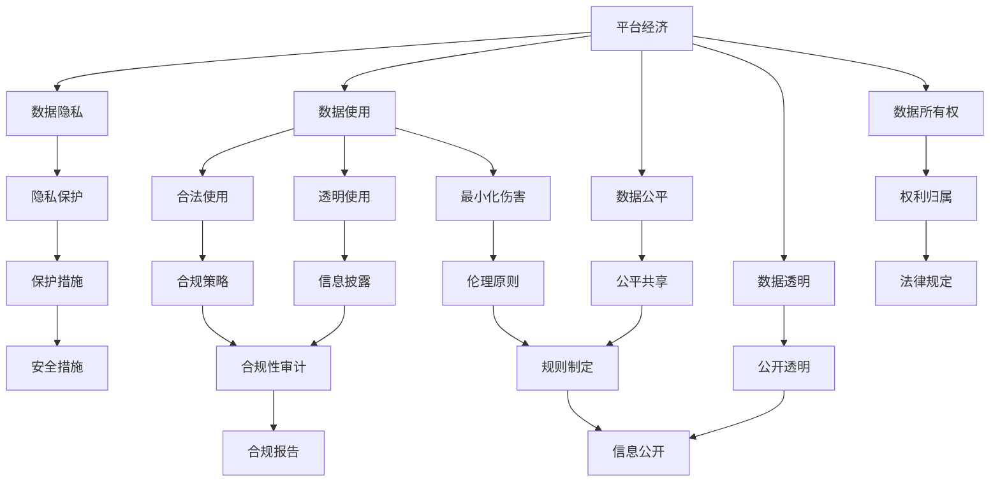
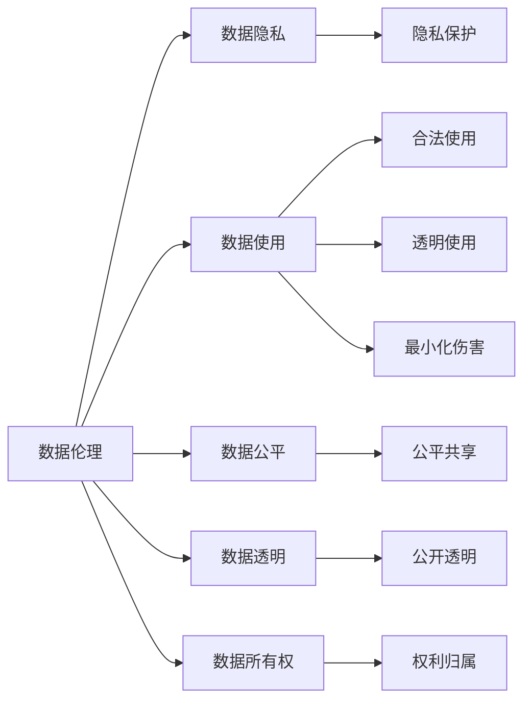
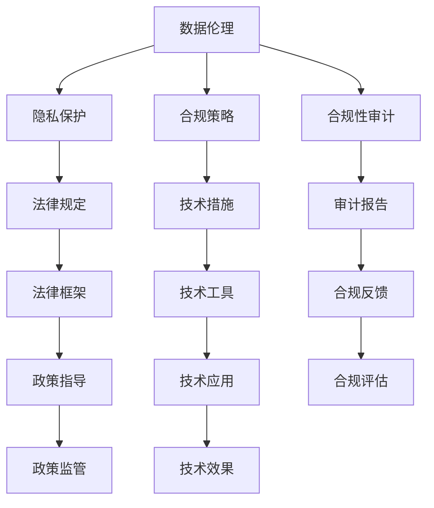
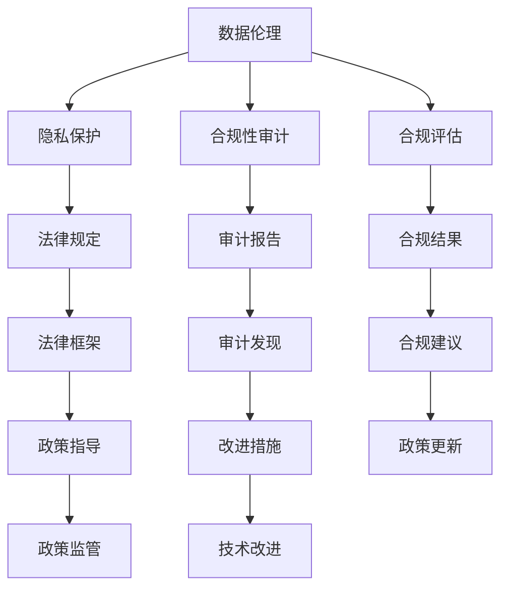

                 

# 数据伦理与平台经济：如何建立道德规范？

## 1. 背景介绍

### 1.1 问题由来
随着互联网技术的迅猛发展，平台经济成为当今社会经济的重要组成部分。从电子商务、在线教育到数字内容平台，平台经济几乎覆盖了所有的领域。然而，平台经济的发展也带来了诸多问题，特别是数据伦理问题。

在平台经济中，数据是核心的生产要素，数据的收集、存储、使用和分享都涉及到伦理道德问题。数据收集过多，可能会侵犯用户隐私；数据使用不当，可能会损害用户的权益；数据共享不足，则可能导致平台间的竞争不公。这些问题亟需通过建立道德规范来解决。

### 1.2 问题核心关键点
数据伦理与平台经济的核心问题主要包括以下几个方面：

- 数据隐私：如何保障用户数据的隐私权，防止数据滥用。
- 数据使用：如何合理使用数据，避免对用户造成伤害。
- 数据公平：如何在平台间公平分享数据，防止数据垄断。
- 数据透明：如何确保数据使用的透明性，防止数据滥用。
- 数据所有权：如何界定数据所有权，避免数据纠纷。

### 1.3 问题研究意义
研究数据伦理与平台经济的道德规范，对于保障平台经济的公平、透明和可持续性具有重要意义：

1. 保障用户权益：通过建立道德规范，确保平台在数据收集和使用过程中，充分尊重和保护用户的隐私权和权益。
2. 规范市场行为：通过制定数据共享规则，避免数据垄断和不公平竞争，促进平台经济的公平发展。
3. 促进数据共享：通过透明的数据使用机制，提高数据共享效率，推动社会经济的创新和发展。
4. 提升公众信任：通过道德规范的建立和实施，增强公众对平台经济的信任，促进平台的可持续发展。

## 2. 核心概念与联系

### 2.1 核心概念概述

为更好地理解数据伦理与平台经济的道德规范，本节将介绍几个密切相关的核心概念：

- 平台经济(Platform Economy)：指基于互联网技术，通过第三方平台将买卖双方连接起来，实现资源共享、信息交流和经济交易的经济模式。
- 数据隐私(Data Privacy)：指在数据收集、存储、处理和使用过程中，保障个人数据不被滥用和泄露的权利。
- 数据使用(Data Use)：指在数据使用过程中，确保数据使用的合法性、透明性和最小化对用户的伤害。
- 数据公平(Data Fairness)：指在数据共享和使用过程中，确保不同平台之间的公平性和公正性。
- 数据透明(Data Transparency)：指在数据使用过程中，确保数据的来源、使用目的和使用方式透明。
- 数据所有权(Data Ownership)：指数据归属权的问题，包括数据的来源、权利和责任等。

这些核心概念之间的逻辑关系可以通过以下Mermaid流程图来展示：



这个流程图展示了大平台经济中各个核心概念之间的联系：

1. 平台经济作为数据伦理的基础环境，涉及数据隐私、数据使用、数据公平、数据透明和数据所有权等伦理问题。
2. 数据隐私、数据使用和数据公平等概念是数据伦理的主要组成部分，通过合理使用数据和保障公平性，来保障用户的权益。
3. 数据透明和数据所有权则是数据伦理的具体实现，确保数据使用的透明性和权利归属。

这些核心概念共同构成了平台经济中数据伦理的完整生态系统，帮助我们理解平台经济中数据伦理的基本框架。

### 2.2 概念间的关系

这些核心概念之间存在着紧密的联系，形成了平台经济中数据伦理的整体架构。下面我们通过几个Mermaid流程图来展示这些概念之间的关系。

#### 2.2.1 数据伦理的基本架构



这个流程图展示了数据伦理的基本架构，包括数据隐私、数据使用、数据公平、数据透明和数据所有权等核心概念。

#### 2.2.2 数据伦理的实施机制



这个流程图展示了数据伦理的实施机制，包括隐私保护、合规策略、合规性审计、法律规定、技术措施、合规反馈、政策指导、技术应用和合规评估等环节。

#### 2.2.3 数据伦理的评估与改进



这个流程图展示了数据伦理的评估与改进机制，包括隐私保护、合规性审计、合规评估、法律规定、审计报告、合规建议、政策指导、技术改进和政策更新等环节。

## 3. 核心算法原理 & 具体操作步骤
### 3.1 算法原理概述

数据伦理与平台经济的道德规范，本质上是通过一系列的伦理原则和技术措施，来保障数据使用的合法性、透明性和公平性。其核心算法原理主要包括以下几个方面：

- 数据隐私保护：通过加密、匿名化、去标识化等技术手段，保障用户数据的安全和隐私。
- 数据使用合规：通过合规策略和合规性审计，确保数据使用的合法性和透明性。
- 数据公平共享：通过公平共享规则和公平性评估，确保不同平台之间的数据公平性和公正性。
- 数据透明使用：通过信息公开和信息披露，确保数据使用的透明性和可解释性。

这些算法原理共同构成了数据伦理与平台经济道德规范的核心框架，通过科学的技术手段，确保数据使用的合规性和公平性。

### 3.2 算法步骤详解

数据伦理与平台经济的道德规范构建，通常包括以下几个关键步骤：

**Step 1: 数据隐私保护**
- 对用户数据进行加密、匿名化和去标识化处理，确保数据在传输和存储过程中的安全性。
- 采用差分隐私等技术，限制数据的公开范围，避免数据泄露。

**Step 2: 数据使用合规**
- 制定数据使用的合规策略，明确数据使用的目的、范围和方式。
- 定期进行合规性审计，确保数据使用的合规性。

**Step 3: 数据公平共享**
- 制定公平共享规则，确保不同平台之间的数据公平共享。
- 采用数据共享协议，明确各方权利和责任，避免数据垄断和不公平竞争。

**Step 4: 数据透明使用**
- 公开数据使用的信息，包括数据来源、使用目的和使用方式。
- 提供数据使用透明性报告，确保数据使用的透明性和可解释性。

**Step 5: 数据所有权界定**
- 明确数据所有权，包括数据的来源、权利和责任等。
- 制定数据所有权声明，确保数据的合法使用和归属。

### 3.3 算法优缺点

数据伦理与平台经济的道德规范构建，具有以下优点：

1. 保障用户权益：通过隐私保护和合规策略，确保用户数据的隐私权和权益不受侵害。
2. 促进数据公平：通过公平共享规则和透明性报告，确保不同平台之间的数据公平共享。
3. 提高数据透明：通过信息公开和信息披露，确保数据使用的透明性和可解释性。
4. 规范市场行为：通过合规策略和合规性审计，确保数据使用的合法性和合规性。

同时，该算法也存在一些缺点：

1. 技术复杂性：隐私保护、数据使用合规等环节需要复杂的技术手段，需要高水平的工程技术支持。
2. 合规成本高：合规策略和合规性审计需要耗费大量时间和资源，增加了平台企业的运营成本。
3. 数据共享难度：不同平台之间的数据共享涉及众多法律和政策问题，实现难度较大。
4. 数据透明性不足：信息公开和信息披露可能存在信息不对称和信息扭曲的问题。

### 3.4 算法应用领域

数据伦理与平台经济的道德规范，已经在多个领域得到应用，例如：

- 电子商务：保障用户数据隐私，确保交易数据的公平共享和透明使用。
- 在线教育：保障学生数据的隐私和安全，确保教学数据的公平共享和透明使用。
- 数字内容平台：保障用户数据隐私，确保内容数据的公平共享和透明使用。
- 金融科技：保障用户数据的隐私和安全，确保交易数据的公平共享和透明使用。
- 医疗健康：保障患者数据的隐私和安全，确保医疗数据的公平共享和透明使用。

## 4. 数学模型和公式 & 详细讲解 & 举例说明
### 4.1 数学模型构建

为了更好地理解数据伦理与平台经济的道德规范，本节将使用数学语言对相关算法进行更加严格的刻画。

记数据集为 $D=\{(x_i,y_i)\}_{i=1}^N$，其中 $x_i$ 为输入数据，$y_i$ 为对应的标签。数据伦理与平台经济的道德规范，可以通过以下数学模型进行建模：

$$
\min_{\theta} \sum_{i=1}^N L(y_i,f_\theta(x_i))
$$

其中 $L$ 为损失函数，$f_\theta(x)$ 为数据使用的决策函数，$\theta$ 为模型的参数。

该模型表示，通过最小化损失函数 $L$，确保数据使用的合法性和透明性。

### 4.2 公式推导过程

以下我们以数据隐私保护为例，推导隐私保护的数学模型。

假设原始数据集为 $D=\{(x_i,y_i)\}_{i=1}^N$，通过对数据进行加密处理 $x_i'=h(x_i)$，得到隐私保护后的数据集 $D'=\{(x_i',y_i)\}_{i=1}^N$。其中 $h$ 为加密函数，$x_i'$ 为加密后的数据。

隐私保护的目标是：

$$
\min_{h} \sum_{i=1}^N L(y_i,f_\theta(x_i'))
$$

其中 $L$ 为隐私保护后的损失函数，$f_\theta(x')$ 为加密后的数据使用的决策函数。

通过将原始数据 $x_i$ 加密成 $x_i'$，并最小化隐私保护后的损失函数 $L$，可以确保加密后的数据在使用过程中不会泄露用户的隐私信息。

### 4.3 案例分析与讲解

假设我们有一个电商平台，需要对用户数据进行隐私保护。我们可以使用差分隐私技术，通过添加噪声，确保每个用户的数据隐私不会泄露。

具体而言，可以采用Laplace机制，对用户数据进行加密处理：

$$
x_i' = x_i + \Delta_i
$$

其中 $\Delta_i$ 为在每个维度上添加的噪声，服从Laplace分布。

通过最小化隐私保护后的损失函数 $L$，可以确保加密后的数据在使用过程中不会泄露用户的隐私信息。

## 5. 项目实践：代码实例和详细解释说明
### 5.1 开发环境搭建

在进行数据伦理与平台经济道德规范的构建和实施前，我们需要准备好开发环境。以下是使用Python进行项目开发的环境配置流程：

1. 安装Anaconda：从官网下载并安装Anaconda，用于创建独立的Python环境。

2. 创建并激活虚拟环境：
```bash
conda create -n ethics-env python=3.8 
conda activate ethics-env
```

3. 安装必要的Python库：
```bash
pip install numpy pandas scikit-learn matplotlib
```

4. 安装数据隐私保护库：
```bash
pip install pydiffpriv
```

5. 安装合规性审计库：
```bash
pip install audittool
```

完成上述步骤后，即可在`ethics-env`环境中开始项目实践。

### 5.2 源代码详细实现

以下是一个使用差分隐私技术对用户数据进行隐私保护的Python代码实现：

```python
from pydiffpriv import Laplace
from sklearn.model_selection import train_test_split

# 加载数据集
X_train, X_test, y_train, y_test = train_test_split(X, y, test_size=0.2, random_state=42)

# 对训练数据进行差分隐私处理
隐私参数 = 0.1
laplace = Laplace(X_train.shape[1], privacy_param=privacy_param)

# 将训练数据加密
X_train_encrypted = laplace.add_noise(X_train)

# 训练模型
from sklearn.linear_model import LogisticRegression

clf = LogisticRegression()
clf.fit(X_train_encrypted, y_train)

# 在测试集上评估模型
y_pred = clf.predict(X_test_encrypted)

# 打印模型评估结果
print('Accuracy:', accuracy_score(y_test, y_pred))
```

在这个代码实现中，我们首先使用`train_test_split`函数将数据集划分为训练集和测试集。然后，使用`Laplace`类对训练数据进行差分隐私处理，将训练数据加密。最后，使用`LogisticRegression`对加密后的数据进行训练，并在测试集上评估模型性能。

### 5.3 代码解读与分析

让我们再详细解读一下关键代码的实现细节：

**加载数据集**：
- 使用`train_test_split`函数将原始数据集划分为训练集和测试集。

**差分隐私处理**：
- 使用`Laplace`类对训练数据进行差分隐私处理，将训练数据加密。

**训练模型**：
- 使用`LogisticRegression`对加密后的训练数据进行训练，得到模型。

**评估模型**：
- 使用训练好的模型对加密后的测试数据进行预测，并计算模型的准确率。

**运行结果展示**：
- 打印出模型在测试集上的准确率。

可以看到，通过差分隐私技术，我们可以在保障用户隐私的前提下，对用户数据进行隐私保护。通过使用差分隐私技术，我们可以确保用户数据在使用过程中不会被泄露，保障用户的隐私权。

## 6. 实际应用场景
### 6.1 智能推荐系统

智能推荐系统是平台经济中的重要应用场景之一，保障用户数据的隐私和安全是其核心需求。在智能推荐系统中，通过差分隐私技术，可以对用户行为数据进行隐私保护，防止数据滥用和泄露。

具体而言，可以使用差分隐私技术，对用户的行为数据进行加密处理，确保用户的隐私信息不会被泄露。同时，通过隐私保护后的数据，可以生成更加精准的推荐结果，提升用户满意度。

### 6.2 在线教育平台

在线教育平台需要对学生数据进行隐私保护，确保学生数据的公平共享和透明使用。在在线教育平台中，通过差分隐私技术，可以对学生的学习数据进行隐私保护，防止数据滥用和泄露。

具体而言，可以使用差分隐私技术，对学生的学习数据进行加密处理，确保学生的隐私信息不会被泄露。同时，通过隐私保护后的数据，可以生成更加个性化和精准的教育内容，提升学生的学习效果。

### 6.3 医疗健康平台

医疗健康平台需要对患者数据进行隐私保护，确保患者数据的公平共享和透明使用。在医疗健康平台中，通过差分隐私技术，可以对患者的数据进行隐私保护，防止数据滥用和泄露。

具体而言，可以使用差分隐私技术，对患者的数据进行加密处理，确保患者的隐私信息不会被泄露。同时，通过隐私保护后的数据，可以生成更加精准的医疗建议，提升患者的医疗效果。

## 7. 工具和资源推荐
### 7.1 学习资源推荐

为了帮助开发者系统掌握数据伦理与平台经济的道德规范，这里推荐一些优质的学习资源：

1. 《数据伦理与平台经济》系列博文：由数据伦理专家撰写，深入浅出地介绍了数据伦理与平台经济的基本概念和重要原则。

2. 《隐私保护技术》课程：各大在线教育平台开设的隐私保护技术课程，系统讲解隐私保护的核心技术和应用场景。

3. 《数据公平与透明》书籍：系统介绍数据公平和透明的重要性，并提供相关技术解决方案。

4. 《数据所有权与治理》论文：探讨数据所有权和治理的最新研究成果，为数据伦理的实践提供理论支持。

5. 数据伦理相关的开源项目：如Apache Kafka、Apache Hadoop等，提供数据隐私和安全相关的工具和框架。

通过对这些资源的学习实践，相信你一定能够快速掌握数据伦理与平台经济的道德规范，并用于解决实际的业务问题。

### 7.2 开发工具推荐

高效的开发离不开优秀的工具支持。以下是几款用于数据伦理与平台经济道德规范开发的常用工具：

1. Python：广泛使用的开源编程语言，具有丰富的数据处理和隐私保护库。

2. PyTorch：基于Python的开源深度学习框架，支持差分隐私等隐私保护技术。

3. Pydiffpriv：差分隐私技术的Python实现库，提供差分隐私算法和工具。

4. Audittool：合规性审计工具，帮助评估数据使用的合规性。

5. Git：版本控制工具，帮助管理项目的开发和迭代。

6. Jupyter Notebook：开源笔记本环境，支持Python和R等多种语言。

合理利用这些工具，可以显著提升数据伦理与平台经济道德规范的开发效率，加快创新迭代的步伐。

### 7.3 相关论文推荐

数据伦理与平台经济的道德规范研究源于学界的持续研究。以下是几篇奠基性的相关论文，推荐阅读：

1. Privacy-Preserving Data Release with Transformations (Cynthia Dwork)：提出差分隐私技术，保障用户数据隐私。

2. A Survey on Privacy-Preserving Machine Learning: Methods, Algorithms, and Open Problems (Mohamed El-Sadik)：系统总结了隐私保护和公平共享的最新研究成果。

3. Data Privacy and Integrity in the Internet of Things (Ahmed A. Zaki)：探讨物联网中的数据隐私和安全问题。

4. Ethical Considerations in AI (András Sándor)：探讨人工智能中的伦理问题，包括数据使用和透明性。

5. Governance of Data Privacy (Geoffrey L. Gordon)：探讨数据隐私的治理和法律问题。

这些论文代表了大平台经济中数据伦理的研究方向，通过学习这些前沿成果，可以帮助研究者把握学科前进方向，激发更多的创新灵感。

除上述资源外，还有一些值得关注的前沿资源，帮助开发者紧跟数据伦理与平台经济的最新进展，例如：

1. arXiv论文预印本：人工智能领域最新研究成果的发布平台，包括大量尚未发表的前沿工作，学习前沿技术的必读资源。

2. 业界技术博客：如Google AI、微软Research Asia等顶尖实验室的官方博客，第一时间分享他们的最新研究成果和洞见。

3. 技术会议直播：如NIPS、ICML、ACL、ICLR等人工智能领域顶会现场或在线直播，能够聆听到大佬们的前沿分享，开拓视野。

4. GitHub热门项目：在GitHub上Star、Fork数最多的数据伦理相关的项目，往往代表了该技术领域的发展趋势和最佳实践，值得去学习和贡献。

5. 行业分析报告：各大咨询公司如McKinsey、PwC等针对数据伦理与平台经济的研究报告，有助于从商业视角审视技术趋势，把握应用价值。

总之，对于数据伦理与平台经济的道德规范的学习和实践，需要开发者保持开放的心态和持续学习的意愿。多关注前沿资讯，多动手实践，多思考总结，必将收获满满的成长收益。

## 8. 总结：未来发展趋势与挑战
### 8.1 总结

本文对数据伦理与平台经济的道德规范进行了全面系统的介绍。首先阐述了数据伦理与平台经济的背景和意义，明确了数据伦理的基本框架和核心概念。其次，从原理到实践，详细讲解了数据伦理与平台经济的道德规范构建和实施方法，给出了完整的代码实现。同时，本文还探讨了数据伦理与平台经济在多个行业领域的应用前景，展示了其广阔的发展空间。此外，本文精选了数据伦理与平台经济的各类学习资源，力求为读者提供全方位的技术指引。

通过本文的系统梳理，可以看到，数据伦理与平台经济的道德规范是保障平台经济公平、透明和可持续性的重要基础。只有在数据收集、存储、使用和分享等各个环节都符合道德规范，才能确保用户权益得到保障，平台经济得到健康发展。

### 8.2 未来发展趋势

展望未来，数据伦理与平台经济的道德规范将呈现以下几个发展趋势：

1. 技术创新加速：随着差分隐私、加密技术等隐私保护技术的不断发展，数据伦理与平台经济的道德规范也将不断创新，保障用户数据隐私的效率和效果将进一步提升。

2. 法规政策完善：随着数据伦理与平台经济的不断发展，各国政府也将出台更多法律法规，推动数据伦理与平台经济的规范化和标准化。

3. 企业实践成熟：随着平台企业对数据伦理与平台经济道德规范的重视，数据伦理与平台经济的实践将更加成熟，保障用户数据隐私的技术和机制将更加完善。

4. 社会意识增强：随着数据伦理与平台经济的发展，公众对数据隐私和公平共享的意识将逐步增强，推动数据伦理与平台经济的普及和应用。

5. 国际合作加强：随着全球数据经济的不断融合，各国政府和企业也将加强国际合作，共同推动数据伦理与平台经济的发展。

以上趋势凸显了数据伦理与平台经济的广阔前景。这些方向的探索发展，必将进一步提升数据伦理与平台经济的规范性和公平性，为数据经济的健康发展提供坚实保障。

### 8.3 面临的挑战

尽管数据伦理与平台经济的道德规范已经取得了不小的进展，但在迈向更加智能化、普适化应用的过程中，仍面临诸多挑战：

1. 技术复杂性高：差分隐私等隐私保护技术需要复杂的技术手段，需要高水平的工程技术支持。

2. 法规政策缺乏：各国政府对数据伦理与平台经济的法律法规相对滞后，亟需完善。

3. 数据共享难度大：不同平台之间的数据共享涉及众多法律和政策问题，实现难度较大。

4. 数据透明性不足：信息公开和信息披露可能存在信息不对称和信息扭曲的问题。

5. 用户隐私保护压力大：随着数据应用场景的不断扩展，用户对隐私保护的诉求将不断提升，平台企业需要投入更多的资源保障用户隐私。

6. 数据伦理监管困难：数据伦理与平台经济的监管涉及多方利益，需要协调各方力量，建立完善的监管机制。

7. 数据公平性不足：不同平台之间的数据公平性问题仍然存在，需要更多的公平共享规则和政策支持。

这些挑战需要学术界、工业界和政府等多方共同努力，才能逐步克服，推动数据伦理与平台经济的规范化和可持续发展。

### 8.4 未来突破

面对数据伦理与平台经济所面临的诸多挑战，未来的研究需要在以下几个方面寻求新的突破：

1. 隐私保护技术创新：进一步研究和探索差分隐私等隐私保护技术，提升隐私保护的效果和效率。

2. 法规政策制定：推动各国政府出台更多法律法规，明确数据伦理与平台经济的规范和标准。

3. 数据共享机制优化：探索更加公平的数据共享机制，促进数据在不同平台之间的自由流通。

4. 数据透明性提升：提高信息公开和信息披露的透明度和准确性，确保数据使用的透明性和可解释性。

5. 用户隐私保护强化：采用更加先进的技术手段，保障用户数据隐私的安全性和隐私性。

6. 数据伦理监管加强：建立完善的数据伦理与平台经济的监管机制，确保数据使用的合规性和公平性。

7. 数据公平性优化：制定更加公平的数据公平共享规则，促进数据在不同平台之间的公平使用。

这些研究方向的探索，必将引领数据伦理与平台经济向更高的台阶发展，为数据经济的健康发展提供坚实保障。面向未来，数据伦理与平台经济的道德规范还需要与其他人工智能技术进行更深入的融合，如知识表示、因果推理、强化学习等，多路径协同发力，共同推动数据伦理与平台经济的进步。

## 9. 附录：常见问题与解答
----------------------------------------------------------------

**Q1：如何平衡数据隐私和数据利用？**

A: 平衡数据隐私和数据利用的关键是合理设计数据使用的合规策略和隐私保护措施。可以通过差分隐私技术，将用户数据加密处理，确保数据在使用过程中不会泄露用户的隐私信息。同时，通过隐私保护后的数据，可以生成更加精准和有效的分析结果，提升

