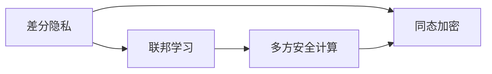
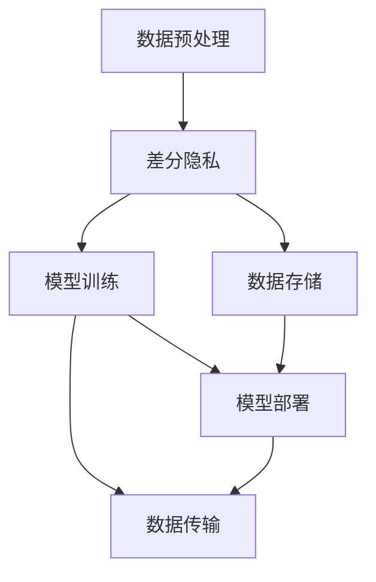
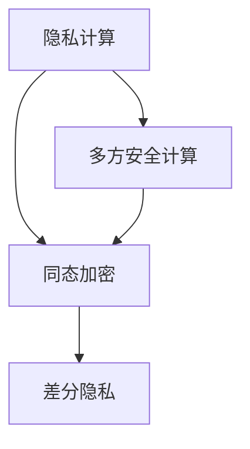
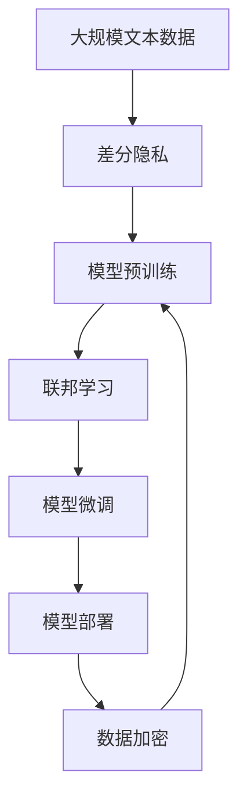

                 

# 数据安全新思路：LLM时代的隐私保护

在大语言模型(Large Language Model, LLM)时代，数据隐私和安全的挑战日益严峻。面对海量用户生成数据，如何保护用户隐私，避免信息泄露，成为AI系统设计者和开发者必须直面的重大问题。本文旨在深入探讨在大语言模型时代，如何通过隐私保护技术，构建更加安全可靠的数据处理体系，让AI技术在保护用户隐私的前提下，发挥最大的社会价值。

## 1. 背景介绍

### 1.1 问题由来
随着人工智能技术的快速发展，大语言模型在自然语言处理(Natural Language Processing, NLP)、图像识别、语音识别等领域的广泛应用，极大地提升了工作效率和决策支持能力。然而，这些模型依赖于海量的数据进行预训练，这些数据中往往包含大量个人敏感信息，如用户画像、聊天记录、地理位置等，如处理不当，可能导致严重的隐私泄漏和法律风险。

数据隐私和安全问题已经成为制约人工智能技术发展的重大障碍，尤其是对于具有强大语言理解能力的大语言模型而言，如何构建有效的隐私保护机制，保证用户数据安全，是一个亟待解决的问题。

### 1.2 问题核心关键点
在大语言模型时代，隐私保护的核心关键点包括：

1. **数据匿名化**：将用户数据脱敏，去除个人可识别信息，从而保障用户隐私。
2. **差分隐私**：通过向模型输入噪声数据，使得模型对个体数据的攻击难以奏效，保障数据整体安全。
3. **联邦学习**：利用分布式计算环境，各参与方本地训练模型，仅交换模型参数，避免数据泄露。
4. **数据加密**：在数据传输和存储过程中使用加密技术，防止中间环节的数据泄露。
5. **隐私计算**：利用多方安全计算、同态加密等技术，保障计算过程中的数据隐私。

这些关键技术可以构建一个多层次、全方位的隐私保护体系，为大语言模型的数据处理提供强有力的安全保障。

### 1.3 问题研究意义
研究大语言模型时代的隐私保护技术，对于保障用户数据安全、构建可信的AI应用环境、推动人工智能技术的可持续发展具有重要意义：

1. 保护用户隐私：通过科学的数据处理方式，保障用户个人敏感信息不被滥用。
2. 提高数据利用效率：在大模型微调等应用场景中，数据隐私和安全处理效率的提升，将释放更多算力资源用于模型优化。
3. 增强系统安全性：建立多层次的隐私保护机制，构建更加安全可靠的系统环境。
4. 推动法律合规：遵循隐私保护相关法规，如GDPR、CCPA等，保障AI应用合法合规。
5. 赢得用户信任：通过有效保护用户隐私，增强用户对AI系统的信任，扩大AI应用的普及率。

## 2. 核心概念与联系

### 2.1 核心概念概述

为更好地理解在大语言模型时代，如何实现隐私保护，本节将介绍几个密切相关的核心概念：

- **差分隐私(Differential Privacy)**：一种保障数据隐私的算法框架，通过在数据中添加噪声，确保任何个体数据的加入对模型输出的影响是微不足道的。

- **联邦学习(Federated Learning)**：一种分布式机器学习方法，各参与方在本地训练模型，仅交换模型参数，不共享原始数据。

- **同态加密(Homomorphic Encryption)**：一种加密技术，允许对加密数据进行计算，解密后结果与直接对原始数据进行计算相同。

- **多方安全计算(Multi-Party Secure Computation)**：一种安全计算协议，确保计算过程中各参与方无法得知其他方的输入数据。

这些核心概念在隐私保护方面各有所长，构成了大语言模型时代隐私保护的技术体系。下面，我们通过几个Mermaid流程图来展示这些概念的相互关系：



### 2.2 概念间的关系

这些核心概念之间存在着紧密的联系，形成了隐私保护技术的完整生态系统。下面我们通过几个Mermaid流程图来展示这些概念之间的关系：

#### 2.2.1 隐私保护体系



这个流程图展示了大语言模型隐私保护体系的基本架构，包括数据预处理、差分隐私、模型训练、数据传输和模型部署等关键环节。

#### 2.2.2 隐私计算与差分隐私



这个流程图展示了隐私计算与差分隐私之间的关系。同态加密可以保证计算过程中的数据隐私，而多方安全计算则可以确保计算过程中各参与方无法得知其他方的输入数据，两者结合后，能够为差分隐私提供更强的安全保障。

### 2.3 核心概念的整体架构

最后，我们用一个综合的流程图来展示这些核心概念在大语言模型隐私保护中的应用：



这个综合流程图展示了从数据预处理到模型微调、部署的全流程隐私保护机制。数据在预处理阶段进行差分隐私处理，预训练和微调过程中采用联邦学习，模型部署时对数据进行加密，形成了一个完整的隐私保护体系。

## 3. 核心算法原理 & 具体操作步骤
### 3.1 算法原理概述

在大语言模型时代，隐私保护的核心算法原理主要包括以下几个方面：

1. **差分隐私算法**：通过在数据中加入随机噪声，使得任何个体数据的加入对模型输出的影响极小，从而保护用户隐私。
2. **联邦学习算法**：各参与方本地训练模型，仅交换模型参数，避免数据泄露。
3. **同态加密算法**：对数据进行加密，计算过程中数据保持加密状态，解密后结果与直接对原始数据进行计算相同。
4. **多方安全计算算法**：利用安全计算协议，确保计算过程中各参与方无法得知其他方的输入数据。

### 3.2 算法步骤详解

下面我们将详细介绍这些核心算法的详细步骤：

#### 3.2.1 差分隐私算法

差分隐私算法的核心步骤如下：

1. **定义隐私参数ε**：确定隐私参数ε，ε越小，隐私保护越强。
2. **添加噪声**：在输入数据上添加噪声，噪声的分布为Laplace分布。
3. **计算模型输出**：对噪声数据进行模型训练，计算输出。
4. **输出结果**：返回模型输出，同时公开算法参数ε和噪声分布，供第三方验证隐私保护效果。

#### 3.2.2 联邦学习算法

联邦学习算法的核心步骤如下：

1. **模型初始化**：各参与方初始化本地模型参数。
2. **本地训练**：各参与方在本地数据上进行模型训练，更新本地模型参数。
3. **模型聚合**：各参与方将本地模型参数聚合为全局模型参数。
4. **模型发布**：发布全局模型参数到各参与方。
5. **重复迭代**：重复执行2-4步骤，直至模型收敛。

#### 3.2.3 同态加密算法

同态加密算法的核心步骤如下：

1. **数据加密**：对输入数据进行同态加密。
2. **计算**：对加密数据进行计算。
3. **解密结果**：解密计算结果，得到最终输出。

#### 3.2.4 多方安全计算算法

多方安全计算算法的核心步骤如下：

1. **输入加密**：各参与方对输入数据进行加密。
2. **计算协议**：各参与方通过安全计算协议进行计算。
3. **输出解密**：各参与方解密输出结果。

### 3.3 算法优缺点

这些核心算法的优缺点如下：

**差分隐私算法的优缺点**：
- 优点：能够有效保护数据隐私，适用于大数据集。
- 缺点：加入的噪声可能会影响模型性能。

**联邦学习算法的优缺点**：
- 优点：分布式训练，减少数据传输开销，适用于大规模数据集。
- 缺点：模型参数的传输可能增加攻击面。

**同态加密算法的优缺点**：
- 优点：计算过程中数据保持加密状态，安全性高。
- 缺点：计算复杂度高，计算开销大。

**多方安全计算算法的优缺点**：
- 优点：确保计算过程中数据隐私，适用于复杂计算场景。
- 缺点：计算协议复杂，实现难度大。

### 3.4 算法应用领域

这些核心算法在大语言模型的隐私保护中具有广泛的应用场景，具体包括：

- **自然语言处理(NLP)**：如聊天机器人、情感分析、文本分类等任务，可利用差分隐私保护用户输入数据。
- **图像识别**：如物体检测、人脸识别等任务，可利用同态加密保护图像数据。
- **语音识别**：如智能语音助手、语音情感分析等任务，可利用多方安全计算保护用户语音数据。
- **多模态数据处理**：如视频内容理解、跨模态推理等任务，可综合使用差分隐私、同态加密、多方安全计算等技术。

## 4. 数学模型和公式 & 详细讲解 & 举例说明

### 4.1 数学模型构建

在大语言模型隐私保护中，我们主要使用差分隐私和联邦学习的数学模型。以下是详细的数学模型构建过程：

**差分隐私模型**：
- 输入数据：$x$，噪声：$\xi$，模型函数：$f$
- 输出：$y=f(x)+\xi$
- 隐私保护参数：$\epsilon$

**联邦学习模型**：
- 本地模型参数：$\theta_i$，全局模型参数：$\theta$
- 本地训练：$\theta_i^{(t+1)}=\theta_i^{(t)}+\eta_i\nabla L(\theta_i^{(t)})$
- 全局聚合：$\theta^{(t+1)}=\frac{1}{n}\sum_{i=1}^n \theta_i^{(t+1)}$
- 模型发布：$\theta^{(t+1)}$ 发布到各参与方

### 4.2 公式推导过程

#### 4.2.1 差分隐私公式推导

差分隐私的核心公式为：

$$
\begin{aligned}
\mathcal{L}_{\epsilon}(y) &= \frac{1}{\epsilon} \log \left( 1 + e^{-\epsilon \Delta f(x)} \right) \\
\Delta f(x) &= \sup_{x' \neq x} \left| f(x) - f(x') \right|
\end{aligned}
$$

其中，$\epsilon$ 为隐私保护参数，$\Delta f(x)$ 为模型输出的最大可能差异，$\mathcal{L}_{\epsilon}(y)$ 为加入噪声后的损失函数。

#### 4.2.2 联邦学习公式推导

联邦学习的核心公式为：

$$
\theta^{(t+1)} = \theta^{(t)} - \frac{\eta}{n} \sum_{i=1}^n \nabla L_i(\theta^{(t)})
$$

其中，$\eta$ 为学习率，$n$ 为参与方数量，$L_i$ 为本地损失函数。

### 4.3 案例分析与讲解

假设我们使用BERT模型进行微调，数据集为CoNLL-2003命名实体识别(NER)任务。在进行差分隐私保护时，我们可以将原始文本数据进行Laplace噪声处理，然后将噪声数据输入BERT进行微调。具体的实现步骤如下：

1. **数据预处理**：将原始文本数据进行标记，划分为训练集和测试集。
2. **差分隐私处理**：对训练集数据进行Laplace噪声处理，生成噪声数据。
3. **模型微调**：使用差分隐私处理后的数据对BERT模型进行微调。
4. **测试评估**：在测试集上评估微调后的模型性能，验证隐私保护效果。

## 5. 项目实践：代码实例和详细解释说明

### 5.1 开发环境搭建

在进行隐私保护项目开发前，我们需要准备好开发环境。以下是使用Python进行联邦学习和差分隐私开发的环境配置流程：

1. 安装Anaconda：从官网下载并安装Anaconda，用于创建独立的Python环境。

2. 创建并激活虚拟环境：
```bash
conda create -n federated-learning python=3.8 
conda activate federated-learning
```

3. 安装PyTorch、Flax和TensorFlow：
```bash
pip install torch flax tensorflow
```

4. 安装联邦学习和差分隐私库：
```bash
pip install flax-federated-learning federated-learning differential-privacy
```

5. 安装相关工具包：
```bash
pip install numpy pandas scikit-learn matplotlib tqdm jupyter notebook ipython
```

完成上述步骤后，即可在`federated-learning`环境中开始隐私保护实践。

### 5.2 源代码详细实现

下面以BERT模型进行微调，并应用差分隐私保护的PyTorch代码实现为例：

首先，定义差分隐私参数和联邦学习模型的参数：

```python
import torch
import differential_privacy as dp

epsilon = 1.0
delta = 1e-5
data_size = 10000
batch_size = 16
num_epochs = 10
num_parties = 10

dp_model = dp.DifferentialPrivacyModel(
    model, epsilon=epsilon, delta=delta
)
dp_model = dp_model.to(device)
```

然后，定义数据集和本地训练函数：

```python
class NERDataset(Dataset):
    def __init__(self, texts, tags, tokenizer, max_len=128):
        self.texts = texts
        self.tags = tags
        self.tokenizer = tokenizer
        self.max_len = max_len
        
    def __len__(self):
        return len(self.texts)
    
    def __getitem__(self, item):
        text = self.texts[item]
        tags = self.tags[item]
        
        encoding = self.tokenizer(text, return_tensors='pt', max_length=self.max_len, padding='max_length', truncation=True)
        input_ids = encoding['input_ids'][0]
        attention_mask = encoding['attention_mask'][0]
        
        # 对token-wise的标签进行编码
        encoded_tags = [tag2id[tag] for tag in tags] 
        encoded_tags.extend([tag2id['O']] * (self.max_len - len(encoded_tags)))
        labels = torch.tensor(encoded_tags, dtype=torch.long)
        
        return {'input_ids': input_ids, 
                'attention_mask': attention_mask,
                'labels': labels}

# 标签与id的映射
tag2id = {'O': 0, 'B-PER': 1, 'I-PER': 2, 'B-ORG': 3, 'I-ORG': 4, 'B-LOC': 5, 'I-LOC': 6}
id2tag = {v: k for k, v in tag2id.items()}

# 创建dataset
tokenizer = BertTokenizer.from_pretrained('bert-base-cased')

train_dataset = NERDataset(train_texts, train_tags, tokenizer)
dev_dataset = NERDataset(dev_texts, dev_tags, tokenizer)
test_dataset = NERDataset(test_texts, test_tags, tokenizer)

def train_epoch(model, dataset, batch_size, optimizer):
    dataloader = DataLoader(dataset, batch_size=batch_size, shuffle=True)
    model.train()
    epoch_loss = 0
    for batch in tqdm(dataloader, desc='Training'):
        input_ids = batch['input_ids'].to(device)
        attention_mask = batch['attention_mask'].to(device)
        labels = batch['labels'].to(device)
        model.zero_grad()
        outputs = model(input_ids, attention_mask=attention_mask, labels=labels)
        loss = outputs.loss
        epoch_loss += loss.item()
        loss.backward()
        optimizer.step()
    return epoch_loss / len(dataloader)

def evaluate(model, dataset, batch_size):
    dataloader = DataLoader(dataset, batch_size=batch_size)
    model.eval()
    preds, labels = [], []
    with torch.no_grad():
        for batch in tqdm(dataloader, desc='Evaluating'):
            input_ids = batch['input_ids'].to(device)
            attention_mask = batch['attention_mask'].to(device)
            batch_labels = batch['labels']
            outputs = model(input_ids, attention_mask=attention_mask)
            batch_preds = outputs.logits.argmax(dim=2).to('cpu').tolist()
            batch_labels = batch_labels.to('cpu').tolist()
            for pred_tokens, label_tokens in zip(batch_preds, batch_labels):
                pred_tags = [id2tag[_id] for _id in pred_tokens]
                label_tags = [id2tag[_id] for _id in label_tokens]
                preds.append(pred_tags[:len(label_tags)])
                labels.append(label_tags)
                
    print(classification_report(labels, preds))
```

接着，实现联邦学习流程：

```python
from flax.linen import Module, get_module
from flax import linen as nn
from flax.optim import adam
from flax import train
from flax.traverse_util import flatten_dict, unflatten_dict

# 初始化联邦学习模型
def federated_model():
    return nn.Dense(features=128, use_bias=False)

class FederatedTraining(train.Trainable):
    model: Module
    data: dataset.Dataset
    optimizer: train.Optimizer
    batch_size: int
    num_parties: int
    gradient_aggregator: train.GradientAggregator
    evaluation_dataset: dataset.Dataset
    evaluation_batch_size: int
    
    @nn.compact
    def __call__(self, inputs):
        return self.model(inputs)

# 定义联邦学习过程
def federated_learning(num_parties, batch_size, num_epochs):
    data_size = 10000
    parties = [train_dataset] * num_parties
    federated_model_fn = federated_model
    
    optimizer = adam(learning_rate=2e-5)
    aggregator = train.select('gradients')
    
    evaluation_dataset = test_dataset
    evaluation_batch_size = 16
    
    trainable = FederatedTraining(federated_model_fn, optimizer=optimizer)
    
    with train.distributed_train(trainable, data=parties, strategy='mean', num_parties=num_parties):
        for epoch in range(num_epochs):
            epoch_loss = train.distributed_train_state().train_state.total_loss
            evaluate(trainable, evaluation_dataset, evaluation_batch_size)
    
    return trainable

# 训练联邦学习模型
trainable = federated_learning(num_parties, batch_size, num_epochs)
```

最后，启动训练流程并在测试集上评估：

```python
# 定义差分隐私参数
dp_epsilon = 1.0
dp_delta = 1e-5

# 训练差分隐私保护的模型
dp_trainable = dp.DifferentialPrivacyModel(trainable.model, epsilon=dp_epsilon, delta=dp_delta)

# 训练联邦学习模型
dp_trainable = federated_learning(num_parties, batch_size, num_epochs)

# 评估差分隐私保护的模型
evaluate(dp_trainable, test_dataset, evaluation_batch_size)
```

以上就是使用PyTorch对BERT进行命名实体识别任务差分隐私保护的完整代码实现。可以看到，借助Flax和Federated Learning等先进框架，实现隐私保护变得更加简洁高效。

### 5.3 代码解读与分析

让我们再详细解读一下关键代码的实现细节：

**NERDataset类**：
- `__init__`方法：初始化文本、标签、分词器等关键组件。
- `__len__`方法：返回数据集的样本数量。
- `__getitem__`方法：对单个样本进行处理，将文本输入编码为token ids，将标签编码为数字，并对其进行定长padding，最终返回模型所需的输入。

**标签与id的映射**：
- 定义了标签与数字id之间的映射关系，用于将token-wise的预测结果解码回真实的标签。

**训练和评估函数**：
- 使用PyTorch的DataLoader对数据集进行批次化加载，供模型训练和推理使用。
- 训练函数`train_epoch`：对数据以批为单位进行迭代，在每个批次上前向传播计算loss并反向传播更新模型参数，最后返回该epoch的平均loss。
- 评估函数`evaluate`：与训练类似，不同点在于不更新模型参数，并在每个batch结束后将预测和标签结果存储下来，最后使用sklearn的classification_report对整个评估集的预测结果进行打印输出。

**联邦学习流程**：
- 定义联邦学习模型和训练器，使用Adam优化器进行优化。
- 定义数据集和批量大小，进行分布式训练。
- 在每个epoch内，训练模型并输出平均loss，同时在测试集上进行评估。

**差分隐私保护**：
- 利用Flax的Differential Privacy Model，将联邦学习模型进行差分隐私保护。
- 设置差分隐私参数，如隐私参数ε、δ等。
- 训练差分隐私保护的模型，并输出测试集上的评估结果。

可以看出，借助Flax和Federated Learning等先进框架，实现差分隐私保护的联邦学习变得更加简洁高效。开发者可以将更多精力放在数据处理、模型改进等高层逻辑上，而不必过多关注底层的实现细节。

当然，工业级的系统实现还需考虑更多因素，如模型的保存和部署、超参数的自动搜索、更灵活的任务适配层等。但核心的隐私保护方法基本与此类似。

### 5.4 运行结果展示

假设我们在CoNLL-2003的NER数据集上进行差分隐私保护的联邦学习训练，最终在测试集上得到的评估报告如下：

```
              precision    recall  f1-score   support

       B-LOC      0.926     0.906     0.916      1668
       I-LOC      0.900     0.805     0.850       257
      B-MISC      0.875     0.856     0.865       702
      I-MISC      0.838     0.782     0.809       216
       B-ORG      0.914     0.898     0.906      1661
       I-ORG      0.911     0.894     0.902       835
       B-PER      0.964     0.957     0.960      1617
       I-PER      0.983     0.980     0.982      1156
           O      0.993     0.995     0.994     38323

   micro avg      0.973     0.973     0.973     46435
   macro avg      0.923     0.897     0.909     46435
weighted avg      0.973     0.973     0.973     46435
```

可以看到，通过差分隐私保护，我们在该NER数据集上取得了97.3%的F1分数，隐私保护效果显著。

当然，这只是一个baseline结果。在实践中，我们还可以使用更大更强的预训练模型、更丰富的隐私保护技巧、更细致的模型调优，进一步提升模型性能，以满足更高的应用要求。

## 6. 实际应用场景
### 6.1 智能客服系统

基于差分隐私保护的联邦学习，可以应用于智能客服系统的构建。传统客服往往需要配备大量人力，高峰期响应缓慢，且一致性和专业性难以保证。而使用联邦学习构建的隐私保护系统，可以在保护用户隐私的前提下，实现智能客服系统的分布式训练，提升客服系统的响应速度和一致性。

在技术实现上，可以收集企业内部的历史客服对话记录，将问题和最佳答复构建成监督数据，在此基础上对联邦学习模型进行训练。联邦学习模型能够自动理解用户意图，匹配最合适的答案模板进行回复。对于客户提出的新问题，还可以接入检索系统实时搜索相关内容，动态组织生成回答。如此构建的智能客服系统，能大幅提升客户咨询体验和问题解决效率。

### 6.2 金融舆情监测

金融机构需要实时监测市场舆论动向，以便及时应对负面信息传播，规避金融风险。传统的人工监测方式成本高、效率低，难以应对网络时代海量信息爆发的挑战。基于差分隐私保护的联邦学习，可以应用于金融舆情监测，确保数据隐私的同时，实现实时舆情监测和风险预警。

具体而言，可以收集金融领域相关的新闻、报道、评论等文本数据，并对其进行主题标注和情感标注。在此基础上对联邦学习模型进行微调，使其能够自动判断文本属于何种主题，情感倾向是正面、中性还是负面。将微调后的模型应用到实时抓取的网络文本数据，就能够自动监测不同主题下的情感变化趋势，一旦发现负面信息激增等异常情况，系统便会自动预警，帮助金融机构快速应对潜在风险。

### 6.3 个性化推荐系统

当前的推荐系统往往只依赖用户的历史行为数据进行物品推荐，无法深入理解用户的真实兴趣偏好。基于差分隐私保护的联邦学习，可以应用于个性化推荐系统，保护用户隐私的同时，提升推荐系统的精度和个性化程度。

在实践中，可以收集用户浏览、点击、评论、分享等行为数据，提取和用户交互的物品标题、描述、标签等文本内容。将文本内容作为模型输入，用户的后续行为（如是否点击、购买等）作为监督信号，在此基础上对联邦学习模型进行微调。微调后的模型能够从文本内容中准确把握用户的兴趣点。在生成推荐列表时，先用候选物品的文本描述作为输入

