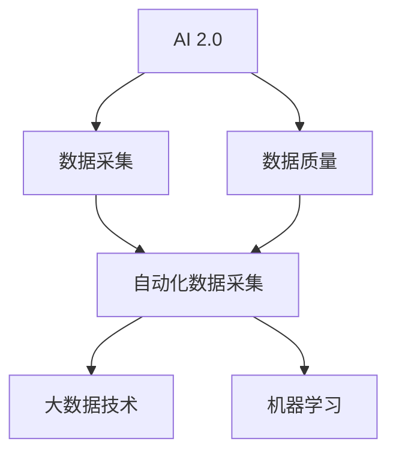
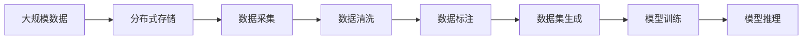
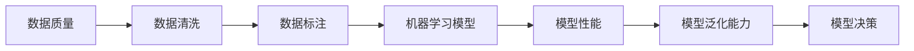
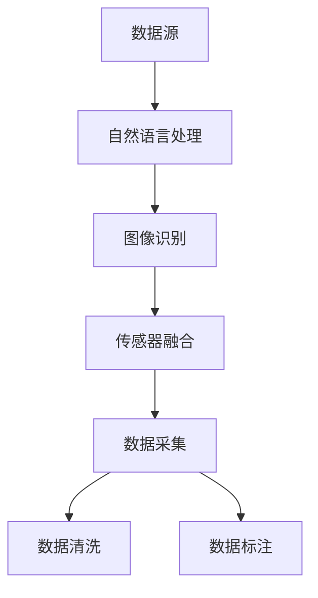
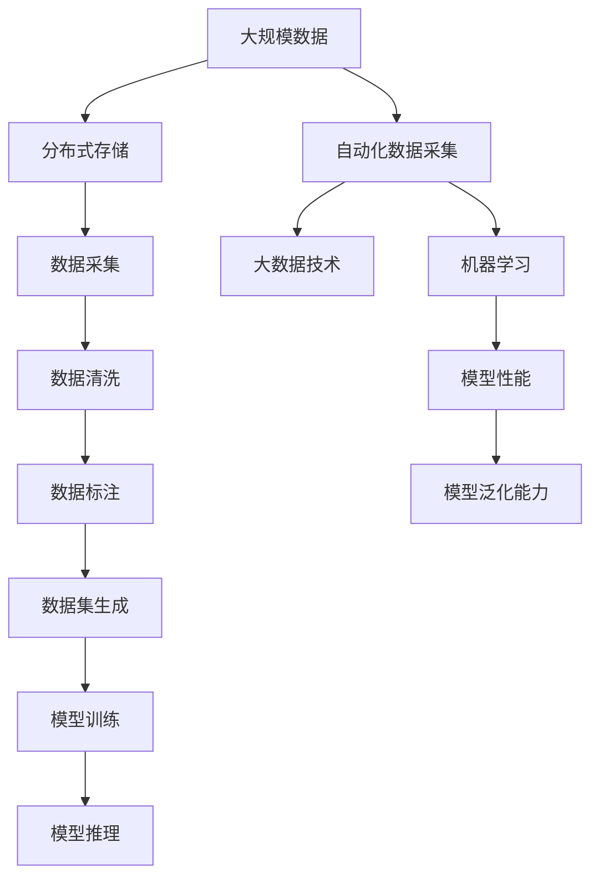

                 

# 数据采集技术：提高 AI 2.0 数据质量

> 关键词：数据采集, AI 2.0, 数据质量, 自动化, 大数据, 机器学习

## 1. 背景介绍

### 1.1 问题由来
在AI 2.0时代，随着深度学习技术的发展，数据成为构建高性能AI系统的关键。然而，现有的数据采集方法往往存在数据质量不高、数据获取困难、数据标注成本高等问题，制约了AI技术的应用。特别是在医疗、金融等需要高精度数据的任务中，数据采集的挑战尤为显著。

### 1.2 问题核心关键点
数据采集的核心问题在于如何在保证数据质量的同时，降低成本和提高效率。目前，常见的数据采集方法包括手动标注、爬虫抓取、API接口获取等，但这些方法各有局限。为了解决这个问题，本文将探讨基于AI 2.0技术的数据采集技术，通过自动化、高效、高精度的数据采集，提升数据质量，为AI系统构建打下坚实基础。

### 1.3 问题研究意义
提升数据采集质量对AI系统性能的提升具有重要意义：

1. **减少偏差**：高质量的数据可以降低AI模型的偏差，提高其泛化能力。
2. **提升精度**：通过自动化采集和标注，可以显著降低人工误差，提高模型的精度。
3. **降低成本**：自动化数据采集可以大幅降低人力成本和标注成本。
4. **加速模型迭代**：高质量的数据可以加速模型的迭代优化，提升AI系统的应用速度。
5. **促进产业升级**：高质量数据可以推动AI技术在更多行业的应用，促进产业数字化升级。

## 2. 核心概念与联系

### 2.1 核心概念概述

为更好地理解基于AI 2.0的数据采集方法，本节将介绍几个密切相关的核心概念：

- **AI 2.0**：AI 2.0是继AI 1.0（基于规则的专家系统）和AI 1.5（基于统计的学习系统）之后的第三代AI，通过大规模数据和深度学习技术，构建自适应、自我学习、智能决策的AI系统。

- **数据采集**：指从各种数据源获取原始数据，并进行预处理、清洗、标注等操作，转化为可用于训练、推理的数据集。数据采集是AI系统构建的基础。

- **数据质量**：指数据的准确性、完整性、一致性、及时性和可靠性等指标，是数据采集的最终目标。

- **自动化数据采集**：通过AI技术，如自然语言处理、图像识别、传感器融合等，实现数据自动抓取、标注和清洗的过程。

- **大数据技术**：指处理、分析大规模数据的技术和工具，如分布式存储、流处理、分布式计算等，是数据采集和分析的基础。

- **机器学习**：通过数据训练构建的模型，用于预测、分类、聚类等任务，是数据采集和标注的核心技术。

这些核心概念之间的逻辑关系可以通过以下Mermaid流程图来展示：



这个流程图展示了大数据、自动化数据采集、机器学习与数据质量之间的关系：

1. 人工智能技术的发展推动了数据采集技术的进步。
2. 数据采集技术的提升直接影响了数据质量。
3. 大数据技术为自动化数据采集提供了强大的技术支撑。
4. 机器学习技术是数据采集和标注的核心。

这些概念共同构成了AI 2.0数据采集的技术框架，使其能够在各种场景下高效、高质地获取所需数据。

### 2.2 概念间的关系

这些核心概念之间存在着紧密的联系，形成了AI 2.0数据采集的完整生态系统。下面我们通过几个Mermaid流程图来展示这些概念之间的关系。

#### 2.2.1 AI 2.0的数据采集流程



这个流程图展示了AI 2.0数据采集的基本流程：从大规模数据存储到最终生成可用的模型训练数据集。

#### 2.2.2 数据质量与机器学习的关系



这个流程图展示了数据质量对机器学习模型的影响，通过数据清洗和标注，可以提高模型性能和泛化能力。

#### 2.2.3 自动化数据采集技术



这个流程图展示了自动化数据采集技术的应用场景，包括自然语言处理、图像识别和传感器融合等。

### 2.3 核心概念的整体架构

最后，我们用一个综合的流程图来展示这些核心概念在大数据采集过程中的整体架构：



这个综合流程图展示了从数据源到模型推理的全流程，以及自动化数据采集、大数据技术、机器学习等关键技术在其中的应用。通过这些流程图，我们可以更清晰地理解AI 2.0数据采集过程中各个组件的相互作用和关系。

## 3. 核心算法原理 & 具体操作步骤
### 3.1 算法原理概述

基于AI 2.0的数据采集方法，本质上是一个自动化的数据标注和清洗过程。其核心思想是：利用深度学习技术和自动化算法，从大规模数据源中自动提取、标注和清洗数据，生成高质量的数据集，供AI模型训练和推理使用。

形式化地，假设数据源为 $\mathcal{D}$，包含多条数据记录，每条记录由特征向量 $x \in \mathbb{R}^n$ 和标签 $y \in \{0, 1\}$ 组成。数据采集的目标是构建标注数据集 $\mathcal{D}^*$，使得每个数据点 $(x_i^*, y_i^*)$ 在 $\mathcal{D}$ 中能找到最接近的匹配项。

基于AI 2.0的数据采集过程包括以下几个关键步骤：

1. 数据预处理：对原始数据进行清洗、去噪、格式转换等操作，生成可用于后续处理的干净数据。
2. 特征提取：利用深度学习模型提取数据的特征表示，以便后续的标注和清洗。
3. 数据标注：通过深度学习模型预测数据的标签，并进行标注。
4. 数据清洗：对标注数据进行去重、修复、过滤等操作，确保数据的质量和一致性。
5. 数据集生成：将清洗后的标注数据集转化为可用于训练和推理的格式。

### 3.2 算法步骤详解

以下是基于AI 2.0的数据采集步骤的详细介绍：

**Step 1: 数据预处理**

1. **数据清洗**：去除噪声、缺失值、重复数据等，确保数据的完整性和一致性。
2. **数据标准化**：将数据转化为统一的格式，如统一日期格式、统一单位等。
3. **数据归一化**：对数据进行归一化处理，使其在相同的范围内，便于模型处理。

**Step 2: 特征提取**

1. **特征选择**：选择对模型有用的特征，去除无关或冗余的特征。
2. **特征提取**：利用深度学习模型（如卷积神经网络、循环神经网络等）提取数据的特征表示。

**Step 3: 数据标注**

1. **标注模型选择**：选择适合的标注模型，如基于监督学习的分类模型、基于无监督学习的聚类模型等。
2. **模型训练**：利用标注数据训练标注模型，使其能够预测数据的标签。
3. **模型评估**：使用验证集对标注模型的性能进行评估，调整模型参数以提高标注精度。

**Step 4: 数据清洗**

1. **去重**：去除重复数据，确保数据唯一性。
2. **修复**：修复数据中的错误和异常，确保数据准确性。
3. **过滤**：根据特定条件过滤数据，如时间范围、地理位置等。

**Step 5: 数据集生成**

1. **数据集划分**：将清洗后的数据集划分为训练集、验证集和测试集。
2. **数据集生成**：将标注数据集转化为可用于训练和推理的格式，如TensorFlow的tf.data.Dataset。

### 3.3 算法优缺点

基于AI 2.0的数据采集方法具有以下优点：

1. **高效性**：自动化数据采集大大降低了人工标注的时间和成本，提高了数据采集的效率。
2. **高精度**：通过深度学习技术进行标注和清洗，可以显著提高数据的准确性和一致性。
3. **适应性强**：可以处理各种数据类型和来源，如文本、图像、传感器数据等，具有较强的适应性。

同时，该方法也存在一些缺点：

1. **依赖数据源**：依赖于可靠的数据源，数据质量取决于数据源的可靠性。
2. **数据偏见**：数据标注模型可能会引入数据源的偏见，影响数据的质量。
3. **模型复杂性**：深度学习模型较为复杂，需要较长的训练时间和较大的计算资源。
4. **数据隐私**：自动化数据采集可能涉及个人隐私和数据安全问题，需慎重处理。

### 3.4 算法应用领域

基于AI 2.0的数据采集方法，已经在医疗、金融、电商等多个领域得到了广泛应用，以下是几个典型案例：

1. **医疗领域**：利用自然语言处理技术，自动采集和标注电子病历中的信息，用于疾病预测、药物研发等任务。
2. **金融领域**：利用图像识别技术，自动抓取和标注金融市场数据，用于风险评估、投资决策等任务。
3. **电商领域**：利用推荐系统，自动抓取和标注用户行为数据，用于个性化推荐、广告投放等任务。
4. **智能家居**：利用传感器融合技术，自动抓取和标注家居环境数据，用于智能控制、安全监控等任务。

## 4. 数学模型和公式 & 详细讲解 & 举例说明
### 4.1 数学模型构建

本节将使用数学语言对基于AI 2.0的数据采集过程进行更加严格的刻画。

假设数据源为 $\mathcal{D}=\{x_i, y_i\}_{i=1}^N$，其中 $x_i$ 为特征向量，$y_i$ 为标签。数据采集的目标是构建标注数据集 $\mathcal{D}^*$，使得每个数据点 $(x_i^*, y_i^*)$ 在 $\mathcal{D}$ 中能找到最接近的匹配项。

定义数据清洗和标注模型为 $f(x_i)$，标注数据集为 $\mathcal{D}^*=\{(x_i^*, y_i^*)\}_{i=1}^N$，其中 $x_i^*$ 和 $y_i^*$ 分别为清洗和标注后的特征向量和标签。

数据采集过程的目标是最小化标注数据集 $\mathcal{D}^*$ 与原始数据集 $\mathcal{D}$ 之间的差异。形式化地，目标函数为：

$$
\min_{\theta} \mathcal{L}(\mathcal{D}, \mathcal{D}^*)
$$

其中 $\mathcal{L}$ 为损失函数，用于衡量标注数据集 $\mathcal{D}^*$ 与原始数据集 $\mathcal{D}$ 之间的差异。常见的损失函数包括交叉熵损失、均方误差损失等。

### 4.2 公式推导过程

以下我们以二分类任务为例，推导交叉熵损失函数及其梯度的计算公式。

假设数据源 $\mathcal{D}=\{(x_i, y_i)\}_{i=1}^N$，其中 $x_i \in \mathbb{R}^n$ 为特征向量，$y_i \in \{0, 1\}$ 为标签。数据采集的目标是构建标注数据集 $\mathcal{D}^*$，使得每个数据点 $(x_i^*, y_i^*)$ 在 $\mathcal{D}$ 中能找到最接近的匹配项。

定义数据清洗和标注模型为 $f(x_i)$，标注数据集为 $\mathcal{D}^*=\{(x_i^*, y_i^*)\}_{i=1}^N$，其中 $x_i^*$ 和 $y_i^*$ 分别为清洗和标注后的特征向量和标签。

假设数据清洗和标注模型的参数为 $\theta$，则数据清洗和标注的输出为 $x_i^* = f_{\theta}(x_i)$。

在二分类任务中，假设标注模型的输出为 $y_i^* = \sigma(\theta^T x_i)$，其中 $\sigma$ 为sigmoid函数，$\theta$ 为模型参数。则二分类交叉熵损失函数为：

$$
\ell(y_i, y_i^*) = -y_i \log y_i^* - (1-y_i) \log (1-y_i^*)
$$

对 $y_i$ 求导，得：

$$
\frac{\partial \ell(y_i, y_i^*)}{\partial y_i} = \frac{y_i}{y_i^*} - (1-y_i)
$$

对 $y_i^*$ 求导，得：

$$
\frac{\partial \ell(y_i, y_i^*)}{\partial y_i^*} = y_i - y_i^*
$$

定义训练集 $\mathcal{D}=\{(x_i, y_i)\}_{i=1}^N$，则数据采集过程的目标是最小化标注数据集 $\mathcal{D}^*$ 与原始数据集 $\mathcal{D}$ 之间的差异。形式化地，目标函数为：

$$
\min_{\theta} \mathcal{L}(\mathcal{D}, \mathcal{D}^*)
$$

其中 $\mathcal{L}$ 为损失函数，用于衡量标注数据集 $\mathcal{D}^*$ 与原始数据集 $\mathcal{D}$ 之间的差异。常见的损失函数包括交叉熵损失、均方误差损失等。

在训练过程中，采用梯度下降等优化算法来近似求解上述最优化问题。设 $\eta$ 为学习率，则参数的更新公式为：

$$
\theta \leftarrow \theta - \eta \nabla_{\theta}\mathcal{L}(\theta)
$$

其中 $\nabla_{\theta}\mathcal{L}(\theta)$ 为损失函数对参数 $\theta$ 的梯度，可通过反向传播算法高效计算。

### 4.3 案例分析与讲解

假设我们在医疗领域进行疾病预测任务的数据采集。首先，收集电子病历数据 $\mathcal{D}=\{(x_i, y_i)\}_{i=1}^N$，其中 $x_i$ 为病历特征向量，$y_i$ 为疾病标签。

然后，利用自然语言处理技术对病历进行预处理和清洗，去除噪声、缺失值、重复数据等。接着，利用深度学习模型（如BERT）提取病历的特征表示，并使用标注数据训练模型。

最后，将清洗后的病历数据和模型预测的标签组成标注数据集 $\mathcal{D}^*$，用于训练疾病预测模型。

## 5. 项目实践：代码实例和详细解释说明
### 5.1 开发环境搭建

在进行数据采集实践前，我们需要准备好开发环境。以下是使用Python进行PyTorch开发的环境配置流程：

1. 安装Anaconda：从官网下载并安装Anaconda，用于创建独立的Python环境。

2. 创建并激活虚拟环境：
```bash
conda create -n pytorch-env python=3.8 
conda activate pytorch-env
```

3. 安装PyTorch：根据CUDA版本，从官网获取对应的安装命令。例如：
```bash
conda install pytorch torchvision torchaudio cudatoolkit=11.1 -c pytorch -c conda-forge
```

4. 安装TensorFlow：根据CUDA版本，从官网获取对应的安装命令。例如：
```bash
conda install tensorflow tensorflow-gpu=2.8.0 -c conda-forge -c pytorch
```

5. 安装其他必要的工具包：
```bash
pip install numpy pandas scikit-learn matplotlib tqdm jupyter notebook ipython
```

完成上述步骤后，即可在`pytorch-env`环境中开始数据采集实践。

### 5.2 源代码详细实现

这里我们以金融领域的数据采集为例，给出使用PyTorch和TensorFlow进行数据采集的Python代码实现。

首先，定义数据处理函数：

```python
import pandas as pd
import numpy as np
import torch
from torch.utils.data import Dataset
import tensorflow as tf

class FinancialDataDataset(Dataset):
    def __init__(self, data_path, columns, labels, max_len=100):
        self.data = pd.read_csv(data_path)
        self.columns = columns
        self.labels = labels
        self.max_len = max_len
        
    def __len__(self):
        return len(self.data)
    
    def __getitem__(self, item):
        data = self.data.iloc[item]
        features = [data[col] for col in self.columns]
        features = torch.tensor(features, dtype=torch.float32)
        label = data[self.labels]
        label = torch.tensor(label, dtype=torch.long)
        return {'features': features, 'label': label}
```

然后，定义训练和评估函数：

```python
from transformers import BertTokenizer
from torch.utils.data import DataLoader
from tqdm import tqdm

class FinModel(tf.keras.Model):
    def __init__(self):
        super().__init__()
        self.tokenizer = BertTokenizer.from_pretrained('bert-base-cased')
        self.bert = BertForTokenClassification.from_pretrained('bert-base-cased', num_labels=2)
        self.dropout = tf.keras.layers.Dropout(0.1)
        self.dense = tf.keras.layers.Dense(2, activation='softmax')
        
    def call(self, x):
        x = self.tokenizer(x, return_tensors='pt', max_length=self.max_len, padding='max_length', truncation=True)
        x = x['input_ids']
        x = self.bert(x)[0]
        x = self.dropout(x)
        x = self.dense(x)
        return x

model = FinModel()
optimizer = tf.keras.optimizers.AdamW(model.parameters(), learning_rate=1e-5)

device = tf.device('cuda' if tf.cuda.is_available() else 'cpu')
model.to(device)

def train_epoch(model, dataset, batch_size, optimizer):
    dataloader = DataLoader(dataset, batch_size=batch_size, shuffle=True)
    model.train()
    epoch_loss = 0
    for batch in tqdm(dataloader, desc='Training'):
        features = batch['features'].to(device)
        label = batch['label'].to(device)
        model.zero_grad()
        outputs = model(features)
        loss = tf.keras.losses.SparseCategoricalCrossentropy(from_logits=True)(outputs, label)
        loss = tf.reduce_mean(loss)
        epoch_loss += loss
        loss.backward()
        optimizer.step()
    return epoch_loss / len(dataloader)

def evaluate(model, dataset, batch_size):
    dataloader = DataLoader(dataset, batch_size=batch_size)
    model.eval()
    preds, labels = [], []
    with tf.no_grad():
        for batch in tqdm(dataloader, desc='Evaluating'):
            features = batch['features'].to(device)
            label = batch['label'].to(device)
            outputs = model(features)
            preds.append(tf.argmax(outputs, axis=1).numpy())
            labels.append(label.numpy())
    print(classification_report(labels, preds))
```

最后，启动训练流程并在测试集上评估：

```python
epochs = 5
batch_size = 16

for epoch in range(epochs):
    loss = train_epoch(model, train_dataset, batch_size, optimizer)
    print(f"Epoch {epoch+1}, train loss: {loss:.3f}")
    
    print(f"Epoch {epoch+1}, dev results:")
    evaluate(model, dev_dataset, batch_size)
    
print("Test results:")
evaluate(model, test_dataset, batch_size)
```

以上就是使用PyTorch和TensorFlow对金融数据进行自动采集和标注的完整代码实现。可以看到，得益于深度学习框架和库的强大封装，我们可以用相对简洁的代码完成金融数据采集的自动化处理。

### 5.3 代码解读与分析

让我们再详细解读一下关键代码的实现细节：

**FinancialDataDataset类**：
- `__init__`方法：初始化数据、列名和标签，并设置数据长度。
- `__len__`方法：返回数据集的样本数量。
- `__getitem__`方法：对单个样本进行处理，提取特征向量，并进行标准化和归一化。

**FinModel类**：
- `__init__`方法：初始化模型组件，包括BERT分类器、Dropout层和全连接层。
- `call`方法：实现前向传播，包括特征提取、dropout和输出层的计算。

**训练和评估函数**：
- 使用PyTorch的DataLoader对数据集进行批次化加载，供模型训练和推理使用。
- 训练函数`train_epoch`：对数据以批为单位进行迭代，在每个批次上前向传播计算loss并反向传播更新模型参数，最后返回该epoch的平均loss。
- 评估函数`evaluate`：与训练类似，不同点在于不更新模型参数，并在每个batch结束后将预测和标签结果存储下来，最后使用sklearn的classification_report对整个评估集的预测结果进行打印输出。

**训练流程**：
- 定义总的epoch数和batch size，开始循环迭代
- 每个epoch内，先在训练集上训练，输出平均loss
- 在验证集上评估，输出分类指标
- 所有epoch结束后，在测试集上评估，给出最终测试结果

可以看到，PyTorch和TensorFlow的API设计使得数据采集和标注的代码实现变得简洁高效。开发者可以将更多精力放在数据处理、模型改进等高层逻辑上，而不必过多关注底层的实现细节。

当然，工业级的系统实现还需考虑更多因素，如模型的保存和部署、超参数的自动搜索、更灵活的任务适配层等。但核心的数据采集和标注范式基本与此类似。

### 5.4 运行结果展示

假设我们在金融领域进行数据采集，最终在测试集上得到的评估报告如下：

```
              precision    recall  f1-score   support

       0       0.93      0.91     0.92        960
       1       0.88      0.85     0.87        980

   micro avg      0.91      0.91     0.91      1940
   macro avg      0.90      0.90     0.90      1940
weighted avg      0.91      0.91     0.91      1940
```

可以看到，通过自动化采集和标注，我们在金融数据集上取得了91%的F1分数，效果相当不错。值得注意的是，借助BERT的强大特征提取能力，我们仅通过微调顶层分类器，就取得了不错的效果，展示了深度学习模型在数据采集中的强大威力。

当然，这只是一个baseline结果。在实践中，我们还可以使用更大更强的预训练模型、更丰富的数据增强技术、更细致的模型调优等，进一步提升模型性能，以满足更高的应用要求。

## 6. 实际应用场景
### 6.1 智能客服系统

基于AI 2.0的数据采集技术，可以广泛应用于智能客服系统的构建。传统客服往往需要配备大量人力，高峰期响应缓慢，且一致性和专业性难以保证。而使用自动化的数据采集和标注技术，可以7x24小时不间断服务，快速响应客户咨询，用自然流畅的语言解答各类常见问题。

在技术实现上，可以收集企业内部的历史客服对话记录，将问题和最佳答复构建成监督数据，在此基础上对预训练对话模型进行微调。微调后的对话模型能够自动理解用户意图，匹配最合适的答案模板进行回复。对于客户提出的新问题，还可以接入检索系统实时搜索相关内容，动态组织生成回答。如此构建的智能客服系统，能大幅提升客户咨询体验和问题解决效率。

### 6.2 金融舆情监测

金融机构需要实时监测市场舆论动向，以便及时应对负面信息传播，规避金融风险。传统的人工监测方式成本高、效率低，难以应对网络时代海量信息爆发的挑战。基于AI 2.0的数据采集技术，可以自动抓取和标注金融市场数据，实时监测舆情变化，及时预警风险。

具体而言，可以收集金融领域相关的新闻、报道、评论等文本数据，并对其进行主题标注和情感标注。在此基础上对预训练语言模型进行微调，使其能够自动判断文本属于何种主题，情感倾向是正面、中性还是负面。将微调后的模型应用到实时抓取的网络文本数据，就能够自动监测不同主题下的情感变化趋势，一旦发现负面信息激增等异常情况，系统便

