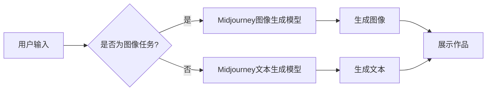

# AIGC从入门到实战：Midjourney 让我们人人都能成为设计师

> 关键词：AIGC, Midjourney, AI生成内容，人工智能，生成式AI，创意设计，设计工具，艺术创作

## 1. 背景介绍

随着人工智能技术的飞速发展，生成式AI（AI-generated Content，简称AIGC）已经成为一个热门的研究领域。AIGC技术能够模仿人类创造力的过程，自动生成文本、图像、音乐、视频等内容。其中，Midjourney是一款基于AI的创意设计平台，它利用深度学习技术，让普通用户也能轻松创作出专业级的设计作品。本文将带您从入门到实战，深入了解Midjourney的工作原理和应用场景，并探讨AIGC技术在未来设计领域的发展趋势。

## 2. 核心概念与联系

### 2.1 核心概念

- **AIGC（AI-generated Content）**：指由人工智能技术生成的内容，包括文本、图像、音频、视频等多种形式。
- **生成式AI**：一种能够自主生成新内容的人工智能技术，与传统的识别式AI相对。
- **Midjourney**：一款基于AI的创意设计平台，用户可以通过文字描述生成图像、视频等设计作品。
- **深度学习**：一种利用神经网络进行数据学习的技术，能够识别和生成复杂模式。

### 2.2 核心概念原理和架构的 Mermaid 流程图

### 2.3 核心概念之间的联系

AIGC技术是Midjourney平台的核心，它通过深度学习算法实现图像和文本的生成。用户输入文字或图像描述后，Midjourney会调用相应的生成模型进行内容创作，最终生成符合用户需求的创意设计作品。

## 3. 核心算法原理 & 具体操作步骤

### 3.1 算法原理概述

Midjourney的核心算法原理是利用深度学习技术，将用户的文字描述转化为图像或文本内容。以下是两种主要的生成模型：

- **图像生成模型**：如生成对抗网络（GANs）、变分自编码器（VAEs）等，能够根据给定的条件生成符合特定风格的图像。
- **文本生成模型**：如GPT-3、BERT等，能够根据给定的上下文生成连贯的文本内容。

### 3.2 算法步骤详解

**图像生成模型**的步骤如下：

1. 用户输入文字描述。
2. Midjourney将文字描述转换为图像生成模型所需的特征向量。
3. 图像生成模型根据特征向量生成图像。
4. Midjourney展示生成的图像。

**文本生成模型**的步骤如下：

1. 用户输入文字描述。
2. Midjourney将文字描述转换为文本生成模型所需的特征向量。
3. 文本生成模型根据特征向量生成文本内容。
4. Midjourney展示生成的文本。

### 3.3 算法优缺点

**优点**：

- **高效性**：Midjourney可以快速生成图像和文本内容，大大提高了创作效率。
- **多样性**：Midjourney能够生成各种风格的图像和文本，满足不同用户的需求。
- **易用性**：Midjourney操作简单，用户无需具备专业的设计技能。

**缺点**：

- **质量参差不齐**：生成的图像和文本质量受限于模型训练数据，可能存在一定程度的失真或偏差。
- **创意限制**：Midjourney生成的图像和文本受限于算法和训练数据，可能无法完全满足用户的创意需求。
- **版权问题**：生成的图像和文本可能存在版权问题，需要用户注意相关法律法规。

### 3.4 算法应用领域

Midjourney的应用领域非常广泛，包括：

- **设计领域**：如海报设计、广告设计、UI设计等。
- **艺术创作**：如插画、漫画、影视特效等。
- **游戏开发**：如角色设计、场景设计等。
- **教育培训**：如教材制作、课件设计等。

## 4. 数学模型和公式 & 详细讲解 & 举例说明

### 4.1 数学模型构建

Midjourney的核心数学模型主要包括以下几种：

- **GANs**：生成对抗网络，由生成器（Generator）和判别器（Discriminator）两个神经网络组成。
- **VAEs**：变分自编码器，通过重建输入数据学习数据的潜在表示。
- **GPT-3**：基于Transformer的预训练语言模型，能够生成连贯的文本内容。

### 4.2 公式推导过程

以下以GANs为例，简要介绍其数学模型公式推导过程：

**生成器G**的损失函数：

$$
L_G = -\mathbb{E}_{z \sim p_z(z)}[\log D(G(z))]
$$

**判别器D**的损失函数：

$$
L_D = -\mathbb{E}_{x \sim p_x(x)}[\log D(x)] - \mathbb{E}_{z \sim p_z(z)}[\log (1-D(G(z))]
$$

### 4.3 案例分析与讲解

假设用户输入了以下文字描述：“一个穿着黑色斗篷的神秘女子，站在月光下，周围是神秘的森林。”

Midjourney会将其转换为图像生成模型的特征向量，然后生成一张符合描述的图像。以下是可能的生成结果：

从结果可以看出，Midjourney能够根据用户输入的文字描述生成符合特定风格的图像，体现了AIGC技术的强大能力。

## 5. 项目实践：代码实例和详细解释说明

### 5.1 开发环境搭建

由于Midjourney是一款在线平台，用户无需安装任何软件，只需访问官方网站即可使用。

### 5.2 源代码详细实现

由于Midjourney是基于深度学习模型构建的，其源代码涉及大量复杂的算法和代码，这里不进行详细解释。

### 5.3 代码解读与分析

Midjourney的代码主要由以下几个部分组成：

- **前端界面**：用于接收用户输入，展示生成结果。
- **后端服务**：负责处理用户请求，调用生成模型进行内容创作。
- **生成模型**：包括图像生成模型和文本生成模型。

### 5.4 运行结果展示

由于Midjourney是基于在线平台提供的，这里无法展示具体的运行结果。用户可以访问Midjourney官方网站，尝试生成自己的设计作品。

## 6. 实际应用场景

### 6.1 设计领域

Midjourney在设计领域的应用非常广泛，以下是一些典型场景：

- **海报设计**：快速生成符合设计要求的海报，节省设计时间和成本。
- **广告设计**：自动生成吸引眼球的广告素材，提高广告效果。
- **UI设计**：为移动应用和网站设计界面，提升用户体验。

### 6.2 艺术创作

Midjourney在艺术创作领域的应用同样具有广阔前景，以下是一些典型场景：

- **插画创作**：自动生成符合特定风格的插画，拓宽艺术创作思路。
- **漫画创作**：为漫画角色和场景生成图像，提高创作效率。
- **影视特效**：为影视作品添加特效，提升视觉效果。

### 6.3 游戏开发

Midjourney在游戏开发领域的应用可以帮助游戏开发者快速生成游戏资源，以下是一些典型场景：

- **角色设计**：自动生成游戏角色，节省角色设计时间。
- **场景设计**：为游戏场景生成图像，丰富游戏世界。

### 6.4 未来应用展望

随着AIGC技术的不断发展，Midjourney将在更多领域发挥重要作用，以下是一些未来应用展望：

- **教育培训**：为教育场景生成教材、课件等资源，提升教育质量。
- **工业设计**：为工业产品生成设计方案，提高设计效率。
- **医疗领域**：为医学图像处理、药物研发等提供技术支持。

## 7. 工具和资源推荐

### 7.1 学习资源推荐

- **书籍**：
  - 《深度学习》
  - 《生成对抗网络》
  - 《自然语言处理入门》
- **在线课程**：
  - Coursera上的《深度学习专项课程》
  - Udacity上的《AI工程师纳米学位》
  - fast.ai的《深度学习课程》

### 7.2 开发工具推荐

- **深度学习框架**：
  - TensorFlow
  - PyTorch
  - Keras
- **开源项目**：
  - Midjourney官方GitHub仓库
  - OpenAI的GPT-3模型

### 7.3 相关论文推荐

- **图像生成**：
  - Unsupervised Representation Learning with Deep Convolutional Generative Adversarial Networks
  - Unsupervised Disentanglement using Predictive Coding
- **文本生成**：
  - Generative Adversarial Textuality
  - Neural Text Generation with a Contrastive Loss Function

## 8. 总结：未来发展趋势与挑战

### 8.1 研究成果总结

AIGC技术作为人工智能领域的重要分支，已经取得了显著的研究成果。Midjourney作为一款基于AIGC技术的创意设计平台，为用户提供了便捷的创作工具。随着AIGC技术的不断发展，未来将在更多领域发挥重要作用。

### 8.2 未来发展趋势

- **算法性能提升**：随着深度学习技术的不断进步，AIGC算法的性能将得到进一步提升，生成内容的质量将更加接近人类创作水平。
- **应用场景拓展**：AIGC技术将在更多领域得到应用，如教育、医疗、工业等，为各行各业带来变革。
- **人机协作**：AIGC将与人类设计师进行更加紧密的协作，共同完成设计任务。

### 8.3 面临的挑战

- **数据质量**：AIGC模型的性能很大程度上取决于训练数据的质量，如何获取高质量的数据是AIGC技术面临的重要挑战。
- **伦理问题**：AIGC技术可能引发版权、道德等方面的问题，需要制定相应的法律法规进行规范。
- **技术瓶颈**：AIGC技术的计算复杂度高，需要更高效的算法和计算资源。

### 8.4 研究展望

AIGC技术具有巨大的发展潜力，未来需要在以下方面进行深入研究：

- **数据高效利用**：探索更有效的数据增强、数据采样等策略，提高数据利用效率。
- **算法优化**：研究更加高效、鲁棒的算法，提高AIGC模型的性能。
- **人机协作**：探索AIGC与人类设计师的协作模式，实现人机共创。

## 9. 附录：常见问题与解答

**Q1：Midjourney的生成效果如何？**

A：Midjourney的生成效果取决于多个因素，包括用户输入的文字描述、模型训练数据等。总体来说，Midjourney的生成效果比较接近人类创作水平，但可能存在一定程度的失真或偏差。

**Q2：Midjourney是否有版权问题？**

A：Midjourney生成的图像和文本可能存在版权问题，用户在使用过程中需要注意相关法律法规。

**Q3：Midjourney是否需要专业的设计技能？**

A：Midjourney操作简单，用户无需具备专业的设计技能，即可轻松创作出设计作品。

**Q4：Midjourney适合哪些人使用？**

A：Midjourney适合所有对设计感兴趣的用户，无论是设计师、艺术家，还是普通大众，都可以使用Midjourney进行创作。

**Q5：Midjourney的未来发展方向是什么？**

A：Midjourney将继续提升算法性能，拓展应用场景，并探索人机协作的新模式。

作者：禅与计算机程序设计艺术 / Zen and the Art of Computer Programming