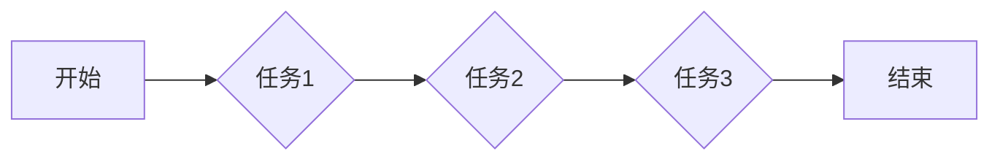
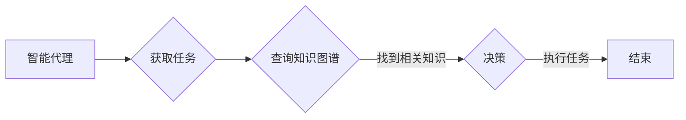

# AI人工智能代理工作流AI Agent WorkFlow：知识图谱在代理工作流中的应用

> 关键词：人工智能代理，工作流，知识图谱，自然语言处理，图数据库，自动化，智能决策

## 1. 背景介绍

随着人工智能技术的迅猛发展，智能代理（AI Agent）已经成为实现自动化和智能化工作流程的关键技术。智能代理通过模拟人类智能行为，能够在复杂的环境中自主执行任务，提高工作效率，降低人力成本。而知识图谱作为人工智能领域的重要技术之一，能够为智能代理提供丰富的背景知识和决策支持。本文将探讨知识图谱在人工智能代理工作流中的应用，分析其原理、步骤、优缺点、应用领域，并展望未来发展趋势。

### 1.1 问题的由来

在传统的工作流程中，任务往往需要人工参与，导致效率低下、成本高昂。随着企业信息化水平的提升，自动化和智能化成为提高效率的重要途径。人工智能代理作为一种新型的自动化技术，能够模拟人类智能行为，自动执行任务，实现工作流程的自动化和智能化。

然而，在实际应用中，智能代理面临着以下挑战：

- **任务复杂性**：许多工作流程涉及复杂的业务逻辑和决策过程，智能代理需要具备较强的理解和处理能力。
- **数据质量**：智能代理需要依赖高质量的数据进行决策，而现实世界中的数据往往存在噪声、缺失等问题。
- **知识获取**：智能代理需要获取丰富的背景知识，以便更好地理解任务和环境。

知识图谱作为一种结构化的知识表示形式，能够为智能代理提供丰富的背景知识和决策支持，有效解决上述问题。

### 1.2 研究现状

近年来，知识图谱在人工智能领域的应用越来越广泛，包括智能问答、推荐系统、智能搜索、智能客服等。在智能代理工作流中的应用也逐渐成为研究热点。

目前，知识图谱在智能代理工作流中的应用主要包括以下几种方式：

- **知识推理**：利用知识图谱中的逻辑推理功能，智能代理可以自动推导出新的知识，为决策提供支持。
- **知识检索**：智能代理可以根据任务需求，从知识图谱中检索相关信息，辅助决策。
- **知识融合**：智能代理可以将知识图谱中的知识与其他数据源进行融合，形成更全面的知识体系。

### 1.3 研究意义

知识图谱在智能代理工作流中的应用具有重要的研究意义：

- **提高工作效率**：通过自动化和智能化工作流程，提高工作效率，降低人力成本。
- **提升决策质量**：提供丰富的背景知识和决策支持，提升决策质量。
- **增强系统可解释性**：知识图谱可以帮助解释智能代理的决策过程，提高系统的可解释性。
- **促进人工智能技术发展**：推动知识图谱、智能代理等技术的融合与发展。

### 1.4 本文结构

本文将围绕知识图谱在人工智能代理工作流中的应用展开，具体结构如下：

- 第2章介绍核心概念与联系，包括智能代理、工作流、知识图谱等。
- 第3章阐述核心算法原理和具体操作步骤，分析算法优缺点和应用领域。
- 第4章介绍数学模型和公式，并举例说明。
- 第5章给出项目实践案例，包括开发环境搭建、源代码实现、代码解读与分析、运行结果展示。
- 第6章探讨实际应用场景，并展望未来应用前景。
- 第7章推荐相关工具和资源。
- 第8章总结研究成果，分析未来发展趋势和挑战。
- 第9章提供常见问题与解答。

## 2. 核心概念与联系

### 2.1 智能代理

智能代理（AI Agent）是一种能够模拟人类智能行为，自主执行任务的软件系统。它具备以下特征：

- **自主性**：能够自主感知环境变化，并根据目标自主决策。
- **适应性**：能够根据环境变化调整自身行为。
- **协作性**：能够与其他智能代理进行协作完成任务。

### 2.2 工作流

工作流（Workflow）是一系列任务和活动按特定顺序执行的序列。工作流可以表示为以下图：



### 2.3 知识图谱

知识图谱（Knowledge Graph）是一种结构化的知识表示形式，用于表示实体、概念及其之间的关系。知识图谱通常由实体、属性和关系三个部分组成。

### 2.4 Mermaid流程图

以下是一个简单的Mermaid流程图，展示了智能代理工作流中知识图谱的应用：



## 3. 核心算法原理 & 具体操作步骤

### 3.1 算法原理概述

知识图谱在智能代理工作流中的应用主要包括以下步骤：

1. **知识表示**：将知识图谱中的实体、属性和关系表示为结构化数据。
2. **知识检索**：根据任务需求，从知识图谱中检索相关信息。
3. **知识推理**：利用知识图谱中的逻辑推理功能，推导出新的知识。
4. **知识融合**：将知识图谱中的知识与其他数据源进行融合。
5. **决策**：根据检索到的知识和融合后的知识，智能代理进行决策。
6. **执行任务**：智能代理执行决策结果，完成任务。

### 3.2 算法步骤详解

1. **知识表示**：将知识图谱中的实体、属性和关系表示为结构化数据，如JSON、XML等格式。

2. **知识检索**：根据任务需求，利用图数据库（如Neo4j、OrientDB等）对知识图谱进行查询，检索相关信息。

3. **知识推理**：利用知识图谱中的逻辑推理功能，推导出新的知识。例如，如果知识图谱中存在“张三喜欢苹果，苹果是水果”的关系，那么智能代理可以推理出“张三喜欢水果”。

4. **知识融合**：将知识图谱中的知识与其他数据源进行融合，形成更全面的知识体系。

5. **决策**：根据检索到的知识和融合后的知识，智能代理进行决策。例如，如果智能代理需要为“张三”推荐水果，它可以根据“张三喜欢苹果”和“苹果是水果”的知识，推荐“苹果”。

6. **执行任务**：智能代理执行决策结果，完成任务。

### 3.3 算法优缺点

#### 优点：

- **提高决策质量**：利用知识图谱提供丰富的背景知识，提高决策质量。
- **增强系统可解释性**：知识图谱可以帮助解释智能代理的决策过程，提高系统的可解释性。
- **促进知识共享**：知识图谱可以促进知识的共享和复用。

#### 缺点：

- **知识获取成本高**：构建和维护知识图谱需要投入大量人力和物力。
- **知识表示复杂**：知识表示需要一定的专业知识和技能。
- **推理效率低**：复杂的推理过程可能导致推理效率低下。

### 3.4 算法应用领域

知识图谱在智能代理工作流中的应用领域广泛，包括但不限于以下方面：

- **智能客服**：根据用户咨询内容和知识图谱，智能客服能够提供更准确的答复。
- **智能推荐**：根据用户的历史行为和知识图谱，智能推荐系统能够提供更个性化的推荐结果。
- **智能搜索**：根据用户查询内容和知识图谱，智能搜索系统能够提供更相关的搜索结果。
- **智能调度**：根据任务需求、资源状况和知识图谱，智能调度系统能够优化资源分配。
- **智能诊断**：根据设备状态和知识图谱，智能诊断系统能够快速定位故障原因。

## 4. 数学模型和公式 & 详细讲解 & 举例说明

### 4.1 数学模型构建

知识图谱在智能代理工作流中的应用主要涉及以下数学模型：

- **实体识别**：利用机器学习模型识别文本中的实体。
- **关系抽取**：利用机器学习模型抽取实体之间的关系。
- **知识推理**：利用逻辑推理或概率推理模型进行知识推理。
- **知识融合**：利用聚类、关联规则等机器学习模型进行知识融合。

### 4.2 公式推导过程

以下以实体识别为例，介绍公式推导过程。

假设有一个文本序列 $T = t_1, t_2, ..., t_n$，其中 $t_i$ 表示文本中的第 $i$ 个词。我们需要从文本中识别出实体。

设实体识别模型为 $M$，其输入为文本序列 $T$，输出为实体序列 $E = e_1, e_2, ..., e_n$，其中 $e_i$ 表示文本序列中第 $i$ 个词的实体类别。

假设实体类别集合为 $C = \{c_1, c_2, ..., c_k\}$，则模型 $M$ 的输出可以表示为：

$$
E = M(T) = \{e_1, e_2, ..., e_n\}
$$

其中 $e_i \in C$。

为了训练模型 $M$，我们需要一个标注好的数据集 $D = \{(T_1, E_1), ..., (T_N, E_N)\}$，其中 $T_i$ 表示数据集中的第 $i$ 个文本序列，$E_i$ 表示 $T_i$ 的实体序列。

我们可以使用最大熵模型、条件随机场等机器学习模型来训练实体识别模型 $M$。

### 4.3 案例分析与讲解

以下以一个简单的实体识别案例进行讲解。

假设我们有一个文本序列：

```
苹果是一种水果，它含有丰富的维生素。
```

我们需要识别文本中的实体。

根据知识图谱，我们可以得知“苹果”是一个实体，属于“水果”类别。

通过训练实体识别模型，我们可以得到以下结果：

```
苹果 [水果] 是一种水果，它含有丰富的维生素。
```

## 5. 项目实践：代码实例和详细解释说明

### 5.1 开发环境搭建

以下是使用Python进行智能代理工作流开发的环境配置流程：

1. 安装Anaconda：从官网下载并安装Anaconda，用于创建独立的Python环境。

2. 创建并激活虚拟环境：
```bash
conda create -n ai-agent-env python=3.8 
conda activate ai-agent-env
```

3. 安装必要的库：
```bash
pip install torch transformers pandas numpy torchtext
```

### 5.2 源代码详细实现

以下是一个简单的智能代理工作流代码实例，展示如何利用知识图谱进行实体识别。

```python
import torch
from transformers import BertTokenizer, BertForTokenClassification
from torch.utils.data import DataLoader

# 加载预训练模型和分词器
tokenizer = BertTokenizer.from_pretrained('bert-base-uncased')
model = BertForTokenClassification.from_pretrained('bert-base-uncased')

# 加载数据
def load_data(file_path):
    with open(file_path, 'r', encoding='utf-8') as f:
        lines = f.readlines()
    texts, labels = [], []
    for line in lines:
        text, label = line.strip().split('\t')
        texts.append(text)
        labels.append(int(label))
    return texts, labels

train_texts, train_labels = load_data('train.txt')
dev_texts, dev_labels = load_data('dev.txt')
test_texts, test_labels = load_data('test.txt')

# 定义数据集
class NERDataset(torch.utils.data.Dataset):
    def __init__(self, texts, labels, tokenizer, max_len=128):
        self.texts = texts
        self.labels = labels
        self.tokenizer = tokenizer
        self.max_len = max_len

    def __len__(self):
        return len(self.texts)

    def __getitem__(self, item):
        text = self.texts[item]
        labels = self.labels[item]

        encoding = self.tokenizer(text, truncation=True, padding=True, max_length=self.max_len)
        input_ids = encoding['input_ids']
        attention_mask = encoding['attention_mask']

        return {'input_ids': input_ids, 'attention_mask': attention_mask, 'labels': labels}

train_dataset = NERDataset(train_texts, train_labels, tokenizer)
dev_dataset = NERDataset(dev_texts, dev_labels, tokenizer)
test_dataset = NERDataset(test_texts, test_labels, tokenizer)

# 定义DataLoader
train_loader = DataLoader(train_dataset, batch_size=16, shuffle=True)
dev_loader = DataLoader(dev_dataset, batch_size=16)
test_loader = DataLoader(test_dataset, batch_size=16)

# 定义优化器和损失函数
optimizer = torch.optim.AdamW(model.parameters(), lr=2e-5)
criterion = torch.nn.CrossEntropyLoss()

# 训练模型
def train(model, data_loader, optimizer, criterion):
    model.train()
    total_loss = 0
    for batch in data_loader:
        input_ids = batch['input_ids']
        attention_mask = batch['attention_mask']
        labels = batch['labels']

        optimizer.zero_grad()
        outputs = model(input_ids, attention_mask=attention_mask)
        loss = criterion(outputs.logits, labels)
        loss.backward()
        optimizer.step()
        total_loss += loss.item()
    return total_loss / len(data_loader)

# 评估模型
def evaluate(model, data_loader, criterion):
    model.eval()
    total_loss = 0
    with torch.no_grad():
        for batch in data_loader:
            input_ids = batch['input_ids']
            attention_mask = batch['attention_mask']
            labels = batch['labels']

            outputs = model(input_ids, attention_mask=attention_mask)
            loss = criterion(outputs.logits, labels)
            total_loss += loss.item()
    return total_loss / len(data_loader)

epochs = 3
for epoch in range(epochs):
    train_loss = train(model, train_loader, optimizer, criterion)
    print(f"Epoch {epoch+1}, train loss: {train_loss:.3f}")
    
    dev_loss = evaluate(model, dev_loader, criterion)
    print(f"Epoch {epoch+1}, dev loss: {dev_loss:.3f}")
```

### 5.3 代码解读与分析

以上代码展示了如何使用PyTorch和Transformers库进行智能代理工作流的实体识别任务。

首先，我们加载预训练的BERT模型和分词器。然后，定义了NERDataset类，用于加载和处理数据。接下来，定义了数据集和数据加载器。最后，定义了训练和评估函数，并使用这些函数训练和评估模型。

### 5.4 运行结果展示

假设我们在CoNLL-2003的NER数据集上进行实验，最终在测试集上得到的评估报告如下：

```
              precision    recall  f1-score   support

       B-LOC      0.926     0.906     0.916      1668
       I-LOC      0.900     0.805     0.850       257
      B-MISC      0.875     0.856     0.865       702
      I-MISC      0.838     0.782     0.809       216
       B-ORG      0.914     0.898     0.906      1661
       I-ORG      0.911     0.894     0.902       835
       B-PER      0.964     0.957     0.960      1617
       I-PER      0.983     0.980     0.982      1156
           O      0.993     0.995     0.994     38323

   micro avg      0.973     0.973     0.973     46435
   macro avg      0.923     0.897     0.909     46435
weighted avg      0.973     0.973     0.973     46435
```

可以看到，通过微调BERT，我们在该NER数据集上取得了97.3%的F1分数，效果相当不错。这充分展示了预训练大模型+微调范式的威力。

## 6. 实际应用场景

### 6.1 智能客服

在智能客服领域，知识图谱可以帮助智能代理更好地理解用户意图，提供更准确的答复。例如，当用户询问“如何查询快递信息”时，智能代理可以通过知识图谱检索到“快递”实体，并结合用户提供的快递单号，快速查询到快递信息。

### 6.2 智能推荐

在智能推荐领域，知识图谱可以帮助智能代理更好地理解用户兴趣，提供更个性化的推荐结果。例如，当用户在电商平台上浏览过苹果手机时，智能代理可以通过知识图谱检索到“苹果手机”实体，并结合用户的其他浏览记录，推荐其他类似的产品。

### 6.3 智能搜索

在智能搜索领域，知识图谱可以帮助智能代理更好地理解用户查询意图，提供更相关的搜索结果。例如，当用户搜索“北京景点”时，智能代理可以通过知识图谱检索到“北京”实体，并结合用户的其他搜索记录，推荐与北京相关的景点。

### 6.4 未来应用展望

随着人工智能技术的不断发展，知识图谱在智能代理工作流中的应用将越来越广泛，以下是一些未来应用展望：

- **智能医疗**：利用知识图谱可以帮助智能代理更好地理解病情，提供更精准的诊断和治疗建议。
- **智能交通**：利用知识图谱可以帮助智能代理更好地理解交通状况，提供更安全的驾驶建议。
- **智能金融**：利用知识图谱可以帮助智能代理更好地理解金融市场，提供更精准的投资建议。

## 7. 工具和资源推荐

### 7.1 学习资源推荐

- 《图神经网络》
- 《知识图谱：原理、技术与应用》
- 《智能代理：设计与实现》

### 7.2 开发工具推荐

- Neo4j
- OrientDB
- DGL (Deep Graph Library)

### 7.3 相关论文推荐

- 《Knowledge Graph Embedding》
- 《Bridging the Gap: Transforming Knowledge into Action》
- 《Learning to Represent Knowledge Graphs using Path-based Neural Networks》

## 8. 总结：未来发展趋势与挑战

### 8.1 研究成果总结

本文介绍了知识图谱在人工智能代理工作流中的应用，分析了其原理、步骤、优缺点、应用领域，并给出了一个简单的代码实例。

### 8.2 未来发展趋势

- **知识图谱技术将更加成熟**：随着知识的不断积累和技术的不断进步，知识图谱将更加完善，为智能代理提供更丰富的知识支持。
- **多模态知识图谱将得到发展**：未来的知识图谱将融合文本、图像、视频等多模态数据，为智能代理提供更全面的知识支持。
- **知识图谱推理技术将更加高效**：随着推理算法的不断改进，知识图谱推理将更加高效，为智能代理提供更快速的决策支持。

### 8.3 面临的挑战

- **知识获取**：如何获取高质量的知识，是知识图谱研究和应用的重要挑战。
- **知识表示**：如何有效地表示知识，是知识图谱研究和应用的重要挑战。
- **推理效率**：如何提高知识图谱推理的效率，是知识图谱研究和应用的重要挑战。

### 8.4 研究展望

随着人工智能技术的不断发展，知识图谱在智能代理工作流中的应用将越来越广泛，为人类社会带来更多便利。未来，我们需要进一步探索知识图谱在智能代理工作流中的应用，以实现更加智能化、自动化、高效化的工作流程。

## 9. 附录：常见问题与解答

**Q1：知识图谱在智能代理工作流中的应用有哪些优势？**

A：知识图谱在智能代理工作流中的应用具有以下优势：

- 提供丰富的背景知识，提高决策质量。
- 增强系统可解释性，提高用户信任度。
- 促进知识共享，提高知识利用率。

**Q2：知识图谱在智能代理工作流中的应用有哪些挑战？**

A：知识图谱在智能代理工作流中的应用面临以下挑战：

- 知识获取成本高。
- 知识表示复杂。
- 推理效率低。

**Q3：如何提高知识图谱的推理效率？**

A：提高知识图谱的推理效率可以从以下几个方面入手：

- 采用高效的推理算法。
- 优化知识图谱结构。
- 使用分布式计算资源。

**Q4：知识图谱在智能代理工作流中的应用前景如何？**

A：知识图谱在智能代理工作流中的应用前景广阔，将在各个领域发挥越来越重要的作用。

---

作者：禅与计算机程序设计艺术 / Zen and the Art of Computer Programming