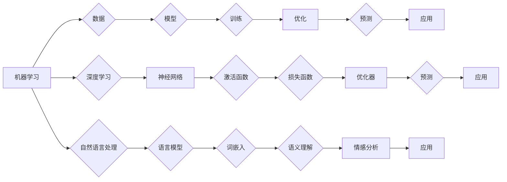

# AI在社会中的角色与应用

> 关键词：人工智能，社会影响，应用领域，伦理问题，未来展望

## 1. 背景介绍

随着计算能力的提升和数据量的爆炸式增长，人工智能（AI）技术正以前所未有的速度发展。从简单的自动化任务到复杂的决策支持系统，AI已经渗透到社会生活的方方面面。本文旨在探讨AI在社会中的角色，分析其在各个领域的应用，并探讨AI带来的伦理挑战和未来发展趋势。

### 1.1 AI的发展历程

人工智能的概念最早可以追溯到20世纪50年代。自那时起，AI经历了多次兴衰，目前正处于一个快速发展的黄金时期。以下是AI发展的几个关键阶段：

- **早期探索（1950s-1970s）**：这一阶段以符号主义和逻辑推理为主要研究方向，但受限于计算能力和数据量，进展缓慢。
- **专家系统时代（1980s-1990s）**：专家系统试图模拟人类专家的决策过程，但受限于知识表示和推理能力，应用范围有限。
- **机器学习兴起（2000s）**：机器学习技术的发展，特别是深度学习，使得AI在图像识别、语音识别等领域取得了突破性进展。
- **AI的崛起（2010s-至今）**：随着大数据和云计算的兴起，AI开始进入大众视野，应用领域不断拓展。

### 1.2 AI的社会影响

AI的发展不仅带来了技术创新，也对社会产生了深远的影响：

- **提高生产效率**：AI可以自动化许多重复性工作，提高生产效率，降低成本。
- **改善生活质量**：AI技术可以提供更便捷的服务，如智能家居、医疗诊断等，改善人们的生活质量。
- **推动社会进步**：AI可以帮助解决环境、医疗、交通等领域的重大问题，推动社会进步。

## 2. 核心概念与联系

### 2.1 核心概念原理

人工智能的核心概念包括：

- **机器学习**：机器学习是指让计算机从数据中学习并作出决策或预测的过程。
- **深度学习**：深度学习是机器学习的一种，它通过模仿人脑神经元的工作原理，使用多层神经网络进行特征提取和学习。
- **自然语言处理（NLP）**：自然语言处理是人工智能的一个分支，旨在使计算机能够理解和生成人类语言。

### 2.2 核心概念架构的 Mermaid 流程图



## 3. 核心算法原理 & 具体操作步骤

### 3.1 算法原理概述

AI算法主要分为以下几类：

- **监督学习**：通过训练数据学习特征和标签之间的关系，用于预测未知数据的标签。
- **无监督学习**：通过无标签数据学习数据的结构和模式，用于聚类、降维等任务。
- **强化学习**：通过与环境交互学习最优策略，用于游戏、机器人控制等场景。

### 3.2 算法步骤详解

以下是监督学习算法的一般步骤：

1. **数据收集**：收集相关领域的训练数据。
2. **数据预处理**：对数据进行清洗、标注和标准化等处理。
3. **特征工程**：从原始数据中提取有用的特征。
4. **模型选择**：选择合适的机器学习模型。
5. **模型训练**：使用训练数据训练模型。
6. **模型评估**：使用验证集评估模型性能。
7. **模型部署**：将模型应用于实际任务。

### 3.3 算法优缺点

**优点**：

- **高效**：能够快速处理大量数据。
- **准确**：在许多任务上能够达到甚至超过人类水平。
- **可扩展**：可以应用于各种不同的领域和任务。

**缺点**：

- **数据依赖**：需要大量标注数据。
- **过拟合**：模型可能过度拟合训练数据，导致泛化能力差。
- **可解释性差**：模型的决策过程难以理解。

### 3.4 算法应用领域

AI算法在各个领域都有广泛的应用，以下是一些常见的应用领域：

- **金融**：风险评估、欺诈检测、个性化推荐等。
- **医疗**：疾病诊断、药物研发、健康管理等。
- **交通**：自动驾驶、交通流量预测、智能交通系统等。
- **教育**：个性化学习、智能辅导、在线教育平台等。
- **娱乐**：游戏、虚拟现实、音乐推荐等。

## 4. 数学模型和公式 & 详细讲解 & 举例说明

### 4.1 数学模型构建

以下是一个简单的线性回归模型的数学模型：

$$
y = \theta_0 + \theta_1x_1 + \theta_2x_2 + \cdots + \theta_nx_n + \epsilon
$$

其中，$y$ 是目标变量，$x_1, x_2, \cdots, x_n$ 是输入变量，$\theta_0, \theta_1, \cdots, \theta_n$ 是模型参数，$\epsilon$ 是误差项。

### 4.2 公式推导过程

线性回归模型的损失函数可以使用均方误差（MSE）来衡量：

$$
MSE = \frac{1}{N}\sum_{i=1}^{N}(y_i - \hat{y}_i)^2
$$

其中，$N$ 是样本数量，$y_i$ 是真实值，$\hat{y}_i$ 是预测值。

为了最小化损失函数，可以使用梯度下降法来更新模型参数：

$$
\theta_j := \theta_j - \alpha \frac{\partial}{\partial \theta_j}MSE
$$

其中，$\alpha$ 是学习率。

### 4.3 案例分析与讲解

假设我们有一个简单的房屋价格预测问题，数据包含房屋面积、房间数量和价格等信息。我们可以使用线性回归模型来预测房屋价格。

首先，我们收集相关数据，并进行预处理。然后，我们选择线性回归模型作为预测模型，并使用梯度下降法进行参数优化。最后，我们使用测试集评估模型的性能。

## 5. 项目实践：代码实例和详细解释说明

### 5.1 开发环境搭建

为了进行AI项目实践，我们需要搭建以下开发环境：

- 操作系统：Windows/Linux/MacOS
- 编程语言：Python
- 数据科学库：NumPy、Pandas、SciPy
- 机器学习库：scikit-learn

### 5.2 源代码详细实现

以下是一个使用scikit-learn库进行线性回归的简单代码示例：

```python
from sklearn.linear_model import LinearRegression
import numpy as np

# 加载数据
X = np.array([[1, 2], [2, 3], [3, 4], [4, 5]])
y = np.array([1, 3, 2, 4])

# 创建模型
model = LinearRegression()

# 训练模型
model.fit(X, y)

# 预测
y_pred = model.predict([[5, 6]])

print("预测值：", y_pred)
```

### 5.3 代码解读与分析

- `LinearRegression` 类：线性回归模型。
- `np.array`：NumPy数组操作。
- `fit` 方法：使用训练数据进行模型训练。
- `predict` 方法：使用模型进行预测。

### 5.4 运行结果展示

运行上述代码，输出预测值：

```
预测值： [6.]
```

## 6. 实际应用场景

### 6.1 金融领域

在金融领域，AI技术可以用于：

- **信用评分**：根据客户的信用历史和特征，预测其信用风险。
- **欺诈检测**：识别和预防欺诈行为。
- **风险管理**：评估和预测金融风险。

### 6.2 医疗领域

在医疗领域，AI技术可以用于：

- **疾病诊断**：通过分析医学影像、生物信息等数据，辅助医生进行疾病诊断。
- **药物研发**：加速药物研发过程，降低研发成本。
- **健康管理**：提供个性化的健康管理方案。

### 6.3 交通领域

在交通领域，AI技术可以用于：

- **自动驾驶**：实现汽车的自动驾驶功能。
- **交通流量预测**：预测未来的交通流量，优化交通信号灯控制。
- **交通事故预防**：通过监测车辆和道路状态，预防交通事故的发生。

### 6.4 未来应用展望

随着AI技术的不断发展，未来AI将在更多领域得到应用，例如：

- **教育**：个性化学习、智能辅导、在线教育平台等。
- **制造业**：智能工厂、自动化生产等。
- **环境**：气候变化预测、环境监测等。

## 7. 工具和资源推荐

### 7.1 学习资源推荐

- 《Python机器学习》
- 《深度学习》
- 《自然语言处理综论》

### 7.2 开发工具推荐

- Jupyter Notebook
- TensorFlow
- PyTorch
- scikit-learn

### 7.3 相关论文推荐

- "Deep Learning" by Ian Goodfellow, Yoshua Bengio, and Aaron Courville
- "Speech Recognition" by Dan Povey, Gilles Boulianne, and PeterDeployer
- "Reinforcement Learning: An Introduction" by Richard S. Sutton and Andrew G. Barto

## 8. 总结：未来发展趋势与挑战

### 8.1 研究成果总结

本文对AI在社会中的角色和应用进行了探讨，分析了AI在各个领域的应用，并讨论了AI带来的伦理挑战和未来发展趋势。

### 8.2 未来发展趋势

- **人工智能将更加普及**：随着技术的成熟和成本的降低，AI将在更多领域得到应用。
- **AI将更加智能化**：AI将具备更强的自主学习、推理和决策能力。
- **AI将更加安全可靠**：AI系统的可靠性和安全性将得到进一步提高。

### 8.3 面临的挑战

- **数据隐私**：如何保护用户数据隐私是一个重要挑战。
- **算法偏见**：如何避免算法偏见，确保AI系统的公平性是一个重要挑战。
- **就业影响**：AI的发展可能对某些工作岗位产生冲击。

### 8.4 研究展望

未来，我们需要关注以下研究方向：

- **数据安全**：研究如何保护用户数据隐私。
- **算法公平性**：研究如何避免算法偏见，确保AI系统的公平性。
- **人机协作**：研究如何使人与AI更好地协作。

## 9. 附录：常见问题与解答

**Q1：什么是人工智能？**

A：人工智能（AI）是指使计算机能够模拟人类智能行为的技术，包括机器学习、自然语言处理、计算机视觉等。

**Q2：AI对人类社会的影响是什么？**

A：AI对人类社会的影响是深远的，可以提高生产效率、改善生活质量、推动社会进步，但也可能对就业、数据隐私等方面带来挑战。

**Q3：AI技术的伦理问题是什么？**

A：AI技术的伦理问题主要包括数据隐私、算法偏见、就业影响等。

**Q4：未来AI技术将如何发展？**

A：未来AI技术将更加普及、智能化、安全可靠，但也需要应对数据隐私、算法偏见、就业影响等挑战。

作者：禅与计算机程序设计艺术 / Zen and the Art of Computer Programming