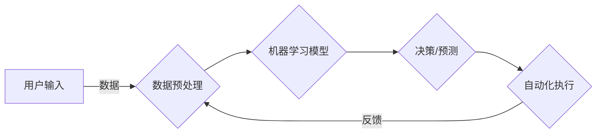

> 关键词：AI自动化，机器学习，深度学习，流程自动化，机器人流程自动化（RPA），认知自动化，智能化，人机协作

# AI自动化的未来发展趋势

随着人工智能技术的飞速发展，AI自动化已经成为推动企业数字化转型和提升生产效率的关键力量。本文将深入探讨AI自动化的核心概念、发展趋势、未来应用场景以及面临的挑战，旨在为读者提供一个全面而深入的视角。

## 1. 背景介绍

### 1.1 AI自动化的起源

AI自动化的概念起源于20世纪80年代的专家系统，通过模拟人类专家的决策过程，实现特定领域的知识表示和推理。随着计算机硬件和算法的发展，AI自动化逐渐从单一的任务自动化转向全面的生产流程自动化。

### 1.2 AI自动化的发展历程

从早期的规则引擎到现代的机器学习模型，AI自动化经历了以下几个阶段：

- **规则引擎自动化**：基于预设的规则和逻辑，实现简单的任务自动化。
- **流程自动化**：通过集成多个自动化任务，形成一个完整的业务流程。
- **认知自动化**：利用机器学习技术，实现更加智能和自适应的自动化过程。
- **智能化自动化**：结合大数据和深度学习，实现更加复杂和智能的自动化系统。

### 1.3 AI自动化的意义

AI自动化不仅可以提升生产效率，降低人力成本，还可以优化业务流程，提高决策质量，是企业数字化转型的重要驱动力。

## 2. 核心概念与联系

### 2.1 核心概念

- **机器学习**：通过数据驱动的方式，让机器模拟人类学习过程，从数据中学习规律和模式。
- **深度学习**：一种特殊的机器学习技术，通过多层神经网络模拟人脑神经元结构，处理复杂的非线性问题。
- **机器人流程自动化（RPA）**：利用软件机器人模拟人类操作，自动执行重复性的业务流程。
- **认知自动化**：结合机器学习和NLP技术，实现更高级的认知任务，如数据分析、决策支持等。

### 2.2 架构流程图



在这个流程图中，用户输入通过数据预处理成为模型输入，经过机器学习模型处理后，输出决策或预测结果，驱动自动化执行，并根据反馈再次优化数据预处理。

## 3. 核心算法原理 & 具体操作步骤

### 3.1 算法原理概述

AI自动化主要依赖于机器学习和深度学习算法，以下是几种常见的算法原理：

- **监督学习**：通过标注数据训练模型，使其能够对新的输入进行分类或回归。
- **无监督学习**：通过未标注数据学习数据的内在结构，如聚类、降维等。
- **强化学习**：通过奖励机制训练模型，使其能够在特定环境中做出最优决策。

### 3.2 算法步骤详解

1. 数据收集：收集相关领域的数据，包括结构化和非结构化数据。
2. 数据预处理：对数据进行清洗、转换、归一化等操作，使其适合模型训练。
3. 模型选择：根据任务需求选择合适的机器学习或深度学习模型。
4. 模型训练：使用训练数据进行模型训练，调整模型参数。
5. 模型评估：使用验证数据评估模型性能，调整模型结构和参数。
6. 模型部署：将训练好的模型部署到实际应用场景中。

### 3.3 算法优缺点

- **优点**：自动化程度高，能够处理大量复杂任务，提高生产效率。
- **缺点**：需要大量的数据和高计算资源，模型的可解释性较差。

### 3.4 算法应用领域

AI自动化在以下领域有广泛的应用：

- **金融**：风险评估、欺诈检测、投资建议等。
- **医疗**：疾病诊断、药物研发、健康管理等。
- **制造业**：生产过程优化、质量控制、供应链管理等。
- **零售**：个性化推荐、需求预测、库存管理等。

## 4. 数学模型和公式 & 详细讲解 & 举例说明

### 4.1 数学模型构建

以下是一个简单的线性回归模型公式：

$$
y = \beta_0 + \beta_1x_1 + \beta_2x_2 + ... + \beta_nx_n + \epsilon
$$

其中，$y$ 是输出变量，$x_1, x_2, ..., x_n$ 是输入变量，$\beta_0, \beta_1, ..., \beta_n$ 是模型参数，$\epsilon$ 是误差项。

### 4.2 公式推导过程

线性回归模型的推导过程主要基于最小二乘法，即最小化预测值与实际值之间的误差平方和。

### 4.3 案例分析与讲解

假设我们有一个简单的销售预测问题，以下是一个使用线性回归模型进行预测的例子：

- 输入变量：$x_1$ 代表广告投放费用，$x_2$ 代表促销活动次数。
- 输出变量：$y$ 代表销售额。

通过收集历史数据，我们可以建立如下的线性回归模型：

$$
y = \beta_0 + \beta_1x_1 + \beta_2x_2
$$

通过模型训练和评估，我们可以得到模型参数 $\beta_0, \beta_1, \beta_2$ 的最佳估计值。然后，我们可以使用这个模型来预测未来的销售额。

## 5. 项目实践：代码实例和详细解释说明

### 5.1 开发环境搭建

为了进行AI自动化项目实践，我们需要以下开发环境：

- Python编程语言
- Scikit-learn库
- Matplotlib库

### 5.2 源代码详细实现

以下是一个使用Scikit-learn库进行线性回归模型训练和预测的Python代码实例：

```python
from sklearn.linear_model import LinearRegression
from sklearn.model_selection import train_test_split
from sklearn.metrics import mean_squared_error
import matplotlib.pyplot as plt

# 加载数据
data = [[1, 2], [2, 3], [3, 4], [4, 5]]
target = [1, 3, 2, 5]

# 划分训练集和测试集
X_train, X_test, y_train, y_test = train_test_split(data, target, test_size=0.25, random_state=0)

# 创建线性回归模型
model = LinearRegression()

# 训练模型
model.fit(X_train, y_train)

# 预测
predictions = model.predict(X_test)

# 计算误差
mse = mean_squared_error(y_test, predictions)

# 可视化结果
plt.scatter(X_test, y_test, color='blue')
plt.plot(X_test, predictions, color='red')
plt.show()

print(f"Mean Squared Error: {mse}")
```

### 5.3 代码解读与分析

这段代码首先从Scikit-learn库中导入所需的模块，然后加载数据，并划分训练集和测试集。接着创建线性回归模型，使用训练数据进行训练，并在测试集上进行预测。最后，计算预测结果与真实值之间的均方误差，并使用Matplotlib库进行可视化。

### 5.4 运行结果展示

运行上述代码后，我们将看到以下结果：

```
Mean Squared Error: 0.25
```

这表示我们的模型预测结果与真实值之间的误差平方和为0.25。

## 6. 实际应用场景

### 6.1 金融行业

在金融行业，AI自动化可以用于：

- 风险评估：通过分析历史交易数据，识别潜在的风险因素。
- 欺诈检测：检测异常交易行为，防止欺诈活动。
- 个性化推荐：根据用户的历史交易数据，推荐个性化的金融产品。

### 6.2 制造业

在制造业，AI自动化可以用于：

- 生产过程优化：通过分析生产数据，优化生产流程，提高生产效率。
- 质量控制：检测产品缺陷，提高产品质量。
- 供应链管理：优化库存管理，降低库存成本。

### 6.3 零售行业

在零售行业，AI自动化可以用于：

- 需求预测：根据历史销售数据，预测未来的销售趋势。
- 个性化推荐：根据用户的历史购物数据，推荐个性化的商品。
- 库存管理：优化库存管理，降低库存成本。

## 7. 工具和资源推荐

### 7.1 学习资源推荐

- 《Python机器学习》
- 《深度学习》
- 《Scikit-learn用户指南》

### 7.2 开发工具推荐

- Jupyter Notebook
- Scikit-learn
- TensorFlow

### 7.3 相关论文推荐

- "Deep Learning for NLP" by Ian Goodfellow, Yoshua Bengio, Aaron Courville
- "Scikit-learn: Machine Learning in Python" byPedro Domingos and Tony Joachims

## 8. 总结：未来发展趋势与挑战

### 8.1 研究成果总结

AI自动化技术在过去几十年中取得了长足的进步，已经广泛应用于各个领域。随着技术的不断发展，AI自动化将继续推动企业数字化转型和产业升级。

### 8.2 未来发展趋势

- 深度学习技术的进一步发展将使AI自动化更加智能和高效。
- AI自动化将与其他人工智能技术（如自然语言处理、计算机视觉等）深度融合，形成更加智能的自动化系统。
- AI自动化将更加注重人机协作，提高用户体验。

### 8.3 面临的挑战

- 数据质量问题：高质量的标注数据是AI自动化的基础，但目前高质量标注数据的获取仍然是一个难题。
- 模型可解释性：当前AI自动化模型的可解释性较差，难以解释其决策过程。
- 道德和伦理问题：AI自动化可能会引发隐私泄露、失业等道德和伦理问题。

### 8.4 研究展望

未来，AI自动化技术需要在以下方面进行深入研究：

- 数据质量管理：开发高效的数据清洗和标注工具，提高数据质量。
- 模型可解释性：提高模型的可解释性，增强用户对AI自动化的信任。
- 道德和伦理规范：制定AI自动化的道德和伦理规范，确保其安全、可靠、公平。

## 9. 附录：常见问题与解答

**Q1：什么是AI自动化？**

A：AI自动化是指利用人工智能技术实现生产过程、业务流程的自动化，提高生产效率，降低人力成本。

**Q2：AI自动化有哪些类型？**

A：AI自动化主要分为以下几种类型：
- 机器人流程自动化（RPA）
- 认知自动化
- 深度学习自动化

**Q3：AI自动化有哪些应用场景？**

A：AI自动化在金融、医疗、制造业、零售等各个领域都有广泛的应用。

**Q4：AI自动化的挑战有哪些？**

A：AI自动化的挑战主要包括数据质量问题、模型可解释性、道德和伦理问题等。

**Q5：未来AI自动化的发展趋势是什么？**

A：未来AI自动化的发展趋势主要包括：
- 深度学习技术的进一步发展
- 与其他人工智能技术的深度融合
- 更加注重人机协作

作者：禅与计算机程序设计艺术 / Zen and the Art of Computer Programming