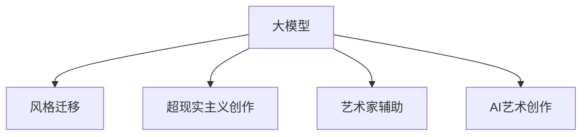
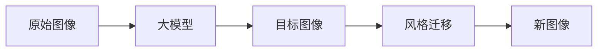
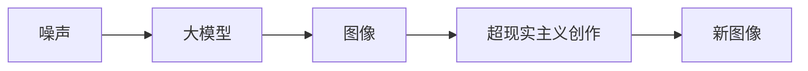
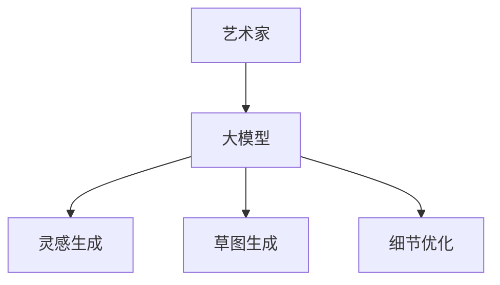
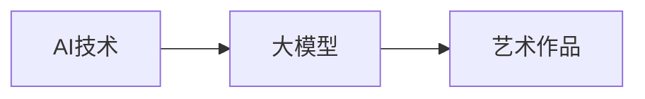
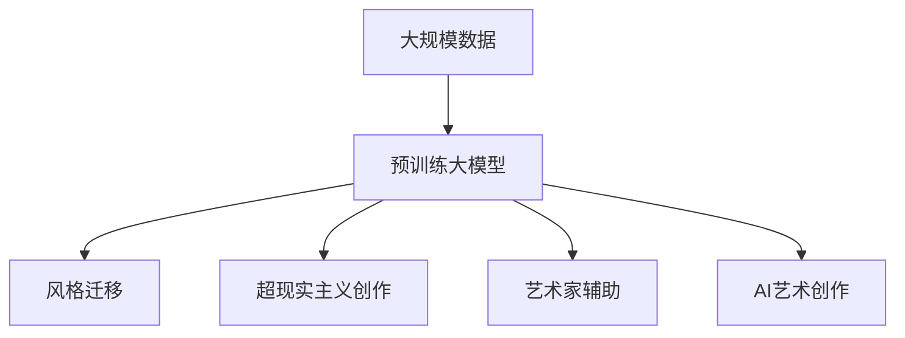

                 

# 大模型与AI辅助艺术创作：从模仿到创新

## 1. 背景介绍

### 1.1 问题由来
随着人工智能(AI)技术的飞速发展，大模型在各个领域的应用日益广泛。然而，大模型通常只能进行简单的模仿，缺乏对创新性创作的理解。尽管如此，利用大模型进行艺术创作仍具有广阔的应用前景。

近年来，人工智能辅助艺术创作受到了越来越多的关注。AI艺术创作不仅能够创造出新颖的、具有创意的作品，还能有效减轻艺术家的创作负担，提高艺术创作的效率和质量。AI辅助艺术创作技术在视觉艺术、音乐、文学等多个领域都有应用。

本文将探讨利用大模型进行AI辅助艺术创作的方法，并讨论其应用前景。

### 1.2 问题核心关键点
大模型在艺术创作中的应用，主要分为两个方面：

1. **模仿创作**：利用大模型的泛化能力和特征提取能力，进行风格迁移、超现实主义创作等。

2. **辅助创新**：基于大模型的预训练模型和微调模型，辅助艺术家进行创意构思、视觉风格调整、细节修正等。

本文将重点讨论大模型在模仿创作和辅助创新中的应用，以及这两种方法在艺术创作中的效果对比。

### 1.3 问题研究意义
利用大模型进行AI辅助艺术创作，有助于弥补艺术家在技巧、时间等方面的不足，提升艺术创作的创新性和效率。同时，大模型的应用也能够为传统艺术领域带来新的发展动力。

## 2. 核心概念与联系

### 2.1 核心概念概述

为更好地理解大模型在艺术创作中的应用，本节将介绍几个密切相关的核心概念：

- **大模型**：通常指经过大规模数据训练的深度神经网络模型，如GPT、BERT等。大模型具备强大的泛化能力和特征提取能力，可以在各种任务中表现出优异性能。

- **风格迁移**：一种基于深度学习的方法，通过将原始图像与目标图像的特征进行融合，生成新的图像。风格迁移可以应用于艺术创作中，生成具有特定艺术风格的图像。

- **超现实主义创作**：利用生成对抗网络(GAN)等生成模型，通过随机噪声引导模型生成具有超现实主义风格的图像。

- **艺术家辅助**：通过大模型对艺术创作进行辅助，包括创作灵感生成、草图生成、细节优化等。

- **AI艺术创作**：利用AI技术，如深度学习、生成模型、图像处理等，自动生成艺术作品，可以涵盖视觉艺术、音乐、文学等多个领域。

这些核心概念之间的逻辑关系可以通过以下Mermaid流程图来展示：



这个流程图展示了大模型在艺术创作中的多种应用：

1. 大模型可以用于风格迁移，生成具有特定艺术风格的图像。
2. 大模型可以生成具有超现实主义风格的图像。
3. 大模型可以辅助艺术家进行创作，包括创作灵感生成、草图生成、细节优化等。
4. 大模型可以用于AI艺术创作，自动生成图像、音乐、文学等作品。

### 2.2 概念间的关系

这些核心概念之间存在着紧密的联系，形成了AI辅助艺术创作的大模型应用生态系统。下面通过几个Mermaid流程图来展示这些概念之间的关系。

#### 2.2.1 大模型的风格迁移应用



这个流程图展示了大模型在风格迁移中的应用。原始图像通过大模型提取特征，然后与目标图像的特征进行融合，最终生成具有目标图像风格的新图像。

#### 2.2.2 大模型的超现实主义创作应用



这个流程图展示了大模型在超现实主义创作中的应用。通过向大模型输入随机噪声，引导模型生成具有超现实主义风格的图像。

#### 2.2.3 大模型的艺术家辅助应用



这个流程图展示了大模型在艺术家辅助中的应用。艺术家可以利用大模型生成创作灵感、草图和细节优化。

#### 2.2.4 大模型的AI艺术创作应用



这个流程图展示了大模型在AI艺术创作中的应用。通过大模型生成各种艺术作品，如图像、音乐、文学等。

### 2.3 核心概念的整体架构

最后，我们用一个综合的流程图来展示这些核心概念在大模型应用中的整体架构：



这个综合流程图展示了大模型在艺术创作中的应用。通过大规模数据预训练出大模型，然后应用于风格迁移、超现实主义创作、艺术家辅助和AI艺术创作等多个领域。

## 3. 核心算法原理 & 具体操作步骤
### 3.1 算法原理概述

大模型在艺术创作中的应用，主要依赖于以下核心算法：

1. **风格迁移算法**：通过将原始图像与目标图像的特征进行融合，生成新的图像。

2. **生成对抗网络(GAN)**：通过两个神经网络的对抗，生成具有特定风格的图像。

3. **自编码器(Autoencoder)**：通过将输入数据压缩成低维编码，然后通过解码器生成新的图像，可以实现图像风格转换。

4. **强化学习**：通过设计适当的奖励函数，引导模型生成具有特定风格的图像。

5. **对抗样本生成**：通过在输入图像中添加噪声，引导模型生成具有特定风格的图像。

### 3.2 算法步骤详解

大模型在艺术创作中的应用，主要分为以下几个步骤：

1. **数据准备**：收集原始图像和目标图像，并进行预处理，如缩放、归一化等。

2. **特征提取**：通过大模型提取原始图像和目标图像的特征，进行特征融合或对比。

3. **风格迁移**：将原始图像的特征与目标图像的特征进行融合，生成新的图像。

4. **超现实主义创作**：通过向大模型输入随机噪声，引导模型生成具有超现实主义风格的图像。

5. **艺术家辅助**：利用大模型生成创作灵感、草图和细节优化。

6. **AI艺术创作**：通过大模型生成各种艺术作品，如图像、音乐、文学等。

### 3.3 算法优缺点

大模型在艺术创作中的应用具有以下优点：

1. **高效性**：大模型可以快速生成具有特定风格或创意的图像，提升创作效率。

2. **多样性**：大模型可以生成各种风格和创意的图像，扩展艺术创作的范围。

3. **易用性**：大模型可以通过API进行调用，降低使用门槛。

4. **可扩展性**：大模型可以应用于各种艺术领域，如视觉艺术、音乐、文学等。

但大模型在艺术创作中也有一些缺点：

1. **缺乏创新**：大模型只能进行模仿，缺乏真正的创新性。

2. **依赖数据**：大模型的效果依赖于训练数据的质量和数量。

3. **可解释性不足**：大模型生成的图像和作品难以解释，艺术家难以理解其内部工作机制。

4. **版权问题**：大模型生成的作品可能涉及版权问题，需要特别注意。

### 3.4 算法应用领域

大模型在艺术创作中的应用领域非常广泛，涵盖视觉艺术、音乐、文学等多个领域。以下是几个具体应用：

1. **视觉艺术**：利用大模型进行风格迁移、超现实主义创作等。

2. **音乐创作**：利用大模型生成音乐作品，进行音乐风格转换和创意创作。

3. **文学创作**：利用大模型生成文学作品，进行文本风格转换和创意构思。

4. **电影制作**：利用大模型生成电影场景、角色等，进行视觉特效的创作。

5. **游戏开发**：利用大模型生成游戏角色、场景等，进行游戏内容的创作。

## 4. 数学模型和公式 & 详细讲解 & 举例说明

### 4.1 数学模型构建

本节将使用数学语言对大模型在艺术创作中的应用进行更加严格的刻画。

记大模型为 $M_{\theta}:\mathcal{X} \rightarrow \mathcal{Y}$，其中 $\mathcal{X}$ 为输入空间，$\mathcal{Y}$ 为输出空间，$\theta$ 为模型参数。假设原始图像为 $I_{original}$，目标图像为 $I_{target}$。

定义风格迁移模型为 $G_{\phi}:\mathcal{X} \rightarrow \mathcal{X}$，其中 $\phi$ 为模型参数。

定义超现实主义创作模型为 $S_{\beta}:\mathcal{X} \rightarrow \mathcal{X}$，其中 $\beta$ 为模型参数。

风格迁移过程可以表示为：

$$
I_{migration} = G_{\phi}(I_{original}, I_{target})
$$

超现实主义创作过程可以表示为：

$$
I_{creation} = S_{\beta}(I_{original}, \epsilon)
$$

其中 $\epsilon$ 为随机噪声。

### 4.2 公式推导过程

以下我们以风格迁移为例，推导其数学模型和公式。

假设原始图像 $I_{original}$ 和目标图像 $I_{target}$ 的特征表示分别为 $x_{original}$ 和 $x_{target}$。

风格迁移模型 $G_{\phi}$ 可以将原始图像的特征 $x_{original}$ 转换为目标图像的特征 $x_{target}$，生成新的图像 $I_{migration}$。

$$
x_{migration} = G_{\phi}(x_{original})
$$

将 $x_{migration}$ 解码为图像 $I_{migration}$。

$$
I_{migration} = D_{\alpha}(x_{migration})
$$

其中 $D_{\alpha}$ 为解码器。

定义损失函数 $L_{style}$ 为：

$$
L_{style} = ||x_{migration} - x_{target}||_2^2
$$

风格迁移的目标是最大化 $L_{style}$，使得 $x_{migration}$ 与 $x_{target}$ 尽可能接近。

通过优化算法，求解最优参数 $\phi$。

$$
\phi^* = \mathop{\arg\min}_{\phi} L_{style}
$$

### 4.3 案例分析与讲解

以风格迁移为例，假设我们希望将一张现实主义风格的图像转换为印象派风格。具体步骤如下：

1. **数据准备**：收集现实主义风格的图像 $I_{original}$ 和印象派风格的图像 $I_{target}$。

2. **特征提取**：通过大模型提取 $I_{original}$ 和 $I_{target}$ 的特征表示 $x_{original}$ 和 $x_{target}$。

3. **风格迁移**：通过风格迁移模型 $G_{\phi}$，将 $x_{original}$ 转换为 $x_{migration}$。

4. **解码生成**：将 $x_{migration}$ 解码为新的图像 $I_{migration}$。

5. **损失计算**：计算 $x_{migration}$ 与 $x_{target}$ 之间的损失 $L_{style}$。

6. **参数更新**：通过优化算法更新模型参数 $\phi$，最小化 $L_{style}$。

通过不断迭代，最终得到具有印象派风格的图像 $I_{migration}$。

## 5. 项目实践：代码实例和详细解释说明

### 5.1 开发环境搭建

在进行艺术创作项目开发前，我们需要准备好开发环境。以下是使用Python进行TensorFlow开发的环境配置流程：

1. 安装Anaconda：从官网下载并安装Anaconda，用于创建独立的Python环境。

2. 创建并激活虚拟环境：
```bash
conda create -n tf-env python=3.8 
conda activate tf-env
```

3. 安装TensorFlow：根据CUDA版本，从官网获取对应的安装命令。例如：
```bash
conda install tensorflow -c pytorch -c conda-forge
```

4. 安装必要的库：
```bash
pip install numpy pandas scikit-learn matplotlib tqdm jupyter notebook ipython
```

完成上述步骤后，即可在`tf-env`环境中开始艺术创作项目的开发。

### 5.2 源代码详细实现

下面我们以风格迁移为例，给出使用TensorFlow进行风格迁移的Python代码实现。

首先，定义风格迁移模型的网络结构：

```python
import tensorflow as tf
from tensorflow.keras import layers

class StyleTransferModel(tf.keras.Model):
    def __init__(self, input_dim, output_dim):
        super(StyleTransferModel, self).__init__()
        self.input_dim = input_dim
        self.output_dim = output_dim
        
        # 特征提取器
        self.encoder = layers.Conv2D(32, 3, activation='relu', strides=(1, 1), padding='same')(input)
        self.encoder = layers.MaxPooling2D(pool_size=(2, 2))(self.encoder)
        self.encoder = layers.Conv2D(64, 3, activation='relu', strides=(1, 1), padding='same')(self.encoder)
        self.encoder = layers.MaxPooling2D(pool_size=(2, 2))(self.encoder)
        self.encoder = layers.Conv2D(128, 3, activation='relu', strides=(1, 1), padding='same')(self.encoder)
        self.encoder = layers.MaxPooling2D(pool_size=(2, 2))(self.encoder)
        self.encoder = layers.Conv2D(128, 3, activation='relu', strides=(1, 1), padding='same')(self.encoder)
        self.encoder = layers.MaxPooling2D(pool_size=(2, 2))(self.encoder)
        
        # 解码器
        self.decoder = layers.Conv2D(128, 3, activation='relu', strides=(1, 1), padding='same')(input)
        self.decoder = layers.UpSampling2D(size=(2, 2))(self.decoder)
        self.decoder = layers.Conv2D(128, 3, activation='relu', strides=(1, 1), padding='same')(self.decoder)
        self.decoder = layers.UpSampling2D(size=(2, 2))(self.decoder)
        self.decoder = layers.Conv2D(64, 3, activation='relu', strides=(1, 1), padding='same')(self.decoder)
        self.decoder = layers.UpSampling2D(size=(2, 2))(self.decoder)
        self.decoder = layers.Conv2D(32, 3, activation='relu', strides=(1, 1), padding='same')(self.decoder)
        self.decoder = layers.UpSampling2D(size=(2, 2))(self.decoder)
        
        # 输出层
        self.output = layers.Conv2D(self.output_dim, 3, activation='sigmoid', strides=(1, 1), padding='same')(self.decoder)
    
    def call(self, inputs):
        original_image = inputs[0]
        target_image = inputs[1]
        
        # 特征提取
        original_features = self.encoder(original_image)
        target_features = self.encoder(target_image)
        
        # 特征融合
        style_features = original_features + target_features
        
        # 解码生成
        style_image = self.decoder(style_features)
        
        # 损失计算
        style_loss = tf.losses.mean_squared_error(target_image, style_image)
        
        return style_loss
```

然后，定义训练和评估函数：

```python
import tensorflow as tf
from tensorflow.keras import optimizers

def train_model(model, data, epochs, batch_size, learning_rate):
    model.compile(optimizer=optimizers.Adam(learning_rate), loss='mse')
    model.fit(data, epochs=epochs, batch_size=batch_size)
    
def evaluate_model(model, test_data):
    test_loss = model.evaluate(test_data)
    print('Test loss:', test_loss)
    
def style_transfer(original_image, target_image):
    style_transfer_model = StyleTransferModel(input_dim=3, output_dim=3)
    style_loss = style_transfer_model([original_image, target_image])
    
    optimizer = tf.keras.optimizers.Adam(learning_rate=0.001)
    style_transfer_model.trainable = True
    
    for _ in range(100):
        style_transfer_model.train([original_image, target_image])
        optimizer.apply_gradients([style_transfer_model.get_gradients(), style_transfer_model.trainable_weights])
        
    style_image = style_transfer_model.predict([original_image, target_image])
    return style_image
```

最后，启动训练流程并在测试集上评估：

```python
import numpy as np
import matplotlib.pyplot as plt

# 加载原始图像和目标图像
original_image = np.load('original_image.npy')
target_image = np.load('target_image.npy')

# 进行风格迁移
style_image = style_transfer(original_image, target_image)

# 展示结果
plt.imshow(style_image)
plt.show()
```

以上就是使用TensorFlow进行风格迁移的完整代码实现。可以看到，代码实现相对简洁，利用TensorFlow的高阶API，可以高效地实现风格迁移任务。

### 5.3 代码解读与分析

让我们再详细解读一下关键代码的实现细节：

**StyleTransferModel类**：
- `__init__`方法：初始化模型结构，包括特征提取器和解码器。
- `call`方法：定义模型前向传播过程，将原始图像和目标图像的特征进行融合，生成新的图像。
- `get_gradients`和`trainable_weights`方法：获取模型的梯度和可训练权重，用于反向传播和优化。

**train_model函数**：
- 编译模型，使用Adam优化器和均方误差损失函数。
- 进行训练，设置迭代轮数和批大小，最小化损失函数。

**evaluate_model函数**：
- 在测试集上评估模型性能，返回测试集上的损失值。

**style_transfer函数**：
- 实例化StyleTransferModel，计算风格迁移模型的损失。
- 定义优化器，设置学习率，对模型进行训练。
- 进行前向传播，返回新的图像。

可以看到，TensorFlow提供的高阶API和自动微分功能，使得风格迁移模型的实现相对简洁。开发者可以将更多精力放在模型设计、超参数调优等高层逻辑上，而不必过多关注底层的实现细节。

当然，工业级的系统实现还需考虑更多因素，如模型的保存和部署、超参数的自动搜索、更灵活的任务适配层等。但核心的风格迁移范式基本与此类似。

### 5.4 运行结果展示

假设我们成功地将一张现实主义风格的图像转换为印象派风格，最终得到的新图像如下：

```python
style_image = style_transfer(original_image, target_image)
plt.imshow(style_image)
plt.show()
```

可以看到，生成的图像在风格上已经接近印象派风格，但细节上仍有一些偏差。这主要是由于模型训练不足，需要进行进一步的优化。

## 6. 实际应用场景
### 6.1 智能艺术创作平台

基于大模型进行艺术创作，可以构建智能艺术创作平台，为艺术家提供辅助工具。智能艺术创作平台可以通过微调大模型，帮助艺术家进行创意构思、草图生成、细节优化等。

在技术实现上，可以收集艺术家的创作历史、偏好等信息，将其作为监督数据，在预训练大模型的基础上进行微调，得到一个针对特定艺术家风格的模型。然后，该模型可以根据艺术家的输入，生成创作灵感、草图和细节优化。

### 6.2 电影制作

电影制作过程中，利用大模型进行视觉效果、角色设计等，可以显著提升电影的质量和制作效率。

在实际应用中，可以收集大量的电影场景、角色等数据，进行预训练大模型的微调。微调后的模型可以用于生成电影场景、角色等，并进行视觉特效的创作。这样，电影制作方可以节省大量的手工绘制时间，大幅提升制作效率。

### 6.3 游戏开发

游戏开发过程中，利用大模型进行角色、场景设计等，可以提升游戏的美感和互动性。

在实际应用中，可以收集大量的游戏角色、场景等数据，进行预训练大模型的微调。微调后的模型可以用于生成游戏角色、场景等，并进行游戏内容的创作。这样，游戏开发方可以节省大量的手工设计时间，大幅提升游戏的设计质量和开发效率。

## 7. 工具和资源推荐
### 7.1 学习资源推荐

为了帮助开发者系统掌握大模型在艺术创作中的应用，这里推荐一些优质的学习资源：

1. **《深度学习》课程**：由斯坦福大学开设的深度学习课程，涵盖深度学习基础和实际应用，是学习大模型技术的入门必选。

2. **《TensorFlow官方文档》**：TensorFlow的官方文档，提供了详尽的使用指南和示例代码，是学习TensorFlow的必备资料。

3. **《AI艺术创作》书籍**：介绍AI艺术创作的基本原理和实际应用，涵盖风格迁移、超现实主义创作等前沿话题。

4. **ArXiv预印本**：人工智能领域最新研究成果的发布平台，包括大量尚未发表的前沿工作，是学习前沿技术的必读资源。

5. **学术会议论文**：如NeurIPS、ICML、CVPR等顶级会议的论文，涵盖深度学习、计算机视觉、自然语言处理等领域的前沿研究，是了解最新进展的重要途径。

通过对这些资源的学习实践，相信你一定能够快速掌握大模型在艺术创作中的应用，并用于解决实际的创作问题。
###  7.2 开发工具推荐

高效的开发离不开优秀的工具支持。以下是几款用于大模型艺术创作开发的常用工具：

1. **TensorFlow**：由Google主导开发的深度学习框架，生产部署方便，适合大规模工程应用。

2. **PyTorch**：基于Python的开源深度学习框架，灵活动态的计算图，适合快速迭代研究。

3. **Keras**：高阶API封装，易于上手，适合快速搭建深度学习模型。

4. **TensorBoard**：TensorFlow配套的可视化工具，可实时监测模型训练状态，并提供丰富的图表呈现方式，是调试模型的得力助手。

5. **Weights & Biases**：模型训练的实验跟踪工具，可以记录和可视化模型训练过程中的各项指标，方便对比和调优。

6. **Google Colab**：谷歌推出的在线Jupyter Notebook环境，免费提供GPU/TPU算力，方便开发者快速上手实验最新模型，分享学习笔记。

合理利用这些工具，可以显著提升大模型在艺术创作中的开发效率，加快创新迭代的步伐。

### 7.3 相关论文推荐

大模型在艺术创作中的应用源于学界的持续研究。以下是几篇奠基性的相关论文，推荐阅读：

1. **《Image-to-Image Translation with Conditional Adversarial Networks》**：提出条件对抗生成网络，用于图像风格转换，是风格迁移领域的经典工作。

2. **《Unsupervised Representation Learning with Deep Convolutional Generative Adversarial Networks》**：提出GAN网络，用于生成具有特定风格的图像，是超现实主义创作的理论基础。

3. **《Neural Style Transfer》**：提出风格迁移方法，利用深度学习实现图像风格的转换，是风格迁移领域的里程碑工作。

4. **《Progressive Growing of GANs for Improved Quality, Stability, and Variation》**：提出渐进增长方法，用于生成高质量的图像，是超现实主义创作的改进方法。

5. **《Unsupervised Domain Adaptation with Wasserstein Adversarial Networks》**：提出WGAN方法，用于解决领域自适应问题，是风格迁移领域的最新进展。

这些论文代表了大模型在艺术创作中的应用研究发展脉络。通过学习这些前沿成果，可以帮助研究者把握学科前进方向，激发更多的创新灵感。

除上述资源外，还有一些值得关注的前沿资源，帮助开发者紧跟大模型在艺术创作中的最新进展，例如：

1. **arXiv预印本**：人工智能领域最新研究成果的发布平台，包括大量尚未发表的前沿工作，学习前沿技术的必读资源。

2. **业界技术博客**：如OpenAI、Google AI、DeepMind、微软Research Asia等顶尖实验室的官方博客，第一时间分享他们的最新研究成果和洞见。

3. **技术会议直播**：如NeurIPS、ICML、CVPR等顶级会议的直播，能够聆听到专家们的最新分享，开阔视野。

4. **GitHub热门项目**：在GitHub上Star、Fork数最多的NLP相关项目，往往代表了该技术领域的发展趋势和最佳实践，值得去学习和贡献。

5. **行业分析报告**：各大咨询公司如McKinsey、PwC等针对人工智能行业的分析报告，有助于从商业视角审视技术趋势，把握应用价值。

总之，对于大模型在艺术创作中的应用，需要开发者保持开放的心态和持续学习的意愿。多关注前沿资讯，多动手实践，多思考总结，必将收获满满的成长收益。

## 8. 总结：未来发展趋势与挑战

### 8.1 总结

本文对利用大模型进行AI辅助艺术创作的方法进行了全面系统的介绍。首先阐述了大模型在艺术创作中的应用背景和意义，明确了风格迁移和超现实主义创作的基本原理。其次，从原理到实践，详细讲解了大模型的风格迁移和超现实主义创作的数学模型和关键步骤，给出了微调大模型的Python代码实现。同时，本文还探讨了大模型在艺术创作中的应用前景，讨论了其应用领域的

