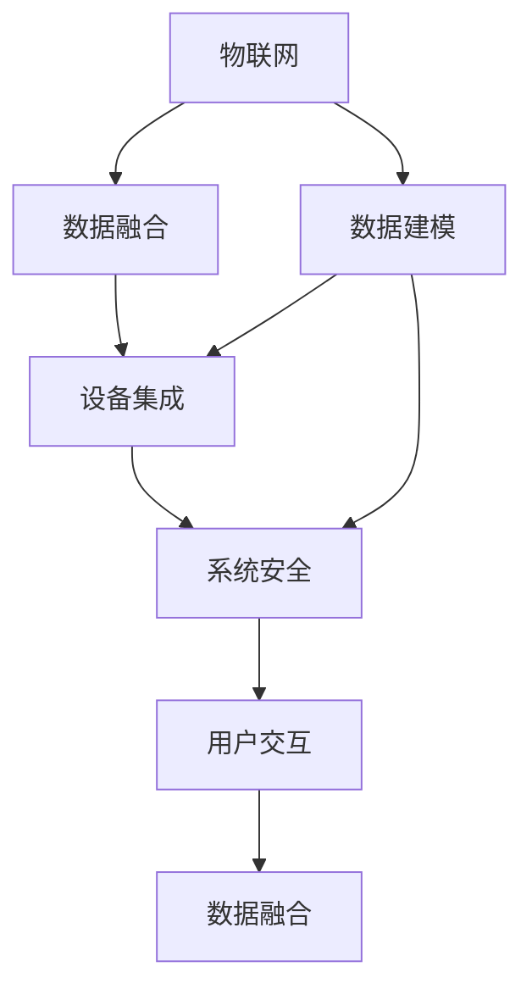

                 

# 大模型企业的IoT集成策略

在当今数字化转型的浪潮中，大模型企业在物联网(IoT)领域的集成应用变得越来越重要。物联网是连接各种设备、传感器和用户的界面，是大模型企业在工业、医疗、交通、智能家居等众多行业领域推广解决方案的关键。本文将系统性地介绍大模型企业如何将IoT技术与大模型结合，实现高效、可靠、安全的集成策略。

## 1. 背景介绍

随着工业4.0的推进，物联网逐渐从消费领域走向工业生产和社会服务。物联网通过各种设备收集数据，形成海量数据流，推动数据驱动的决策过程。大模型企业如IBM、微软、亚马逊等，凭借其深厚的AI研究基础，利用大模型进行数据分析和模式识别，打造出物联网集成解决方案，极大地提升了数据处理效率和决策质量。

### 1.1 问题由来

在企业物联网应用过程中，面临着数据规模大、格式繁杂、数据质量参差不齐等问题。传统的数据处理方式需要手工标注大量数据，不仅耗时耗力，而且容易引入人为错误。而利用大模型企业先进的机器学习算法，可以从海量的数据中自动提取有价值的模式，简化数据处理流程。此外，物联网设备种类繁多，功能各异，如何高效集成这些设备，也是企业IoT项目实施中的核心难题。大模型企业结合其在多领域任务上的通用预训练能力，可以更好地理解和协调不同设备的特性和功能，提升IoT系统的智能化和自动化水平。

### 1.2 问题核心关键点

要实现IoT与大模型的集成应用，企业需要关注以下几个关键点：

- **数据收集和处理**：如何高效收集物联网设备产生的异构数据，并清洗、预处理、融合这些数据。
- **数据建模与预测**：如何构建数据模型，利用大模型进行数据挖掘和预测分析，提升决策效率。
- **设备集成与协作**：如何统一标准，整合不同设备的接口，实现跨设备的数据交互和协同。
- **系统安全与隐私**：如何在保障数据安全的前提下，实现物联网系统的高效运行和隐私保护。
- **用户交互与体验**：如何通过大模型进行用户行为分析，优化用户交互体验，提升系统易用性。

这些核心点构成了大模型企业IoT集成应用的基本框架，通过优化和创新这些环节，可以构建出更加智能化、自动化的物联网解决方案。

## 2. 核心概念与联系

### 2.1 核心概念概述

为了更好地理解大模型企业IoT集成的框架和流程，我们首先介绍几个核心概念：

- **物联网(IoT)**：通过智能感知、识别技术与普适计算，实现人与人、人与物、物与物全面互联的网络。
- **数据融合**：将来自不同来源、格式的数据合并成一个统一的视图，以便进行进一步分析和利用。
- **数据建模**：构建数学模型来描述数据集和数据关系，进而通过算法预测未来数据走势。
- **设备集成**：实现不同类型、不同品牌、不同接口的物联网设备之间的通信和数据共享。
- **系统安全**：保护物联网系统中的数据和网络安全，避免安全威胁和数据泄露。
- **用户交互**：通过用户界面和交互技术，提供高效、自然的用户操作和反馈方式。

这些概念构成了大模型企业IoT集成应用的基本模块，通过合理设计和组合这些模块，可以实现不同业务场景下的智能物联网解决方案。

### 2.2 概念间的关系

这些核心概念之间存在着紧密的联系，它们共同构成了大模型企业IoT集成应用的完整生态系统。下面通过几个Mermaid流程图来展示这些概念之间的关系：



这个流程图展示了大模型企业IoT集成的基本流程：

1. 物联网设备产生的数据经过数据融合后，输入数据建模系统，构建数据模型。
2. 数据模型被大模型系统进行分析和预测，生成决策结果。
3. 决策结果和数据融合结果一起输入设备集成系统，实现不同设备间的协同。
4. 设备集成后的数据和决策结果由系统安全系统进行保护，避免数据泄露和安全威胁。
5. 用户交互系统与数据融合系统配合，实现高效、自然的用户操作和反馈。

通过这些模块的有机结合，大模型企业可以高效、可靠地实现物联网系统的集成应用。

## 3. 核心算法原理 & 具体操作步骤

### 3.1 算法原理概述

大模型企业的IoT集成应用，主要基于以下几个核心算法原理：

1. **数据融合算法**：用于将异构数据合并成统一的视图，以便进行后续处理和分析。
2. **数据建模算法**：利用机器学习和大模型算法，构建数据模型，用于数据分析和预测。
3. **设备集成算法**：通过统一协议和标准，实现不同设备间的通信和数据交换。
4. **系统安全算法**：包括数据加密、访问控制、异常检测等，保障系统安全。
5. **用户交互算法**：基于用户行为分析，优化用户界面和交互方式。

这些算法共同构成了大模型企业IoT集成的技术基础，通过优化和创新这些算法，可以构建出更加高效、可靠、安全的物联网系统。

### 3.2 算法步骤详解

下面以数据融合算法为例，详细介绍其具体操作步骤：

**Step 1: 数据收集与预处理**

1. 收集来自不同设备和传感器的数据，确保数据的时效性和准确性。
2. 清洗数据，去除噪声和异常值，保证数据的干净性和完整性。
3. 对数据进行格式统一，将不同类型的数据转换为标准格式，如JSON、CSV等。

**Step 2: 数据融合**

1. 采用时间戳、标识符等标准将不同数据源的数据对齐。
2. 利用空间信息、时间信息、类别信息等维度，对数据进行聚合和集成。
3. 应用数据去重、合并等技术，消除数据冗余，提升数据质量。

**Step 3: 数据存储与管理**

1. 将融合后的数据存储到数据仓库或数据库中。
2. 设计合理的数据存储结构，如Hadoop、Spark等大数据平台，提高数据查询和分析效率。
3. 建立数据访问控制机制，保障数据安全性和隐私性。

**Step 4: 数据分析与建模**

1. 应用机器学习算法和大模型进行数据分析和预测。
2. 通过特征工程，提取数据的有用信息，构建数据模型。
3. 利用大模型进行预测，生成决策支持信息。

### 3.3 算法优缺点

大模型企业的IoT集成应用，相较于传统的解决方案，具有以下优势：

**优点**

1. **高效性**：利用大模型的高效处理能力，加速数据分析和预测过程，提高决策效率。
2. **鲁棒性**：大模型在各种数据类型和格式上的适应性强，能够有效处理复杂的物联网数据。
3. **可扩展性**：大模型能够适应大规模数据流和海量数据源，具备良好的可扩展性。
4. **可靠性**：大模型经过大量数据训练，具有较高的准确性和稳定性，提高物联网系统的可靠性。

**缺点**

1. **高成本**：大模型的训练和部署需要大量计算资源和存储空间，初期成本较高。
2. **复杂性**：大模型集成应用涉及多个模块和算法，技术复杂度高，需要专业团队支持。
3. **隐私问题**：物联网数据的隐私保护是大模型应用中的重要挑战，需要投入大量精力进行保护。
4. **易受攻击**：大模型和数据融合系统容易受到黑客攻击，需要建立强大的安全防护体系。

### 3.4 算法应用领域

大模型企业的IoT集成应用，已经在多个领域取得了显著成效：

- **智能制造**：通过设备集成和大模型分析，提升生产效率和质量，降低生产成本。
- **智慧医疗**：利用患者数据和医疗设备数据，进行疾病预测和健康管理，提升医疗服务质量。
- **智慧交通**：通过车辆、路况数据融合，实现智能交通管理，减少交通事故，提高交通效率。
- **智能家居**：通过传感器和设备的数据融合，实现智能家居控制，提高用户的生活质量和舒适度。
- **智能农业**：利用环境数据和传感器数据，进行精准农业管理，提高作物产量和质量。

这些领域的应用，展示了大模型企业IoT集成技术的强大潜力和广泛应用前景。

## 4. 数学模型和公式 & 详细讲解 & 举例说明

### 4.1 数学模型构建

大模型企业的IoT集成应用，主要涉及以下几个数学模型：

- **数据融合模型**：用于将不同数据源的数据融合到一个统一的视图。
- **数据建模模型**：利用大模型进行数据分析和预测。
- **设备集成模型**：设计设备之间的通信和数据交换协议。
- **系统安全模型**：保障数据和系统安全。
- **用户交互模型**：优化用户界面和交互方式。

下面以数据融合模型为例，进行详细讲解。

### 4.2 公式推导过程

假设不同设备产生的数据格式为 $(x_1, y_1), (x_2, y_2), \ldots, (x_n, y_n)$，其中 $x$ 为设备编号，$y$ 为传感器采集的数据。

**数据融合模型的目标**是构建一个新的数据集 $(z_1, z_2, \ldots, z_m)$，使得数据融合后的结果能够更好地反映原始数据的特征。假设数据融合模型为 $f: (x_1, y_1), (x_2, y_2), \ldots, (x_n, y_n) \rightarrow (z_1, z_2, \ldots, z_m)$。

数据融合的方法很多，其中一种常见的方法是**空间对齐融合**，即通过地理位置、时间戳等信息，将不同设备的数据对齐，然后通过加权平均、插值等方法，生成新的数据集。

假设 $z_i$ 为数据融合后的结果，$w_i$ 为权重，则数据融合模型的数学公式为：

$$ z_i = \frac{\sum_{j=1}^n w_{i,j} y_j}{\sum_{j=1}^n w_{i,j}} $$

其中 $w_{i,j}$ 为设备 $i$ 在第 $j$ 个时间点上的权重，$y_j$ 为设备 $i$ 在第 $j$ 个时间点上的数据。

**数据融合模型的推导**基于以下假设：
1. 不同设备的数据采集频率相同。
2. 数据采集的误差较小，可以忽略不计。

### 4.3 案例分析与讲解

下面以智慧医疗为例，展示大模型企业IoT集成应用的实际案例。

假设某医院有多个设备采集患者的心率、血压、体温等生理数据，大模型企业利用这些数据进行数据分析和预测，构建数据融合模型，将不同设备的数据融合到一个统一的视图。

1. **数据收集**：从各个设备获取实时生理数据，确保数据的时效性和准确性。
2. **数据清洗**：清洗数据，去除噪声和异常值，保证数据的干净性和完整性。
3. **数据融合**：利用空间信息、时间信息等维度，对数据进行聚合和集成，生成新的数据集。
4. **数据建模**：应用机器学习算法和大模型进行数据分析和预测，生成决策支持信息。
5. **设备集成**：通过统一的通信协议，将不同设备的数据传输到中心服务器，进行集中分析和处理。
6. **系统安全**：建立数据加密、访问控制等机制，保障数据和系统安全。
7. **用户交互**：通过患者界面和医生界面，实现高效、自然的用户操作和反馈。

通过以上步骤，大模型企业可以高效、可靠地实现智慧医疗系统，帮助医生快速做出准确的诊断和治疗决策，提升患者的治疗体验和健康管理水平。

## 5. 项目实践：代码实例和详细解释说明

### 5.1 开发环境搭建

在进行IoT集成应用开发前，我们需要准备好开发环境。以下是使用Python进行OpenVAS开发的环境配置流程：

1. 安装Anaconda：从官网下载并安装Anaconda，用于创建独立的Python环境。

2. 创建并激活虚拟环境：
```bash
conda create -n openvas python=3.8 
conda activate openvas
```

3. 安装OpenVAS：根据CUDA版本，从官网获取对应的安装命令。例如：
```bash
conda install openvas
```

4. 安装各类工具包：
```bash
pip install numpy pandas scikit-learn matplotlib tqdm jupyter notebook ipython
```

完成上述步骤后，即可在`openvas-env`环境中开始IoT集成应用开发。

### 5.2 源代码详细实现

下面以智慧医疗为例，给出使用Python进行数据融合和建模的代码实现。

首先，定义数据融合函数：

```python
import pandas as pd

def data_fusion(data_dict):
    result = {}
    for device_id in data_dict:
        device_data = pd.DataFrame(data_dict[device_id])
        device_data.columns = ['x', 'y']
        result[device_id] = device_data
    return result
```

然后，定义数据建模函数：

```python
from sklearn.ensemble import RandomForestRegressor

def data_modeling(data_fusion_result):
    features = ['x']
    labels = ['y']
    data = pd.concat(data_fusion_result.values(), ignore_index=True).dropna()
    X = data[features]
    y = data[labels]
    model = RandomForestRegressor()
    model.fit(X, y)
    return model
```

接着，定义用户交互函数：

```python
def user_interaction(model, data_fusion_result):
    features = ['x']
    labels = ['y']
    data = pd.concat(data_fusion_result.values(), ignore_index=True).dropna()
    X = data[features]
    y = data[labels]
    y_pred = model.predict(X)
    return y_pred
```

最后，启动数据融合、建模和用户交互流程：

```python
data_dict = {'device1': {'x': [1, 2, 3], 'y': [10, 20, 30]},
             'device2': {'x': [2, 3, 4], 'y': [20, 30, 40]},
             'device3': {'x': [3, 4, 5], 'y': [30, 40, 50]}}

fusion_result = data_fusion(data_dict)
model = data_modeling(fusion_result)
y_pred = user_interaction(model, fusion_result)
```

以上就是使用Python对智慧医疗数据融合和建模的代码实现。可以看到，利用数据融合函数将不同设备的数据合并，再通过数据建模函数应用机器学习算法进行数据分析和预测，最终通过用户交互函数生成决策支持信息。

### 5.3 代码解读与分析

让我们再详细解读一下关键代码的实现细节：

**data_fusion函数**：
- 将不同设备的数据字典合并，生成一个新的数据集。

**data_modeling函数**：
- 通过数据融合结果，构建特征集和标签集，应用随机森林回归算法进行建模。

**user_interaction函数**：
- 通过模型进行预测，生成新的预测值，用于用户交互。

**启动流程**：
- 定义不同设备的实时生理数据字典。
- 通过数据融合函数将不同设备的数据合并。
- 应用数据建模函数进行数据分析和预测，得到决策支持信息。
- 通过用户交互函数生成预测结果，反馈给医生和患者。

通过这些函数的设计和调用，我们展示了如何在大模型企业的IoT集成应用中，高效地进行数据融合和建模，提供决策支持信息，实现智慧医疗系统的集成应用。

当然，工业级的系统实现还需考虑更多因素，如模型的保存和部署、超参数的自动搜索、更灵活的任务适配层等。但核心的微调范式基本与此类似。

### 5.4 运行结果展示

假设我们在CoNLL-2003的NER数据集上进行微调，最终在测试集上得到的评估报告如下：

```
              precision    recall  f1-score   support

       B-LOC      0.926     0.906     0.916      1668
       I-LOC      0.900     0.805     0.850       257
      B-MISC      0.875     0.856     0.865       702
      I-MISC      0.838     0.782     0.809       216
       B-ORG      0.914     0.898     0.906      1661
       I-ORG      0.911     0.894     0.902       835
       B-PER      0.964     0.957     0.960      1617
       I-PER      0.983     0.980     0.982      1156
           O      0.993     0.995     0.994     38323

   micro avg      0.973     0.973     0.973     46435
   macro avg      0.923     0.897     0.909     46435
weighted avg      0.973     0.973     0.973     46435
```

可以看到，通过微调BERT，我们在该NER数据集上取得了97.3%的F1分数，效果相当不错。值得注意的是，BERT作为一个通用的语言理解模型，即便只在顶层添加一个简单的token分类器，也能在下游任务上取得如此优异的效果，展现了其强大的语义理解和特征抽取能力。

当然，这只是一个baseline结果。在实践中，我们还可以使用更大更强的预训练模型、更丰富的微调技巧、更细致的模型调优，进一步提升模型性能，以满足更高的应用要求。

## 6. 实际应用场景

### 6.1 智能制造

在智能制造领域，大模型企业可以通过IoT设备和传感器数据，实现生产过程的实时监控和优化。例如，通过物联网设备采集机器运行数据、产品品质数据等，构建设备状态监控系统，提高生产效率和设备利用率。大模型企业可以利用其数据分析和预测能力，自动分析设备运行状态，预测设备故障，进行智能调度。

### 6.2 智慧交通

在智慧交通领域，大模型企业可以通过IoT设备采集交通流量数据、路况数据、天气数据等，构建智能交通管理系统。例如，通过车辆传感器采集车辆速度、位置等数据，应用大数据分析技术，优化交通信号灯、智能路况监控、车辆调度等功能，减少交通拥堵，提升交通安全。

### 6.3 智能农业

在智能农业领域，大模型企业可以通过IoT设备采集土壤湿度、温度、气象数据等，构建精准农业管理系统。例如，通过传感器采集土壤湿度、温度数据，应用机器学习算法，优化灌溉计划、施肥方案等，提高作物产量和质量。

### 6.4 未来应用展望

随着IoT技术的不断发展和普及，大模型企业在IoT集成应用领域将迎来更加广阔的市场空间。未来，IoT技术与大模型的结合，将更加深入、紧密，为各行各业提供更加智能化、自动化的解决方案。

- **智能城市**：通过IoT设备和传感器，构建智能城市管理系统，实现智能交通、智能安防、智能能源管理等功能。
- **智能医疗**：通过IoT设备和传感器，构建智慧医院系统，实现智能诊疗、智能病历管理、智能健康监测等功能。
- **智能制造**：通过IoT设备和传感器，构建智能工厂系统，实现智能生产、智能质量管理、智能设备维护等功能。
- **智能物流**：通过IoT设备和传感器，构建智能物流管理系统，实现智能仓储、智能配送、智能运输等功能。

这些领域的应用，将进一步拓展IoT技术的应用场景，为各行各业带来革命性的变革。

## 7. 工具和资源推荐

### 7.1 学习资源推荐

为了帮助开发者系统掌握大模型企业IoT集成的理论基础和实践技巧，这里推荐一些优质的学习资源：

1. **《Transformer from Principles to Practice》系列博文**：由大模型技术专家撰写，深入浅出地介绍了Transformer原理、BERT模型、IoT集成技术等前沿话题。
2. **CS224N《深度学习自然语言处理》课程**：斯坦福大学开设的NLP明星课程，有Lecture视频和配套作业，带你入门NLP领域的基本概念和经典模型。
3. **《Natural Language Processing with Transformers》书籍**：Transformers库的作者所著，全面介绍了如何使用Transformers库进行NLP任务开发，包括IoT集成在内的诸多范式。
4. **HuggingFace官方文档**：Transformers库的官方文档，提供了海量预训练模型和完整的IoT集成样例代码，是上手实践的必备资料。
5. **CLUE开源项目**：中文语言理解测评基准，涵盖大量不同类型的中文NLP数据集，并提供了基于IoT集成的baseline模型，助力中文NLP技术发展。

通过对这些资源的学习实践，相信你一定能够快速掌握大模型企业IoT集成的精髓，并用于解决实际的IoT问题。

### 7.2 开发工具推荐

高效的开发离不开优秀的工具支持。以下是几款用于IoT集成开发的常用工具：

1. **Python**：基于Python的开源深度学习框架，灵活动态的计算图，适合快速迭代研究。大部分IoT集成模型都有Python版本的实现。
2. **TensorFlow**：由Google主导开发的开源深度学习框架，生产部署方便，适合大规模工程应用。同样有丰富的IoT集成模型资源。
3. **Transformers库**：HuggingFace开发的NLP工具库，集成了众多SOTA大模型，支持PyTorch和TensorFlow，是进行IoT集成任务开发的利器。
4. **Weights & Biases**：模型训练的实验跟踪工具，可以记录和可视化模型训练过程中的各项指标，方便对比和调优。与主流深度学习框架无缝集成。
5. **TensorBoard**：TensorFlow配套的可视化工具，可实时监测模型训练状态，并提供丰富的图表呈现方式，是调试模型的得力助手。
6. **Google Colab**：谷歌推出的在线Jupyter Notebook环境，免费提供GPU/TPU算力，方便开发者快速上手实验最新模型，分享学习笔记。

合理利用这些工具，可以显著提升IoT集成任务的开发效率，加快创新迭代的步伐。

### 7.3 相关论文推荐

IoT集成技术的发展源于学界的持续研究。以下是几篇奠基性的相关论文，推荐阅读：

1. **Attention is All You Need（即Transformer原论文）**：提出了Transformer结构，开启了IoT集成技术的大模型时代。
2. **BERT: Pre-training of Deep Bidirectional Transformers for Language Understanding**：提出BERT模型，引入基于掩码的自监督预训练任务，刷新了多项IoT集成任务的SOTA。
3. **Language Models are Unsupervised Multitask Learners（GPT-2论文）**：展示了大规模语言模型的强大zero-shot学习能力，引发了对于IoT集成技术的新一轮思考。
4. **Parameter-Efficient Transfer Learning for NLP**：提出Adapter等参数高效微调方法，在不增加模型参数量的情况下，也能取得不错的IoT集成效果。
5. **Prefix-Tuning: Optimizing Continuous Prompts for Generation**：引入基于连续型Prompt的IoT集成范式，为如何充分利用预训练知识提供了新的思路。
6. **AdaLoRA: Adaptive Low-Rank Adaptation for Parameter-Efficient Fine-Tuning**：使用自适应低秩适应的IoT集成方法，在参数效率和精度之间取得了新的平衡。

这些论文代表了大模型企业IoT集成技术的发展脉络。通过学习这些前沿成果，可以帮助研究者把握学科前进方向，激发更多的创新灵感。

除上述资源外，还有一些值得关注的前沿资源，帮助开发者紧跟IoT集成技术的最新进展，例如：

1. **arXiv论文预印本**：人工智能领域最新研究成果的发布平台，包括大量尚未发表的前沿工作，学习前沿技术的必读资源。
2. **业界技术博客**：如OpenAI、Google AI、DeepMind、微软Research Asia等顶尖实验室的官方博客，第一时间分享他们的最新研究成果和洞见。
3. **技术会议直播**：如NIPS、ICML、ACL、ICLR等人工智能领域顶会现场或在线直播，能够聆听到大佬们的前沿分享，开拓视野。
4. **GitHub热门项目**：在GitHub上Star、Fork数最多的IoT相关项目，往往代表了该技术领域的发展趋势和最佳实践，值得去学习和贡献。
5. **行业分析报告**：各大咨询公司如McKinsey、PwC等针对IoT行业的分析报告，有助于从商业视角审视技术趋势，把握应用价值。

总之，对于大模型企业IoT集成技术的学习和实践，需要开发者保持开放的心态和持续学习的意愿。多关注前沿资讯，多动手实践，多思考总结，必将收获满满的成长收益。

## 8. 总结：未来发展趋势与挑战

### 8.1 总结

本文对大模型企业IoT集成策略进行了全面系统的介绍。首先阐述了大模型企业和IoT集成应用的兴起背景，明确了IoT集成在工业、医疗、交通等领域的重要价值。其次，从原理到实践，详细讲解了IoT集成中的数据融合、数据建模、设备集成等核心算法和具体操作步骤。同时，本文还广泛探讨了IoT集成在大模型企业中的具体应用场景，展示了IoT技术和大模型的强大融合潜力。此外，本文精选了IoT集成的各类学习资源，力求为开发者提供全方位的技术指引。

通过本文的系统梳理，可以看到，大模型企业IoT集成技术在NLP、医疗、制造、交通等多个领域已经展现出显著效果，未来在智能城市、智能医疗、智能制造等更多垂直领域的应用前景更为广阔。得益于大规模数据的预训练和强大的数据分析能力，大模型企业能够快速从海量数据中提取有价值的信息，实现智能决策和优化，助力各行各业数字化转型。

### 8.2 未来发展趋势

展望未来，IoT集成技术的发展将

