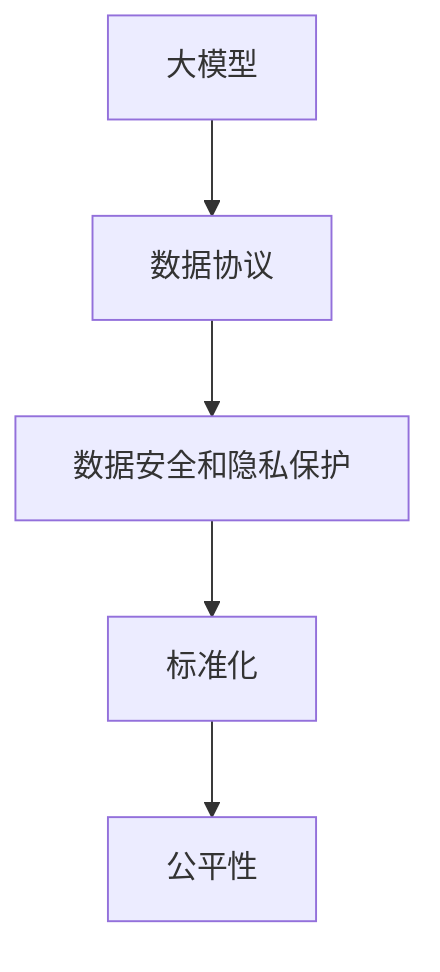
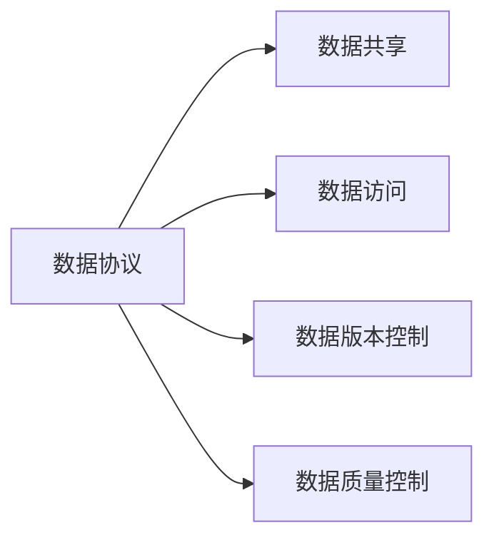
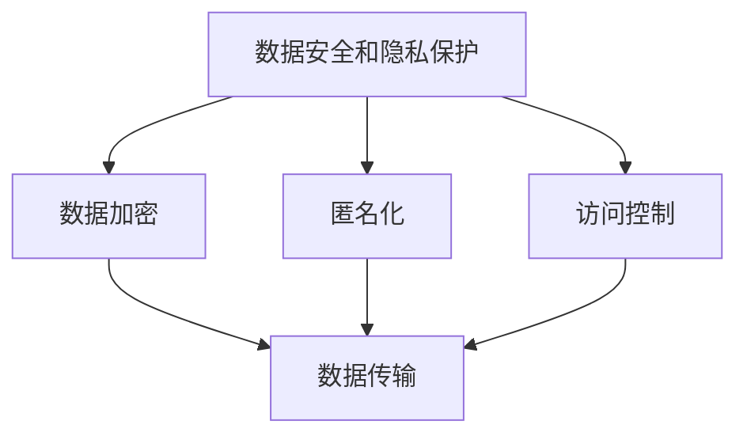
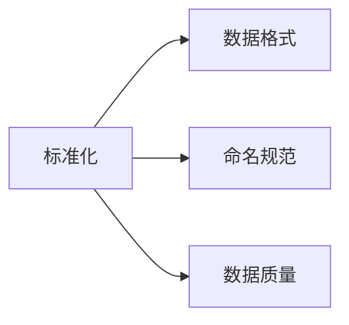
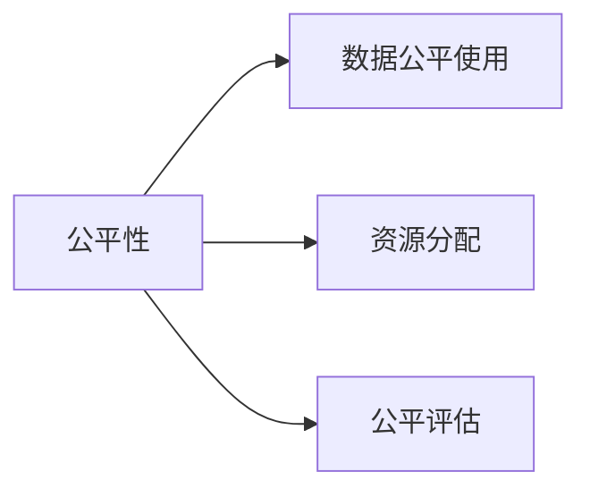

                 

# 大模型时代的开源与数据协议

> 关键词：大模型,开源协议,数据共享,公平性,隐私保护,标准化

## 1. 背景介绍

### 1.1 问题由来
随着深度学习技术和大模型在学术和产业界的蓬勃发展，开源社区逐渐成为推动技术进步和应用落地的重要力量。大模型如GPT-3、BERT等，最初都是通过开源协议和数据协议，在全球科研人员的合作下不断优化和演进。但是，随着大模型的规模不断扩大，其在训练和推理时对数据的需求也急剧增加，导致了数据安全和隐私保护的矛盾。同时，大模型在不同应用场景中的需求也各异，数据共享和标准化成为亟需解决的问题。

### 1.2 问题核心关键点
大模型时代开源与数据协议的核心问题包括：

1. **数据安全和隐私保护**：大模型训练和推理时对数据的依赖性增强，如何保障数据隐私和防止数据泄露成为重要挑战。
2. **数据共享与标准化**：不同研究机构和公司在数据共享时面临标准不一致的问题，缺乏统一的数据协议标准。
3. **公平性问题**：由于数据和模型的不平衡，不同机构或群体获取资源的权利和机会不均等，如何实现公平性是关键点之一。
4. **效率与成本**：大模型在数据收集、存储、传输和处理方面的高效性要求，如何平衡效率和成本是另一个重要问题。

### 1.3 问题研究意义
研究和解决大模型时代的开源与数据协议问题，对于推动大模型技术的普及和应用，保障数据安全和隐私，实现数据公平共享具有重要意义。具体而言：

1. **加速技术发展**：通过开放数据协议和标准，促进大模型技术的快速迭代和优化，加速技术进步。
2. **保障数据隐私**：在数据共享时，通过协议和标准，保障数据隐私和安全，防止数据滥用和泄露。
3. **实现公平共享**：确保不同机构和群体在数据共享时，能够平等获取和使用数据，减少资源鸿沟。
4. **降低成本提高效率**：通过标准化和优化数据协议，提高数据处理和共享的效率，降低技术部署和维护的成本。

## 2. 核心概念与联系

### 2.1 核心概念概述

在大模型时代，开源与数据协议涉及的概念和系统框架非常广泛，以下列出了几个核心概念：

1. **大模型**：指通过深度学习技术训练得到的庞大参数量模型，如GPT-3、BERT等。
2. **数据协议**：定义数据共享、传输和使用规则，包括数据访问权限、使用范围、版本控制等。
3. **数据安全和隐私保护**：涉及数据在收集、存储、传输过程中的安全和隐私保护措施。
4. **标准化**：定义数据格式、命名规范、数据质量等标准，确保数据的一致性和互操作性。
5. **公平性**：保障不同机构和群体在数据共享时，能够平等获取和使用数据。

这些核心概念之间存在紧密联系，形成了一个相互依存、相互促进的体系。下面通过一个Mermaid流程图来展示这些概念之间的关系：



这个流程图展示了数据协议在大模型中的应用和重要性，以及数据安全和隐私保护、标准化和公平性与之的关系。大模型依赖数据协议进行高效的数据共享和传输，而数据安全和隐私保护、标准化和公平性则在大模型数据协议中扮演关键角色。

### 2.2 概念间的关系

这些核心概念之间存在紧密的联系，形成了大模型时代开源与数据协议的完整生态系统。以下通过几个Mermaid流程图来展示这些概念之间的关系。

#### 2.2.1 数据协议在大模型中的应用



这个流程图展示了数据协议在大模型数据共享、访问、版本控制和质量控制中的应用。数据协议通过定义严格的访问权限和控制规则，确保数据共享和使用的安全性，同时通过版本控制和质量控制，保障数据的一致性和准确性。

#### 2.2.2 数据安全和隐私保护在大模型中的实现



这个流程图展示了数据安全和隐私保护在大模型中的应用。数据安全和隐私保护通过数据加密、匿名化和访问控制等措施，确保数据在收集、存储和传输过程中的安全性和隐私保护。

#### 2.2.3 标准化在大模型中的应用



这个流程图展示了标准化在大模型中的应用。标准化通过定义统一的数据格式、命名规范和数据质量标准，确保数据的互操作性和一致性。

#### 2.2.4 公平性在大模型中的保障



这个流程图展示了公平性在大模型中的应用。公平性通过定义数据公平使用规则、资源分配机制和公平评估指标，确保不同机构和群体在数据共享时能够平等获取和使用数据。

## 3. 核心算法原理 & 具体操作步骤
### 3.1 算法原理概述

大模型时代开源与数据协议的核心算法原理包括数据协议的设计、数据安全和隐私保护的实现、标准化和公平性的保障。这些原理和算法通常基于分布式系统和数据管理理论，旨在解决数据共享和使用的复杂问题。

### 3.2 算法步骤详解

基于上述原理，大模型时代开源与数据协议的核心操作步骤包括以下几个步骤：

1. **数据协议设计**：定义数据共享、传输和使用规则，包括访问权限、使用范围、版本控制等。
2. **数据安全和隐私保护**：在数据收集、存储、传输和处理过程中，采取数据加密、匿名化、访问控制等措施，保障数据安全和隐私。
3. **数据标准化**：制定统一的数据格式、命名规范、数据质量标准，确保数据的一致性和互操作性。
4. **公平性保障**：设计公平使用规则、资源分配机制和公平评估指标，确保不同机构和群体在数据共享时能够平等获取和使用数据。

### 3.3 算法优缺点

大模型时代开源与数据协议的优点包括：

- **促进技术发展**：开放数据协议和标准，加速大模型的迭代和优化，推动技术进步。
- **保障数据隐私**：通过协议和标准，保障数据隐私和安全，防止数据滥用和泄露。
- **实现公平共享**：确保不同机构和群体在数据共享时，能够平等获取和使用数据。
- **提高效率降低成本**：通过标准化和优化数据协议，提高数据处理和共享的效率，降低技术部署和维护的成本。

然而，这些协议和算法也存在一些局限性：

- **复杂性高**：数据协议和标准设计复杂，需要多方协调和协商，实施成本较高。
- **标准化难度大**：不同机构和公司之间的数据格式和命名规范可能差异较大，标准化难度大。
- **隐私保护挑战**：在大模型训练和推理时，如何实现数据隐私保护，是一个复杂的技术挑战。
- **公平性难以量化**：公平性问题难以量化，需要结合具体的业务场景进行评估和优化。

### 3.4 算法应用领域

大模型时代开源与数据协议的应用领域非常广泛，主要涵盖以下几个方面：

1. **学术研究**：科研人员通过开放数据协议，共享和利用大规模数据集，推动人工智能和深度学习研究的发展。
2. **产业应用**：企业通过开放数据协议，共享和利用数据，推动大模型在医疗、金融、智能客服等领域的应用。
3. **公共数据**：政府和公共机构通过开放数据协议，共享公共数据，推动社会治理和公共服务的数字化转型。
4. **科研合作**：国际科研机构和公司通过开放数据协议，推动跨国合作，促进科研创新和技术突破。

## 4. 数学模型和公式 & 详细讲解 & 举例说明

### 4.1 数学模型构建

大模型时代开源与数据协议的数学模型主要涉及数据访问控制、数据加密、匿名化等技术。以下是一个基于访问控制的数学模型：

1. **访问控制模型**：定义用户角色和权限，对数据集进行访问控制，确保数据安全和隐私。模型定义如下：
   - 用户集U：定义所有用户，U={u1, u2, ..., un}。
   - 角色集R：定义用户角色，R={r1, r2, ..., rm}。
   - 权限集P：定义用户权限，P={p1, p2, ..., pm}。
   - 访问矩阵A：定义用户角色和权限的关系，A=[aij]，其中a表示角色i对权限j的访问关系。

2. **数据加密模型**：定义数据的加密和解密过程，确保数据在传输和存储过程中的安全。模型定义如下：
   - 数据D：定义要加密的数据，D={d1, d2, ..., dn}。
   - 密钥K：定义加密和解密密钥，K={k1, k2, ..., km}。
   - 加密函数E：定义加密算法，E:D→C，其中C表示加密后的数据。
   - 解密函数D：定义解密算法，D:C→D，其中C表示加密后的数据。

### 4.2 公式推导过程

以下是一个基于访问控制的访问矩阵计算公式：

$$
A_{ij} = \begin{cases}
1, & \text{如果角色i具有权限j} \\
0, & \text{否则}
\end{cases}
$$

该公式表示，角色i对权限j的访问关系，如果角色i具有权限j，则aij=1，否则aij=0。

### 4.3 案例分析与讲解

以下通过一个具体案例，讲解如何应用访问控制模型进行数据访问控制：

假设某公司有三个部门，分别为研发、市场和运营。每个部门都有一组用户，每个用户都有一个角色，如研发经理、市场分析师等。公司有三种权限，分别为读取、写入和删除。公司希望通过访问控制模型，限制用户对数据的访问权限，确保数据安全和隐私。

定义用户集U、角色集R和权限集P如下：

- U={研发经理, 市场分析师, 运营经理}。
- R={研发团队, 市场团队, 运营团队}。
- P={读取, 写入, 删除}。

定义访问矩阵A如下：

$$
A = \begin{bmatrix}
1 & 0 & 0 \\
1 & 0 & 0 \\
1 & 0 & 1
\end{bmatrix}
$$

其中，A的第i行j列表示角色i对权限j的访问关系。例如，A(1, 2)=1表示研发经理具有读取权限，A(3, 3)=1表示运营经理具有读取和写入权限。

通过访问控制模型，公司可以限制用户对数据的访问权限，确保数据安全和隐私。

## 5. 项目实践：代码实例和详细解释说明
### 5.1 开发环境搭建

在进行大模型时代开源与数据协议的开发时，需要搭建开发环境。以下是使用Python进行PyTorch和TensorFlow开发的环境配置流程：

1. 安装Anaconda：从官网下载并安装Anaconda，用于创建独立的Python环境。

2. 创建并激活虚拟环境：
```bash
conda create -n pytorch-env python=3.8 
conda activate pytorch-env
```

3. 安装PyTorch和TensorFlow：根据CUDA版本，从官网获取对应的安装命令。例如：
```bash
conda install pytorch torchvision torchaudio cudatoolkit=11.1 -c pytorch -c conda-forge
conda install tensorflow
```

4. 安装各类工具包：
```bash
pip install numpy pandas scikit-learn matplotlib tqdm jupyter notebook ipython
```

完成上述步骤后，即可在`pytorch-env`环境中开始项目实践。

### 5.2 源代码详细实现

以下是使用PyTorch和TensorFlow实现访问控制模型的代码示例：

#### PyTorch实现

```python
import torch
from torch import nn

class AccessControl(nn.Module):
    def __init__(self, roles, permissions, access_matrix):
        super(AccessControl, self).__init__()
        self.roles = roles
        self.permissions = permissions
        self.access_matrix = access_matrix
        
    def forward(self, user_role):
        if self.access_matrix[user_role] == 1:
            return True
        else:
            return False

# 定义用户、角色和权限
roles = ['研发经理', '市场分析师', '运营经理']
permissions = ['读取', '写入', '删除']
access_matrix = [[1, 0, 0], [1, 0, 0], [1, 0, 1]]

# 创建访问控制模型
model = AccessControl(roles, permissions, access_matrix)

# 测试模型
user_role = '研发经理'
result = model(user_role)
print(result)
```

#### TensorFlow实现

```python
import tensorflow as tf

class AccessControl(tf.keras.Model):
    def __init__(self, roles, permissions, access_matrix):
        super(AccessControl, self).__init__()
        self.roles = roles
        self.permissions = permissions
        self.access_matrix = access_matrix
        
    def call(self, user_role):
        if self.access_matrix[user_role] == 1:
            return tf.constant(True)
        else:
            return tf.constant(False)

# 定义用户、角色和权限
roles = ['研发经理', '市场分析师', '运营经理']
permissions = ['读取', '写入', '删除']
access_matrix = [[1, 0, 0], [1, 0, 0], [1, 0, 1]]

# 创建访问控制模型
model = AccessControl(roles, permissions, access_matrix)

# 测试模型
user_role = '研发经理'
result = model(user_role)
print(result)
```

### 5.3 代码解读与分析

让我们再详细解读一下关键代码的实现细节：

**AccessControl类**：
- `__init__`方法：初始化用户、角色、权限和访问矩阵。
- `forward`方法：定义访问控制逻辑，根据用户角色判断是否有访问权限。
- `call`方法：定义访问控制逻辑，根据用户角色判断是否有访问权限，适用于TensorFlow模型。

**测试模型**：
- 创建用户角色，测试模型是否能正确判断该用户是否具有访问权限。

可以看到，PyTorch和TensorFlow通过继承和实现，可以方便地实现访问控制模型。开发者可以基于具体需求，进一步优化和扩展模型。

## 6. 实际应用场景
### 6.1 学术研究

大模型时代开源与数据协议在学术研究中的应用非常广泛。科研人员通过开放数据协议，共享和利用大规模数据集，推动人工智能和深度学习研究的发展。例如，Google的AI Challenges、Kaggle等平台，提供了丰富的公开数据集，促进了科研人员的交流和合作。

### 6.2 产业应用

企业通过开放数据协议，共享和利用数据，推动大模型在医疗、金融、智能客服等领域的应用。例如，金融机构通过共享客户交易数据，训练金融欺诈检测模型，提升金融安全性和客户满意度。智能客服系统通过共享用户对话数据，训练对话模型，实现自然语言处理和智能客服。

### 6.3 公共数据

政府和公共机构通过开放数据协议，共享公共数据，推动社会治理和公共服务的数字化转型。例如，交通部门通过共享交通流量数据，训练交通预测模型，优化交通管理。环境部门通过共享环境监测数据，训练环境预测模型，提升环境监测和管理水平。

### 6.4 科研合作

国际科研机构和公司通过开放数据协议，推动跨国合作，促进科研创新和技术突破。例如，国际空间站通过开放科学数据，促进国际合作，推动太空探索和科学研究。

## 7. 工具和资源推荐
### 7.1 学习资源推荐

为了帮助开发者系统掌握大模型时代开源与数据协议的理论基础和实践技巧，这里推荐一些优质的学习资源：

1. 《深度学习理论与实践》系列博文：由大模型技术专家撰写，深入浅出地介绍了深度学习理论和实践，涵盖数据协议和隐私保护等内容。

2. CS229《机器学习》课程：斯坦福大学开设的机器学习明星课程，有Lecture视频和配套作业，带你入门机器学习和数据协议的基本概念和算法。

3. 《深度学习框架TensorFlow与Keras实战》书籍：详细介绍了TensorFlow和Keras的使用，涵盖数据协议和标准化的实践应用。

4. Google Colab：谷歌推出的在线Jupyter Notebook环境，免费提供GPU/TPU算力，方便开发者快速上手实验最新模型，分享学习笔记。

5. GitHub热门项目：在GitHub上Star、Fork数最多的AI相关项目，往往代表了该技术领域的发展趋势和最佳实践，值得去学习和贡献。

通过对这些资源的学习实践，相信你一定能够快速掌握大模型时代开源与数据协议的精髓，并用于解决实际的NLP问题。

### 7.2 开发工具推荐

高效的开发离不开优秀的工具支持。以下是几款用于大模型时代开源与数据协议开发的常用工具：

1. PyTorch：基于Python的开源深度学习框架，灵活动态的计算图，适合快速迭代研究。大部分预训练语言模型都有PyTorch版本的实现。

2. TensorFlow：由Google主导开发的开源深度学习框架，生产部署方便，适合大规模工程应用。同样有丰富的预训练语言模型资源。

3. TensorFlow Datasets：Google推出的数据集管理工具，提供丰富的数据集和数据协议标准，方便数据共享和管理。

4. Weights & Biases：模型训练的实验跟踪工具，可以记录和可视化模型训练过程中的各项指标，方便对比和调优。与主流深度学习框架无缝集成。

5. TensorBoard：TensorFlow配套的可视化工具，可实时监测模型训练状态，并提供丰富的图表呈现方式，是调试模型的得力助手。

6. GitHub：代码托管平台，便于版本控制和协作开发，同时提供了丰富的开源资源和社区支持。

合理利用这些工具，可以显著提升大模型时代开源与数据协议的开发效率，加快创新迭代的步伐。

### 7.3 相关论文推荐

大模型时代开源与数据协议的发展源于学界的持续研究。以下是几篇奠基性的相关论文，推荐阅读：

1. Large-Scale Data Transfer for Large-Scale Distributed Machine Learning（Jay Shetty等）：提出大规模数据传输协议，解决分布式训练中的数据传输问题。

2. Data Privacy in the Age of AI（Cambridge AI Initiative）：讨论人工智能时代的数据隐私保护问题，提出数据隐私保护的技术和策略。

3. Access Control Modeling for Distributed Data Sharing in Collaborative Analytics（Fernando Guerrero等）：提出分布式数据共享中的访问控制模型，确保数据安全和隐私。

4. Secure Multi-Party Computation: Concepts, Protocols and Applications（RSA Security Lab）：讨论多方安全计算问题，提出安全计算协议，保护数据隐私。

这些论文代表了大模型时代开源与数据协议的发展脉络。通过学习这些前沿成果，可以帮助研究者把握学科前进方向，激发更多的创新灵感。

除上述资源外，还有一些值得关注的前沿资源，帮助开发者紧跟大模型时代开源与数据协议技术的最新进展，例如：

1. arXiv论文预印本：人工智能领域最新研究成果的发布平台，包括大量尚未发表的前沿工作，学习前沿技术的必读资源。

2. 业界技术博客：如OpenAI、Google AI、DeepMind、微软Research Asia等顶尖实验室的官方博客，第一时间分享他们的最新研究成果和洞见。

3. 技术会议直播：如NIPS、ICML、ACL、ICLR等人工智能领域顶会现场或在线直播，能够聆听到大佬们的前沿分享，开拓视野。

4. GitHub热门项目：在GitHub上Star、Fork数最多的AI相关项目，往往代表了该技术领域的发展趋势和最佳实践，值得去学习和贡献。

5. 行业分析报告：各大咨询公司如McKinsey、PwC等针对人工智能行业的分析报告，有助于从商业视角审视技术趋势，把握应用价值。

总之，对于大模型时代开源与数据协议的学习和实践，需要开发者保持开放的心态和持续学习的意愿。多关注前沿资讯，多动手实践，多思考总结，必将收获满满的成长收益。

## 8. 总结：未来发展趋势与挑战

### 8.1 总结

本文对大模型时代开源与数据协议进行了全面系统的介绍。首先阐述了大模型时代开源与数据协议的研究背景和意义，明确了数据共享和数据协议在大模型应用中的重要性。其次，从原理到实践，详细讲解了数据协议的设计、数据安全和隐私保护的实现、标准化和公平性的保障等核心技术，给出了数据协议开发的完整代码实例。同时，本文还广泛探讨了数据协议在学术研究、产业应用、公共数据、科研合作等多个领域的应用前景，展示了数据协议技术的广阔前景。

通过本文的系统梳理，可以看到，大模型时代开源与数据协议在推动技术进步、保障数据隐私、实现公平共享等方面具有重要价值。这些技术的不断发展，必将进一步推动大模型技术的普及和应用，为社会和经济带来深刻变革。

### 8.2 未来发展趋势

展望未来，大模型时代开源与数据协议将呈现以下几个发展趋势：

1. **数据协议的普及化**：随着大模型的普及和应用，数据协议将成为大模型生态系统的重要组成部分，推动数据共享和标准化的普及。

2. **数据安全和隐私保护的强化**：面对数据泄露和滥用的风险，数据安全和隐私保护将得到更严格的关注和保障，技术手段和策略将更加成熟。

3. **公平性问题的解决**：通过更合理的数据分配机制和公平评估指标，确保不同机构和群体在数据共享时能够平等获取和使用数据。

4. **数据协议的国际化和标准化**：国际组织和标准组织将更加重视数据协议的国际化和标准化，推动全球数据共享和合作。

5. **多模态数据协议的开发**：未来的数据协议将支持多模态数据的共享和处理，推动视觉、语音、文本等多种数据类型的融合应用。

6. **云计算和大数据技术的融合**：云计算和大数据技术将进一步融合，推动数据协议在云计算平台的应用，提高数据共享和处理的效率。

以上趋势凸显了大模型时代开源与数据协议技术的广阔前景。这些方向的探索发展，必将进一步提升数据协议的效率和安全性，为大规模数据共享和合作提供更强大的支持。

### 8.3 面临的挑战

尽管大模型时代开源与数据协议已经取得了一定的进展，但在迈向更加智能化、普适化应用的过程中，它仍面临诸多挑战：

1. **数据协议的复杂性**：数据协议的设计和实施涉及多方协调和协商，复杂度较高，实施成本较大。

2. **数据协议的标准化**：不同机构和公司之间的数据格式和命名规范可能差异较大，标准化难度大。

3. **数据安全和隐私保护**：在大模型训练和推理时，如何实现数据隐私保护，是一个复杂的技术挑战。

4. **公平性难以量化**：公平性问题难以量化，需要结合具体的业务场景进行评估和优化。

5. **数据协议的互操作性**：不同机构和公司之间的数据协议可能存在互操作性问题，需要统一的协议标准和接口。

6. **数据协议的跨平台支持**：数据协议需要在不同平台和系统之间实现跨平台支持，确保数据共享的互操作性。

正视数据协议面临的这些挑战，积极应对并寻求突破，将是大模型时代开源与数据协议走向成熟的必由之路。相信随着学界和产业界的共同努力，这些挑战终将一一被克服，数据协议必将在构建人机协同的智能时代中扮演越来越重要的角色。

### 8.4 未来突破

面对大模型时代开源与数据协议所面临的种种挑战，未来的研究需要在以下几个方面寻求新的突破：

1. **开放数据协议的优化**：优化开放数据协议的设计和实施，降低复杂度，提高实施效率。

2. **数据隐私保护的新技术**：研发更加高效和可靠的数据隐私保护技术，确保数据安全和隐私。

3. **公平性评估的规范化**：制定公平性评估的标准和指标，确保公平性问题得到合理的量化和评估。

4. **多模态数据协议的创新**：创新多模态数据协议的设计，支持多种数据类型的共享和处理。

5. **云计算和大数据技术的融合**：推动数据协议在云计算平台的应用，提高数据共享和处理的效率。

6. **国际化和标准化的推进**：积极参与国际标准组织的工作，推动数据协议的国际化和标准化。

这些研究方向的探索，必将引领大模型时代开源与数据协议技术迈向更高的台阶，为构建安全、可靠、可解释、可控的智能系统铺平道路。面向未来，数据协议需要与其他人工智能技术进行更深入的融合，如知识表示、因果推理、强化学习等，多路径协同发力，共同推动自然语言理解和智能交互系统的进步。只有勇于创新、敢于突破，才能不断拓展数据协议的边界，让智能技术更好地造福人类社会。

## 9. 附录：常见问题与解答

**Q1：大模型时代开源与数据协议是否适用于所有数据共享场景？**

A: 大模型时代开源与数据协议在大多数数据共享场景中都适用，但需要根据具体场景进行定制和优化。例如，对于敏感数据或高安全要求的数据共享，可能需要更严格的数据访问控制和安全保护措施。

**Q2：如何选择适合的数据协议和标准？**

A: 选择适合的数据协议和标准，需要考虑多个因素，如数据类型、

