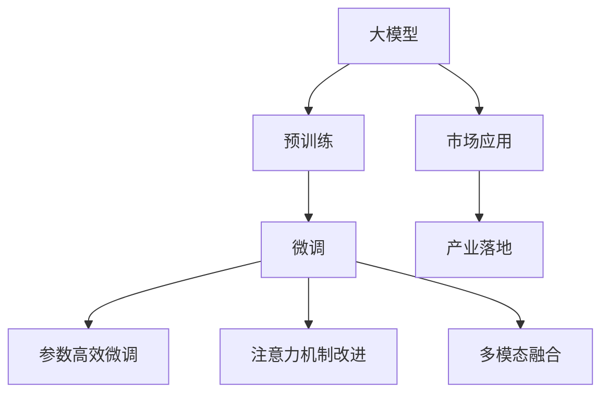
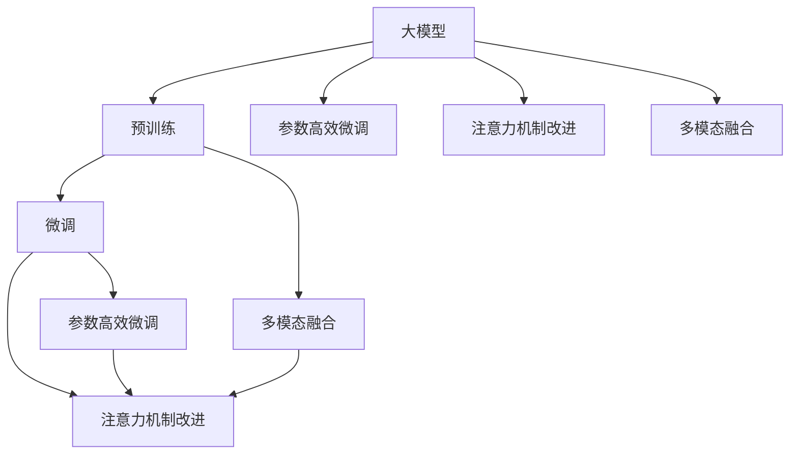
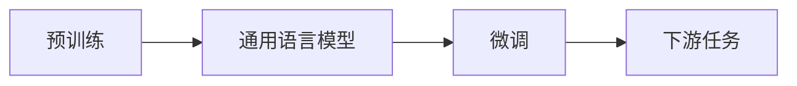
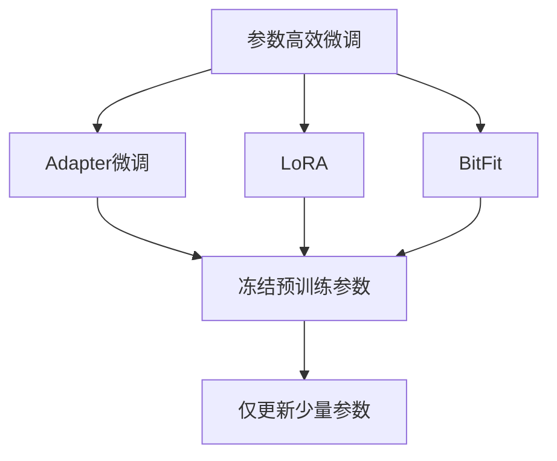
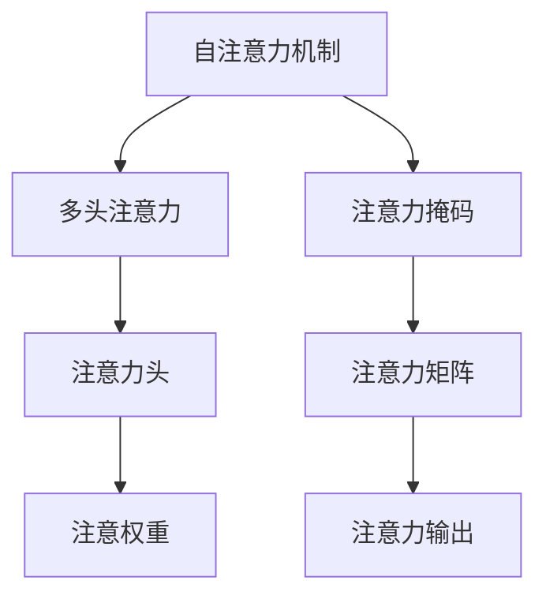
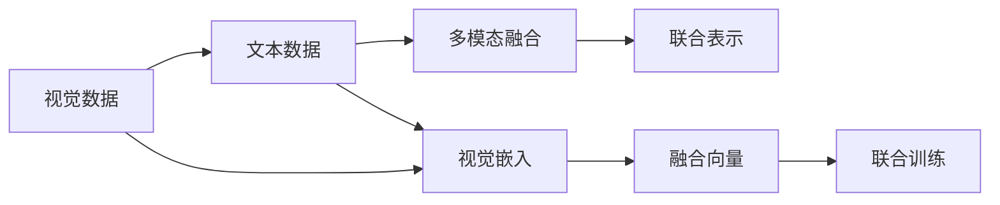
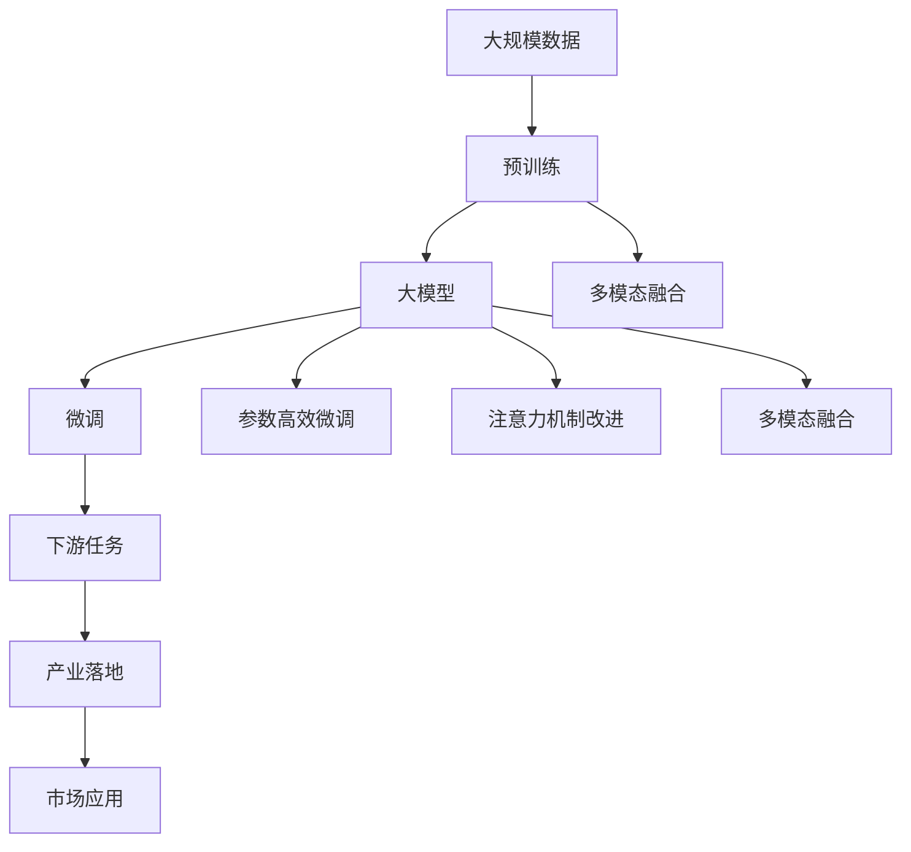

                 

# 大模型的技术创新与市场应用

> 关键词：大模型, 技术创新, 市场应用, 预训练, 微调, Transformer, BERT, 深度学习, 人工智能, 自动化, 产业化

## 1. 背景介绍

### 1.1 问题由来
随着人工智能技术的迅猛发展，大模型（Large Models）作为深度学习领域的最新突破，在多个领域展现出了前所未有的优势。大模型通过在大规模无标签数据上进行预训练，学习到了丰富的领域知识，显著提升了模型在特定任务上的性能。然而，大模型的开发和部署成本高昂，应用场景有限，难以大规模推广。因此，如何创新大模型的技术，拓展其市场应用，成为了当前研究的一个热点问题。

### 1.2 问题核心关键点
当前大模型的技术创新主要集中在以下几个方面：

- **预训练与微调技术**：通过在大规模无标签数据上预训练，再通过下游任务的少量标注数据进行微调，显著提升模型性能。
- **参数高效微调**：仅更新模型中部分参数，避免过拟合，提高模型训练效率。
- **注意力机制改进**：通过改进Transformer中的注意力机制，提升模型对输入数据的理解和处理能力。
- **多模态融合**：将视觉、音频、文本等多模态数据融合在一起，提升模型的泛化能力和应用范围。
- **超大规模模型**：开发超大规模模型，增强模型的表达能力和适应性。

这些技术创新为人工智能的产业化提供了新的契机。然而，如何将这些技术创新应用到实际市场，拓展大模型的应用场景，仍是一个待解决的问题。本文将围绕这些核心关键点，对大模型的技术创新和市场应用进行系统性介绍。

### 1.3 问题研究意义
研究大模型的技术创新和市场应用，对于拓展人工智能技术的边界，推动技术的产业化进程，具有重要意义：

1. **降低开发成本**：通过优化大模型的预训练和微调过程，降低模型开发和部署的资源消耗，提高模型训练效率。
2. **提升模型性能**：通过技术创新，提升大模型在特定任务上的性能，满足实际应用的需求。
3. **拓展应用场景**：通过技术创新，拓展大模型的应用领域，覆盖更多的行业和场景。
4. **加速产业化进程**：通过技术创新，加速人工智能技术的落地应用，为各行各业提供新的解决方案。

## 2. 核心概念与联系

### 2.1 核心概念概述

为更好地理解大模型的技术创新和市场应用，本节将介绍几个密切相关的核心概念：

- **大模型（Large Models）**：指包含大量参数的深度学习模型，通常具有较强的表达能力和泛化能力。常见的代表有大规模预训练语言模型如BERT、GPT-3等。
- **预训练（Pre-training）**：指在大规模无标签数据上，通过自监督学习任务训练通用语言模型的过程。预训练使得模型学习到语言的通用表示。
- **微调（Fine-tuning）**：指在预训练模型的基础上，使用下游任务的少量标注数据，通过有监督学习优化模型在特定任务上的性能。
- **参数高效微调（Parameter-Efficient Fine-Tuning, PEFT）**：指在微调过程中，只更新模型的部分参数，避免过拟合，提高模型训练效率。
- **注意力机制（Attention Mechanism）**：一种用于提升模型对输入数据处理能力的机制，通过关注输入数据的不同部分，提升模型的表达能力。
- **多模态融合（Multimodal Fusion）**：指将视觉、音频、文本等多模态数据融合在一起，提升模型的泛化能力和应用范围。

这些核心概念之间的逻辑关系可以通过以下Mermaid流程图来展示：



这个流程图展示了大模型的核心概念及其之间的关系：

1. 大模型通过预训练获得基础能力。
2. 微调是对预训练模型进行任务特定的优化，可以分为全参数微调和参数高效微调两种方式。
3. 注意力机制改进和多模态融合等技术，可以进一步提升模型的表达能力和应用范围。
4. 市场应用和大模型技术创新相结合，促进了技术的产业化进程。

这些概念共同构成了大模型技术创新和市场应用的框架，使其能够更好地应用于实际场景中。

### 2.2 概念间的关系

这些核心概念之间存在着紧密的联系，形成了大模型技术创新和市场应用的完整生态系统。下面我们通过几个Mermaid流程图来展示这些概念之间的关系。

#### 2.2.1 大模型的学习范式



这个流程图展示了大模型的三种主要学习范式：预训练、微调和注意力机制改进。预训练主要采用自监督学习方法，而微调则是有监督学习的过程。注意力机制改进和参数高效微调等技术，可以进一步提升模型的表达能力和训练效率。

#### 2.2.2 预训练与微调的关系



这个流程图展示了预训练和微调的基本原理，以及它们如何连接通用语言模型和下游任务。

#### 2.2.3 参数高效微调方法



这个流程图展示了几种常见的参数高效微调方法，包括Adapter微调、LoRA和BitFit。这些方法的共同特点是冻结大部分预训练参数，只更新少量参数，从而提高微调效率。

#### 2.2.4 注意力机制在大模型中的应用



这个流程图展示了自注意力机制在大模型中的应用。自注意力机制通过关注输入序列的不同部分，提高了模型的表达能力。

#### 2.2.5 多模态融合在大模型中的应用



这个流程图展示了多模态融合在大模型中的应用。多模态融合通过将视觉、音频、文本等多模态数据融合在一起，提升了模型的泛化能力和应用范围。

### 2.3 核心概念的整体架构

最后，我们用一个综合的流程图来展示这些核心概念在大模型技术创新和市场应用过程中的整体架构：



这个综合流程图展示了从预训练到微调，再到市场应用的大模型技术创新过程。大模型首先在大规模数据上进行预训练，然后通过微调和多模态融合等技术创新，获得具备强大表达能力的多模态大模型。这些大模型在市场应用中，通过不同领域和场景的不断优化和改进，最终实现产业化应用。通过这些流程图，我们可以更清晰地理解大模型技术创新和市场应用的各个环节。

## 3. 核心算法原理 & 具体操作步骤
### 3.1 算法原理概述

大模型的技术创新主要集中在预训练和微调两个环节。预训练通过在大规模无标签数据上训练模型，使其学习到丰富的领域知识。微调则通过在特定任务上的少量标注数据上进行有监督学习，优化模型在特定任务上的性能。

形式化地，假设预训练模型为 $M_{\theta}$，其中 $\theta$ 为预训练得到的模型参数。给定下游任务 $T$ 的标注数据集 $D=\{(x_i, y_i)\}_{i=1}^N$，微调的目标是找到新的模型参数 $\hat{\theta}$，使得：

$$
\hat{\theta}=\mathop{\arg\min}_{\theta} \mathcal{L}(M_{\theta},D)
$$

其中 $\mathcal{L}$ 为针对任务 $T$ 设计的损失函数，用于衡量模型预测输出与真实标签之间的差异。常见的损失函数包括交叉熵损失、均方误差损失等。

通过梯度下降等优化算法，微调过程不断更新模型参数 $\theta$，最小化损失函数 $\mathcal{L}$，使得模型输出逼近真实标签。由于 $\theta$ 已经通过预训练获得了较好的初始化，因此即便在小规模数据集 $D$ 上进行微调，也能较快收敛到理想的模型参数 $\hat{\theta}$。

### 3.2 算法步骤详解

基于大模型的技术创新和市场应用，一般包括以下几个关键步骤：

**Step 1: 准备预训练模型和数据集**
- 选择合适的预训练语言模型 $M_{\theta}$ 作为初始化参数，如 BERT、GPT 等。
- 准备下游任务 $T$ 的标注数据集 $D$，划分为训练集、验证集和测试集。一般要求标注数据与预训练数据的分布不要差异过大。

**Step 2: 添加任务适配层**
- 根据任务类型，在预训练模型顶层设计合适的输出层和损失函数。
- 对于分类任务，通常在顶层添加线性分类器和交叉熵损失函数。
- 对于生成任务，通常使用语言模型的解码器输出概率分布，并以负对数似然为损失函数。

**Step 3: 设置微调超参数**
- 选择合适的优化算法及其参数，如 AdamW、SGD 等，设置学习率、批大小、迭代轮数等。
- 设置正则化技术及强度，包括权重衰减、Dropout、Early Stopping 等。
- 确定冻结预训练参数的策略，如仅微调顶层，或全部参数都参与微调。

**Step 4: 执行梯度训练**
- 将训练集数据分批次输入模型，前向传播计算损失函数。
- 反向传播计算参数梯度，根据设定的优化算法和学习率更新模型参数。
- 周期性在验证集上评估模型性能，根据性能指标决定是否触发 Early Stopping。
- 重复上述步骤直到满足预设的迭代轮数或 Early Stopping 条件。

**Step 5: 测试和部署**
- 在测试集上评估微调后模型 $M_{\hat{\theta}}$ 的性能，对比微调前后的精度提升。
- 使用微调后的模型对新样本进行推理预测，集成到实际的应用系统中。
- 持续收集新的数据，定期重新微调模型，以适应数据分布的变化。

以上是基于大模型的技术创新和市场应用的一般流程。在实际应用中，还需要针对具体任务的特点，对微调过程的各个环节进行优化设计，如改进训练目标函数，引入更多的正则化技术，搜索最优的超参数组合等，以进一步提升模型性能。

### 3.3 算法优缺点

大模型的技术创新和市场应用具有以下优点：

1. **性能提升显著**：通过预训练和微调，大模型在特定任务上的性能显著提升，能够处理更复杂、更抽象的问题。
2. **泛化能力增强**：预训练使得模型学习到通用的语言表示，微调则进一步适应特定任务，增强模型的泛化能力。
3. **参数高效**：通过参数高效微调技术，在固定大部分预训练参数的情况下，仍可取得不错的微调效果，减少计算资源消耗。
4. **应用广泛**：大模型技术可以应用于多个领域，如自然语言处理、计算机视觉、语音识别等，具有广泛的应用前景。

同时，该方法也存在一定的局限性：

1. **开发成本高**：预训练和微调过程需要大量的计算资源和时间，成本较高。
2. **数据依赖性强**：微调效果依赖于标注数据的数量和质量，标注数据的获取成本较高。
3. **模型复杂度高**：大模型参数量大，训练和推理过程中的计算资源消耗较大，难以实时部署。
4. **模型解释性差**：大模型的内部结构复杂，难以解释其决策过程，对模型的调试和优化造成困难。

尽管存在这些局限性，但就目前而言，大模型的技术创新和市场应用仍是大模型研究的主流方向。未来相关研究的重点在于如何进一步降低模型开发和部署的成本，提高模型的少样本学习和跨领域迁移能力，同时兼顾模型的可解释性和伦理安全性等因素。

### 3.4 算法应用领域

大模型的技术创新和市场应用已经在多个领域得到广泛应用，例如：

- **自然语言处理（NLP）**：如文本分类、命名实体识别、情感分析、问答系统等。通过微调使模型学习文本-标签映射或语言-语言映射，实现对特定任务的适应。
- **计算机视觉（CV）**：如图像分类、目标检测、图像生成等。通过预训练和微调使模型学习图像特征表示，实现对特定图像任务的适应。
- **语音识别（ASR）**：如语音转文本、语音合成等。通过预训练和微调使模型学习语音特征表示，实现对特定语音任务的适应。
- **医疗诊断**：如疾病预测、药物研发等。通过预训练和微调使模型学习医疗数据特征，实现对特定医疗任务的适应。
- **金融风险管理**：如信用评分、反欺诈等。通过预训练和微调使模型学习金融数据特征，实现对特定金融任务的适应。
- **智能推荐系统**：如商品推荐、新闻推荐等。通过预训练和微调使模型学习用户行为特征，实现对特定推荐任务的适应。

除了上述这些经典任务外，大模型的技术创新和市场应用还在不断拓展，如可控文本生成、常识推理、代码生成、数据增强等，为各个领域带来新的创新和发展。随着预训练模型和微调方法的不断进步，相信大模型的技术创新和市场应用将在更多领域大放异彩。

## 4. 数学模型和公式 & 详细讲解 & 举例说明
### 4.1 数学模型构建

本节将使用数学语言对大模型的预训练和微调过程进行更加严格的刻画。

记预训练语言模型为 $M_{\theta}$，其中 $\theta$ 为预训练得到的模型参数。假设微调任务的训练集为 $D=\{(x_i, y_i)\}_{i=1}^N$，其中 $x_i \in \mathcal{X}$，$y_i \in \mathcal{Y}$。

定义模型 $M_{\theta}$ 在数据样本 $(x,y)$ 上的损失函数为 $\ell(M_{\theta}(x),y)$，则在数据集 $D$ 上的经验风险为：

$$
\mathcal{L}(\theta) = \frac{1}{N} \sum_{i=1}^N \ell(M_{\theta}(x_i),y_i)
$$

微调的优化目标是最小化经验风险，即找到最优参数：

$$
\theta^* = \mathop{\arg\min}_{\theta} \mathcal{L}(\theta)
$$

在实践中，我们通常使用基于梯度的优化算法（如SGD、Adam等）来近似求解上述最优化问题。设 $\eta$ 为学习率，$\lambda$ 为正则化系数，则参数的更新公式为：

$$
\theta \leftarrow \theta - \eta \nabla_{\theta}\mathcal{L}(\theta) - \eta\lambda\theta
$$

其中 $\nabla_{\theta}\mathcal{L}(\theta)$ 为损失函数对参数 $\theta$ 的梯度，可通过反向传播算法高效计算。

### 4.2 公式推导过程

以下我们以二分类任务为例，推导交叉熵损失函数及其梯度的计算公式。

假设模型 $M_{\theta}$ 在输入 $x$ 上的输出为 $\hat{y}=M_{\theta}(x) \in [0,1]$，表示样本属于正类的概率。真实标签 $y \in \{0,1\}$。则二分类交叉熵损失函数定义为：

$$
\ell(M_{\theta}(x),y) = -[y\log \hat{y} + (1-y)\log (1-\hat{y})]
$$

将其代入经验风险公式，得：

$$
\mathcal{L}(\theta) = -\frac{1}{N}\sum_{i=1}^N [y_i\log M_{\theta}(x_i)+(1-y_i)\log(1-M_{\theta}(x_i))]
$$

根据链式法则，损失函数对参数 $\theta_k$ 的梯度为：

$$
\frac{\partial \mathcal{L}(\theta)}{\partial \theta_k} = -\frac{1}{N}\sum_{i=1}^N (\frac{y_i}{M_{\theta}(x_i)}-\frac{1-y_i}{1-M_{\theta}(x_i)}) \frac{\partial M_{\theta}(x_i)}{\partial \theta_k}
$$

其中 $\frac{\partial M_{\theta}(x_i)}{\partial \theta_k}$ 可进一步递归展开，利用自动微分技术完成计算。

在得到损失函数的梯度后，即可带入参数更新公式，完成模型的迭代优化。重复上述过程直至收敛，最终得到适应下游任务的最优模型参数 $\theta^*$。

## 5. 项目实践：代码实例和详细解释说明
### 5.1 开发环境搭建

在进行大模型技术创新和市场应用实践前，我们需要准备好开发环境。以下是使用Python进行PyTorch开发的环境配置流程：

1. 安装Anaconda：从官网下载并安装Anaconda，用于创建独立的Python环境。

2. 创建并激活虚拟环境：
```bash
conda create -n pytorch-env python=3.8 
conda activate pytorch-env
```

3. 安装PyTorch：根据CUDA版本，从官网获取对应的安装命令。例如：
```bash
conda install pytorch torchvision torchaudio cudatoolkit=11.1 -c pytorch -c conda-forge
```

4. 安装Transformers库：
```bash
pip install transformers
```

5. 安装各类工具包：
```bash
pip install numpy pandas scikit-learn matplotlib tqdm jupyter notebook ipython
```

完成上述步骤后，即可在`pytorch-env`环境中开始技术创新和市场应用实践。

### 5.2 源代码详细实现

这里我们以使用PyTorch实现一个大模型在NLP任务上的微调为例，展示代码实现。

首先，定义NLP任务的模型和数据处理函数：

```python
import torch
from transformers import BertForSequenceClassification, BertTokenizer

class NLPModel(torch.nn.Module):
    def __init__(self):
        super(NLPModel, self).__init__()
        self.bert = BertForSequenceClassification.from_pretrained('bert-base-uncased', num_labels=2)
        
    def forward(self, x, attention_mask):
        return self.bert(x, attention_mask=attention_mask)

# 定义数据处理函数
def process_data(text, tokenizer):
    inputs = tokenizer(text, return_tensors='pt', padding='max_length', truncation=True)
    input_ids = inputs['input_ids']
    attention_mask = inputs['attention_mask']
    return input_ids, attention_mask
```

然后，定义训练和评估函数：

```python
from torch.utils.data import Dataset, DataLoader
from sklearn.metrics import accuracy_score

class NLPDataset(Dataset):
    def __init__(self, texts, labels, tokenizer):
        self.texts = texts
        self.labels = labels
        self.tokenizer = tokenizer
        
    def __len__(self):
        return len(self.texts)
    
    def __getitem__(self, item):
        text = self.texts[item]
        label = self.labels[item]
        
        input_ids, attention_mask = process_data(text, self.tokenizer)
        label = torch.tensor(label, dtype=torch.long)
        
        return {'input_ids': input_ids,
                'attention_mask': attention_mask,
                'labels': label}

# 加载数据集
train_dataset = NLPDataset(train_texts, train_labels, tokenizer)
dev_dataset = NLPDataset(dev_texts, dev_labels, tokenizer)
test_dataset = NLPDataset(test_texts, test_labels, tokenizer)

# 定义优化器、学习率、正则化系数
optimizer = torch.optim.AdamW(model.parameters(), lr=1e-5)
scheduler = torch.optim.lr_scheduler.StepLR(optimizer, step_size=3, gamma=0.1)

# 训练过程
for epoch in range(num_epochs):
    model.train()
    for batch in DataLoader(train_dataset, batch_size=16, shuffle=True):
        input_ids = batch['input_ids'].to(device)
        attention_mask = batch['attention_mask'].to(device)
        labels = batch['labels'].to(device)
        optimizer.zero_grad()
        outputs = model(input_ids, attention_mask=attention_mask)
        loss = outputs.loss
        loss.backward()
        optimizer.step()
        scheduler.step()
        
    # 评估过程
    model.eval()
    with torch.no_grad():
        dev_losses = []
        dev_accuracies = []
        for batch in DataLoader(dev_dataset, batch_size=16, shuffle=False):
            input_ids = batch['input_ids'].to(device)
            attention_mask = batch['attention_mask'].to(device)
            labels = batch['labels'].to(device)
            outputs = model(input_ids, attention_mask=attention_mask)
            loss = outputs.loss
            accuracy = accuracy_score(labels, outputs.logits.argmax(dim=1))
            dev_losses.append(loss.item())
            dev_accuracies.append(accuracy)
            
    print(f"Epoch {epoch+1}, dev loss: {sum(dev_losses)/len(dev_losses):.3f}, dev accuracy: {sum(dev_accuracies)/len(dev_accuracies):.3f}")
```

最后，启动训练流程并在测试集上评估：

```python
num_epochs = 5
device = torch.device('cuda') if torch.cuda.is_available() else torch.device('cpu')

# 定义模型和数据集
model = NLPModel().to(device)
train_dataset = NLPDataset(train_texts, train_labels, tokenizer)
dev_dataset = NLPDataset(dev_texts, dev_labels, tokenizer)
test_dataset = NLPDataset(test_texts, test_labels, tokenizer)

# 定义优化器、学习率、正则化系数
optimizer = torch.optim.AdamW(model.parameters(), lr=1e-5)
scheduler = torch.optim.lr_scheduler.StepLR(optimizer, step_size=3, gamma=0.1)

# 训练过程
for epoch in range(num_epochs):
    model.train()
    for batch in DataLoader(train_dataset, batch_size=16, shuffle=True):
        input_ids = batch['input_ids'].to(device)
        attention_mask = batch['attention_mask'].to(device)
        labels = batch['labels'].to(device)
        optimizer.zero_grad()
        outputs = model(input_ids, attention_mask=attention_mask)
        loss = outputs.loss
        loss.backward()
        optimizer.step()
        scheduler.step()
        
    # 评估过程
    model.eval()
    with torch.no_grad():
        dev_losses = []
        dev_accuracies = []
        for batch in DataLoader(dev_dataset, batch_size=16, shuffle=False):
            input_ids = batch['input_ids'].to(device)
            attention_mask = batch['attention_mask'].to(device)
            labels = batch['labels'].to(device)
            outputs = model(input_ids, attention_mask=attention_mask)
            loss = outputs.loss
            accuracy = accuracy_score(labels, outputs.logits.argmax(dim=1))
            dev_losses.append(loss.item())
            dev_accuracies.append(accuracy)
            
    print(f"Epoch {epoch+1}, dev loss: {sum(dev_losses)/len(dev_losses):.3f}, dev accuracy: {sum(dev_accuracies)/len(dev_accuracies):.3f}")
    
# 在测试集上评估
model.eval()
with torch.no_grad():
    test_losses = []
    test_accuracies = []
    for batch in DataLoader(test_dataset, batch_size=16, shuffle=False):
        input_ids = batch['input_ids'].to(device)
        attention_mask = batch['attention_mask'].to(device)
        labels = batch['labels'].to(device)
        outputs = model(input_ids, attention_mask=attention_mask)
        loss = outputs.loss
        accuracy = accuracy_score(labels, outputs.logits.argmax(dim=1))
        test_losses.append(loss.item())
        test_accuracies.append(accuracy)
        
print(f"Test loss: {sum(test_losses)/len(test_losses):.3f}, Test accuracy: {sum(test_accuracies)/len(test_accuracies):.3f}")
```

以上就是使用PyTorch实现一个大模型在NLP任务上的微调的完整代码实现。可以看到，得益于Transformers库的强大封装，我们可以用相对简洁的代码完成BERT模型的加载和微调。

### 

