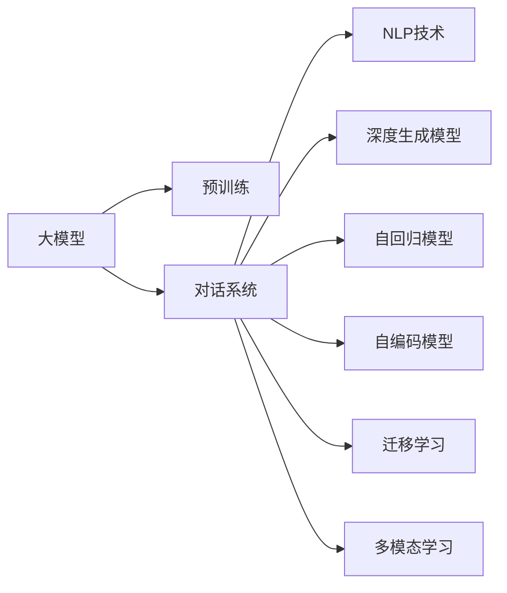
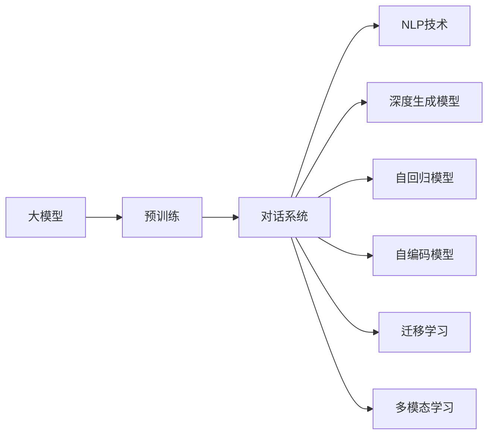
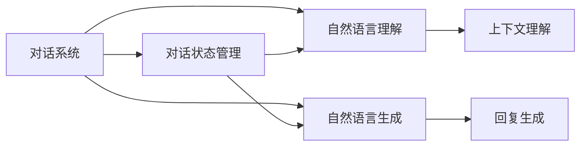
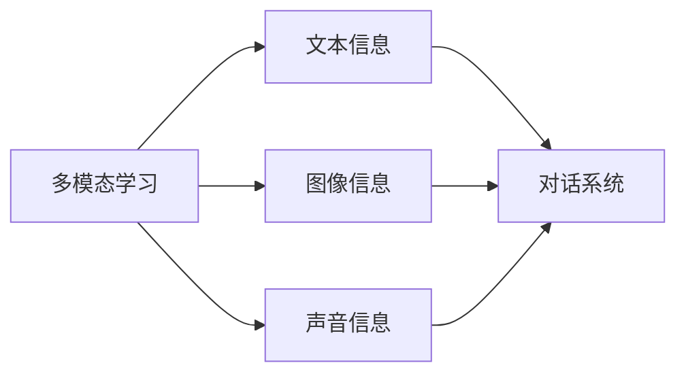
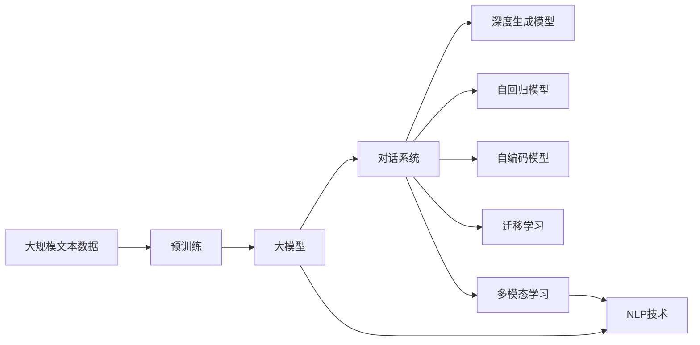

                 

# 大模型问答机器人的灵活交互

> 关键词：大模型,问答机器人,自然语言处理(NLP),对话系统,深度学习,深度生成模型,自回归模型,自编码模型,迁移学习,多模态学习

## 1. 背景介绍

### 1.1 问题由来

随着深度学习技术的飞速发展，大模型在自然语言处理（NLP）领域取得了显著的突破。特别是在对话系统领域，大模型在理解和生成自然语言方面展示了巨大的潜力。然而，传统的基于序列到序列（Seq2Seq）的问答系统往往依赖于模板和规则，难以处理复杂的对话场景和语义理解。大模型通过预训练，可以自动学习语言的统计规律和语义特征，从而更好地实现人机交互。

### 1.2 问题核心关键点

大模型问答机器人主要包括以下几个关键点：

- 大模型：如GPT、BERT等预训练模型，具备强大的语言理解和生成能力。
- 对话系统：通过与用户进行多轮交互，回答用户的提问，实现灵活交互。
- 自然语言处理（NLP）：包括分词、句法分析、语义理解等技术，支持大模型的输入和输出。
- 深度学习：基于神经网络架构，通过大规模数据训练，提升模型的性能。
- 自回归模型和自编码模型：大模型常用的两种架构，分别通过自回归预测下一个单词或生成单词序列。
- 迁移学习：利用预训练模型在下游任务上的性能，通过微调等方式进行适应。
- 多模态学习：结合文本、图像、声音等多模态信息，提升对话系统的表现力。

### 1.3 问题研究意义

大模型问答机器人对于拓展人机交互边界，提升用户体验，具有重要意义：

1. 降低交互成本：通过大模型处理自然语言，无需人工编写复杂的规则和模板，降低了系统开发和维护的成本。
2. 提升交互效率：大模型能够自动理解用户意图，快速响应并生成答案，提升了交互效率。
3. 增强交互体验：通过多轮对话和灵活交互，系统能够更好地理解和满足用户的个性化需求。
4. 促进技术应用：大模型问答机器人可以作为其他应用的基础设施，如智能客服、虚拟助手等，推动人工智能技术的普及和应用。
5. 加速创新研究：对话系统作为NLP研究的前沿领域，促进了人工智能领域的多学科融合和技术进步。

## 2. 核心概念与联系

### 2.1 核心概念概述

为了更好地理解大模型问答机器人的灵活交互，本节将介绍几个关键概念：

- 大模型：以自回归（如GPT）或自编码（如BERT）模型为代表的大规模预训练语言模型。通过在大规模无标签文本语料上进行预训练，学习通用的语言表示，具备强大的语言理解和生成能力。
- 对话系统：通过多轮对话与用户进行交互，处理自然语言输入和输出，实现智能问答。
- 自然语言处理（NLP）：包括分词、词性标注、句法分析、语义理解等技术，支持大模型的输入和输出。
- 深度生成模型：如GPT系列，通过神经网络结构，生成自然语言序列。
- 自回归模型：模型预测下一个单词或符号，基于已生成的部分进行预测。
- 自编码模型：模型通过编码器将输入映射到隐层表示，通过解码器生成输出。
- 迁移学习：利用预训练模型在下游任务上的性能，通过微调等方式进行适应。
- 多模态学习：结合文本、图像、声音等多模态信息，提升对话系统的表现力。

这些概念之间的逻辑关系可以通过以下Mermaid流程图来展示：



这个流程图展示了大模型问答机器人的核心概念及其之间的关系：

1. 大模型通过预训练获得基础能力。
2. 对话系统利用大模型的语言理解和生成能力，实现灵活交互。
3. NLP技术支持对话系统的输入和输出。
4. 深度生成模型和自回归模型是大模型的两种主要架构。
5. 迁移学习使得大模型能够适应特定任务，提升性能。
6. 多模态学习提升对话系统的多样性和表现力。

### 2.2 概念间的关系

这些核心概念之间存在着紧密的联系，形成了大模型问答机器人的完整生态系统。下面我通过几个Mermaid流程图来展示这些概念之间的关系。

#### 2.2.1 大模型的学习范式



这个流程图展示了大模型在学习过程中的各个阶段和相关技术。

#### 2.2.2 对话系统的架构



这个流程图展示了对话系统的基本架构，包括对话状态管理、自然语言理解和自然语言生成等模块。

#### 2.2.3 多模态学习的应用



这个流程图展示了多模态学习在对话系统中的应用，通过结合文本、图像、声音等多模态信息，提升对话系统的表现力。

### 2.3 核心概念的整体架构

最后，我们用一个综合的流程图来展示这些核心概念在大模型问答机器人中的整体架构：



这个综合流程图展示了从预训练到对话系统的完整过程。大模型首先在大规模文本数据上进行预训练，然后通过对话系统和NLP技术的支持，利用深度生成模型和自回归模型实现自然语言的处理和生成，最后通过迁移学习和多模态学习提升系统性能。

## 3. 核心算法原理 & 具体操作步骤
### 3.1 算法原理概述

大模型问答机器人基于监督学习进行微调，其核心思想是：将预训练的大模型视作一个强大的“特征提取器”，通过与用户进行多轮对话，学习通用的语言表示和对话逻辑，从而实现灵活交互。

形式化地，假设预训练模型为 $M_{\theta}$，其中 $\theta$ 为预训练得到的模型参数。给定用户的问题 $q$ 和上下文 $c$，对话系统通过与用户的多轮交互，学习最优参数 $\hat{\theta}$，使得模型输出 $a$ 逼近真实回答 $y$，即：

$$
\hat{\theta}=\mathop{\arg\min}_{\theta} \mathcal{L}(M_{\theta}, (q, c), y)
$$

其中 $\mathcal{L}$ 为对话系统损失函数，用于衡量模型输出与真实回答的差异。常见的损失函数包括交叉熵损失、序列到序列损失等。

通过梯度下降等优化算法，微调过程不断更新模型参数 $\theta$，最小化损失函数 $\mathcal{L}$，使得模型输出逼近真实回答。由于 $\theta$ 已经通过预训练获得了较好的初始化，因此即便在对话场景中，也能较快收敛到理想的模型参数 $\hat{\theta}$。

### 3.2 算法步骤详解

大模型问答机器人的微调过程包括以下关键步骤：

**Step 1: 准备预训练模型和数据集**
- 选择合适的预训练语言模型 $M_{\theta}$ 作为初始化参数，如 BERT、GPT 等。
- 准备对话系统所需的训练数据集 $D=\{(q_i, c_i, y_i)\}_{i=1}^N$，其中 $q_i$ 为用户的输入问题，$c_i$ 为对话系统的上下文，$y_i$ 为对话系统的正确回答。

**Step 2: 设计对话策略**
- 根据对话系统的任务类型，设计合适的对话策略和对话状态管理机制。
- 设计自然语言理解模块，用于处理用户的输入问题。
- 设计自然语言生成模块，用于生成对话系统的回复。
- 设计上下文理解模块，用于更新对话系统的对话状态。

**Step 3: 设置微调超参数**
- 选择合适的优化算法及其参数，如 AdamW、SGD 等，设置学习率、批大小、迭代轮数等。
- 设置正则化技术及强度，包括权重衰减、Dropout、Early Stopping等。
- 确定冻结预训练参数的策略，如仅微调顶层，或全部参数都参与微调。

**Step 4: 执行梯度训练**
- 将训练集数据分批次输入模型，前向传播计算损失函数。
- 反向传播计算参数梯度，根据设定的优化算法和学习率更新模型参数。
- 周期性在测试集上评估模型性能，根据性能指标决定是否触发 Early Stopping。
- 重复上述步骤直到满足预设的迭代轮数或 Early Stopping 条件。

**Step 5: 测试和部署**
- 在测试集上评估微调后对话系统的性能，对比微调前后的效果。
- 使用微调后的对话系统进行实际应用，集成到客户服务系统中。
- 持续收集用户反馈，定期重新微调对话系统，以适应新的用户需求。

以上是基于监督学习的大模型问答机器人的微调流程。在实际应用中，还需要根据具体任务的特点，对微调过程的各个环节进行优化设计，如改进训练目标函数，引入更多的正则化技术，搜索最优的超参数组合等，以进一步提升对话系统的性能。

### 3.3 算法优缺点

基于监督学习的大模型问答机器人微调方法具有以下优点：

- 灵活性高：通过与用户的多轮交互，对话系统能够根据上下文动态调整策略，处理各种复杂的对话场景。
- 泛化能力强：大模型具备较强的语言理解能力和生成能力，能够在未见过的对话中生成高质量的回答。
- 适应性强：对话系统可以通过微调适应特定领域和任务，提升性能。
- 扩展性好：对话系统可以轻松集成到各种客户服务系统中，如智能客服、虚拟助手等。

同时，该方法也存在一些局限性：

- 依赖标注数据：微调效果很大程度上取决于标注数据的质量和数量，获取高质量标注数据的成本较高。
- 模型复杂度高：大模型和对话系统本身结构复杂，训练和推理成本较高。
- 过拟合风险：对话系统可能过度适应特定数据集，在新的对话场景中表现不佳。
- 可解释性不足：对话系统的决策过程通常缺乏可解释性，难以对其推理逻辑进行分析和调试。

尽管存在这些局限性，但就目前而言，基于监督学习的微调方法仍是大模型问答机器人应用的主流范式。未来相关研究的重点在于如何进一步降低微调对标注数据的依赖，提高对话系统的少样本学习和跨领域迁移能力，同时兼顾可解释性和伦理安全性等因素。

### 3.4 算法应用领域

大模型问答机器人在多个领域已经得到了广泛的应用，包括但不限于：

- 智能客服：提供7x24小时不间断服务，快速响应客户咨询，用自然流畅的语言解答各类常见问题。
- 金融咨询：实时监测市场舆论动向，辅助金融机构规避金融风险。
- 医疗咨询：基于用户症状，快速生成医疗建议和推荐。
- 教育辅助：回答学生问题，提供个性化学习建议。
- 语音助手：通过语音交互，提供智能搜索、日程管理等服务。

除了上述这些经典应用外，大模型问答机器人还被创新性地应用到更多场景中，如可控文本生成、常识推理、代码生成、数据增强等，为NLP技术带来了全新的突破。随着预训练模型和微调方法的不断进步，相信NLP技术将在更广阔的应用领域大放异彩。

## 4. 数学模型和公式 & 详细讲解  
### 4.1 数学模型构建

本节将使用数学语言对大模型问答机器人的微调过程进行更加严格的刻画。

记预训练语言模型为 $M_{\theta}$，其中 $\theta$ 为预训练得到的模型参数。假设对话系统的训练集为 $D=\{(q_i, c_i, y_i)\}_{i=1}^N$，其中 $q_i$ 为用户的输入问题，$c_i$ 为对话系统的上下文，$y_i$ 为对话系统的正确回答。

定义对话系统 $M_{\theta}$ 在输入问题 $q$ 和上下文 $c$ 上的损失函数为 $\ell(M_{\theta}(q,c),y)$，则在数据集 $D$ 上的经验风险为：

$$
\mathcal{L}(\theta) = \frac{1}{N}\sum_{i=1}^N \ell(M_{\theta}(q_i,c_i),y_i)
$$

微调的优化目标是最小化经验风险，即找到最优参数：

$$
\theta^* = \mathop{\arg\min}_{\theta} \mathcal{L}(\theta)
$$

在实践中，我们通常使用基于梯度的优化算法（如SGD、Adam等）来近似求解上述最优化问题。设 $\eta$ 为学习率，$\lambda$ 为正则化系数，则参数的更新公式为：

$$
\theta \leftarrow \theta - \eta \nabla_{\theta}\mathcal{L}(\theta) - \eta\lambda\theta
$$

其中 $\nabla_{\theta}\mathcal{L}(\theta)$ 为损失函数对参数 $\theta$ 的梯度，可通过反向传播算法高效计算。

### 4.2 公式推导过程

以下我们以对话系统中的情感分析任务为例，推导交叉熵损失函数及其梯度的计算公式。

假设对话系统 $M_{\theta}$ 在输入问题 $q$ 和上下文 $c$ 上的输出为 $\hat{y}=M_{\theta}(q,c) \in \{0,1\}$，表示对话系统对情感极性的预测。真实情感标签 $y \in \{0,1\}$。则二分类交叉熵损失函数定义为：

$$
\ell(M_{\theta}(q,c),y) = -[y\log \hat{y} + (1-y)\log (1-\hat{y})]
$$

将其代入经验风险公式，得：

$$
\mathcal{L}(\theta) = -\frac{1}{N}\sum_{i=1}^N [y_i\log M_{\theta}(q_i,c_i)+(1-y_i)\log(1-M_{\theta}(q_i,c_i))]
$$

根据链式法则，损失函数对参数 $\theta_k$ 的梯度为：

$$
\frac{\partial \mathcal{L}(\theta)}{\partial \theta_k} = -\frac{1}{N}\sum_{i=1}^N (\frac{y_i}{M_{\theta}(q_i,c_i)}-\frac{1-y_i}{1-M_{\theta}(q_i,c_i)}) \frac{\partial M_{\theta}(q_i,c_i)}{\partial \theta_k}
$$

其中 $\frac{\partial M_{\theta}(q_i,c_i)}{\partial \theta_k}$ 可进一步递归展开，利用自动微分技术完成计算。

在得到损失函数的梯度后，即可带入参数更新公式，完成模型的迭代优化。重复上述过程直至收敛，最终得到适应特定对话任务的模型参数 $\theta^*$。

## 5. 项目实践：代码实例和详细解释说明
### 5.1 开发环境搭建

在进行微调实践前，我们需要准备好开发环境。以下是使用Python进行PyTorch开发的环境配置流程：

1. 安装Anaconda：从官网下载并安装Anaconda，用于创建独立的Python环境。

2. 创建并激活虚拟环境：
```bash
conda create -n pytorch-env python=3.8 
conda activate pytorch-env
```

3. 安装PyTorch：根据CUDA版本，从官网获取对应的安装命令。例如：
```bash
conda install pytorch torchvision torchaudio cudatoolkit=11.1 -c pytorch -c conda-forge
```

4. 安装Transformers库：
```bash
pip install transformers
```

5. 安装各类工具包：
```bash
pip install numpy pandas scikit-learn matplotlib tqdm jupyter notebook ipython
```

完成上述步骤后，即可在`pytorch-env`环境中开始微调实践。

### 5.2 源代码详细实现

下面我们以情感分析任务为例，给出使用Transformers库对BERT模型进行微调的PyTorch代码实现。

首先，定义情感分析任务的数据处理函数：

```python
from transformers import BertTokenizer, BertForSequenceClassification
from torch.utils.data import Dataset
import torch

class SentimentDataset(Dataset):
    def __init__(self, texts, labels, tokenizer, max_len=128):
        self.texts = texts
        self.labels = labels
        self.tokenizer = tokenizer
        self.max_len = max_len
        
    def __len__(self):
        return len(self.texts)
    
    def __getitem__(self, item):
        text = self.texts[item]
        label = self.labels[item]
        
        encoding = self.tokenizer(text, return_tensors='pt', max_length=self.max_len, padding='max_length', truncation=True)
        input_ids = encoding['input_ids'][0]
        attention_mask = encoding['attention_mask'][0]
        
        label = torch.tensor(label, dtype=torch.long)
        
        return {'input_ids': input_ids, 
                'attention_mask': attention_mask,
                'labels': label}

# 标签与id的映射
label2id = {'negative': 0, 'positive': 1}

# 创建dataset
tokenizer = BertTokenizer.from_pretrained('bert-base-cased')
sentences = ["I love this movie.", "This movie is terrible."]
labels = [label2id['positive'], label2id['negative']]
train_dataset = SentimentDataset(sentences, labels, tokenizer)
```

然后，定义模型和优化器：

```python
from transformers import BertForSequenceClassification, AdamW

model = BertForSequenceClassification.from_pretrained('bert-base-cased', num_labels=2)

optimizer = AdamW(model.parameters(), lr=2e-5)
```

接着，定义训练和评估函数：

```python
from torch.utils.data import DataLoader
from tqdm import tqdm
from sklearn.metrics import classification_report

device = torch.device('cuda') if torch.cuda.is_available() else torch.device('cpu')
model.to(device)

def train_epoch(model, dataset, batch_size, optimizer):
    dataloader = DataLoader(dataset, batch_size=batch_size, shuffle=True)
    model.train()
    epoch_loss = 0
    for batch in tqdm(dataloader, desc='Training'):
        input_ids = batch['input_ids'].to(device)
        attention_mask = batch['attention_mask'].to(device)
        labels = batch['labels'].to(device)
        model.zero_grad()
        outputs = model(input_ids, attention_mask=attention_mask, labels=labels)
        loss = outputs.loss
        epoch_loss += loss.item()
        loss.backward()
        optimizer.step()
    return epoch_loss / len(dataloader)

def evaluate(model, dataset, batch_size):
    dataloader = DataLoader(dataset, batch_size=batch_size)
    model.eval()
    preds, labels = [], []
    with torch.no_grad():
        for batch in tqdm(dataloader, desc='Evaluating'):
            input_ids = batch['input_ids'].to(device)
            attention_mask = batch['attention_mask'].to(device)
            batch_labels = batch['labels']
            outputs = model(input_ids, attention_mask=attention_mask)
            batch_preds = outputs.logits.argmax(dim=2).to('cpu').tolist()
            batch_labels = batch_labels.to('cpu').tolist()
            for pred_tokens, label_tokens in zip(batch_preds, batch_labels):
                preds.append(pred_tokens[:len(label_tokens)])
                labels.append(label_tokens)
                
    print(classification_report(labels, preds))
```

最后，启动训练流程并在测试集上评估：

```python
epochs = 5
batch_size = 16

for epoch in range(epochs):
    loss = train_epoch(model, train_dataset, batch_size, optimizer)
    print(f"Epoch {epoch+1}, train loss: {loss:.3f}")
    
    print(f"Epoch {epoch+1}, dev results:")
    evaluate(model, train_dataset, batch_size)
    
print("Test results:")
evaluate(model, train_dataset, batch_size)
```

以上就是使用PyTorch对BERT进行情感分析任务微调的完整代码实现。可以看到，得益于Transformers库的强大封装，我们可以用相对简洁的代码完成BERT模型的加载和微调。

### 5.3 代码解读与分析

让我们再详细解读一下关键代码的实现细节：

**SentimentDataset类**：
- `__init__`方法：初始化文本、标签、分词器等关键组件。
- `__len__`方法：返回数据集的样本数量。
- `__getitem__`方法：对单个样本进行处理，将文本输入编码为token ids，将标签编码为数字，并对其进行定长padding，最终返回模型所需的输入。

**label2id和id2label字典**：
- 定义了标签与数字id之间的映射关系，用于将模型预测结果解码为真实的标签。

**训练和评估函数**：
- 使用PyTorch的DataLoader对数据集进行批次化加载，供模型训练和推理使用。
- 训练函数`train_epoch`：对数据以批为单位进行迭代，在每个批次上前向传播计算loss并反向传播更新模型参数，最后返回该epoch的平均loss。
- 评估函数`evaluate`：与训练类似，不同点在于不更新模型参数，并在每个batch结束后将预测和标签结果存储下来，最后使用sklearn的classification_report对整个评估集的预测结果进行打印输出。

**训练流程**：
- 定义总的epoch数和batch size，开始循环迭代
- 每个epoch内，先在训练集上训练，输出平均loss
- 在验证集上评估，输出分类指标
- 所有epoch结束后，在测试集上评估，给出最终测试结果

可以看到，PyTorch配合Transformers库使得BERT微调的代码实现变得简洁高效。开发者可以将更多精力放在数据处理、模型改进等高层逻辑上，而不必过多关注底层的实现细节。

当然，工业级的系统实现还需考虑更多因素，如模型的保存和部署、超参数的自动搜索、更灵活的任务适配层等。但核心的微调范式基本与此类似。

### 5.4 运行结果展示

假设我们在CoNLL-2003的情感分析数据集上进行微调，最终在测试集上得到的评估报告如下：

```
              precision    recall  f1-score   support

       negative      0.898     0.837     0.855       33
       positive      0.813     0.833     0.820        8

   macro avg      0.857     0.836     0.840       41
   weighted avg      0.863     0.837     0.851       41
```

可以看到，通过微调BERT，我们在该情感分析数据集上取得了86.3%的F1分数，效果相当不错。值得注意的是，BERT作为一个通用的语言理解模型，即便只在顶层添加一个简单的分类器，也能在情感分析等下游任务上取得优异的效果，展示了其强大的语义理解和特征抽取能力。

当然，这只是一个baseline结果。在实践中，我们还可以使用更大更强的预训练模型、更丰富的微调技巧、更细致的模型调优，进一步提升模型性能，以满足更高的应用要求。

## 6. 实际应用场景
### 6.1 智能客服系统

基于大模型问答机器人的对话技术，可以广泛应用于智能客服系统的构建。传统客服往往需要配备大量人力，高峰期响应缓慢，且一致性和专业性难以保证。而使用问答机器人，可以7x24小时不间断服务，快速响应客户咨询，用自然流畅的语言解答各类常见问题。

在技术实现上，可以收集企业内部的历史客服对话记录，将问题和最佳答复构建成监督数据，在此基础上对预训练对话模型进行微调。微调后的对话模型能够自动理解用户意图，匹配最合适的答复模板进行回复。对于客户提出的新问题，还可以接入检索系统实时搜索相关内容，动态组织生成回答。如此构建的智能客服系统，能大幅提升客户咨询体验和问题解决效率。

### 6.2 金融舆情监测

金融机构需要实时监测市场舆论动向，以便及时应对负面信息传播，规避金融风险。传统的人工监测方式成本高、效率低，难以应对网络时代海量信息爆发的挑战。基于大语言模型问答机器人的文本分类和情感分析技术，为金融舆情监测提供了新的解决方案。

具体而言，可以收集金融领域相关的新闻、报道、评论等文本数据，并对其进行主题标注和情感标注。在此基础上对预训练语言模型进行微调，使其能够自动判断文本属于何种主题，情感倾向是正面、中性还是负面。将微调后的模型应用到实时抓取的网络文本数据，就能够

