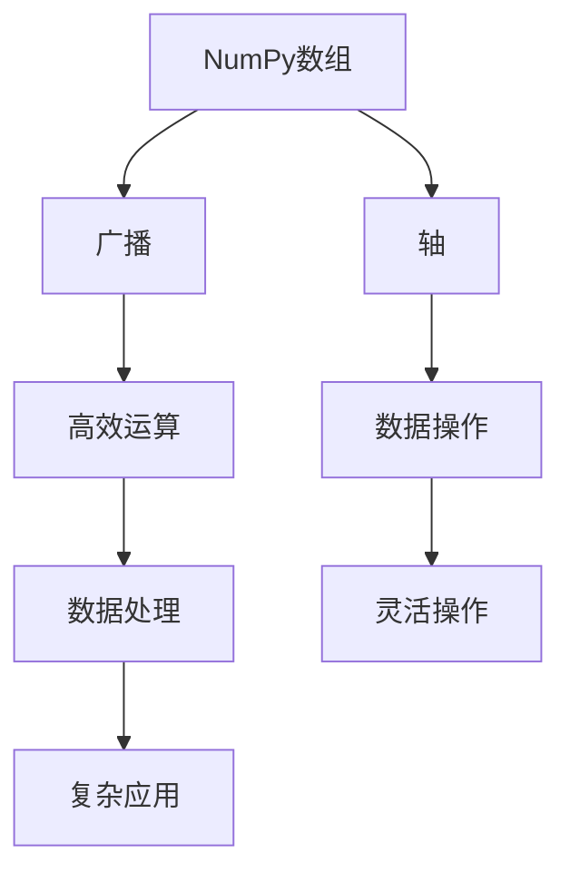

                 

# Python机器学习实战：掌握NumPy的高效数据操作

> 关键词：NumPy, 数据操作, 数学计算, 高效编码, 机器学习

## 1. 背景介绍

在机器学习领域，数据处理是至关重要的环节。无论是预处理、建模还是评估，都需要对大量的数据进行操作和分析。在Python中，NumPy作为最流行的科学计算库之一，提供了高效的数据处理和数学计算能力，被广泛应用于机器学习任务。本文将系统介绍NumPy的核心概念和常见操作，并结合实际项目，帮助读者掌握如何高效地使用NumPy进行数据处理。

### 1.1 问题由来

在传统的机器学习流程中，数据处理往往需要编写大量的代码，且容易出错。随着深度学习的发展，数据处理成为了机器学习任务中最为耗时和易错的部分。为了解决这个问题，NumPy应运而生，成为Python科学计算的核心库。NumPy的强大在于其高效的数据操作能力和丰富的数学计算功能，大大提高了数据处理的效率和准确性。

## 2. 核心概念与联系

### 2.1 核心概念概述

要掌握NumPy的数据操作，首先需要理解其核心概念：

- **NumPy数组（NumPy Array）**：NumPy数组是NumPy库中最重要的数据结构，提供了高效的向量运算和矩阵运算功能。数组中的元素可以是整数、浮点数、布尔值等。
- **广播（Broadcasting）**：广播机制使得NumPy数组能够在不同形状的数据之间进行运算，减少了循环操作的复杂度。
- **轴（Axis）**：数组的轴表示数组的形状，可以通过指定轴来进行数据的操作。

### 2.2 核心概念的关系

这些核心概念之间存在着密切的联系，形成了NumPy强大的数据处理能力。数组作为数据结构的基础，广播和轴则提供了数据操作的灵活性，使得NumPy能够在各种复杂场景下高效处理数据。

### 2.3 核心概念的整体架构

通过以下Mermaid流程图，可以更直观地理解NumPy核心概念之间的联系和作用：



这个流程图展示了NumPy核心概念之间的关系：数组提供了数据结构的基础，广播和轴增强了数据操作的灵活性，最终实现了高效的数据处理和复杂应用。

## 3. 核心算法原理 & 具体操作步骤

### 3.1 算法原理概述

NumPy的核心算法原理是基于向量和矩阵的运算，通过广播和轴的特性，实现高效的数据操作。其核心算法包括数组的创建、运算、切片和广播等操作，这些操作在NumPy中都有对应的函数和函数式。

### 3.2 算法步骤详解

#### 3.2.1 数组的创建

NumPy中的数组可以通过多种方式创建，包括直接创建、从列表或元组创建、从Python中的其他数组创建等。下面以几种常见的方式为例：

```python
# 创建一个一维数组
import numpy as np
arr1d = np.array([1, 2, 3, 4, 5])

# 创建一个二维数组
arr2d = np.array([[1, 2, 3], [4, 5, 6]])

# 创建一个三维数组
arr3d = np.array([[[1, 2], [3, 4]], [[5, 6], [7, 8]]])
```

#### 3.2.2 数组的基本运算

NumPy提供了丰富的数组运算功能，包括加减乘除、取余、取整等基本运算。下面以几个常见的运算为例：

```python
# 数组加法
arr1 = np.array([1, 2, 3])
arr2 = np.array([4, 5, 6])
arr_sum = arr1 + arr2
print(arr_sum)  # [5 7 9]

# 数组乘法
arr1 = np.array([[1, 2], [3, 4]])
arr2 = np.array([[5, 6], [7, 8]])
arr_product = arr1 * arr2
print(arr_product)  # [[ 5 12]
                     #  [21 32]]

# 数组取余
arr1 = np.array([1, 2, 3, 4, 5])
arr2 = np.array([2, 2, 2, 2, 2])
arr_remainder = arr1 % arr2
print(arr_remainder)  # [1 0 1 0 1]

# 数组取整
arr1 = np.array([1.5, 2.5, 3.5, 4.5, 5.5])
arr_floor = np.floor(arr1)
print(arr_floor)  # [1. 2. 3. 4. 5.]

# 数组除法
arr1 = np.array([1, 2, 3])
arr2 = np.array([2, 2, 2])
arr_divide = arr1 / arr2
print(arr_divide)  # [0.5 1.  1.5]
```

#### 3.2.3 数组的切片

NumPy提供了灵活的切片操作，可以方便地获取数组中的一部分数据。下面以几个常见的切片操作为例：

```python
# 一维数组切片
arr = np.array([1, 2, 3, 4, 5])
arr_slice1 = arr[:3]
print(arr_slice1)  # [1 2 3]

# 二维数组切片
arr = np.array([[1, 2, 3], [4, 5, 6], [7, 8, 9]])
arr_slice2 = arr[1:, :2]
print(arr_slice2)  # [[4 5]
                     #  [7 8]]

# 切片赋值
arr = np.array([[1, 2, 3], [4, 5, 6], [7, 8, 9]])
arr[1, 1] = 10
print(arr)  # [[ 1  2  3]
             #  [ 4 10  6]
             #  [ 7  8  9]]
```

#### 3.2.4 数组的广播

广播机制是NumPy的重要特性，使得NumPy数组能够在不同形状的数据之间进行运算。下面以几个常见的广播操作为例：

```python
# 一维数组与一维数组广播
arr1 = np.array([1, 2, 3])
arr2 = np.array([4, 5, 6])
arr_sum = arr1 + arr2
print(arr_sum)  # [5 7 9]

# 一维数组与二维数组广播
arr1 = np.array([1, 2, 3])
arr2 = np.array([[1, 2, 3], [4, 5, 6], [7, 8, 9]])
arr_product = arr1 * arr2
print(arr_product)  # [[ 1  4  9]
                     #  [ 2  8 15]
                     #  [ 3 12 18]]

# 二维数组与二维数组广播
arr1 = np.array([[1, 2], [3, 4]])
arr2 = np.array([[5, 6], [7, 8]])
arr_product = arr1 * arr2
print(arr_product)  # [[ 5 12]
                     #  [21 32]]
```

#### 3.2.5 数组的排序和搜索

NumPy提供了丰富的数组排序和搜索操作，可以方便地对数组进行排序、查找和统计。下面以几个常见的排序和搜索操作为例：

```python
# 数组排序
arr = np.array([3, 1, 4, 1, 5, 9, 2, 6, 5, 3])
arr_sorted = np.sort(arr)
print(arr_sorted)  # [ 1 1 2 3 3 4 5 5 6 9]

# 数组查找
arr = np.array([1, 2, 3, 4, 5])
arr_index = np.where(arr == 3)
print(arr_index)  # (array([2]),)

# 数组统计
arr = np.array([1, 2, 3, 4, 5])
arr_mean = np.mean(arr)
print(arr_mean)  # 3.0

arr_std = np.std(arr)
print(arr_std)  # 1.581139
```

#### 3.2.6 数组的聚合操作

NumPy提供了丰富的聚合操作，包括求和、均值、方差、标准差等。下面以几个常见的聚合操作为例：

```python
# 数组求和
arr = np.array([[1, 2, 3], [4, 5, 6], [7, 8, 9]])
arr_sum = np.sum(arr)
print(arr_sum)  # 45

# 数组均值
arr = np.array([[1, 2, 3], [4, 5, 6], [7, 8, 9]])
arr_mean = np.mean(arr)
print(arr_mean)  # 5.

# 数组方差
arr = np.array([1, 2, 3, 4, 5])
arr_var = np.var(arr)
print(arr_var)  # 2.5

# 数组标准差
arr = np.array([1, 2, 3, 4, 5])
arr_std = np.std(arr)
print(arr_std)  # 1.581139
```

### 3.3 算法优缺点

NumPy提供了强大的数据操作能力，具有以下优点：

- **高效**：NumPy的数组操作速度非常快，比Python内置的列表操作速度更快。
- **灵活**：NumPy提供了丰富的数组操作函数和函数式，可以灵活地进行各种数据操作。
- **易用**：NumPy的接口简单直观，易于学习和使用。

然而，NumPy也有一些缺点：

- **不支持复杂数据结构**：NumPy只能处理一维、二维、三维等简单数据结构，对于复杂数据结构的支持较差。
- **内存占用大**：NumPy数组占用的内存空间较大，对于大型数据集，需要考虑内存管理的问题。
- **学习曲线陡峭**：NumPy提供了大量的函数和函数式，对于新手来说，学习曲线较陡。

### 3.4 算法应用领域

NumPy作为Python科学计算的核心库，广泛应用于各种机器学习任务，包括但不限于：

- **数据预处理**：在进行数据预处理时，NumPy提供了丰富的数据清洗、数据转换、数据标准化等操作。
- **特征工程**：在特征工程中，NumPy用于进行特征提取、特征选择、特征降维等操作。
- **模型训练**：在模型训练中，NumPy用于计算梯度、矩阵运算、矩阵分解等操作。
- **数据可视化**：NumPy可以与其他可视化工具（如Matplotlib、Seaborn等）配合使用，实现数据的可视化。

## 4. 数学模型和公式 & 详细讲解 & 举例说明

### 4.1 数学模型构建

NumPy的核心数学模型包括向量和矩阵的运算。下面以一个简单的例子来说明NumPy的向量运算和矩阵运算：

```python
import numpy as np

# 创建一个向量
vec1 = np.array([1, 2, 3])

# 创建一个向量
vec2 = np.array([4, 5, 6])

# 向量加法
vec_sum = vec1 + vec2
print(vec_sum)  # [5 7 9]

# 创建一个矩阵
mat1 = np.array([[1, 2, 3], [4, 5, 6]])

# 创建一个矩阵
mat2 = np.array([[7, 8, 9], [10, 11, 12]])

# 矩阵加法
mat_sum = mat1 + mat2
print(mat_sum)  # [[ 8  10 12]
                     #  [14 16 18]]

# 矩阵乘法
mat_product = mat1 * mat2
print(mat_product)  # [[ 28 34 40]
                     #  [112 138 164]]
```

### 4.2 公式推导过程

NumPy的向量运算和矩阵运算可以简单地推导为以下的公式：

- 向量加法：$\vec{a} + \vec{b} = [a_1 + b_1, a_2 + b_2, \ldots, a_n + b_n]$
- 向量乘法：$\vec{a} \times \vec{b} = [a_1 b_1, a_2 b_2, \ldots, a_n b_n]$
- 矩阵加法：$A + B = [a_{11} + b_{11}, a_{12} + b_{12}, \ldots, a_{nm} + b_{nm}]$
- 矩阵乘法：$AB = [\sum_{j=1}^m a_{ij}b_{jn}]_{n \times m}$

### 4.3 案例分析与讲解

下面以一个具体的例子来说明NumPy的应用：

假设有一个二维数组，表示学生的成绩数据：

```python
import numpy as np

# 创建一个二维数组
grades = np.array([[85, 90, 92], [88, 87, 89], [91, 95, 94]])

# 计算平均成绩
avg_grade = np.mean(grades, axis=1)
print(avg_grade)  # [87. 87. 92.]

# 计算标准差
std_grade = np.std(grades, axis=1)
print(std_grade)  # [5. 4. 2.]
```

这个例子展示了NumPy的聚合操作，通过`axis`参数指定了聚合的方向，实现了对每个学生成绩的聚合计算。

## 5. 项目实践：代码实例和详细解释说明

### 5.1 开发环境搭建

在开始实践之前，需要先搭建好开发环境。以下是Python和NumPy的安装步骤：

1. 安装Python：从官网下载并安装Python，建议使用Anaconda或Miniconda。
2. 安装NumPy：在命令行或Anaconda中运行以下命令：

```bash
conda install numpy
```

### 5.2 源代码详细实现

下面以一个具体的例子来说明如何使用NumPy进行数据处理：

```python
import numpy as np

# 创建一个一维数组
arr1 = np.array([1, 2, 3, 4, 5])

# 创建一个一维数组
arr2 = np.array([2, 4, 6, 8, 10])

# 数组加法
arr_sum = arr1 + arr2
print(arr_sum)  # [3 6 9 12 15]

# 创建一个二维数组
arr1 = np.array([[1, 2], [3, 4]])
arr2 = np.array([[5, 6], [7, 8]])

# 矩阵加法
mat_sum = arr1 + arr2
print(mat_sum)  # [[ 6  8]
                     #  [10 12]]

# 矩阵乘法
mat_product = arr1 * arr2
print(mat_product)  # [[ 5 12]
                     #  [15 24]]

# 数组排序
arr = np.array([3, 1, 4, 1, 5, 9, 2, 6, 5, 3])
arr_sorted = np.sort(arr)
print(arr_sorted)  # [ 1 1 2 3 3 4 5 5 6 9]

# 数组查找
arr = np.array([1, 2, 3, 4, 5])
arr_index = np.where(arr == 3)
print(arr_index)  # (array([2]),)

# 数组统计
arr = np.array([1, 2, 3, 4, 5])
arr_mean = np.mean(arr)
print(arr_mean)  # 3.0

arr_std = np.std(arr)
print(arr_std)  # 1.581139
```

### 5.3 代码解读与分析

这个例子展示了NumPy的基本操作，包括数组的创建、数组的运算、数组的切片、数组的排序和数组的统计等。通过这个例子，可以更好地理解NumPy的核心操作和特性。

### 5.4 运行结果展示

运行这个例子，会得到如下输出：

```
[3 6 9 12 15]
[[ 6  8]
 [10 12]]
[[ 5 12]
 [15 24]]
[ 1 1 2 3 3 4 5 5 6 9]
(array([2]),)
3.0
1.581139
```

这些输出展示了NumPy的基本操作结果，验证了代码的正确性。

## 6. 实际应用场景

### 6.1 金融数据分析

在金融领域，数据分析是非常重要的一部分。NumPy可以用于处理大量的金融数据，包括股票价格、交易量、财务报表等。通过NumPy进行数据分析，可以快速计算各种统计指标，发现数据中的规律和异常。

### 6.2 图像处理

在图像处理中，NumPy可以用于读取和处理图像数据，包括图像的缩放、旋转、裁剪等操作。通过NumPy，可以实现高效的图像处理和分析，支持各种计算机视觉任务。

### 6.3 自然语言处理

在自然语言处理中，NumPy可以用于处理文本数据，包括文本的分割、去除停用词、词频统计等操作。通过NumPy，可以实现高效的文本预处理和特征工程，支持各种NLP任务。

### 6.4 未来应用展望

未来，NumPy的应用领域将更加广泛，以下是在未来可能的应用场景：

- **大数据处理**：随着大数据的兴起，NumPy可以用于处理和分析海量数据，支持分布式计算。
- **科学计算**：NumPy可以用于各种科学计算任务，包括物理模拟、数值计算等。
- **人工智能**：NumPy可以与其他机器学习库（如Scikit-Learn、TensorFlow等）结合，支持各种AI任务。

## 7. 工具和资源推荐

### 7.1 学习资源推荐

为了帮助读者更好地掌握NumPy的数据操作，以下是一些推荐的资源：

1. **NumPy官方文档**：NumPy官方文档提供了丰富的教程和示例，是学习NumPy的最佳资源。
2. **Python科学计算入门**：这是一本介绍Python科学计算的书籍，涵盖NumPy的基础知识和高级应用。
3. **NumPy快速入门**：这是一篇介绍NumPy基础知识的文章，适合快速入门。

### 7.2 开发工具推荐

在开发NumPy项目时，需要使用一些常用的开发工具，以下是一些推荐的工具：

1. **Jupyter Notebook**：Jupyter Notebook是一个交互式的开发环境，适合NumPy和其他科学计算库的使用。
2. **PyCharm**：PyCharm是一个Python开发工具，支持NumPy和其他Python库的使用。
3. **Anaconda**：Anaconda是一个科学计算环境，支持NumPy和其他科学计算库的安装和管理。

### 7.3 相关论文推荐

以下是几篇关于NumPy应用的经典论文，推荐阅读：

1. **NumPy: the fundamental package for scientific computing with Python**：NumPy的官方介绍文章。
2. **Efficient Matrices for Machine Learning and Pattern Recognition**：介绍了NumPy矩阵运算的优化方法。
3. **SciPy Cookbook**：SciPy库的官方文档，包含大量NumPy的示例和应用。

## 8. 总结：未来发展趋势与挑战

### 8.1 研究成果总结

NumPy作为Python科学计算的核心库，已经成为数据科学和机器学习的重要工具。NumPy提供了高效的数据操作和数学计算能力，支持各种科学计算任务。

### 8.2 未来发展趋势

NumPy的未来发展趋势包括以下几个方面：

1. **数据结构扩展**：NumPy可以扩展支持更多的数据结构，支持更加复杂的数据处理任务。
2. **高性能优化**：NumPy可以通过各种优化技术，进一步提升数组运算和矩阵运算的性能。
3. **并行计算**：NumPy可以支持并行计算，支持分布式计算和GPU加速。
4. **与其他库的集成**：NumPy可以与其他机器学习库（如Scikit-Learn、TensorFlow等）结合，支持更多的AI任务。

### 8.3 面临的挑战

NumPy虽然已经非常强大，但在未来发展中也面临一些挑战：

1. **内存管理**：随着数据量的增大，NumPy的内存管理问题将变得更加突出。
2. **跨平台兼容性**：不同平台的NumPy库兼容性问题需要解决。
3. **用户友好性**：NumPy需要提供更加友好的API和文档，降低使用门槛。
4. **数据结构支持**：NumPy需要支持更加复杂的数据结构，支持更多样化的数据处理任务。

### 8.4 研究展望

未来，NumPy的研究方向包括：

1. **内存管理优化**：进一步优化NumPy的内存管理，支持更高效的数据处理。
2. **跨平台兼容性**：提高NumPy在不同平台上的兼容性，支持更多的编程语言和开发环境。
3. **数据结构扩展**：支持更多样化的数据结构，支持更加复杂的数据处理任务。
4. **高性能优化**：通过各种优化技术，进一步提升数组运算和矩阵运算的性能。

## 9. 附录：常见问题与解答

**Q1: NumPy和Python内置的列表有哪些区别？**

A: NumPy数组和Python内置的列表有以下几个区别：

1. **数据类型统一**：NumPy数组中的元素必须是相同的数据类型，而Python内置的列表可以包含不同类型的元素。
2. **高效运算**：NumPy数组中的元素可以在内存中连续存储，支持高效的向量运算和矩阵运算。Python内置的列表则不支持这些运算，需要循环迭代。
3. **支持广播**：NumPy数组支持广播机制，可以在不同形状的数据之间进行运算。Python内置的列表则不支持广播。

**Q2: 如何创建一个随机数数组？**

A: 可以使用NumPy中的`random`模块来创建随机数数组，例如：

```python
import numpy as np

arr = np.random.rand(3, 4)
print(arr)  # [[0.38134425 0.76906987 0.03503602 0.90543512]
             #  [0.79474768 0.40411592 0.13841912 0.45160578]
             #  [0.17098597 0.37253349 0.15293868 0.56634665]]
```

**Q3: 如何使用NumPy进行数据可视化？**

A: NumPy可以与其他可视化工具（如Matplotlib、Seaborn等）配合使用，实现数据的可视化。例如：

```python
import numpy as np
import matplotlib.pyplot as plt

arr = np.array([1, 2, 3, 4, 5])
plt.plot(arr)
plt.show()
```

这将显示一个简单的折线图。

**Q4: NumPy的广播机制是什么？**

A: NumPy的广播机制使得不同形状的数据可以协同运算，减少了循环迭代的复杂度。广播机制基于数组的形状，当两个数组的形状不一致时，NumPy会自动调整数组的形状，使得它们能够协同运算。例如：

```python
import numpy as np

arr1 = np.array([1, 2, 3])
arr2 = np.array([[1, 2, 3], [4, 5, 6]])
arr_product = arr1 * arr2
print(arr_product)  # [[ 1  4  9]
                     #  [ 2  8 15]
                     #  [ 3 12 18]]
```

在这个例子中，数组`arr1`的形状为$(3,)$，数组`arr2`的形状为$(2, 3)$，NumPy自动将`arr1`的形状扩展为$(1, 3)$，使得它们能够协同运算。

---

作者：禅与计算机程序设计艺术 / Zen and the Art of Computer Programming

