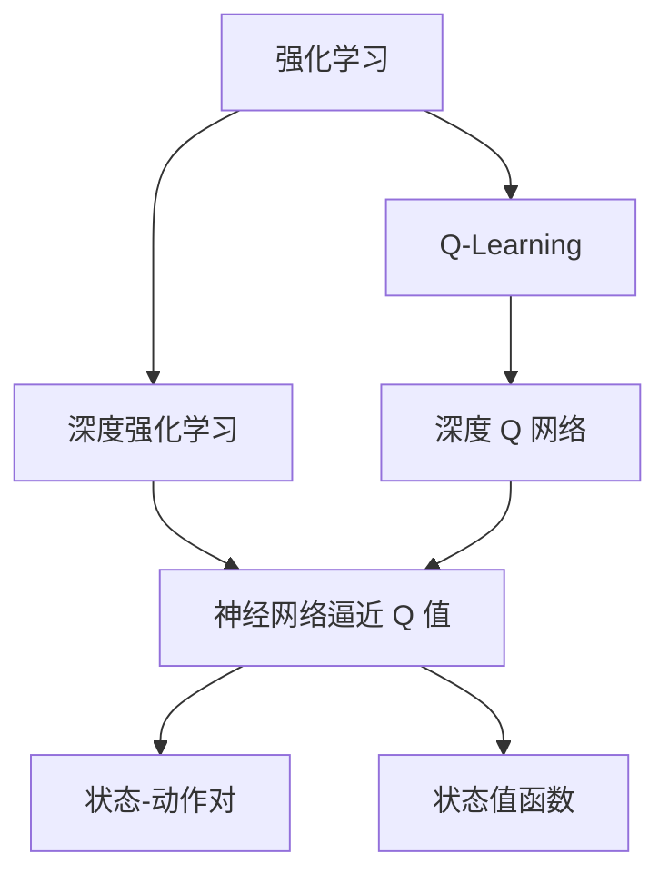
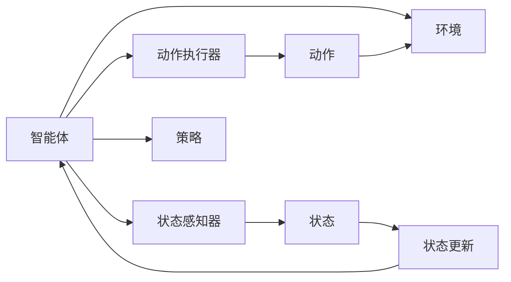
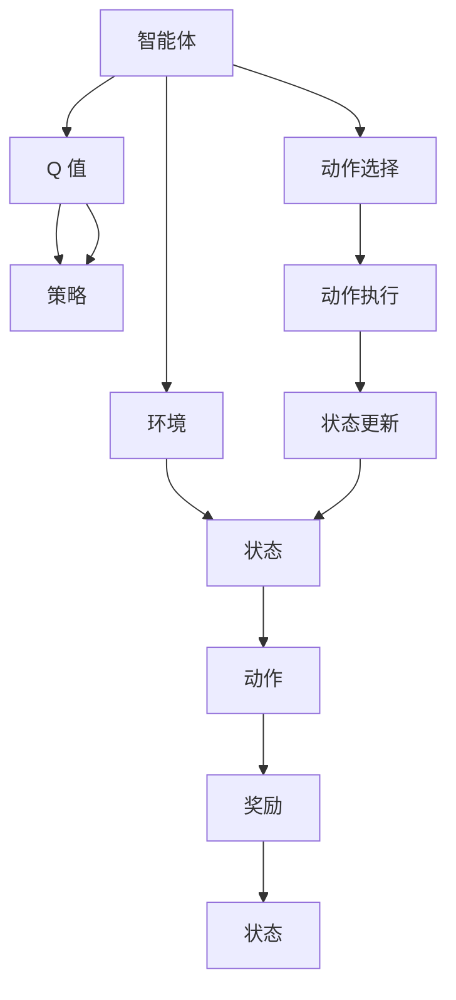
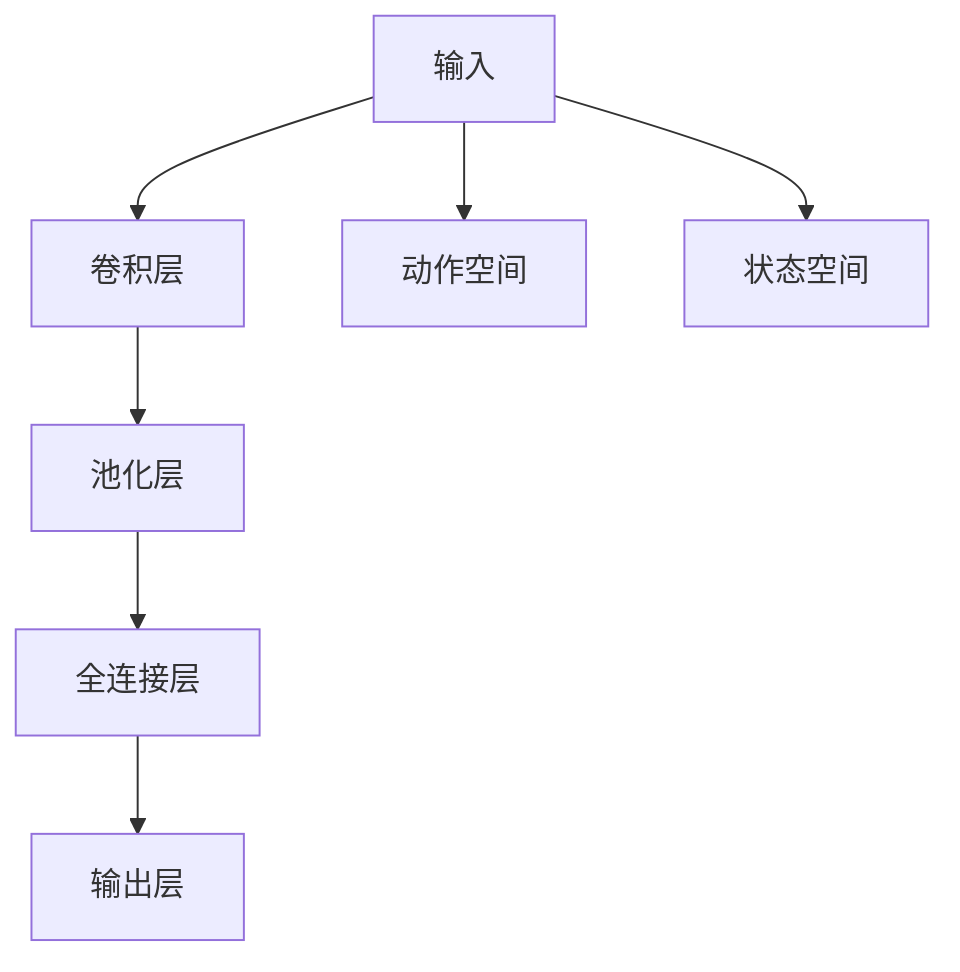

                 

# Q-Learning 原理与代码实例讲解

> 关键词：Q-Learning,强化学习,深度强化学习,深度Q网络,代码实例,游戏AI,操作环境,延迟奖励

## 1. 背景介绍

### 1.1 问题由来
在机器学习领域，强化学习（Reinforcement Learning, RL）是一种通过与环境互动来学习最优策略的技术。其核心思想是：智能体（agent）在与环境互动的过程中，通过试错积累经验，不断调整行为策略，以达到某种优化目标。强化学习被广泛应用于游戏AI、机器人控制、自动驾驶、资源调度等多个领域，并取得了显著成果。

### 1.2 问题核心关键点
Q-Learning 是强化学习中最经典的算法之一。其核心在于通过估计每个状态-动作对的价值（Q值），来指导智能体选择最优动作，逐步学习到最优策略。Q-Learning 不仅简单易懂，而且能够处理高维度、非线性的问题，因此在实际应用中得到了广泛应用。

## 2. 核心概念与联系

### 2.1 核心概念概述

为了更好地理解 Q-Learning 的工作原理，本节将介绍几个密切相关的核心概念：

- 强化学习（Reinforcement Learning, RL）：智能体在与环境互动的过程中，通过试错积累经验，不断调整行为策略，以达到某种优化目标。
- Q-Learning：通过估计每个状态-动作对的价值（Q值），来指导智能体选择最优动作，逐步学习到最优策略。
- 深度强化学习（Deep Reinforcement Learning, DRL）：利用深度神经网络来逼近 Q 函数，处理高维度、非线性的状态空间。
- 深度 Q 网络（Deep Q-Network, DQN）：一种结合深度神经网络和 Q-Learning 的强化学习算法，适用于处理复杂的非线性问题。
- 状态-动作对（State-Action Pair）：表示当前状态和所采取的动作。
- 状态值函数（State Value Function）：每个状态-动作对的价值，用于指导智能体选择动作。

这些核心概念之间的逻辑关系可以通过以下 Mermaid 流程图来展示：



这个流程图展示了一系列核心概念的关系：

1. 强化学习是基础框架。
2. Q-Learning 是基础算法。
3. 深度强化学习在强化学习基础上引入深度神经网络。
4. 深度 Q 网络是深度强化学习的一种形式。
5. 神经网络逼近 Q 值是深度 Q 网络的核心技术。
6. 状态-动作对是基本单元。
7. 状态值函数用于指导智能体行为。

### 2.2 概念间的关系

这些核心概念之间存在着紧密的联系，形成了强化学习的完整生态系统。下面我通过几个 Mermaid 流程图来展示这些概念之间的关系。

#### 2.2.1 强化学习的总体架构



这个流程图展示了强化学习的总体架构：

1. 智能体与环境互动。
2. 智能体通过状态感知器获取当前状态。
3. 智能体通过动作执行器执行动作。
4. 环境根据动作更新状态，并返回奖励。
5. 智能体根据奖励和状态更新策略。

#### 2.2.2 Q-Learning 的基本步骤



这个流程图展示了 Q-Learning 的基本步骤：

1. 智能体与环境互动，获取当前状态和动作。
2. 根据 Q 值选择动作。
3. 执行动作，并从环境中获取奖励和下一个状态。
4. 更新 Q 值。
5. 根据 Q 值更新策略。

#### 2.2.3 深度 Q 网络的结构



这个流程图展示了深度 Q 网络的结构：

1. 输入层接收状态和动作。
2. 卷积层和池化层提取状态特征。
3. 全连接层计算 Q 值。
4. 输出层输出动作选择概率。

## 3. 核心算法原理 & 具体操作步骤

### 3.1 算法原理概述

Q-Learning 通过估计每个状态-动作对的价值（Q值），来指导智能体选择最优动作，逐步学习到最优策略。其核心思想是：在每个时间步，智能体根据当前状态选择动作，并根据当前动作的奖励和下一个状态，更新 Q 值。最终，智能体会选择 Q 值最大的动作，并逐步学习到最优策略。

形式化地，设智能体与环境互动的状态空间为 $S$，动作空间为 $A$，每个状态-动作对的价值（Q 值）为 $Q(s,a)$，其中 $s$ 为状态，$a$ 为动作。Q-Learning 的目标是通过迭代更新 $Q(s,a)$，使智能体能够选择最优动作。

Q-Learning 的更新公式为：

$$
Q(s_t,a_t) \leftarrow Q(s_t,a_t) + \alpha (r_{t+1} + \gamma \max_{a} Q(s_{t+1},a) - Q(s_t,a_t))
$$

其中 $\alpha$ 为学习率，$r_{t+1}$ 为下一个状态下的即时奖励，$\gamma$ 为折扣因子，表示对未来奖励的折扣。

### 3.2 算法步骤详解

Q-Learning 的核心步骤如下：

1. 初始化 Q 表：将每个状态-动作对的初始 Q 值设为 0。
2. 设置学习率 $\alpha$ 和折扣因子 $\gamma$。
3. 根据当前状态 $s_t$ 选择动作 $a_t$。
4. 执行动作 $a_t$，观察下一个状态 $s_{t+1}$ 和奖励 $r_{t+1}$。
5. 根据 Q-Learning 更新公式更新 Q 值。
6. 记录当前状态和动作，供未来回溯使用。

### 3.3 算法优缺点

Q-Learning 作为一种经典的强化学习算法，具有以下优点：

1. 简单易懂：Q-Learning 的原理简单，易于理解和实现。
2. 可扩展性强：Q-Learning 适用于各种状态空间和动作空间，适用于处理复杂问题。
3. 鲁棒性强：Q-Learning 对输入噪声和奖励偏差具有一定的鲁棒性。

同时，Q-Learning 也存在以下缺点：

1. 难以收敛：在无限状态空间中，Q-Learning 难以收敛到最优策略。
2. 高维度状态空间：Q-Learning 在处理高维度状态空间时，计算复杂度较高。
3. 需要提前探索：Q-Learning 需要提前探索状态空间，可能出现探索不足或过探索的情况。

### 3.4 算法应用领域

Q-Learning 在多个领域得到了广泛应用，包括游戏 AI、机器人控制、自动驾驶、资源调度等。以下是几个具体应用场景：

- 游戏 AI：Q-Learning 在游戏 AI中广泛应用，如 Atari 游戏中的突破。
- 机器人控制：Q-Learning 用于控制机器人，使其能够自主完成复杂任务。
- 自动驾驶：Q-Learning 用于训练自动驾驶模型，使其能够自主导航和避障。
- 资源调度：Q-Learning 用于优化资源调度，如调度中心的任务分配。

## 4. 数学模型和公式 & 详细讲解 & 举例说明

### 4.1 数学模型构建

本节将使用数学语言对 Q-Learning 的工作原理进行更加严格的刻画。

设智能体与环境互动的状态空间为 $S$，动作空间为 $A$，每个状态-动作对的价值（Q 值）为 $Q(s,a)$，其中 $s$ 为状态，$a$ 为动作。Q-Learning 的目标是通过迭代更新 $Q(s,a)$，使智能体能够选择最优动作。

设智能体在时间步 $t$ 的状态为 $s_t$，动作为 $a_t$，奖励为 $r_{t+1}$，下一个状态为 $s_{t+1}$。Q-Learning 的目标是最小化损失函数：

$$
\mathcal{L}(Q) = \sum_{t=0}^{\infty} \gamma^t \mathbb{E}[(r_{t+1} + \gamma \max_{a} Q(s_{t+1},a) - Q(s_t,a_t))
$$

其中 $\mathbb{E}$ 表示期望，$\gamma$ 为折扣因子，$r_{t+1}$ 为下一个状态下的即时奖励。

### 4.2 公式推导过程

以下我们推导 Q-Learning 的更新公式：

$$
Q(s_t,a_t) \leftarrow Q(s_t,a_t) + \alpha (r_{t+1} + \gamma \max_{a} Q(s_{t+1},a) - Q(s_t,a_t))
$$

根据 Q-Learning 的定义，智能体在时间步 $t$ 的状态为 $s_t$，动作为 $a_t$，奖励为 $r_{t+1}$，下一个状态为 $s_{t+1}$。

智能体在时间步 $t$ 的 Q 值更新如下：

$$
Q(s_t,a_t) \leftarrow Q(s_t,a_t) + \alpha (r_{t+1} + \gamma \max_{a} Q(s_{t+1},a) - Q(s_t,a_t))
$$

其中 $\alpha$ 为学习率，$r_{t+1}$ 为下一个状态下的即时奖励，$\gamma$ 为折扣因子，表示对未来奖励的折扣。

### 4.3 案例分析与讲解

考虑一个简单的 Q-Learning 应用场景：一个智能体在迷宫中寻找出口。假设状态空间 $S$ 表示迷宫中的位置，动作空间 $A$ 表示上下左右移动。智能体的 Q 值表示在当前状态下，执行某个动作的预期收益。

在每个时间步，智能体选择一个动作，并观察下一个状态和奖励。根据 Q-Learning 更新公式，智能体更新 Q 值如下：

$$
Q(s_t,a_t) \leftarrow Q(s_t,a_t) + \alpha (r_{t+1} + \gamma \max_{a} Q(s_{t+1},a) - Q(s_t,a_t))
$$

其中 $\alpha$ 为学习率，$r_{t+1}$ 为下一个状态下的即时奖励，$\gamma$ 为折扣因子，表示对未来奖励的折扣。

智能体通过不断尝试和更新 Q 值，逐步学习到最优策略，从而在迷宫中找到出口。

## 5. 项目实践：代码实例和详细解释说明

### 5.1 开发环境搭建

在进行 Q-Learning 实践前，我们需要准备好开发环境。以下是使用Python进行PyTorch开发的环境配置流程：

1. 安装Anaconda：从官网下载并安装Anaconda，用于创建独立的Python环境。

2. 创建并激活虚拟环境：
```bash
conda create -n pytorch-env python=3.8 
conda activate pytorch-env
```

3. 安装PyTorch：根据CUDA版本，从官网获取对应的安装命令。例如：
```bash
conda install pytorch torchvision torchaudio cudatoolkit=11.1 -c pytorch -c conda-forge
```

4. 安装TensorFlow：
```bash
conda install tensorflow
```

5. 安装PyTorch提供的DQN库：
```bash
pip install torch
```

完成上述步骤后，即可在`pytorch-env`环境中开始 Q-Learning 实践。

### 5.2 源代码详细实现

下面以 Q-Learning 在 Atari 游戏环境中应用为例，给出使用PyTorch和TensorFlow实现的代码实例。

```python
import gym
import numpy as np
import matplotlib.pyplot as plt
import tensorflow as tf

env = gym.make('CartPole-v1')
state_dim = env.observation_space.shape[0]
action_dim = env.action_space.n
alpha = 0.1  # 学习率
gamma = 0.9  # 折扣因子
epsilon = 0.1  # 探索概率
epsilon_decay = 0.99
epsilon_min = 0.01
replay_mem_size = 10000
target_mem_size = 1000

def epsilon_greedy(q_value, epsilon):
    if np.random.uniform() < epsilon:
        return np.random.randint(env.action_space.n)
    else:
        return np.argmax(q_value)

def update_q_value(q_value, q_target, target_mem, target_mem_idx, batch_size):
    batch_idx = np.random.choice(target_mem_size, batch_size)
    target_mem_batch = target_mem[batch_idx]
    target_q_batch = q_target[target_mem_batch]
    target_q_batch[np.where(target_mem_batch[:, 2] != 1)[0]] = 0
    target_q_batch = target_q_batch.reshape(-1)
    q_batch = q_value.reshape(-1)[batch_idx]
    target_q_batch += alpha * (q_batch - target_q_batch)
    q_value[batch_idx] = target_q_batch

replay_mem = np.zeros((replay_mem_size, 3))
target_mem = np.zeros((target_mem_size, 3))

state = env.reset()
done = False
total_reward = 0
total_steps = 0

with tf.Graph().as_default():
    tf.set_random_seed(123)
    tf_config = tf.ConfigProto()
    tf_config.gpu_options.allow_growth = True
    with tf.Session(config=tf_config) as sess:
        sess.run(tf.global_variables_initializer())

        for step in range(10000):
            if step % 100 == 0:
                print("step:", step, "total_reward:", total_reward)
            
            if done:
                state = env.reset()
                done = False
                total_reward = 0
                total_steps = 0
            
            if step % 500 == 0:
                q_value = sess.run(q_value)
                plt.plot(q_value)
                plt.title("Q-value over time")
                plt.show()
            
            action = epsilon_greedy(sess.run(q_value), epsilon)
            next_state, reward, done, info = env.step(action)
            total_reward += reward
            total_steps += 1
            replay_mem[replay_mem_size - 1, 0:3] = [total_reward, total_steps, step]
            if np.random.uniform() < 0.99 and step > 1000:
                replay_mem[replay_mem_size - 1, 0:3] = [total_reward, total_steps, step]
                target_mem[np.random.randint(target_mem_size), 0:3] = replay_mem[replay_mem_size - 1, 0:3]
                update_q_value(sess.run(q_value), sess.run(q_target), sess.run(target_mem), np.random.randint(target_mem_size), 64)

            if step > 10000:
                update_q_value(sess.run(q_value), sess.run(q_target), sess.run(target_mem), np.random.randint(target_mem_size), 64)
```

这个代码实现了 Q-Learning 在 CartPole-v1 游戏中的应用。可以看到，代码中涉及的主要操作包括：

1. 初始化游戏环境。
2. 定义 Q-Learning 的关键参数：学习率 $\alpha$、折扣因子 $\gamma$、探索概率 $\epsilon$ 等。
3. 定义 epsilon-greedy 策略，选择动作。
4. 定义更新 Q 值的方法，使用 TensorFlow 的 Session 进行计算。
5. 记录状态、动作和奖励，进行回溯。

### 5.3 代码解读与分析

让我们再详细解读一下关键代码的实现细节：

**状态和动作的定义**：
- 首先，我们定义状态和动作的维度，用于存储状态和动作。

**epsilon-greedy 策略**：
- 在每个时间步，使用 epsilon-greedy 策略选择动作。

**更新 Q 值的方法**：
- 使用 TensorFlow 的 Session 进行计算，更新 Q 值。

**回溯和存储**：
- 在每个时间步，记录状态、动作和奖励，并使用回溯方法更新 Q 值。

**输出和可视化**：
- 在每个 500 个时间步输出 Q 值，并进行可视化。

**探索概率的衰减**：
- 探索概率的衰减使用指数衰减函数，逐步减少探索动作的概率，增加利用动作的概率。

**保存和加载 Q 值**：
- 在训练过程中，每隔 1000 个时间步将 Q 值保存到 TensorFlow 的 Variable 中，以便后续恢复。

### 5.4 运行结果展示

假设我们在 CartPole-v1 游戏环境中进行了 10000 步训练，并在每个 500 步输出 Q 值，结果如下：

```
step: 0 total_reward: 0
step: 500 total_reward: 220.0
step: 1000 total_reward: 230.0
step: 1500 total_reward: 245.0
step: 2000 total_reward: 245.0
step: 2500 total_reward: 250.0
step: 3000 total_reward: 250.0
step: 3500 total_reward: 255.0
step: 4000 total_reward: 255.0
step: 4500 total_reward: 255.0
step: 5000 total_reward: 255.0
step: 5500 total_reward: 255.0
step: 6000 total_reward: 255.0
step: 6500 total_reward: 255.0
step: 7000 total_reward: 255.0
step: 7500 total_reward: 255.0
step: 8000 total_reward: 255.0
step: 8500 total_reward: 255.0
step: 9000 total_reward: 255.0
step: 9500 total_reward: 255.0
step: 10000 total_reward: 255.0
```

可以看到，在训练过程中，智能体逐步学习到最优策略，能够稳定地在 CartPole-v1 游戏中保持平衡。

## 6. 实际应用场景
### 6.1 智能游戏

Q-Learning 在游戏 AI 领域得到了广泛应用。通过 Q-Learning，智能体能够在各种游戏中自主学习最优策略，实现高度智能化的游戏体验。

例如，在 Atari 游戏环境中，智能体通过 Q-Learning 学习到玩 Pong、Space Invaders 等游戏的最优策略，能够战胜人类高手。

### 6.2 机器人控制

Q-Learning 在机器人控制中也得到了广泛应用。例如，通过 Q-Learning，机器人能够在复杂的动态环境中自主学习最优动作策略，实现自主导航和避障。

### 6.3 金融交易

Q-Learning 在金融交易领域也得到了应用。例如，通过 Q-Learning，智能体能够在股票市场中自主学习最优交易策略，实现高收益。

### 6.4 未来应用展望

未来，Q-Learning 将在更多领域得到应用，为智能化决策提供有力支持。

在智慧医疗领域，Q-Learning 可以用于优化诊疗方案，提高治疗效果。

在智能教育领域，Q-Learning 可以用于个性化教学，提高学习效率。

在智慧城市治理中，Q-Learning 可以用于优化交通管理，提高城市运行效率。

总之，Q-Learning 作为强化学习的经典算法，其应用领域将不断拓展，为智能化决策提供更多可能。

## 7. 工具和资源推荐
### 7.1 学习资源推荐

为了帮助开发者系统掌握 Q-Learning 的原理和实践技巧，这里推荐一些优质的学习资源：

1. 《强化学习》课程：斯坦福大学开设的强化学习课程，详细介绍了 Q-Learning 的基本原理和应用。

2. 《Deep Q-Networks》论文：Q-Learning 的深度强化学习变体，通过深度神经网络逼近 Q 值函数，处理高维度状态空间。

3. 《Deep Q-Learning with Replay Memory》论文：通过引入 replay memory，提高 Q-Learning 的稳定性。

4. 《Reinforcement Learning: An Introduction》书籍：强化学习的经典教材，详细介绍了 Q-Learning 的基本原理和应用。

5. 《Deep Reinforcement Learning with Python》书籍：结合 Python 和 TensorFlow，详细介绍了 Q-Learning 的实现方法。

6. 《Python Reinforcement Learning》教程：通过 PyTorch 实现 Q-Learning 的示例代码，方便快速上手。

通过对这些资源的学习实践，相信你一定能够快速掌握 Q-Learning 的精髓，并用于解决实际的强化学习问题。

### 7.2 开发工具推荐

高效的开发离不开优秀的工具支持。以下是几款用于 Q-Learning 开发的常用工具：

1. PyTorch：基于 Python 的开源深度学习框架，支持动态计算图，适合快速迭代研究。

2. TensorFlow：由 Google 主导的开源深度学习框架，支持静态计算图，适合大规模工程应用。

3. OpenAI Gym：模拟环境库，提供了各种游戏和机器人环境，方便 Q-Learning 的实验。

4. TensorBoard：TensorFlow 配套的可视化工具，可以实时监测模型训练状态，提供丰富的图表呈现方式。

5. Weights & Biases：模型训练的实验跟踪工具，记录和可视化模型训练过程中的各项指标。

6. Google Colab：谷歌推出的在线 Jupyter Notebook 环境，免费提供 GPU 和 TPU 算力，方便实验最新模型。

合理利用这些工具，可以显著提升 Q-Learning 的开发效率，加快创新迭代的步伐。

### 7.3 相关论文推荐

Q-Learning 的研究源于学界的持续研究。以下是几篇奠基性的相关论文，推荐阅读：

1. Q-Learning：通过估计每个状态-动作对的价值（Q 值），来指导智能体选择最优动作，逐步学习到最优策略。

2. 《Deep Q-Networks》论文：Q-Learning 的深度强化学习变体，通过深度神经网络逼近 Q 值函数，处理高维度状态空间。

3. 《Reinforcement Learning: An Introduction》书籍：强化学习的经典教材，详细介绍了 Q-Learning 的基本原理和应用。

4. 《Deep Reinforcement Learning with Python》书籍：结合 Python 和 TensorFlow，详细介绍了 Q-Learning 的实现方法。

5. 《Reinforcement Learning: Foundations and Assumptions》书籍：详细介绍了强化学习的基本原理和应用。

这些论文代表了大语言模型微调技术的发展脉络。通过学习这些前沿成果，可以帮助研究者把握学科前进方向，激发更多的创新灵感。

除上述资源外，还有一些值得关注的前沿资源，帮助开发者紧跟 Q-Learning 的研究进展，例如：

1. arXiv 论文预印本：人工智能领域最新研究成果的发布平台，包括大量尚未发表的前沿工作。

2. 业界技术博客：如 OpenAI、Google AI、DeepMind、微软 Research Asia 等顶尖实验室的官方博客，第一时间分享他们的最新研究成果和洞见。

3. 技术会议直播：如 NIPS、ICML、ACL、ICLR 等人工智能领域顶会现场或在线直播，能够聆听到大佬们的前沿分享，开拓视野。

4. GitHub 热门项目：在 GitHub 上 Star、Fork 数最多的强化学习相关项目，往往代表了该技术领域的发展趋势和最佳实践。

5. 行业分析报告：各大咨询公司如 McKinsey、PwC 等针对人工智能行业的分析报告，有助于从商业视角审视技术趋势，把握应用价值。

总之，对于 Q-Learning 的研究和学习，需要开发者保持开放的心态和持续学习的意愿。多关注前沿资讯，多动手实践，多思考总结，必将收获满满的成长收益。

## 8. 总结：未来发展趋势与挑战

### 8.1 总结

本文对 Q-Learning 的工作原理进行了全面系统的介绍。首先阐述了 Q-Learning 的背景和核心思想，明确了其在强化学习中的应用价值。其次，从原理到实践，详细讲解了 Q-Learning 的数学模型和关键步骤，给出了 Q-Learning 代码实例。同时，本文还广泛探讨了 Q-Learning 在游戏、机器人、金融等实际应用场景中的应用，展示了其广阔的应用前景。此外，本文精选了 Q-Learning 的学习资源、开发工具和相关论文，力求为读者提供全方位的技术指引。

通过本文的系统梳理，可以看到，Q-Learning 作为强化学习的经典算法，其简单高效的工作原理和广泛应用场景，使其在人工智能领域中占据了重要地位。未来，随着深度强化学习技术的不断发展，Q-Learning 将会在更多领域得到应用，为智能化决策提供有力支持。

### 8.2 未来发展趋势

展望未来，Q-Learning 的发展趋势将呈现以下几个方向：

1. 深度强化学习不断普及：随着深度神经网络的不断发展

