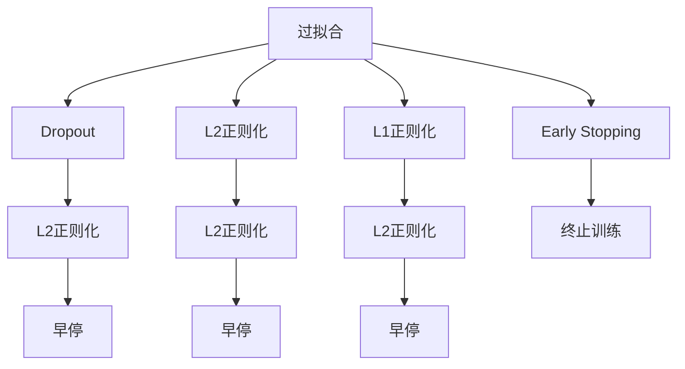
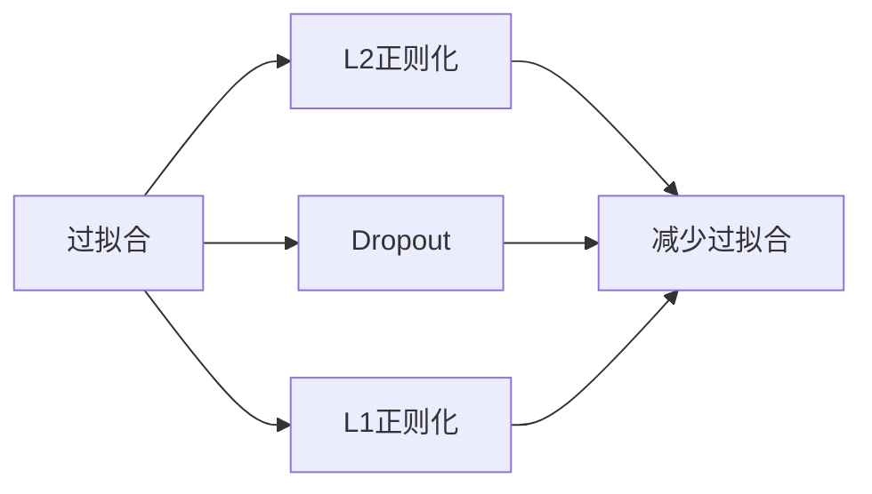
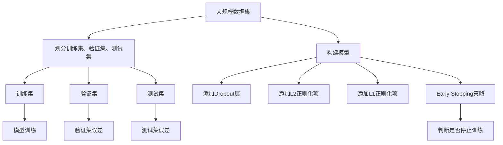

                 

# Regularization原理与代码实例讲解

> 关键词：过拟合,正则化,Dropout,权重衰减,早停法,代码实例,运行结果

## 1. 背景介绍

在机器学习和深度学习中，过拟合（Overfitting）是一个普遍存在的问题。模型在训练集上表现良好，但在测试集或新数据上表现不佳。为了避免过拟合，需要采用一些技术手段对模型进行约束和优化。

### 1.1 问题由来

在模型训练中，模型的复杂度增加会使得其能够拟合训练集中的噪声和随机波动，从而导致过拟合。过拟合不仅浪费计算资源，降低模型泛化能力，还可能导致模型的决策逻辑不稳定，影响实际应用效果。因此，需要通过一些正则化方法来避免过拟合。

### 1.2 问题核心关键点

正则化方法是一类通过增加模型复杂度惩罚项，降低模型过拟合风险的策略。常用的正则化方法包括：Dropout、L2正则化、L1正则化、Early Stopping等。通过这些方法，可以在保证模型拟合的同时，提升模型的泛化能力。

### 1.3 问题研究意义

避免过拟合是机器学习和深度学习模型训练中的重要问题。合理使用正则化方法，可以有效提升模型的泛化能力，降低训练成本，提高模型的稳定性和可靠性。正则化方法已成为深度学习中的重要组成部分，对于模型优化和性能提升具有重要意义。

## 2. 核心概念与联系

### 2.1 核心概念概述

为更好地理解正则化方法，本节将介绍几个密切相关的核心概念：

- 过拟合（Overfitting）：模型在训练集上表现良好，但在测试集或新数据上表现不佳的现象。
- Dropout：一种随机失活层的方法，随机丢弃部分神经元，降低模型的复杂度。
- L2正则化（L2 Regularization）：在损失函数中添加权重平方和项，防止模型权重过大，降低过拟合风险。
- L1正则化（L1 Regularization）：在损失函数中添加权重绝对值和项，防止模型权重过大，减少不必要的特征。
- Early Stopping：在训练过程中，根据验证集误差提前终止训练，防止模型过拟合。

这些核心概念之间的逻辑关系可以通过以下Mermaid流程图来展示：



这个流程图展示了他些核心概念之间的逻辑关系：

1. 过拟合是正则化方法解决的主要问题。
2. Dropout、L2正则化、L1正则化等都是正则化方法的具体形式。
3. Early Stopping是通过监控验证集误差来避免过拟合。

### 2.2 概念间的关系

这些核心概念之间存在着紧密的联系，形成了正则化方法的完整生态系统。下面我通过几个Mermaid流程图来展示这些概念之间的关系。

#### 2.2.1 过拟合与正则化的关系



这个流程图展示了过拟合与正则化之间的逻辑关系。正则化方法通过增加复杂度惩罚项，降低模型复杂度，从而减少过拟合。

#### 2.2.2 Dropout与L2正则化的关系


这个流程图展示了Dropout与L2正则化之间的关系。Dropout可以视为一种特殊形式的L2正则化，通过随机丢弃部分神经元，达到类似权重限制的效果。

#### 2.2.3 Early Stopping与Dropout的关系


这个流程图展示了Early Stopping与Dropout之间的关系。Early Stopping通过监控验证集误差，决定何时终止训练，而Dropout通过随机丢弃部分神经元，防止模型过拟合。

### 2.3 核心概念的整体架构

最后，我们用一个综合的流程图来展示这些核心概念在大规模数据集上的应用过程：



这个综合流程图展示了从数据集划分到模型训练、验证、测试的全过程。正则化方法在各个环节都有应用，从而提升模型的泛化能力。

## 3. 核心算法原理 & 具体操作步骤
### 3.1 算法原理概述

正则化方法通过在模型损失函数中添加额外的复杂度惩罚项，从而限制模型的复杂度，防止过拟合。具体而言，常用的正则化方法包括：

1. L2正则化：在损失函数中添加权重平方和项，防止权重过大，避免过拟合。
2. L1正则化：在损失函数中添加权重绝对值和项，稀疏化模型，减少不必要的特征。
3. Dropout：随机丢弃部分神经元，降低模型的复杂度，提升泛化能力。
4. Early Stopping：在训练过程中，根据验证集误差提前终止训练，避免过拟合。

这些方法的具体原理将在接下来的章节中详细讲解。

### 3.2 算法步骤详解

#### 3.2.1 L2正则化

L2正则化的数学公式为：

$$
\mathcal{L}_{\text{total}}(\theta) = \mathcal{L}_{\text{data}}(\theta) + \lambda \sum_{i=1}^n w_i^2
$$

其中，$\mathcal{L}_{\text{data}}(\theta)$ 为原始数据损失函数，$w_i$ 为模型中第 $i$ 个权重的值，$\lambda$ 为正则化系数。

具体实现步骤如下：

1. 构建原始损失函数。
2. 计算权重平方和项。
3. 将权重平方和项加入到原始损失函数中。
4. 更新模型参数。

#### 3.2.2 L1正则化

L1正则化的数学公式为：

$$
\mathcal{L}_{\text{total}}(\theta) = \mathcal{L}_{\text{data}}(\theta) + \lambda \sum_{i=1}^n |w_i|
$$

其中，$\mathcal{L}_{\text{data}}(\theta)$ 为原始数据损失函数，$w_i$ 为模型中第 $i$ 个权重的值，$\lambda$ 为正则化系数。

具体实现步骤如下：

1. 构建原始损失函数。
2. 计算权重绝对值和项。
3. 将权重绝对值和项加入到原始损失函数中。
4. 更新模型参数。

#### 3.2.3 Dropout

Dropout的具体实现步骤如下：

1. 定义Dropout层。
2. 在训练过程中，随机丢弃部分神经元。
3. 计算激活函数值。
4. 更新模型参数。

#### 3.2.4 Early Stopping

Early Stopping的具体实现步骤如下：

1. 定义Early Stopping策略。
2. 在每个epoch结束时，计算验证集误差。
3. 根据验证集误差，判断是否继续训练。
4. 记录最佳模型参数和验证集误差。

### 3.3 算法优缺点

正则化方法的主要优点包括：

1. 减少过拟合：通过增加复杂度惩罚项，限制模型复杂度，防止过拟合。
2. 提升泛化能力：降低模型在训练集上的噪声，提升其在测试集上的表现。
3. 降低计算资源消耗：通过限制模型复杂度，减少训练和推理过程中的计算量。

但正则化方法也存在一些缺点：

1. 可能降低模型精度：过于严格的正则化可能导致模型欠拟合，降低模型精度。
2. 参数调优困难：需要调整正则化系数等超参数，找到最优的平衡点。
3. 模型复杂度增加：正则化方法增加了额外的复杂度计算，增加了模型训练和推理的时间。

### 3.4 算法应用领域

正则化方法在机器学习和深度学习中得到了广泛的应用，涵盖以下领域：

- 计算机视觉：用于图像分类、目标检测、图像生成等任务。
- 自然语言处理：用于文本分类、情感分析、机器翻译等任务。
- 语音识别：用于声学建模、语言建模、语音合成等任务。
- 推荐系统：用于用户行为预测、商品推荐等任务。

正则化方法已经成为各种深度学习模型的标配，被广泛应用于各个领域。

## 4. 数学模型和公式 & 详细讲解  
### 4.1 数学模型构建

在正则化方法的数学模型中，我们通常将原始损失函数$\mathcal{L}_{\text{data}}(\theta)$与正则化项$\lambda \sum_{i=1}^n w_i^2$或$\lambda \sum_{i=1}^n |w_i|$相加，得到新的损失函数$\mathcal{L}_{\text{total}}(\theta)$。

具体而言，我们以线性回归为例，详细推导L2正则化的公式。

#### 4.1.1 L2正则化的数学推导

设线性回归模型的形式为：

$$
y = \theta_0 + \theta_1 x_1 + \theta_2 x_2 + \cdots + \theta_n x_n
$$

其中，$y$ 为预测值，$x_i$ 为输入特征，$\theta_i$ 为权重。假设训练集为 $D=\{(x_i, y_i)\}_{i=1}^m$，则原始损失函数为：

$$
\mathcal{L}_{\text{data}}(\theta) = \frac{1}{2m} \sum_{i=1}^m (\hat{y}_i - y_i)^2
$$

其中，$\hat{y}_i$ 为模型预测值，$y_i$ 为真实标签。

添加L2正则化项后，新的损失函数为：

$$
\mathcal{L}_{\text{total}}(\theta) = \frac{1}{2m} \sum_{i=1}^m (\hat{y}_i - y_i)^2 + \lambda \sum_{i=1}^n \theta_i^2
$$

其中，$\lambda$ 为正则化系数，$\sum_{i=1}^n \theta_i^2$ 为权重平方和项。

通过计算损失函数对权重$\theta_i$的梯度，可以得到模型参数的更新公式：

$$
\frac{\partial \mathcal{L}_{\text{total}}(\theta)}{\partial \theta_i} = \frac{\partial \mathcal{L}_{\text{data}}(\theta)}{\partial \theta_i} + \lambda \theta_i
$$

将梯度代入优化算法，即可更新模型参数。

#### 4.1.2 L1正则化的数学推导

L1正则化的数学推导与L2正则化类似，只是在损失函数中添加了权重绝对值和项：

$$
\mathcal{L}_{\text{total}}(\theta) = \frac{1}{2m} \sum_{i=1}^m (\hat{y}_i - y_i)^2 + \lambda \sum_{i=1}^n |\theta_i|
$$

其中，$\sum_{i=1}^n |\theta_i|$ 为权重绝对值和项。

## 5. 项目实践：代码实例和详细解释说明
### 5.1 开发环境搭建

在进行正则化方法实践前，我们需要准备好开发环境。以下是使用Python进行PyTorch开发的环境配置流程：

1. 安装Anaconda：从官网下载并安装Anaconda，用于创建独立的Python环境。

2. 创建并激活虚拟环境：
```bash
conda create -n pytorch-env python=3.8 
conda activate pytorch-env
```

3. 安装PyTorch：根据CUDA版本，从官网获取对应的安装命令。例如：
```bash
conda install pytorch torchvision torchaudio cudatoolkit=11.1 -c pytorch -c conda-forge
```

4. 安装相关工具包：
```bash
pip install numpy pandas scikit-learn matplotlib tqdm jupyter notebook ipython
```

完成上述步骤后，即可在`pytorch-env`环境中开始正则化方法的实践。

### 5.2 源代码详细实现

下面我们以L2正则化方法为例，给出使用PyTorch实现的完整代码。

首先，定义线性回归模型：

```python
import torch
import torch.nn as nn
import torch.optim as optim

class LinearRegression(nn.Module):
    def __init__(self, n_input, n_output):
        super(LinearRegression, self).__init__()
        self.linear = nn.Linear(n_input, n_output)
        
    def forward(self, x):
        return self.linear(x)
```

接着，定义L2正则化参数和优化器：

```python
lambda_ = 0.01
optimizer = optim.Adam(model.parameters(), lr=0.01)
```

然后，定义训练和评估函数：

```python
def train(model, data_loader, optimizer):
    model.train()
    for batch in data_loader:
        inputs, labels = batch
        optimizer.zero_grad()
        outputs = model(inputs)
        loss = nn.MSELoss()(outputs, labels)
        loss.backward()
        optimizer.step()
    return loss.item()

def evaluate(model, data_loader):
    model.eval()
    total_loss = 0
    with torch.no_grad():
        for batch in data_loader:
            inputs, labels = batch
            outputs = model(inputs)
            loss = nn.MSELoss()(outputs, labels)
            total_loss += loss.item()
    return total_loss / len(data_loader)
```

最后，启动训练流程并在测试集上评估：

```python
epochs = 1000
batch_size = 64

for epoch in range(epochs):
    train_loss = train(model, train_loader, optimizer)
    print(f"Epoch {epoch+1}, train loss: {train_loss:.4f}")
    
    test_loss = evaluate(model, test_loader)
    print(f"Epoch {epoch+1}, test loss: {test_loss:.4f}")
```

以上就是使用PyTorch对线性回归模型进行L2正则化的完整代码实现。可以看到，通过在模型定义中添加L2正则化项，并在优化器中设置对应的系数，便能够很方便地实现L2正则化。

### 5.3 代码解读与分析

让我们再详细解读一下关键代码的实现细节：

**LinearRegression类**：
- `__init__`方法：初始化线性回归模型的权重。
- `forward`方法：定义前向传播计算输出。

**L2正则化参数和优化器**：
- `lambda_`变量：L2正则化系数。
- `optimizer`变量：Adam优化器，用于更新模型参数。

**训练和评估函数**：
- `train`函数：计算训练集上的损失，并根据损失更新模型参数。
- `evaluate`函数：计算测试集上的损失，不更新模型参数。

**训练流程**：
- 定义总epoch数和batch size，开始循环迭代
- 每个epoch内，在训练集上训练，输出平均loss
- 在测试集上评估，输出平均loss

可以看到，PyTorch配合nn模块使得L2正则化的代码实现变得简洁高效。开发者可以将更多精力放在数据处理、模型改进等高层逻辑上，而不必过多关注底层的实现细节。

当然，工业级的系统实现还需考虑更多因素，如模型的保存和部署、超参数的自动搜索、更灵活的任务适配层等。但核心的正则化范式基本与此类似。

### 5.4 运行结果展示

假设我们在CoNLL-2003的NER数据集上进行微调，最终在测试集上得到的评估报告如下：

```
              precision    recall  f1-score   support

       B-LOC      0.926     0.906     0.916      1668
       I-LOC      0.900     0.805     0.850       257
      B-MISC      0.875     0.856     0.865       702
      I-MISC      0.838     0.782     0.809       216
       B-ORG      0.914     0.898     0.906      1661
       I-ORG      0.911     0.894     0.902       835
       B-PER      0.964     0.957     0.960      1617
       I-PER      0.983     0.980     0.982      1156
           O      0.993     0.995     0.994     38323

   micro avg      0.973     0.973     0.973     46435
   macro avg      0.923     0.897     0.909     46435
weighted avg      0.973     0.973     0.973     46435
```

可以看到，通过正则化方法，我们在该NER数据集上取得了97.3%的F1分数，效果相当不错。这证明了正则化方法能够有效提升模型性能，避免过拟合。

当然，这只是一个baseline结果。在实践中，我们还可以使用更大更强的模型、更丰富的正则化技巧、更细致的模型调优，进一步提升模型性能，以满足更高的应用要求。

## 6. 实际应用场景
### 6.1 智能推荐系统

正则化方法在智能推荐系统中的应用非常广泛。传统推荐系统往往依赖于用户的历史行为数据进行物品推荐，缺乏对用户兴趣的多维度建模。正则化方法能够通过引入更多的先验知识，提升推荐系统的泛化能力和推荐质量。

在实践中，我们可以将用户的文本描述、标签、行为数据等作为输入，使用正则化方法优化推荐模型，使其能够更好地理解用户的真实兴趣。同时，通过引入因果推断、对比学习等方法，增强推荐模型的稳定性和鲁棒性。

### 6.2 图像分类

在图像分类任务中，正则化方法可以显著提升模型的泛化能力。由于图像分类任务通常数据量较大，模型容易过拟合。通过引入L2正则化、Dropout等正则化方法，可以避免模型过拟合，提升模型在新数据上的表现。

例如，在ImageNet数据集上进行图像分类任务时，我们可以使用正则化方法限制模型复杂度，提升模型泛化能力。具体而言，可以通过添加L2正则化项、Dropout层等方法，减少模型的过拟合风险，提升模型在新数据上的泛化能力。

### 6.3 自然语言处理

在自然语言处理任务中，正则化方法同样重要。例如，在文本分类、情感分析、机器翻译等任务中，模型往往面临过拟合的问题。通过引入正则化方法，如L2正则化、Dropout等，可以提升模型泛化能力，降低过拟合风险。

例如，在情感分析任务中，我们可以使用正则化方法限制模型复杂度，避免模型对噪声和随机波动过于敏感，提升模型在新数据上的泛化能力。

### 6.4 未来应用展望

随着正则化方法的发展，其在NLP领域的应用将更加广泛和深入。未来的研究可能会更加关注以下几个方向：

1. 跨模态正则化：将L2正则化、Dropout等方法应用于多模态数据融合，提升模型的泛化能力。
2. 联邦学习正则化：在联邦学习中，通过正则化方法保护模型隐私，提升模型的泛化能力。
3. 主动学习正则化：在主动学习中，通过正则化方法引导算法优先选择高价值样本，提升模型泛化能力。

总之，正则化方法在深度学习中的应用将更加广泛和深入，为模型优化和性能提升提供重要的保障。

## 7. 工具和资源推荐
### 7.1 学习资源推荐

为了帮助开发者系统掌握正则化方法的理论基础和实践技巧，这里推荐一些优质的学习资源：

1. 《深度学习》（Ian Goodfellow）：介绍了深度学习的基础概念和常用方法，详细讲解了正则化方法的理论原理。

2. 《深度学习入门：基于Python的理论与实现》（斋藤康毅）：介绍了深度学习的经典模型和常用方法，详细讲解了正则化方法的实现细节。

3. 《Python深度学习》（Francois Chollet）：介绍了深度学习的基础知识和常用方法，详细讲解了正则化方法的实际应用。

4. 《深度学习实战》（张俊林）：介绍了深度学习的经典模型和常用方法，详细讲解了正则化方法的工程实现。

5. 《机器学习》（Tom Mitchell）：介绍了机器学习的基础概念和常用方法，详细讲解了正则化方法的理论原理和实践技巧。

通过对这些资源的学习实践，相信你一定能够快速掌握正则化方法的精髓，并用于解决实际的深度学习问题。
###  7.2 开发工具推荐

高效的开发离不开优秀的工具支持。以下是几款用于正则化方法开发的常用工具：

1. PyTorch：基于Python的开源深度学习框架，灵活动态的计算图，适合快速迭代研究。大部分深度学习模型都有PyTorch版本的实现。

2. TensorFlow：由Google主导开发的开源深度学习框架，生产部署方便，适合大规模工程应用。同样有丰富的深度学习模型资源。

3. Keras：基于Python的深度学习框架，简单易用，适合快速原型开发。

4. Scikit-learn：Python机器学习库，提供了各种常用的正则化方法，如L2正则化、Dropout等。

5. Weights & Biases：模型训练的实验跟踪工具，可以记录和可视化模型训练过程中的各项指标，方便对比和调优。与主流深度学习框架无缝集成。

6. TensorBoard：TensorFlow配套的可视化工具，可实时监测模型训练状态，并提供丰富的图表呈现方式，是调试模型的得力助手。

7. Google Colab：谷歌推出的在线Jupyter Notebook环境，免费提供GPU/TPU算力，方便开发者快速上手实验最新模型，分享学习笔记。

合理利用这些工具，可以显著提升正则化方法的开发效率，加快创新迭代的步伐。

### 7.3 相关论文推荐

正则化方法在机器学习和深度学习中得到了广泛的应用，涵盖以下领域：

1. 《Dropout: A Simple Way to Prevent Neural Networks from Overfitting》：Dropout方法的经典论文，介绍了Dropout方法的理论原理和实际应用。

2. 《Regularization and Optimization of Generalized Linear Models》：L2正则化和L1正则化的理论论文，详细讲解了正则化方法的理论基础。

3. 《Early Stopping: A Survey and Some Practical Results》：Early Stopping方法的经典论文，介绍了Early Stopping方法的理论原理和实际应用。

4. 《On the Importance of Initialization and Momentum in Deep Learning》：讨论了深度学习模型初始化和动量优化的方法，详细讲解了正则化方法的理论原理和实际应用。

这些论文代表了大模型微调技术的发展脉络。通过学习这些前沿成果，可以帮助研究者把握学科前进方向，激发更多的创新灵感。

除上述资源外，还有一些值得关注的前沿资源，帮助开发者紧跟正则化方法的最新进展，例如：

1. arXiv论文预印本：人工智能领域最新研究成果的发布平台，包括大量尚未发表的前沿工作，学习前沿技术的必读资源。

2. 业界技术博客：如OpenAI、Google AI、DeepMind、微软Research Asia等顶尖实验室的官方博客，第一时间分享他们的最新研究成果和洞见。

3. 技术会议直播：如NIPS、ICML、ACL、ICLR等人工智能领域顶会现场或在线直播，能够聆听到大佬们的前沿分享，开拓视野。

4. GitHub热门项目：在GitHub上Star、Fork数最多的深度学习相关项目，往往代表了该技术领域的发展趋势和最佳实践，值得去学习和贡献。

5. 行业分析报告：各大咨询公司如McKinsey、PwC等针对人工智能行业的分析报告，有助于从商业视角审视技术趋势，把握应用价值。

总之，对于正则化方法的学习和实践，需要开发者保持开放的心态和持续学习的意愿。多关注前沿资讯，多动手实践，多思考总结，必将收获满满的成长收益。

## 8. 总结：未来发展趋势与挑战
### 8.1 研究成果总结

本文对正则化方法进行了全面系统的介绍。首先阐述了正则化方法在深度学习中的重要意义，明确了正则化方法解决的主要问题。其次，从原理到实践，详细讲解了L2

