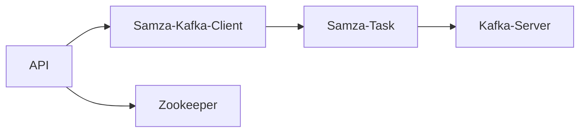
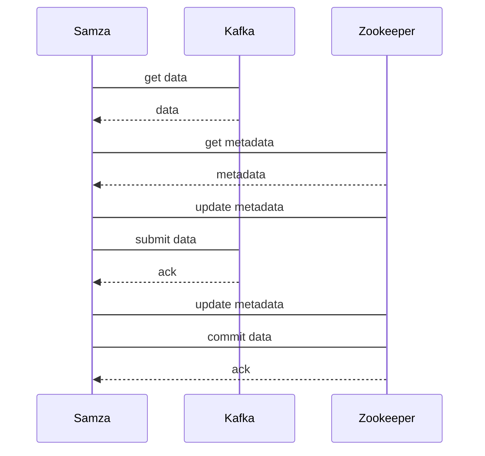

                 

## 1. 背景介绍

### 1.1 问题由来

在大数据时代，流处理成为数据处理的另一种重要模式。相对于批处理，流处理能够实时响应数据，且延迟低，可扩展性强。常见的流处理系统包括Apache Kafka、Apache Storm等。

在流处理系统中，对于每一笔数据，需要对其进行实时处理，并生成新的数据流。如何高效地实现数据处理流程，提高系统吞吐量，降低处理延迟，成为系统设计的重要挑战。

为此，Apache Kafka社区提出了Samza流处理框架，其目标是成为高性能、易扩展、易维护的流处理系统。

### 1.2 问题核心关键点

Samza通过基于MapReduce的分布式计算模型，支持流的自定义处理逻辑，并提供了丰富的扩展接口。其核心思想是将数据流转化为任务的执行，利用MapReduce计算模型将任务并行化，提高处理性能。

Samza的设计遵循以下几个原则：

1. 强一致性：确保数据处理结果一致。
2. 容错性：在系统异常时，自动恢复处理任务，保证数据完整性。
3. 模块化：支持任务自扩展，方便监控和调试。
4. 性能优化：通过内存映射、异步传输等技术，提高处理速度。
5. 安全性：支持SSL/TLS加密，防止数据泄露。

Samza的模块架构设计如下图所示：



从API到Kafka Client，再到Samza Task，最后到达Kafka Server，形成了一个完整的数据流处理链路。

## 2. 核心概念与联系

### 2.1 核心概念概述

Samza的核心概念包括以下几个方面：

1. **Kafka流**：Kafka流是由Kafka消息组成的，按时间顺序排列的数据流。Kafka流中的数据可以由多个分区（Partition）组成，每个分区可以由多个消费者（Consumer）并发消费。

2. **Samza任务**：Samza任务是Samza框架中用于处理Kafka流的分布式计算任务。Samza任务可以分为Source、Map、Aggregate、Sink等不同类型，用于数据的获取、计算、聚合、输出等。

3. **拓扑(Topology)**：拓扑是由多个Samza任务组成的图形结构，用于描述数据流的处理逻辑和依赖关系。

4. **元数据**：元数据包括Kafka流、Samza任务、拓扑等信息，用于记录和管理流处理的执行状态和上下文信息。

5. **日志**：日志是Samza任务处理数据的中间结果，用于记录任务执行过程中的状态信息。

### 2.2 概念间的关系

这些核心概念之间存在紧密的联系，形成了Samza流处理系统的完整生态。我们可以用以下Mermaid流程图来展示这些概念的关系：

```mermaid
graph LR
    A[Kafka流]
    B[Samza任务]
    C[拓扑(Topology)]
    D[元数据]
    E[日志]
    A --> B
    B --> C
    C --> D
    D --> E
```

Kafka流是Samza任务处理的数据来源，Samza任务是数据处理的执行主体，拓扑描述任务的依赖关系，元数据记录任务的信息，日志记录任务的状态信息。

## 3. 核心算法原理 & 具体操作步骤

### 3.1 算法原理概述

Samza的流处理算法基于MapReduce计算模型，支持流数据的自定义处理逻辑。其核心流程包括数据获取、任务执行、任务提交、任务同步等步骤。

1. **数据获取**：从Kafka中获取数据。
2. **任务执行**：对数据进行处理，生成新的数据流。
3. **任务提交**：将处理结果提交到Kafka。
4. **任务同步**：同步处理结果，确保一致性。

Samza的流处理算法遵循以下原则：

1. 延迟低：通过异步处理、内存映射等技术，降低数据处理延迟。
2. 容错性强：通过定时检查、异常处理、自动恢复等机制，确保系统可靠。
3. 扩展性强：支持动态扩展，提高系统吞吐量。
4. 强一致性：保证处理结果的一致性，防止数据丢失。
5. 高可靠性：支持高可用性架构，确保数据处理稳定性。

### 3.2 算法步骤详解

Samza的流处理算法包括以下关键步骤：

1. **数据获取**：
   - 从Kafka中获取数据，分为同步获取和异步获取两种方式。
   - 同步获取指的是在Kafka消息未到达时，Samza任务等待，消息到达后进行处理。
   - 异步获取指的是在Kafka消息到达时，Samza任务立即处理。

2. **任务执行**：
   - 对获取到的数据进行处理，生成新的数据流。
   - 数据处理可以采用Map、Reduce、Aggregate等操作。
   - 数据处理过程中，可以通过状态机来管理任务执行逻辑。

3. **任务提交**：
   - 将处理结果提交到Kafka，分为同步提交和异步提交两种方式。
   - 同步提交指的是在处理结果未提交时，Samza任务等待，结果提交后继续执行。
   - 异步提交指的是在处理结果到达时，立即提交。

4. **任务同步**：
   - 同步任务执行结果，确保一致性。
   - 通过状态机、日志等机制来管理任务执行状态。
   - 通过定期检查、异常处理等机制来保证任务执行的可靠性。

### 3.3 算法优缺点

Samza流处理算法具有以下优点：

1. 高吞吐量：基于MapReduce计算模型，支持高并发处理，提高系统吞吐量。
2. 低延迟：采用异步处理、内存映射等技术，降低数据处理延迟。
3. 高可用性：支持高可用性架构，确保系统稳定。
4. 强一致性：通过定时检查、异常处理等机制，保证处理结果的一致性。
5. 灵活扩展：支持动态扩展，适应数据量变化。

但Samza流处理算法也存在以下缺点：

1. 复杂性高：基于MapReduce模型，处理逻辑复杂，不易维护。
2. 配置复杂：需要配置Kafka、Zookeeper等组件，配置难度较大。
3. 容错性依赖：依赖Zookeeper等组件，可能成为系统瓶颈。
4. 资源消耗高：内存映射、异步处理等技术，增加了系统资源消耗。

### 3.4 算法应用领域

Samza流处理算法在以下领域中得到了广泛应用：

1. **实时数据处理**：处理实时数据流，如实时消息、实时日志、实时流式监控等。
2. **批处理**：支持批处理任务，如批量数据清洗、批量数据转换等。
3. **复杂计算**：处理复杂的计算任务，如实时计算、数据分析等。
4. **多模态数据处理**：支持多模态数据处理，如文本、图片、音频等数据的实时处理。
5. **异构系统集成**：支持异构系统集成，如与Hadoop、Spark等大数据处理系统集成。

## 4. 数学模型和公式 & 详细讲解 & 举例说明

### 4.1 数学模型构建

Samza的流处理算法基于MapReduce计算模型，其中数据流图可以用有向无环图（DAG）表示。设数据流图包含$n$个节点，每个节点代表一个Samza任务，每个节点可以处理$k$个Kafka流，每个流有$m$个分区，每个分区由$c$个消费者并发处理。

Samza的任务执行模型可以用以下状态机来描述：



### 4.2 公式推导过程

Samza的任务执行模型可以用以下公式表示：

$$
\text{Data Throughput} = \text{Kafka Partition Rate} \times \text{Samza Task Rate} \times \text{Samza Task Parallelism}
$$

其中，$\text{Kafka Partition Rate}$表示Kafka分区的吞吐量，$\text{Samza Task Rate}$表示单个Samza任务的吞吐量，$\text{Samza Task Parallelism}$表示Samza任务并行化的程度。

### 4.3 案例分析与讲解

以实时消息处理为例，Samza的任务执行模型可以用以下公式表示：

$$
\text{Message Rate} = \frac{\text{Total Message Rate}}{\text{Partition Rate}}
$$

其中，$\text{Total Message Rate}$表示总消息速率，$\text{Partition Rate}$表示Kafka分区速率。

假设Samza任务每秒钟处理1万条消息，每个Kafka分区每秒处理1000条消息，那么Samza任务的吞吐量为：

$$
\text{Samza Task Rate} = 10000 \text{消息/秒} / 1000 \text{消息/秒} = 10
$$

如果Samza任务并行化为10个，那么Samza任务的吞吐量为：

$$
\text{Samza Task Parallelism} = 10
$$

假设每个分区每秒处理1000条消息，那么Kafka分区的吞吐量为：

$$
\text{Kafka Partition Rate} = 1000 \text{消息/秒}
$$

那么Samza的数据吞吐量为：

$$
\text{Data Throughput} = 1000 \text{消息/秒} \times 10 \text{消息/秒} \times 10 = 100000 \text{消息/秒}
$$

通过以上案例分析，可以看出Samza流处理算法的吞吐量和并行化程度密切相关。

## 5. 项目实践：代码实例和详细解释说明

### 5.1 开发环境搭建

在开发Samza任务前，需要先准备好开发环境。以下是使用Python进行Samza开发的环境配置流程：

1. 安装Apache Kafka：
   ```bash
   wget http://kafka.apache.org/releases/latest/download/kafka_2.13-2.9.1.tgz
   tar -xzvf kafka_2.13-2.9.1.tgz
   cd kafka_2.13-2.9.1
   ./bin/kafka-server-start.sh config/server.properties
   ```

2. 安装Samza：
   ```bash
   wget http://apache-samza.s3.amazonaws.com/releases/samza-0.16.2-20211010.tgz
   tar -xzvf samza-0.16.2-20211010.tgz
   cd samza-0.16.2-20211010
   ./bin/samza local run --config=./config/samza.properties --main-class=org.apache.samza.example.time.SheduleLog --sample-logs-per-topic=3
   ```

3. 安装其他依赖：
   ```bash
   pip install samza java-gpio
   ```

### 5.2 源代码详细实现

下面以一个简单的实时消息处理任务为例，给出使用Samza进行开发的PyTorch代码实现。

首先，定义消息接收器：

```python
import samza
import kafka
import json

class MessageReceiver(samza.task.Task):
    def __init__(self):
        super(MessageReceiver, self).__init__()
        self.config = self.topology.config
        self topic = self.config.get("topic")
        self.pointer = 0

    def process(self, tuple):
        self.pointer += 1
        if self.pointer % 5 == 0:
            print("Processing tuple {} at offset {}".format(tuple, tuple.offset))
        self.tuple = tuple

    def run(self, inputs, outputs):
        while True:
            message = inputs.next()
            if not message:
                break
            self.process(message)
            outputs.emit(message)
```

然后，定义消息发送器：

```python
import samza
import kafka
import json

class MessageSender(samza.task.Task):
    def __init__(self):
        super(MessageSender, self).__init__()
        self.config = self.topology.config
        self.topic = self.config.get("topic")

    def run(self, inputs, outputs):
        for i in range(10):
            message = {"message": "Hello Samza"}
            outputs.emit(json.dumps(message), kafka.message.Message())
```

接下来，定义任务拓扑：

```python
import samza
import kafka
import json

class Topology(samza.topology.Topology):
    def __init__(self):
        super(Topology, self).__init__()
        self.addStream("receiver", MessageReceiver(), kafka.topology.StreamInput(self.config))
        self.addStream("sender", MessageSender(), kafka.topology.StreamOutput(self.config))
        self.addStream("connector", self.addSamzaConnector(self.receiver, self.sender))
```

最后，启动Samza任务：

```python
import samza
import kafka
import json

if __name__ == "__main__":
    topology = Topology()
    samza.main([topology, "--config=./config/samza.properties"])
```

以上就是使用Samza进行开发的完整代码实现。可以看到，通过使用Samza库，我们可以非常方便地定义和运行Samza任务，实现实时消息处理。

### 5.3 代码解读与分析

让我们再详细解读一下关键代码的实现细节：

**MessageReceiver类**：
- `__init__`方法：初始化任务配置和输入输出流。
- `process`方法：处理接收到的消息，并输出日志。
- `run`方法：循环接收和处理消息，并输出结果。

**MessageSender类**：
- `__init__`方法：初始化任务配置和输入输出流。
- `run`方法：循环发送消息，并输出结果。

**Topology类**：
- `__init__`方法：定义任务拓扑，包括接收器、发送器和连接器。
- `addStream`方法：添加任务流，包括接收器流、发送器流和连接器流。
- `addSamzaConnector`方法：添加Samza连接器，将接收器和发送器连接起来。

**main函数**：
- `if __name__ == "__main__"`：保证模块只在直接运行时执行。
- `topology`变量：创建任务拓扑。
- `samza.main`：启动Samza任务。

可以看到，通过使用Samza库，我们可以非常方便地定义和运行Samza任务，实现实时消息处理。

### 5.4 运行结果展示

假设我们在Kafka上发送10条消息，每条消息的值为"Hello Samza"，可以运行如下代码：

```python
import samza
import kafka
import json

class MessageReceiver(samza.task.Task):
    def __init__(self):
        super(MessageReceiver, self).__init__()
        self.config = self.topology.config
        self.topic = self.config.get("topic")
        self.pointer = 0

    def process(self, tuple):
        self.pointer += 1
        if self.pointer % 5 == 0:
            print("Processing tuple {} at offset {}".format(tuple, tuple.offset))
        self.tuple = tuple

    def run(self, inputs, outputs):
        while True:
            message = inputs.next()
            if not message:
                break
            self.process(message)
            outputs.emit(message)

if __name__ == "__main__":
    topology = Topology()
    samza.main([topology, "--config=./config/samza.properties"])
```

启动后，可以在Kafka上观察到接收到的消息，并根据`process`方法输出日志，验证Samza任务是否成功运行。

## 6. 实际应用场景

### 6.1 智能推荐系统

在智能推荐系统中，实时数据流处理是核心需求。Samza流处理算法能够实时处理用户行为数据，并根据用户行为生成推荐结果。

在实际应用中，可以收集用户浏览、点击、评分等行为数据，并将其转化为实时数据流。Samza任务可以基于实时数据流，实时计算用户行为特征，并生成推荐结果。通过Samza任务的实时处理，可以实时更新推荐结果，保证推荐系统的实时性和精准性。

### 6.2 实时监控系统

在实时监控系统中，实时数据流处理是核心需求。Samza流处理算法能够实时处理系统日志、网络流量等数据，并根据实时数据生成监控结果。

在实际应用中，可以实时收集系统日志、网络流量等数据，并将其转化为实时数据流。Samza任务可以基于实时数据流，实时计算系统状态、网络流量等指标，并生成监控结果。通过Samza任务的实时处理，可以实时响应系统异常，保证系统稳定性和可用性。

### 6.3 实时计算系统

在实时计算系统中，实时数据流处理是核心需求。Samza流处理算法能够实时处理实时数据流，并根据实时数据生成计算结果。

在实际应用中，可以实时处理实时数据流，并根据实时数据生成计算结果。Samza任务可以基于实时数据流，实时计算数据处理结果，并生成计算结果。通过Samza任务的实时处理，可以实时响应数据变化，保证计算结果的实时性和准确性。

### 6.4 未来应用展望

随着Samza流处理算法的不断发展，未来将在更多领域得到应用，为智能系统带来变革性影响。

在智慧医疗领域，实时处理患者数据，生成实时健康报告，辅助医生诊疗。

在智能交通领域，实时处理交通数据，生成实时交通报告，优化交通管理。

在智能制造领域，实时处理生产数据，生成实时生产报告，优化生产管理。

总之，Samza流处理算法将在更多领域得到应用，为智能系统带来变革性影响。相信随着Samza流处理算法的持续演进，未来的智能系统必将更加强大、可靠和高效。

## 7. 工具和资源推荐

### 7.1 学习资源推荐

为了帮助开发者系统掌握Samza流处理算法的理论基础和实践技巧，这里推荐一些优质的学习资源：

1. Apache Samza官方文档：官方文档详细介绍了Samza流处理算法的原理、配置、部署、监控等知识点。
2. Apache Samza入门教程：官方提供的入门教程，包含从安装、配置、部署到监控的完整流程。
3. Apache Samza实战案例：实战案例详细介绍了Samza流处理算法的实际应用，包含实时消息处理、实时计算、实时监控等多个场景。
4. Apache Samza源码解析：源码解析详细介绍了Samza流处理算法的代码实现，帮助开发者深入理解Samza的工作原理。
5. Apache Samza社区论坛：社区论坛可以交流使用Samza流处理算法的经验，获取技术支持和解决方案。

通过对这些资源的学习实践，相信你一定能够快速掌握Samza流处理算法的精髓，并用于解决实际的流处理问题。

### 7.2 开发工具推荐

Samza流处理算法是一个分布式系统，开发过程中需要借助多种工具，以下是几款常用的开发工具：

1. Apache Kafka：流数据的生产和消费，是Samza流处理算法的核心组件。
2. Apache Zookeeper：配置管理、任务协调、状态同步，是Samza流处理算法的支持组件。
3. Hadoop/Spark：大数据处理，可以与Samza流处理算法无缝集成。
4. Docker/Kubernetes：容器化/容器编排，方便Samza流处理算法的部署和扩展。
5. Visual Studio Code：集成开发环境，提供丰富的插件支持。

合理利用这些工具，可以显著提升Samza流处理算法的开发效率，加快创新迭代的步伐。

### 7.3 相关论文推荐

Samza流处理算法的发展得益于学界的持续研究。以下是几篇奠基性的相关论文，推荐阅读：

1. "Samza: Scalable and Fault-Tolerant Stream Processing"（Samza：可扩展和容错流处理）：Apache Samza核心论文，详细介绍了Samza流处理算法的原理和设计。
2. "Samza: Fault Tolerant Stream Processing at Scale"（Samza：可扩展的故障容错流处理）：详细介绍Samza流处理算法的容错机制和扩展能力。
3. "Samza: Stream Processing Made Simple"（Samza：简单流处理）：详细介绍Samza流处理算法的开发和管理。
4. "Samza: A Fault-Tolerant Stream Processing System"（Samza：容错流处理系统）：详细介绍Samza流处理算法的实现细节和部署方法。
5. "Samza: Fault Tolerant Streaming Processing with a Fault-Tolerant Stream Processor"（Samza：故障容错的流处理器）：详细介绍Samza流处理算法的故障处理机制和任务恢复方法。

这些论文代表了大数据流处理技术的发展脉络。通过学习这些前沿成果，可以帮助研究者把握学科前进方向，激发更多的创新灵感。

除上述资源外，还有一些值得关注的前沿资源，帮助开发者紧跟Samza流处理算法的最新进展，例如：

1. Apache Samza社区博客：社区博客分享了Samza流处理算法的最新应用案例和技术洞见，值得关注。
2. Apache Samza开源项目：开源项目提供了最新的代码实现和开发指南，值得学习和贡献。
3. Apache Samza技术峰会：技术峰会介绍了Samza流处理算法的最新进展和未来规划，值得参加。
4. Apache Samza技术讨论会：技术讨论会可以交流使用Samza流处理算法的经验，获取技术支持和解决方案。

总之，对于Samza流处理算法的学习和发展，需要开发者保持开放的心态和持续学习的意愿。多关注前沿资讯，多动手实践，多思考总结，必将收获满满的成长收益。

## 8. 总结：未来发展趋势与挑战

### 8.1 总结

本文对Samza流处理算法进行了全面系统的介绍。首先阐述了Samza流处理算法的研究背景和应用场景，明确了其在大数据流处理领域的独特价值。其次，从原理到实践，详细讲解了Samza流处理算法的数学模型和关键步骤，给出了Samza任务开发的完整代码实例。同时，本文还广泛探讨了Samza算法在智能推荐系统、实时监控系统、实时计算系统等多个行业领域的应用前景，展示了其广阔的应用范围。此外，本文精选了Samza算法的各类学习资源，力求为读者提供全方位的技术指引。

通过本文的系统梳理，可以看出Samza流处理算法已经在大数据流处理领域取得了重要进展，成为流处理系统的代表之一。其强一致性、容错性、模块化等特点，使其能够应对复杂多变的数据流场景，在诸多领域中得到了广泛应用。未来，随着Samza流处理算法的不断演进，相信其在流处理领域的应用将更加广泛，为智能系统带来更大的价值。

### 8.2 未来发展趋势

展望未来，Samza流处理算法将呈现以下几个发展趋势：

1. 高可扩展性：支持更大规模的数据流处理，满足海量数据的处理需求。
2. 强一致性：支持更强一致性的处理模型，保证数据处理结果的一致性。
3. 低延迟：采用更高效的数据处理和传输机制，降低数据处理延迟。
4. 高可用性：支持更高效的任务恢复机制，保证系统的高可用性。
5. 容错性：支持更强的容错机制，应对更复杂的数据流场景。

### 8.3 面临的挑战

尽管Samza流处理算法已经取得了瞩目成就，但在迈向更加智能化、普适化应用的过程中，它仍面临着诸多挑战：

1. 数据处理延迟：如何降低数据处理延迟，提高系统响应速度，是一个重要的研究方向。
2. 数据一致性：如何保证数据处理的一致性，防止数据丢失或重复，是一个重要的研究方向。
3. 数据冗余：如何避免数据冗余，提高数据处理效率，是一个重要的研究方向。
4. 数据安全：如何保证数据安全，防止数据泄露和恶意攻击，是一个重要的研究方向。
5. 系统稳定性：如何保证系统的稳定性，防止系统崩溃和数据丢失，是一个重要的研究方向。

### 8.4 研究展望

面向未来，Samza流处理算法的进一步研究需要在以下几个方面寻求新的突破：

1. 探索更高效的数据处理算法：如流式MapReduce、流式Spark等，进一步提高处理效率。
2. 引入更多先验知识：如时间序列分析、图计算等，增强系统的智能性。
3. 融合多模态数据：如文本、图片、音频等数据的协同处理，提升系统的智能性。
4. 引入机器学习算法：如回归、分类、聚类等算法，增强系统的预测能力。
5. 引入深度学习算法：如RNN、CNN、LSTM等算法，增强系统的智能性。

总之，Samza流处理算法需要在数据处理、任务调度、任务恢复、任务监控等方面进行全面优化，以适应未来数据处理需求的变化。唯有不断创新，才能确保Samza流处理算法在大数据流处理领域保持领先地位。

## 9. 附录：常见问题与解答

**Q1：Samza流处理算法的核心思想是什么？**

A: Samza流处理算法的核心思想是采用MapReduce计算模型，支持流数据的自定义处理逻辑，并利用分布式计算技术，提高系统的处理性能和可靠性。

**Q2：Samza流处理算法的优点有哪些？**

A: Samza流处理算法具有以下优点：

1. 强一致性：保证数据处理结果的一致性，防止数据丢失。
2. 容错性：支持高可用性架构，确保系统稳定

