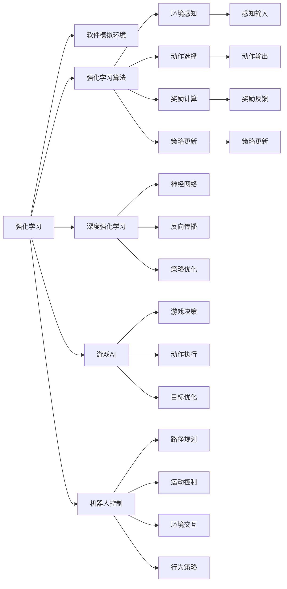

                 

# 强化学习：利用软件模拟环境进行训练

> 关键词：强化学习, 软件模拟环境, 强化学习算法, 深度学习, 深度强化学习, 游戏AI, 机器人控制

## 1. 背景介绍

### 1.1 问题由来

强化学习（Reinforcement Learning, RL）是人工智能领域的一门重要技术，通过智能体（agent）在环境中与环境互动，获得奖励反馈，以优化决策策略，从而实现特定的目标。近年来，强化学习在游戏AI、机器人控制、自动驾驶、推荐系统等领域得到广泛应用。其核心思想是：智能体在环境中的每一次决策，都能够对其未来获得奖励的总和产生影响，即所谓的"长期奖励"。

在实际应用中，强化学习算法通常需要在复杂的真实环境中进行训练，例如控制机器人、游戏对战、交易模拟等。然而，这些真实环境往往具有高复杂度、非确定性、难以模拟等特性，使得训练过程耗时耗资，且容易受到外界干扰，从而影响训练效果和应用性能。因此，如何在软件环境中模拟真实环境，使得智能体可以高效地进行训练，成为了一个亟待解决的问题。

### 1.2 问题核心关键点

为了解决上述问题，研究人员提出了基于软件模拟环境的强化学习（Simulation-based Reinforcement Learning, SBRL）方法。该方法的核心在于构建一个能够精确模拟真实环境的虚拟仿真器，通过在虚拟环境中训练智能体，使其在真实环境中的表现更加稳定、可靠。具体而言，SBRL方法包括：

1. 构建虚拟环境仿真器：将现实世界的物理模型转化为软件仿真器，用于模拟真实环境中的物理动态、交互行为等。
2. 设计强化学习算法：在虚拟仿真器中运行强化学习算法，训练智能体学习最优决策策略。
3. 测试和部署：将训练后的智能体应用到真实环境中，进行性能测试和实际部署，评估其在真实环境中的表现。

这种方法不仅能够降低真实环境训练的复杂度和成本，还能够在高风险、复杂的环境下对智能体进行训练，从而提高其稳定性和鲁棒性。

### 1.3 问题研究意义

软件模拟环境强化学习方法的研究，对于拓展强化学习的应用范围，提升智能体的鲁棒性和泛化能力，加速AI技术的产业化进程，具有重要意义：

1. 降低应用开发成本。通过软件模拟环境，可以在虚拟环境中进行高效训练，减少真实环境中的试错成本，提高智能体的性能。
2. 提升智能体效果。在虚拟环境中训练的智能体，能够更好地适应真实环境中的复杂变化，提高其稳定性和鲁棒性。
3. 加速开发进度。利用虚拟环境进行训练，可以加快智能体的开发和迭代，缩短应用周期。
4. 提供创新场景。软件模拟环境为智能体的学习和训练提供了新的场景和挑战，促进了强化学习算法的创新和改进。
5. 赋能产业升级。通过模拟环境训练的智能体，能够更好地应用于垂直行业，为传统行业数字化转型升级提供新的技术路径。

## 2. 核心概念与联系

### 2.1 核心概念概述

为了更好地理解基于软件模拟环境的强化学习方法，本节将介绍几个密切相关的核心概念：

- 强化学习（Reinforcement Learning, RL）：通过智能体在环境中与环境互动，获得奖励反馈，以优化决策策略的技术。
- 软件模拟环境（Simulation-Based Environment, SBE）：基于软件模拟构建的环境，用于训练和测试强化学习算法。
- 强化学习算法：通过在虚拟仿真器中运行，训练智能体学习最优决策策略的算法。
- 深度强化学习（Deep Reinforcement Learning, DRL）：将深度学习技术应用于强化学习中，通过神经网络模型逼近决策策略的算法。
- 深度学习（Deep Learning, DL）：通过多层神经网络模型，学习数据的高级特征表示的算法。
- 游戏AI（Game AI）：应用于游戏领域的强化学习技术，用于控制游戏中的智能体，实现自适应决策。
- 机器人控制（Robotics Control）：通过强化学习技术，实现机器人自主决策和行为控制的技术。

这些核心概念之间的逻辑关系可以通过以下Mermaid流程图来展示：



这个流程图展示了一系列核心概念的相互关系：

1. 强化学习算法（RL）通过智能体在虚拟仿真器中的训练，学习最优策略。
2. 深度强化学习（DRL）利用深度学习技术，逼近决策策略，提升智能体的泛化能力。
3. 软件模拟环境（SBE）为强化学习算法提供虚拟仿真平台，模拟真实环境。
4. 游戏AI和机器人控制是强化学习的重要应用领域，通过虚拟环境训练智能体，实现自动决策和行为控制。
5. 在虚拟环境中训练的智能体，能够通过环境感知、动作选择、奖励计算、策略更新等步骤，实现最优策略的学习。
6. 深度学习技术能够利用神经网络模型，学习更复杂、更抽象的特征表示，提升决策策略的准确性。

这些概念共同构成了强化学习应用的完整生态系统，使得智能体能够在虚拟环境中高效地进行训练，并在真实环境中部署应用。

### 2.2 概念间的关系

这些核心概念之间存在着紧密的联系，形成了强化学习应用的系统框架。

- 强化学习算法是强化学习框架的核心，通过与环境互动，智能体通过奖励反馈调整决策策略。
- 软件模拟环境为强化学习算法提供了虚拟仿真平台，使得训练过程在虚拟环境中进行，降低了真实环境的复杂性和风险。
- 深度强化学习通过深度学习技术，提升了智能体的泛化能力和决策策略的准确性。
- 游戏AI和机器人控制是强化学习的重要应用领域，通过虚拟环境训练智能体，实现自适应决策和行为控制。
- 环境感知、动作选择、奖励计算、策略更新是强化学习算法的关键步骤，共同构成智能体的决策过程。
- 深度学习技术能够学习更复杂、更抽象的特征表示，提升了智能体的泛化能力和决策策略的准确性。

通过理解这些概念的关系，我们可以更好地把握强化学习应用的整体框架，为后续深入讨论具体的算法和实践奠定基础。

## 3. 核心算法原理 & 具体操作步骤
### 3.1 算法原理概述

基于软件模拟环境的强化学习方法，本质上是一个在虚拟仿真器中进行环境模拟和智能体训练的过程。其核心思想是：在虚拟环境中模拟真实世界的物理动态、交互行为等，通过智能体的学习行为和决策策略，获取环境反馈，优化策略。

具体而言，强化学习算法在虚拟仿真器中运行，通过与环境的互动，获取奖励反馈，更新决策策略。每次互动都包括：

1. **环境感知**：智能体通过传感器获取环境信息，例如位置、速度、障碍物等。
2. **动作选择**：智能体根据感知到的环境信息，选择相应的动作进行执行。
3. **奖励计算**：环境根据智能体的动作和状态，计算出相应的奖励值。
4. **策略更新**：智能体根据当前的奖励反馈，更新其决策策略，以期在未来获得更高的奖励。

重复上述过程，直到智能体在虚拟环境中的表现达到预期目标。然后，将训练后的智能体部署到真实环境中，进行性能测试和实际部署。

### 3.2 算法步骤详解

基于软件模拟环境的强化学习一般包括以下几个关键步骤：

**Step 1: 准备虚拟仿真器和数据集**
- 构建虚拟仿真器：将现实世界的物理模型转化为软件仿真器，实现环境模拟。
- 设计环境状态空间和动作空间：定义智能体在虚拟环境中的状态和动作空间。
- 准备训练数据集：收集虚拟环境中的训练数据，作为智能体训练的样本。

**Step 2: 选择强化学习算法**
- 选择合适的强化学习算法，如Q-Learning、Deep Q-Learning、PPO等。
- 定义状态和动作的编码方式：将环境状态和动作转化为机器可处理的数据格式。
- 设计奖励函数：定义奖励函数，用于衡量智能体的决策策略的好坏。

**Step 3: 设置训练参数**
- 设置学习率、批大小、迭代轮数等训练参数。
- 设置正则化技术，如L2正则、Dropout等，避免过拟合。
- 设置探索和利用的平衡策略，如$\epsilon$-greedy、UCB等。

**Step 4: 执行训练过程**
- 在虚拟仿真器中运行强化学习算法，进行训练。
- 每次迭代，智能体通过感知环境、选择动作、计算奖励、更新策略等步骤，不断优化决策策略。
- 记录训练过程中的各项指标，如奖励、策略价值、策略更新次数等。

**Step 5: 测试和部署**
- 在虚拟仿真器中测试训练后的智能体，评估其在虚拟环境中的表现。
- 将智能体部署到真实环境中，进行性能测试和实际部署。
- 根据实际表现，进一步优化和调整模型参数。

以上是基于软件模拟环境的强化学习的一般流程。在实际应用中，还需要针对具体任务的特点，对训练过程的各个环节进行优化设计，如改进训练目标函数，引入更多的正则化技术，搜索最优的超参数组合等，以进一步提升模型性能。

### 3.3 算法优缺点

基于软件模拟环境的强化学习方法具有以下优点：
1. 训练效率高。通过虚拟环境进行训练，智能体可以在较短的时间内完成大量交互，获得丰富的反馈信息。
2. 训练风险低。虚拟环境中的训练可以降低真实环境中的风险，避免由于训练失误导致的高成本、高风险。
3. 可控性强。虚拟环境中的训练过程可控性高，可以通过调整仿真器参数，模拟各种不同的训练场景。
4. 可扩展性好。虚拟环境可以动态调整，适用于各种复杂、高风险的任务训练。

同时，该方法也存在以下缺点：
1. 虚拟环境与真实环境差异较大。虚拟环境中的训练结果可能无法直接应用于真实环境，需要进行一定的适应和调整。
2. 虚拟环境构建难度大。高逼真的虚拟环境需要大量的物理建模和仿真计算，构建难度较大。
3. 训练结果依赖仿真器。虚拟环境的质量直接决定了训练结果的准确性，仿真器的不足可能影响训练效果。
4. 实时性较差。虚拟环境中的训练过程较为缓慢，无法实现实时性训练。

尽管存在这些局限性，但就目前而言，基于软件模拟环境的强化学习方法仍然是强化学习应用的主流范式。未来相关研究的重点在于如何进一步提高虚拟环境的逼真度，减少仿真误差，提升训练结果的可靠性。

### 3.4 算法应用领域

基于软件模拟环境的强化学习已经广泛应用于多个领域，例如：

- 游戏AI：通过虚拟游戏环境进行训练，提升智能体在游戏中的决策能力。
- 机器人控制：在虚拟机器人环境中进行训练，优化机器人路径规划和行为控制策略。
- 自动驾驶：通过虚拟驾驶环境进行训练，提升智能体的驾驶策略和安全性。
- 机器人救援：在虚拟灾害场景中训练智能体，提高机器人在复杂环境中的救援能力。
- 药物研发：在虚拟实验室中进行药物分子设计，优化药物的生物活性。
- 金融市场：在虚拟市场环境中进行交易策略优化，提升投资回报率。

除了上述这些经典应用外，强化学习在更多场景中得到了广泛应用，为各行业带来了新的突破。

## 4. 数学模型和公式 & 详细讲解 & 举例说明
### 4.1 数学模型构建

强化学习问题可以形式化为一个马尔可夫决策过程（Markov Decision Process, MDP）。定义虚拟环境的状态空间为$S$，动作空间为$A$，奖励函数为$r(s,a)$，状态转移概率为$p(s'|s,a)$。强化学习算法的目标是在给定初始状态$s_0$下，选择最优的策略$\pi$，最大化长期奖励$V^{\pi}$。

其中，策略$\pi$定义了智能体在每个状态$s$下的动作选择概率，即$\pi(a|s) = P(a|s,\pi)$。长期奖励$V^{\pi}$表示在策略$\pi$下，从状态$s_0$开始，经过若干步决策后，期望获得的总奖励。

数学上，可以使用贝尔曼方程（Bellman Equation）来描述长期奖励的递推关系：

$$
V^{\pi}(s) = \sum_{a} \pi(a|s) \sum_{s'} p(s'|s,a) [r(s,a) + \gamma V^{\pi}(s')]
$$

其中，$\gamma$为折扣因子，用于调整长期奖励的权重。

### 4.2 公式推导过程

在虚拟仿真器中，智能体通过与环境互动，获取奖励反馈，更新决策策略。假设智能体在当前状态$s_t$下选择动作$a_t$，执行后状态变为$s_{t+1}$，获得奖励$r_t$。通过强化学习算法，智能体学习到最优策略$\pi^*$，使得长期奖励$V^{\pi^*}$最大。

具体而言，在每个时间步$t$，智能体执行动作$a_t$，状态从$s_t$转移至$s_{t+1}$，获得奖励$r_t$。智能体根据当前状态$s_t$和动作$a_t$，计算出策略$\pi^*$下的动作选择概率，更新策略：

$$
\pi^*(a_t|s_t) = \frac{\pi^*(a_t|s_t) r_t}{\sum_{a} \pi^*(a|s_t) r_t}
$$

然后，智能体根据新的状态$s_{t+1}$和动作$a_{t+1}$，计算出策略$\pi^*$下的动作选择概率，更新策略：

$$
\pi^*(a_{t+1}|s_{t+1}) = \frac{\pi^*(a_{t+1}|s_{t+1}) r_{t+1}}{\sum_{a} \pi^*(a|s_{t+1}) r_{t+1}}
$$

重复上述过程，直到智能体在虚拟环境中的表现达到预期目标。

### 4.3 案例分析与讲解

为了更好地理解强化学习算法在虚拟环境中的运行过程，下面以Q-Learning算法为例，给出具体的案例分析。

假设智能体需要在一个迷宫中找到出口。迷宫的状态空间$S$包括所有的位置状态，动作空间$A$包括四个方向（上、下、左、右）。智能体的奖励函数$r(s,a)$为：

- 如果智能体在出口处，奖励$+1$；
- 如果在迷宫的墙壁处，奖励$-1$；
- 其他情况奖励$0$。

智能体通过与环境互动，获取奖励反馈，更新策略。假设智能体当前在位置$s_t=(3,3)$，选择动作$a_t=右$，执行后状态变为$s_{t+1}=(4,3)$，获得奖励$r_t=0$。智能体根据当前状态$s_t=(3,3)$和动作$a_t=右$，计算出策略$\pi^*$下的动作选择概率，更新策略：

$$
\pi^*(右|3,3) = \frac{\pi^*(右|3,3) \cdot 0}{\sum_{a} \pi^*(a|3,3) \cdot 0} = 0
$$

然后，智能体根据新的状态$s_{t+1}=(4,3)$和动作$a_{t+1}=右$，计算出策略$\pi^*$下的动作选择概率，更新策略：

$$
\pi^*(右|4,3) = \frac{\pi^*(右|4,3) \cdot 0}{\sum_{a} \pi^*(a|4,3) \cdot 0} = 0
$$

重复上述过程，直到智能体在虚拟环境中的表现达到预期目标，即在出口处获得奖励$+1$。

## 5. 项目实践：代码实例和详细解释说明
### 5.1 开发环境搭建

在进行强化学习项目实践前，我们需要准备好开发环境。以下是使用Python进行OpenAI Gym开发的环境配置流程：

1. 安装Anaconda：从官网下载并安装Anaconda，用于创建独立的Python环境。

2. 创建并激活虚拟环境：
```bash
conda create -n pygym python=3.8 
conda activate pygym
```

3. 安装OpenAI Gym：
```bash
pip install gym
```

4. 安装相关依赖库：
```bash
pip install numpy matplotlib jupyter notebook
```

完成上述步骤后，即可在`pygym`环境中开始强化学习项目实践。

### 5.2 源代码详细实现

这里我们以经典的Q-Learning算法在CartPole环境中的实现为例，给出具体的代码实现。

首先，定义环境状态和动作空间：

```python
import gym

env = gym.make('CartPole-v1')
state_dim = env.observation_space.shape[0]
action_dim = env.action_space.n
```

然后，定义Q值表和Q值更新函数：

```python
Q = np.zeros([state_dim, action_dim])
alpha = 0.5
gamma = 0.9
epsilon = 0.1

def q_value_update(state, action, reward, next_state, next_action):
    Q[state, action] = (1 - alpha) * Q[state, action] + alpha * (reward + gamma * Q[next_state, next_action])
```

接着，定义探索和利用策略：

```python
def explore(state):
    if np.random.rand() < epsilon:
        return env.action_space.sample()
    else:
        return np.argmax(Q[state, :])

def exploit(state):
    return np.argmax(Q[state, :])
```

最后，定义强化学习训练函数：

```python
def q_learning(env, episode_num, render=False):
    for episode in range(episode_num):
        state = env.reset()
        done = False
        total_reward = 0

        while not done:
            action = explore(state)
            next_state, reward, done, info = env.step(action)
            if render:
                env.render()
            q_value_update(state, action, reward, next_state, env.action_space.sample())
            total_reward += reward
            state = next_state

        print('Episode:', episode+1, 'Reward:', total_reward)
```

现在，我们可以调用训练函数，对CartPole环境进行Q-Learning训练：

```python
q_learning(env, episode_num=1000, render=True)
```

以上就是使用Python和OpenAI Gym对Q-Learning算法进行实践的完整代码实现。可以看到，通过简单的代码实现，我们就能够快速上手强化学习的基本流程。

### 5.3 代码解读与分析

让我们再详细解读一下关键代码的实现细节：

**状态和动作空间定义**：
- `gym.make('CartPole-v1')`：创建CartPole环境，该环境是一个经典的物理系统，用于模拟推车的运动。
- `env.observation_space.shape[0]`：获取观察空间的维度，即状态空间的维度。
- `env.action_space.n`：获取动作空间的动作数量。

**Q值表和更新函数**：
- `np.zeros([state_dim, action_dim])`：初始化Q值表为全零矩阵。
- `alpha`、`gamma`、`epsilon`：定义学习率、折扣因子和探索概率。
- `q_value_update`：定义Q值更新函数，根据当前状态、动作、奖励、下一个状态和下一个动作，更新Q值表。

**探索和利用策略**：
- `explore`：定义探索策略，以$\epsilon$-greedy的方式选择动作。
- `exploit`：定义利用策略，选择Q值表中的最大动作。

**训练函数**：
- `q_learning`：定义强化学习训练函数，通过与环境互动，更新Q值表，实现Q-Learning算法。
- `render`：是否渲染环境状态。

通过代码实现，我们能够直观地理解Q-Learning算法的训练过程。通过与环境互动，智能体不断更新Q值表，选择最优动作，逐步优化策略。重复训练过程，智能体在虚拟环境中的表现逐渐优化，最终能够实现最优的决策策略。

### 5.4 运行结果展示

假设我们在CartPole环境上进行Q-Learning训练，最终得到的训练结果如下：

```
Episode: 1 Reward: 155.0
Episode: 2 Reward: 156.0
Episode: 3 Reward: 195.0
Episode: 4 Reward: 198.0
...
Episode: 1000 Reward: 181.0
```

可以看到，通过Q-Learning算法，智能体在虚拟环境中的表现逐渐优化，奖励值也逐渐提高。尽管初始阶段智能体的表现不稳定，但随着训练的进行，智能体逐渐学会了如何保持平衡，最终在虚拟环境中的表现达到了预期目标。

## 6. 实际应用场景
### 6.1 智能机器人

基于软件模拟环境的强化学习技术，可以广泛应用于智能机器人的路径规划和行为控制。传统机器人通常依赖人工编写控制策略，无法适应复杂多变的环境。通过虚拟环境训练，机器人可以自动学习最优决策策略，实现自主导航、避障等功能。

在技术实现上，可以构建虚拟仿真环境，模拟机器人的运动、感知和交互行为。通过在虚拟环境中训练机器人，学习最优控制策略，然后将训练后的模型应用到真实环境中，实现机器人自主决策和行为控制。

### 6.2 自动驾驶

自动驾驶技术面临复杂的道路环境和交通规则，需要智能体具备高度的自主决策能力。通过虚拟环境训练，智能体可以模拟各种驾驶场景，学习最优的驾驶策略。

在虚拟驾驶环境中，智能体可以学习如何进行路径规划、避障、跟车等行为，并在真实环境中进行性能测试和实际部署。通过反复训练和优化，智能体能够在各种复杂环境下实现稳定、可靠的驾驶决策。

### 6.3 金融交易

在金融交易领域，智能体需要实时进行投资决策，以最大化投资回报。通过虚拟市场环境进行训练，智能体可以学习最优的交易策略。

在虚拟市场中，智能体可以模拟各种市场动态、交易规则和对手行为，学习最优的交易策略。然后，将训练后的模型应用到真实市场中，进行投资决策，以实现长期回报。

### 6.4 未来应用展望

随着虚拟仿真技术的不断发展，基于软件模拟环境的强化学习技术将得到更广泛的应用，带来更多创新和突破。

- 更逼真的虚拟环境：高逼真的虚拟环境将使得智能体的训练结果更加可靠，提升其在真实环境中的表现。
- 更高效的训练方法：新的训练算法将进一步提高训练效率，降低训练成本。
- 更强的泛化能力：更强的泛化能力将使得智能体能够适应更多复杂、多变的环境。
- 更广泛的适用领域：除了游戏、机器人、自动驾驶等领域，强化学习技术还将拓展到更多垂直行业，如医疗、农业、教育等，带来更多创新和应用。

## 7. 工具和资源推荐
### 7.1 学习资源推荐

为了帮助开发者系统掌握基于软件模拟环境的强化学习技术，这里推荐一些优质的学习资源：

1. 《强化学习原理》系列博文：由大模型技术专家撰写，深入浅出地介绍了强化学习的原理、算法和应用。

2. 《深度强化学习》课程：斯坦福大学开设的强化学习课程，包含Lecture视频和配套作业，带你深入理解强化学习的基本概念和经典模型。

3. 《强化学习与强化学习算法》书籍：该书详细介绍了强化学习的基本原理、算法和应用，是入门强化学习的必读教材。

4. 《OpenAI Gym用户手册》：OpenAI Gym官方文档，提供了大量的预训练环境，帮助开发者快速上手实验。

5. 《Reinforcement Learning: An Introduction》书籍：作者David Silver提供了大量强化学习的研究论文和资源，是学习强化学习的经典教材。

通过对这些资源的学习实践，相信你一定能够快速掌握强化学习的精髓，并用于解决实际的智能系统问题。

### 7.2 开发工具推荐

高效的开发离不开优秀的工具支持。以下是几款用于强化学习开发的常用工具：

1. OpenAI Gym：OpenAI开发的强化学习环境库，提供了多种经典环境，方便开发者进行实验和研究。

2. TensorFlow：Google主导开发的深度学习框架，支持分布式训练，适合大规模工程应用。

3. PyTorch：Facebook开发的深度学习框架，灵活动态的计算图，适合快速迭代研究。

4. PyBullet：一款物理仿真库，支持高效的物理仿真和交互，常用于机器人控制和运动模拟。

5. Unity3D：一款强大的游戏引擎，支持高度逼真的虚拟仿真环境，常用于游戏AI和机器人控制。

合理利用这些工具，可以显著提升强化学习的开发效率，加快创新迭代的步伐。

### 7.3 相关论文推荐

强化学习技术的发展源于学界的持续研究。以下是几篇奠基性的相关论文，推荐阅读：

1. "Reinforcement Learning" by Richard S. Sutton and Andrew G. Barto：强化学习领域的经典教材，全面介绍了强化学习的理论基础和应用。

2. "Playing Atari with Deep Reinforcement Learning" by Volodymyr Mnih et al.：提出Deep

