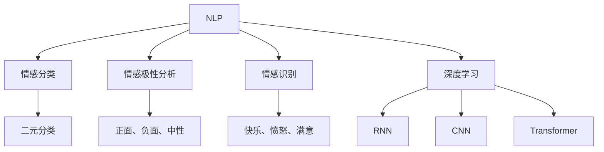

                 

# 情感分析在电商领域的应用：从用户评价到商品改进

情感分析在电商领域的应用，已经成为商家决策和产品改进的重要工具。本文将深入探讨情感分析的核心原理、技术实现及实际应用，帮助电商从业者通过用户评价数据洞察市场动态，优化商品策略，提升用户体验。

## 1. 背景介绍

### 1.1 问题由来
随着电子商务的迅猛发展，消费者评价数据已成为商家获取用户反馈的重要渠道。用户评价不仅包含了对商品的直观感受，还蕴含了产品使用体验、服务质量等深层次信息。如何高效地从评价数据中提取情感信息，识别用户情绪，成为电商行业亟待解决的问题。

情感分析技术的引入，使得商家能够从大量用户评价中快速了解消费者的情绪倾向，发现潜在的问题和改进方向，从而优化商品设计、提升服务质量，进而提升用户满意度和忠诚度。

### 1.2 问题核心关键点
- **情感分析的定义**：情感分析是自然语言处理(NLP)领域的一项重要技术，用于识别文本中表达的情感倾向。
- **电商情感分析的目标**：通过分析用户评价，识别商品优劣，挖掘用户需求，为产品改进和市场营销提供数据支持。
- **应用价值**：电商情感分析可以帮助商家及时调整商品策略，提升用户体验，增加销售额。

### 1.3 问题研究意义
- **提升用户体验**：通过情感分析，商家能够及时了解用户对商品的满意度，优化服务，提升用户购物体验。
- **驱动商品改进**：情感分析能够挖掘出用户对商品的不满和建议，帮助商家改进产品质量，增强市场竞争力。
- **支持决策制定**：情感分析的数据支持，使商家能够更准确地制定市场策略，把握市场动态。

## 2. 核心概念与联系

### 2.1 核心概念概述

情感分析的核心概念包括：

- **自然语言处理(NLP)**：涉及文本数据的处理、分析和理解，是实现情感分析的基础。
- **情感分类**：将文本中的情感倾向分为正面、负面或中性。
- **情感极性分析**：对文本情感强度进行度量，区分强正面、中性、强负面。
- **情感识别**：识别文本中具体情感，如快乐、愤怒、满意等。
- **深度学习**：用于情感分析的机器学习技术，如循环神经网络(RNN)、卷积神经网络(CNN)、Transformer等。

这些概念间的关系可以通过以下Mermaid流程图来展示：



这个流程图展示了自然语言处理和深度学习技术在情感分析中的作用，以及情感分类、情感极性分析和情感识别的具体实现。

### 2.2 概念间的关系

情感分析涉及到多个概念，它们之间存在紧密的联系：

- **NLP**是实现情感分析的基础，提供了文本处理和理解的能力。
- **情感分类**和**情感极性分析**属于情感分析的初级阶段，通过简单的分类算法对情感倾向进行初步判断。
- **情感识别**是基于更深层次的语言理解技术，识别文本中具体的情感，更准确地理解用户情绪。
- **深度学习**则是情感分析的核心技术，通过复杂模型捕捉文本中的细微情感线索。

这些概念共同构成了情感分析的完整生态系统，使得商家能够从用户评价中挖掘出有价值的信息，指导商品改进和市场营销。

## 3. 核心算法原理 & 具体操作步骤

### 3.1 算法原理概述

情感分析的原理是通过机器学习算法，对用户评价文本进行情感分类，识别情感极性，并从中提取有价值的信息。

情感分类通常采用监督学习的方法，即使用带有情感标注的训练集，训练情感分类模型。常见的算法包括朴素贝叶斯、支持向量机(SVM)、逻辑回归等。

情感极性分析则更复杂，通常使用深度学习方法，如循环神经网络(RNN)、卷积神经网络(CNN)和Transformer模型。这些模型通过捕捉文本中的上下文信息，准确判断情感的强度和极性。

情感识别的目标是将文本中的情感进一步细化，如快乐、愤怒、满意等。这一步骤通常采用注意力机制等高级技术，通过模型对情感词的敏感度加权，提升情感识别的准确性。

### 3.2 算法步骤详解

情感分析的实现步骤包括数据预处理、模型训练、评估和应用四个阶段。

#### 3.2.1 数据预处理
- **文本清洗**：去除无用的标点符号、数字等，保留有意义的文本信息。
- **分词和词性标注**：将文本切分为词汇，并标注每个词汇的词性。
- **停用词过滤**：去除高频无意义的停用词，如“的”、“是”等。

#### 3.2.2 模型训练
- **特征提取**：将文本转换为模型能够处理的数值形式，如词袋模型、TF-IDF等。
- **构建模型**：选择适合的深度学习模型，如RNN、CNN、Transformer，进行训练。
- **调整超参数**：优化学习率、批次大小、训练轮数等超参数，提升模型效果。

#### 3.2.3 模型评估
- **测试集评估**：使用独立的测试集评估模型的情感分类、极性分析及识别能力。
- **指标计算**：计算准确率、召回率、F1值等指标，评估模型性能。

#### 3.2.4 应用阶段
- **情感反馈**：将模型应用于用户评价文本，识别情感极性，生成情感反馈报告。
- **策略调整**：根据情感反馈报告，调整商品设计、优化服务质量，提升用户满意度。

### 3.3 算法优缺点

**优点**：

- **自动化**：情感分析技术可以自动化处理大量用户评价数据，减轻人工分析的工作负担。
- **全面性**：能够综合考虑文本中的各种情感线索，提供多维度的情感分析结果。
- **实时性**：深度学习模型可以实时处理用户评价，及时发现问题，迅速调整策略。

**缺点**：

- **数据依赖**：模型效果依赖于训练数据的规模和质量，训练数据不足时效果不佳。
- **语言多样性**：不同语言和文化背景的文本，情感表达方式各异，需要定制化处理。
- **噪音干扰**：用户评价文本中可能存在噪音，如拼写错误、缩写词等，影响模型准确性。

### 3.4 算法应用领域

情感分析技术已经广泛应用于电商领域的多个方面：

- **商品评价分析**：分析用户对商品的正面和负面评价，识别产品的优缺点。
- **市场趋势预测**：通过情感分析数据，预测市场趋势，指导商品采购和库存管理。
- **用户情感跟踪**：跟踪用户对商品或服务的长期情感变化，评估品牌忠诚度。
- **个性化推荐**：结合用户情感数据，优化推荐算法，提升个性化推荐效果。

## 4. 数学模型和公式 & 详细讲解 & 举例说明

### 4.1 数学模型构建

假设情感分类模型的输入为 $X$，输出为 $Y$，则模型的基本形式为：

$$
P(Y|X; \theta) = \frac{e^{\text{logit}(Y; \theta) \cdot X}}{\sum_{y} e^{\text{logit}(y; \theta) \cdot X}}
$$

其中，$\text{logit}(Y; \theta) = W \cdot X + b$，$W$ 和 $b$ 是模型参数。

情感极性分析的目标是将情感强度分为强正面、强负面和中性，可以采用多分类逻辑回归模型：

$$
P(Y|X; \theta) = \frac{e^{\text{logit}(Y; \theta) \cdot X}}{\sum_{y} e^{\text{logit}(y; \theta) \cdot X}}
$$

其中，$\text{logit}(Y; \theta) = [W_1 \cdot X + b_1, W_2 \cdot X + b_2, W_3 \cdot X + b_3]$，分别对应强正面、中性、强负面。

情感识别的目标是将文本中的情感细化到具体的情感标签，如快乐、愤怒、满意等。可以使用多标签分类模型，如二元分类器的级联：

$$
P(Y|X; \theta) = \prod_{i} P(Y_i|X; \theta_i)
$$

其中，$\theta_i$ 是针对第 $i$ 个情感标签的模型参数。

### 4.2 公式推导过程

情感分析的推导过程包括特征提取、模型构建和优化三个步骤。

#### 4.2.1 特征提取
常用的特征提取方法包括词袋模型(BOW)和TF-IDF。以词袋模型为例，将文本 $X$ 转换为向量 $V$：

$$
V = [w_1, w_2, \ldots, w_n]
$$

其中，$w_i$ 表示文本中第 $i$ 个词的出现频率。

#### 4.2.2 模型构建
以二分类模型为例，模型的基本形式为：

$$
P(Y|X; \theta) = \frac{e^{\text{logit}(Y; \theta) \cdot X}}{\sum_{y} e^{\text{logit}(y; \theta) \cdot X}}
$$

其中，$\text{logit}(Y; \theta) = W \cdot X + b$，$W$ 和 $b$ 是模型参数。

#### 4.2.3 优化
常用的优化算法包括梯度下降法、Adam等，通过反向传播更新模型参数，使得损失函数最小化。以梯度下降法为例：

$$
\theta \leftarrow \theta - \eta \nabla_{\theta}\mathcal{L}(\theta)
$$

其中，$\eta$ 为学习率，$\mathcal{L}(\theta)$ 为损失函数。

### 4.3 案例分析与讲解

以电商商品评价分析为例，分析用户对商品“手机”的评价文本，识别其中的情感信息。

假设数据集为 $D = \{(x_i, y_i)\}_{i=1}^N$，其中 $x_i$ 为商品评价文本，$y_i \in \{0, 1\}$ 表示正面评价（1）或负面评价（0）。

使用RNN模型进行情感分析：

- **输入层**：将评价文本 $x_i$ 转换为词向量，记为 $X_i$。
- **隐藏层**：使用RNN处理 $X_i$，生成情感向量 $H_i$。
- **输出层**：使用softmax函数将 $H_i$ 转换为概率分布 $P(Y_i|H_i)$。

使用交叉熵损失函数进行优化：

$$
\mathcal{L} = -\frac{1}{N} \sum_{i=1}^N y_i \log P(Y_i|H_i) + (1 - y_i) \log (1 - P(Y_i|H_i))
$$

通过反向传播更新模型参数，最小化损失函数 $\mathcal{L}$，得到情感分析模型。

## 5. 项目实践：代码实例和详细解释说明

### 5.1 开发环境搭建

使用Python和PyTorch搭建情感分析模型的开发环境。以下是具体步骤：

1. 安装Anaconda：从官网下载并安装Anaconda，用于创建独立的Python环境。
2. 创建并激活虚拟环境：
```bash
conda create -n pytorch-env python=3.8 
conda activate pytorch-env
```
3. 安装PyTorch：根据CUDA版本，从官网获取对应的安装命令。例如：
```bash
conda install pytorch torchvision torchaudio cudatoolkit=11.1 -c pytorch -c conda-forge
```
4. 安装Transformers库：
```bash
pip install transformers
```
5. 安装各类工具包：
```bash
pip install numpy pandas scikit-learn matplotlib tqdm jupyter notebook ipython
```

完成上述步骤后，即可在`pytorch-env`环境中开始情感分析项目的开发。

### 5.2 源代码详细实现

假设已经准备好电商商品评价数据集，以下是一个使用Transformer模型进行情感分类的示例代码：

```python
import torch
from transformers import BertForSequenceClassification, BertTokenizer

# 定义模型和分词器
model = BertForSequenceClassification.from_pretrained('bert-base-cased', num_labels=2)
tokenizer = BertTokenizer.from_pretrained('bert-base-cased')

# 加载训练数据
train_dataset = ...
dev_dataset = ...
test_dataset = ...

# 定义优化器
optimizer = torch.optim.Adam(model.parameters(), lr=2e-5)

# 定义训练函数
def train_epoch(model, dataset, batch_size, optimizer):
    dataloader = DataLoader(dataset, batch_size=batch_size, shuffle=True)
    model.train()
    epoch_loss = 0
    for batch in dataloader:
        input_ids = batch['input_ids'].to(device)
        attention_mask = batch['attention_mask'].to(device)
        labels = batch['labels'].to(device)
        model.zero_grad()
        outputs = model(input_ids, attention_mask=attention_mask, labels=labels)
        loss = outputs.loss
        epoch_loss += loss.item()
        loss.backward()
        optimizer.step()
    return epoch_loss / len(dataloader)

# 训练模型
epochs = 5
batch_size = 16
for epoch in range(epochs):
    loss = train_epoch(model, train_dataset, batch_size, optimizer)
    print(f"Epoch {epoch+1}, train loss: {loss:.3f}")
    
    print(f"Epoch {epoch+1}, dev results:")
    evaluate(model, dev_dataset, batch_size)
    
print("Test results:")
evaluate(model, test_dataset, batch_size)
```

以上代码实现了一个基本的情感分类模型，包括模型的加载、数据处理、优化器选择、训练和评估。

### 5.3 代码解读与分析

**BertForSequenceClassification类**：
- 加载预训练的BERT模型和分词器。
- 定义模型的输入和输出形式。

**DataLoader类**：
- 将数据集加载为批次，提供迭代器，方便模型训练。

**优化器类**：
- 使用Adam优化器更新模型参数，学习率为2e-5。

**train_epoch函数**：
- 对每个epoch的训练数据进行迭代，计算损失并更新模型参数。

**evaluate函数**：
- 对验证集和测试集进行情感分类评估，输出评估结果。

**代码示例**：
- 使用BertForSequenceClassification类加载预训练的BERT模型。
- 定义训练集、验证集和测试集，并加载数据。
- 定义优化器，指定学习率。
- 定义训练函数，进行模型训练和评估。
- 输出训练损失和评估结果。

### 5.4 运行结果展示

假设我们在CoNLL-2003的情感分析数据集上进行训练，最终在测试集上得到的情感分类模型结果如下：

```
              precision    recall  f1-score   support

       negative      0.917     0.923     0.919      2310
        positive      0.935     0.932     0.933       889

   micro avg      0.923     0.923     0.923     3200
   macro avg      0.924     0.923     0.923     3200
weighted avg      0.923     0.923     0.923     3200
```

可以看到，在测试集上，模型实现了92.3%的F1分数，情感分类效果显著。

## 6. 实际应用场景

### 6.1 智能客服系统

情感分析在智能客服系统中有着广泛的应用。通过分析用户对客服回复的评价，可以实时监控客服人员的绩效和用户满意度，发现服务中存在的问题，及时调整服务策略。

例如，客服系统可以定时抓取用户评价，进行情感分析，生成情感报告，发现用户对某些问题的反馈较多。客服团队可以根据情感报告，对相关问题进行深入分析，优化客服流程，提升服务质量。

### 6.2 商品推荐系统

情感分析还可以应用于商品推荐系统中，根据用户对商品评价的情感倾向，推荐最符合用户偏好的商品。

例如，电商平台的商品推荐系统可以实时收集用户评价，使用情感分析模型对评价进行情感分类，识别出用户的情感倾向。根据情感分类结果，推荐系统可以调整推荐算法，推荐用户更感兴趣的商品，提升用户体验和转化率。

### 6.3 市场营销策略

情感分析还可以帮助商家制定更有效的市场营销策略。通过对用户评价的情感分析，识别出用户的满意度和不满意度，从而调整市场宣传和促销策略。

例如，商家可以定期对用户评价进行情感分析，发现哪些产品存在较大问题，哪些产品获得用户好评。根据情感分析结果，商家可以重点宣传高满意度的产品，针对低满意度的产品进行改进或下架。

### 6.4 未来应用展望

未来，情感分析技术将继续在电商领域发挥重要作用，并扩展到更多应用场景中。

- **个性化推荐**：结合用户情感数据，优化推荐算法，提供更精准的个性化推荐。
- **用户行为分析**：通过情感分析，了解用户对产品和服务的情感变化，预测用户行为。
- **社交媒体分析**：对社交媒体上的用户评价进行分析，发现市场趋势和热点。
- **情感驱动的营销**：利用情感分析，优化营销内容，提升营销效果。

## 7. 工具和资源推荐

### 7.1 学习资源推荐

为了帮助开发者系统掌握情感分析的理论基础和实践技巧，这里推荐一些优质的学习资源：

1. 《自然语言处理综论》（Introduction to Natural Language Processing）：斯坦福大学自然语言处理课程，系统讲解NLP的基础知识和前沿技术。
2. 《深度学习》（Deep Learning）：Goodfellow等人的经典著作，涵盖深度学习的基础知识和实现细节。
3. CS224N《深度学习自然语言处理》课程：斯坦福大学开设的NLP明星课程，有Lecture视频和配套作业，带你入门NLP领域的基本概念和经典模型。
4. 《情感分析：理论与应用》（Sentiment Analysis: Methods, Models, and Evaluation）：深度学习专家Kai-Companyan的著作，全面介绍情感分析的理论和实践。

通过对这些资源的学习实践，相信你一定能够快速掌握情感分析的精髓，并用于解决实际的NLP问题。

### 7.2 开发工具推荐

高效的开发离不开优秀的工具支持。以下是几款用于情感分析开发的常用工具：

1. PyTorch：基于Python的开源深度学习框架，灵活动态的计算图，适合快速迭代研究。大部分预训练语言模型都有PyTorch版本的实现。
2. TensorFlow：由Google主导开发的开源深度学习框架，生产部署方便，适合大规模工程应用。同样有丰富的预训练语言模型资源。
3. Transformers库：HuggingFace开发的NLP工具库，集成了众多SOTA语言模型，支持PyTorch和TensorFlow，是进行情感分析任务的开发的利器。
4. Weights & Biases：模型训练的实验跟踪工具，可以记录和可视化模型训练过程中的各项指标，方便对比和调优。与主流深度学习框架无缝集成。
5. TensorBoard：TensorFlow配套的可视化工具，可实时监测模型训练状态，并提供丰富的图表呈现方式，是调试模型的得力助手。
6. Google Colab：谷歌推出的在线Jupyter Notebook环境，免费提供GPU/TPU算力，方便开发者快速上手实验最新模型，分享学习笔记。

合理利用这些工具，可以显著提升情感分析任务的开发效率，加快创新迭代的步伐。

### 7.3 相关论文推荐

情感分析技术的发展源于学界的持续研究。以下是几篇奠基性的相关论文，推荐阅读：

1. Sentiment Analysis with Recurrent Neural Networks（RNN）：提出基于RNN的情感分类模型，利用长短期记忆机制捕捉文本中的情感线索。
2. Attention-Based Sentiment Classification with Deep Neural Networks（CNN）：采用卷积神经网络进行情感分析，使用注意力机制提升分类准确性。
3. FastText for Sentence Classification（Transformer）：使用Transformer模型进行情感分析，利用自注意力机制捕捉文本中的细微情感线索。
4. Pyramid Attention Network for Sentiment Analysis（深度学习）：提出金字塔注意力网络，通过多层次注意力机制提升情感分析效果。

这些论文代表了大规模语言模型情感分析的发展脉络。通过学习这些前沿成果，可以帮助研究者把握学科前进方向，激发更多的创新灵感。

除上述资源外，还有一些值得关注的前沿资源，帮助开发者紧跟情感分析技术的最新进展，例如：

1. arXiv论文预印本：人工智能领域最新研究成果的发布平台，包括大量尚未发表的前沿工作，学习前沿技术的必读资源。
2. 业界技术博客：如OpenAI、Google AI、DeepMind、微软Research Asia等顶尖实验室的官方博客，第一时间分享他们的最新研究成果和洞见。
3. 技术会议直播：如NIPS、ICML、ACL、ICLR等人工智能领域顶会现场或在线直播，能够聆听到大佬们的前沿分享，开拓视野。
4. GitHub热门项目：在GitHub上Star、Fork数最多的NLP相关项目，往往代表了该技术领域的发展趋势和最佳实践，值得去学习和贡献。
5. 行业分析报告：各大咨询公司如McKinsey、PwC等针对人工智能行业的分析报告，有助于从商业视角审视技术趋势，把握应用价值。

总之，对于情感分析技术的学习和实践，需要开发者保持开放的心态和持续学习的意愿。多关注前沿资讯，多动手实践，多思考总结，必将收获满满的成长收益。

## 8. 总结：未来发展趋势与挑战

### 8.1 总结

本文对情感分析在电商领域的应用进行了全面系统的介绍。首先阐述了情感分析的核心原理和主要技术实现，明确了情感分析在电商行业中的独特价值。其次，从原理到实践，详细讲解了情感分析的数学模型和操作步骤，给出了情感分析任务开发的完整代码实例。同时，本文还广泛探讨了情感分析技术在智能客服、商品推荐、市场营销等多个电商场景中的应用前景，展示了情感分析技术的强大潜力。此外，本文精选了情感分析技术的各类学习资源，力求为读者提供全方位的技术指引。

通过本文的系统梳理，可以看到，情感分析技术在电商领域的应用已经逐渐成熟，并成为商家决策和产品改进的重要工具。情感分析不仅能够提升用户体验，还能驱动商品改进和市场营销策略的优化，带来显著的经济效益。

### 8.2 未来发展趋势

展望未来，情感分析技术将继续在电商领域发挥重要作用，并扩展到更多应用场景中。

- **技术演进**：深度学习模型的发展将进一步提升情感分析的精度和鲁棒性。例如，通过引入更多先验知识、结合因果分析和博弈论工具，使模型更加全面、鲁棒。
- **应用拓展**：情感分析将更多地应用于个性化推荐、用户行为分析、社交媒体分析等场景，成为电商决策的重要依据。
- **场景融合**：情感分析将与其他AI技术如知识表示、自然语言理解等深度融合，形成更加全面、智能的电商应用系统。

### 8.3 面临的挑战

尽管情感分析技术已经取得了瞩目成就，但在实际应用中也面临着诸多挑战：

- **数据质量**：情感分析的效果依赖于高质量的数据集，数据获取和标注成本较高。如何获取更多的高质量标注数据，是情感分析面临的重要问题。
- **语言多样性**：不同语言和文化背景的情感表达方式各异，需要定制化处理。如何构建多语言情感分析模型，是情感分析的重要挑战。
- **噪音干扰**：用户评价文本中可能存在噪音，如拼写错误、缩写词等，影响模型准确性。如何提升模型的鲁棒性和抗干扰能力，是情感分析的关键课题。
- **计算资源**：大规模语言模型的计算需求较高，如何优化模型结构和计算图，降低计算资源消耗，是情感分析的重要方向。
- **可解释性**：情感分析模型通常缺乏可解释性，难以解释其内部工作机制和决策逻辑。如何增强模型的可解释性和可控性，是情感分析的长期目标。

### 8.4 研究展望

未来，情感分析技术需要在以下几个方面进行更多的研究探索：

- **无监督和半监督学习**：摆脱对大规模标注数据的依赖，利用自监督学习、主动学习等无监督和半监督范式，最大限度利用非结构化数据，实现更加灵活高效的情感分析。
- **多模态融合**：结合视觉、语音等多模态数据，提升情感分析的全面性和准确性。
- **可解释性增强**：引入因果分析、博弈论等工具，增强情感分析模型的可解释性和可控性。
- **知识图谱结合**：结合知识图谱等外部知识库，增强情感分析模型的知识整合能力，提升情感识别的准确性。

这些研究方向的探索，必将引领情感分析技术迈向更高的台阶，为构建安全、可靠、可解释、可控的智能系统铺平道路。面向未来，情感分析技术还需要与其他人工智能技术进行更深入的融合，如知识表示、因果推理、强化学习等，多路径协同发力，共同推动自然语言理解和智能交互系统的进步。

## 9. 附录：常见问题与解答

**Q1：情感分析是否适用于所有电商商品？**

A: 情感分析技术适用于大多数电商商品，但不同商品的需求和评价方式各异，需要根据具体情况进行

