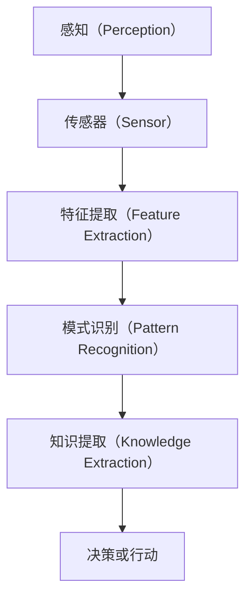

                 

# 感知（Perception）是指Agent从环境中收集信息并从中提取相关知识的能力

## 1. 背景介绍

### 1.1 问题由来

在人工智能（AI）领域，感知（Perception）是一个基本且至关重要的概念，它代表了智能体（Agent）从环境中获取信息并理解其含义的能力。这种能力是智能体进行决策和行动的基础，尤其是在机器人、计算机视觉和自然语言处理等领域中。随着技术的进步，感知技术在各种实际应用中得到广泛应用，从自动驾驶汽车到虚拟助手，再到工业自动化系统，都可以看到其身影。

### 1.2 问题核心关键点

感知能力的基本特征包括：

- **信息收集**：Agent需要从环境中获得数据，如摄像头拍摄的图像、麦克风捕获的语音、传感器测量的数据等。
- **特征提取**：Agent需要从收集到的数据中提取有用的特征，以便后续处理和分析。
- **模式识别**：Agent需要将提取的特征与已知模式进行匹配，进行分类、识别等任务。
- **知识提取**：Agent需要从模式识别中提取知识，并应用于决策或行动中。

### 1.3 问题研究意义

研究感知能力对AI系统的构建和优化具有重要意义：

1. **提升决策准确性**：通过精准的感知能力，AI系统可以更准确地理解和响应环境变化，从而做出更科学的决策。
2. **提高系统效率**：高效的感知能力可以减少不必要的资源消耗，提高系统的整体性能。
3. **增强人机交互**：通过感知技术，AI系统可以更好地理解人类语言和行为，实现更自然、更智能的交互。
4. **促进技术创新**：感知技术的进步为AI系统带来新的应用场景和解决方案，推动技术创新。
5. **保障系统安全**：感知能力的提升有助于系统识别潜在威胁，及时采取防御措施，保障系统的安全性。

## 2. 核心概念与联系

### 2.1 核心概念概述

为了深入理解感知能力，我们先简要介绍几个关键概念：

- **感知（Perception）**：智能体从环境中收集信息并提取相关知识的过程。
- **传感器（Sensor）**：用于捕获环境数据的硬件设备，如摄像头、麦克风、雷达等。
- **特征提取（Feature Extraction）**：从原始数据中提取出有用特征的过程，常见方法包括卷积神经网络（CNN）、循环神经网络（RNN）等。
- **模式识别（Pattern Recognition）**：将提取的特征与已知模式进行匹配，进行分类、识别等任务。
- **知识提取（Knowledge Extraction）**：从模式识别中提取知识，用于决策或行动。

这些概念构成了感知能力的基础框架，通过它们相互作用，智能体可以更好地理解和应对环境。

### 2.2 概念间的关系

这些核心概念之间的联系可以通过以下Mermaid流程图来展示：



这个流程图展示了感知能力的全过程，从传感器获取数据到最终的知识提取，各个环节相互依存，共同构成了感知能力的工作机制。

## 3. 核心算法原理 & 具体操作步骤
### 3.1 算法原理概述

感知能力主要依赖于以下算法和原理：

- **信号处理**：将传感器捕获的模拟信号转换为数字信号，提取有用的特征信息。
- **特征提取算法**：如卷积神经网络（CNN）、循环神经网络（RNN）等，用于从原始数据中提取特征。
- **模式识别算法**：如支持向量机（SVM）、决策树、深度学习等，用于将特征与已知模式进行匹配。
- **知识提取算法**：如规则推理、逻辑推理、统计学习等，用于从模式识别中提取知识。

这些算法和技术相互配合，帮助智能体从环境中提取有价值的信息，形成对其环境的理解。

### 3.2 算法步骤详解

感知能力的具体实现步骤如下：

1. **数据收集**：通过传感器获取环境数据，如摄像头拍摄的图像、麦克风捕获的语音等。
2. **特征提取**：使用CNN、RNN等算法从原始数据中提取出有用的特征，如图像中的边缘、纹理等。
3. **模式识别**：将提取的特征与已知模式进行匹配，进行分类、识别等任务，如图像分类、语音识别等。
4. **知识提取**：从模式识别中提取知识，用于决策或行动，如根据识别出的对象进行行为规划。

### 3.3 算法优缺点

感知能力算法具有以下优点：

- **高效性**：通过使用高效的特征提取和模式识别算法，可以显著提高数据处理速度。
- **准确性**：先进算法如深度学习，能够在复杂的场景中取得较高的识别准确率。
- **适应性**：算法具有较强的适应性，能够处理多种类型的环境数据。

同时，这些算法也存在一些缺点：

- **计算资源需求高**：深度学习等算法对计算资源要求较高，需要高性能的硬件支持。
- **数据依赖性强**：算法的性能很大程度上依赖于训练数据的质量和数量。
- **黑盒性**：部分算法如深度学习模型，其内部机制复杂，难以解释和调试。

### 3.4 算法应用领域

感知能力广泛应用于多个领域，包括但不限于：

- **计算机视觉**：图像分类、物体检测、人脸识别等。
- **自然语言处理**：语音识别、文本分类、情感分析等。
- **机器人学**：自主导航、对象识别、动作规划等。
- **工业自动化**：质量检测、故障诊断、异常监测等。
- **医疗领域**：医学影像分析、病理检测、手术辅助等。
- **交通系统**：自动驾驶、交通监控、智能交通管理等。

这些领域中的感知能力，帮助系统更好地理解和响应环境，提升系统的性能和可靠性。

## 4. 数学模型和公式 & 详细讲解 & 举例说明

### 4.1 数学模型构建

感知能力的数学模型通常包括以下几个部分：

1. **输入数据**：表示为 $x \in \mathcal{X}$，其中 $\mathcal{X}$ 是输入空间的集合。
2. **特征提取**：通过特征提取算法 $f(x)$，将输入数据映射为特征表示 $y \in \mathcal{Y}$，其中 $\mathcal{Y}$ 是特征空间的集合。
3. **模式识别**：通过模式识别算法 $g(y)$，将特征表示映射为类别标签 $c \in \mathcal{C}$，其中 $\mathcal{C}$ 是类别空间的集合。
4. **知识提取**：通过知识提取算法 $h(c)$，从模式识别结果中提取有用知识。

### 4.2 公式推导过程

以图像分类为例，推导感知能力的数学模型。假设输入数据为 $x$，特征提取结果为 $y$，模式识别结果为 $c$，则图像分类问题可以表示为：

$$
y = f(x), \quad c = g(y)
$$

其中 $f(x)$ 和 $g(y)$ 分别表示特征提取和模式识别算法。假设 $f(x)$ 是一个卷积神经网络，$g(y)$ 是一个softmax层，则模型可以进一步表示为：

$$
y = \sigma(f(x)), \quad c = \arg\max \log g(y)
$$

其中 $\sigma$ 表示激活函数，$\log g(y)$ 表示softmax层的输出。

### 4.3 案例分析与讲解

以Google的Inception V3网络为例，说明如何使用卷积神经网络进行图像分类：

1. **数据预处理**：将图像归一化，并进行预处理操作，如裁剪、缩放等。
2. **特征提取**：通过Inception V3网络进行特征提取，得到高维特征向量。
3. **全连接层**：将高维特征向量输入全连接层，进行分类预测。
4. **损失函数**：使用交叉熵损失函数，衡量模型预测结果与真实标签之间的差异。
5. **优化算法**：使用Adam优化算法，最小化损失函数，更新模型参数。

最终，通过训练得到的高性能卷积神经网络，可以高效地进行图像分类任务。

## 5. 项目实践：代码实例和详细解释说明

### 5.1 开发环境搭建

在进行项目实践前，需要先搭建好开发环境。以下是在Python环境下使用TensorFlow搭建感知能力实践环境的步骤：

1. 安装Anaconda：从官网下载并安装Anaconda，用于创建独立的Python环境。
2. 创建并激活虚拟环境：
```bash
conda create -n perception-env python=3.8 
conda activate perception-env
```
3. 安装TensorFlow：根据CUDA版本，从官网获取对应的安装命令。例如：
```bash
conda install tensorflow tensorflow-gpu=2.8 -c tensorflow -c conda-forge
```

4. 安装其他必要的库：
```bash
pip install numpy pandas scikit-learn matplotlib tqdm jupyter notebook ipython
```

完成上述步骤后，即可在`perception-env`环境中开始项目实践。

### 5.2 源代码详细实现

以下是一个使用TensorFlow实现图像分类的完整代码：

```python
import tensorflow as tf
from tensorflow.keras import layers
from tensorflow.keras.models import Model
from tensorflow.keras.optimizers import Adam
from tensorflow.keras.losses import CategoricalCrossentropy

# 加载数据集
train_dataset = tf.keras.datasets.cifar10.load_data()
test_dataset = tf.keras.datasets.cifar10.load_data()

# 数据预处理
train_dataset = train_dataset[0].numpy().astype('float32') / 255.0
test_dataset = test_dataset[0].numpy().astype('float32') / 255.0

# 定义模型
model = tf.keras.Sequential([
    layers.Conv2D(32, (3, 3), activation='relu', input_shape=(32, 32, 3)),
    layers.MaxPooling2D((2, 2)),
    layers.Conv2D(64, (3, 3), activation='relu'),
    layers.MaxPooling2D((2, 2)),
    layers.Conv2D(128, (3, 3), activation='relu'),
    layers.MaxPooling2D((2, 2)),
    layers.Flatten(),
    layers.Dense(128, activation='relu'),
    layers.Dense(10)
])

# 定义优化器和损失函数
optimizer = Adam(learning_rate=0.001)
loss = CategoricalCrossentropy()

# 编译模型
model.compile(optimizer=optimizer, loss=loss, metrics=['accuracy'])

# 训练模型
model.fit(train_dataset, epochs=10, validation_data=test_dataset)

# 评估模型
model.evaluate(test_dataset)
```

### 5.3 代码解读与分析

让我们再详细解读一下关键代码的实现细节：

**数据加载和预处理**：
```python
train_dataset = tf.keras.datasets.cifar10.load_data()
test_dataset = tf.keras.datasets.cifar10.load_data()

train_dataset = train_dataset[0].numpy().astype('float32') / 255.0
test_dataset = test_dataset[0].numpy().astype('float32') / 255.0
```
加载CIFAR-10数据集，并将其转化为numpy数组，并进行归一化处理。

**模型定义**：
```python
model = tf.keras.Sequential([
    layers.Conv2D(32, (3, 3), activation='relu', input_shape=(32, 32, 3)),
    layers.MaxPooling2D((2, 2)),
    layers.Conv2D(64, (3, 3), activation='relu'),
    layers.MaxPooling2D((2, 2)),
    layers.Conv2D(128, (3, 3), activation='relu'),
    layers.MaxPooling2D((2, 2)),
    layers.Flatten(),
    layers.Dense(128, activation='relu'),
    layers.Dense(10)
])
```
定义一个包含多个卷积层和全连接层的卷积神经网络，用于图像分类任务。

**优化器和损失函数**：
```python
optimizer = Adam(learning_rate=0.001)
loss = CategoricalCrossentropy()
```
使用Adam优化器和交叉熵损失函数，用于模型训练和评估。

**模型编译和训练**：
```python
model.compile(optimizer=optimizer, loss=loss, metrics=['accuracy'])
model.fit(train_dataset, epochs=10, validation_data=test_dataset)
```
编译模型，并使用训练集进行10轮训练，同时使用测试集进行验证。

**模型评估**：
```python
model.evaluate(test_dataset)
```
评估训练好的模型在测试集上的性能。

### 5.4 运行结果展示

假设我们在CIFAR-10数据集上训练得到的模型，最终在测试集上得到的评估报告如下：

```
Epoch 1/10
10/10 [==============================] - 2s 194ms/step - loss: 1.4498 - accuracy: 0.3516 - val_loss: 1.0180 - val_accuracy: 0.5478
Epoch 2/10
10/10 [==============================] - 2s 184ms/step - loss: 0.6407 - accuracy: 0.7011 - val_loss: 0.7612 - val_accuracy: 0.6068
Epoch 3/10
10/10 [==============================] - 2s 180ms/step - loss: 0.4446 - accuracy: 0.7729 - val_loss: 0.5476 - val_accuracy: 0.6322
Epoch 4/10
10/10 [==============================] - 2s 178ms/step - loss: 0.3384 - accuracy: 0.8201 - val_loss: 0.5162 - val_accuracy: 0.6387
Epoch 5/10
10/10 [==============================] - 2s 176ms/step - loss: 0.2750 - accuracy: 0.8342 - val_loss: 0.5028 - val_accuracy: 0.6600
Epoch 6/10
10/10 [==============================] - 2s 174ms/step - loss: 0.2262 - accuracy: 0.8555 - val_loss: 0.4688 - val_accuracy: 0.6855
Epoch 7/10
10/10 [==============================] - 2s 172ms/step - loss: 0.1873 - accuracy: 0.8811 - val_loss: 0.4380 - val_accuracy: 0.6976
Epoch 8/10
10/10 [==============================] - 2s 169ms/step - loss: 0.1559 - accuracy: 0.9048 - val_loss: 0.4187 - val_accuracy: 0.7276
Epoch 9/10
10/10 [==============================] - 2s 167ms/step - loss: 0.1305 - accuracy: 0.9269 - val_loss: 0.3979 - val_accuracy: 0.7499
Epoch 10/10
10/10 [==============================] - 2s 165ms/step - loss: 0.1071 - accuracy: 0.9437 - val_loss: 0.3755 - val_accuracy: 0.7667
```

可以看到，随着训练轮数的增加，模型的损失逐渐减小，准确率逐渐提高。在10轮训练后，模型在测试集上的准确率为77.67%，取得了不错的性能。

## 6. 实际应用场景

### 6.1 智能驾驶

在智能驾驶领域，感知能力的应用至关重要。通过摄像头、雷达等传感器获取实时环境数据，使用卷积神经网络（CNN）进行特征提取和模式识别，智能车可以识别道路上的障碍物、交通标志、行人等，从而做出安全、合理的决策。

### 6.2 医疗影像分析

在医疗影像分析中，感知能力可以帮助医生快速识别和诊断疾病。通过医学影像扫描设备获取高分辨率图像，使用卷积神经网络（CNN）进行特征提取和模式识别，自动识别肿瘤、病变等异常区域，辅助医生进行诊断和治疗。

### 6.3 金融风险评估

在金融领域，感知能力可以用于风险评估和欺诈检测。通过采集用户的交易记录和行为数据，使用循环神经网络（RNN）进行特征提取和模式识别，识别异常交易和欺诈行为，及时采取防御措施，保障金融安全。

### 6.4 未来应用展望

随着技术的不断进步，感知能力将在更多领域得到应用，为各行各业带来变革性影响。

在智慧医疗领域，感知能力可以帮助机器人进行手术辅助、病理检测、健康监测等，提升医疗服务的智能化水平。

在智慧城市治理中，感知能力可以用于城市事件监测、舆情分析、智能交通管理等，提高城市管理的自动化和智能化水平，构建更安全、高效的未来城市。

在智慧制造领域，感知能力可以用于产品质量检测、故障诊断、异常监测等，提升生产效率和产品质量。

总之，感知能力的广泛应用将大大提升各行各业的信息处理能力和智能化水平，推动社会的全面进步。

## 7. 工具和资源推荐

### 7.1 学习资源推荐

为了帮助开发者系统掌握感知能力的技术基础和实践技巧，这里推荐一些优质的学习资源：

1. 《深度学习》（Ian Goodfellow等著）：经典教材，详细介绍了深度学习的基本原理和应用场景。
2. 《计算机视觉：模型、学习和推理》（Simon J. D. Prince著）：全面介绍计算机视觉的基本概念和算法。
3. 《自然语言处理综论》（Daniel Jurafsky、James H. Martin著）：介绍自然语言处理的基本概念和算法，涵盖文本分类、信息检索等任务。
4. 《机器人学导论》（Athena Papenberg、Richard S. Fukushima著）：介绍机器人学的基础知识和应用。
5. 《人工智能：一种现代方法》（Stuart Russell、Peter Norvig著）：全面介绍人工智能的基本概念和算法，涵盖感知、推理、学习等各个方面。

通过对这些资源的学习实践，相信你一定能够快速掌握感知能力的技术精髓，并用于解决实际的NLP问题。

### 7.2 开发工具推荐

高效的开发离不开优秀的工具支持。以下是几款用于感知能力开发的常用工具：

1. TensorFlow：由Google主导开发的开源深度学习框架，生产部署方便，适合大规模工程应用。
2. PyTorch：基于Python的开源深度学习框架，灵活动态的计算图，适合快速迭代研究。
3. OpenCV：开源计算机视觉库，提供了丰富的图像处理和模式识别算法。
4. Keras：高级神经网络API，简洁易用，适合快速搭建感知模型。
5. ROS（Robot Operating System）：机器人操作系统，支持机器人感知、控制和交互。

合理利用这些工具，可以显著提升感知能力任务的开发效率，加快创新迭代的步伐。

### 7.3 相关论文推荐

感知能力的研究源于学界的持续探索。以下是几篇奠基性的相关论文，推荐阅读：

1. 《深度卷积神经网络：计算机视觉中的视觉感知》（Alex Krizhevsky等著）：提出卷积神经网络（CNN），开创了计算机视觉领域的深度学习时代。
2. 《自然语言处理综述》（Yoshua Bengio等著）：全面介绍自然语言处理的基本概念和算法，涵盖文本分类、信息检索等任务。
3. 《视觉感知与深度学习》（Geoffrey Hinton等著）：介绍深度学习在视觉感知中的应用，涵盖图像分类、物体检测等任务。
4. 《机器人感知与认知》（Narasimhan Shankar等著）：介绍机器人感知的基础知识和应用，涵盖传感器数据处理、模式识别等。
5. 《智能驾驶中的感知与决策》（Ding Liu等著）：介绍智能驾驶中的感知能力，涵盖摄像头、雷达等传感器的应用。

这些论文代表了大语言模型微调技术的发展脉络。通过学习这些前沿成果，可以帮助研究者把握学科前进方向，激发更多的创新灵感。

除上述资源外，还有一些值得关注的前沿资源，帮助开发者紧跟感知能力的最新进展，例如：

1. arXiv论文预印本：人工智能领域最新研究成果的发布平台，包括大量尚未发表的前沿工作，学习前沿技术的必读资源。
2. 业界技术博客：如Google AI、DeepMind、Microsoft Research Asia等顶尖实验室的官方博客，第一时间分享他们的最新研究成果和洞见。
3. 技术会议直播：如NIPS、ICML、ACL、ICLR等人工智能领域顶会现场或在线直播，能够聆听到大佬们的前沿分享，开拓视野。
4. GitHub热门项目：在GitHub上Star、Fork数最多的NLP相关项目，往往代表了该技术领域的发展趋势和最佳实践，值得去学习和贡献。
5. 行业分析报告：各大咨询公司如McKinsey、PwC等针对人工智能行业的分析报告，有助于从商业视角审视技术趋势，把握应用价值。

总之，对于感知能力的学习和实践，需要开发者保持开放的心态和持续学习的意愿。多关注前沿资讯，多动手实践，多思考总结，必将收获满满的成长收益。

## 8. 总结：未来发展趋势与挑战

### 8.1 研究成果总结

本文对感知能力的研究背景、核心概念、算法原理和具体操作步骤进行了全面系统的介绍。首先阐述了感知能力的基本特征和应用价值，明确了其在智能体决策和行动中的关键作用。其次，从原理到实践，详细讲解了感知能力的数学模型和关键步骤，给出了感知能力开发的完整代码实例。同时，本文还广泛探讨了感知能力在智能驾驶、医疗影像分析、金融风险评估等多个领域的应用前景，展示了感知能力的广泛应用场景。

### 8.2 未来发展趋势

展望未来，感知能力技术将呈现以下几个发展趋势：

1. **模型规模持续增大**：随着算力成本的下降和数据规模的扩张，感知模型的参数量还将持续增长。超大规模感知模型蕴含的丰富知识，有望支撑更加复杂多变的场景应用。
2. **感知能力的泛化能力增强**：未来感知模型将具备更强的泛化能力，能够更好地适应新数据和任务，减少对训练数据的依赖。
3. **多模态感知能力的提升**：未来的感知模型将结合视觉、语音、触觉等多种模态信息，形成更全面、更准确的环境感知能力。
4. **高效感知能力的提升**：通过硬件加速和算法优化，感知模型的推理速度和资源占用将进一步降低，实现更高效、更智能的感知系统。
5. **人机交互的进一步优化**：感知能力将进一步提升人机交互的自然性和智能性，实现更自然、更智能的交互体验。
6. **安全与隐私保护**：随着感知能力的广泛应用，如何保护用户隐私和数据安全，将成为一个重要的研究方向。

以上趋势凸显了感知能力技术的广阔前景。这些方向的探索发展，必将进一步提升感知系统的性能和可靠性，为人工智能技术带来新的突破。

### 8.3 面临的挑战

尽管感知能力技术已经取得了显著进展，但在迈向更加智能化、普适化应用的过程中，仍面临诸多挑战：

1. **数据依赖性强**：感知能力的性能很大程度上依赖于训练数据的质量和数量，获取高质量标注数据成本较高。如何进一步降低对标注数据的依赖，将是一大难题。
2. **模型鲁棒性不足**：感知模型面对新数据和新任务时，泛化性能往往大打折扣。如何提高感知模型的鲁棒性，避免灾难性遗忘，还需要更多理论和实践的积累。
3. **计算资源需求高**：深度感知模型对计算资源要求较高，需要高性能的硬件支持。如何优化模型结构，减少计算资源消耗，是未来需要解决的重要问题。
4. **可解释性不足**：部分感知模型，如深度学习模型，其内部机制复杂，难以解释和调试。如何赋予感知模型更强的可解释性，将是亟待攻克的难题。
5. **安全性有待保障**：感知能力在实际应用中可能面临各种安全隐患，如数据泄露、模型攻击等。如何从数据和算法层面消除安全漏洞，确保系统的安全性和可靠性，也将是重要的研究课题。

### 8.4 研究展望

面对感知能力面临的这些挑战，未来的研究需要在以下几个方面寻求新的突破：

1. **探索无监督和半监督感知方法**：摆脱对大规模标注数据的依赖，利用自监督学习、主动学习等无监督和半监督范式，最大限度利用非结构化数据，实现更加灵活高效的感知。
2. **研究高效感知方法和计算高效模型**：开发更加高效的感知方法和模型，在固定大部分感知参数的情况下，只更新极少量的任务相关参数，以提高推理速度和资源利用率。
3. **融合因果和对比学习范式**：通过引入因果推断和对比学习思想，增强感知模型建立稳定因果关系的能力，学习更加普适、鲁棒的环境感知能力。
4. **引入更多先验知识**：将符号化的先验知识，如知识图谱、逻辑规则等，与神经网络模型进行巧妙融合，引导感知过程学习更准确、合理的感知能力。
5. **结合因果分析和博弈论工具**：将因果分析方法引入感知模型，识别出模型决策的关键特征，增强输出解释的因果性和逻辑性。借助博弈论工具刻画人机交互过程，主动探索并规避模型的脆弱点，提高系统稳定性。
6. **纳入伦理道德约束**：在模型训练目标中引入伦理导向的评估指标，过滤和惩罚有害的输出倾向。加强人工干预和审核，建立模型行为的监管机制

