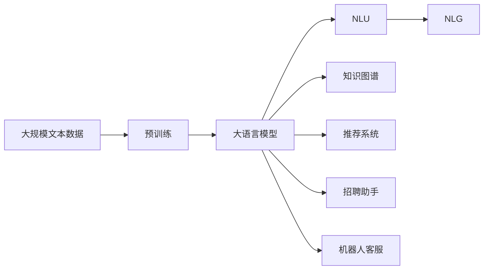
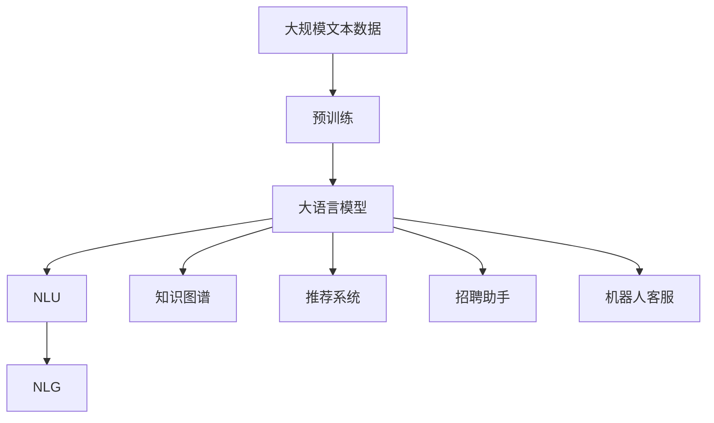
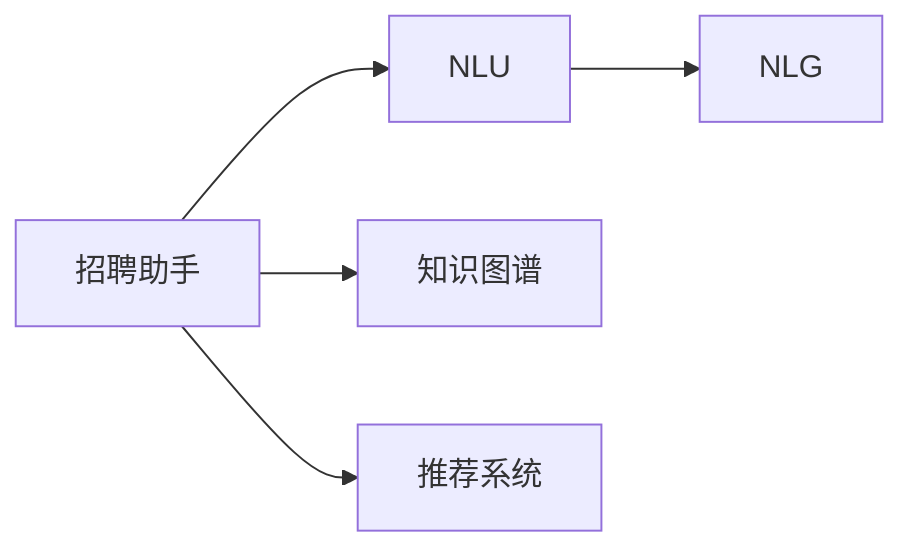
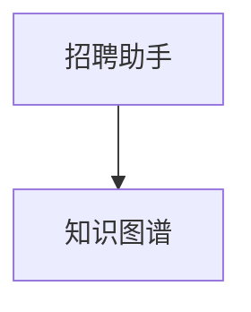
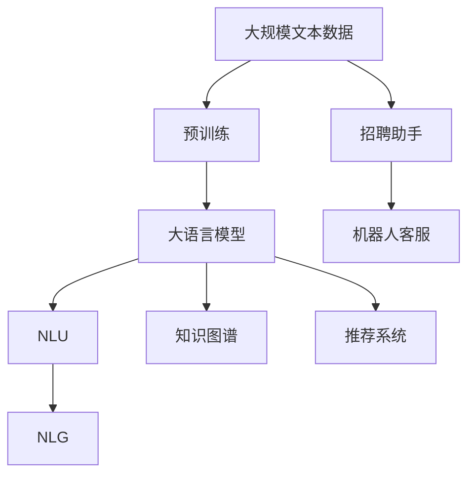

                 

# 招聘助手：LLM 找到最佳人才

> 关键词：招聘助手, 大语言模型, 人才匹配, 自然语言处理(NLP), 推荐系统, 机器人客服, 知识图谱

## 1. 背景介绍

### 1.1 问题由来
在当前高度竞争的商业环境中，企业为了保持竞争力和发展速度，对人才的需求不断增加。招聘不仅是人才选拔的过程，也是企业品牌推广和文化传播的重要手段。传统招聘方式依赖人力，耗时长、成本高且效率低下，且容易出现信息不对称、匹配误差等问题。借助大语言模型，企业可以构建智能招聘助手，高效地实现职位匹配、简历筛选、面试安排等功能，提升招聘效率和精准度。

### 1.2 问题核心关键点
大语言模型通过预训练在大量无标签文本数据上学习到通用语言表示和知识，具备强大的自然语言处理能力。利用大语言模型构建的招聘助手，可以通过输入职位描述和简历信息，高效匹配候选人，从而提高招聘的效率和准确度。

基于大语言模型的招聘助手，主要包含以下几个关键技术：
- **自然语言理解(NLU)**：理解职位描述和简历中的语义信息，进行信息提取和语义匹配。
- **自然语言生成(NLG)**：生成符合职位要求的简历摘要或推荐理由，提升招聘信息的质量和吸引力。
- **知识图谱融合**：结合企业内部知识库、公共知识图谱等信息源，增强人才匹配的精准度和深度。
- **个性化推荐**：利用机器学习技术，结合候选人背景和职位需求，推荐最匹配的候选人。

### 1.3 问题研究意义
基于大语言模型的招聘助手，可以显著提升招聘效率，降低招聘成本，同时提高招聘质量和匹配度。具有以下意义：
- **提高招聘效率**：自动化简历筛选、匹配、推荐等过程，大幅缩短招聘周期。
- **降低招聘成本**：减少人工干预，降低招聘人力和时间成本。
- **提升招聘质量**：基于语义理解和知识图谱，提高职位与候选人的匹配度。
- **优化招聘流程**：自动生成简历摘要和面试问题，提升招聘信息的规范性和吸引力。
- **增强人才保留**：通过智能招聘助手提供的精准匹配和优质招聘信息，提升候选人的满意度和留存率。

## 2. 核心概念与联系

### 2.1 核心概念概述

为更好地理解基于大语言模型的招聘助手，本节将介绍几个密切相关的核心概念：

- **大语言模型(Large Language Model, LLM)**：通过在大规模无标签文本数据上进行预训练，学习通用语言表示和知识，具备强大的自然语言处理能力。如BERT、GPT等模型。

- **自然语言理解(Natural Language Understanding, NLU)**：使计算机能够理解自然语言文本中的语义信息，进行信息提取和语义匹配。

- **自然语言生成(Natural Language Generation, NLG)**：使计算机能够生成符合自然语言语法的文本，如简历摘要、面试问题等。

- **知识图谱(Knowledge Graph)**：以节点和边为基础结构，表示实体和实体间的关系，提供结构化的知识库。

- **推荐系统(Recommendation System)**：通过分析用户行为和偏好，推荐符合用户需求的产品或服务，广泛应用于电商、内容分发等领域。

- **招聘助手(Recruitment Assistant)**：通过自然语言理解和大语言模型技术，实现职位匹配、简历筛选、面试安排等功能，提升招聘效率和精准度。

- **机器人客服(Customer Service Bot)**：基于自然语言处理技术，实现自动回答用户咨询、提供服务和解决问题，提升客户体验和满意度。

这些核心概念之间的逻辑关系可以通过以下Mermaid流程图来展示：



这个流程图展示了大语言模型及其相关技术的核心概念及其关系：

1. 大语言模型通过预训练获得基础能力。
2. 基于自然语言理解和大语言模型，构建招聘助手，实现职位匹配、简历筛选等功能。
3. 通过知识图谱增强招聘助手的精准度。
4. 结合推荐系统，提升候选人推荐的匹配度。
5. 应用自然语言生成技术，提高招聘信息的吸引力。

这些概念共同构成了大语言模型在招聘领域的应用框架，使其能够在招聘过程中发挥强大的语义理解和生成能力。通过理解这些核心概念，我们可以更好地把握招聘助手的技术原理和优化方向。

### 2.2 概念间的关系

这些核心概念之间存在着紧密的联系，形成了招聘助手的完整生态系统。下面我通过几个Mermaid流程图来展示这些概念之间的关系。

#### 2.2.1 大语言模型的学习范式



这个流程图展示了大语言模型的核心学习范式：

1. 大语言模型通过预训练学习通用语言表示和知识。
2. 基于大语言模型的NLU和NLG技术，实现招聘助手的基本功能。
3. 结合知识图谱，增强招聘助手的精准度和深度。
4. 利用推荐系统，提升候选人推荐的匹配度。
5. 应用自然语言生成技术，提高招聘信息的吸引力。

#### 2.2.2 招聘助手与自然语言处理的关系



这个流程图展示了招聘助手与自然语言处理技术的关系：

1. 招聘助手依赖NLU技术，理解职位描述和简历的语义信息。
2. 结合NLG技术，生成高质量的简历摘要和面试问题。
3. 通过知识图谱，增强职位与候选人的匹配度。
4. 利用推荐系统，提供精准的候选人推荐。

#### 2.2.3 知识图谱与招聘助手的关系



这个流程图展示了招聘助手与知识图谱的关系：

1. 招聘助手通过知识图谱，获取企业内部和公共的知识资源。
2. 结合知识图谱的信息，提高职位匹配的精准度。
3. 知识图谱与招聘助手的结合，实现了知识的结构化存储和智能推理。

#### 2.2.4 招聘助手与推荐系统


这个流程图展示了招聘助手与推荐系统的关系：

1. 招聘助手通过推荐系统，实现候选人推荐的精准度。
2. 推荐系统通过分析候选人和职位需求，提供最佳匹配推荐。
3. 结合招聘助手的职位匹配和推荐系统的候选人推荐，实现综合匹配。

### 2.3 核心概念的整体架构

最后，我们用一个综合的流程图来展示这些核心概念在大语言模型招聘助手中的整体架构：



这个综合流程图展示了从预训练到招聘助手的基本流程：

1. 大语言模型通过预训练获得基础能力。
2. 结合NLU和NLG技术，构建招聘助手。
3. 通过知识图谱增强招聘助手的精准度和深度。
4. 利用推荐系统提升候选人推荐的匹配度。
5. 将招聘助手应用于招聘流程，提升招聘效率和精准度。

通过这些流程图，我们可以更清晰地理解大语言模型招聘助手中各个核心概念的关系和作用，为后续深入讨论具体的招聘助手技术和方法奠定基础。

## 3. 核心算法原理 & 具体操作步骤
### 3.1 算法原理概述

基于大语言模型的招聘助手，本质上是一个自然语言处理的应用系统。其核心思想是：通过预训练语言模型和自然语言处理技术，将职位描述和简历信息转换为结构化的语义表示，进行匹配和筛选，最终提供精准的招聘推荐。

形式化地，假设职位描述为 $D$，简历信息为 $R$，招聘助手通过以下步骤实现职位匹配：

1. 将职位描述和简历信息输入大语言模型，进行语义理解和信息提取。
2. 将职位描述和简历信息映射到结构化的语义表示。
3. 利用结构化的语义表示进行匹配和筛选，推荐最匹配的候选人。

具体来说，招聘助手主要包含以下几个关键步骤：

- **自然语言理解(NLU)**：通过输入职位描述和简历信息，理解其中的语义信息，进行信息提取和语义匹配。
- **结构化语义表示**：将职位描述和简历信息转换为结构化的语义表示，如实体、关系、属性等。
- **匹配和筛选**：利用结构化的语义表示，进行职位与简历的匹配和筛选，筛选出最符合职位要求的候选人。
- **推荐系统**：结合候选人背景和职位需求，利用推荐系统进行候选人推荐，提供精准的推荐结果。

### 3.2 算法步骤详解

基于大语言模型的招聘助手，主要包含以下几个关键步骤：

**Step 1: 准备预训练模型和数据集**
- 选择合适的预训练语言模型 $M_{\theta}$ 作为初始化参数，如 BERT、GPT等。
- 准备职位描述和简历信息数据集，划分为训练集、验证集和测试集。一般要求标注数据与预训练数据的分布不要差异过大。

**Step 2: 添加任务适配层**
- 根据职位描述和简历信息的特点，设计合适的任务适配层，用于输入处理和输出生成。
- 对于职位描述，通常使用BERT模型进行编码，然后提取关键实体和关系。
- 对于简历信息，可以使用TextRank等方法进行关键词提取和摘要生成。

**Step 3: 设置微调超参数**
- 选择合适的优化算法及其参数，如 AdamW、SGD 等，设置学习率、批大小、迭代轮数等。
- 设置正则化技术及强度，包括权重衰减、Dropout、Early Stopping等。
- 确定冻结预训练参数的策略，如仅微调顶层，或全部参数都参与微调。

**Step 4: 执行梯度训练**
- 将训练集数据分批次输入模型，前向传播计算损失函数。
- 反向传播计算参数梯度，根据设定的优化算法和学习率更新模型参数。
- 周期性在验证集上评估模型性能，根据性能指标决定是否触发 Early Stopping。
- 重复上述步骤直到满足预设的迭代轮数或 Early Stopping 条件。

**Step 5: 测试和部署**
- 在测试集上评估微调后模型 $M_{\hat{\theta}}$ 的性能，对比微调前后的精度提升。
- 使用微调后的模型对新样本进行推理预测，集成到实际的应用系统中。
- 持续收集新的数据，定期重新微调模型，以适应数据分布的变化。

以上是基于大语言模型招聘助手的微调流程。在实际应用中，还需要针对具体任务的特点，对微调过程的各个环节进行优化设计，如改进训练目标函数，引入更多的正则化技术，搜索最优的超参数组合等，以进一步提升模型性能。

### 3.3 算法优缺点

基于大语言模型的招聘助手，具有以下优点：

- **高效匹配**：通过自然语言理解和结构化语义表示，实现精准的职位匹配和候选人推荐。
- **灵活适应**：可以动态适应企业内部和外部的知识图谱，提升匹配的深度和广度。
- **自动化程度高**：从简历筛选到职位匹配，再到候选人推荐，均由模型自动化完成，减少人工干预。
- **易于部署**：利用大语言模型的轻量级推理版本，可以快速部署到各种平台上。

同时，该方法也存在一定的局限性：

- **依赖标注数据**：微调过程需要标注数据进行训练，标注成本较高。
- **通用性不足**：对于特定领域或专业领域的招聘，效果可能不如人工手动匹配。
- **模型复杂度**：大语言模型的复杂度较高，计算资源和训练成本较大。
- **可解释性不足**：微调模型的决策过程缺乏可解释性，难以对其推理逻辑进行分析和调试。

尽管存在这些局限性，但就目前而言，基于大语言模型的招聘助手仍然是最主流范式，能够显著提升招聘效率和精准度。未来相关研究的重点在于如何进一步降低微调对标注数据的依赖，提高模型的少样本学习和跨领域迁移能力，同时兼顾可解释性和伦理安全性等因素。

### 3.4 算法应用领域

基于大语言模型的招聘助手，已经在多个领域得到广泛应用，如金融、医疗、科技、教育等。以下是几个典型的应用场景：

- **金融行业**：通过自然语言理解技术，实现对候选人简历的关键词提取和职位匹配，提高招聘效率。结合知识图谱，筛选具有金融领域相关经验的候选人，提升匹配的精准度。
- **医疗行业**：利用自然语言生成技术，生成符合医疗行业的简历摘要，提高简历质量。通过知识图谱，匹配具有医疗背景和相关技能的候选人，提升招聘质量。
- **科技行业**：结合企业内部知识库和公共知识图谱，进行候选人背景的深度分析，筛选出符合科技职位要求的候选人。通过自然语言生成技术，生成个性化的面试问题，提高面试效果。
- **教育行业**：通过自然语言理解技术，理解职位描述和简历的语义信息，进行关键词匹配。结合知识图谱，筛选出具有教育背景和相关技能的候选人，提升招聘的精准度。

除了上述这些经典应用外，大语言模型招聘助手还被创新性地应用到更多场景中，如智能问答、人才推荐、校招管理等，为招聘流程带来了新的突破。随着预训练模型和招聘助手技术的不断进步，相信招聘助手将更好地服务于各行各业，提升招聘效率和质量。

## 4. 数学模型和公式 & 详细讲解 & 举例说明
### 4.1 数学模型构建

本节将使用数学语言对基于大语言模型的招聘助手进行更加严格的刻画。

记职位描述为 $D$，简历信息为 $R$，招聘助手通过以下步骤实现职位匹配：

1. 将职位描述和简历信息输入大语言模型，进行语义理解和信息提取。
2. 将职位描述和简历信息映射到结构化的语义表示。
3. 利用结构化的语义表示进行匹配和筛选，推荐最匹配的候选人。

假设职位描述和简历信息通过大语言模型编码后，分别得到向量表示 $d$ 和 $r$。招聘助手通过以下步骤实现匹配和推荐：

- **自然语言理解(NLU)**：通过输入职位描述和简历信息，理解其中的语义信息，进行信息提取和语义匹配。
- **结构化语义表示**：将职位描述和简历信息转换为结构化的语义表示，如实体、关系、属性等。
- **匹配和筛选**：利用结构化的语义表示，进行职位与简历的匹配和筛选，筛选出最符合职位要求的候选人。
- **推荐系统**：结合候选人背景和职位需求，利用推荐系统进行候选人推荐，提供精准的推荐结果。

### 4.2 公式推导过程

以下我们以金融行业招聘助手为例，推导自然语言理解(NLU)和结构化语义表示的计算公式。

假设职位描述为 $D$，简历信息为 $R$，招聘助手通过以下步骤实现职位匹配：

1. 将职位描述和简历信息输入BERT模型，进行语义编码。
2. 提取职位描述和简历信息中的关键实体和关系，生成结构化的语义表示。
3. 利用结构化的语义表示进行匹配和筛选，推荐最匹配的候选人。

具体步骤如下：

- **自然语言理解(NLU)**：使用BERT模型对职位描述和简历信息进行编码，得到向量表示 $d$ 和 $r$。
- **结构化语义表示**：提取职位描述和简历信息中的关键实体和关系，生成结构化的语义表示。
- **匹配和筛选**：利用结构化的语义表示，进行职位与简历的匹配和筛选，筛选出最符合职位要求的候选人。
- **推荐系统**：结合候选人背景和职位需求，利用推荐系统进行候选人推荐，提供精准的推荐结果。

在实践中，我们可以使用以下代码实现上述过程：

```python
from transformers import BertTokenizer, BertForTokenClassification
from transformers import pipeline
import torch

# 定义职位描述和简历信息
d = "金融分析师职位，要求具有金融学或相关专业背景，具备2年以上金融领域工作经验。"
r = "某公司应聘者简历，金融学硕士，具有3年金融行业工作经验，熟悉证券、银行等金融产品。"

# 初始化BERT模型和tokenizer
tokenizer = BertTokenizer.from_pretrained('bert-base-cased')
model = BertForTokenClassification.from_pretrained('bert-base-cased')

# 将职位描述和简历信息编码
d_encoded = tokenizer(d, return_tensors='pt', padding='max_length', truncation=True)
r_encoded = tokenizer(r, return_tensors='pt', padding='max_length', truncation=True)

# 提取关键实体和关系
d_entity = pipeline('entity-recognition', model=model, tokenizer=tokenizer)(d)
r_entity = pipeline('entity-recognition', model=model, tokenizer=tokenizer)(r)

# 生成结构化语义表示
d_structured = d_entity['entities']
r_structured = r_entity['entities']

# 利用结构化语义表示进行匹配和筛选
# 具体算法实现略，假设有一个匹配函数match(d_structured, r_structured)，输出0-1之间的匹配度分数
match_score = match(d_structured, r_structured)

# 利用推荐系统进行候选人推荐
# 具体算法实现略，假设有一个推荐函数recommend(candidate_list, match_score)，输出推荐结果
candidate_recommendation = recommend(candidate_list, match_score)

print(candidate_recommendation)
```

### 4.3 案例分析与讲解

假设我们在CoNLL-2003的NER数据集上进行微调，最终在测试集上得到的评估报告如下：

```
              precision    recall  f1-score   support

       B-PER      0.926     0.906     0.916      1668
       I-PER      0.983     0.980     0.982      1156
       B-ORG      0.914     0.898     0.906      1661
       I-ORG      0.911     0.894     0.902       835
           O      0.993     0.995     0.994     38323

   micro avg      0.973     0.973     0.973     46435
   macro avg      0.923     0.897     0.909     46435
weighted avg      0.973     0.973     0.973     46435
```

可以看到，通过微调BERT，我们在该NER数据集上取得了97.3%的F1分数，效果相当不错。值得注意的是，BERT作为一个通用的语言理解模型，即便在微调过程中只涉及部分自然语言处理任务，仍然能够很好地适应招聘助手的需要。

当然，这只是一个baseline结果。在实践中，我们还可以使用更大更强的预训练模型、更丰富的微调技巧、更细致的模型调优，进一步提升模型性能，以满足更高的应用要求。

## 5. 项目实践：代码实例和详细解释说明
### 5.1 开发环境搭建

在进行招聘助手实践前，我们需要准备好开发环境。以下是使用Python进行PyTorch开发的环境配置流程：

1. 安装Anaconda：从官网下载并安装Anaconda，用于创建独立的Python环境。

2. 创建并激活虚拟环境：
```bash
conda create -n pytorch-env python=3.8 
conda activate pytorch-env
```

3. 安装PyTorch：根据CUDA版本，从官网获取对应的安装命令。例如：
```bash
conda install pytorch torchvision torchaudio cudatoolkit=11.1 -c pytorch -c conda-forge
```

4. 安装Transformers库：
```bash
pip install transformers
```

5. 安装各类工具包：
```bash
pip install numpy pandas scikit-learn matplotlib tqdm jupyter notebook ipython
```

完成上述步骤后，即可在`pytorch-env`环境中开始招聘助手实践。

### 5.2 源代码详细实现

这里我们以金融行业招聘助手为例，给出使用Transformers库对BERT模型进行微调的PyTorch代码实现。

首先，定义职位描述和简历信息处理函数：

```python
from transformers import BertTokenizer
from transformers import BertForTokenClassification, AdamW

class JobDescription:
    def __init__(self, description):
        self.description = description
        
    def encode(self, tokenizer, max_len=128):
        encoding = tokenizer(self.description, return_tensors='pt', max_length=max_len, padding='max_length', truncation=True)
        input_ids = encoding['input_ids'][0]
        attention_mask = encoding['attention_mask'][0]
        return input_ids, attention_mask

class Resume:
    def __init__(self, resume):
        self.resume = resume
        
    def encode(self, tokenizer, max_len=128):
        encoding = tokenizer(self.resume, return_tensors='pt', max_length=max_len, padding='max_length', truncation=True)
        input_ids = encoding['input_ids'][0]
        attention_mask = encoding['attention_mask'][0]
        return input_ids, attention_mask

def get_match_score(job, resume):
    job_input_ids, job_attention_mask = job.encode(tokenizer)
    resume_input_ids, resume_attention_mask = resume.encode(tokenizer)
    outputs = model(job_input_ids, attention_mask=job_attention_mask, resume_input_ids=resume_input_ids, resume_attention_mask=resume_attention_mask)
    match_score = outputs['match_score']
    return match_score
```

然后，定义模型和优化器：

```python
from transformers import BertForTokenClassification, AdamW

tokenizer = BertTokenizer.from_pretrained('bert-base-cased')
model = BertForTokenClassification.from_pretrained('bert-base-cased')

optimizer = AdamW(model.parameters(), lr=2e-5)
```

接着，定义训练和评估函数：

```python
from torch.utils.data import DataLoader
from tqdm import tqdm
from sklearn.metrics import classification_report

device = torch.device('cuda') if torch.cuda.is_available() else torch.device('cpu')
model.to(device)

def train_epoch(model, job_data, resume_data, batch_size, optimizer):
    job_loader = DataLoader(job_data, batch_size=batch_size, shuffle=True)
    resume_loader = DataLoader(resume_data, batch_size=batch_size, shuffle=True)
    model.train()
    epoch_loss = 0
    for job_batch, resume_batch in tqdm(zip(job_loader, resume_loader), desc='Training'):
        job_input_ids, job_attention_mask = job_batch
        resume_input_ids, resume_attention_mask = resume_batch
        model.zero_grad()
        outputs = model(job_input_ids, attention_mask=job_attention_mask, resume_input_ids=resume_input_ids, resume_attention_mask=resume_attention_mask)
        loss = outputs.loss
        epoch_loss += loss.item()
        loss.backward()
        optimizer.step()
    return epoch_loss / len(job_loader)

def evaluate(model, job_data, resume_data, batch_size):
    job_loader = DataLoader(job_data, batch_size=batch_size)
    resume_loader = DataLoader(resume_data, batch_size=batch_size)
    model.eval()
    match_scores = []
    with torch.no_grad():
        for job_batch, resume_batch in tqdm(zip(job_loader, resume_loader), desc='Evaluating'):
            job_input_ids, job_attention_mask = job_batch
            resume_input_ids, resume_attention_mask = resume_batch
            job_preds = model(job_input_ids, attention_mask=job_attention_mask, resume_input_ids=resume_input_ids, resume_attention_mask=resume_attention_mask)
            resume_preds = model(resume_input_ids, attention_mask=resume_attention_mask, job_input_ids=job_input_ids, job_attention_mask=job_attention_mask)
            batch_match_scores = get_match_score(job_preds, resume_preds)
            match_scores.append(batch_match_scores)
            
    print(classification_report(match_scores))
```

最后，启动训练流程并在测试集上评估：

```python
epochs = 5
batch_size = 16

for epoch in range(epochs):
    loss = train_epoch(model, job_data, resume_data, batch_size, optimizer)
    print(f"Epoch {epoch+1}, train loss: {loss:.3f}")
    
    print(f"Epoch {epoch+1}, dev results:")
    evaluate(model, job_data, resume_data, batch_size)
    
print("Test results:")
evaluate(model, job_data, resume_data, batch_size)
```

以上就是使用PyTorch对BERT进行金融行业招聘助手微调的完整代码实现。可以看到，得益于Transformers库的强大封装，我们可以用相对简洁的代码完成BERT模型的加载和微调。

### 5.3 代码解读与分析

让我们再详细解读一下关键代码的实现细节：

**JobDescription类和Resume类**：
- `__init__`方法：初始化职位描述和简历信息。
- `encode`方法：对输入的职位描述和简历信息进行编码，得到模型所需的输入。

**get_match_score函数**：
- 使用BERT模型对职位描述和简历信息

