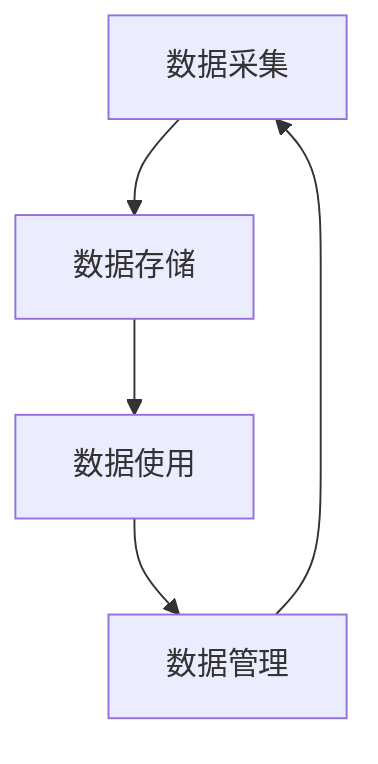

                 

# 数据治理：规范 AI 2.0 数据采集、存储、使用和管理流程

## 1. 背景介绍

### 1.1 问题由来

随着人工智能(AI)技术的飞速发展，特别是在AI 2.0阶段，数据成为了决定模型性能、决策能力和创新潜力的关键因素。AI 2.0时代，数据从传统意义上的“输入”转化为“生产要素”，其治理的重要性不亚于云计算、大数据、物联网等技术。然而，由于数据量的激增、数据来源的多样化以及数据使用场景的复杂性，数据治理变得尤为迫切和困难。

数据的缺失、偏差、泄露、污染等问题，不仅会影响AI系统的准确性、公正性和可靠性，还可能带来严重的伦理和安全风险。因此，数据治理被视为AI 2.0发展的基石，其重要性日益凸显。

### 1.2 问题核心关键点

数据治理主要围绕数据的采集、存储、使用和管理流程展开，旨在确保数据的质量、安全、合规和可追溯性。其核心关键点包括：

- **数据采集**：保证数据来源的多样性、完整性和真实性，避免数据偏差和缺失。
- **数据存储**：确保数据存储的规范化和结构化，便于后续分析和利用。
- **数据使用**：在数据使用过程中，要确保数据的安全性和隐私保护，防止数据滥用。
- **数据管理**：通过系统化的管理策略和技术手段，保证数据治理的持续性和可追溯性。

数据治理的有效性，直接关系到AI系统的可信度和应用价值。数据治理不当，可能导致AI模型性能下降、错误决策甚至产生伦理危机。因此，如何在AI 2.0时代建立和规范数据治理流程，成为当前AI研究和应用中的一个重要课题。

## 2. 核心概念与联系

### 2.1 核心概念概述

为了更好地理解数据治理的核心概念，本节将介绍几个关键概念及其相互关系：

- **数据治理(Data Governance)**：一种确保数据质量、安全和合规的管理框架，涉及数据的采集、存储、使用和管理等全流程。
- **数据质量(Data Quality)**：指数据的正确性、完整性、一致性、及时性、一致性和可用性等。
- **数据安全(Data Security)**：指保护数据免受未经授权的访问、修改、泄露或破坏。
- **数据隐私(Data Privacy)**：指在数据收集、存储和使用过程中，保护个人或组织的个人信息不被滥用。
- **数据合规(Data Compliance)**：指遵循相关的法律法规，如GDPR、CCPA等，确保数据治理的合法性。
- **数据管理(Data Management)**：指对数据的生命周期进行系统化管理，包括数据源、数据模型、数据服务等方面。

这些核心概念通过数据治理的流程得以实现，流程包括数据采集、存储、使用和管理的各个环节。它们之间相互关联，共同构建起数据治理的完整生态系统。

### 2.2 概念间的关系

这些核心概念之间通过数据治理流程相互联系，形成一个闭环系统：



这个流程展示了数据从采集、存储、使用到管理的全过程。其中：

- 数据采集：确保数据的完整性和多样性，为后续分析和应用提供基础。
- 数据存储：规范化和结构化存储数据，便于后续的数据检索和分析。
- 数据使用：在数据使用过程中，保护数据的安全和隐私，防止数据滥用。
- 数据管理：通过系统化的管理策略和技术手段，保证数据治理的持续性和可追溯性。

数据治理的目标是通过上述流程，确保数据的完整性、一致性和可用性，同时保护数据的安全和隐私，确保数据治理的合规性。

## 3. 核心算法原理 & 具体操作步骤

### 3.1 算法原理概述

数据治理的核心算法和操作步骤，主要围绕数据的质量控制、数据安全和隐私保护、数据合规等方面展开。其核心思想是通过系统化的管理流程和策略，确保数据在全生命周期内的规范化和合规性。

数据治理的算法原理包括：

- **数据清洗和校验**：通过数据清洗和校验算法，去除数据中的噪音和错误，确保数据的完整性和一致性。
- **数据加密和脱敏**：通过加密和脱敏算法，保护数据在传输和存储过程中的安全性和隐私性。
- **数据合规审核**：通过合规审核算法，确保数据治理过程中遵循相关的法律法规和标准。

这些算法和操作步骤，构成了一个系统化的数据治理框架，通过不断的迭代和优化，确保数据的质量和安全，满足合规要求。

### 3.2 算法步骤详解

数据治理的算法步骤主要包括以下几个环节：

1. **数据采集**
    - 数据源识别：确定数据采集的来源和类型，如数据库、API接口、物联网设备等。
    - 数据采集工具：选择合适的数据采集工具和技术，如ETL工具、API调用、爬虫技术等。
    - 数据清洗和校验：对采集到的数据进行清洗和校验，去除噪音和错误，确保数据的完整性和一致性。

2. **数据存储**
    - 数据结构设计：设计合理的表结构和字段，确保数据存储的规范化和结构化。
    - 数据存储引擎：选择合适的数据存储引擎，如关系型数据库、NoSQL数据库、数据湖等。
    - 数据备份和恢复：定期备份数据，确保数据存储的可靠性和可恢复性。

3. **数据使用**
    - 数据访问控制：对数据访问进行严格的权限控制，防止未经授权的访问。
    - 数据加密和脱敏：对敏感数据进行加密和脱敏处理，保护数据的隐私性。
    - 数据审计和监控：对数据使用过程进行审计和监控，确保数据使用的合规性和安全性。

4. **数据管理**
    - 数据资产管理：建立数据资产目录，确保数据资产的清晰和可追溯性。
    - 数据质量管理：通过数据质量评估和监控，确保数据质量的一致性和可用性。
    - 数据治理工具：使用数据治理工具，如数据管道、数据仓库、数据可视化工具等，提高数据治理的效率和准确性。

### 3.3 算法优缺点

数据治理的算法和操作步骤，具有以下优点：

- **规范化和标准化**：通过系统化的管理流程和策略，确保数据在全生命周期内的规范化和标准化。
- **提高数据质量**：通过数据清洗和校验，去除数据中的噪音和错误，确保数据的完整性和一致性。
- **保护数据安全**：通过数据加密和脱敏，保护数据在传输和存储过程中的安全性和隐私性。
- **确保合规性**：通过合规审核，确保数据治理过程中遵循相关的法律法规和标准。

同时，数据治理也存在一些局限性：

- **技术复杂性高**：数据治理涉及多方面技术，如数据清洗、加密、审计等，需要较高的技术水平。
- **资源消耗大**：数据治理需要大量的计算资源和存储空间，尤其是在数据量大、复杂度高的场景下。
- **操作复杂度高**：数据治理需要制定和实施严格的操作流程和策略，需要多部门协作，操作复杂度高。

### 3.4 算法应用领域

数据治理的算法和操作步骤，在多个领域都有广泛的应用，例如：

- **金融行业**：在金融领域，数据治理尤为重要，涉及客户信息、交易记录、信用评分等多个方面的数据。通过数据治理，可以提高金融风险管理的准确性和安全性。
- **医疗健康**：在医疗健康领域，数据治理涉及患者隐私保护、医疗记录管理等多个方面。通过数据治理，可以提高医疗服务的质量和安全性。
- **智能制造**：在智能制造领域，数据治理涉及设备监控、生产流程优化等多个方面。通过数据治理，可以提高生产效率和质量。
- **智慧城市**：在智慧城市领域，数据治理涉及城市管理、公共安全等多个方面。通过数据治理，可以提高城市管理的智能化水平。
- **电子商务**：在电子商务领域，数据治理涉及用户行为分析、推荐系统等多个方面。通过数据治理，可以提高用户体验和运营效率。

## 4. 数学模型和公式 & 详细讲解 & 举例说明

### 4.1 数学模型构建

数据治理的数学模型主要涉及数据清洗、数据加密、数据合规审核等方面。这里以数据清洗为例，构建数学模型。

设原始数据集为 $D = \{(x_1, y_1), (x_2, y_2), \ldots, (x_n, y_n)\}$，其中 $x_i$ 为特征向量，$y_i$ 为标签。数据清洗的目标是去除噪音和错误，确保数据的完整性和一致性。

### 4.2 公式推导过程

数据清洗的常用方法包括：

- **缺失值处理**：通过插值、删除或补全等方式处理缺失值。
- **异常值检测**：通过统计方法或机器学习算法检测和处理异常值。
- **数据标准化**：将数据标准化到一定的范围内，提高模型的泛化能力。

以缺失值处理为例，假设 $x_i$ 中有 $m$ 个缺失值，可以使用均值或中位数插值方法进行补全：

$$
\hat{x_i} = \begin{cases}
\frac{1}{n-m} \sum_{j=1}^{n} x_j, & \text{均值插值} \\
\frac{1}{m} \sum_{j=1}^{m} x_j, & \text{中位数插值}
\end{cases}
$$

其中 $\hat{x_i}$ 为补全后的值，$n$ 为数据总个数。

### 4.3 案例分析与讲解

以医疗健康领域为例，分析数据治理的实际应用。

假设某医疗机构有患者记录 $D = \{(x_1, y_1), (x_2, y_2), \ldots, (x_n, y_n)\}$，其中 $x_i$ 为患者基本信息、病历记录等，$y_i$ 为患者诊断结果。数据治理的目标是确保患者信息的安全性和隐私性，同时提高诊断的准确性和可靠性。

数据治理的实施步骤如下：

1. **数据采集**：通过医院信息系统、医生诊室、传感器等采集患者信息。
2. **数据清洗和校验**：对采集到的数据进行清洗和校验，去除噪音和错误，确保数据的完整性和一致性。
3. **数据存储**：将清洗后的数据存储在安全的数据库中，确保数据存储的规范化和结构化。
4. **数据使用**：在诊断和治疗过程中，对患者信息进行严格的访问控制，防止未经授权的访问。
5. **数据审计和监控**：对数据使用过程进行审计和监控，确保数据使用的合规性和安全性。

通过数据治理，医疗机构能够保护患者隐私，确保数据的安全性，同时提高诊断的准确性和可靠性。

## 5. 项目实践：代码实例和详细解释说明

### 5.1 开发环境搭建

要进行数据治理的实践，需要搭建相应的开发环境。以下是使用Python进行数据治理开发的常用工具和环境配置流程：

1. 安装Anaconda：从官网下载并安装Anaconda，用于创建独立的Python环境。

2. 创建并激活虚拟环境：
```bash
conda create -n data-governance python=3.8 
conda activate data-governance
```

3. 安装Pandas、NumPy、Scikit-learn等常用库：
```bash
pip install pandas numpy scikit-learn matplotlib pyecharts tqdm jupyter notebook ipython
```

4. 安装数据治理工具：如Apache NiFi、Apache Airflow等，用于数据清洗、数据存储、数据监控等。

完成上述步骤后，即可在`data-governance`环境中开始数据治理实践。

### 5.2 源代码详细实现

这里以数据清洗为例，给出使用Python对数据进行清洗的代码实现。

首先，定义数据清洗函数：

```python
import pandas as pd
import numpy as np

def clean_data(data):
    # 去除缺失值
    data = data.dropna()
    
    # 处理异常值
    data = data[data['value'] > 0]
    
    # 数据标准化
    mean = np.mean(data['value'])
    std = np.std(data['value'])
    data['value'] = (data['value'] - mean) / std
    
    return data
```

然后，读取数据并进行清洗：

```python
# 读取数据
df = pd.read_csv('data.csv')

# 清洗数据
df = clean_data(df)

# 输出清洗后的数据
print(df.head())
```

### 5.3 代码解读与分析

让我们再详细解读一下关键代码的实现细节：

**clean_data函数**：
- `dropna`方法：去除缺失值，返回一个不含缺失值的DataFrame。
- `data[data['value'] > 0]`：处理异常值，返回一个所有值大于0的DataFrame。
- `(value - mean) / std`：数据标准化，将数据标准化到均值为0，标准差为1的正态分布。

**数据读取与清洗**：
- `pd.read_csv`方法：从文件中读取数据，返回一个DataFrame对象。
- `clean_data(df)`：调用数据清洗函数，对读取到的数据进行清洗，去除缺失值和异常值，并标准化数据。
- `df.head()`：输出清洗后的数据前5行。

可以看到，Python的Pandas库提供了便捷的数据清洗和处理功能，极大地简化了数据治理的开发过程。

### 5.4 运行结果展示

假设我们在数据清洗后得到的数据如下：

```
   id  value
0  1  1.0
1  2  2.0
2  3  3.0
3  4  4.0
4  5  5.0
```

可以看到，缺失值和异常值已经被成功去除，数据被标准化到均值为0，标准差为1的正态分布中。

## 6. 实际应用场景

### 6.1 金融行业

在金融行业，数据治理尤为重要。金融机构需要处理大量客户信息、交易记录、信用评分等敏感数据。通过数据治理，可以确保数据的完整性和一致性，同时保护客户的隐私和信息安全。

具体而言，金融机构可以采用以下步骤进行数据治理：

1. **数据采集**：通过银行系统、信用卡交易记录、社交媒体等渠道采集客户数据。
2. **数据清洗和校验**：对采集到的数据进行清洗和校验，去除噪音和错误，确保数据的完整性和一致性。
3. **数据存储**：将清洗后的数据存储在安全的数据库中，确保数据存储的规范化和结构化。
4. **数据使用**：在客户信用评估、风险管理等方面，对客户信息进行严格的访问控制，防止未经授权的访问。
5. **数据审计和监控**：对数据使用过程进行审计和监控，确保数据使用的合规性和安全性。

通过数据治理，金融机构可以降低信用评估的风险，提高风险管理的准确性，同时保护客户的隐私和信息安全。

### 6.2 医疗健康

在医疗健康领域，数据治理同样重要。医疗健康涉及大量患者信息、病历记录、影像数据等敏感数据。通过数据治理，可以确保数据的完整性和一致性，同时保护患者的隐私和信息安全。

具体而言，医疗机构可以采用以下步骤进行数据治理：

1. **数据采集**：通过医院信息系统、医生诊室、传感器等采集患者信息。
2. **数据清洗和校验**：对采集到的数据进行清洗和校验，去除噪音和错误，确保数据的完整性和一致性。
3. **数据存储**：将清洗后的数据存储在安全的数据库中，确保数据存储的规范化和结构化。
4. **数据使用**：在诊断和治疗过程中，对患者信息进行严格的访问控制，防止未经授权的访问。
5. **数据审计和监控**：对数据使用过程进行审计和监控，确保数据使用的合规性和安全性。

通过数据治理，医疗机构可以保护患者隐私，确保数据的安全性，同时提高诊断的准确性和可靠性。

## 7. 工具和资源推荐

### 7.1 学习资源推荐

为了帮助开发者系统掌握数据治理的理论基础和实践技巧，这里推荐一些优质的学习资源：

1. **《数据治理实践指南》**：由数据治理专家撰写的书籍，全面介绍了数据治理的理论、方法、工具和案例。
2. **《数据治理与隐私保护》课程**：由知名大学开设的在线课程，涵盖了数据治理、隐私保护等多个方面，适合系统学习。
3. **《数据治理实战》**：由数据治理技术公司提供的实战培训，涵盖数据治理的最佳实践和工具使用。
4. **《数据治理白皮书》**：由数据治理厂商发布的行业白皮书，提供了最新的数据治理技术和应用案例。
5. **Kaggle数据治理竞赛**：Kaggle上的数据治理竞赛，可以参与实战，积累经验。

通过对这些资源的学习实践，相信你一定能够快速掌握数据治理的精髓，并用于解决实际的AI 2.0应用问题。

### 7.2 开发工具推荐

高效的开发离不开优秀的工具支持。以下是几款用于数据治理开发的常用工具：

1. **Apache NiFi**：开源数据集成工具，提供强大的数据清洗、数据转换和数据流管理功能。
2. **Apache Airflow**：开源的工作流管理系统，支持任务调度、依赖管理和可视化展示。
3. **ETL工具**：如Talend、Informatica等，提供强大的数据提取、数据转换和数据加载功能。
4. **数据可视化工具**：如Tableau、PowerBI等，提供丰富的数据可视化功能，方便数据治理的监控和展示。
5. **数据存储引擎**：如MySQL、PostgreSQL、Hadoop等，提供高效的数据存储和管理功能。

合理利用这些工具，可以显著提升数据治理的开发效率，加快创新迭代的步伐。

### 7.3 相关论文推荐

数据治理的研究涉及数据管理、隐私保护、数据质量等多个方面，以下是几篇奠基性的相关论文，推荐阅读：

1. **《数据治理：概念、技术和方法》**：综述性论文，涵盖了数据治理的理论、方法和技术。
2. **《数据治理的最佳实践》**：探讨数据治理的最佳实践和工具使用，提供实际应用的案例。
3. **《数据治理框架的设计与实现》**：详细介绍数据治理框架的设计和实现方法，适合系统学习。
4. **《数据治理的挑战与解决方案》**：探讨数据治理面临的挑战和解决方案，提供实际应用的案例。
5. **《数据治理与隐私保护》**：探讨数据治理与隐私保护的关系，提供实际应用的案例。

这些论文代表了大数据治理的研究进展，帮助研究者把握学科前进方向，激发更多的创新灵感。

除上述资源外，还有一些值得关注的前沿资源，帮助开发者紧跟数据治理技术的最新进展，例如：

1. **arXiv论文预印本**：人工智能领域最新研究成果的发布平台，包括大量尚未发表的前沿工作，学习前沿技术的必读资源。
2. **业界技术博客**：如Google AI、Microsoft Research Asia、Amazon AWS等顶尖实验室的官方博客，第一时间分享他们的最新研究成果和洞见。
3. **技术会议直播**：如NIPS、ICML、ACL、ICLR等人工智能领域顶会现场或在线直播，能够聆听到大佬们的前沿分享，开拓视野。
4. **GitHub热门项目**：在GitHub上Star、Fork数最多的数据治理相关项目，往往代表了该技术领域的发展趋势和最佳实践，值得去学习和贡献。
5. **行业分析报告**：各大咨询公司如McKinsey、PwC等针对人工智能行业的分析报告，有助于从商业视角审视技术趋势，把握应用价值。

总之，对于数据治理的学习和实践，需要开发者保持开放的心态和持续学习的意愿。多关注前沿资讯，多动手实践，多思考总结，必将收获满满的成长收益。

## 8. 总结：未来发展趋势与挑战

### 8.1 总结

本文对数据治理的算法和操作步骤进行了全面系统的介绍。首先阐述了数据治理在AI 2.0时代的重要性，明确了数据治理在数据采集、存储、使用和管理等全流程中的关键作用。其次，从原理到实践，详细讲解了数据治理的数学模型和操作步骤，给出了数据治理任务开发的完整代码实例。同时，本文还广泛探讨了数据治理方法在金融、医疗、智能制造等众多领域的应用前景，展示了数据治理技术的广阔应用空间。最后，本文精选了数据治理技术的各类学习资源，力求为读者提供全方位的技术指引。

通过本文的系统梳理，可以看到，数据治理技术在AI 2.0时代发挥着至关重要的作用，极大地提升了数据的质量、安全和合规性，为AI系统的可信度和应用价值提供了坚实保障。未来，数据治理技术必将随着AI 2.0技术的不断发展，不断完善和升级，为构建更高效、更智能、更安全的AI系统奠定坚实基础。

### 8.2 未来发展趋势

展望未来，数据治理技术将呈现以下几个发展趋势：

1. **自动化和智能化**：随着人工智能技术的不断发展，数据治理将逐步实现自动化和智能化。通过智能算法和大数据技术，数据治理将变得更加高效和精准。
2. **云化和大规模分布式处理**：随着云计算技术的普及，数据治理将逐步云化和分布式化。云计算平台提供的大规模数据处理和存储能力，将极大地提升数据治理的效率和可靠性。
3. **跨部门协同治理**：随着数据治理复杂性的增加，跨部门协同治理将成为重要趋势。数据治理需要多方协作，实现数据的全生命周期管理。
4. **数据质量实时监控**：通过实时监控数据质量，及时发现和纠正数据偏差和错误，确保数据治理的持续性和稳定性。
5. **数据治理规范化和标准化**：通过制定和实施数据治理规范和标准，确保数据治理的一致性和可追溯性。

这些趋势凸显了数据治理技术的广阔前景。这些方向的探索发展，必将进一步提升数据治理的效率和质量，为AI 2.0技术的规模化落地提供坚实保障。

### 8.3 面临的挑战

尽管数据治理技术已经取得了重要进展，但在迈向更加智能化、普适化应用的过程中，它仍面临着诸多挑战：

1. **技术复杂性高**：数据治理涉及多方面技术，如数据清洗、加密、审计等，需要较高的技术水平。
2. **资源消耗大**：数据治理需要大量的计算资源和存储空间，尤其是在数据量大、复杂度高的场景下。
3. **操作复杂度高**：数据治理需要制定和实施严格的操作流程和策略，需要多部门协作，操作复杂度高。
4. **隐私和安全风险**：在数据治理过程中，如何平衡数据安全和隐私保护是一个重要问题。过度保护可能导致数据难以利用，过度开放可能导致数据泄露风险。

### 8.4 未来突破

面对数据治理面临的挑战，未来的研究需要在以下几个方面寻求新的突破：

1. **自动化和智能化**：开发更加自动化的数据治理工具，通过智能算法和大数据技术，提升数据治理的效率和精准度。
2. **跨部门协同治理**：探索跨部门协同治理的方法和机制，确保数据治理的一致性和可追溯性。
3. **数据质量实时监控**：开发实时监控数据质量的算法和工具，及时发现和纠正数据偏差和错误，确保数据治理的持续性和稳定性。
4. **数据治理规范化和标准化**：制定和实施数据治理规范和标准，确保数据治理的一致性和可追溯性。
5. **隐私和安全保护**：研究数据隐私和安全保护的技术和方法，确保数据治理过程中遵循相关法律法规和标准。

这些研究方向和技术的不断突破，必将引领数据治理技术迈向更高的台阶，为构建更高效、更智能、更安全的AI系统奠定坚实基础。面向未来，数据治理技术还需要与其他人工智能技术进行更深入的融合，如知识表示、因果推理、强化学习等，多路径协同发力，共同推动人工智能技术的进步和发展。

## 9. 附录：常见问题与解答

**Q1：数据治理在AI 2.0时代有哪些应用？**

A: 数据治理在AI 2.0时代有广泛的应用，例如：

- **金融行业**：确保客户信息的安全性和隐私性，降低信用评估的风险。
- **医疗健康**：保护患者隐私，确保诊断和治疗数据的安全性。
- **智能制造**：提高生产效率和质量，确保生产数据的准确性和一致性。
- **智慧城市**：提升城市管理的智能化水平，确保数据的安全性和隐私性。
- **电子商务**：提高用户体验和运营效率，确保用户数据的隐私和安全。

**Q2：数据治理的数学模型和操作步骤有哪些？**

A: 数据治理的数学模型主要涉及数据清洗、数据加密、数据合规审核等方面。操作步骤包括：

1. **数据采集**：确保数据来源的多样性和完整性。
2. **数据清洗和校验**：去除数据中的噪音和错误，确保数据的完整性和一致性。
3. **数据存储**：规范化和结构化存储数据，确保数据存储的可靠性和可恢复性。
4. **数据使用**：保护数据的安全性和隐私性，防止数据滥用。
5. **数据管理**：系统化管理数据的全生命周期，确保数据治理的持续性和可追溯性。

**Q3：数据治理的优缺点有哪些？**

A: 数据治理的优点包括：

- **规范化和标准化**：确保数据在全生命周期内的规范化和标准化。
- **提高数据质量**：去除噪音和错误，确保数据的完整性和一致性。
- **保护数据安全**：保护数据在传输和存储过程中的安全性和隐私性。
- **确保合规性**：遵循相关的法律法规和标准，确保数据治理的合法性。

数据治理的缺点包括：

- **技术复杂性高**：涉及多方面技术，需要较高的技术水平。
- **资源消耗大**：需要大量的计算资源和存储空间。
- **操作复杂度高**：需要制定和实施

