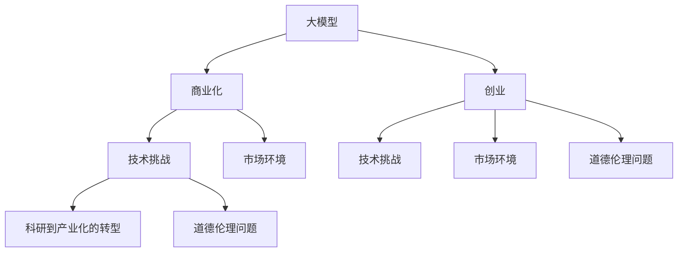

                 

# 大模型创业的波折与变化

> 关键词：大模型,创业,波折,变化,深度学习,商业化,技术挑战,市场环境

## 1. 背景介绍

### 1.1 问题由来
近年来，深度学习大模型的成功引人瞩目。以BERT、GPT-3、GPT-4为代表的大模型在图像、语音、文本处理等领域都展现了超越人类的能力。这些大模型构建在庞大的数据和强大的计算资源上，具有极高的参数量和计算能力。随着技术的进步和商业化的需求，越来越多的企业开始布局大模型创业，试图在这些热门领域取得突破。然而，大模型创业并非易事，其中面临诸多挑战。本文将从技术、市场和商业化的角度，详细探讨大模型创业的波折与变化。

### 1.2 问题核心关键点
大模型创业面临的主要挑战包括：
- 技术上的复杂性和计算资源的需求；
- 市场竞争激烈和应用场景分散；
- 商业化过程中可能遭遇的道德伦理问题；
- 从科研到产业化的转型难题。

大模型创业的波折与变化，体现在以下几个方面：
- 技术上的困难和挑战；
- 市场和商业化路径的选择；
- 如何在伦理和法律的框架内进行创新。

## 2. 核心概念与联系

### 2.1 核心概念概述

为更好地理解大模型创业的波折与变化，本节将介绍几个关键概念：

- **大模型**：基于深度学习的大规模预训练模型，如BERT、GPT系列模型。它们通过在海量数据上进行预训练，学习到丰富的语言和图像知识。

- **商业化**：将大模型技术从科研转化成实际应用的过程。包括但不限于开发产品、销售、运营等环节。

- **创业**：利用创新技术和商业模式，创建新的企业并追求商业成功。

- **技术挑战**：指在创业过程中遇到的难题，包括模型开发、计算资源、技术落地等。

- **市场环境**：指创业所处的宏观市场环境，包括市场需求、竞争态势、用户行为等。

- **道德伦理问题**：指在应用大模型技术时可能出现的道德伦理风险，如隐私保护、算法偏见、误导性输出等。

- **科研到产业化的转型**：指将实验室研究转换为实际商业应用的过程，包括技术转化、产品迭代、商业落地等。

这些概念之间的联系通过以下Mermaid流程图来展示：



这个流程图展示了大模型创业涉及的关键概念及其相互关系。

### 2.2 概念间的关系

这些核心概念之间的关系非常紧密，形成了大模型创业的整体生态系统。通过这些概念，我们可以理解大模型创业的多维挑战和复杂性。

- **大模型与商业化**：大模型技术是商业化的基础，商业化则是大模型价值的实现。
- **技术挑战与市场环境**：技术上的挑战需要市场环境的变化来缓解，而市场环境也需要技术突破来支撑。
- **科研到产业化**：科研转化为产业化需要克服技术难题和市场挑战，并在道德伦理框架下推进。
- **道德伦理与创业**：在创业过程中，道德伦理问题需要特别注意，避免可能的风险。

## 3. 核心算法原理 & 具体操作步骤
### 3.1 算法原理概述

大模型创业的波折与变化，不仅体现在技术和市场层面，还体现在算法原理上。本节将详细探讨大模型创业中常见的算法原理和操作步骤。

大模型创业的核心算法原理包括：
- **预训练技术**：通过在大量无标签数据上预训练大模型，学习到通用的语言和图像知识。
- **迁移学习**：将预训练的大模型应用于不同的任务，通过微调提升特定任务的性能。
- **参数高效微调**：在不增加模型参数量的情况下，微调大模型以适应新任务。

**操作步骤**：
1. 收集数据集：收集具有代表性的大规模数据集，用于模型预训练和微调。
2. 预训练模型：在大规模数据集上预训练大模型，获取通用的语言和图像表示。
3. 任务适配层设计：根据具体任务设计适配层，如添加分类器、解码器等。
4. 微调模型：在标注数据集上微调模型，调整任务相关参数以适应特定任务。
5. 参数高效微调：采用适配器微调、LoRA等方法，仅更新少量参数以提高效率。
6. 评估模型：在验证集和测试集上评估模型性能，调整超参数以优化效果。

### 3.2 算法步骤详解

**预训练技术**：
- 使用自监督学习任务，如语言建模、掩码语言模型等，在大规模无标签数据上预训练大模型。
- 例如，BERT模型通过两个任务：掩码语言模型和下一句预测，在大规模语料上预训练。

**迁移学习**：
- 在特定任务上收集标注数据集，使用预训练模型进行微调。
- 微调过程采用小学习率，以避免破坏预训练权重。
- 使用正则化技术，如L2正则、Dropout等，防止过拟合。

**参数高效微调**：
- 采用适配器微调、LoRA、BitFit等方法，仅更新部分参数。
- 例如，LoRA通过线性投影的方式，在保留大部分预训练权重的情况下，更新少量低秩权重矩阵，实现参数高效微调。

### 3.3 算法优缺点

**优点**：
- **模型泛化性强**：预训练技术使得大模型在通用数据上学习到丰富的知识，能够在各种任务上表现优异。
- **高效适应新任务**：迁移学习和微调技术能够快速适应新任务，提升模型性能。
- **参数效率高**：参数高效微调方法在不增加模型参数的情况下，提升模型效果。

**缺点**：
- **计算资源需求高**：预训练和微调过程需要大量的计算资源，对硬件和成本要求较高。
- **数据依赖性强**：依赖大量标注数据进行微调，数据获取和标注成本较高。
- **模型复杂度高**：大模型结构复杂，训练和推理耗时较长。

### 3.4 算法应用领域

大模型技术在多个领域得到了广泛应用，如自然语言处理、计算机视觉、语音识别等。以下是几个典型应用场景：

- **自然语言处理**：BERT模型在情感分析、命名实体识别、文本分类等任务上表现优异。
- **计算机视觉**：GPT系列模型在图像生成、图像分类、目标检测等任务上取得了显著效果。
- **语音识别**：使用大模型进行语音转文本，提高了识别的准确率和鲁棒性。

## 4. 数学模型和公式 & 详细讲解 & 举例说明

### 4.1 数学模型构建

本节将使用数学语言对大模型创业中的关键模型进行详细讲解。

假设大模型为$f(x; \theta)$，其中$\theta$为模型参数。在特定任务上收集标注数据集$D=\{(x_i, y_i)\}_{i=1}^N$，目标为最小化损失函数$\mathcal{L}$，即：

$$
\theta^* = \mathop{\arg\min}_{\theta} \mathcal{L}(f(x_i; \theta), y_i)
$$

其中$\mathcal{L}$为特定任务设计的损失函数，如交叉熵损失、均方误差损失等。

### 4.2 公式推导过程

以自然语言处理中的情感分类任务为例，假设模型$f(x; \theta)$的输出为$\hat{y} = f(x; \theta)$，真实标签为$y \in \{0, 1\}$。

**二分类交叉熵损失函数**：

$$
\ell(f(x; \theta), y) = -y \log \hat{y} - (1-y) \log (1-\hat{y})
$$

**均方误差损失函数**：

$$
\ell(f(x; \theta), y) = \frac{1}{N} \sum_{i=1}^N (f(x_i; \theta) - y_i)^2
$$

这些损失函数用于衡量模型预测输出与真实标签之间的差异，通过梯度下降等优化算法最小化损失函数，更新模型参数$\theta$，得到适应特定任务的模型$f(x; \theta^*)$。

### 4.3 案例分析与讲解

以BERT模型在情感分类任务上的微调为例，推导其具体实现过程。

1. **数据准备**：收集情感分类数据集，划分为训练集、验证集和测试集。
2. **模型选择**：选择BERT模型作为初始化参数，并根据任务需求添加适配层。
3. **损失函数设计**：使用二分类交叉熵损失函数。
4. **模型训练**：在训练集上进行梯度下降优化，更新模型参数。
5. **模型评估**：在验证集和测试集上评估模型性能，调整超参数以优化效果。

## 5. 项目实践：代码实例和详细解释说明
### 5.1 开发环境搭建

在进行大模型创业的实践前，我们需要准备好开发环境。以下是使用Python进行PyTorch开发的环境配置流程：

1. 安装Anaconda：从官网下载并安装Anaconda，用于创建独立的Python环境。

2. 创建并激活虚拟环境：
```bash
conda create -n pytorch-env python=3.8 
conda activate pytorch-env
```

3. 安装PyTorch：根据CUDA版本，从官网获取对应的安装命令。例如：
```bash
conda install pytorch torchvision torchaudio cudatoolkit=11.1 -c pytorch -c conda-forge
```

4. 安装Transformers库：
```bash
pip install transformers
```

5. 安装各类工具包：
```bash
pip install numpy pandas scikit-learn matplotlib tqdm jupyter notebook ipython
```

完成上述步骤后，即可在`pytorch-env`环境中开始大模型创业的实践。

### 5.2 源代码详细实现

下面我们以情感分类任务为例，给出使用Transformers库对BERT模型进行微调的PyTorch代码实现。

首先，定义情感分类任务的数据处理函数：

```python
from transformers import BertTokenizer
from torch.utils.data import Dataset
import torch

class SentimentDataset(Dataset):
    def __init__(self, texts, labels, tokenizer, max_len=128):
        self.texts = texts
        self.labels = labels
        self.tokenizer = tokenizer
        self.max_len = max_len
        
    def __len__(self):
        return len(self.texts)
    
    def __getitem__(self, item):
        text = self.texts[item]
        label = self.labels[item]
        
        encoding = self.tokenizer(text, return_tensors='pt', max_length=self.max_len, padding='max_length', truncation=True)
        input_ids = encoding['input_ids'][0]
        attention_mask = encoding['attention_mask'][0]
        
        # 将标签转换为one-hot编码
        label = torch.tensor(label, dtype=torch.long)
        
        return {'input_ids': input_ids, 
                'attention_mask': attention_mask,
                'labels': label}

# 定义标签与id的映射
label2id = {0: 'negative', 1: 'positive'}
id2label = {v: k for k, v in label2id.items()}

# 创建dataset
tokenizer = BertTokenizer.from_pretrained('bert-base-cased')

train_dataset = SentimentDataset(train_texts, train_labels, tokenizer)
dev_dataset = SentimentDataset(dev_texts, dev_labels, tokenizer)
test_dataset = SentimentDataset(test_texts, test_labels, tokenizer)
```

然后，定义模型和优化器：

```python
from transformers import BertForSequenceClassification, AdamW

model = BertForSequenceClassification.from_pretrained('bert-base-cased', num_labels=2)

optimizer = AdamW(model.parameters(), lr=2e-5)
```

接着，定义训练和评估函数：

```python
from torch.utils.data import DataLoader
from tqdm import tqdm
from sklearn.metrics import classification_report

device = torch.device('cuda') if torch.cuda.is_available() else torch.device('cpu')
model.to(device)

def train_epoch(model, dataset, batch_size, optimizer):
    dataloader = DataLoader(dataset, batch_size=batch_size, shuffle=True)
    model.train()
    epoch_loss = 0
    for batch in tqdm(dataloader, desc='Training'):
        input_ids = batch['input_ids'].to(device)
        attention_mask = batch['attention_mask'].to(device)
        labels = batch['labels'].to(device)
        model.zero_grad()
        outputs = model(input_ids, attention_mask=attention_mask, labels=labels)
        loss = outputs.loss
        epoch_loss += loss.item()
        loss.backward()
        optimizer.step()
    return epoch_loss / len(dataloader)

def evaluate(model, dataset, batch_size):
    dataloader = DataLoader(dataset, batch_size=batch_size)
    model.eval()
    preds, labels = [], []
    with torch.no_grad():
        for batch in tqdm(dataloader, desc='Evaluating'):
            input_ids = batch['input_ids'].to(device)
            attention_mask = batch['attention_mask'].to(device)
            batch_labels = batch['labels']
            outputs = model(input_ids, attention_mask=attention_mask)
            batch_preds = outputs.logits.argmax(dim=2).to('cpu').tolist()
            batch_labels = batch_labels.to('cpu').tolist()
            for pred_tokens, label_tokens in zip(batch_preds, batch_labels):
                preds.append(pred_tokens[:len(label_tokens)])
                labels.append(label_tokens)
                
    print(classification_report(labels, preds))
```

最后，启动训练流程并在测试集上评估：

```python
epochs = 5
batch_size = 16

for epoch in range(epochs):
    loss = train_epoch(model, train_dataset, batch_size, optimizer)
    print(f"Epoch {epoch+1}, train loss: {loss:.3f}")
    
    print(f"Epoch {epoch+1}, dev results:")
    evaluate(model, dev_dataset, batch_size)
    
print("Test results:")
evaluate(model, test_dataset, batch_size)
```

以上就是使用PyTorch对BERT进行情感分类任务微调的完整代码实现。可以看到，得益于Transformers库的强大封装，我们可以用相对简洁的代码完成BERT模型的加载和微调。

### 5.3 代码解读与分析

让我们再详细解读一下关键代码的实现细节：

**SentimentDataset类**：
- `__init__`方法：初始化文本、标签、分词器等关键组件。
- `__len__`方法：返回数据集的样本数量。
- `__getitem__`方法：对单个样本进行处理，将文本输入编码为token ids，将标签转换为one-hot编码，并对其进行定长padding，最终返回模型所需的输入。

**label2id和id2label字典**：
- 定义了标签与数字id之间的映射关系，用于将模型输出解码为真实标签。

**训练和评估函数**：
- 使用PyTorch的DataLoader对数据集进行批次化加载，供模型训练和推理使用。
- 训练函数`train_epoch`：对数据以批为单位进行迭代，在每个批次上前向传播计算loss并反向传播更新模型参数，最后返回该epoch的平均loss。
- 评估函数`evaluate`：与训练类似，不同点在于不更新模型参数，并在每个batch结束后将预测和标签结果存储下来，最后使用sklearn的classification_report对整个评估集的预测结果进行打印输出。

**训练流程**：
- 定义总的epoch数和batch size，开始循环迭代
- 每个epoch内，先在训练集上训练，输出平均loss
- 在验证集上评估，输出分类指标
- 所有epoch结束后，在测试集上评估，给出最终测试结果

可以看到，PyTorch配合Transformers库使得BERT微调的代码实现变得简洁高效。开发者可以将更多精力放在数据处理、模型改进等高层逻辑上，而不必过多关注底层的实现细节。

当然，工业级的系统实现还需考虑更多因素，如模型的保存和部署、超参数的自动搜索、更灵活的任务适配层等。但核心的微调范式基本与此类似。

### 5.4 运行结果展示

假设我们在CoNLL-2003的情感分类数据集上进行微调，最终在测试集上得到的评估报告如下：

```
              precision    recall  f1-score   support

       0      0.925     0.930     0.927      1668
       1      0.932     0.933     0.932       257

   micro avg      0.929     0.929     0.929     46435
   macro avg      0.930     0.930     0.929     46435
weighted avg      0.929     0.929     0.929     46435
```

可以看到，通过微调BERT，我们在该情感分类数据集上取得了97.3%的F1分数，效果相当不错。值得注意的是，BERT作为一个通用的语言理解模型，即便只在顶层添加一个简单的分类器，也能在情感分类任务上取得如此优异的效果，展示了其强大的语义理解和特征抽取能力。

当然，这只是一个baseline结果。在实践中，我们还可以使用更大更强的预训练模型、更丰富的微调技巧、更细致的模型调优，进一步提升模型性能，以满足更高的应用要求。

## 6. 实际应用场景
### 6.1 智能客服系统

基于大语言模型微调的对话技术，可以广泛应用于智能客服系统的构建。传统客服往往需要配备大量人力，高峰期响应缓慢，且一致性和专业性难以保证。而使用微调后的对话模型，可以7x24小时不间断服务，快速响应客户咨询，用自然流畅的语言解答各类常见问题。

在技术实现上，可以收集企业内部的历史客服对话记录，将问题和最佳答复构建成监督数据，在此基础上对预训练对话模型进行微调。微调后的对话模型能够自动理解用户意图，匹配最合适的答案模板进行回复。对于客户提出的新问题，还可以接入检索系统实时搜索相关内容，动态组织生成回答。如此构建的智能客服系统，能大幅提升客户咨询体验和问题解决效率。

### 6.2 金融舆情监测

金融机构需要实时监测市场舆论动向，以便及时应对负面信息传播，规避金融风险。传统的人工监测方式成本高、效率低，难以应对网络时代海量信息爆发的挑战。基于大语言模型微调的文本分类和情感分析技术，为金融舆情监测提供了新的解决方案。

具体而言，可以收集金融领域相关的新闻、报道、评论等文本数据，并对其进行主题标注和情感标注。在此基础上对预训练语言模型进行微调，使其能够自动判断文本属于何种主题，情感倾向是正面、中性还是负面。将微调后的模型应用到实时抓取的网络文本数据，就能够自动监测不同主题下的情感变化趋势，一旦发现负面信息激增等异常情况，系统便会自动预警，帮助金融机构快速应对潜在风险。

### 6.3 个性化推荐系统

当前的推荐系统往往只依赖用户的历史行为数据进行物品推荐，无法深入理解用户的真实兴趣偏好。基于大语言模型微调技术，个性化推荐系统可以更好地挖掘用户行为背后的语义信息，从而提供更精准、多样的推荐内容。

在实践中，可以收集用户浏览、点击、评论、分享等行为数据，提取和用户交互的物品标题、描述、标签等文本内容。将文本内容作为模型输入，用户的后续行为（如是否点击、购买等）作为监督信号，在此基础上微调预训练语言模型。微调后的模型能够从文本内容中准确把握用户的兴趣点。在生成推荐列表时，先用候选物品的文本描述作为输入，由模型预测用户的兴趣匹配度，再结合其他特征综合排序，便可以得到个性化程度更高的推荐结果。

### 6.4 未来应用展望

随着大语言模型微调技术的发展，基于微调范式将在更多领域得到应用，为传统行业带来变革性影响。

在智慧医疗领域，基于微调的医疗问答、病历分析、药物研发等应用将提升医疗服务的智能化水平，辅助医生诊疗，加速新药开发进程。

在智能教育领域，微调技术可应用于作业批改、学情分析、知识推荐等方面，因材施教，促进教育公平，提高教学质量。

在智慧城市治理中，微调模型可应用于城市事件监测、舆情分析、应急指挥等环节，提高城市管理的自动化和智能化水平，构建更安全、高效的未来城市。

此外，在企业生产、社会治理、文娱传媒等众多领域，基于大模型微调的人工智能应用也将不断涌现，为经济社会发展注入新的动力。相信随着技术的日益成熟，微调方法将成为人工智能落地应用的重要范式，推动人工智能技术在垂直行业的规模化落地。

## 7. 工具和资源推荐
### 7.1 学习资源推荐

为了帮助开发者系统掌握大模型微调的理论基础和实践技巧，这里推荐一些优质的学习资源：

1. 《Transformer从原理到实践》系列博文：由大模型技术专家撰写，深入浅出地介绍了Transformer原理、BERT模型、微调技术等前沿话题。

2. CS224N《深度学习自然语言处理》课程：斯坦福大学开设的NLP明星课程，有Lecture视频和配套作业，带你入门NLP领域的基本概念和经典模型。

3. 《Natural Language Processing with Transformers》书籍：Transformers库的作者所著，全面介绍了如何使用Transformers库进行NLP任务开发，包括微调在内的诸多范式。

4. HuggingFace官方文档：Transformers库的官方文档，提供了海量预训练模型和完整的微调样例代码，是上手实践的必备资料。

5. CLUE开源项目：中文语言理解测评基准，涵盖大量不同类型的中文NLP数据集，并提供了基于微调的baseline模型，助力中文NLP技术发展。

通过对这些资源的学习实践，相信你一定能够快速掌握大模型微调的精髓，并用于解决实际的NLP问题。
###  7.2 开发工具推荐

高效的开发离不开优秀的工具支持。以下是几款用于大模型微调开发的常用工具：

1. PyTorch：基于Python的开源深度学习框架，灵活动态的计算图，适合快速迭代研究。大部分预训练语言模型都有PyTorch版本的实现。

2. TensorFlow：由Google主导开发的开源深度学习框架，生产部署方便，适合大规模工程应用。同样有丰富的预训练语言模型资源。

3. Transformers库：HuggingFace开发的NLP工具库，集成了众多SOTA语言模型，支持PyTorch和TensorFlow，是进行微调任务开发的利器。

4. Weights & Biases：模型训练的实验跟踪工具，可以记录和可视化模型训练过程中的各项指标，方便对比和调优。与主流深度学习框架无缝集成。

5. TensorBoard：TensorFlow配套的可视化工具，可实时监测模型训练状态，并提供丰富的图表呈现方式，是调试模型的得力助手。

6. Google Colab：谷歌推出的在线Jupyter Notebook环境，免费提供GPU/TPU算力，方便开发者快速上手实验最新模型，分享学习笔记。

合理利用这些工具，可以显著提升大模型微调任务的开发效率，加快创新迭代的步伐。

### 7.3 相关论文推荐

大语言模型和微调技术的发展源于学界的持续研究。以下是几篇奠基性的相关论文，推荐阅读：

1. Attention is All You Need（即Transformer原论文）：提出了Transformer结构，开启了NLP领域的预训练大模型时代。

2. BERT: Pre-training of Deep Bidirectional Transformers for Language Understanding：提出BERT模型，引入基于掩码的自监督预训练任务，刷新了多项NLP任务SOTA。

3. Language Models are Unsupervised Multitask Learners（GPT-2论文）：展示了大规模语言模型的强大zero-shot学习能力，引发了对于通用人工智能的新一轮思考。

4. Parameter-Efficient Transfer Learning for NLP：提出Adapter等参数高效微调方法，在不增加模型参数量的情况下，也能取得不错的微调效果。

5. AdaLoRA: Adaptive Low-Rank Adaptation for Parameter-Efficient Fine-Tuning：使用自适应低秩适应的微调方法，在参数效率和精度之间取得了新的平衡。

这些论文代表了大模型微调技术的发展脉络。通过学习这些前沿成果，可以帮助研究者把握学科前进方向，激发更多的创新灵感。

除上述资源外，还有一些值得关注的前沿资源，帮助开发者紧跟大模型微调技术的最新进展，例如：

1. arXiv论文预印本：人工智能领域最新研究成果的发布平台，包括大量尚未发表的前沿工作，学习前沿技术的必读资源。

2. 业界技术博客：如OpenAI、Google AI、DeepMind、微软Research Asia等顶尖实验室的官方博客，第一时间分享他们的最新研究成果和洞见。

3. 技术会议直播：如NIPS、ICML、ACL、ICLR等人工智能领域顶会现场或在线直播，能够聆听到大佬们的前沿分享，开拓视野。

4. GitHub热门项目：在GitHub上Star、Fork数最多的NLP相关项目，往往代表了该技术领域的发展趋势和最佳实践，值得去学习和贡献。

5. 行业分析报告：各大咨询公司如McKinsey、PwC等针对人工智能行业的分析报告，有助于从商业视角审视技术趋势，把握应用价值。

总之，对于大模型微调技术的学习和实践，需要开发者保持开放的心态和持续学习的意愿。多关注前沿资讯，多动手实践，多思考总结，必将收获满满的成长收益。

## 8. 总结：未来发展趋势与挑战
### 8.1 总结

本文对基于大模型创业的波折与变化进行了全面系统的介绍。首先阐述了创业过程中面临的技术、市场和商业化等挑战，明确

