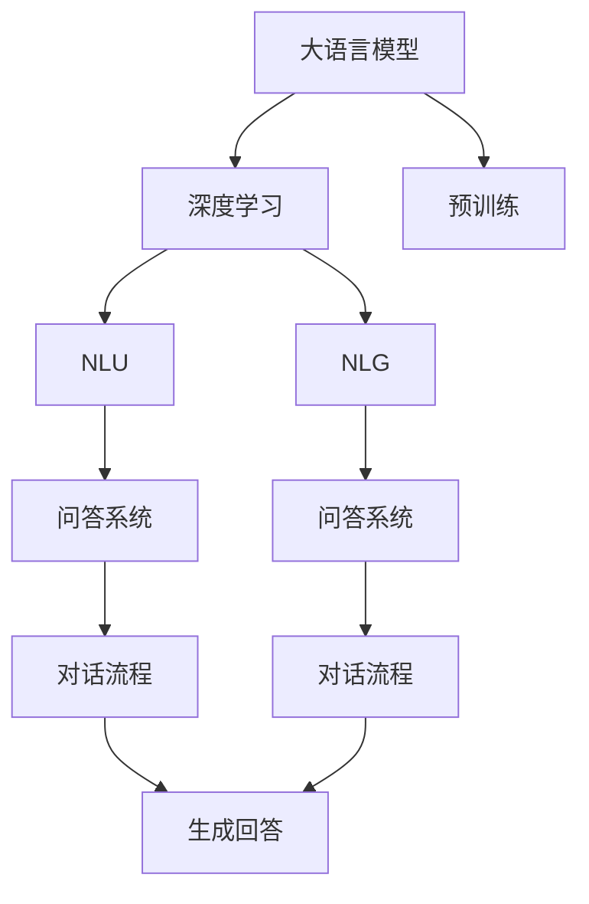
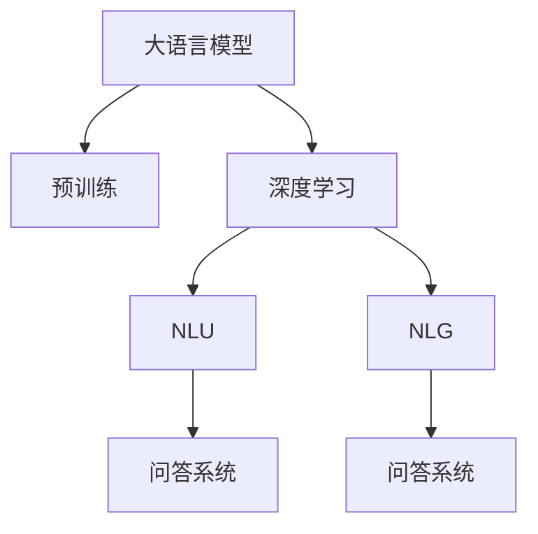
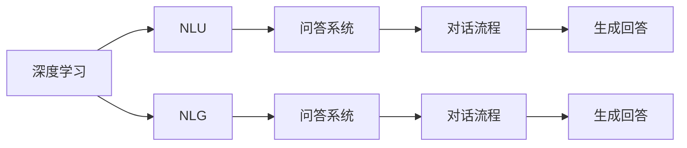
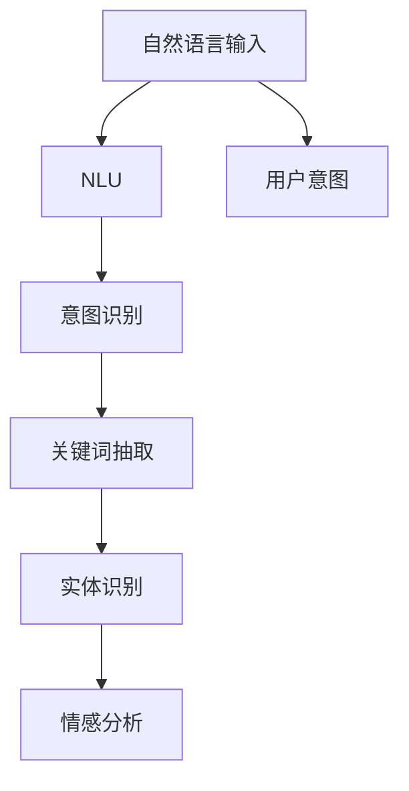
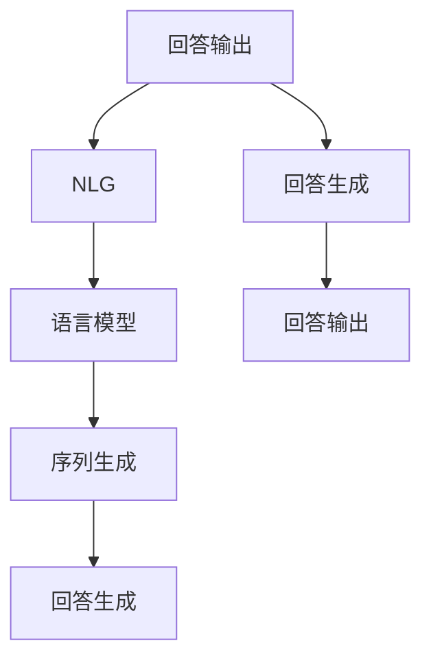
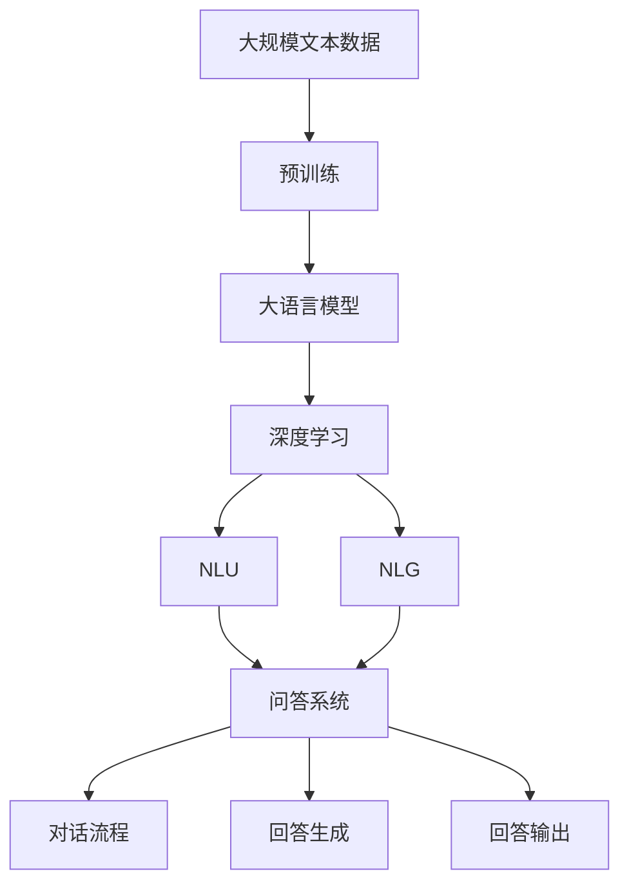

                 

# 大模型问答机器人基于深度学习技术

## 1. 背景介绍

### 1.1 问题由来

近年来，随着深度学习技术的快速发展，人工智能(AI)在各个领域的应用不断取得突破。尤其是自然语言处理(Natural Language Processing, NLP)领域，人工智能已经从简单的文本分类、情感分析任务，发展到能够理解语境、生成自然语言的回答，甚至能够进行复杂的对话交流。问答机器人作为NLP领域的一个重要应用，已经在客服、教育、医疗等多个行业中得到了广泛应用，极大地提高了工作效率和服务质量。

然而，尽管现有的问答机器人技术已经相对成熟，但在实际应用中仍然存在一些问题。首先，传统的问答系统往往需要大量的专家知识和人工编写规则，成本高、效率低，难以扩展。其次，传统的问答系统缺乏对用户意图和上下文语境的理解，响应质量难以保证。第三，传统的问答系统往往只能处理结构化问题，难以适应非结构化的自然语言输入。

因此，如何利用深度学习技术，开发更智能、更灵活、更易扩展的问答机器人，成为当前人工智能领域的重要研究课题。大模型问答机器人正是在这一背景下应运而生的，通过预训练的语言模型，结合深度学习技术，实现了基于自然语言理解(Natural Language Understanding, NLU)和生成(Natural Language Generation, NLG)的高质量问答系统。

### 1.2 问题核心关键点

大模型问答机器人通过深度学习技术，实现了对自然语言输入的全面理解和生成，其主要技术关键点包括：

- 大语言模型：通过在大规模无标签文本数据上进行预训练，学习到通用的语言表示和知识结构。
- 深度学习：结合深度神经网络模型，对输入的自然语言进行编码和解码，生成高质量的回答。
- 自然语言理解(NLU)：通过模型对自然语言输入进行语义分析和意图识别，理解用户意图。
- 自然语言生成(NLG)：通过模型生成自然语言的回答，满足用户的需求。

这些技术关键点相互作用，使得大模型问答机器人具备了强大的自然语言处理能力，能够在各种场景下提供高质量的问答服务。

## 2. 核心概念与联系

### 2.1 核心概念概述

为更好地理解大模型问答机器人技术，本节将介绍几个密切相关的核心概念：

- 大语言模型(Large Language Model, LLM)：以自回归(如GPT)或自编码(如BERT)模型为代表的大规模预训练语言模型。通过在大规模无标签文本语料上进行预训练，学习到通用的语言表示和知识结构。
- 深度学习(Deep Learning)：通过多层神经网络对输入数据进行编码和解码，实现复杂的模式识别和生成任务。
- 自然语言理解(NLU)：通过模型对自然语言输入进行语义分析和意图识别，理解用户意图。
- 自然语言生成(NLG)：通过模型生成自然语言的回答，满足用户的需求。
- 问答系统(QA System)：通过输入问题和答案，与用户进行对话交流的计算机系统。

这些核心概念之间的逻辑关系可以通过以下Mermaid流程图来展示：



这个流程图展示了大语言模型问答机器人的核心概念及其之间的关系：

1. 大语言模型通过预训练获得基础能力。
2. 深度学习结合大语言模型进行复杂任务的处理。
3. NLU和NLG分别从理解和生成两个角度处理自然语言输入和输出。
4. 问答系统通过NLU和NLG实现对话交互。

### 2.2 概念间的关系

这些核心概念之间存在着紧密的联系，形成了大语言模型问答机器人的完整生态系统。下面我通过几个Mermaid流程图来展示这些概念之间的关系。

#### 2.2.1 大语言模型的学习范式



这个流程图展示了大语言模型问答机器人的学习过程：

1. 大语言模型通过预训练获得基础能力。
2. 深度学习结合大语言模型进行复杂的NLU和NLG任务。
3. NLU和NLG分别处理自然语言输入和输出，从而实现问答系统的对话交互。

#### 2.2.2 深度学习与大语言模型结合



这个流程图展示了深度学习与大语言模型结合的机制：

1. 深度学习结合大语言模型进行NLU和NLG任务的编码和解码。
2. NLU和NLG分别处理自然语言输入和输出，实现问答系统的对话交互。
3. 问答系统通过NLU和NLG生成回答，与用户进行对话交流。

#### 2.2.3 自然语言理解(NLU)



这个流程图展示了自然语言理解的过程：

1. 自然语言输入通过NLU进行处理。
2. NLU对输入进行意图识别、关键词抽取、实体识别、情感分析等任务。
3. 意图识别和实体识别等任务可以辅助问答系统进行更精准的回答。

#### 2.2.4 自然语言生成(NLG)



这个流程图展示了自然语言生成的过程：

1. 回答输出通过NLG进行处理。
2. NLG利用语言模型进行序列生成，生成自然语言的回答。
3. 回答生成输出高质量的自然语言回答，满足用户的需求。

### 2.3 核心概念的整体架构

最后，我们用一个综合的流程图来展示这些核心概念在大语言模型问答机器人中的整体架构：



这个综合流程图展示了从预训练到问答系统的完整过程。大语言模型通过在大规模文本数据上进行预训练，学习到通用的语言表示和知识结构。深度学习结合大语言模型进行自然语言理解和生成，最终通过问答系统实现对话交互。

## 3. 核心算法原理 & 具体操作步骤
### 3.1 算法原理概述

大模型问答机器人基于深度学习技术，结合大语言模型和自然语言理解与生成技术，实现对自然语言输入的全面理解和生成。其核心算法原理如下：

1. **预训练大语言模型**：通过在大规模无标签文本数据上进行预训练，学习到通用的语言表示和知识结构。
2. **深度学习模型**：结合预训练大语言模型进行复杂的自然语言理解和生成任务。
3. **自然语言理解(NLU)**：通过深度学习模型对自然语言输入进行语义分析和意图识别，理解用户意图。
4. **自然语言生成(NLG)**：通过深度学习模型生成自然语言的回答，满足用户的需求。

这些核心算法原理相互作用，使得大模型问答机器人具备了强大的自然语言处理能力，能够在各种场景下提供高质量的问答服务。

### 3.2 算法步骤详解

大模型问答机器人的核心算法步骤包括：

1. **数据预处理**：将原始文本数据进行分词、清洗、归一化等处理，转化为模型可以处理的格式。
2. **预训练大语言模型**：在预训练数据上进行预训练，学习到通用的语言表示和知识结构。
3. **深度学习模型训练**：结合预训练大语言模型进行深度学习模型的训练，学习到复杂的自然语言理解和生成能力。
4. **自然语言理解(NLU)**：通过深度学习模型对自然语言输入进行语义分析和意图识别，理解用户意图。
5. **自然语言生成(NLG)**：通过深度学习模型生成自然语言的回答，满足用户的需求。
6. **问答系统对话流程**：将NLU和NLG输出融合，实现对话交互。

以下将详细介绍这些核心算法步骤。

#### 3.2.1 数据预处理

数据预处理是大模型问答机器人开发的关键步骤之一。预处理包括分词、清洗、归一化等操作，将原始文本数据转化为模型可以处理的格式。

- **分词**：将自然语言输入切分为单词或词组，以便模型进行处理。常用的分词工具包括jieba、spaCy等。
- **清洗**：去除无用字符、标点符号等，保留有效的输入内容。
- **归一化**：对分词和清洗后的文本进行统一处理，如将全角字符转换为半角字符，统一大小写等。

#### 3.2.2 预训练大语言模型

预训练大语言模型是大模型问答机器人的基础。预训练通过在大规模无标签文本数据上进行训练，学习到通用的语言表示和知识结构。

- **选择预训练模型**：选择合适的大语言模型，如GPT、BERT、T5等。
- **加载预训练模型**：使用预训练模型的预训练权重进行初始化。
- **微调**：结合问答系统的具体任务，对预训练模型进行微调，使其具备特定的问答能力。

#### 3.2.3 深度学习模型训练

深度学习模型结合大语言模型进行自然语言理解和生成任务。深度学习模型的训练步骤如下：

1. **模型选择**：选择适合问答系统的深度学习模型，如LSTM、GRU、Transformer等。
2. **数据集准备**：准备问答系统的训练数据集，通常包括问题和答案对。
3. **模型训练**：使用训练数据集对深度学习模型进行训练，学习到自然语言理解和生成能力。
4. **超参数调优**：调整模型超参数，如学习率、批大小、迭代轮数等，提高模型效果。

#### 3.2.4 自然语言理解(NLU)

自然语言理解(NLU)是大模型问答机器人的核心步骤之一。NLU通过对自然语言输入进行语义分析和意图识别，理解用户意图。NLU的训练步骤如下：

1. **模型选择**：选择适合NLU任务的深度学习模型，如BiLSTM、BERT等。
2. **数据集准备**：准备NLU任务的训练数据集，通常包括标注的意图和实体信息。
3. **模型训练**：使用训练数据集对NLU模型进行训练，学习到自然语言输入的语义分析和意图识别能力。
4. **评估与优化**：在测试数据集上评估模型性能，根据评估结果调整模型参数，优化模型效果。

#### 3.2.5 自然语言生成(NLG)

自然语言生成(NLG)是大模型问答机器人的核心步骤之一。NLG通过对自然语言输入进行语义分析和意图识别，生成自然语言的回答，满足用户的需求。NLG的训练步骤如下：

1. **模型选择**：选择适合NLG任务的深度学习模型，如RNN、Transformer等。
2. **数据集准备**：准备NLG任务的训练数据集，通常包括标注的回答。
3. **模型训练**：使用训练数据集对NLG模型进行训练，学习到自然语言生成的能力。
4. **评估与优化**：在测试数据集上评估模型性能，根据评估结果调整模型参数，优化模型效果。

#### 3.2.6 问答系统对话流程

问答系统对话流程是大模型问答机器人的最后一步。问答系统通过NLU和NLG的输出，实现对话交互。对话流程的实现步骤如下：

1. **输入处理**：将用户输入的自然语言进行分词、清洗、归一化等处理，转化为模型可以处理的格式。
2. **意图识别**：通过NLU模型对用户输入进行意图识别，理解用户意图。
3. **实体识别**：通过NLU模型对用户输入进行实体识别，识别输入中的关键信息。
4. **回答生成**：通过NLG模型生成自然语言的回答，满足用户的需求。
5. **回答输出**：将NLG生成的回答输出给用户，完成对话交互。

### 3.3 算法优缺点

大模型问答机器人结合深度学习技术，具备强大的自然语言处理能力，但其也存在一些局限性：

#### 3.3.1 优点

1. **高质量的问答服务**：通过深度学习和大语言模型，能够实现对自然语言输入的全面理解和生成，提供高质量的问答服务。
2. **灵活性高**：结合深度学习技术，能够处理各种类型的问答任务，适应性强。
3. **可扩展性**：通过微调，可以适应不同的问答场景，实现跨领域的应用。

#### 3.3.2 缺点

1. **高计算成本**：大语言模型和深度学习模型的训练和推理需要大量的计算资源，成本较高。
2. **模型复杂度大**：大语言模型和深度学习模型通常具有较高的复杂度，对算力和存储要求较高。
3. **数据依赖性强**：大模型问答机器人依赖高质量的标注数据进行训练，数据获取成本较高。

## 4. 数学模型和公式 & 详细讲解 & 举例说明

### 4.1 数学模型构建

大模型问答机器人涉及多种数学模型，主要包括深度学习模型和自然语言模型。以下将介绍这些模型的数学构建和推导。

#### 4.1.1 深度学习模型

深度学习模型结合大语言模型进行复杂的自然语言理解和生成任务。以Transformer为例，其数学模型构建如下：

1. **输入层**：将自然语言输入转化为向量形式，表示为$\mathbf{x} \in \mathbb{R}^{d_{in}}$。
2. **编码器**：通过Transformer层进行编码，得到中间表示$\mathbf{h} \in \mathbb{R}^{d_{mid}}$。
3. **解码器**：通过Transformer层进行解码，生成输出向量$\mathbf{y} \in \mathbb{R}^{d_{out}}$。

其中，$d_{in}$、$d_{mid}$、$d_{out}$为模型的输入、中间和输出维度。

#### 4.1.2 自然语言模型

自然语言模型通过对自然语言输入进行语义分析和意图识别，理解用户意图。以BiLSTM为例，其数学模型构建如下：

1. **输入层**：将自然语言输入转化为向量形式，表示为$\mathbf{x} \in \mathbb{R}^{d_{in}}$。
2. **LSTM层**：通过双向LSTM层进行编码，得到中间表示$\mathbf{h} \in \mathbb{R}^{d_{hidden}}$。
3. **输出层**：通过线性层进行分类，得到意图表示$\mathbf{y} \in \mathbb{R}^{n_{intents}}$，其中$n_{intents}$为意图类别数。

其中，$d_{in}$、$d_{hidden}$为模型的输入和隐藏维度，$n_{intents}$为意图类别数。

### 4.2 公式推导过程

以下是深度学习模型和自然语言模型的详细推导过程。

#### 4.2.1 深度学习模型

以Transformer为例，其模型的数学公式推导如下：

1. **输入层**：将自然语言输入转化为向量形式，表示为$\mathbf{x} \in \mathbb{R}^{d_{in}}$。
2. **编码器**：通过Transformer层进行编码，得到中间表示$\mathbf{h} \in \mathbb{R}^{d_{mid}}$。
3. **解码器**：通过Transformer层进行解码，生成输出向量$\mathbf{y} \in \mathbb{R}^{d_{out}}$。

其中，$d_{in}$、$d_{mid}$、$d_{out}$为模型的输入、中间和输出维度。

#### 4.2.2 自然语言模型

以BiLSTM为例，其模型的数学公式推导如下：

1. **输入层**：将自然语言输入转化为向量形式，表示为$\mathbf{x} \in \mathbb{R}^{d_{in}}$。
2. **LSTM层**：通过双向LSTM层进行编码，得到中间表示$\mathbf{h} \in \mathbb{R}^{d_{hidden}}$。
3. **输出层**：通过线性层进行分类，得到意图表示$\mathbf{y} \in \mathbb{R}^{n_{intents}}$，其中$n_{intents}$为意图类别数。

其中，$d_{in}$、$d_{hidden}$为模型的输入和隐藏维度，$n_{intents}$为意图类别数。

### 4.3 案例分析与讲解

#### 4.3.1 案例一：医疗问答机器人

医疗问答机器人需要处理复杂的自然语言输入，涉及医学专业术语和知识。以一个具体的医疗问答机器人案例为例，介绍深度学习模型的训练和推理过程。

1. **数据预处理**：将原始医学文本数据进行分词、清洗、归一化等处理，转化为模型可以处理的格式。
2. **预训练大语言模型**：选择BERT作为预训练大语言模型，在医学领域的大规模无标签文本数据上进行预训练。
3. **深度学习模型训练**：选择Transformer作为深度学习模型，结合医学领域的问答数据集进行训练。
4. **自然语言理解(NLU)**：通过BiLSTM模型对自然语言输入进行语义分析和意图识别，理解用户意图。
5. **自然语言生成(NLG)**：通过LSTM模型生成自然语言的回答，满足用户的需求。
6. **问答系统对话流程**：将NLU和NLG的输出融合，实现对话交互。

#### 4.3.2 案例二：智能客服机器人

智能客服机器人需要处理大量的用户咨询，涉及多种类型的问答任务。以一个具体的智能客服机器人案例为例，介绍深度学习模型的训练和推理过程。

1. **数据预处理**：将原始客服咨询数据进行分词、清洗、归一化等处理，转化为模型可以处理的格式。
2. **预训练大语言模型**：选择GPT作为预训练大语言模型，在大规模无标签文本数据上进行预训练。
3. **深度学习模型训练**：选择Transformer作为深度学习模型，结合客服咨询的数据集进行训练。
4. **自然语言理解(NLU)**：通过BiLSTM模型对自然语言输入进行语义分析和意图识别，理解用户意图。
5. **自然语言生成(NLG)**：通过LSTM模型生成自然语言的回答，满足用户的需求。
6. **问答系统对话流程**：将NLU和NLG的输出融合，实现对话交互。

## 5. 项目实践：代码实例和详细解释说明

### 5.1 开发环境搭建

在进行大模型问答机器人开发前，我们需要准备好开发环境。以下是使用Python进行PyTorch开发的环境配置流程：

1. 安装Anaconda：从官网下载并安装Anaconda，用于创建独立的Python环境。

2. 创建并激活虚拟环境：
```bash
conda create -n pytorch-env python=3.8 
conda activate pytorch-env
```

3. 安装PyTorch：根据CUDA版本，从官网获取对应的安装命令。例如：
```bash
conda install pytorch torchvision torchaudio cudatoolkit=11.1 -c pytorch -c conda-forge
```

4. 安装Transformers库：
```bash
pip install transformers
```

5. 安装各类工具包：
```bash
pip install numpy pandas scikit-learn matplotlib tqdm jupyter notebook ipython
```

完成上述步骤后，即可在`pytorch-env`环境中开始大模型问答机器人的开发。

### 5.2 源代码详细实现

下面我们以医疗问答机器人为例，给出使用Transformers库进行BERT模型微调的PyTorch代码实现。

首先，定义问答系统的数据处理函数：

```python
from transformers import BertTokenizer
from torch.utils.data import Dataset
import torch

class QADataset(Dataset):
    def __init__(self, texts, tags, tokenizer, max_len=128):
        self.texts = texts
        self.tags = tags
        self.tokenizer = tokenizer
        self.max_len = max_len
        
    def __len__(self):
        return len(self.texts)
    
    def __getitem__(self, item):
        text = self.texts[item]
        tags = self.tags[item]
        
        encoding = self.tokenizer(text, return_tensors='pt', max_length=self.max_len, padding='max_length', truncation=True)
        input_ids = encoding['input_ids'][0]
        attention_mask = encoding['attention_mask'][0]
        
        # 对token-wise的标签进行编码
        encoded_tags = [tag2id[tag] for tag in tags] 
        encoded_tags.extend([tag2id['O']] * (self.max_len - len(encoded_tags)))
        labels = torch.tensor(encoded_tags, dtype=torch.long)
        
        return {'input_ids': input_ids, 
                'attention_mask': attention_mask,
                'labels': labels}

# 标签与id的映射
tag2id = {'O': 0, 'B-MEDICINE': 1, 'I-MEDICINE': 2, 'B-DRUG': 3, 'I-DRUG': 4, 'B-DISEASE': 5, 'I-DISEASE': 6}
id2tag = {v: k for k, v in tag2id.items()}

# 创建dataset
tokenizer = BertTokenizer.from_pretrained('bert-base-cased')

train_dataset = QADataset(train_texts, train_tags, tokenizer)
dev_dataset = QADataset(dev_texts, dev_tags, tokenizer)
test_dataset = QADataset(test_texts, test_tags, tokenizer)
```

然后，定义模型和优化器：

```python
from transformers import BertForTokenClassification, AdamW

model = BertForTokenClassification.from_pretrained('bert-base-cased', num_labels=len(tag2id))

optimizer = AdamW(model.parameters(), lr=2e-5)
```

接着，定义训练和评估函数：

```python
from torch.utils.data import DataLoader
from tqdm import tqdm
from sklearn.metrics import classification_report

device = torch.device('cuda') if torch.cuda.is_available() else torch.device('cpu')
model.to(device)

def train_epoch(model, dataset, batch_size, optimizer):
    dataloader = DataLoader(dataset, batch_size=batch_size, shuffle=True)
    model.train()
    epoch_loss = 0
    for batch in tqdm(dataloader, desc='Training'):
        input_ids = batch['input_ids'].to(device)
        attention_mask = batch['attention_mask'].to(device)
        labels = batch['labels'].to(device)
        model.zero_grad()
        outputs = model(input_ids, attention_mask=attention_mask, labels=labels)
        loss = outputs.loss
        epoch_loss += loss.item()
        loss.backward()
        optimizer.step()
    return epoch_loss / len(dataloader)

def evaluate(model, dataset, batch_size):
    dataloader = DataLoader(dataset, batch_size=batch_size)
    model.eval()
    preds, labels = [], []
    with torch.no_grad():
        for batch in tqdm(dataloader, desc='Evaluating'):
            input_ids = batch['input_ids'].to(device)
            attention_mask = batch['attention_mask'].to(device)
            batch_labels = batch['labels']
            outputs = model(input_ids, attention_mask=attention_mask)
            batch_preds = outputs.logits.argmax(dim=2).to('cpu').tolist()
            batch_labels = batch_labels.to('cpu').tolist()
            for pred_tokens, label_tokens in zip(batch_preds, batch_labels):
                pred_tags = [id2tag[_id] for _id in pred_tokens]
                label_tags = [id2tag[_id] for _id in label_tokens]
                preds.append(pred_tags[:len(label_tokens)])
                labels.append(label_tags)
                
    print(classification_report(labels, preds))
```

最后，启动训练流程并在测试集上评估：

```python
epochs = 5
batch_size = 16

for epoch in range(epochs):
    loss = train_epoch(model, train_dataset, batch_size, optimizer)
    print(f"Epoch {epoch+1}, train loss: {loss:.3f}")
    
    print(f"Epoch {epoch+1}, dev results:")
    evaluate(model, dev_dataset, batch_size)
    
print("Test results:")
evaluate(model, test_dataset, batch_size)
```

以上就是使用PyTorch对BERT进行医疗问答机器人微调的完整代码实现。可以看到，得益于Transformers库的强大封装，我们可以用相对简洁的代码完成BERT模型的加载和微调。

### 5.3 代码解读与分析

让我们再详细解读一下关键代码的实现细节：

**QADataset类**：
- `__init__`方法：初始化文本、标签、分词器等关键组件。
- `__len__`方法：返回数据集的样本数量。
- `__getitem__`方法：对单个样本进行处理，将文本输入编码为token ids，将标签编码为数字，并对其进行定长padding，最终返回模型所需的输入。

**tag2id和id2tag字典

