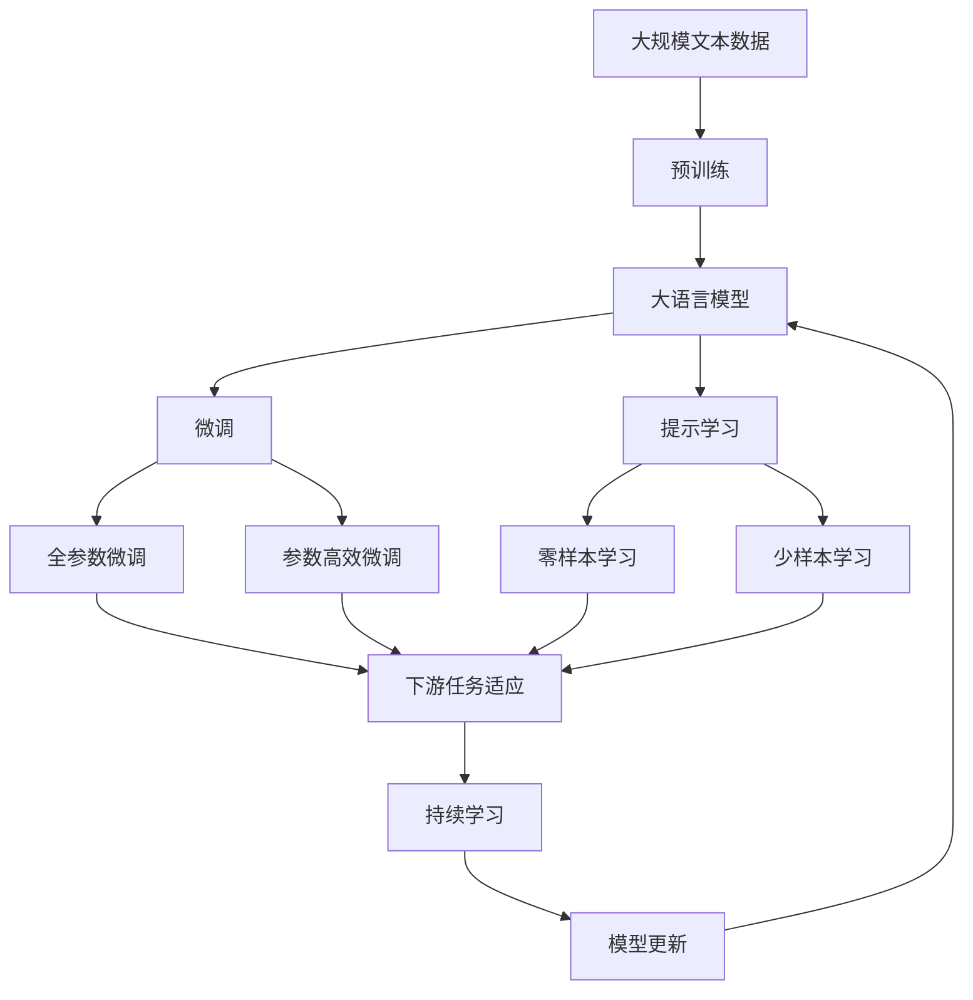
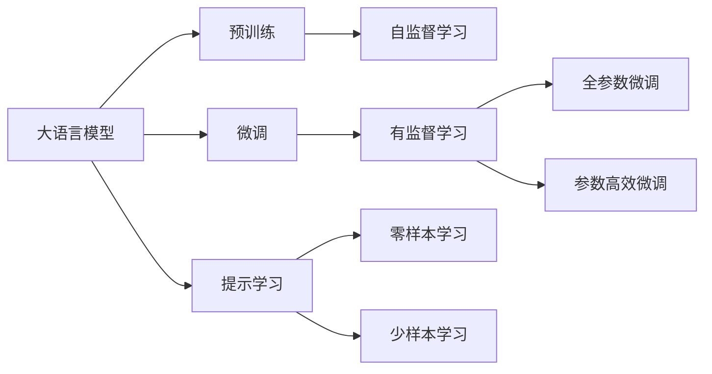
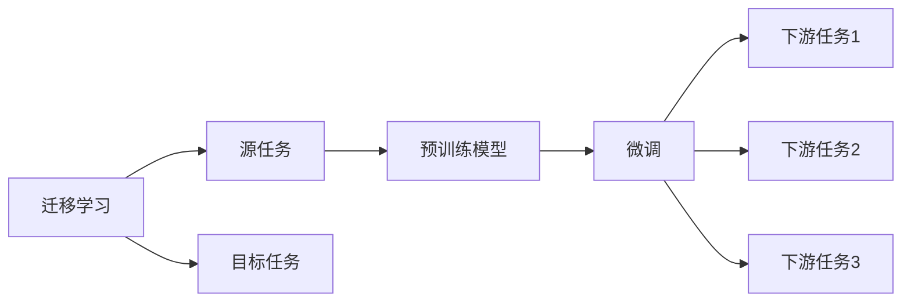
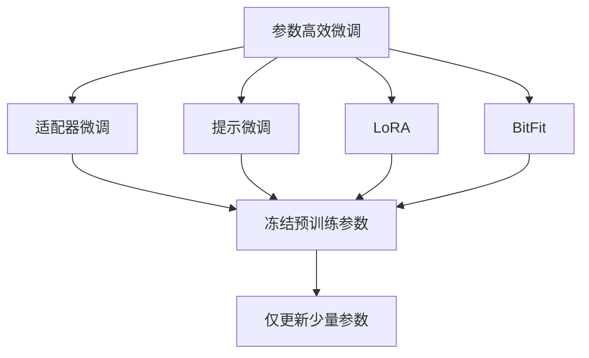
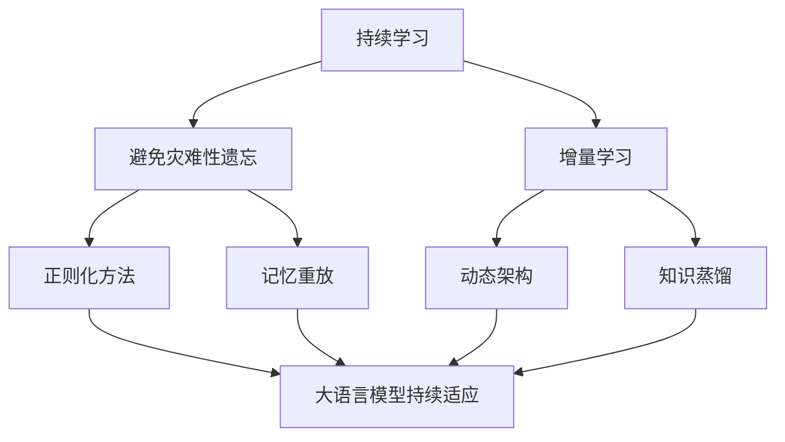

                 

# 大模型问答机器人的智能化水平

> 关键词：问答机器人, 自然语言处理, 深度学习, 预训练模型, 大语言模型, 微调, 对话系统

## 1. 背景介绍

### 1.1 问题由来
随着人工智能技术的发展，人工智能在各个领域的应用越来越广泛。其中，自然语言处理（Natural Language Processing, NLP）是人工智能的重要分支之一。问答系统（Question Answering, QA）作为NLP的一个重要方向，是实现人机交互的一种重要方式。问答系统能够通过理解和处理自然语言问题，自动回答用户提出的问题，从而提供自然、流畅的对话体验。

问答系统的发展经历了多个阶段，从早期的规则匹配系统，到基于知识库的系统，再到基于机器学习的系统。但这些系统通常依赖于规则或人工构建的知识库，存在扩展性差、维护成本高、知识库更新不及时等问题。因此，基于深度学习的问答系统逐渐成为主流。

深度学习技术的快速发展，使得基于预训练大语言模型的问答系统成为近年来NLP领域的最新趋势。这些大模型通过在大规模无标签文本数据上进行预训练，学习到了丰富的语言知识和常识，具备了强大的语言理解和生成能力，可以用于各种自然语言处理任务。基于大模型的问答系统具有以下优势：

- **智能度高**：大模型能够理解复杂的语义关系，自动学习和提取知识，无需人工干预。
- **可扩展性强**：大模型可以轻松应用于各种问答场景，无需针对特定任务重新设计算法。
- **泛化能力强**：大模型可以从大量的无标签文本数据中学习到通用的语言表示，具有较强的泛化能力。
- **实时性高**：大模型通常部署在云端，可以快速响应查询请求，提供实时对话体验。

### 1.2 问题核心关键点
基于大语言模型的问答系统，其核心思想是将预训练的大语言模型作为初始化参数，通过微调（Fine-Tuning）来适应特定问答任务的语料数据，从而提升模型在特定任务上的性能。微调的过程可以分为以下几个步骤：

1. **数据准备**：收集问答任务的训练数据，包括问题-答案对和相关上下文。
2. **模型加载**：加载预训练的大语言模型，如BERT、GPT等，作为微调的基础。
3. **任务适配**：根据问答任务的特点，添加任务特定的适配层，如分类器、解码器等。
4. **微调训练**：在问答数据的训练集上，使用有监督学习的方式进行微调，优化模型在特定任务上的性能。
5. **模型评估**：在问答数据的验证集和测试集上，评估微调后模型的性能。
6. **模型部署**：将微调后的模型部署到实际的应用场景中，提供问答服务。

通过微调，大语言模型能够在问答任务上取得优异的表现，支持丰富的问答场景，如智能客服、智能教育、金融咨询等。微调方法的使用，可以显著提升问答系统的智能化水平和用户体验。

### 1.3 问题研究意义
问答系统的智能化水平，是衡量人工智能技术成熟度的重要指标之一。基于大语言模型的微调方法，在问答系统的智能化水平提升方面具有重要的研究意义：

- **降低开发成本**：基于大模型的微调方法可以大幅减少问答系统的开发和维护成本，提升系统的效率和可扩展性。
- **提升系统性能**：通过微调，大语言模型可以更好地适应特定问答任务，提供更高精度的回答，提升用户体验。
- **支持新任务应用**：基于大模型的问答系统可以轻松扩展到各种新的问答场景，支持多样化的问题类型和回答格式。
- **促进技术落地**：基于大模型的问答系统具有较高的实用性，易于在实际应用中推广和落地，为人工智能技术在各行业的应用提供支持。
- **带来技术创新**：微调方法在问答系统中的应用，催生了新的研究方向和算法，如提示学习、少样本学习等，推动了NLP技术的发展。

## 2. 核心概念与联系

### 2.1 核心概念概述

为了更好地理解基于大语言模型的问答系统的微调方法，本节将介绍几个密切相关的核心概念：

- **大语言模型（Large Language Model, LLM）**：以自回归（如GPT）或自编码（如BERT）模型为代表的大规模预训练语言模型。通过在大规模无标签文本语料上进行预训练，学习到了丰富的语言知识和常识，具备强大的语言理解和生成能力。
- **预训练（Pre-training）**：指在大规模无标签文本语料上，通过自监督学习任务训练通用语言模型的过程。常见的预训练任务包括言语建模、遮挡语言模型等。预训练使得模型学习到语言的通用表示。
- **微调（Fine-tuning）**：指在预训练模型的基础上，使用下游任务的少量标注数据，通过有监督学习优化模型在特定任务上的性能。通常只需要调整顶层分类器或解码器，并以较小的学习率更新全部或部分的模型参数。
- **迁移学习（Transfer Learning）**：指将一个领域学习到的知识，迁移应用到另一个不同但相关的领域的学习范式。大模型的预训练-微调过程即是一种典型的迁移学习方式。
- **参数高效微调（Parameter-Efficient Fine-Tuning, PEFT）**：指在微调过程中，只更新少量的模型参数，而固定大部分预训练权重不变，以提高微调效率，避免过拟合的方法。
- **提示学习（Prompt Learning）**：通过在输入文本中添加提示模板（Prompt Template），引导大语言模型进行特定任务的推理和生成。可以在不更新模型参数的情况下，实现零样本或少样本学习。
- **少样本学习（Few-shot Learning）**：指在只有少量标注样本的情况下，模型能够快速适应新任务的学习方法。在大语言模型中，通常通过在输入中提供少量示例来实现，无需更新模型参数。
- **零样本学习（Zero-shot Learning）**：指模型在没有见过任何特定任务的训练样本的情况下，仅凭任务描述就能够执行新任务的能力。大语言模型通过预训练获得的广泛知识，使其能够理解任务指令并生成相应输出。
- **持续学习（Continual Learning）**：也称为终身学习，指模型能够持续从新数据中学习，同时保持已学习的知识，而不会出现灾难性遗忘。这对于保持大语言模型的时效性和适应性至关重要。

这些核心概念之间的逻辑关系可以通过以下Mermaid流程图来展示：



这个流程图展示了大语言模型的核心概念及其之间的关系：

1. 大语言模型通过预训练获得基础能力。
2. 微调是对预训练模型进行任务特定的优化，可以分为全参数微调和参数高效微调（PEFT）。
3. 提示学习是一种不更新模型参数的方法，可以实现零样本和少样本学习。
4. 迁移学习是连接预训练模型与下游任务的桥梁，可以通过微调或提示学习来实现。
5. 持续学习旨在使模型能够不断学习新知识，同时避免遗忘旧知识。

这些概念共同构成了大语言模型的学习和应用框架，使其能够在各种场景下发挥强大的语言理解和生成能力。通过理解这些核心概念，我们可以更好地把握大语言模型微调过程中各个环节的逻辑和作用。

### 2.2 概念间的关系

这些核心概念之间存在着紧密的联系，形成了大语言模型微调的完整生态系统。下面我通过几个Mermaid流程图来展示这些概念之间的关系。

#### 2.2.1 大语言模型的学习范式



这个流程图展示了大语言模型的三种主要学习范式：预训练、微调和提示学习。预训练主要采用自监督学习方法，而微调则是有监督学习的过程。提示学习可以实现零样本和少样本学习，可以在不更新模型参数的情况下，实现更灵活的应用。

#### 2.2.2 迁移学习与微调的关系



这个流程图展示了迁移学习的基本原理，以及它与微调的关系。迁移学习涉及源任务和目标任务，预训练模型在源任务上学习，然后通过微调适应各种下游任务（目标任务）。

#### 2.2.3 参数高效微调方法



这个流程图展示了几种常见的参数高效微调方法，包括适配器微调、提示微调、LoRA和BitFit。这些方法的共同特点是冻结大部分预训练参数，只更新少量参数，从而提高微调效率。

#### 2.2.4 持续学习在大语言模型中的应用



这个流程图展示了持续学习在大语言模型中的应用。持续学习的主要目标是避免灾难性遗忘和实现增量学习。通过正则化方法、记忆重放、动态架构和知识蒸馏等技术，可以使大语言模型持续适应新的任务和数据。

### 2.3 核心概念的整体架构

最后，我们用一个综合的流程图来展示这些核心概念在大语言模型微调过程中的整体架构：


这个综合流程图展示了从预训练到微调，再到持续学习的完整过程。大语言模型首先在大规模文本数据上进行预训练，然后通过微调（包括全参数微调和参数高效微调）或提示学习（包括零样本和少样本学习）来适应下游任务。最后，通过持续学习技术，模型可以不断更新和适应新的任务和数据。 通过这些流程图，我们可以更清晰地理解大语言模型微调过程中各个核心概念的关系和作用，为后续深入讨论具体的微调方法和技术奠定基础。

## 3. 核心算法原理 & 具体操作步骤
### 3.1 算法原理概述

基于大语言模型的问答系统的微调方法，本质上是一个有监督的细粒度迁移学习过程。其核心思想是：将预训练的大语言模型视作一个强大的"特征提取器"，通过在下游任务的少量标注数据上进行有监督的训练来优化模型在该任务上的性能。

形式化地，假设预训练模型为 $M_{\theta}$，其中 $\theta$ 为预训练得到的模型参数。给定问答任务 $T$ 的标注数据集 $D=\{(x_i, y_i)\}_{i=1}^N$，微调的目标是找到新的模型参数 $\hat{\theta}$，使得：

$$
\hat{\theta}=\mathop{\arg\min}_{\theta} \mathcal{L}(M_{\theta},D)
$$

其中 $\mathcal{L}$ 为针对任务 $T$ 设计的损失函数，用于衡量模型预测输出与真实标签之间的差异。常见的损失函数包括交叉熵损失、均方误差损失等。

通过梯度下降等优化算法，微调过程不断更新模型参数 $\theta$，最小化损失函数 $\mathcal{L}$，使得模型输出逼近真实标签。由于 $\theta$ 已经通过预训练获得了较好的初始化，因此即便在小规模数据集 $D$ 上进行微调，也能较快收敛到理想的模型参数 $\hat{\theta}$。

### 3.2 算法步骤详解

基于大语言模型的问答系统的微调一般包括以下几个关键步骤：

**Step 1: 准备预训练模型和数据集**
- 选择合适的预训练语言模型 $M_{\theta}$ 作为初始化参数，如 BERT、GPT等。
- 准备问答任务 $T$ 的标注数据集 $D$，划分为训练集、验证集和测试集。一般要求标注数据与预训练数据的分布不要差异过大。

**Step 2: 添加任务适配层**
- 根据问答任务类型，在预训练模型顶层设计合适的输出层和损失函数。
- 对于分类任务，通常在顶层添加线性分类器和交叉熵损失函数。
- 对于生成任务，通常使用语言模型的解码器输出概率分布，并以负对数似然为损失函数。

**Step 3: 设置微调超参数**
- 选择合适的优化算法及其参数，如 AdamW、SGD 等，设置学习率、批大小、迭代轮数等。
- 设置正则化技术及强度，包括权重衰减、Dropout、Early Stopping 等。
- 确定冻结预训练参数的策略，如仅微调顶层，或全部参数都参与微调。

**Step 4: 执行梯度训练**
- 将训练集数据分批次输入模型，前向传播计算损失函数。
- 反向传播计算参数梯度，根据设定的优化算法和学习率更新模型参数。
- 周期性在验证集上评估模型性能，根据性能指标决定是否触发 Early Stopping。
- 重复上述步骤直到满足预设的迭代轮数或 Early Stopping 条件。

**Step 5: 测试和部署**
- 在测试集上评估微调后模型 $M_{\hat{\theta}}$ 的性能，对比微调前后的精度提升。
- 使用微调后的模型对新样本进行推理预测，集成到实际的应用系统中。
- 持续收集新的数据，定期重新微调模型，以适应数据分布的变化。

以上是基于大语言模型的问答系统的微调的一般流程。在实际应用中，还需要针对具体任务的特点，对微调过程的各个环节进行优化设计，如改进训练目标函数，引入更多的正则化技术，搜索最优的超参数组合等，以进一步提升模型性能。

### 3.3 算法优缺点

基于大语言模型的问答系统的微调方法具有以下优点：

1. **简单高效**。只需准备少量标注数据，即可对预训练模型进行快速适配，获得较大的性能提升。
2. **通用适用**。适用于各种问答场景，包括知识问答、智能客服、智能教育等，设计简单的任务适配层即可实现微调。
3. **参数高效**。利用参数高效微调技术，在固定大部分预训练参数的情况下，仍可取得不错的提升。
4. **效果显著**。在学术界和工业界的诸多问答任务上，基于微调的方法已经刷新了最先进的性能指标。

同时，该方法也存在一定的局限性：

1. **依赖标注数据**。微调的效果很大程度上取决于标注数据的质量和数量，获取高质量标注数据的成本较高。
2. **迁移能力有限**。当目标任务与预训练数据的分布差异较大时，微调的性能提升有限。
3. **负面效果传递**。预训练模型的固有偏见、有害信息等，可能通过微调传递到下游任务，造成负面影响。
4. **可解释性不足**。微调模型的决策过程通常缺乏可解释性，难以对其推理逻辑进行分析和调试。

尽管存在这些局限性，但就目前而言，基于大语言模型的微调方法仍是问答系统的最新主流范式。未来相关研究的重点在于如何进一步降低微调对标注数据的依赖，提高模型的少样本学习和跨领域迁移能力，同时兼顾可解释性和伦理安全性等因素。

### 3.4 算法应用领域

基于大语言模型的问答系统在多个领域得到广泛应用，如医疗咨询、金融咨询、智能客服、教育问答等。具体而言：

1. **医疗咨询**：通过微调问答模型，可以提供快速准确的医疗咨询，帮助患者解答常见健康问题，缓解医疗资源不足的现状。
2. **金融咨询**：微调后的问答模型可以回答金融领域相关问题，提供实时的投资建议，帮助用户做出更明智的投资决策。
3. **智能客服**：问答系统可以替代人工客服，处理用户查询，提升客户服务效率和满意度。
4. **教育问答**：教育领域的问答系统可以回答学生的各种学习问题，提供个性化学习建议，提升教育质量和效果。

除了这些经典应用外，问答系统还被创新性地应用于更多场景中，如智能家居、智能交通、智能旅游等，为各行各业提供了智能化的解决方案。

## 4. 数学模型和公式 & 详细讲解  
### 4.1 数学模型构建

本节将使用数学语言对基于大语言模型的问答系统的微调过程进行更加严格的刻画。

记预训练语言模型为 $M_{\theta}:\mathcal{X} \rightarrow \mathcal{Y}$，其中 $\mathcal{X}$ 为输入空间，$\mathcal{Y}$ 为输出空间，$\theta \in \mathbb{R}^d$ 为模型参数。假设问答任务的训练集为 $D=\{(x_i, y_i)\}_{i=1}^N, x_i \in \mathcal{X}, y_i \in \mathcal{Y}$。

定义模型 $M_{\theta}$ 在输入 $x$ 上的损失函数为 $\ell(M_{\theta}(x),y)$，则在数据集 $D$ 上的经验风险为：

$$
\mathcal{L}(\theta) = \frac{1}{N} \sum_{i=1}^N \ell(M_{\theta}(x_i),y_i)
$$

微调的优化目标是最小化经验风险，即找到最优参数：

$$
\theta^* = \mathop{\arg\min}_{\theta} \mathcal{L}(\theta)
$$

在实践中，我们通常使用基于梯度的优化算法（如SGD、Adam等）来近似求解上述最优化问题。设 $\eta$ 为学习率，$\lambda$ 为正则化系数，则参数的更新公式为：

$$
\theta \leftarrow \theta - \eta \nabla_{\theta}\mathcal{L}(\theta) - \eta\lambda\theta
$$

其中 $\nabla_{\theta}\mathcal{L}(\theta)$ 为损失函数对参数 $\theta$ 的梯度，可通过反向传播算法高效计算。

### 4.2 公式推导过程

以下我们以问答任务为例，推导交叉熵损失函数及其梯度的计算公式。

假设模型 $M_{\theta}$ 在输入 $x$ 上的输出为 $\hat{y}=M_{\theta}(x) \in [0,1]$，表示样本属于正类的概率。真实标签 $y \in \{0,1\}$。则二分类交叉熵损失函数定义为：

$$
\ell(M_{\theta}(x),y) = -[y\log \hat{y} + (1-y)\log (1-\hat{y})]
$$

将其代入经验风险公式，得：

$$
\mathcal{L}(\theta) = -\frac{1}{N}\sum_{i=1}^N [y_i\log M_{\theta}(x_i)+(1-y_i)\log(1-M_{\theta}(x_i))]
$$

根据链式法则，损失函数对参数 $\theta_k$ 的梯度为：

$$
\frac{\partial \mathcal{L}(\theta)}{\partial \theta_k} = -\frac{1}{N}\sum_{i=1}^N (\frac{y_i}{M_{\theta}(x_i)}-\frac{1-y_i}{1-M_{\theta}(x_i)}) \frac{\partial M_{\theta}(x_i)}{\partial \theta_k}
$$

其中 $\frac{\partial M_{\theta}(x_i)}{\partial \theta_k}$ 可进一步递归展开，利用自动微分技术完成计算。

在得到损失函数的梯度后，即可带入参数更新公式，完成模型的迭代优化。重复上述过程直至收敛，最终得到适应问答任务的最优模型参数 $\theta^*$。

## 5. 项目实践：代码实例和详细解释说明
### 5.1 开发环境搭建

在进行问答系统微调实践前，我们需要准备好开发环境。以下是使用Python进行PyTorch开发的环境配置流程：

1. 安装Anaconda：从官网下载并安装Anaconda，用于创建独立的Python环境。

2. 创建并激活虚拟环境：
```bash
conda create -n pytorch-env python=3.8 
conda activate pytorch-env
```

3. 安装PyTorch：根据CUDA版本，从官网获取对应的安装命令。例如：
```bash
conda install pytorch torchvision torchaudio cudatoolkit=11.1 -c pytorch -c conda-forge
```

4. 安装Transformers库：
```bash
pip install transformers
```

5. 安装各类工具包：
```bash
pip install numpy pandas scikit-learn matplotlib tqdm jupyter notebook ipython
```

完成上述步骤后，即可在`pytorch-env`环境中开始微调实践。

### 5.2 源代码详细实现

下面我们以问答任务为例，给出使用Transformers库对BERT模型进行微调的PyTorch代码实现。

首先，定义问答任务的数据处理函数：

```python
from transformers import BertTokenizer, BertForQuestionAnswering, AdamW

class QADataset(Dataset):
    def __init__(self, questions, contexts, answers, tokenizer, max_len=128):
        self.questions = questions
        self.contexts = contexts
        self.answers = answers
        self.tokenizer = tokenizer
        self.max_len = max_len
        
    def __len__(self):
        return len(self.questions)
    
    def __getitem__(self, item):
        question = self.questions[item]
        context = self.contexts[item]
        answer = self.answers[item]
        
        encoding = self.tokenizer(question, context, return_tensors='pt', max_length=self.max_len, padding='max_length', truncation=True)
        input_ids = encoding['input_ids']
        attention_mask = encoding['attention_mask']
        
        start_pos = self.tokenizer.convert_tokens_to_ids(answer['start'])
        end_pos = self.tokenizer.convert_tokens_to_ids(answer['end'])
        
        return {'input_ids': input_ids,
                'attention_mask': attention_mask,
                'start_pos': start_pos,
                'end_pos': end_pos}

# 创建dataset
tokenizer = BertTokenizer.from_pretrained('bert-base-cased')
train_dataset = QADataset(train_questions, train_contexts, train_answers, tokenizer)
dev_dataset = QADataset(dev_questions, dev_contexts, dev_answers, tokenizer)
test_dataset = QADataset(test_questions, test_contexts, test_answers, tokenizer)
```

然后，定义模型和优化器：

```python
model = BertForQuestionAnswering.from_pretrained('bert-base-cased', num_labels=2)

optimizer = AdamW(model.parameters(), lr=2e-5)
```

接着，定义训练和评估函数：

```python
from torch.utils.data import DataLoader
from tqdm import tqdm
from sklearn.metrics import accuracy_score

device = torch.device('cuda') if torch.cuda.is_available() else torch.device('cpu')
model.to(device)

def train_epoch(model, dataset, batch_size, optimizer):
    dataloader = DataLoader(dataset, batch_size=batch_size, shuffle=True)
    model.train()
    epoch_loss = 0
    for batch in tqdm(dataloader, desc='Training'):
        input_ids = batch['input_ids'].to(device)
        attention_mask = batch['attention_mask'].to(device)
        start_pos = batch['start_pos'].to(device)
        end_pos = batch['end_pos'].to(device)
        model.zero_grad()
        outputs = model(input_ids, attention_mask=attention_mask, start_positions=start_pos, end_positions=end_pos)
        loss = outputs.loss
        epoch_loss += loss.item()
        loss.backward()
        optimizer.step()
    return epoch_loss / len(dataloader)

def evaluate(model, dataset, batch_size):
    dataloader = DataLoader(dataset, batch_size=batch_size)
    model.eval()
    correct, total = 0, 0
    with torch.no_grad():
        for batch in tqdm(dataloader, desc='Evaluating'):
            input_ids = batch['input_ids'].to(device)
            attention_mask = batch['attention_mask'].to(device)
            start_pos = batch['start_pos'].to(device)
            end_pos = batch['end_pos'].to(device)
            outputs = model(input_ids, attention_mask=attention_mask, start_positions=start_pos, end_positions=end_pos)
            predicted_start_pos = torch.argmax(output

