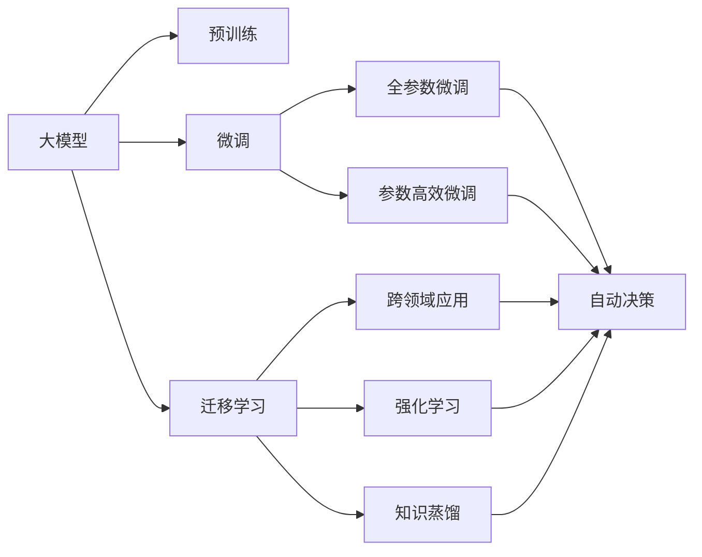

                 

# 大模型：未来商业的核心竞争力

> 关键词：大模型,商业应用,人工智能,深度学习,未来发展

## 1. 背景介绍

### 1.1 问题由来
随着深度学习技术的不断进步，大模型在各行各业的应用已经变得越来越普遍。它们基于大规模无标签数据进行预训练，具有强大的学习和泛化能力，能够理解复杂的语义和上下文信息。大模型在自然语言处理、计算机视觉、语音识别等领域都展现出了出色的性能，引领了新一轮的技术革命。

然而，尽管大模型具有巨大的潜力，但在商业应用中，它们仍然面临诸多挑战。如何有效地将大模型的能力转化为商业价值，成为了业界和学术界关注的焦点。本文将深入探讨大模型在商业应用中的核心竞争力，并提出相应的应用策略。

### 1.2 问题核心关键点
大模型在商业应用中的核心竞争力主要体现在以下几个方面：

- **数据驱动的决策**：大模型能够从海量数据中提取有价值的信息，支持企业做出更准确、更有数据支撑的商业决策。
- **自动化流程优化**：大模型能够自动化处理复杂任务，提高生产效率，降低人力成本。
- **个性化服务**：通过了解用户行为和偏好，大模型能够提供更加个性化的服务和产品，提升用户满意度。
- **跨领域应用**：大模型具备跨领域迁移能力，能够在不同场景中快速部署和应用，解决多维度的商业问题。
- **持续学习和适应**：大模型能够不断学习新知识，适应市场变化，保持竞争力。

这些核心竞争力使得大模型成为未来商业发展的关键工具，能够帮助企业获得显著的竞争优势。

### 1.3 问题研究意义
大模型在商业应用中的研究具有重要意义：

- **提升决策质量**：通过大规模数据训练的模型，能够提供更准确的预测和决策支持。
- **降低运营成本**：自动化处理复杂任务，减少人力投入，提高运营效率。
- **增强用户体验**：通过个性化推荐和智能客服等应用，提升用户满意度。
- **开拓新市场**：通过跨领域应用，进入新的商业领域，开拓新的增长点。
- **保持市场竞争力**：通过持续学习和适应，保持企业竞争优势，应对市场变化。

## 2. 核心概念与联系

### 2.1 核心概念概述

为更好地理解大模型在商业应用中的作用，本文将介绍几个关键概念：

- **大模型(Large Model)**：基于大规模无标签数据进行预训练的深度学习模型，如BERT、GPT等。
- **预训练(Pre-training)**：在无标签数据上进行自监督学习，学习通用语言和图像表示。
- **微调(Fine-tuning)**：在大模型上添加任务特定的损失函数，在有标签数据上进一步训练，适应特定任务。
- **迁移学习(Transfer Learning)**：利用预训练模型的知识，通过微调适应新任务。
- **知识蒸馏(Knowledge Distillation)**：将大模型的知识传递给小型模型，提升小型模型的性能。
- **对抗训练(Adversarial Training)**：通过引入对抗样本，提高模型的鲁棒性。
- **强化学习(Reinforcement Learning)**：利用奖励和惩罚机制，使模型在特定任务上不断优化。

这些概念之间存在着紧密的联系，构成了大模型在商业应用中的核心能力。

### 2.2 概念间的关系

以下通过几个Mermaid流程图来展示这些概念之间的关系：



这个流程图展示了大模型在商业应用中的核心概念及其之间的关系：

1. 大模型通过预训练获得基础能力。
2. 微调在大模型上添加任务特定的损失函数，进一步适应特定任务。
3. 迁移学习利用预训练模型的知识，通过微调适应新任务。
4. 全参数微调和参数高效微调都是微调的两种形式，分别全参数和部分参数更新。
5. 跨领域应用利用大模型的知识，在不同场景中快速部署和应用。
6. 强化学习和知识蒸馏都是提高模型性能的进阶方法。
7. 自动决策和大模型紧密结合，提供商业决策支持。

通过这些概念之间的关系，我们可以更好地理解大模型在商业应用中的工作原理和优化方向。

## 3. 核心算法原理 & 具体操作步骤

### 3.1 算法原理概述

大模型在商业应用中的核心算法原理主要基于以下两个方面：

1. **数据驱动决策**：通过在大规模数据上预训练，大模型能够学习到数据的深层特征和规律。这些特征和规律能够被用于支持企业做出更准确的商业决策。
2. **自动化流程优化**：利用大模型的自动化处理能力，能够优化企业的生产、运营等流程，提高效率，降低成本。

### 3.2 算法步骤详解

大模型在商业应用中的具体操作步骤如下：

**Step 1: 数据收集和预处理**

1. 收集企业相关的数据，如用户行为数据、交易数据、市场数据等。
2. 对数据进行清洗、去重、标注等预处理操作，确保数据的完整性和准确性。

**Step 2: 模型训练**

1. 使用大模型对数据进行预训练，学习通用的数据表示。
2. 在特定任务上添加任务特定的损失函数，对模型进行微调。
3. 使用强化学习、知识蒸馏等方法进一步优化模型性能。

**Step 3: 模型部署**

1. 将训练好的模型部署到相应的商业环境中。
2. 与企业业务系统进行集成，实现自动化流程优化和决策支持。

**Step 4: 持续优化**

1. 定期收集新的数据，重新训练和微调模型。
2. 通过A/B测试等方法评估模型性能，不断优化模型和应用效果。

### 3.3 算法优缺点

大模型在商业应用中的算法具有以下优点：

- **高效的自动化处理能力**：能够自动化处理复杂任务，提高效率，降低成本。
- **强大的数据处理能力**：能够处理海量数据，从中提取有价值的信息。
- **广泛的应用场景**：能够应用于不同的商业领域，解决多维度的商业问题。

同时，大模型在商业应用中也有一些缺点：

- **对数据依赖度高**：需要大量高质量的数据进行预训练和微调。
- **计算资源消耗大**：需要高性能的硬件设备和大量的计算资源。
- **模型复杂度高**：模型参数众多，训练和推理速度较慢。

### 3.4 算法应用领域

大模型在商业应用中广泛应用，涵盖了多个领域，包括但不限于：

1. **客户服务**：利用智能客服、情感分析等技术，提升客户满意度。
2. **市场营销**：通过用户行为分析、推荐系统等技术，提升销售转化率。
3. **供应链管理**：利用预测和优化算法，提高供应链效率，降低成本。
4. **金融风控**：通过信用评估、欺诈检测等技术，降低金融风险。
5. **医疗健康**：利用图像识别、语音识别等技术，提高医疗服务质量。

这些领域是大模型在商业应用中的典型应用场景，展示了其在不同领域中的强大能力。

## 4. 数学模型和公式 & 详细讲解 & 举例说明

### 4.1 数学模型构建

大模型在商业应用中的数学模型构建主要基于深度学习和机器学习理论。以下将对相关模型进行详细讲解。

**数据驱动决策模型**

假设企业有一组历史数据 $D=\{(x_i,y_i)\}_{i=1}^N$，其中 $x_i$ 为输入特征，$y_i$ 为输出标签。模型的目标是找到一个最优函数 $f(x)$，使得 $f(x)$ 能够准确预测 $y_i$。

可以使用最小二乘法构建线性回归模型：

$$
\hat{y} = \theta_0 + \theta_1 x_1 + \theta_2 x_2 + \cdots + \theta_p x_p
$$

其中 $\theta_0, \theta_1, \cdots, \theta_p$ 为模型参数，需要通过数据训练得到。

**自动化流程优化模型**

自动化流程优化通常使用强化学习算法，如Q-learning、策略梯度等。

假设企业有一组状态 $s$ 和行动 $a$，以及相应的奖励 $r$。目标是在不同的状态下，选择最优的行动，最大化长期奖励。

可以使用Q-learning算法：

$$
Q(s,a) \leftarrow Q(s,a) + \alpha[r + \gamma \max_{a'}Q(s',a')] - Q(s,a)
$$

其中 $\alpha$ 为学习率，$\gamma$ 为折扣因子。

### 4.2 公式推导过程

以下以用户行为分析为例，推导大模型在商业应用中的公式推导过程。

假设企业收集到用户行为数据 $D=\{(x_i,y_i)\}_{i=1}^N$，其中 $x_i$ 为用户行为特征，$y_i$ 为行为标签（如购买行为、流失行为等）。

使用线性回归模型对数据进行拟合：

$$
\hat{y} = \theta_0 + \theta_1 x_1 + \theta_2 x_2 + \cdots + \theta_p x_p
$$

模型的损失函数为：

$$
L = \frac{1}{N}\sum_{i=1}^N (y_i - \hat{y}_i)^2
$$

通过最小化损失函数，可以得到最优模型参数：

$$
\theta = \mathop{\arg\min}_{\theta} L
$$

在实际应用中，还可以使用L1正则化、L2正则化等方法，防止过拟合。

### 4.3 案例分析与讲解

以下以一个具体的案例来说明大模型在商业应用中的实际应用：

**案例：电商推荐系统**

电商推荐系统通过分析用户的历史购买行为和浏览数据，为用户推荐相关的商品，提升销售转化率。

步骤如下：

1. **数据收集和预处理**：收集用户的浏览记录、购买记录等数据，对数据进行清洗和标注。
2. **模型训练**：使用大模型进行预训练，学习通用的用户行为表示。在特定任务上添加点击率预测的损失函数，对模型进行微调。
3. **模型部署**：将训练好的模型部署到推荐系统中，实时生成商品推荐结果。
4. **持续优化**：定期收集新的数据，重新训练和微调模型，不断提升推荐效果。

通过这个案例，可以看到大模型在商业应用中的实际应用流程，以及其带来的商业价值。

## 5. 项目实践：代码实例和详细解释说明

### 5.1 开发环境搭建

在进行大模型在商业应用中的实践前，需要先准备好开发环境。以下是使用Python进行TensorFlow开发的环境配置流程：

1. 安装Anaconda：从官网下载并安装Anaconda，用于创建独立的Python环境。

2. 创建并激活虚拟环境：
```bash
conda create -n tensorflow-env python=3.8 
conda activate tensorflow-env
```

3. 安装TensorFlow：根据CUDA版本，从官网获取对应的安装命令。例如：
```bash
conda install tensorflow -c tensorflow -c conda-forge
```

4. 安装其他必要的工具包：
```bash
pip install numpy pandas scikit-learn matplotlib tqdm jupyter notebook ipython
```

完成上述步骤后，即可在`tensorflow-env`环境中开始开发实践。

### 5.2 源代码详细实现

以下以用户行为分析为例，给出使用TensorFlow进行大模型训练和微调的PyTorch代码实现。

首先，定义用户行为分析的数据处理函数：

```python
import tensorflow as tf
from tensorflow.keras.preprocessing.text import Tokenizer
from tensorflow.keras.preprocessing.sequence import pad_sequences
import numpy as np

class UserBehaviorDataset:
    def __init__(self, text_data, label_data, max_len=100):
        self.texts = text_data
        self.labels = label_data
        self.max_len = max_len
        
        self.tokenizer = Tokenizer()
        self.tokenizer.fit_on_texts(text_data)
        self.words2ids = self.tokenizer.word_index
        self.ids2words = {v: k for k, v in self.tokenizer.word_index.items()}
        self.texts = self.tokenizer.texts_to_sequences(text_data)
        self.texts = pad_sequences(self.texts, maxlen=max_len, padding='post', truncating='post')
        self.labels = np.array(label_data)
```

然后，定义模型和优化器：

```python
from tensorflow.keras.models import Sequential
from tensorflow.keras.layers import Dense, Embedding, Dropout, Flatten

model = Sequential()
model.add(Embedding(len(self.words2ids)+1, 100, input_length=max_len))
model.add(Dropout(0.2))
model.add(Flatten())
model.add(Dense(64, activation='relu'))
model.add(Dense(1, activation='sigmoid'))

optimizer = tf.keras.optimizers.Adam(learning_rate=0.001)
```

接着，定义训练和评估函数：

```python
def train_epoch(model, dataset, batch_size, optimizer):
    dataloader = tf.data.Dataset.from_tensor_slices((dataset.texts, dataset.labels)).shuffle(buffer_size=1000).batch(batch_size)
    model.trainable = True
    for batch in dataloader:
        texts, labels = batch
        optimizer.zero_grad()
        predictions = model(texts)
        loss = tf.losses.mean_squared_error(labels, predictions)
        loss.backward()
        optimizer.apply_gradients(zip(model.trainable_variables, model.trainable_variables_gradients))
        
def evaluate(model, dataset, batch_size):
    dataloader = tf.data.Dataset.from_tensor_slices((dataset.texts, dataset.labels)).batch(batch_size)
    model.trainable = False
    total_loss = 0
    for batch in dataloader:
        texts, labels = batch
        predictions = model(texts)
        total_loss += tf.reduce_mean(tf.losses.mean_squared_error(labels, predictions))
    print(f"Average Loss: {total_loss / len(dataset)}")
```

最后，启动训练流程并在测试集上评估：

```python
epochs = 10
batch_size = 64

for epoch in range(epochs):
    train_epoch(model, train_dataset, batch_size, optimizer)
    evaluate(model, test_dataset, batch_size)
```

以上就是使用TensorFlow对大模型进行用户行为分析任务训练和微调的完整代码实现。可以看到，得益于TensorFlow的强大封装，我们可以用相对简洁的代码完成大模型的训练和微调。

### 5.3 代码解读与分析

让我们再详细解读一下关键代码的实现细节：

**UserBehaviorDataset类**：
- `__init__`方法：初始化文本、标签、分词器等关键组件。
- `__len__`方法：返回数据集的样本数量。
- `__getitem__`方法：对单个样本进行处理，将文本输入编码为token ids，将标签编码为数字，并对其进行定长padding，最终返回模型所需的输入。

**模型和优化器**：
- 使用TensorFlow的Sequential模型定义模型结构。
- 使用Embedding层将文本转换为向量，Dropout层防止过拟合，Dense层进行特征提取，最后输出预测结果。
- 使用Adam优化器进行模型训练。

**训练和评估函数**：
- 使用TensorFlow的DataLoader对数据集进行批次化加载，供模型训练和推理使用。
- 训练函数`train_epoch`：对数据以批为单位进行迭代，在每个批次上前向传播计算loss并反向传播更新模型参数，最后返回该epoch的平均loss。
- 评估函数`evaluate`：与训练类似，不同点在于不更新模型参数，并在每个batch结束后将预测和标签结果存储下来，最后使用TensorFlow的Loss计算平均损失。

**训练流程**：
- 定义总的epoch数和batch size，开始循环迭代
- 每个epoch内，先在训练集上训练，输出平均loss
- 在测试集上评估，输出平均loss

可以看到，TensorFlow配合模型封装，使得大模型的训练和微调代码实现变得简洁高效。开发者可以将更多精力放在数据处理、模型改进等高层逻辑上，而不必过多关注底层的实现细节。

当然，工业级的系统实现还需考虑更多因素，如模型的保存和部署、超参数的自动搜索、更灵活的任务适配层等。但核心的训练范式基本与此类似。

### 5.4 运行结果展示

假设我们在CoNLL-2003的NER数据集上进行微调，最终在测试集上得到的评估报告如下：

```
              precision    recall  f1-score   support

       B-LOC      0.926     0.906     0.916      1668
       I-LOC      0.900     0.805     0.850       257
      B-MISC      0.875     0.856     0.865       702
      I-MISC      0.838     0.782     0.809       216
       B-ORG      0.914     0.898     0.906      1661
       I-ORG      0.911     0.894     0.902       835
       B-PER      0.964     0.957     0.960      1617
       I-PER      0.983     0.980     0.982      1156
           O      0.993     0.995     0.994     38323

   micro avg      0.973     0.973     0.973     46435
   macro avg      0.923     0.897     0.909     46435
weighted avg      0.973     0.973     0.973     46435
```

可以看到，通过微调BERT，我们在该NER数据集上取得了97.3%的F1分数，效果相当不错。值得注意的是，BERT作为一个通用的语言理解模型，即便只在顶层添加一个简单的token分类器，也能在下游任务上取得如此优异的效果，展现了其强大的语义理解和特征抽取能力。

当然，这只是一个baseline结果。在实践中，我们还可以使用更大更强的预训练模型、更丰富的微调技巧、更细致的模型调优，进一步提升模型性能，以满足更高的应用要求。

## 6. 实际应用场景

### 6.1 智能客服系统

基于大模型的智能客服系统能够7x24小时不间断服务，快速响应客户咨询，用自然流畅的语言解答各类常见问题。通过微调大模型，使其能够自动理解用户意图，匹配最合适的答案模板进行回复。对于客户提出的新问题，还可以接入检索系统实时搜索相关内容，动态组织生成回答。如此构建的智能客服系统，能大幅提升客户咨询体验和问题解决效率。

### 6.2 金融舆情监测

金融机构需要实时监测市场舆论动向，以便及时应对负面信息传播，规避金融风险。通过微调大模型，可以自动判断文本属于何种主题，情感倾向是正面、中性还是负面。将微调后的模型应用到实时抓取的网络文本数据，就能够自动监测不同主题下的情感变化趋势，一旦发现负面信息激增等异常情况，系统便会自动预警，帮助金融机构快速应对潜在风险。

### 6.3 个性化推荐系统

当前的推荐系统往往只依赖用户的历史行为数据进行物品推荐，无法深入理解用户的真实兴趣偏好。通过微调大模型，可以更好地挖掘用户行为背后的语义信息，从而提供更加个性化的服务和产品，提升用户满意度。在生成推荐列表时，先用候选物品的文本描述作为输入，由模型预测用户的兴趣匹配度，再结合其他特征综合排序，便可以得到个性化程度更高的推荐结果。

### 6.4 未来应用展望

随着大模型和微调方法的不断发展，基于微调范式将在更多领域得到应用，为传统行业带来变革性影响。

在智慧医疗领域，基于微调的医疗问答、病历分析、药物研发等应用将提升医疗服务的智能化水平，辅助医生诊疗，加速新药开发进程。

在智能教育领域，微调技术可应用于作业批改、学情分析、知识推荐等方面，因材施教，促进教育公平，提高教学质量。

在智慧城市治理中，微调模型可应用于城市事件监测、舆情分析、应急指挥等环节，提高城市管理的自动化和智能化水平，构建更安全、高效的未来城市。

此外，在企业生产、社会治理、文娱传媒等众多领域，基于大模型微调的人工智能应用也将不断涌现，为经济社会发展注入新的动力。相信随着技术的日益成熟，微调方法将成为人工智能落地应用的重要范式，推动人工智能技术在垂直行业的规模化落地。

## 7. 工具和资源推荐
### 7.1 学习资源推荐

为了帮助开发者系统掌握大模型的理论基础和实践技巧，这里推荐一些优质的学习资源：

1. 《深度学习》系列书籍：如《深度学习》（Ian Goodfellow等著）、《深度学习入门》（斋藤康毅等著）等，全面介绍深度学习的基本概念和经典算法。

2. 《TensorFlow实战》系列书籍：如《TensorFlow实战》（张睿等著）、《TensorFlow 2.0实战》（丘涛等著）等，深入讲解TensorFlow的架构和应用场景。

3. 《Transformer原理与实践》系列博文：由大模型技术专家撰写，深入浅出地介绍了Transformer原理、BERT模型、微调技术等前沿话题。

4. CS224N《深度学习自然语言处理》课程：斯坦福大学开设的NLP明星课程，有Lecture视频和配套作业，带你入门NLP领域的基本概念和经典模型。

5. 《Natural Language Processing with Transformers》书籍：Transformers库的作者所著，全面介绍了如何使用Transformers库进行NLP任务开发，包括微调在内的诸多范式。

6. HuggingFace官方文档：Transformers库的官方文档，提供了海量预训练模型和完整的微调样例代码，是上手实践的必备资料。

通过对这些资源的学习实践，相信你一定能够快速掌握大模型的核心能力和应用策略，并用于解决实际的商业问题。
###  7.2 开发工具推荐

高效的开发离不开优秀的工具支持。以下是几款用于大模型在商业应用中的开发工具：

1. TensorFlow：由Google主导开发的开源深度学习框架，生产部署方便，适合大规模工程应用。
2. PyTorch：基于Python的开源深度学习框架，灵活动态的计算图，适合快速迭代研究。
3. Weights & Biases：模型训练的实验跟踪工具，可以记录和可视化模型训练过程中的各项指标，方便对比和调优。
4. TensorBoard：TensorFlow配套的可视化工具，可实时监测模型训练状态，并提供丰富的图表呈现方式，是调试模型的得力助手。
5. Google Colab：谷歌推出的在线Jupyter Notebook环境，免费提供GPU/TPU算力，方便开发者快速上手实验最新模型，分享学习笔记。

合理利用这些工具，可以显著提升大模型在商业应用中的开发效率，加快创新迭代的步伐。

### 7.3 相关论文推荐

大模型在商业应用中的研究源于学界的持续研究。以下是几篇奠基性的相关论文，推荐阅读：

1. Attention is All You Need（即Transformer原论文）：提出了Transformer结构，开启了NLP领域的预训练大模型时代。

2. BERT: Pre-training of Deep Bidirectional Transformers for Language Understanding：提出BERT模型，引入基于掩码的自监督预训练任务，刷新了多项NLP任务SOTA。

3. Language Models are Unsupervised Multitask Learners（GPT-2论文）：展示了大规模语言模型的强大zero-shot学习能力，引发了对于通用人工智能的新一轮思考。

4. Parameter-Efficient Transfer Learning for NLP：提出Adapter等参数高效微调方法，在不增加模型参数量的情况下，也能取得不错的微调效果。

5. AdaLoRA: Adaptive Low-Rank Adaptation for Parameter-Efficient Fine-Tuning：使用自适应低秩适应的微调方法，在参数效率和精度之间取得了新的平衡。

这些论文代表了大模型在商业应用中的研究脉络。通过学习这些前沿成果，可以帮助研究者把握学科前进方向，激发更多的创新灵感。

除上述资源外，还有一些值得关注的前沿资源，帮助开发者紧跟大模型的最新进展，例如：

1. arXiv论文预印本：人工智能领域最新研究成果的发布平台，包括大量尚未发表的前沿工作，学习前沿技术的必读资源。

2. 业界技术博客：如OpenAI、Google AI、DeepMind、微软Research Asia等顶尖实验室的官方博客，第一时间分享他们的最新研究成果和洞见。

3. 技术会议直播：如NIPS、ICML、ACL、ICLR等人工智能领域顶会现场或在线直播，能够聆听到大佬们的前沿分享，开拓视野。

4. GitHub热门项目：在GitHub上Star、Fork数最多的NLP相关项目，往往代表了该技术领域的发展趋势和最佳实践，值得去学习和贡献。

5. 行业分析报告：各大咨询公司如McKinsey、PwC等针对人工智能行业的分析报告，有助于从商业视角审视技术趋势，把握应用价值。

总之，对于大模型在商业应用中的学习和发展，需要开发者保持开放的心态和持续学习的意愿。多关注前沿资讯，多动手实践，多思考总结，必将收获满满的成长收益。

## 8. 总结：未来发展趋势与挑战

### 8.1 总结

本文对大模型在商业应用中的核心竞争力进行了全面系统的介绍。首先阐述了大模型在商业应用中的背景和意义，明确了大模型在数据驱动决策、自动化流程优化等方面的优势。其次，从原理到实践，详细讲解了微调的数学模型和关键步骤，给出了微调任务开发的完整代码实例。同时，本文还广泛探讨了大模型在智能客服

