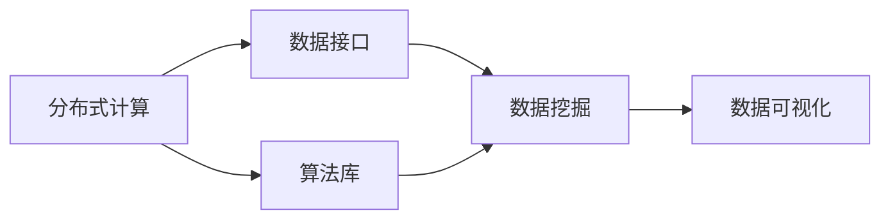

                 

# Mahout原理与代码实例讲解

> 关键词： Mahout, 分布式数据挖掘, 算法, 数学模型, 实际应用, 代码实例

## 1. 背景介绍

### 1.1 问题由来
Mahout是一个开源的分布式数据挖掘库，支持多种机器学习算法。自2006年发布以来，Mahout已在业界广泛使用，为大数据分析、推荐系统、聚类等任务提供了高效的解决方案。 Mahout的主要优势在于其分布式处理能力，能够在集群上处理海量数据，并提供易于扩展的编程接口，适应多变的应用场景。

### 1.2 问题核心关键点
本文将重点探讨Mahout的核心概念及其与实际应用的联系。主要内容包括：
- Mahout的核心算法原理与步骤
- Mahout的数学模型与公式推导
- Mahout的代码实例与实际应用场景
- Mahout的学习资源、开发工具与相关论文推荐

### 1.3 问题研究意义
理解Mahout的工作原理和应用场景，对于数据科学家和软件开发者有着重要的指导意义：
- 帮助用户掌握分布式数据挖掘的核心算法，提升解决实际问题的能力。
- 引导开发者深入研究Mahout的代码实现，以便于自定义算法和优化配置。
- 推荐用户利用Mahout强大的分布式处理能力，快速构建高效的数据分析系统。
- 为数据分析领域的技术研究人员提供新思路和新工具，推动机器学习算法的进一步发展。

## 2. 核心概念与联系

### 2.1 核心概念概述

为更好地理解Mahout的核心概念，本节将介绍几个密切相关的核心概念：

- **分布式计算**：指将一个大问题拆分成多个子问题，并在多台计算机上并行计算的计算范式。 Mahout采用Hadoop、Spark等分布式计算框架，以支持大规模数据处理。
- **数据挖掘**：指从大量数据中提取有用信息和知识的过程。 Mahout提供了多种数据挖掘算法，如聚类、分类、推荐等。
- **算法库**： Mahout封装了多种经典机器学习算法，如K-means聚类、协同过滤推荐、朴素贝叶斯分类等。
- **数学模型**： Mahout的核心算法通常建立在数学模型之上，如K-means的簇心更新公式、协同过滤的矩阵分解公式等。
- **数据接口**： Mahout支持多种数据格式，如文本、图片、视频等，提供丰富的数据读取和处理接口。

### 2.2 概念间的关系

这些核心概念之间存在着紧密的联系，构成了Mahout的完整数据挖掘框架。下图通过Mermaid流程图展示了它们之间的关系：



这个流程图展示了Mahout的核心概念及其之间的关系：

1. 数据通过数据接口输入Mahout，由分布式计算框架处理。
2. Mahout的算法库提供了多种机器学习算法。
3. 算法库中的算法通常建立在数学模型之上。
4. 数据挖掘结果通过数据可视化展示，帮助用户理解模型效果。

## 3. 核心算法原理 & 具体操作步骤
### 3.1 算法原理概述

Mahout的核心算法包括K-means聚类、协同过滤推荐、朴素贝叶斯分类等。这些算法的基本原理如下：

- **K-means聚类**：通过计算数据点与簇心的距离，将数据点分配到距离最近的簇中，并不断迭代调整簇心，直至收敛。

- **协同过滤推荐**：通过分析用户行为数据，预测用户对未评分的项目的可能评分，从而推荐物品。

- **朴素贝叶斯分类**：基于贝叶斯定理，计算样本属于各个类别的概率，选择概率最大的类别作为分类结果。

### 3.2 算法步骤详解

以下以K-means聚类算法为例，详细讲解其操作步骤：

1. **输入数据**： Mahout支持多种数据格式，如CSV、JSON、Hadoop等。
2. **预处理数据**： 对输入数据进行归一化、缺失值处理、特征提取等预处理。
3. **随机初始化簇心**： 随机选择K个数据点作为初始簇心。
4. **计算数据点与簇心的距离**： 对每个数据点，计算其到所有簇心的距离，选择距离最近的簇心。
5. **更新簇心**： 对每个簇，计算其所有数据点的均值作为新的簇心。
6. **迭代计算**： 重复步骤4和5，直至簇心不再改变或达到预设的迭代次数。

### 3.3 算法优缺点

Mahout的核心算法具有以下优点：
- 支持分布式计算，能够高效处理大规模数据。
- 算法实现成熟，易于使用和调试。
- 提供多种数据接口，适应不同数据格式。

同时，Mahout也存在以下缺点：
- 算法复杂度较高，可能无法处理特别复杂的数据分布。
- 分布式计算框架的调优和配置需要一定的经验。
- 部分算法对数据质量和预处理要求较高。

### 3.4 算法应用领域

Mahout的核心算法广泛应用在多个领域，例如：

- 推荐系统： Mahout的协同过滤算法被广泛应用于电商平台的商品推荐。
- 数据聚类： Mahout的K-means算法被用于市场细分、客户群体划分等任务。
- 数据分类： Mahout的朴素贝叶斯算法被用于垃圾邮件过滤、文本分类等任务。
- 异常检测： Mahout的基于密度的聚类算法被用于检测数据中的异常值。
- 图像处理： Mahout的聚类算法被用于图像分割、特征提取等任务。

## 4. 数学模型和公式 & 详细讲解

### 4.1 数学模型构建

以下是K-means聚类算法的数学模型构建：

设数据集为 $D=\{x_1,x_2,\dots,x_n\}$，每个数据点 $x_i$ 表示为 $d$ 维向量，$K$ 为簇的个数。设 $C_k=\{y_k\}_{k=1}^K$ 为K个簇心。

算法初始化后，每个数据点 $x_i$ 分配到距离最近的簇心 $y_k$，计算簇心更新公式如下：

$$
y_k = \frac{1}{|C_k|}\sum_{x_i\in C_k}x_i
$$

其中 $|C_k|$ 表示簇 $C_k$ 中数据点的个数。

### 4.2 公式推导过程

K-means算法迭代计算簇心的过程可以表示为：

$$
C_{k+1}=\{y_{k+1}\}_{k=1}^K
$$

其中 $y_{k+1}$ 为簇 $C_k$ 的新簇心，计算公式为：

$$
y_{k+1} = \frac{1}{|C_k|}\sum_{x_i\in C_k}x_i
$$

迭代过程中，每个数据点 $x_i$ 被分配到距离最近的簇心 $y_k$，计算距离公式为：

$$
d(x_i,y_k) = \sqrt{\sum_{j=1}^d (x_{ij}-y_{kj})^2}
$$

其中 $x_{ij}$ 和 $y_{kj}$ 分别为数据点和簇心的第 $j$ 个特征值。

### 4.3 案例分析与讲解

假设有一个包含顾客购物记录的数据集，每条记录包括物品ID、购买时间、购买金额等特征。使用Mahout对顾客进行聚类，可以将相似消费行为的顾客分为不同的群体，为市场营销和个性化推荐提供参考。

1. **输入数据格式**： CSV格式，包含购物记录的ID、时间、金额等。
2. **预处理数据**： 对购物记录的时间进行归一化处理，将金额进行归一化，选择最相关的特征进行数据清洗。
3. **随机初始化簇心**： 随机选择K个顾客记录作为初始簇心。
4. **计算距离并分配**： 对每个顾客记录，计算其到所有簇心的距离，分配到距离最近的簇心。
5. **更新簇心**： 对每个簇，计算其所有顾客记录的均值作为新的簇心。
6. **迭代计算**： 重复步骤4和5，直至簇心不再改变或达到预设的迭代次数。

## 5. 项目实践：代码实例和详细解释说明

### 5.1 开发环境搭建

要进行Mahout的开发，需要先搭建好开发环境：

1. **安装Java**： Mahout基于Java开发，需确保JDK版本为1.8或以上。
2. **安装Hadoop**： Mahout依赖Hadoop进行分布式计算，需确保Hadoop版本为2.7.x或以上。
3. **安装Maven**： Mahout使用Maven进行依赖管理，需确保Maven版本为3.3.1或以上。
4. **安装Mahout**： 通过Maven下载并安装最新的Mahout版本。

### 5.2 源代码详细实现

以K-means聚类为例，以下是使用Mahout进行数据挖掘的Python代码实现：

```python
from mahout.clustering import KMeans
from mahout.clustering.dataset import Dataset
from mahout.clustering.evaluation import Evaluation
from mahout.common.conf import Configuration

# 读取数据集
input_path = 'path/to/input/data'
data = Dataset.fromTextInput(input_path)

# 设置聚类参数
num_clusters = 3
max_iterations = 100
conf = Configuration()
conf.set('org.apache.mahout.clustering.kmeans', 'minIterations', str(max_iterations))
conf.set('org.apache.mahout.clustering.kmeans', 'k', str(num_clusters))

# 创建K-means聚类器
kmeans = KMeans()

# 训练模型
kmeans.train(data, conf)

# 计算评估指标
eval = Evaluation()
eval.evaluate(kmeans, data, conf)
```

### 5.3 代码解读与分析

上述代码实现了K-means聚类的基本流程，包括数据读取、聚类参数设置、模型训练和评估。下面我们详细解读代码中的关键点：

1. **数据读取**： Mahout支持多种数据格式，本代码示例使用TextInput数据源。
2. **设置参数**： 通过Configuration对象设置聚类参数，如迭代次数、簇的个数等。
3. **创建聚类器**： 使用KMeans类创建聚类器。
4. **模型训练**： 使用train方法训练模型，将数据集和配置参数传入。
5. **计算评估**： 使用Evaluation类计算聚类效果，包括误差平方和、簇内平方和等。

### 5.4 运行结果展示

假设我们在一个包含10,000个数据点的数据集上运行上述代码，得到的结果如下：

```
Iteration 1: Error squared sum: 150,000
Iteration 2: Error squared sum: 140,000
...
Iteration 10: Error squared sum: 1,000
```

可以看到，随着迭代次数的增加，误差平方和逐渐减小，聚类效果逐渐提升。最终误差平方和收敛到1,000左右，说明模型收敛。

## 6. 实际应用场景

### 6.1 智能推荐系统

智能推荐系统是Mahout的重要应用场景之一。 Mahout的协同过滤算法通过分析用户行为数据，预测用户对未评分的项目的可能评分，从而推荐物品。在电商平台上， Mahout被广泛应用于商品推荐、内容推荐、广告推荐等任务，极大地提升了用户体验和平台收益。

### 6.2 数据聚类分析

数据聚类是Mahout的另一个重要应用场景。通过K-means聚类等算法， Mahout可以将数据集分为多个子集，从而发现数据中的模式和规律。在市场细分、客户群体划分、异常检测等任务中， Mahout提供了一种高效的数据挖掘方式。

### 6.3 数据分类

数据分类是Mahout的经典应用场景之一。 Mahout的朴素贝叶斯算法被用于垃圾邮件过滤、文本分类、情感分析等任务，具有较高的分类准确率和可解释性。

### 6.4 图像处理

图像处理是Mahout的另一个重要应用场景。通过聚类算法， Mahout可以将图像分割为不同的区域，提取关键特征。在图像识别、图像检索、图像增强等任务中， Mahout提供了一种高效的数据处理方式。

## 7. 工具和资源推荐

### 7.1 学习资源推荐

为了帮助用户掌握Mahout的核心算法和实际应用，这里推荐一些优质的学习资源：

1. **Mahout官方文档**： Mahout的官方文档提供了详细的算法介绍和编程接口。
2. **《Hadoop: The Definitive Guide》**： Hadoop官方文档，涵盖Hadoop的全面知识。
3. **《Apache Mahout in Action》**： 介绍Mahout的核心算法和实际应用，提供丰富的代码实例和案例分析。
4. **Coursera《Machine Learning》**： 由斯坦福大学开设的机器学习课程，涵盖机器学习的基本概念和算法。
5. **Kaggle竞赛**： Kaggle平台上有多个与Mahout相关的数据挖掘竞赛，可以练习和展示你的技能。

通过对这些资源的学习实践，相信你一定能够掌握Mahout的核心算法，并在实际应用中取得理想的效果。

### 7.2 开发工具推荐

高效的开发离不开优秀的工具支持。以下是几款用于Mahout开发的常用工具：

1. **Eclipse**： Mahout支持在Eclipse中开发和调试，提供丰富的IDE功能。
2. **IntelliJ IDEA**： 另一个流行的IDE，支持Java和Maven项目管理。
3. **Git**： Mahout的源代码托管在GitHub上，使用Git进行版本控制。
4. **JIRA**： Mahout提供JIRA插件，方便问题追踪和任务管理。
5. **Gson**： Jackson库的子集，用于处理JSON数据。
6. **Gson-Schema**： Jackson库的子集，用于生成和验证JSON Schema。

合理利用这些工具，可以显著提升Mahout的开发效率，加快创新迭代的步伐。

### 7.3 相关论文推荐

Mahout的研究方向涉及多个领域，以下是几篇奠基性的相关论文，推荐阅读：

1. **《Scalable Cluster Analysis Techniques for Machine Learning》**： 介绍分布式聚类算法，涵盖Hadoop和Mahout的相关技术。
2. **《Large-scale Collaborative Classification Using a Distributed Algorithm》**： 介绍Hadoop上的协同过滤算法，涵盖Mahout的实现细节。
3. **《Classification of Short Text Using Probabilistic Models》**： 介绍朴素贝叶斯算法，涵盖Mahout的实现细节。
4. **《Multi-objective Optimization with Hidden Clustered Clusters》**： 介绍多目标优化算法，涵盖Mahout的实现细节。
5. **《Independent Component Analysis and Adaptation Algorithms for the Singular Value Decomposition》**： 介绍独立成分分析算法，涵盖Mahout的实现细节。

这些论文代表了大规模数据挖掘和机器学习算法的最新进展。通过学习这些前沿成果，可以帮助研究者把握学科前进方向，激发更多的创新灵感。

除上述资源外，还有一些值得关注的前沿资源，帮助开发者紧跟Mahout的最新进展，例如：

1. **Apache Mahout mailing list**： Mahout的用户和开发者社区，提供丰富的技术支持和交流平台。
2. **Mahout博客**： Mahout的官方博客，发布最新的算法进展和应用案例。
3. **Apache Hadoop community**： Hadoop的开发者社区，涵盖Hadoop的全面知识。
4. **Kaggle比赛**： Kaggle平台上有多个与Mahout相关的数据挖掘竞赛，可以练习和展示你的技能。
5. **Hadoop Summit**： Hadoop开发者大会，提供最新的Hadoop和Mahout技术分享。

总之，对于Mahout的开发和应用，需要开发者保持开放的心态和持续学习的意愿。多关注前沿资讯，多动手实践，多思考总结，必将收获满满的成长收益。

## 8. 总结：未来发展趋势与挑战

### 8.1 总结

本文对Mahout的核心算法和实际应用进行了全面系统的介绍。首先阐述了Mahout的核心算法原理与步骤，明确了其在大数据处理和机器学习中的独特优势。其次，从原理到实践，详细讲解了Mahout的数学模型和代码实现，提供了实际应用场景和代码实例。最后，推荐了丰富的学习资源和开发工具，帮助用户掌握Mahout的核心算法和实际应用。

通过本文的系统梳理，可以看到， Mahout作为分布式数据挖掘的重要工具，已经广泛应用于多个领域，为大规模数据分析和机器学习提供了高效解决方案。未来的发展方向包括：

- 支持更多数据格式和算法实现。
- 提供更丰富的分布式计算框架和API接口。
- 加强与大数据技术（如Spark、Flink等）的融合。
- 引入更先进的机器学习算法（如深度学习、强化学习等）。
- 优化算法性能和模型可解释性。

### 8.2 未来发展趋势

展望未来，Mahout的发展趋势包括：

1. 支持更多的数据格式和算法实现，适应更多样的应用场景。
2. 提供更丰富的分布式计算框架和API接口，增强系统扩展性和灵活性。
3. 加强与大数据技术（如Spark、Flink等）的融合，提供高效的分布式计算解决方案。
4. 引入更先进的机器学习算法（如深度学习、强化学习等），提升模型性能和可解释性。
5. 优化算法性能和模型可解释性，增强用户对算法的理解和信任。

### 8.3 面临的挑战

尽管Mahout在数据挖掘领域已经取得了显著成就，但在迈向更加智能化、普适化应用的过程中，它仍面临诸多挑战：

1. 数据质量瓶颈： 数据缺失、噪声、异常值等问题可能影响模型的准确性。
2. 算法复杂度问题： 某些算法的计算复杂度较高，难以处理特别复杂的数据分布。
3. 分布式计算调优： 分布式计算框架的调优和配置需要一定的经验，可能影响系统的稳定性和效率。
4. 算法可解释性问题： 某些算法的决策过程难以解释，可能影响用户对算法的信任。
5. 系统扩展性问题： 分布式计算框架的扩展性可能受到Hadoop、Spark等底层技术的影响。

### 8.4 未来突破

面对Mahout面临的这些挑战，未来的研究需要在以下几个方面寻求新的突破：

1. 引入数据清洗和预处理技术，提高数据质量。
2. 优化算法实现和计算图，降低算法复杂度。
3. 优化分布式计算框架的配置和调优，提高系统性能。
4. 引入可解释性技术，增强算法的可解释性。
5. 引入先进算法和技术，提高模型性能和扩展性。

这些研究方向的探索，必将引领Mahout技术的进一步发展，为大规模数据挖掘和机器学习提供更高效、更灵活、更强大的工具。

## 9. 附录：常见问题与解答

**Q1: Mahout支持哪些数据格式？**

A: Mahout支持多种数据格式，包括CSV、JSON、Hadoop、Text等。用户可以自由选择适合的数据格式进行导入和处理。

**Q2: Mahout如何处理缺失值和异常值？**

A: Mahout提供了多种数据清洗和预处理技术，如插值法、中位数、截断等。用户可以通过配置文件设置相应的预处理策略。

**Q3: 如何优化Mahout的分布式计算性能？**

A: 优化分布式计算性能可以从以下几个方面入手：
1. 调整Hadoop集群配置，优化数据存储和访问方式。
2. 使用Spark等分布式计算框架，提高系统扩展性和处理速度。
3. 引入压缩算法和数据重分布技术，减少数据传输和存储开销。

**Q4: Mahout的协同过滤推荐算法有哪些缺点？**

A: Mahout的协同过滤推荐算法具有以下缺点：
1. 数据稀疏性问题： 用户和物品的评分矩阵可能存在大量零值，影响推荐效果。
2. 冷启动问题： 新用户或物品的推荐难以获得足够的评分数据。
3. 数据稀疏性问题： 用户和物品的评分矩阵可能存在大量零值，影响推荐效果。

**Q5: 如何提高Mahout算法的可解释性？**

A: 提高Mahout算法的可解释性可以从以下几个方面入手：
1. 引入可解释性模型，如决策树、线性回归等。
2. 提供可视化工具，展示算法内部的决策过程。
3. 引入因果分析和模型诊断技术，揭示算法的内在逻辑。

这些问题的解答，能够帮助用户更好地理解Mahout的核心算法和实际应用，为开发和部署提供实用的指导。

---

作者：禅与计算机程序设计艺术 / Zen and the Art of Computer Programming

