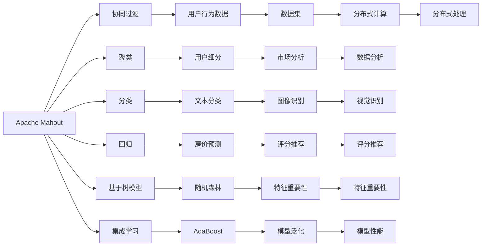
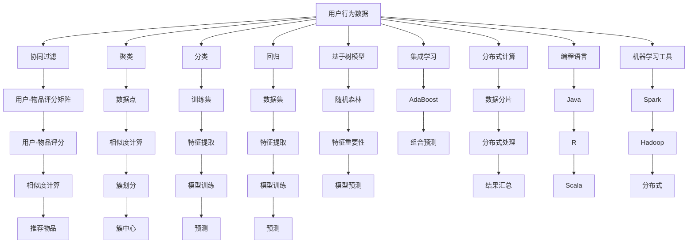

                 

# Mahout机器学习算法库原理与代码实例讲解

> 关键词：Mahout, 机器学习, 协同过滤, 聚类, 推荐系统, 基于树模型, 集成学习

## 1. 背景介绍

### 1.1 问题由来
在当前数据驱动的时代，机器学习在各行各业的应用变得越来越广泛。从推荐系统到图像识别，再到自然语言处理，机器学习已经成为技术创新的重要推动力。然而，机器学习模型的开发和调优往往需要大量的专业知识和实践经验，一般开发者难以独立完成。

为了降低机器学习应用的门槛，Apache Mahout应运而生。它是一个开源的机器学习算法库，提供了多种高效、可扩展的机器学习算法，支持分布式计算，非常适合大数据环境下的机器学习任务。

### 1.2 问题核心关键点
Apache Mahout的核心优势在于其丰富的算法库和分布式计算能力。它支持从分类、聚类、回归到推荐系统的各类任务，能够高效地处理大规模数据集，快速迭代模型，适应不同应用场景的需求。

Mahout的算法库主要包括以下几大类：
- 协同过滤算法：用于推荐系统，利用用户行为数据进行个性化推荐。
- 聚类算法：用于用户细分、市场分析等，将数据分组成相似的组。
- 分类算法：用于文本分类、图像识别等，判断数据所属的类别。
- 回归算法：用于预测连续型数值，如预测房价、推荐评分等。
- 基于树模型算法：如随机森林、梯度提升树，用于特征重要性排序和模型预测。
- 集成学习算法：如AdaBoost、Stacking，提高模型泛化能力。

此外，Mahout还提供了分布式计算框架，支持Hadoop、Spark等多种分布式平台，能够有效应对大规模数据集的计算需求。

### 1.3 问题研究意义
研究Apache Mahout，对于拓展机器学习应用的广度和深度，提高数据处理效率，加速技术产业化进程，具有重要意义：

1. 降低应用开发成本。Mahout的算法库和工具封装，使得开发者可以快捷地使用成熟的机器学习算法，减少从头开发所需的精力和时间成本。
2. 提升模型性能。Mahout支持多种高效算法，能够快速迭代和优化模型，提高算法的泛化能力和精准度。
3. 支持分布式计算。Mahout的分布式框架，能够高效处理海量数据，满足大规模应用场景的需求。
4. 提供多样化的算法支持。Mahout支持多种算法的灵活组合，能够适应不同任务和数据的特点。
5. 促进开源社区的发展。Mahout作为开源项目的成功案例，为机器学习社区的进一步发展提供了有益的借鉴和参考。

## 2. 核心概念与联系

### 2.1 核心概念概述

为更好地理解Apache Mahout的原理和应用，本节将介绍几个密切相关的核心概念：

- Apache Mahout：一个开源的机器学习算法库，提供多种高效、可扩展的机器学习算法，支持分布式计算。
- 协同过滤(Collaborative Filtering)：一种基于用户和物品行为数据的推荐算法，用于个性化推荐。
- 聚类(Clustering)：将数据分成不同的组，用于用户细分、市场分析等。
- 分类(Classification)：判断数据所属的类别，用于文本分类、图像识别等。
- 回归(Regression)：预测连续型数值，用于房价预测、评分推荐等。
- 基于树模型(Decision Trees)：如随机森林(Random Forest)、梯度提升树(Gradient Boosting Tree)，用于特征重要性排序和模型预测。
- 集成学习(Ensemble Learning)：如AdaBoost、Stacking，通过组合多个模型的预测结果，提高泛化能力。
- Hadoop、Spark：分布式计算框架，用于高效处理大规模数据集。
- R、Java、Scala：Mahout支持的编程语言，用于算法的实现和优化。

这些核心概念之间的逻辑关系可以通过以下Mermaid流程图来展示：



这个流程图展示了Apache Mahout的算法库及其在多个场景中的应用：

1. 利用用户行为数据进行协同过滤推荐。
2. 通过聚类算法对数据进行分组。
3. 利用分类算法判断文本或图像的类别。
4. 应用回归算法预测数值型结果。
5. 通过随机森林或梯度提升树进行特征排序和预测。
6. 使用集成学习技术组合多个模型提高泛化能力。
7. 使用分布式计算处理大规模数据集。
8. 用R、Java、Scala等语言实现算法。

### 2.2 概念间的关系

这些核心概念之间存在着紧密的联系，形成了Apache Mahout的完整算法生态系统。下面我通过几个Mermaid流程图来展示这些概念之间的关系。

#### 2.2.1 协同过滤的算法流程


这个流程图展示了协同过滤的基本流程：

1. 收集用户和物品之间的行为数据，如评分、浏览记录等。
2. 构建用户-物品评分矩阵，量化用户对物品的评分。
3. 计算用户和物品之间的相似度，如余弦相似度、皮尔逊相关系数等。
4. 根据相似度，推荐与用户喜好相似的物品。

#### 2.2.2 聚类的算法流程


这个流程图展示了聚类的基本流程：

1. 收集数据集，将其分解为数据点。
2. 计算数据点之间的相似度，如欧几里得距离、余弦相似度等。
3. 通过K-means、层次聚类等算法，将数据点划分成若干簇。
4. 计算每个簇的中心点，作为簇的代表。

#### 2.2.3 分类的算法流程


这个流程图展示了分类的基本流程：

1. 收集数据集，划分训练集和测试集。
2. 提取特征，如词袋模型、TF-IDF等。
3. 使用SVM、决策树、神经网络等算法进行模型训练。
4. 用训练好的模型对测试集进行预测，评估模型性能。

### 2.3 核心概念的整体架构

最后，我们用一个综合的流程图来展示这些核心概念在Apache Mahout中的整体架构：



这个综合流程图展示了从数据输入到算法处理，再到结果输出的完整流程。Apache Mahout的算法库和工具链，能够高效处理大规模数据集，灵活适应不同的应用场景。通过这些核心概念的组合使用，开发者可以实现从数据预处理到模型训练，再到结果输出的全流程自动化。

## 3. 核心算法原理 & 具体操作步骤
### 3.1 算法原理概述

Apache Mahout的算法库涵盖了许多经典和前沿的机器学习算法，包括协同过滤、聚类、分类、回归、基于树模型和集成学习等。这些算法的基本原理如下：

- 协同过滤算法：利用用户和物品的行为数据，通过计算相似度，预测用户可能感兴趣的物品。
- 聚类算法：将数据分成不同的组，每组内的数据相似度较高，每组外的数据相似度较低。
- 分类算法：通过训练数据集，学习一个分类函数，用于预测新数据所属的类别。
- 回归算法：通过训练数据集，学习一个回归函数，用于预测连续型数值结果。
- 基于树模型算法：通过构建决策树或随机森林，进行特征选择和模型预测。
- 集成学习算法：通过组合多个模型的预测结果，提高模型的泛化能力和准确度。

这些算法在数学上都有严格的推导和理论基础，在实际应用中也有广泛的验证和改进。

### 3.2 算法步骤详解

以下是几种核心算法的详细步骤：

#### 3.2.1 协同过滤

1. 收集用户和物品的行为数据，如评分、浏览记录等。
2. 构建用户-物品评分矩阵，其中每个元素为用户的评分。
3. 计算用户和物品之间的相似度，如余弦相似度、皮尔逊相关系数等。
4. 根据相似度，推荐与用户喜好相似的物品。

#### 3.2.2 聚类

1. 收集数据集，将其分解为数据点。
2. 计算数据点之间的相似度，如欧几里得距离、余弦相似度等。
3. 通过K-means、层次聚类等算法，将数据点划分成若干簇。
4. 计算每个簇的中心点，作为簇的代表。

#### 3.2.3 分类

1. 收集数据集，划分训练集和测试集。
2. 提取特征，如词袋模型、TF-IDF等。
3. 使用SVM、决策树、神经网络等算法进行模型训练。
4. 用训练好的模型对测试集进行预测，评估模型性能。

#### 3.2.4 回归

1. 收集数据集，划分训练集和测试集。
2. 提取特征，如特征矩阵。
3. 使用线性回归、岭回归、随机森林等算法进行模型训练。
4. 用训练好的模型对测试集进行预测，评估模型性能。

#### 3.2.5 基于树模型

1. 收集数据集，提取特征。
2. 使用随机森林或梯度提升树算法构建模型。
3. 通过特征重要性排序，评估特征对模型的贡献。
4. 用训练好的模型进行预测，评估模型性能。

#### 3.2.6 集成学习

1. 收集多个模型的预测结果。
2. 使用AdaBoost、Stacking等算法进行模型组合。
3. 通过投票或加权平均，生成最终的预测结果。
4. 评估组合模型的性能。

### 3.3 算法优缺点

Apache Mahout的算法库具有以下优点：

1. 丰富的算法支持：涵盖协同过滤、聚类、分类、回归、基于树模型和集成学习等各类经典和前沿算法。
2. 高效分布式计算：支持Hadoop、Spark等分布式计算框架，能够高效处理大规模数据集。
3. 简单易用：提供便捷的API接口，支持多种编程语言（如Java、Scala），易于上手。
4. 社区活跃：Apache Mahout作为开源项目，拥有活跃的社区支持，不断有新算法和优化更新。

同时，这些算法也存在一些缺点：

1. 算法复杂度较高：某些算法（如随机森林、梯度提升树）的训练和预测复杂度较高，对计算资源需求较大。
2. 数据预处理要求高：某些算法对数据质量要求较高，需要进行复杂的数据预处理。
3. 模型解释性差：某些算法（如神经网络、集成学习）的决策过程较为复杂，难以解释。
4. 参数调优困难：某些算法（如集成学习）的性能依赖于参数调优，需要丰富的经验。

尽管存在这些缺点，Apache Mahout在工业界和学术界仍被广泛应用，其算法库和工具链为机器学习任务提供了坚实的基础。

### 3.4 算法应用领域

Apache Mahout的算法库已经广泛应用于各个行业领域，涵盖从电商推荐到医疗诊断，从金融分析到社交网络，成为机器学习算法应用的重要平台。

#### 3.4.1 电商推荐

在电商平台上，用户行为数据（如浏览、购买记录）是推荐系统的重要基础。通过Apache Mahout的协同过滤算法，可以对用户和物品进行相似度计算，生成个性化的推荐结果。

#### 3.4.2 金融风控

在金融领域，预测风险和识别欺诈是重要任务。利用Apache Mahout的分类和回归算法，可以对贷款申请、信用卡交易等数据进行建模，预测客户的违约概率或欺诈风险。

#### 3.4.3 医疗诊断

在医疗领域，病历数据包含大量复杂的结构化数据和非结构化数据，如病人年龄、病史、检查结果等。利用Apache Mahout的聚类算法，可以对病历数据进行分组，识别出具有相似特征的病人，提高诊断的准确性和效率。

#### 3.4.4 社交网络分析

在社交网络中，用户行为数据（如好友关系、点赞、评论等）是聚类和推荐的重要基础。通过Apache Mahout的聚类算法，可以对用户进行分组，发现具有相似兴趣的用户群体，提供更加精准的社交推荐。

此外，Apache Mahout的算法库还支持多种文本处理任务，如情感分析、主题建模等，成为NLP技术的重要补充。

## 4. 数学模型和公式 & 详细讲解 & 举例说明

### 4.1 数学模型构建

本节将使用数学语言对Apache Mahout的算法库进行更加严格的刻画。

#### 4.1.1 协同过滤

假设用户行为数据为 $D=\{(u_i,i_r)\}_{i=1}^N$，其中 $u_i$ 表示用户，$i_r$ 表示用户对物品的评分。协同过滤算法的基本模型为：

$$
p_{ui} = \sum_{j=1}^K \alpha_j \langle P_{uj}, Q_i \rangle
$$

其中，$P_{uj}$ 表示用户 $u_j$ 对物品 $i$ 的评分，$Q_i$ 表示物品 $i$ 的特征向量，$K$ 表示物品特征向量的维度，$\alpha_j$ 表示特征向量的权重。

协同过滤算法的目标是最小化预测误差：

$$
\min_{P_{uj}} \frac{1}{N} \sum_{i=1}^N || p_{ui} - i_r ||^2
$$

其中，$|| \cdot ||$ 表示欧几里得距离。

#### 4.1.2 聚类

假设数据集 $D=\{d_k\}_{k=1}^M$，其中 $d_k$ 表示数据点。聚类算法的目标是将数据点分成若干簇，使得簇内数据相似度较高，簇间数据相似度较低。常见的聚类算法包括K-means和层次聚类等。

K-means算法的基本步骤如下：

1. 随机选择 $K$ 个簇中心。
2. 将每个数据点分配到最近的簇中心。
3. 重新计算每个簇的中心点。
4. 重复步骤2和3，直到簇中心不再变化或达到最大迭代次数。

层次聚类的基本步骤如下：

1. 将每个数据点看作一个独立的簇。
2. 逐层合并簇，直到所有数据点都属于同一个簇。

#### 4.1.3 分类

假设数据集 $D=\{(x_i,y_i)\}_{i=1}^N$，其中 $x_i$ 表示特征向量，$y_i$ 表示类别标签。分类算法的目标是最小化分类误差：

$$
\min_{\theta} \frac{1}{N} \sum_{i=1}^N L(y_i, f_\theta(x_i))
$$

其中，$L(y_i, f_\theta(x_i))$ 表示分类损失函数，如交叉熵损失、对数损失等。

#### 4.1.4 回归

假设数据集 $D=\{(x_i,y_i)\}_{i=1}^N$，其中 $x_i$ 表示特征向量，$y_i$ 表示回归目标。回归算法的目标是最小化回归误差：

$$
\min_{\theta} \frac{1}{N} \sum_{i=1}^N || y_i - f_\theta(x_i) ||^2
$$

其中，$f_\theta(x_i)$ 表示回归模型，如线性回归、岭回归、随机森林等。

#### 4.1.5 基于树模型

假设数据集 $D=\{(x_i,y_i)\}_{i=1}^N$，其中 $x_i$ 表示特征向量，$y_i$ 表示分类目标或回归目标。基于树模型的算法包括随机森林、梯度提升树等。

随机森林的基本步骤如下：

1. 从特征集合中随机选择 $M$ 个特征。
2. 对每个特征，从数据集中随机选择 $N$ 个子样本。
3. 对每个子样本构建决策树。
4. 对每个决策树进行投票或加权平均，生成最终的预测结果。

#### 4.1.6 集成学习

假设多个模型的预测结果为 $f_1(x_i)$，$f_2(x_i)$，...，$f_L(x_i)$，集成学习算法的目标是最小化集成误差：

$$
\min_{\theta} \frac{1}{N} \sum_{i=1}^N || y_i - g_\theta(f_1(x_i), f_2(x_i), ..., f_L(x_i)) ||^2
$$

其中，$g_\theta$ 表示集成函数，如AdaBoost、Stacking等。

### 4.2 公式推导过程

以下我们以随机森林算法为例，推导其数学模型和推导过程。

假设数据集 $D=\{(x_i,y_i)\}_{i=1}^N$，其中 $x_i$ 表示特征向量，$y_i$ 表示分类目标或回归目标。随机森林的基本模型为：

$$
f_{RF}(x_i) = \frac{1}{N} \sum_{j=1}^M f_{j}(x_i)
$$

其中，$f_{j}(x_i)$ 表示第 $j$ 棵决策树对 $x_i$ 的预测结果。

随机森林的目标是最小化预测误差：

$$
\min_{f_j} \frac{1}{N} \sum_{i=1}^N || y_i - f_{RF}(x_i) ||^2
$$

其中，$|| \cdot ||$ 表示欧几里得距离。

随机森林的推导过程如下：

1. 对数据集进行抽样，得到子样本集合 $D^{(j)}$。
2. 对子样本集合进行特征选择，得到特征集合 $F^{(j)}$。
3. 对特征集合进行递归分割，得到决策树 $T^{(j)}$。
4. 对所有决策树进行投票或加权平均，生成最终的预测结果 $f_{RF}(x_i)$。

随机森林的决策树生成过程如下：

1. 对特征集合 $F^{(j)}$ 进行递归分割，得到节点 $N^{(j)}$。
2. 对每个节点，计算特征的重要性 $I^{(j)}$。
3. 对每个节点，计算分类误差 $E^{(j)}$。
4. 选择最优的特征和分割点，生成决策树 $T^{(j)}$。

随机森林的特征重要性计算过程如下：

1. 对每个特征，计算在树 $T^{(j)}$ 上的重要性 $I^{(j)}$。
2. 对所有树 $T^{(j)}$ 的特征重要性进行加权平均，得到最终的特征重要性 $I$。

### 4.3 案例分析与讲解

下面以电商推荐系统为例，展示Apache Mahout的应用场景。

假设某电商平台收集了用户 $u_i$ 对商品 $i_j$ 的评分数据 $D=\{(u_i,i_j,r_{ij})\}_{i=1}^N$，其中 $r_{ij}$ 表示用户 $u_i$ 对商品 $i_j$ 的评分。

1. 首先，构建用户-商品评分矩阵 $P=\{P_{uij}\}_{i=1}^N$，其中 $P_{uij}$ 表示用户 $u_i$ 对商品 $i_j$ 的评分。
2. 计算用户 $u_i$ 和商品 $i_j$ 之间的余弦相似度：

$$
\langle P_{ui}, Q_j \rangle = \frac{\sum_{k=1}^K P_{ukij}Q_{kj}}{\sqrt{\sum_{k=1}^K P_{ukij}^2} \sqrt{\sum_{k=1}^K Q_{kj}^2}}
$$

3. 根据余弦相似度，推荐与用户 $u_i$ 最相似的商品 $i_j$，即 $i_j=\arg\max_i \langle P_{ui}, Q_j \rangle$。

通过Apache Mahout的协同过滤算法，可以构建一个高效、可扩展的电商推荐系统，为用户提供个性化的商品推荐。

## 5. 项目实践：代码实例和详细解释说明
### 5.1 开发环境搭建

在进行Apache Mahout项目实践前，我们需要准备好开发环境。以下是使用Java进行Mahout开发的流程：

1. 安装JDK：从Oracle官网下载并安装JDK，用于编写Java代码。

2. 安装Maven：从Maven官网下载并安装Maven，用于管理项目依赖。

3. 创建Maven项目：
```bash
mvn archetype:generate -DgroupId=com.example.mahout -DartifactId=mahout-project -DarchetypeArtifactId=maven-archetype-quickstart
```

4. 引入Mahout库：
```xml
<dependencies>
    <dependency>
        <groupId>org.apache.mahout</groupId>
        <artifactId>mahout-common</artifactId>
        <version>2.x.x</version>
    </dependency>
    <dependency>
        <groupId>org.apache.mahout</groupId>
        <artifactId>mahout-clustering</artifactId>
        <version>2.x.x</version>
    </dependency>
    <dependency>
        <groupId>org.apache.mahout</groupId>
        <artifactId>mahout-classification</artifactId>
        <version>2.x.x</version>
    </dependency>
    <dependency>
        <groupId>org.apache.mahout</groupId>
        <artifactId>mahout-regression</artifactId>
        <version>2.x.x</version>
    </dependency>
    <dependency>
        <groupId>org.apache.mahout</groupId>
        <artifactId>mahout-recommender</artifactId>
        <version>2.x.x</version>
    </dependency>
</dependencies>
```

完成上述步骤后，即可在Java环境中开始Mahout项目实践。

### 5.2 源代码详细实现

这里以电商推荐系统为例，展示Apache Mahout的代码实现。

首先，构建用户-商品评分矩阵：

```java
import org.apache.mahout.cf.taste.common.TasteException;
import org.apache.mahout.cf.taste.common.Preconditions;
import org.apache.mahout.cf.taste.model.DataModel;
import org.apache.mahout.cf.taste.model.Preference;
import org.apache.mahout.cf.taste.recommender.Recommender;
import org.apache.mahout.cf.taste.recomm

