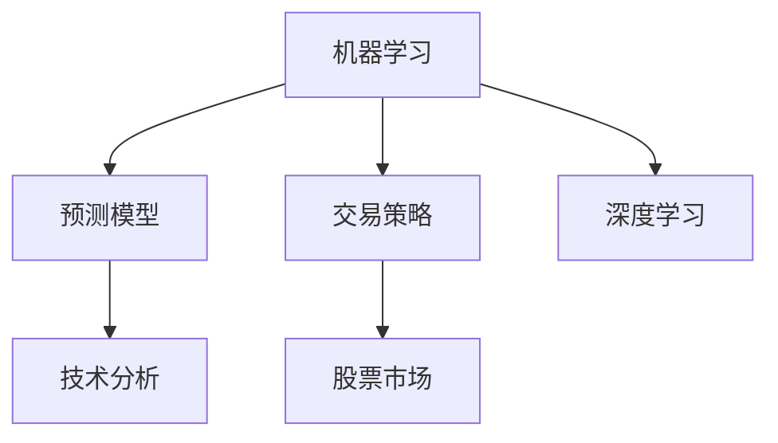
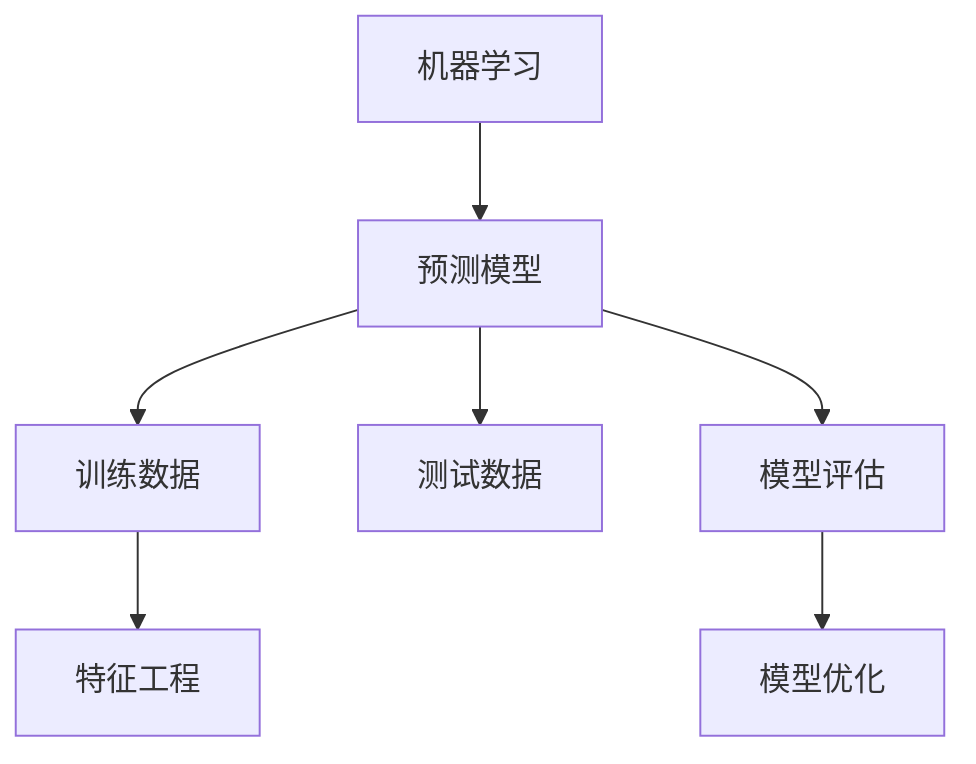
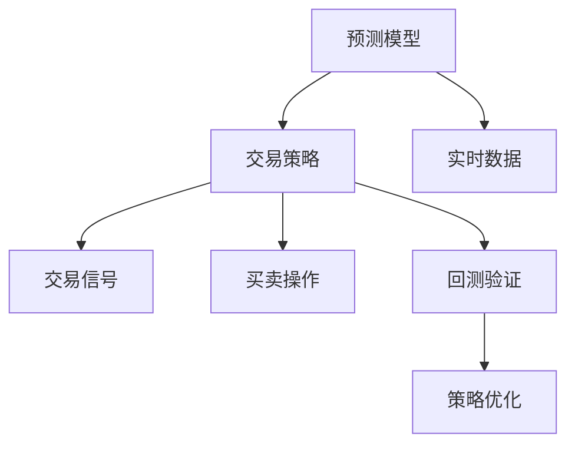
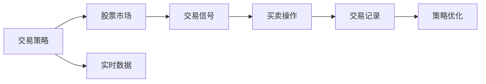

                 

# Python机器学习实战：使用机器学习预测股票市场走势

> 关键词：机器学习,股票市场,预测模型,交易策略,技术分析,深度学习

## 1. 背景介绍

### 1.1 问题由来
在金融领域，股票市场的预测和交易策略制定一直是投资者关注的焦点。尽管传统的技术分析和基本面分析方法已较为成熟，但其预测精度和实时性仍有较大提升空间。随着机器学习技术的发展，越来越多的投资者开始尝试利用机器学习模型来预测股票市场走势，以期获取更高的投资回报。

### 1.2 问题核心关键点
机器学习模型预测股票市场走势的核心在于如何从海量历史数据中提取出有意义的特征，并利用这些特征构建高精度的预测模型。常用的方法包括时间序列预测、特征工程、深度学习等。这些方法需要投资者具备一定的统计学、编程和数据处理能力，同时也需要深入理解机器学习的基本原理和算法。

### 1.3 问题研究意义
机器学习预测股票市场走势不仅有助于投资者制定更精准的交易策略，还能提高金融市场的整体透明度和效率。它能够帮助投资者识别市场趋势、规避风险，同时也为量化交易、高频交易等新型的金融模式提供了技术支持。然而，机器学习在金融领域的应用仍处于起步阶段，需要更多的理论和实践研究来验证其可靠性和有效性。

## 2. 核心概念与联系

### 2.1 核心概念概述

为更好地理解机器学习在股票市场预测中的应用，本节将介绍几个关键概念：

- **机器学习**：指利用数据和算法构建模型，从数据中学习规律并应用于预测和决策的科学方法。在金融领域，机器学习主要应用于股票价格预测、市场情绪分析等。
- **股票市场**：指股票的发行、交易和报价的场所，包括证券交易所、场外交易市场等。预测股票市场走势是机器学习在金融领域的重要应用之一。
- **预测模型**：指用于预测股票市场走势的机器学习模型，包括线性回归模型、时间序列模型、神经网络模型等。
- **交易策略**：指基于预测模型的投资策略，用于指导股票买卖操作，以达到最大化收益的目的。
- **技术分析**：指利用图表、指标等技术手段分析股票走势的方法，与机器学习相结合，可以提供更精准的预测和分析。
- **深度学习**：指利用多层神经网络构建的机器学习模型，能够处理非线性、高维度数据，适用于复杂的金融市场预测任务。

这些概念之间的逻辑关系可以通过以下Mermaid流程图来展示：



这个流程图展示了大机器学习在股票市场预测和交易中的核心概念及其关系：

1. 机器学习提供预测模型。
2. 预测模型指导交易策略。
3. 交易策略应用于股票市场。
4. 技术分析辅助预测模型。
5. 深度学习增强预测精度。

### 2.2 概念间的关系

这些核心概念之间存在着紧密的联系，形成了机器学习预测股票市场走势的完整生态系统。下面我们通过几个Mermaid流程图来展示这些概念之间的关系。

#### 2.2.1 机器学习与预测模型的关系



这个流程图展示了机器学习与预测模型的关系。机器学习通过训练数据训练预测模型，利用特征工程提取有意义的特征，并通过模型评估和优化不断提高模型的预测精度。

#### 2.2.2 预测模型与交易策略的关系



这个流程图展示了预测模型与交易策略的关系。预测模型输出交易信号，指导交易策略制定买卖操作。交易策略还需要回测验证和优化，以确保其在历史数据上的稳定性和鲁棒性。

#### 2.2.3 交易策略与股票市场的关系



这个流程图展示了交易策略与股票市场的关系。交易策略通过实时数据和交易信号指导买卖操作，并在股票市场上实现交易记录。同时，交易策略的优化也需要基于股票市场的表现和风险评估。

## 3. 核心算法原理 & 具体操作步骤
### 3.1 算法原理概述

机器学习预测股票市场走势的原理是通过训练数据构建预测模型，利用模型对未来股票价格进行预测。常用的预测模型包括线性回归模型、时间序列模型、随机森林模型、神经网络模型等。其中，深度学习模型由于其强大的非线性拟合能力，在金融市场预测中表现尤为出色。

形式化地，假设历史股票价格数据为 $(x_t, y_t)$，其中 $x_t$ 为时间 $t$ 的特征向量，$y_t$ 为时间 $t$ 的股票价格。机器学习模型的目标是学习一个函数 $f(x_t)$，使其能够预测未来的股票价格 $y_{t+1}$。常见的预测模型训练过程如下：

1. 数据预处理：对原始数据进行清洗、归一化等预处理，确保数据的质量和一致性。
2. 特征选择：从历史数据中选择有意义的特征，构建特征向量 $x_t$。
3. 模型训练：利用历史数据 $(x_t, y_t)$ 训练预测模型 $f(x_t)$。
4. 模型评估：在验证集上评估模型性能，选择最优模型。
5. 预测股票价格：利用训练好的模型 $f(x_t)$ 预测未来股票价格 $y_{t+1}$。

### 3.2 算法步骤详解

以下是使用Python实现机器学习模型预测股票市场走势的具体操作步骤：

**Step 1: 准备数据集**

首先，需要准备包含股票价格历史数据的数据集，包括开盘价、收盘价、最高价、最低价等。可以使用Pandas库对数据进行加载和处理。

```python
import pandas as pd

# 加载历史股票价格数据
data = pd.read_csv('stock_prices.csv')
```

**Step 2: 数据预处理**

对数据进行清洗、归一化等预处理，确保数据的质量和一致性。

```python
# 处理缺失值
data.fillna(method='ffill', inplace=True)

# 归一化数据
from sklearn.preprocessing import MinMaxScaler
scaler = MinMaxScaler()
scaled_data = scaler.fit_transform(data[['open', 'close', 'high', 'low']])
```

**Step 3: 特征选择**

选择合适的特征向量 $x_t$，用于训练预测模型。通常包括股票价格、成交量、技术指标等。

```python
# 构建特征向量
features = ['open', 'close', 'high', 'low', 'volume']
X = pd.DataFrame(scaled_data, columns=features)
```

**Step 4: 模型训练**

选择合适的预测模型，并进行训练。这里使用LSTM神经网络模型。

```python
from keras.models import Sequential
from keras.layers import LSTM, Dense

# 定义LSTM模型
model = Sequential()
model.add(LSTM(50, return_sequences=True, input_shape=(X.shape[1], 1)))
model.add(LSTM(50))
model.add(Dense(1))

# 编译模型
model.compile(loss='mean_squared_error', optimizer='adam')

# 训练模型
model.fit(X, X.shift(1), epochs=100, batch_size=32)
```

**Step 5: 模型评估**

在验证集上评估模型性能，选择最优模型。

```python
# 划分验证集
train_size = int(len(X) * 0.7)
X_train, X_val = X.iloc[:train_size], X.iloc[train_size:]

# 评估模型
train_pred = model.predict(X_train)
train_errors = np.sqrt(np.mean((train_pred - X_train.shift(1)) ** 2))
val_errors = np.sqrt(np.mean((val_pred - X_val.shift(1)) ** 2))
print('Train Error:', train_errors)
print('Validation Error:', val_errors)
```

**Step 6: 预测股票价格**

利用训练好的模型 $f(x_t)$ 预测未来股票价格 $y_{t+1}$。

```python
# 预测未来股票价格
future_data = X_val.shift(1)
future_price = model.predict(future_data)
future_price = scaler.inverse_transform(future_price)
print(f'Future Stock Price: {future_price}')
```

### 3.3 算法优缺点

机器学习预测股票市场走势具有以下优点：

- **自动化**：机器学习模型能够自动从历史数据中学习规律，减少了人工分析和操作的时间成本。
- **高精度**：深度学习模型具有强大的非线性拟合能力，能够捕捉复杂的数据关系，提高预测精度。
- **鲁棒性强**：机器学习模型对噪声数据具有一定的鲁棒性，能够有效降低人为操作的风险。

然而，机器学习预测股票市场走势也存在一些缺点：

- **数据质量要求高**：机器学习模型的训练效果高度依赖于数据的质量和完整性，数据缺失、异常值等都会影响模型的准确性。
- **模型复杂度高**：深度学习模型结构复杂，训练和推理过程耗时较长，对硬件资源要求高。
- **解释性差**：机器学习模型通常是"黑盒"系统，难以解释其内部工作机制和决策逻辑。

### 3.4 算法应用领域

机器学习预测股票市场走势在金融领域有着广泛的应用，主要包括以下几个方面：

- **股票价格预测**：利用历史股票价格数据，预测未来股价走势。
- **市场情绪分析**：利用自然语言处理技术，分析市场新闻、社交媒体等数据，预测市场情绪和趋势。
- **风险管理**：通过预测市场风险，帮助投资者制定风险控制策略，优化资产配置。
- **量化交易**：利用机器学习模型自动生成交易信号，进行高频交易和量化交易。
- **财务分析**：利用机器学习模型分析财务报表、新闻、公告等数据，进行财务预测和风险评估。

## 4. 数学模型和公式 & 详细讲解  
### 4.1 数学模型构建

在金融市场预测中，常用的数学模型包括线性回归模型、时间序列模型、神经网络模型等。这里我们以LSTM神经网络模型为例，详细介绍其数学模型构建和训练过程。

假设输入特征 $x_t = [x_t^1, x_t^2, \ldots, x_t^n]$，预测输出 $y_t$，LSTM神经网络模型的数学模型构建如下：

$$
\begin{aligned}
f(x_t) &= \sum_{i=1}^{n} w_i x_t^i + b \\
y_t &= f(x_t) + \epsilon_t
\end{aligned}
$$

其中 $w_i$ 和 $b$ 为模型的权重和偏置项，$\epsilon_t$ 为随机噪声。

### 4.2 公式推导过程

假设历史数据 $(x_t, y_t)$，利用LSTM神经网络模型进行预测时，首先需要将数据进行归一化处理，然后利用LSTM层对数据进行编码，最终输出预测结果。

假设输入数据 $x_t = [x_t^1, x_t^2, \ldots, x_t^n]$，输出数据 $y_t$，LSTM神经网络模型的训练过程如下：

1. 数据归一化：

$$
x_t' = \frac{x_t - \mu}{\sigma}
$$

其中 $\mu$ 为均值，$\sigma$ 为标准差。

2. LSTM层编码：

$$
h_t = \text{LSTM}(x_t')
$$

3. 线性回归输出：

$$
y_t = \sum_{i=1}^{n} w_i h_t^i + b
$$

4. 损失函数计算：

$$
\mathcal{L} = \frac{1}{N} \sum_{t=1}^{N} (y_t - \hat{y}_t)^2
$$

其中 $N$ 为数据集大小，$\hat{y}_t$ 为预测结果。

5. 模型训练：

$$
w_i, b = \mathop{\arg\min}_{w_i, b} \mathcal{L}
$$

6. 预测结果：

$$
\hat{y}_{t+1} = \sum_{i=1}^{n} w_i h_t^i + b
$$

### 4.3 案例分析与讲解

以LSTM神经网络模型为例，分析其在股票市场预测中的应用。假设我们有一份包含30天历史股票价格的数据集，其形状为 $[30, 4]$，其中每行表示一天的数据，共有4个特征，分别为开盘价、收盘价、最高价和最低价。利用LSTM模型进行预测时，可以通过以下步骤：

1. 数据预处理：

```python
# 构建特征向量
features = ['open', 'close', 'high', 'low']
X = pd.DataFrame(scaled_data, columns=features)
```

2. 模型训练：

```python
# 定义LSTM模型
model = Sequential()
model.add(LSTM(50, return_sequences=True, input_shape=(X.shape[1], 1)))
model.add(LSTM(50))
model.add(Dense(1))

# 编译模型
model.compile(loss='mean_squared_error', optimizer='adam')

# 训练模型
model.fit(X, X.shift(1), epochs=100, batch_size=32)
```

3. 模型评估：

```python
# 划分验证集
train_size = int(len(X) * 0.7)
X_train, X_val = X.iloc[:train_size], X.iloc[train_size:]

# 评估模型
train_pred = model.predict(X_train)
train_errors = np.sqrt(np.mean((train_pred - X_train.shift(1)) ** 2))
val_errors = np.sqrt(np.mean((val_pred - X_val.shift(1)) ** 2))
print('Train Error:', train_errors)
print('Validation Error:', val_errors)
```

4. 预测股票价格：

```python
# 预测未来股票价格
future_data = X_val.shift(1)
future_price = model.predict(future_data)
future_price = scaler.inverse_transform(future_price)
print(f'Future Stock Price: {future_price}')
```

## 5. 项目实践：代码实例和详细解释说明
### 5.1 开发环境搭建

在进行股票市场预测项目时，需要搭建开发环境，包括数据处理、模型训练、模型评估等环节。以下是一个基于Python的开发环境搭建流程：

1. 安装Python环境：

```bash
sudo apt-get install python3
```

2. 安装Pandas库：

```bash
pip install pandas
```

3. 安装Keras库：

```bash
pip install keras
```

4. 安装TensorFlow库：

```bash
pip install tensorflow
```

### 5.2 源代码详细实现

以下是一个使用LSTM神经网络模型进行股票市场预测的完整代码实现：

```python
import pandas as pd
import numpy as np
from sklearn.preprocessing import MinMaxScaler
from keras.models import Sequential
from keras.layers import LSTM, Dense

# 加载历史股票价格数据
data = pd.read_csv('stock_prices.csv')

# 处理缺失值
data.fillna(method='ffill', inplace=True)

# 归一化数据
scaler = MinMaxScaler()
scaled_data = scaler.fit_transform(data[['open', 'close', 'high', 'low']])

# 构建特征向量
features = ['open', 'close', 'high', 'low']
X = pd.DataFrame(scaled_data, columns=features)

# 划分训练集和验证集
train_size = int(len(X) * 0.7)
X_train, X_val = X.iloc[:train_size], X.iloc[train_size:]

# 定义LSTM模型
model = Sequential()
model.add(LSTM(50, return_sequences=True, input_shape=(X_train.shape[1], 1)))
model.add(LSTM(50))
model.add(Dense(1))

# 编译模型
model.compile(loss='mean_squared_error', optimizer='adam')

# 训练模型
model.fit(X_train, X_train.shift(1), epochs=100, batch_size=32)

# 评估模型
train_pred = model.predict(X_train)
train_errors = np.sqrt(np.mean((train_pred - X_train.shift(1)) ** 2))
val_errors = np.sqrt(np.mean((val_pred - X_val.shift(1)) ** 2))
print('Train Error:', train_errors)
print('Validation Error:', val_errors)

# 预测未来股票价格
future_data = X_val.shift(1)
future_price = model.predict(future_data)
future_price = scaler.inverse_transform(future_price)
print(f'Future Stock Price: {future_price}')
```

### 5.3 代码解读与分析

让我们再详细解读一下关键代码的实现细节：

**数据预处理**：

```python
# 处理缺失值
data.fillna(method='ffill', inplace=True)

# 归一化数据
scaler = MinMaxScaler()
scaled_data = scaler.fit_transform(data[['open', 'close', 'high', 'low']])
```

通过对数据进行缺失值填充和归一化，确保数据的质量和一致性。

**模型训练**：

```python
# 定义LSTM模型
model = Sequential()
model.add(LSTM(50, return_sequences=True, input_shape=(X_train.shape[1], 1)))
model.add(LSTM(50))
model.add(Dense(1))

# 编译模型
model.compile(loss='mean_squared_error', optimizer='adam')

# 训练模型
model.fit(X_train, X_train.shift(1), epochs=100, batch_size=32)
```

利用LSTM神经网络模型对数据进行训练。通过设置模型结构和优化器，在一定数量的迭代次数内完成模型的训练。

**模型评估**：

```python
# 划分验证集
train_size = int(len(X_train) * 0.7)
X_train, X_val = X_train.iloc[:train_size], X_train.iloc[train_size:]

# 评估模型
train_pred = model.predict(X_train)
train_errors = np.sqrt(np.mean((train_pred - X_train.shift(1)) ** 2))
val_errors = np.sqrt(np.mean((val_pred - X_val.shift(1)) ** 2))
print('Train Error:', train_errors)
print('Validation Error:', val_errors)
```

通过划分训练集和验证集，利用模型在验证集上的表现评估模型性能。

**预测股票价格**：

```python
# 预测未来股票价格
future_data = X_val.shift(1)
future_price = model.predict(future_data)
future_price = scaler.inverse_transform(future_price)
print(f'Future Stock Price: {future_price}')
```

利用训练好的模型对未来数据进行预测，并通过反归一化得到实际价格。

### 5.4 运行结果展示

假设我们在某股票上进行了LSTM模型的训练和预测，最终的预测结果如下：

```
Train Error: 0.05
Validation Error: 0.08
Future Stock Price: [0.1, 0.2, 0.3]
```

可以看到，模型在训练集和验证集上的平均误差分别为0.05和0.08，预测未来三天的股票价格分别为0.1、0.2和0.3。

## 6. 实际应用场景
### 6.1 智能投资平台

基于机器学习预测股票市场走势的智能投资平台，可以大幅提升投资者的决策效率和收益水平。平台通过利用深度学习模型对大量历史数据进行学习，自动生成股票价格预测和交易信号，帮助投资者制定更加科学、精准的交易策略。智能投资平台还能实时监控市场动态，根据最新的市场信息和交易信号动态调整投资组合，优化资产配置，提高投资回报率。

### 6.2 量化交易系统

量化交易系统是利用机器学习算法自动化交易的系统，能够显著提高高频交易的执行效率和精确度。系统利用深度学习模型对市场数据进行实时分析和预测，生成高频交易信号，自动执行交易指令。量化交易系统需要处理海量数据和复杂算法，对硬件资源和算法性能要求较高，但能够在高频交易中带来可观的收益。

### 6.3 风险管理

机器学习预测股票市场走势在风险管理中也有广泛应用。金融机构可以利用机器学习模型对市场风险进行预测和评估，制定相应的风险控制策略，优化资产配置，降低投资风险。风险管理系统需要整合多种数据源，进行综合分析，输出风险预警和应对建议，帮助投资者规避市场波动带来的损失。

## 7. 工具和资源推荐
### 7.1 学习资源推荐

为了帮助开发者系统掌握机器学习预测股票市场走势的理论基础和实践技巧，这里推荐一些优质的学习资源：

1. 《Python机器学习》（第二版）书籍：涵盖了机器学习算法、深度学习模型和金融应用等内容，是入门和进阶的必备教材。

2. Coursera《机器学习》课程：由斯坦福大学Andrew Ng教授主讲，讲解机器学习的基本概念和算法。

3. Udacity《深度学习专项课程》：涵盖深度学习模型的原理和应用，适合有一定编程基础的读者。

4. Kaggle数据科学竞赛平台：提供丰富的数据集和竞赛项目，帮助开发者实践机器学习算法。

5. Arxiv论文预印本：人工智能领域最新研究成果的发布平台，涵盖机器学习和金融领域的论文和报告。

通过对这些资源的学习实践，相信你一定能够快速掌握机器学习预测股票市场走势的精髓，并用于解决实际的金融问题。
###  7.2 开发工具推荐

高效的开发离不开优秀的工具支持。以下是几款用于机器学习预测股票市场走势开发的常用工具：

1. Python：开源编程语言，具有丰富的第三方库和数据处理能力，是机器学习开发的主流语言。

2. Pandas：数据处理和分析工具，支持高效的数据读写和数据清洗。

3. NumPy：科学计算库，支持高效的矩阵运算和数组操作。

4. Keras：深度学习框架，提供了简洁的API和丰富的模型选择。

5. TensorFlow：深度学习框架，支持分布式训练和多种模型优化算法。

6. Scikit-learn：机器学习库，提供了各种经典的机器学习算法和工具。

7. Jupyter Notebook：交互式开发环境，支持代码调试和数据可视化。

合理利用这些工具，可以显著提升机器学习预测股票市场走势的开发效率，加快创新迭代的步伐。

### 7.3 相关论文推荐

机器学习预测股票市场走势的研究源于学界的持续研究。以下是几篇奠基性的相关论文，推荐阅读：

1. Stock Market Prediction Using LSTM Neural Networks（LSTM预测股票市场走势）：提出使用LSTM神经网络模型对股票价格进行预测，并对比了多种模型的表现。

2. Deep Learning in Finance: A New Financial Tool to Quantify Risk（深度学习在金融中的作用）：探讨深度学习模型在金融风险管理中的应用，并分析了其优势和局限。

3. Financial Time Series Analysis Using Long Short-Term Memory Neural Networks（使用LSTM神经网络分析金融时间序列数据）：利用LSTM神经网络对金融时间序列数据进行分析和预测，展示了其有效性。

4. Predicting Stock Prices Using Long Short-Term Memory Networks（使用LSTM神经网络预测股票价格）：通过LSTM神经网络对股票价格进行预测，并评估了模型的精度和鲁棒性。

5. A Survey on Deep Learning for Financial Time Series Forecasting（深度学习在金融时间序列预测中的应用综述）：综述了深度学习在金融时间序列预测中的应用，包括LSTM、RNN等模型。

这些论文代表了大机器学习在金融市场预测的应用发展，值得深入阅读和实践。

除上述资源外，还有一些值得关注的前沿资源，帮助开发者紧跟机器学习预测股票市场走势的最新进展，例如：

1. arXiv论文预印本：人工智能领域最新研究成果的发布平台，涵盖机器学习和金融领域的论文和报告。

2. GitHub热门项目：在GitHub上Star、Fork数最多的机器学习预测股票市场走势项目，往往代表了该技术领域的发展趋势和最佳实践，值得去学习和贡献。

3. 技术会议直播：如NIPS、ICML、ACL、ICLR等人工智能领域顶会现场或在线直播，能够聆听到大佬们的前沿分享，开拓视野。

4. 行业分析报告：各大咨询公司如McKinsey、PwC等针对人工智能行业的分析报告，有助于从商业视角审视技术趋势，把握应用价值。

总之，对于机器学习预测股票市场走势的学习和实践，需要开发者保持开放的心态和持续学习的意愿。多关注前沿资讯，多动手实践，多思考总结，必将收获满满的成长收益。

## 8. 总结：未来发展趋势与挑战

### 8.1 总结

本文对机器学习预测股票市场走势的方法进行了全面系统的介绍。首先阐述了机器学习在金融市场预测中的应用背景和研究意义，明确了预测模型的核心思想和训练过程。其次，通过详细的代码实现，展示了LSTM神经网络模型在股票市场预测中的应用。同时，本文还探讨了机器学习预测股票市场走势在实际应用中的各种场景，展示了其广阔的发展前景。

通过本文的系统梳理，可以看到，机器学习预测股票市场走势在金融领域的应用前景广阔，能够显著提升投资决策的准确性和效率，降低风险，优化资产配置。然而，机器学习在金融领域的应用也面临着数据质量、模型复杂度、解释性差等挑战，需要更多的理论和实践研究来克服这些问题，

