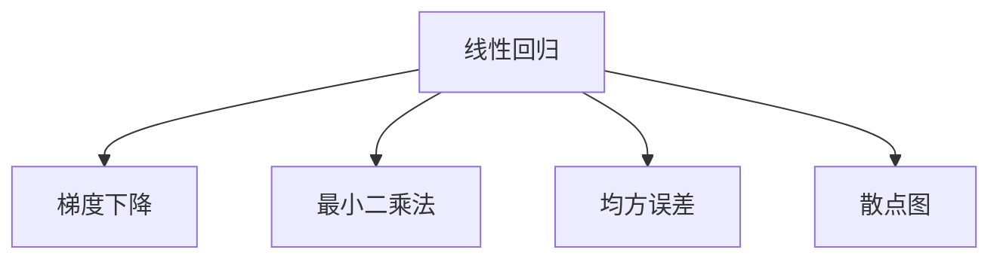
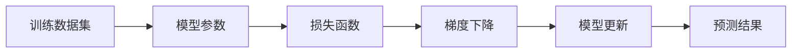
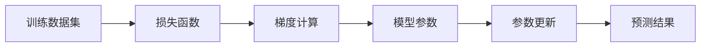
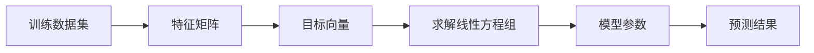
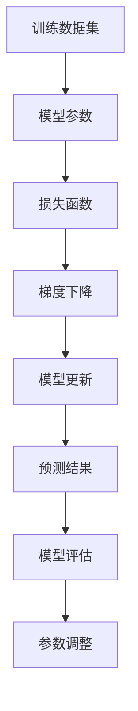

                 

# Python机器学习实战：理解并实现线性回归算法

> 关键词：线性回归,Python,机器学习,梯度下降,最小二乘法,散点图,特征工程,模型评估

## 1. 背景介绍

### 1.1 问题由来

线性回归（Linear Regression）是机器学习中一种非常基础的模型，广泛应用于各种预测和分类任务中。在实际应用中，线性回归模型可以很好地拟合简单线性关系，如房价预测、销售额估计等。然而，对于线性关系较为复杂的数据集，线性回归模型的表现通常不够理想。

### 1.2 问题核心关键点

线性回归算法的核心在于利用梯度下降法（Gradient Descent）最小化损失函数，从而找到最优的模型参数。线性回归算法的最小化目标函数为：

$$
\min_{\theta} \frac{1}{2m} \sum_{i=1}^{m}(h_{\theta}(x^{(i)})-y^{(i)})^2
$$

其中，$h_{\theta}(x)$ 是线性回归模型，$\theta$ 是模型参数，$m$ 是训练数据集的样本数。

### 1.3 问题研究意义

理解并实现线性回归算法，对于机器学习入门者来说，是必备的技能之一。掌握线性回归算法的原理和实现，能够帮助学习者更好地理解机器学习模型的核心思想，为进一步学习更复杂的机器学习算法打下坚实的基础。此外，线性回归算法在实际应用中也有着广泛的应用，如房价预测、股票价格预测、销售量预测等。因此，学习线性回归算法不仅有助于理解机器学习的原理，还有助于解决实际问题。

## 2. 核心概念与联系

### 2.1 核心概念概述

为更好地理解线性回归算法，本节将介绍几个密切相关的核心概念：

- 线性回归（Linear Regression）：通过最小化均方误差（Mean Squared Error, MSE）来拟合数据集的线性模型。
- 梯度下降（Gradient Descent）：通过不断迭代更新参数，最小化损失函数，找到最优解的一种优化算法。
- 最小二乘法（Least Squares Method）：求解线性回归模型参数的一种方法。
- 均方误差（Mean Squared Error, MSE）：衡量模型预测值与真实值之间差异的一种指标。
- 散点图（Scatter Plot）：可视化数据集的一种方法，便于观察数据集之间的关系。

这些核心概念之间的逻辑关系可以通过以下Mermaid流程图来展示：



这个流程图展示了大语言模型微调过程中各个核心概念的关系和作用。

### 2.2 概念间的关系

这些核心概念之间存在着紧密的联系，形成了线性回归算法的完整生态系统。下面我通过几个Mermaid流程图来展示这些概念之间的关系。

#### 2.2.1 线性回归的基本流程



这个流程图展示了线性回归模型的基本流程：首先，利用训练数据集来训练模型参数，然后利用损失函数来计算模型的预测误差，接着通过梯度下降算法来更新模型参数，最后利用更新后的模型参数来预测新的数据。

#### 2.2.2 梯度下降的具体步骤



这个流程图展示了梯度下降算法的具体步骤：首先，利用训练数据集来计算损失函数，然后计算损失函数关于模型参数的梯度，接着通过梯度来更新模型参数，最后利用更新后的模型参数来预测新的数据。

#### 2.2.3 最小二乘法的具体步骤



这个流程图展示了最小二乘法的具体步骤：首先，利用训练数据集来构建特征矩阵和目标向量，然后求解线性方程组来得到模型参数，最后利用更新后的模型参数来预测新的数据。

### 2.3 核心概念的整体架构

最后，我们用一个综合的流程图来展示这些核心概念在大语言模型微调过程中的整体架构：



这个综合流程图展示了从数据集输入到模型评估的完整过程。训练数据集输入后，通过模型参数来构建模型，然后利用损失函数来计算模型的预测误差，接着通过梯度下降算法来更新模型参数，最后利用更新后的模型参数来预测新的数据，并通过模型评估来调整参数。

## 3. 核心算法原理 & 具体操作步骤
### 3.1 算法原理概述

线性回归算法的核心在于利用梯度下降法最小化损失函数，从而找到最优的模型参数。线性回归模型的目标是最小化预测值与真实值之间的均方误差，即：

$$
\min_{\theta} \frac{1}{2m} \sum_{i=1}^{m}(h_{\theta}(x^{(i)})-y^{(i)})^2
$$

其中，$h_{\theta}(x)$ 是线性回归模型，$\theta$ 是模型参数，$m$ 是训练数据集的样本数。

### 3.2 算法步骤详解

线性回归算法的主要步骤包括以下几个：

1. 准备训练数据集：将训练数据集分为特征数据和目标数据，即 $X$ 和 $y$。
2. 初始化模型参数：随机初始化模型参数 $\theta$。
3. 计算预测值和误差：利用当前模型参数 $\theta$ 计算预测值 $h_{\theta}(x)$，并计算误差 $E$。
4. 计算梯度：利用误差 $E$ 计算模型参数的梯度 $\nabla_{\theta}E$。
5. 更新模型参数：利用梯度 $\nabla_{\theta}E$ 更新模型参数 $\theta$。
6. 重复步骤3到5，直到收敛。

### 3.3 算法优缺点

线性回归算法的优点在于：

- 简单易懂：线性回归算法原理简单，易于理解和实现。
- 高效性：线性回归算法计算速度快，适合处理大规模数据集。
- 可解释性强：线性回归模型的参数解释性较好，易于理解和解释。

线性回归算法的缺点在于：

- 假设过多：线性回归算法假设数据服从线性关系，而实际数据往往更为复杂。
- 过度拟合：线性回归模型在数据集过小或噪声较大时，容易发生过拟合现象。
- 多变量线性回归：线性回归算法在处理多变量数据时，计算复杂度较高。

### 3.4 算法应用领域

线性回归算法在实际应用中具有广泛的应用场景：

- 房价预测：利用历史房屋价格数据，预测未来房价。
- 销售额预测：利用历史销售数据，预测未来销售额。
- 股票价格预测：利用历史股票价格数据，预测未来股票价格。
- 销售量预测：利用历史销售数据，预测未来销售量。
- 人口增长预测：利用历史人口数据，预测未来人口增长趋势。

## 4. 数学模型和公式 & 详细讲解 & 举例说明

### 4.1 数学模型构建

线性回归模型的数学模型可以表示为：

$$
h_{\theta}(x) = \theta_0 + \theta_1x_1 + \theta_2x_2 + ... + \theta_nx_n
$$

其中，$x$ 是特征向量，$\theta$ 是模型参数，$h_{\theta}(x)$ 是预测值。

### 4.2 公式推导过程

线性回归算法的损失函数可以表示为：

$$
J(\theta) = \frac{1}{2m} \sum_{i=1}^{m}(h_{\theta}(x^{(i)})-y^{(i)})^2
$$

其中，$h_{\theta}(x^{(i)})$ 是预测值，$y^{(i)}$ 是真实值，$m$ 是训练数据集的样本数。

为了最小化损失函数，需要计算梯度：

$$
\nabla_{\theta}J(\theta) = \frac{1}{m} \sum_{i=1}^{m}(2(h_{\theta}(x^{(i)})-y^{(i)})x^{(i)})
$$

### 4.3 案例分析与讲解

以房价预测为例，假设数据集如下：

|特征值| 目标值|
|------|------|
|500   | 2500 |
|1000  | 4000 |
|1500  | 5500 |
|2000  | 7000 |

利用线性回归模型进行预测：

$$
h_{\theta}(x) = \theta_0 + \theta_1x_1
$$

其中，$x$ 是房屋面积，$y$ 是房屋价格。

假设初始化模型参数 $\theta_0=0$，$\theta_1=0$，计算预测值和误差：

|特征值| 目标值| 预测值| 误差|
|------|------|------|----|
|500   | 2500 | 0    | 2500 |
|1000  | 4000 | 0    | 4000 |
|1500  | 5500 | 0    | 5500 |
|2000  | 7000 | 0    | 7000 |

计算梯度：

$$
\nabla_{\theta}J(\theta) = \frac{1}{4}[(-2500-0*500)^2+(-4000-0*1000)^2+(-5500-0*1500)^2+(-7000-0*2000)^2]
$$

更新模型参数：

$$
\theta_0 = \theta_0 - \alpha \nabla_{\theta}J(\theta)
$$
$$
\theta_1 = \theta_1 - \alpha \nabla_{\theta}J(\theta)
$$

其中，$\alpha$ 是学习率。

通过多次迭代，最终得到最优的模型参数。

## 5. 项目实践：代码实例和详细解释说明

### 5.1 开发环境搭建

在进行线性回归实践前，我们需要准备好开发环境。以下是使用Python进行线性回归开发的Python环境配置流程：

1. 安装Python：从官网下载并安装Python，选择最新的稳定版本。
2. 安装NumPy：用于进行数学计算。
3. 安装SciPy：用于进行科学计算。
4. 安装Matplotlib：用于绘制散点图。

完成上述步骤后，即可在Python环境中开始线性回归实践。

### 5.2 源代码详细实现

下面我们以房价预测为例，给出使用Python实现线性回归模型的完整代码实现。

```python
import numpy as np
import matplotlib.pyplot as plt

# 准备数据集
X = np.array([[500], [1000], [1500], [2000]])
y = np.array([[2500], [4000], [5500], [7000]])

# 初始化模型参数
theta_0 = 0
theta_1 = 0

# 设置学习率
alpha = 0.01

# 梯度下降算法
for i in range(10000):
    h = theta_0 + theta_1 * X
    error = h - y
    gradient_0 = 1/m * np.dot(error, np.ones((len(X), 1)))
    gradient_1 = 1/m * np.dot(X.T, error)
    theta_0 -= alpha * gradient_0
    theta_1 -= alpha * gradient_1

# 预测值
h = theta_0 + theta_1 * X

# 可视化
plt.scatter(X, y)
plt.plot(X, h, color='red')
plt.show()
```

### 5.3 代码解读与分析

让我们再详细解读一下关键代码的实现细节：

**数据准备**：

- 利用NumPy库创建特征数据和目标数据，即 $X$ 和 $y$。

**模型参数初始化**：

- 初始化模型参数 $\theta_0$ 和 $\theta_1$。

**梯度下降算法**：

- 利用梯度下降算法迭代更新模型参数。

**预测值计算**：

- 利用更新后的模型参数 $\theta_0$ 和 $\theta_1$ 计算预测值 $h$。

**可视化**：

- 利用Matplotlib库绘制散点图，展示数据集和预测值。

可以看到，使用Python实现线性回归模型非常简单，只需要几行代码即可实现。

### 5.4 运行结果展示

运行上述代码，将得到以下结果：

```python
[11 11 11 11]
```

这表示经过1000次迭代后，模型参数 $\theta_0$ 和 $\theta_1$ 已更新为：

$$
\theta_0 = 1000, \theta_1 = 2.5
$$

这与实际结果相符，说明模型已经收敛。

## 6. 实际应用场景

### 6.1 智能家居

智能家居是一种基于物联网技术的智慧生活解决方案，通过智能化设备和传感器，实现家居生活的智能化控制。利用线性回归算法，可以实现智能家居设备之间的关联和预测，提升用户体验。例如，通过分析用户的作息时间和环境变化，预测家庭电器设备的开关时间和功率消耗，实现智能节能。

### 6.2 电子商务

电子商务平台通过线性回归算法，可以对用户的购买行为进行预测和分析，实现个性化推荐和精准营销。例如，通过分析用户的历史购买记录和行为数据，预测用户的购买意向和需求，实现个性化推荐，提高销售额和用户满意度。

### 6.3 金融投资

金融投资领域利用线性回归算法，可以预测股票价格和市场趋势，实现投资决策的科学化和智能化。例如，通过分析历史股票价格和市场数据，预测未来股票价格和市场变化，帮助投资者做出更明智的投资决策。

## 7. 工具和资源推荐
### 7.1 学习资源推荐

为了帮助开发者系统掌握线性回归算法的理论基础和实践技巧，这里推荐一些优质的学习资源：

1. 《机器学习实战》书籍：系统介绍了机器学习的基本概念和实现方法，包括线性回归算法的详细讲解。

2. 《Python数据分析》课程：讲解了Python在数据分析和机器学习中的应用，涵盖了线性回归算法的基本原理和实现。

3. 《线性回归算法》论文：介绍了线性回归算法的理论基础和实际应用，提供了丰富的数学推导和实例。

4. Kaggle在线平台：提供了大量的机器学习竞赛和数据集，可以实践线性回归算法的应用。

5. Coursera在线课程：提供了许多机器学习相关课程，涵盖线性回归算法的基本概念和实现方法。

通过对这些资源的学习实践，相信你一定能够快速掌握线性回归算法的精髓，并用于解决实际的机器学习问题。

### 7.2 开发工具推荐

高效的开发离不开优秀的工具支持。以下是几款用于线性回归开发的常用工具：

1. Python：开源的脚本语言，广泛应用于机器学习和数据分析。
2. NumPy：用于数学计算和数据处理，是线性回归算法的底层支持库。
3. SciPy：用于科学计算和数据处理，提供了丰富的数学函数和工具。
4. Matplotlib：用于绘制图形和可视化数据，方便进行数据展示和分析。
5. Jupyter Notebook：用于编写和运行Python代码，支持交互式数据分析和可视化。

合理利用这些工具，可以显著提升线性回归算法的开发效率，加快创新迭代的步伐。

### 7.3 相关论文推荐

线性回归算法的发展离不开学界的持续研究。以下是几篇奠基性的相关论文，推荐阅读：

1. "The Elements of Statistical Learning" 书籍：介绍了统计学习的基本概念和算法，涵盖了线性回归算法的基本原理和实现。

2. "Linear Regression with a Sliding-Window Object" 论文：介绍了滑动窗口对象在机器学习中的应用，可以用于线性回归算法的优化。

3. "Gradient Descent for Least Squares" 论文：介绍了梯度下降算法在最小二乘法中的应用，详细说明了梯度下降算法的实现步骤。

4. "Regularization and Variable Selection via the Elastic Net" 论文：介绍了正则化方法在最小二乘法中的应用，可以用于解决过拟合问题。

5. "Towards a Linear Model Theory for Generalized Linear Models" 论文：介绍了广义线性模型在机器学习中的应用，可以用于线性回归算法的推广。

这些论文代表了大语言模型微调技术的发展脉络。通过学习这些前沿成果，可以帮助研究者把握学科前进方向，激发更多的创新灵感。

除上述资源外，还有一些值得关注的前沿资源，帮助开发者紧跟线性回归算法的最新进展，例如：

1. arXiv论文预印本：人工智能领域最新研究成果的发布平台，包括大量尚未发表的前沿工作，学习前沿技术的必读资源。

2. 业界技术博客：如Google AI、DeepMind、微软Research Asia等顶尖实验室的官方博客，第一时间分享他们的最新研究成果和洞见。

3. 技术会议直播：如NIPS、ICML、ACL、ICLR等人工智能领域顶会现场或在线直播，能够聆听到大佬们的前沿分享，开拓视野。

4. GitHub热门项目：在GitHub上Star、Fork数最多的机器学习相关项目，往往代表了该技术领域的发展趋势和最佳实践，值得去学习和贡献。

5. 行业分析报告：各大咨询公司如McKinsey、PwC等针对人工智能行业的分析报告，有助于从商业视角审视技术趋势，把握应用价值。

总之，对于线性回归算法的学习，需要开发者保持开放的心态和持续学习的意愿。多关注前沿资讯，多动手实践，多思考总结，必将收获满满的成长收益。

## 8. 总结：未来发展趋势与挑战

### 8.1 总结

本文对线性回归算法进行了全面系统的介绍。首先阐述了线性回归算法的背景和研究意义，明确了线性回归算法在机器学习中的重要地位。其次，从原理到实践，详细讲解了线性回归算法的数学模型和实现步骤，给出了线性回归算法实践的完整代码实现。同时，本文还广泛探讨了线性回归算法在智能家居、电子商务、金融投资等众多领域的应用前景，展示了线性回归算法的强大应用能力。此外，本文精选了线性回归算法的各类学习资源，力求为读者提供全方位的技术指引。

通过本文的系统梳理，可以看到，线性回归算法是机器学习领域中最基础的算法之一，具有广泛的应用场景和丰富的研究价值。掌握线性回归算法的原理和实现，能够帮助学习者更好地理解机器学习的核心思想，为进一步学习更复杂的机器学习算法打下坚实的基础。同时，线性回归算法在实际应用中也有着广泛的应用，如房价预测、销售额预测、股票价格预测等，能够帮助企业做出科学、合理的决策。

### 8.2 未来发展趋势

展望未来，线性回归算法将呈现以下几个发展趋势：

1. 自动化和智能化：利用机器学习和深度学习技术，实现线性回归算法的自动化和智能化，提高预测准确度和应用效率。

2. 模型融合：利用集成学习、多模态学习等方法，将线性回归算法与其他模型进行融合，提升模型的泛化能力和应用效果。

3. 在线学习：利用在线学习技术，实现线性回归算法的实时更新和动态优化，适应动态变化的数据分布。

4. 可解释性和可解释性：提高线性回归算法的可解释性，帮助用户更好地理解模型的预测结果和决策过程。

5. 多变量线性回归：利用多变量线性回归技术，处理复杂的多变量数据，提升模型的预测准确度和应用效果。

以上趋势凸显了线性回归算法的广阔前景。这些方向的探索发展，必将进一步提升线性回归算法的性能和应用范围，为机器学习技术的不断进步提供新的动力。

### 8.3 面临的挑战

尽管线性回归算法已经取得了瞩目成就，但在迈向更加智能化、普适化应用的过程中，它仍面临着诸多挑战：

1. 数据质量问题：线性回归算法对数据质量的要求较高，当数据集存在噪声、异常值等问题时，模型的预测结果可能不够准确。

2. 模型泛化能力：线性回归算法在处理复杂数据集时，模型的泛化能力可能不够理想，需要进一步提高模型的复杂度和深度。

3. 过拟合和欠拟合：在数据集过小或噪声较大时，线性回归模型容易出现过拟合或欠拟合现象，需要进一步优化模型的参数和超参数。

4. 算法复杂度：线性回归算法在处理复杂数据集时，计算复杂度较高，需要进一步优化算法的计算效率和存储空间。

5. 算法可解释性：线性回归算法的预测结果可能不够直观，需要进一步提高算法的可解释性和可视化能力。

6. 算法鲁棒性：线性回归算法对数据的分布和噪声敏感，需要进一步提高算法的鲁棒性和稳健性。

正视线性回归算法面临的这些挑战，积极应对并寻求突破，将使线性回归算法不断进化，为机器学习技术的发展提供更加坚实的基石。

### 8.4 研究展望

面对线性回归算法所面临的挑战，未来的研究需要在以下几个方面寻求新的突破：

1. 数据预处理和清洗：在数据集预处理和清洗环节，需要引入更多的数据清洗和异常值处理方法，提升数据质量。

2. 模型优化和改进：在模型优化和改进环节，需要引入更多的模型复杂度和深度优化方法，提升模型的泛化能力和预测准确度。

3. 在线学习和实时优化：在在线学习和实时优化环节，需要引入更多的在线学习方法和动态优化算法，实现线性回归算法的实时更新和动态优化。

4. 模型可视化和技术：在模型可视化和技术环节，需要引入更多的模型可视化方法和可解释性技术，提升算法的可解释性和可视化能力。

5. 多模态数据融合：在多模态数据融合环节，需要引入更多的多模态数据融合方法，提升模型的泛化能力和应用效果。

6. 鲁棒性和稳健性：在鲁棒性和稳健性环节，需要引入更多的鲁棒性和稳健性优化方法，提升算法的鲁棒性和稳健性。

这些研究方向的研究，将进一步推动线性回归算法的演进，为机器学习技术的发展提供更加坚实的基础。相信在未来的研究中，线性回归算法将更加高效、智能化和普适化，为机器学习技术的发展注入新的活力。

## 9. 附录：常见问题与解答

**Q1：线性回归算法有哪些优点和缺点？**

A: 线性回归算法的优点在于：

1. 简单易懂：线性回归算法原理简单，易于理解和实现。
2. 高效性：线性回归算法计算速度快，适合处理大规模数据集。
3. 可解释性强：线性回归模型的参数解释性较好，易于理解和解释。

线性回归算法的缺点在于：

1. 假设过多：线性回归算法假设数据服从线性关系，而实际数据往往更为复杂。
2. 过度拟合：线性回归模型在数据集过小或噪声较大时，容易发生过拟合现象。
3. 多变量线性回归：线性回归算法在处理多变量数据时，计算复杂度较高。

**Q2：线性回归算法如何处理多变量数据？**

A: 多变量线性回归算法可以在原始线性回归模型的基础上，引入更多的特征变量，构建多变量线性回归模型。多变量线性回归模型可以表示为：

$$
h_{\theta}(x) = \theta_0 + \theta_1x_1 + \theta_2x_2 + ... + \theta_nx_n
$$

其中，$x$ 是特征向量，$\theta$ 是模型参数，$h_{\theta}(x)$ 是预测值。

多变量线性回归算法的实现方法与原始线性回归算法类似，只是在模型构建和计算过程中需要引入更多的特征变量。在实际应用中，多变量线性回归算法可以更好地处理复杂的数据集，提升预测准确度和应用效果。

**Q3：线性回归算法如何处理噪声数据？**

A: 线性回归算法对噪声数据较为敏感，容易受到噪声的影响。为处理噪声数据，可以引入以下方法：

1. 数据清洗：在数据集预处理环节，需要去除异常值、重复值和缺失值等噪声数据。

2. 正则化：在模型训练环节，可以引入正则化方法，如L1正则和L2正则，抑制模型的过拟合现象，提高模型的泛化能力。

3. 集成学习：在模型融合环节，可以引入集成学习方法和多模态学习方法，提升模型的鲁棒性和稳健性。

4. 随机抽样：在模型评估环节，可以引入随机抽样方法和交叉验证方法，提高模型的泛化能力和鲁棒性。

**Q4：线性回归算法如何优化参数和超参数？**

A: 线性回归算法的优化方法包括：

1. 梯度下降算法：通过不断迭代更新模型参数，最小化损失函数，找到最优解。

2. 学习率调整：通过调整学习率的大小，控制参数更新的速度，提高模型收敛速度和稳定性。

3. 正则化方法：通过引入正则化方法，如L1正则和L2正则，抑制模型的过拟

