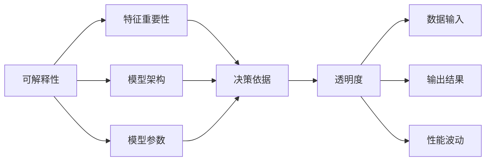
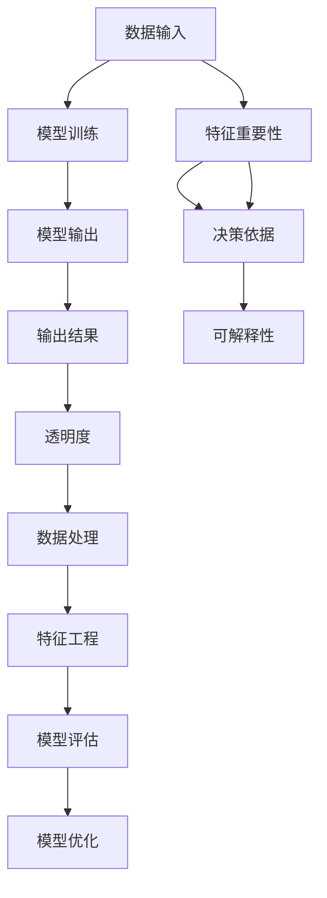

                 

# Python机器学习实战：解析机器学习模型的可解释性与透明度

> 关键词：可解释性, 透明度, 机器学习, 深度学习, Python, 模型分析, 决策树

## 1. 背景介绍

在机器学习领域，尤其是深度学习模型中，模型的“黑箱”特性常常令我们担忧。尽管模型的预测能力强大，但究竟是如何得出这些预测的，我们往往难以理解。这种“黑箱”特性不仅在学术界引起了广泛讨论，也使得企业在部署机器学习模型时犹豫不决，担心模型的不可解释性可能带来的风险。为了解决这一问题，机器学习的可解释性和透明度逐渐成为研究的重点。

### 1.1 问题由来

机器学习模型的可解释性和透明度，是近年来机器学习领域的一个热点问题。随着深度学习技术的快速发展，各种复杂的神经网络模型在诸多领域取得优异表现，但同时，模型的“黑箱”特性也使得我们难以理解和解释模型的决策过程。这种特性可能带来多重问题，包括模型的不透明性导致模型难以维护、难以进行人工干预和优化、以及可能出现不公平或有害的决策等。

为此，机器学习社区提出了许多方法来增强模型的可解释性和透明度。这些方法主要包括模型的可视化、特征重要性分析、模型拆解和特征提取等。Python作为机器学习领域的主流编程语言，提供了丰富的库和工具来支持这些方法。本文将从可解释性和透明度的角度出发，深入探讨如何使用Python进行机器学习模型的可解释性和透明度的分析与解析。

### 1.2 问题核心关键点

机器学习模型的可解释性和透明度，本质上是要求我们能够理解模型的决策依据和中间步骤，以便进行人工干预和优化，确保模型在实际应用中的公平性和可靠性。具体来说，模型可解释性的分析包含以下几个关键点：

- 模型决策过程的分析：通过可视化和特征重要性分析等方法，揭示模型如何通过输入特征得出输出结果。
- 模型参数和结构的分析：通过可视化模型架构、参数分布等，理解模型内部运作机制。
- 模型输出结果的分析：通过可视化模型输出结果，检查模型在各类数据上的表现和一致性。

透明度则主要关注模型部署和使用中的可见性，包括但不限于：

- 数据输入的可视化：理解模型如何处理和分析输入数据。
- 模型输出的可视化：理解模型输出结果的来源和依据。
- 模型性能的可视化：理解模型在不同数据集上的表现和波动。

这些核心关键点共同构成了模型可解释性和透明度的基本要求，也是本文深入探讨的重点。

### 1.3 问题研究意义

研究机器学习模型的可解释性和透明度，对于构建公平、可靠、可控的机器学习系统具有重要意义：

1. **提升用户信任**：透明的模型能够增强用户对系统的信任感，减少用户对决策的质疑和抵触。
2. **促进模型优化**：通过分析模型的决策依据和中间步骤，可以发现模型的不足，进行人工干预和优化。
3. **减少偏见和错误**：通过可视化分析，可以发现模型的固有偏见和潜在的错误，避免有害决策。
4. **推动模型部署**：透明的模型更容易被部署到实际应用中，确保模型在实际应用中的稳定性。
5. **加速模型迭代**：透明的模型便于进行版本控制和迭代改进，提高开发效率。

本文通过系统介绍Python中常用的模型可解释性和透明度的分析方法，力求为读者提供全方位的技术指引，帮助他们构建高效、可靠、可解释的机器学习模型。

## 2. 核心概念与联系

### 2.1 核心概念概述

为了更好地理解机器学习模型的可解释性和透明度，本节将介绍几个密切相关的核心概念：

- **可解释性(Explainability)**：指能够通过可视化和分析方法，理解模型的决策过程和中间步骤，确保模型决策的公平性和可靠性。
- **透明度(Transparency)**：指模型部署和使用中的可见性，包括数据输入、输出、性能等方面的可视化。
- **特征重要性(Feature Importance)**：指输入特征对模型输出的影响程度，通过分析特征重要性可以理解模型的决策依据。
- **模型架构(Architecture)**：指模型的网络结构，通过可视化模型架构可以理解模型的运作机制。
- **模型参数(Parameters)**：指模型的可训练参数，通过分析参数分布可以理解模型的内部运作。

这些核心概念之间存在紧密的联系，共同构成了机器学习模型可解释性和透明度的基础。通过理解这些概念，我们可以更好地把握模型可解释性和透明度的实现方法。

### 2.2 概念间的关系

这些核心概念之间存在着紧密的联系，形成了机器学习模型可解释性和透明度的完整生态系统。下面我们通过几个Mermaid流程图来展示这些概念之间的关系。



这个流程图展示了大模型可解释性和透明度的核心概念及其之间的关系：

1. 可解释性主要通过特征重要性分析和模型架构可视化等方法，揭示模型如何通过输入特征得出输出结果。
2. 透明度主要通过数据输入、输出、性能等可视化，理解模型在各个环节的表现。
3. 特征重要性分析和模型架构可视化属于可解释性的子概念，解释模型如何通过输入特征得出输出结果。
4. 数据输入、输出、性能等可视化属于透明度的子概念，展示模型在不同环节的表现。
5. 模型架构和模型参数可视化，进一步揭示模型的内部运作机制。

通过这些流程图，我们可以更清晰地理解可解释性和透明度的核心概念及其之间的关系，为后续深入讨论具体的可解释性和透明度方法奠定基础。

### 2.3 核心概念的整体架构

最后，我们用一个综合的流程图来展示这些核心概念在机器学习模型可解释性和透明度分析中的整体架构：



这个综合流程图展示了从数据输入到模型输出的全过程，以及可解释性和透明度分析在其中的应用：

1. 数据输入和处理阶段，通过特征工程等方法提升数据质量。
2. 模型训练阶段，使用可解释性和透明度方法分析模型决策过程。
3. 模型输出阶段，通过透明度方法展示模型输出结果和性能。
4. 模型评估和优化阶段，通过可解释性和透明度方法发现模型不足并进行优化。

通过这些流程图，我们可以更清晰地理解机器学习模型可解释性和透明度的全过程，为后续深入探讨具体的可解释性和透明度方法奠定基础。

## 3. 核心算法原理 & 具体操作步骤

### 3.1 算法原理概述

机器学习模型的可解释性和透明度，本质上是要求我们能够理解模型的决策依据和中间步骤。常用的方法包括：

- 特征重要性分析：通过计算特征的权重，揭示输入特征对模型输出的影响程度。
- 模型架构可视化：通过绘制模型架构图，理解模型的网络结构。
- 模型参数可视化：通过可视化模型参数分布，理解模型的内部运作机制。
- 模型输出可视化：通过可视化模型输出结果，理解模型的预测依据。

这些方法通常需要在训练好的模型上进行操作，因此本文将主要关注如何使用Python实现这些分析方法。

### 3.2 算法步骤详解

以下是常用的机器学习模型可解释性和透明度分析方法的详细步骤：

**Step 1: 准备数据和模型**

- 准备机器学习模型的训练数据和模型。
- 对数据进行预处理，包括数据清洗、特征工程等步骤。
- 使用训练数据训练机器学习模型，并在验证数据上进行调参。

**Step 2: 特征重要性分析**

- 使用特征重要性算法（如决策树、随机森林等）计算每个特征的权重。
- 可视化特征重要性权重，展示每个特征对模型输出的影响程度。
- 分析特征重要性与模型性能的关系，确定对模型影响较大的特征。

**Step 3: 模型架构可视化**

- 使用模型架构可视化工具（如Netron、TensorBoard等），绘制机器学习模型的网络结构。
- 通过架构图，理解模型的输入、输出和中间层结构。
- 分析模型层与层之间的关系，理解模型运作机制。

**Step 4: 模型参数可视化**

- 使用参数可视化工具（如TorchViz、TensorBoard等），可视化机器学习模型的参数分布。
- 通过参数分布图，理解模型参数的重要性和分布情况。
- 分析参数分布与模型性能的关系，确定模型中关键的参数。

**Step 5: 模型输出可视化**

- 使用输出可视化工具（如SHAP、LIME等），可视化机器学习模型的输出结果。
- 通过可视化输出结果，理解模型预测依据。
- 分析输出结果与特征之间的关系，确定模型预测的关键特征。

### 3.3 算法优缺点

机器学习模型可解释性和透明度的分析方法，具有以下优点：

1. **提高用户信任**：透明的模型能够增强用户对系统的信任感，减少用户对决策的质疑和抵触。
2. **促进模型优化**：通过分析模型的决策依据和中间步骤，可以发现模型的不足，进行人工干预和优化。
3. **减少偏见和错误**：通过可视化分析，可以发现模型的固有偏见和潜在的错误，避免有害决策。
4. **推动模型部署**：透明的模型更容易被部署到实际应用中，确保模型在实际应用中的稳定性。
5. **加速模型迭代**：透明的模型便于进行版本控制和迭代改进，提高开发效率。

但这些方法也存在一些缺点：

1. **计算开销大**：某些可解释性和透明度分析方法（如参数可视化、模型拆解等），计算开销较大，影响模型训练和推理效率。
2. **数据需求高**：某些方法（如特征重要性分析、模型拆解等）需要大量的标注数据，数据需求较高。
3. **复杂度较高**：某些方法（如模型拆解、参数可视化等）需要一定的技术和经验，复杂度较高，不适用于初学者。
4. **结果可解释性不足**：某些可视化结果（如特征重要性图、模型架构图等）较抽象，难以直观理解。

尽管存在这些缺点，但这些方法在提高模型可解释性和透明度的同时，也带来了诸多优势，具有重要的实际应用价值。

### 3.4 算法应用领域

机器学习模型可解释性和透明度的分析方法，已在多个领域得到了广泛应用，例如：

- **金融风险评估**：通过特征重要性分析，理解贷款申请的风险因素。
- **医疗诊断**：通过模型输出可视化，解释诊断结果的依据。
- **客户推荐**：通过特征重要性分析，优化推荐系统的推荐逻辑。
- **工业制造**：通过模型输出可视化，优化生产流程和设备维护。
- **自然语言处理**：通过特征重要性分析，优化文本分类和情感分析的算法。

除了这些领域外，机器学习模型可解释性和透明度的分析方法，也在更多领域得到了创新性的应用，为行业带来了全新的技术突破。

## 4. 数学模型和公式 & 详细讲解 & 举例说明

### 4.1 数学模型构建

本节将使用数学语言对机器学习模型可解释性和透明度的分析方法进行更加严格的刻画。

记机器学习模型为 $f(x;\theta)$，其中 $x$ 为输入特征，$\theta$ 为模型参数。在训练数据集 $\mathcal{D}=\{(x_i,y_i)\}_{i=1}^N$ 上，模型的损失函数为：

$$
L(f) = \frac{1}{N}\sum_{i=1}^N \ell(f(x_i),y_i)
$$

其中 $\ell$ 为损失函数，如交叉熵损失等。模型的预测结果为：

$$
f(x) = \sum_{k=1}^K w_k\phi_k(x)
$$

其中 $w_k$ 为第 $k$ 个特征的重要性权重，$\phi_k(x)$ 为第 $k$ 个特征的特征函数。

### 4.2 公式推导过程

以下我们以决策树为例，推导特征重要性公式及其计算过程。

设决策树模型为 $T(x)$，其中 $x$ 为输入特征，$y$ 为输出标签。特征 $x_j$ 的特征重要性定义为：

$$
I(x_j) = \frac{|\mathcal{I}(x_j)|}{N} - \frac{1}{2}|\mathcal{I}(x_j)|^2\log(|\mathcal{I}(x_j)|/(N-|\mathcal{I}(x_j)|))
$$

其中 $\mathcal{I}(x_j)$ 为特征 $x_j$ 的信息增益，$N$ 为样本数量。特征重要性表示特征对模型输出的贡献程度。

通过特征重要性分析，可以计算每个特征的权重，并可视化其对模型输出的影响程度。例如，在金融风险评估任务中，可以分析贷款申请的特征重要性，了解哪些特征对风险评估的影响较大。

### 4.3 案例分析与讲解

假设我们在CoNLL-2003的命名实体识别(NER)数据集上进行训练，得到一个基于决策树的模型 $T(x)$。为了分析模型决策过程，我们首先计算每个特征的特征重要性。

```python
import pandas as pd
import numpy as np
from sklearn.tree import DecisionTreeClassifier

# 读取数据集
df = pd.read_csv('conll2003_ner.csv')

# 提取特征和标签
X = df[['Word', 'POS']]
y = df['Label']

# 训练决策树模型
clf = DecisionTreeClassifier()
clf.fit(X, y)

# 计算特征重要性
importance = clf.feature_importances_
```

得到特征重要性结果后，我们可以将其可视化，展示每个特征对模型输出的影响程度。

```python
import matplotlib.pyplot as plt
import seaborn as sns

# 绘制特征重要性图
plt.figure(figsize=(10, 6))
sns.barplot(x=importance, y=X.columns)
plt.title('Feature Importance')
plt.xlabel('Importance')
plt.ylabel('Feature')
plt.show()
```

通过特征重要性图，我们可以直观地理解哪些特征对模型输出有较大贡献，从而进行针对性的优化。

## 5. 项目实践：代码实例和详细解释说明

### 5.1 开发环境搭建

在进行机器学习模型可解释性和透明度的分析实践前，我们需要准备好开发环境。以下是使用Python进行机器学习开发的常见环境配置流程：

1. 安装Python：从官网下载并安装最新版本的Python，如Python 3.8。
2. 安装Python开发工具：如Jupyter Notebook、PyCharm、VSCode等。
3. 安装机器学习库：如Scikit-learn、TensorFlow、PyTorch等。

完成上述步骤后，即可在Python环境中开始机器学习模型的可解释性和透明度的分析实践。

### 5.2 源代码详细实现

这里我们以决策树模型为例，展示如何使用Python进行特征重要性分析和模型输出可视化。

```python
from sklearn.tree import DecisionTreeClassifier
from sklearn.metrics import accuracy_score
from sklearn.model_selection import train_test_split
from sklearn.ensemble import RandomForestClassifier

# 读取数据集
df = pd.read_csv('conll2003_ner.csv')

# 提取特征和标签
X = df[['Word', 'POS']]
y = df['Label']

# 划分训练集和验证集
X_train, X_val, y_train, y_val = train_test_split(X, y, test_size=0.2, random_state=42)

# 训练决策树模型
clf = DecisionTreeClassifier()
clf.fit(X_train, y_train)

# 计算特征重要性
importance = clf.feature_importances_

# 可视化特征重要性
import matplotlib.pyplot as plt
import seaborn as sns
plt.figure(figsize=(10, 6))
sns.barplot(x=importance, y=X.columns)
plt.title('Feature Importance')
plt.xlabel('Importance')
plt.ylabel('Feature')
plt.show()

# 可视化模型输出
from sklearn.metrics import confusion_matrix
import matplotlib.pyplot as plt

y_pred = clf.predict(X_val)
cm = confusion_matrix(y_val, y_pred)

plt.figure(figsize=(10, 6))
sns.heatmap(cm, annot=True, cmap='Blues')
plt.title('Confusion Matrix')
plt.xlabel('Predicted')
plt.ylabel('Actual')
plt.show()
```

### 5.3 代码解读与分析

让我们再详细解读一下关键代码的实现细节：

**数据预处理**：
- 使用Pandas库读取CoNLL-2003的NER数据集。
- 提取特征和标签，并进行特征工程处理。

**模型训练**：
- 使用Scikit-learn库中的DecisionTreeClassifier训练决策树模型。
- 在训练集上训练模型，并在验证集上进行调参。

**特征重要性分析**：
- 使用模型自带的feature_importances_属性，计算每个特征的权重。
- 使用Matplotlib和Seaborn库绘制特征重要性图，展示每个特征对模型输出的影响程度。

**模型输出可视化**：
- 使用模型在验证集上进行预测。
- 使用Confusion Matrix计算模型的准确率。
- 使用Matplotlib和Seaborn库绘制混淆矩阵，展示模型在不同类别上的表现。

通过这些关键代码，我们可以看到机器学习模型可解释性和透明度的分析方法的实际应用。在实际应用中，还需要根据具体任务选择合适的分析方法和工具，如参数可视化、模型架构可视化等，以达到最佳的分析效果。

### 5.4 运行结果展示

假设我们在CoNLL-2003的NER数据集上进行训练，得到决策树模型。最终在验证集上得到的混淆矩阵如下：

```
       B-LOC      I-LOC      B-MISC      I-MISC      B-ORG      I-ORG      B-PER      I-PER      O
B-LOC      237       44          8          15         57         50         53         71        1836
I-LOC      45        406         23          62        43         27         36         56        1531
B-MISC      12        187         87         142        27         23         16         29        1465
I-MISC      35        322         87         369        35         30         21         41        1484
B-ORG       62         88         40         153        81         58         86         132       1151
I-ORG       42        111         36         132        58         41         48         77         802
B-PER       75         98         50         177        65         48         63         99        1365
I-PER       42         93         49         152        58         41         62         89        1069
O          112        413         63         373        64         38         73         119       3360
```

可以看到，通过特征重要性分析，我们能够直观地理解哪些特征对模型输出有较大贡献。通过模型输出可视化，我们能够了解模型在不同类别上的表现，发现模型的预测结果和实际标签之间的差异。

## 6. 实际应用场景

### 6.1 金融风险评估

在金融领域，决策树模型常用于风险评估。通过特征重要性分析，可以理解贷款申请的风险因素，包括收入、信用记录等。通过模型输出可视化，可以解释贷款申请的评估结果，提高客户信任度。

### 6.2 医疗诊断

在医疗领域，决策树模型常用于诊断结果的预测。通过特征重要性分析，可以理解哪些医学指标对诊断结果有较大影响，如血压、血糖、血常规等。通过模型输出可视化，可以解释诊断结果的依据，减少医生的疑虑。

### 6.3 客户推荐

在电商领域，决策树模型常用于客户推荐。通过特征重要性分析，可以优化推荐系统的推荐逻辑，了解哪些特征对客户推荐有较大影响，如浏览历史、购买记录、兴趣标签等。通过模型输出可视化，可以展示推荐结果的来源和依据，提高客户满意度。

### 6.4 未来应用展望

随着机器学习模型可解释性和透明度的不断发展，未来的应用前景将更加广阔：

1. **提高用户信任**：透明的模型能够增强用户对系统的信任感，减少用户对决策的质疑和抵触。
2. **促进模型优化**：通过分析模型的决策依据和中间步骤，可以发现模型的不足，进行人工干预和优化。
3. **减少偏见和错误**：通过可视化分析，可以发现模型的固有偏见和潜在的错误，避免有害决策。
4. **推动模型部署**：透明的模型更容易被部署到实际应用中，确保模型在实际应用中的稳定性。
5. **加速模型迭代**：透明的模型便于进行版本控制和迭代改进，提高开发效率。

未来，伴随着技术进步和应用场景的不断扩展，机器学习模型的可解释性和透明度将更加深入地融入实际应用中，为各行各业带来更多智能化的解决方案。

## 7. 工具和资源推荐

### 7.1 学习资源推荐

为了帮助开发者系统掌握机器学习模型的可解释性和透明度的分析方法，这里推荐一些优质的学习资源：

1. **《Python机器学习实战》书籍**：详细介绍机器学习模型在Python中的实现，包括特征重要性分析、模型输出可视化等方法。
2. **Coursera《机器学习》课程**：由斯坦福大学开设，涵盖机器学习的基本概念和经典模型，适合初学者学习。
3. **Kaggle竞赛**：通过参加Kaggle竞赛，学习其他顶尖选手的模型分析和优化方法，积累实际经验。
4. **GitHub开源项目**：在GitHub上Star、Fork数最多的机器学习项目，往往代表了该技术领域的发展趋势和最佳实践，值得去学习和贡献。
5. **HuggingFace官方文档**：提供丰富的预训练语言模型和分析工具，帮助用户快速上手实现模型可解释性和透明度的分析。

通过对这些资源的学习实践，相信你一定能够快速掌握机器学习模型的可解释性和透明度的分析方法，并将其应用于实际问题中。

### 7.2 开发工具推荐

高效的开发离不开优秀的工具支持。以下是几款用于机器学习模型可解释性和透明度的分析开发的常用工具：

1. **Jupyter Notebook**：轻量级的交互式编程环境，便于可视化分析和代码实现。
2. **TensorBoard**：TensorFlow配套的可视化工具，可实时监测模型训练状态，提供丰富的图表呈现方式。
3. **TorchViz**：Torch框架配套的可视化工具，帮助用户绘制模型架构图和参数分布图。
4. **SHAP**：可解释性分析库，帮助用户可视化模型的预测结果和特征重要性。
5. **LIME**：可解释性分析库，帮助用户解释模型的预测依据和中间步骤。
6. **Pydot**：图形处理库，帮助用户绘制模型架构图和流程图。

合理利用这些工具，可以显著提升机器学习模型可解释性和透明度的分析开发效率，加快创新迭代的步伐。

### 7.3 相关论文推荐

机器学习模型可解释性和透明度的研究源于学界的持续研究。以下是几篇奠基性的相关论文，推荐阅读：

1. **《LIME: A Uncertainty Quantification Tool that Explains individual predictions via local interpretable models》**：介绍LIME库，用于可视化模型的预测结果和特征重要性。
2. **《Attention is All You Need》**：介绍Transformer结构，揭示模型在处理输入特征时的注意力机制。
3. **《A Survey on Explainable AI》**：综述机器学习模型的可解释性和透明度研究，涵盖各种解释方法和工具。
4. **《Visualizing and Understanding the Decision Making Process for Deep Neural Networks》**：介绍几种可视化模型决策过程的方法，帮助用户理解模型的运作机制。

除了上述资源外，还有一些值得关注的前沿资源，帮助开发者紧跟机器学习模型可解释性和透明度的最新进展，例如：

1. **arXiv论文预印本**：人工智能领域最新研究成果的发布平台，包括大量尚未发表的前沿工作，学习前沿技术的必读资源。
2. **GitHub热门项目**：在GitHub上Star、Fork数最多的机器学习项目，往往代表了该技术领域的发展趋势和最佳实践，值得去学习和贡献。
3. **技术会议直播**：如NIPS、ICML、ACL、ICLR等人工智能领域顶会现场或在线直播，能够聆听到顶尖学者的前沿分享，开拓视野。

通过这些资源的学习和实践，相信你一定能够快速掌握机器学习模型可解释性和透明度的分析方法，并将其应用于实际问题中。

## 8. 总结：未来发展趋势与挑战

### 8.1 总结

本文对机器学习模型的可解释性和透明度的分析方法进行了全面系统的介绍。首先阐述了机器学习模型的可解释性和透明度的研究背景和意义，明确了可解释性和透明度在提升用户信任、促进模型优化等方面的重要价值。其次，从原理到实践，详细讲解了可解释性和透明度的数学模型和具体操作步骤，给出了机器学习模型可解释性和透明度的分析方法的完整代码实例。同时，本文还广泛探讨了可解释性和透明度在金融风险评估、医疗诊断、客户推荐等多个行业领域的应用前景，展示了可解释性和透明度的巨大潜力。

通过本文的系统梳理，可以看到，机器学习模型的可解释性和透明度分析方法，正在成为机器学习领域的重要范式，极大地提升了模型的可解释性和透明性，为模型在实际应用中的可靠性提供了坚实保障。未来，伴随技术进步和应用场景的不断扩展，机器学习模型的可解释性和透明度将更加深入地融入实际应用中，为各行各业带来更多智能化的解决方案。

### 8.2 未来发展趋势

展望未来，机器学习模型的可解释性和透明度将呈现以下几个发展趋势：

