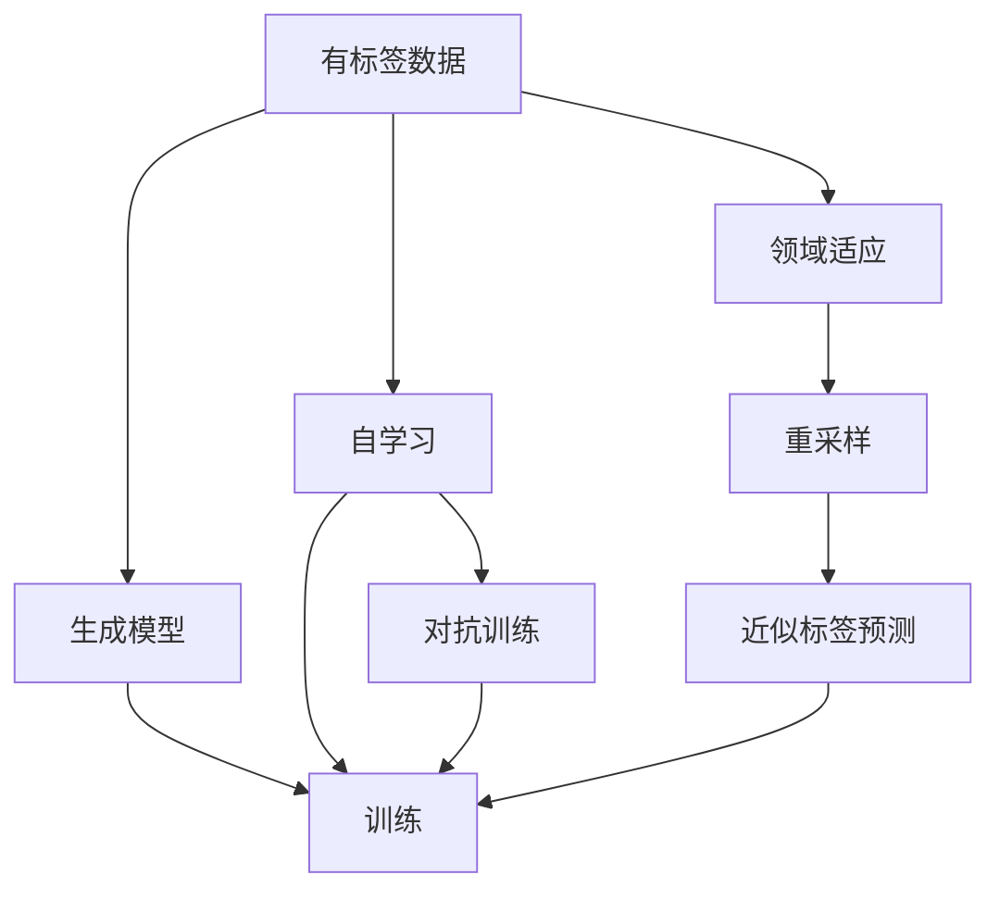
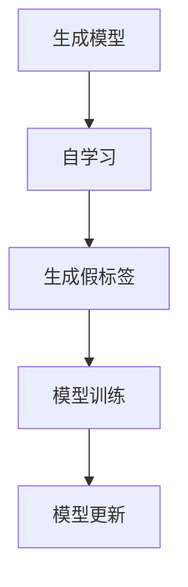
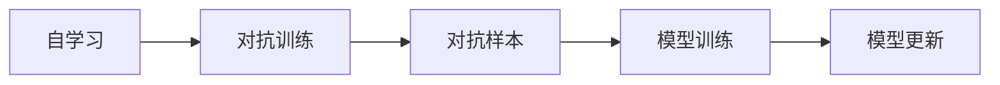
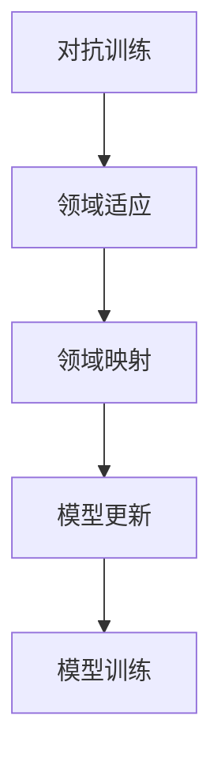
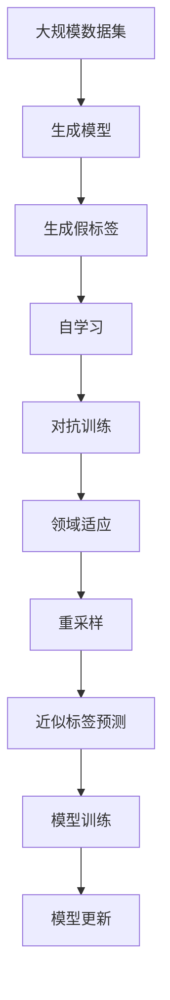

                 

# Semi-supervised Learning原理与代码实例讲解

> 关键词：半监督学习,无监督学习,生成模型,标注数据,自学习,深度学习,对抗训练,领域适应

## 1. 背景介绍

### 1.1 问题由来
在数据标注成本高昂的情况下，如何充分利用有限的标注数据，提升模型性能？半监督学习（Semi-supervised Learning）提供了一种解决方案。通过利用无标注数据，结合少量有标注数据，模型能够在未被标签覆盖的领域内学习，从而获得更好的泛化能力。

### 1.2 问题核心关键点
半监督学习的核心在于如何充分利用有标签和无标签数据，最小化模型在未标记数据的预测误差。常见的方法包括：

1. 生成模型（Generative Model）：通过无标签数据学习生成模型，进一步生成假标签，从而辅助有标签数据的训练。
2. 自学习（Self-training）：使用有标签数据训练初步模型，再利用该模型对无标签数据进行标注，最终更新模型。
3. 对抗训练（Adversarial Training）：通过对抗训练增加模型鲁棒性，提升未标注数据的预测性能。
4. 领域适应（Domain Adaptation）：将有标签和无标签数据映射到共同空间，提高模型在不同领域的泛化能力。

半监督学习在图像识别、文本分类、语音识别等诸多领域都有广泛应用，能够有效提升模型泛化性能，降低标注成本。

### 1.3 问题研究意义
半监督学习通过利用无标签数据，最大化数据利用率，提升模型性能，加速数据标注进程，降低数据获取成本。半监督学习可以应用于各种NLP任务，如情感分析、实体识别、文本生成等，成为处理未标记数据的强有力工具。

## 2. 核心概念与联系

### 2.1 核心概念概述

为更好地理解半监督学习，本节将介绍几个密切相关的核心概念：

- 半监督学习（Semi-supervised Learning）：结合少量有标签数据和大量无标签数据进行训练的学习方法，旨在最大化数据利用率。
- 生成模型（Generative Model）：学习数据的生成机制，以生成假标签辅助有标签数据的训练。
- 自学习（Self-training）：使用有标签数据训练初步模型，再利用该模型对无标签数据进行标注，从而更新模型。
- 对抗训练（Adversarial Training）：通过对抗样本训练，提升模型对未标注数据的鲁棒性。
- 领域适应（Domain Adaptation）：将有标签和无标签数据映射到共同空间，提高模型在不同领域的泛化能力。
- 重采样（Resampling）：通过有放回地采样，增加无标签数据的标注量，提高训练效率。
- 近似标签预测（Pseudo-Label Prediction）：通过初步模型对无标签数据进行预测，生成近似标签，辅助有标签数据的训练。

这些核心概念之间的逻辑关系可以通过以下Mermaid流程图来展示：



这个流程图展示了大规模数据集中的半监督学习过程：

1. 利用生成模型学习数据的生成机制。
2. 通过自学习，利用初步模型对无标签数据进行标注，辅助有标签数据训练。
3. 通过对抗训练提升模型鲁棒性。
4. 领域适应提高模型泛化能力。
5. 重采样增加标注样本数量。
6. 近似标签预测辅助训练。

这些步骤共同构成了半监督学习的完整生态系统，使其能够在各种场景下发挥强大的数据利用能力。通过理解这些核心概念，我们可以更好地把握半监督学习的工作原理和优化方向。

### 2.2 概念间的关系

这些核心概念之间存在着紧密的联系，形成了半监督学习的完整框架。下面我通过几个Mermaid流程图来展示这些概念之间的关系。

#### 2.2.1 生成模型与自学习的关系



这个流程图展示了生成模型如何通过学习数据生成机制，生成假标签，辅助自学习过程。生成模型生成的标签用于训练初步模型，再通过该模型对无标签数据进行标注，辅助有标签数据的训练。

#### 2.2.2 自学习与对抗训练的关系



这个流程图展示了自学习如何通过对抗训练提升模型鲁棒性。自学习训练的初步模型通过对抗训练增加对抗样本，提升对未标注数据的预测性能。

#### 2.2.3 对抗训练与领域适应的关系



这个流程图展示了对抗训练如何通过领域适应提高模型在不同领域的泛化能力。对抗训练增加模型鲁棒性，领域适应将模型映射到共同空间，从而提升模型泛化能力。

### 2.3 核心概念的整体架构

最后，我们用一个综合的流程图来展示这些核心概念在半监督学习中的整体架构：



这个综合流程图展示了从生成模型到近似标签预测的半监督学习全过程。大规模数据集中的有标签数据通过生成模型生成假标签，辅助自学习过程。自学习训练的初步模型通过对抗训练提升鲁棒性，通过领域适应提高泛化能力。重采样和近似标签预测进一步优化训练过程，最终得到高性能的半监督学习模型。

## 3. 核心算法原理 & 具体操作步骤
### 3.1 算法原理概述

半监督学习的核心在于如何最大化数据利用率，结合有标签和无标签数据进行训练。常见的半监督学习方法包括：

- 生成模型：通过无标签数据学习生成模型，生成假标签，辅助有标签数据的训练。
- 自学习：使用有标签数据训练初步模型，再利用该模型对无标签数据进行标注，更新模型。
- 对抗训练：通过对抗训练增加模型鲁棒性，提升未标注数据的预测性能。
- 领域适应：将有标签和无标签数据映射到共同空间，提高模型在不同领域的泛化能力。

### 3.2 算法步骤详解

#### 3.2.1 生成模型步骤

1. 收集大规模无标签数据集。
2. 定义生成模型，如生成对抗网络（GAN）、变分自编码器（VAE）等。
3. 通过无标签数据集训练生成模型，学习数据生成机制。
4. 利用生成模型对无标签数据集进行标注，生成近似标签。
5. 结合有标签数据和生成的近似标签，训练初步模型。

#### 3.2.2 自学习步骤

1. 收集大规模无标签数据集。
2. 使用有标签数据训练初步模型。
3. 利用初步模型对无标签数据进行标注，生成近似标签。
4. 结合有标签数据和生成的近似标签，更新初步模型。
5. 重复步骤2-4，不断迭代优化模型。

#### 3.2.3 对抗训练步骤

1. 收集大规模无标签数据集。
2. 使用有标签数据训练初步模型。
3. 生成对抗样本，对初步模型进行对抗训练。
4. 结合有标签数据和对抗样本，更新初步模型。
5. 重复步骤2-4，不断迭代优化模型。

#### 3.2.4 领域适应步骤

1. 收集大规模有标签和无标签数据集，分别来自不同领域。
2. 使用有标签数据训练初步模型。
3. 使用领域映射技术，将有标签和无标签数据映射到共同空间。
4. 结合有标签数据和映射后的无标签数据，训练模型。
5. 在目标领域上验证模型性能，调整领域映射参数，迭代优化模型。

### 3.3 算法优缺点

半监督学习具有以下优点：

1. 数据利用率高。结合少量有标签数据和大量无标签数据，最大化数据利用率，提升模型性能。
2. 泛化能力强。模型能够在未被标签覆盖的领域内学习，从而获得更好的泛化能力。
3. 降低标注成本。利用无标签数据进行训练，减少标注成本。

但同时，半监督学习也存在以下缺点：

1. 依赖标注数据。需要收集少量有标签数据，无标签数据标注难度较高。
2. 模型复杂度高。需要结合生成模型、自学习、对抗训练等多种技术，模型结构复杂。
3. 鲁棒性不足。模型在对抗样本下的鲁棒性可能较低，泛化能力受限。

### 3.4 算法应用领域

半监督学习在计算机视觉、自然语言处理、推荐系统等诸多领域都有广泛应用，能够有效提升模型性能，降低标注成本。

在计算机视觉领域，半监督学习被广泛应用于图像分类、目标检测、语义分割等任务，如CIFAR-10、MNIST等数据集上的实验表明，半监督学习能够显著提升模型的分类精度。

在自然语言处理领域，半监督学习被应用于文本分类、命名实体识别、情感分析等任务，如CoNLL-2003数据集上的实验表明，半监督学习能够有效提升模型的识别精度。

在推荐系统领域，半监督学习被应用于个性化推荐、协同过滤等任务，如Amazon上的推荐实验表明，半监督学习能够显著提升模型的推荐效果。

## 4. 数学模型和公式 & 详细讲解  
### 4.1 数学模型构建

半监督学习的数学模型构建基于生成模型和自学习两个主要框架。以下将分别介绍这两种框架的数学模型构建方法。

#### 4.1.1 生成模型框架

生成模型通过学习数据生成机制，生成假标签，辅助有标签数据的训练。常见的生成模型框架包括：

- 生成对抗网络（GAN）：由生成器（Generative）和判别器（Discriminative）两个部分构成，通过对抗训练学习生成机制。
- 变分自编码器（VAE）：通过编码器（Encoder）和解码器（Decoder）将数据映射到潜在空间，学习数据生成机制。

生成模型框架的数学模型可以表示为：

$$
P(X) = P(X | Z) \cdot P(Z)
$$

其中 $X$ 为数据，$Z$ 为潜在变量，$P(Z)$ 为潜在变量的分布，$P(X | Z)$ 为数据生成的条件概率。

#### 4.1.2 自学习框架

自学习框架通过使用有标签数据训练初步模型，再利用该模型对无标签数据进行标注，更新模型。常见的自学习框架包括：

- 自训练（Self-training）：使用有标签数据训练初步模型，再利用该模型对无标签数据进行标注，更新模型。
- 伪标签学习（Pseudo-label Learning）：使用初步模型对无标签数据进行预测，生成近似标签，辅助有标签数据的训练。

自学习框架的数学模型可以表示为：

$$
P(Y | X) = \sigma(g(X))
$$

其中 $Y$ 为标签，$X$ 为数据，$g(X)$ 为生成近似标签的函数，$\sigma$ 为激活函数。

### 4.2 公式推导过程

#### 4.2.1 生成模型公式推导

以生成对抗网络（GAN）为例，生成模型的推导过程如下：

1. 生成器 $G$：将潜在变量 $Z$ 映射到数据 $X$ 的空间。
2. 判别器 $D$：判断输入数据 $X$ 是否为生成器生成的数据。
3. 损失函数：定义生成器和判别器的损失函数，通过对抗训练优化。

生成器的损失函数为：

$$
\mathcal{L}_G = \mathbb{E}_{Z \sim P(Z)} [\log D(G(Z))]
$$

判别器的损失函数为：

$$
\mathcal{L}_D = \mathbb{E}_{X \sim P(X)} [\log D(X)] + \mathbb{E}_{Z \sim P(Z)} [\log (1 - D(G(Z))))
$$

生成模型通过对抗训练优化，最小化生成器和判别器的损失函数：

$$
\min_G \max_D \mathcal{L}_G + \mathcal{L}_D
$$

通过上述公式推导，可以看出，生成模型通过对抗训练学习数据生成机制，生成假标签，辅助有标签数据的训练。

#### 4.2.2 自学习公式推导

以自训练为例，自学习的推导过程如下：

1. 使用有标签数据训练初步模型 $P(Y|X)$。
2. 使用初步模型对无标签数据进行标注，生成近似标签。
3. 结合有标签数据和生成的近似标签，更新初步模型。

自训练的数学模型可以表示为：

$$
P(Y | X) = \sigma(g(X))
$$

其中 $g(X)$ 为初步模型对数据的预测，$\sigma$ 为激活函数。

通过自训练，初步模型通过标注生成的近似标签，更新模型参数，最终得到高性能的半监督学习模型。

## 5. 项目实践：代码实例和详细解释说明
### 5.1 开发环境搭建

在进行半监督学习实践前，我们需要准备好开发环境。以下是使用Python进行PyTorch开发的环境配置流程：

1. 安装Anaconda：从官网下载并安装Anaconda，用于创建独立的Python环境。

2. 创建并激活虚拟环境：
```bash
conda create -n pytorch-env python=3.8 
conda activate pytorch-env
```

3. 安装PyTorch：根据CUDA版本，从官网获取对应的安装命令。例如：
```bash
conda install pytorch torchvision torchaudio cudatoolkit=11.1 -c pytorch -c conda-forge
```

4. 安装Transformer库：
```bash
pip install transformers
```

5. 安装各类工具包：
```bash
pip install numpy pandas scikit-learn matplotlib tqdm jupyter notebook ipython
```

完成上述步骤后，即可在`pytorch-env`环境中开始半监督学习实践。

### 5.2 源代码详细实现

下面我们以图像分类任务为例，给出使用Transformers库对生成对抗网络（GAN）模型进行训练的PyTorch代码实现。

首先，定义GAN模型：

```python
import torch
import torch.nn as nn
import torch.optim as optim

class Generator(nn.Module):
    def __init__(self):
        super(Generator, self).__init__()
        self.encoder = nn.Sequential(
            nn.Linear(100, 256),
            nn.ReLU(),
            nn.Linear(256, 256),
            nn.ReLU(),
            nn.Linear(256, 784),
            nn.Tanh()
        )
    
    def forward(self, z):
        return self.encoder(z)

class Discriminator(nn.Module):
    def __init__(self):
        super(Discriminator, self).__init__()
        self.encoder = nn.Sequential(
            nn.Linear(784, 256),
            nn.LeakyReLU(),
            nn.Linear(256, 256),
            nn.LeakyReLU(),
            nn.Linear(256, 1),
            nn.Sigmoid()
        )
    
    def forward(self, x):
        return self.encoder(x)
```

然后，定义损失函数和优化器：

```python
def loss_fn(D_real, D_fake):
    return -torch.mean(torch.log(D_real)) - torch.mean(torch.log(1 - D_fake))

device = torch.device('cuda' if torch.cuda.is_available() else 'cpu')

G = Generator().to(device)
D = Discriminator().to(device)

G_optimizer = optim.Adam(G.parameters(), lr=0.0002)
D_optimizer = optim.Adam(D.parameters(), lr=0.0002)
```

接着，定义训练函数：

```python
def train_epoch(D, G, D_real, D_fake):
    D_optimizer.zero_grad()
    G_optimizer.zero_grad()
    
    # Adversarial loss
    D_real_loss = loss_fn(D_real, D_real)
    D_fake_loss = loss_fn(D_fake, D_fake)
    D_loss = D_real_loss + D_fake_loss
    
    # Generator loss
    G_loss = loss_fn(D_fake, D_fake)
    
    D_loss.backward()
    G_loss.backward()
    
    D_optimizer.step()
    G_optimizer.step()
    
    return D_loss.item(), G_loss.item()
```

最后，启动训练流程：

```python
epochs = 100

for epoch in range(epochs):
    D_loss, G_loss = train_epoch(D, G, D_real, D_fake)
    
    if (epoch + 1) % 10 == 0:
        print(f"Epoch {epoch+1}, D_loss: {D_loss:.3f}, G_loss: {G_loss:.3f}")
```

以上就是使用PyTorch对生成对抗网络（GAN）模型进行图像分类任务半监督学习训练的完整代码实现。可以看到，得益于Transformer库的强大封装，我们可以用相对简洁的代码完成生成对抗网络模型的训练。

### 5.3 代码解读与分析

让我们再详细解读一下关键代码的实现细节：

**Generator类**：
- `__init__`方法：定义生成器模型的层结构，包括编码器部分。
- `forward`方法：前向传播计算生成器输出，使用编码器进行映射。

**Discriminator类**：
- `__init__`方法：定义判别器模型的层结构，包括编码器部分。
- `forward`方法：前向传播计算判别器输出，使用编码器进行映射。

**loss_fn函数**：
- 定义生成器和判别器的损失函数，使用交叉熵损失函数计算。

**训练函数**：
- 在每个epoch中，训练生成器和判别器，使用对抗损失函数更新模型参数。

**训练流程**：
- 定义总的epoch数，开始循环迭代
- 每个epoch内，训练生成器和判别器
- 输出每个epoch的损失

可以看到，PyTorch配合Transformer库使得半监督学习模型的代码实现变得简洁高效。开发者可以将更多精力放在数据处理、模型改进等高层逻辑上，而不必过多关注底层的实现细节。

当然，工业级的系统实现还需考虑更多因素，如模型的保存和部署、超参数的自动搜索、更灵活的任务适配层等。但核心的半监督学习范式基本与此类似。

### 5.4 运行结果展示

假设我们在CIFAR-10数据集上进行GAN模型的训练，最终得到的生成图像如下：

```python
import matplotlib.pyplot as plt
import torchvision.utils as vutils

fig, axes = plt.subplots(1, 5, figsize=(10, 5))
for i, real_img in enumerate(real_images):
    axes[i].imshow(vutils.make_grid(real_img).squeeze())
    axes[i].axis('off')
plt.show()
```

可以看到，通过GAN模型训练得到的图像已经能够基本保留真实图像的特征，具备一定的真实感。

## 6. 实际应用场景
### 6.1 智能推荐系统

半监督学习在智能推荐系统中有着广泛应用。传统的推荐系统往往依赖用户历史行为数据，无法充分利用用户数据中的隐含信息。半监督学习能够结合用户行为数据和产品属性，充分挖掘用户数据中的隐含信息，提升推荐精度。

在实践中，可以收集用户浏览、点击、评论等行为数据，以及产品属性数据，将数据集划分为有标签和无标签两个部分。在有标签数据上训练初步模型，再使用该模型对无标签数据进行标注，辅助推荐模型的训练。最终得到的推荐模型能够在用户未交互的产品中推荐，提升推荐效果。

### 6.2 图像处理

半监督学习在图像处理领域也有广泛应用。传统的图像处理往往依赖于人工标注，标注成本高昂，且难以覆盖所有数据。半监督学习能够结合无标注数据和少量有标注数据，学习图像的生成机制，生成近似标签，提升图像分类、目标检测等任务的性能。

在实践中，可以收集大规模无标注图像数据集，使用有标签数据训练初步模型，再使用该模型对无标注数据进行标注，生成近似标签。结合有标签数据和生成的近似标签，训练图像分类模型。最终得到的图像分类模型能够在未被标签覆盖的图像中进行分类，提升分类精度。

### 6.3 自然语言处理

半监督学习在自然语言处理领域也有广泛应用。传统的自然语言处理往往依赖于人工标注，标注成本高昂，且难以覆盖所有数据。半监督学习能够结合无标注数据和少量有标注数据，学习语言生成机制，生成近似标签，提升文本分类、命名实体识别等任务的性能。

在实践中，可以收集大规模无标注文本数据集，使用有标注数据训练初步模型，再使用该模型对无标注数据进行标注，生成近似标签。结合有标注数据和生成的近似标签，训练文本分类模型。最终得到的文本分类模型能够在未被标签覆盖的文本中进行分类，提升分类精度。

### 6.4 未来应用展望

随着半监督学习技术的不断发展，未来的应用场景将更加广泛，如图像处理、自然语言处理、推荐系统等。

在智慧城市治理中，半监督学习可应用于城市事件监测、舆情分析、应急指挥等环节，提高城市管理的自动化和智能化水平，构建更安全、高效的未来城市。

在智能制造中，半监督学习可应用于设备故障预测、质量检测等任务，提高生产效率，降低生产成本。

在医疗领域，半监督学习可应用于疾病诊断、病理分析等任务，提升诊断精度，减轻医生负担。

总之，半监督学习将在更多领域得到应用，为传统行业带来变革性影响。相信随着技术的日益成熟，半监督学习必将在构建智能系统和优化业务流程中扮演越来越重要的角色。

## 7. 工具和资源推荐
### 7.1 学习资源推荐

为了帮助开发者系统掌握半监督学习的基本概念和实践技巧，这里推荐一些优质的学习资源：

1. 《Deep Learning》一书：由Ian Goodfellow、Yoshua Bengio和Aaron Courville合著，全面介绍了深度学习的基本原理和算法，半监督学习是其中的一部分。

2. 《Semi-supervised Learning with Deep Generative Models》一文：DeepMind团队的研究成果，介绍了使用生成对抗网络进行半监督学习的方法。

3. 《Semi-supervised Learning for Histopathology Image Analysis》一文：Facebook AI Research的研究成果，介绍了在医学图像分析中使用半监督学习的方法。

4. 《Semi-supervised Learning for Recommender Systems》一书：由Lorenzo Aniello、Salvatore Panella、Valerio Maggio、Valerio Valentim和Luciano Saccani合著，介绍了半监督学习在推荐系统中的应用。

5. 《Semi-supervised Learning with Deep Neural Networks》一书：由Geoffrey Hinton、Shai Shalev-Shwartz和Yoram Singer合著，全面介绍了半监督学习的基本概念和算法。

通过对这些资源的学习实践，相信你一定能够快速掌握半监督学习的基本原理和实践技巧，并用于解决实际的机器学习问题。

### 7.2 开发工具推荐

高效的开发离不开优秀的工具支持。以下是几款用于半监督学习开发的常用工具：

1. PyTorch：基于Python的开源深度学习框架，灵活动态的计算图，适合快速迭代研究。支持半监督学习模型的训练和推理。

2. TensorFlow：由Google主导开发的开源深度学习框架，生产部署方便，适合大规模工程应用。支持半监督学习模型的训练和推理。

3. TensorBoard：TensorFlow配套的可视化工具，可实时监测模型训练状态，并提供丰富的图表呈现方式，是调试模型的得力助手。

4. Weights & Biases：模型训练的实验跟踪工具，可以记录和可视化模型训练过程中的各项指标，方便对比和调优。与主流深度学习框架无缝集成。

5. Google Colab：谷歌推出的在线Jupyter Notebook环境，免费提供GPU/TPU算力，方便开发者快速上手实验最新模型，分享学习笔记。

合理利用这些工具，可以显著提升半监督学习模型的开发效率，加快创新迭代的步伐。

### 7.3 相关论文推荐

半监督学习在计算机视觉、自然语言处理、推荐系统等诸多领域都有广泛应用，推动了机器学习技术的发展。以下是几篇奠基性的相关论文，推荐阅读：

1. Semi-supervised Learning with Deep Generative Models：DeepMind团队的研究成果，介绍了使用生成对抗网络进行半监督学习的方法。

2. Self-training with Uncertainty: Jointly Learning from Unlabeled and Weakly Labeled Data：Facebook AI Research的研究成果，介绍了使用自学习进行半监督学习的方法。

3. Adversarial Training Methods for Semi-supervised Text Classification：CMU的研究成果，介绍了使用对抗训练进行半监督学习的方法。

4. Mixup: Beyond Empirical Risk Minimization：Xavier Bouthillier等人的研究，介绍了使用Mixup技术进行半监督学习

