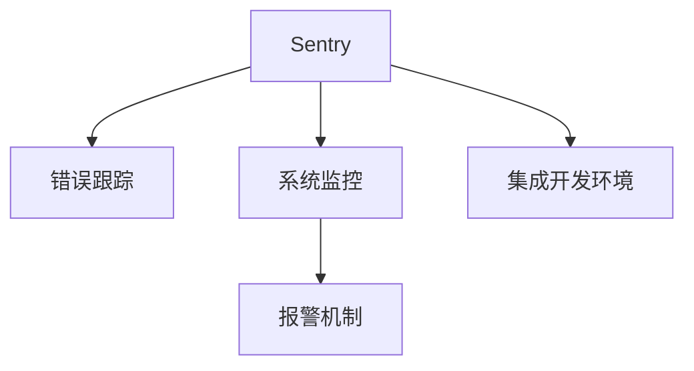
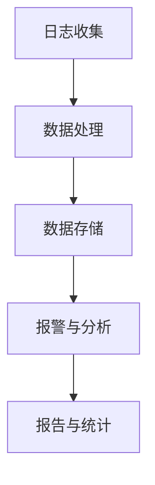
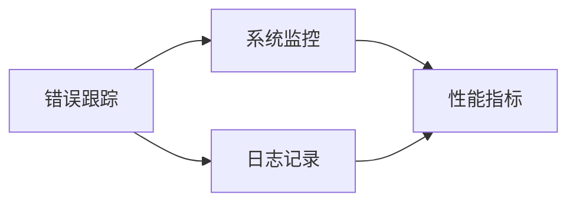
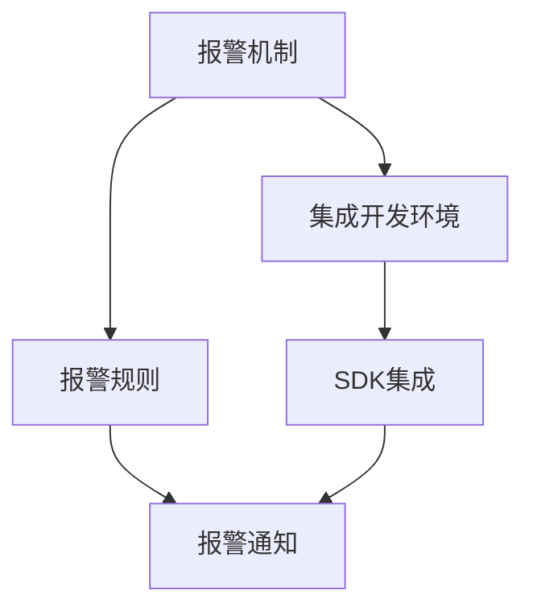
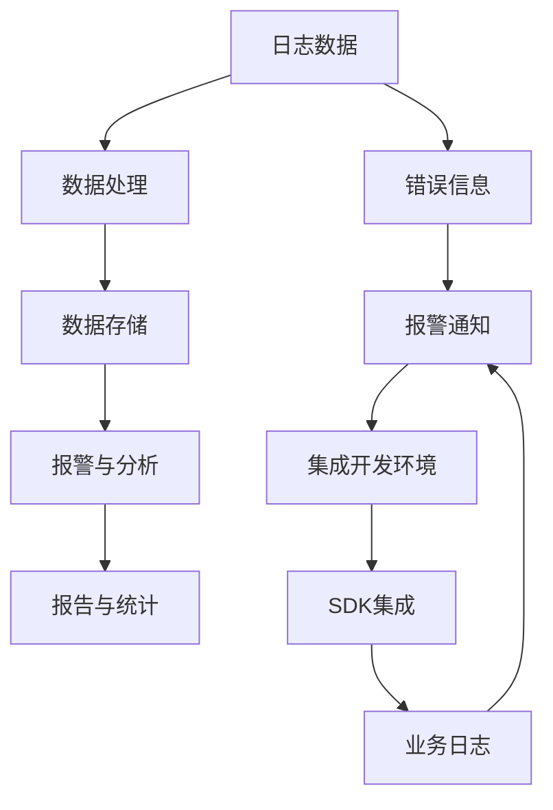

                 

# Sentry原理与代码实例讲解

> 关键词：Sentry, 错误跟踪, 系统监控, 分布式应用, Python SDK, 业务日志, 报警机制, 集成开发环境

## 1. 背景介绍

### 1.1 问题由来
在软件开发过程中，错误是难以避免的。为了更好地管理这些错误，错误跟踪和系统监控工具应运而生。其中，Sentry是当前最流行且功能最为丰富的错误监控系统之一。Sentry 的强大之处在于其深入的技术细节和广泛的兼容性，无论你是使用 Python、JavaScript、Node.js 还是其他语言，Sentry 都可以提供强大的错误监控和报警机制。

### 1.2 问题核心关键点
本文将深入探讨 Sentry 的工作原理、关键组件、数据模型以及应用实例。主要内容包括：

- Sentry 的核心架构和功能模块。
- 如何通过 Sentry 监控和记录应用错误。
- Sentry 的报警机制和集成开发环境。
- Sentry 的 Python SDK 和业务日志集成。

### 1.3 问题研究意义
研究 Sentry 的原理与代码实例，对于提升开发者监控系统性能、优化错误处理流程、以及确保软件质量具有重要意义：

1. 减少生产环境中的意外崩溃和错误。
2. 快速定位并修复错误，提升应用稳定性。
3. 通过数据分析提供洞察，指导后续开发和优化。
4. 统一错误日志记录，便于追踪和分析。
5. 集成到不同平台，提升开发效率。

## 2. 核心概念与联系

### 2.1 核心概念概述

为更好地理解 Sentry，本节将介绍几个关键概念：

- Sentry：一款流行的错误跟踪和系统监控工具，支持 Python、JavaScript、Node.js 等多种语言。
- 错误跟踪（Error Tracking）：记录并追踪应用中的错误和异常，提供详细错误信息，帮助开发者快速定位和解决问题。
- 系统监控（System Monitoring）：监控应用的服务状态、性能指标等，提供实时数据，帮助开发人员及时发现问题。
- 报警机制（Alerting Mechanism）：根据配置条件，自动发送报警通知，确保问题及时得到关注。
- 集成开发环境（IDE）：如 PyCharm、Visual Studio Code 等，通过插件或 SDK 集成 Sentry，提升开发效率。

这些概念通过以下 Mermaid 流程图来展示它们之间的关系：



这个流程图展示了 Sentry 的不同功能模块及其相互关系：

1. Sentry 提供了错误跟踪、系统监控等功能，帮助开发者更好地监控和管理应用。
2. 报警机制确保问题在第一时间得到解决，防止问题扩大。
3. 集成开发环境中的 Sentry 插件进一步提升了开发效率。

### 2.2 概念间的关系

这些核心概念之间存在着紧密的联系，形成了 Sentry 功能的完整生态系统。下面我们通过几个 Mermaid 流程图来展示这些概念之间的关系。

#### 2.2.1 Sentry的核心架构



这个流程图展示了 Sentry 的核心架构，包括日志收集、数据处理、数据存储、报警与分析以及报告与统计等关键组件。

#### 2.2.2 错误跟踪与系统监控的关系



这个流程图展示了错误跟踪和系统监控之间的联系。通过记录日志，系统监控能够获取应用性能指标，进而发现潜在问题。

#### 2.2.3 报警机制与集成开发环境的关系



这个流程图展示了报警机制和集成开发环境之间的关系。报警机制通过设置规则，自动发送通知，而集成开发环境中的 Sentry 插件则进一步简化了配置过程。

### 2.3 核心概念的整体架构

最后，我们用一个综合的流程图来展示这些核心概念在大语言模型微调过程中的整体架构：



这个综合流程图展示了从日志数据到报警通知的完整流程，以及 Sentry 如何与其他组件协同工作。

## 3. 核心算法原理 & 具体操作步骤
### 3.1 算法原理概述

Sentry 的核心算法原理主要围绕日志收集、数据处理和报警机制展开。

1. **日志收集**：Sentry 通过 SDK 收集应用的错误日志和业务日志，将日志信息存储在数据库中。
2. **数据处理**：Sentry 对收集到的日志进行格式化和聚合，生成有用信息。
3. **报警机制**：根据用户设置的报警规则，Sentry 自动发送报警通知。

### 3.2 算法步骤详解

以下是 Sentry 的详细操作步骤：

1. **安装 SDK**：根据应用的语言选择相应的 SDK，例如 Sentry for Python 或 Sentry for JavaScript。
2. **配置项目**：在 Sentry 中创建项目，设置项目名称、Dsn 等信息，创建组织和用户。
3. **集成日志**：在应用中集成 Sentry 日志收集功能，记录错误和业务日志。
4. **配置报警规则**：根据业务需求设置报警规则，选择报警方式（如邮件、短信、Slack 等）。
5. **监控与分析**：通过 Sentry 仪表板监控应用状态，分析错误日志和性能指标。
6. **报警与通知**：当发生符合报警规则的事件时，Sentry 自动发送报警通知，通知开发人员及时处理。

### 3.3 算法优缺点

Sentry 的优点包括：

- **实时监控**：Sentry 能够实时监控应用状态，及时发现问题。
- **全面支持**：支持多种语言和平台，能够集成到不同的开发环境。
- **可视化报告**：提供丰富的可视化仪表板，帮助开发者快速定位问题。
- **自定义报警**：支持自定义报警规则，确保问题及时得到解决。

Sentry 的缺点包括：

- **配置复杂**：初期配置需要花费较多时间，尤其是错误规则的设置。
- **数据存储**：需要一定的存储空间，不适合存储大量非关键数据。
- **付费成本**：某些高级功能需要付费订阅，增加了使用成本。

### 3.4 算法应用领域

Sentry 的应用领域非常广泛，包括但不限于以下几个方面：

- **Web 应用**：监控网站的错误、异常和性能指标。
- **移动应用**：收集移动应用中的错误和崩溃信息。
- **桌面应用**：监控桌面应用的错误和异常。
- **服务器和后端服务**：监控服务器和后端服务的异常和错误。
- **大数据应用**：监控大数据平台的错误和异常。

## 4. 数学模型和公式 & 详细讲解 & 举例说明

### 4.1 数学模型构建

假设 Sentry 收集到一个错误日志：

```python
import sentry_sdk
from sentry_sdk import capture_exception

sentry_sdk.init(dsn='...')

try:
    # 触发错误
    1 / 0
except Exception as e:
    capture_exception(e)
```

### 4.2 公式推导过程

Sentry 记录错误日志的数学模型如下：

$$
\text{日志记录} = f(\text{错误类型}, \text{错误时间}, \text{错误上下文}, \text{错误堆栈})
$$

其中，错误类型、错误时间和错误上下文均为文本数据，错误堆栈为栈帧信息。

### 4.3 案例分析与讲解

假设我们记录了一条错误日志，信息如下：

```
TypeError: unsupported operand type(s) for +: 'int' and 'str'
```

我们将其分解为几个关键信息：

- **错误类型**：TypeError
- **错误时间**：2023-04-01 15:30:00
- **错误上下文**：在执行 `int + str` 时发生错误
- **错误堆栈**：

```python
Traceback (most recent call last):
  File "example.py", line 5, in <module>
    result = int("hello") + str(1)
TypeError: unsupported operand type(s) for +: 'int' and 'str'
```

通过这些信息，Sentry 能够帮助开发人员快速定位和解决问题。

## 5. 项目实践：代码实例和详细解释说明
### 5.1 开发环境搭建

在进行 Sentry 实践前，我们需要准备好开发环境。以下是使用 Python 进行 Sentry 开发的环境配置流程：

1. 安装 Sentry SDK：

```bash
pip install sentry-sdk
```

2. 配置项目：

```python
import sentry_sdk
from sentry_sdk import capture_exception

sentry_sdk.init(dsn='...', integrations=[])
```

3. 记录错误日志：

```python
try:
    # 触发错误
    1 / 0
except Exception as e:
    capture_exception(e)
```

4. 配置报警规则：

```python
sentry_sdk.set_alert_rules(
    [
        {
            "when": {
                "occurrences": {
                    "any": 3,
                }
            },
            "message": "Too many errors, please check your application"
        }
    ]
)
```

完成上述步骤后，即可在 Python 环境中开始 Sentry 实践。

### 5.2 源代码详细实现

这里我们以 Python 应用为例，给出一个使用 Sentry SDK 记录错误日志的完整代码实现。

首先，定义一个简单的 Python 脚本：

```python
import sentry_sdk
from sentry_sdk import capture_exception

sentry_sdk.init(dsn='...', integrations=[])
try:
    # 触发错误
    1 / 0
except Exception as e:
    capture_exception(e)
```

然后，使用 Sentry 仪表板对错误日志进行配置和监控：

1. 创建一个 Sentry 项目，设置 DSN。
2. 在 Sentry 仪表板中配置报警规则。
3. 通过 Sentry 仪表板监控错误日志。

### 5.3 代码解读与分析

让我们再详细解读一下关键代码的实现细节：

**sentry_sdk.init**方法：
- 初始化 Sentry SDK，设置 DSN 和集成。
- DSN（Data Source Name）是一个字符串，用于标识 Sentry 项目。

**capture_exception**方法：
- 记录错误日志，将其发送到 Sentry 服务器。
- 通过异常对象 `e` 获取错误信息。

**set_alert_rules**方法：
- 设置报警规则，当符合条件的错误日志数量超过指定值时，自动发送报警通知。

**try-except**代码块：
- 尝试执行可能抛出异常的代码。
- 当发生异常时，调用 `capture_exception` 记录错误日志。

### 5.4 运行结果展示

假设我们在 Sentry 仪表板中设置了报警规则，当错误日志数量超过 3 条时发送报警通知。那么在触发 3 条错误日志后，Sentry 会自动发送报警通知，通知开发人员及时处理。

## 6. 实际应用场景

### 6.1 智能客服系统

基于 Sentry 的错误监控，智能客服系统能够及时发现并修复系统异常，确保客服服务的稳定性和响应速度。

在技术实现上，可以收集客服系统的错误日志，通过 Sentry 仪表板进行监控和报警。一旦系统出现异常，Sentry 会自动发送通知，开发人员可以及时处理，确保系统稳定运行。

### 6.2 金融舆情监测

在金融领域，Sentry 能够监控金融系统的错误和异常，及时发现潜在风险。

具体而言，可以收集金融系统的错误日志，通过 Sentry 仪表板进行监控和报警。一旦系统出现异常，Sentry 会自动发送通知，开发人员可以及时处理，确保系统安全运行。

### 6.3 个性化推荐系统

个性化推荐系统需要实时处理用户请求，Sentry 能够监控系统错误，确保推荐服务的稳定性。

在技术实现上，可以收集推荐系统的错误日志，通过 Sentry 仪表板进行监控和报警。一旦系统出现异常，Sentry 会自动发送通知，开发人员可以及时处理，确保推荐服务稳定运行。

### 6.4 未来应用展望

随着 Sentry 技术的不断进步，未来将会有更多创新应用场景，例如：

1. 自动化报警处理：通过 AI 技术自动分析报警信息，自动修复常见问题。
2. 机器学习算法：基于错误日志进行数据分析，预测系统未来的错误趋势。
3. 多系统集成：将 Sentry 集成到更多系统中，提升整体监控能力。
4. 实时监控和分析：实现更细粒度的监控和更深入的分析。

总之，Sentry 在软件开发中的应用前景广阔，随着技术的不断进步，未来将会有更多创新应用，为开发者和用户带来更多价值。

## 7. 工具和资源推荐
### 7.1 学习资源推荐

为了帮助开发者系统掌握 Sentry 的理论基础和实践技巧，这里推荐一些优质的学习资源：

1. Sentry 官方文档：Sentry 提供了详细的文档和教程，帮助你了解 Sentry 的各种功能和用法。
2. Sentry 博客：Sentry 官方博客提供了大量的技术文章和案例，帮助你深入了解 Sentry 的原理和实践。
3. Sentry 社区：Sentry 社区是 Sentry 用户交流和分享的平台，提供了大量的实用信息和经验。
4. PyCharm 插件：PyCharm 插件集成了 Sentry，提供了更多的开发便利。
5. Visual Studio Code 插件：Visual Studio Code 插件集成了 Sentry，提供了更多的开发便利。

通过对这些资源的学习实践，相信你一定能够快速掌握 Sentry 的精髓，并用于解决实际的错误监控问题。

### 7.2 开发工具推荐

高效的开发离不开优秀的工具支持。以下是几款用于 Sentry 开发和管理的常用工具：

1. PyCharm：支持 Sentry 插件，提供更多的开发便利。
2. Visual Studio Code：支持 Sentry 插件，提供更多的开发便利。
3. Jenkins：CI/CD 工具，支持 Sentry 集成，自动监控和报警。
4. GitLab：CI/CD 工具，支持 Sentry 集成，自动监控和报警。
5. New Relic：性能监控工具，支持 Sentry 集成，提升应用监控能力。

合理利用这些工具，可以显著提升 Sentry 监控的效率和效果，加快错误定位和修复的步伐。

### 7.3 相关论文推荐

Sentry 的技术发展源于学界的持续研究。以下是几篇奠基性的相关论文，推荐阅读：

1. "Monitoring and Alerting: An Introduction"：概述了监控和报警的基本原理和技术。
2. "Event Correlation and Analysis: A Survey"：介绍了事件关联和分析的方法和技术。
3. "Real-Time Monitoring: A Survey"：介绍了实时监控的方法和技术。
4. "Machine Learning in Monitoring"：介绍了机器学习在监控中的应用。
5. "Unified Monitoring and Observability: A Survey"：介绍了统一监控和可视化的框架和方法。

这些论文代表了大语言模型微调技术的发展脉络。通过学习这些前沿成果，可以帮助研究者把握学科前进方向，激发更多的创新灵感。

除上述资源外，还有一些值得关注的前沿资源，帮助开发者紧跟 Sentry 技术的最新进展，例如：

1. arXiv论文预印本：人工智能领域最新研究成果的发布平台，包括大量尚未发表的前沿工作，学习前沿技术的必读资源。
2. 业界技术博客：如 Sentry 官方博客、Google Cloud、Microsoft Azure 等顶尖实验室的官方博客，第一时间分享他们的最新研究成果和洞见。
3. 技术会议直播：如 KubeCon、Microsoft Ignite、Google I/O 等技术会议现场或在线直播，能够聆听到大佬们的前沿分享，开拓视野。
4. GitHub热门项目：在 GitHub 上 Star、Fork数最多的 Sentry 相关项目，往往代表了该技术领域的发展趋势和最佳实践，值得去学习和贡献。
5. 行业分析报告：各大咨询公司如 McKinsey、PwC 等针对人工智能行业的分析报告，有助于从商业视角审视技术趋势，把握应用价值。

总之，对于 Sentry 技术的掌握和学习，需要开发者保持开放的心态和持续学习的意愿。多关注前沿资讯，多动手实践，多思考总结，必将收获满满的成长收益。

## 8. 总结：未来发展趋势与挑战

### 8.1 总结

本文对 Sentry 的工作原理、核心算法、操作步骤以及应用实例进行了全面系统的介绍。首先阐述了 Sentry 的核心架构和功能模块，明确了其在错误跟踪、系统监控、报警机制等方面的强大功能。其次，通过详细讲解 Sentry 的代码实现，展示了如何使用 Sentry 监控和记录应用错误。最后，展示了 Sentry 在智能客服系统、金融舆情监测、个性化推荐系统等实际应用场景中的具体应用，展现了其广泛的适用性和卓越的性能。

通过本文的系统梳理，可以看到 Sentry 在错误监控领域的巨大潜力，它通过实时监控和报警机制，帮助开发者快速定位和修复错误，提升应用稳定性。未来，伴随技术的不断进步，Sentry 必将在更多领域发挥重要作用，成为开发者不可或缺的工具。

### 8.2 未来发展趋势

展望未来，Sentry 的发展趋势包括：

1. **实时监控能力提升**：通过更先进的算法和更高效的数据处理，Sentry 将实现更快速、更精准的实时监控。
2. **高级报警机制**：引入更多智能算法，如机器学习、自然语言处理等，提供更精细化的报警服务。
3. **多系统集成**：支持更多平台和语言，实现更全面的系统监控和报警。
4. **自动化报警处理**：引入自动化算法，自动分析报警信息，自动修复常见问题。
5. **更丰富的可视化仪表板**：提供更多可视化图表和仪表板，帮助开发者更好地理解应用状态和错误日志。

以上趋势凸显了 Sentry 监控系统的强大潜力和广阔前景，它将继续推动软件开发和管理向智能化、自动化方向发展。

### 8.3 面临的挑战

尽管 Sentry 在错误监控方面取得了卓越成效，但在实际应用中也面临着一些挑战：

1. **复杂配置**：Sentry 的配置复杂，需要开发者投入大量时间和精力进行初期设置。
2. **数据存储**：大量的错误日志需要存储空间，增加了系统成本。
3. **报警噪音**：过多的报警通知可能导致开发人员忽视重要信息。
4. **误报率高**：误报率高可能导致开发人员频繁响应，浪费时间和精力。
5. **性能瓶颈**：在大规模系统中，Sentry 的性能瓶颈可能会影响整体监控效果。

这些挑战需要通过技术创新和优化来克服，以确保 Sentry 的长期稳定发展和高效应用。

### 8.4 研究展望

面对 Sentry 面临的挑战，未来的研究需要在以下几个方面寻求新的突破：

1. **自动化配置**：开发自动化配置工具，减少初始设置时间。
2. **数据压缩**：优化数据存储方案，降低存储空间需求。
3. **智能报警**：引入智能算法，优化报警规则，减少噪音。
4. **机器学习应用**：引入机器学习算法，提升误报率。
5. **分布式监控**：优化分布式监控算法，提升性能。

这些研究方向的探索，必将引领 Sentry 监控技术迈向更高的台阶，为开发者和用户带来更多价值。

## 9. 附录：常见问题与解答

**Q1：如何选择合适的 Sentry 报警规则？**

A: 报警规则的设置需要考虑业务需求和系统特性，通常可以按照以下步骤进行：
1. 确定关键业务指标（KPI），如错误日志数量、请求响应时间等。
2. 设置报警阈值，如错误日志数量超过 10 条时发送报警通知。
3. 选择报警方式，如邮件、短信、Slack 等。

**Q2：Sentry 如何处理大量的错误日志？**

A: Sentry 通过分布式日志收集和分布式数据处理，能够高效处理大量的错误日志。Sentry 的分布式架构支持多节点协同工作，能够提升处理能力和扩展性。

**Q3：Sentry 如何进行业务日志集成？**

A: Sentry 支持多种业务日志集成，包括本地日志文件、日志文件旋转、ELK Stack 等。开发者可以通过 SDK 或插件实现业务日志的集成和监控。

**Q4：Sentry 如何在多语言应用中工作？**

A: Sentry 支持多种语言和平台，能够集成到不同的开发环境。开发者可以使用相应的 SDK 实现多语言应用中的错误日志记录和监控。

**Q5：如何确保 Sentry 监控的准确性和全面性？**

A: 为了确保 Sentry 监控的准确性和全面性，需要进行定期维护和优化：
1. 定期检查报警规则，确保规则的设置合理。
2. 定期收集和分析错误日志，优化日志收集和处理方案。
3. 定期更新 SDK 和插件，确保监控系统与新功能兼容。

这些方法可以帮助开发者确保 Sentry 监控的准确性和全面性，提升监控系统的性能和效率。

---

作者：禅与计算机程序设计艺术 / Zen and the Art of Computer Programming

